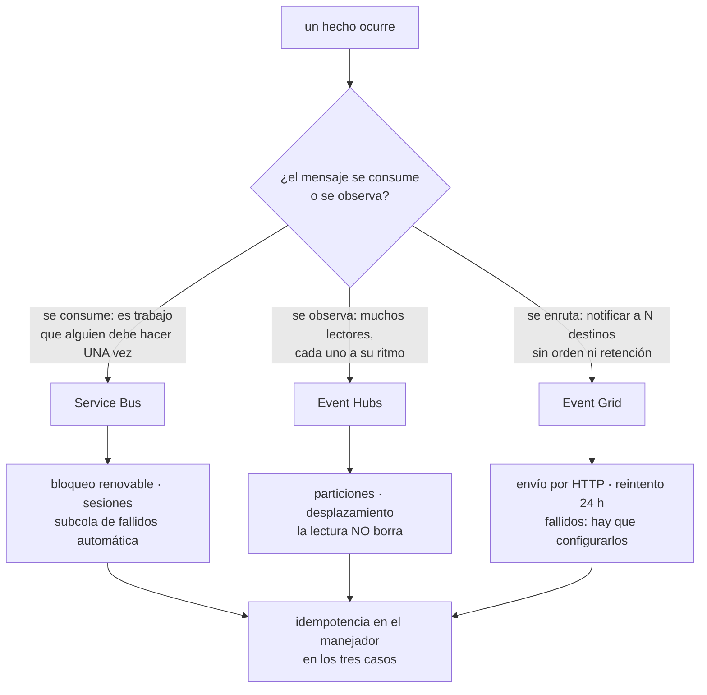

# 044 — Service Bus, Event Grid y Event Hubs

> [← 043 · App Service, Functions y Container Apps](../../part-03-azure-core-platform/043-app-service-functions-y-container-apps/README.md) · [Índice de la parte](../README.md) · [045 · Azure Monitor, Log Analytics y Application Insights →](../../part-03-azure-core-platform/045-azure-monitor-log-analytics-y-application-insights/README.md)

**Parte:** 03 — Azure: plataforma esencial<br>
**Nivel:** intermedio · **Horas estimadas:** 4<br>
**Laboratorio:** `messaging` · **Estado:** `EXECUTABLE_CORE`

## 🎯 Propósito

Repartir el trabajo asíncrono entre los tres servicios de mensajería de Azure a partir de una sola pregunta que casi nunca se hace: ¿el mensaje se consume o se observa? Confundirla lleva a poner órdenes de pedido en un registro de eventos que nunca las borra, sin cola de mensajes fallidos y con un evento envenenado bloqueando una partición entera. La clase 033 dejó el criterio de la entrega y la idempotencia; aquí cambian las piezas y aparecen tres relojes —el bloqueo, la ventana de duplicados y el reintento— que hay que dimensionar juntos.

## 📚 Resultados de aprendizaje

Al finalizar podrás:

1. **Elegir** entre Service Bus, Event Grid y Event Hubs según si el mensaje se consume, se enruta o se observa.
2. **Dimensionar** la duración del bloqueo frente al tiempo real de proceso y explicar qué ocurre cuando el primero es menor.
3. **Configurar** el traslado automático a mensajes fallidos y una alerta sobre él, en los tres servicios.
4. **Distinguir** la detección de duplicados —con ventana acotada— de la idempotencia del manejador.
5. **Decidir** el número de particiones sabiendo qué se rompe al cambiarlo después.

## 🧩 Conceptos centrales

| Concepto | Comprensión verificable |
|---|---|
| `bloqueo por inspección` | Modo de recepción en el que el mensaje queda reservado un tiempo en vez de borrarse. Equivale al tiempo de invisibilidad de la clase 033 y añade algo que aquel no tiene: **se puede renovar**. |
| `subcola de mensajes fallidos` | Destino automático de un mensaje que agota su cuenta de entregas. En Service Bus **existe siempre**, cuelga de la propia entidad y registra el motivo en `DeadLetterReason`. |
| `sesión` | Agrupación que garantiza orden dentro de un identificador. Una sesión la bloquea **un único consumidor**, así que una sesión con mucho tráfico serializa todo su trabajo. |
| `detección de duplicados` | Descarte de mensajes con el mismo identificador dentro de una **ventana temporal acotada**. Fuera de la ventana no descarta nada: no sustituye a la idempotencia. |
| `grupo de consumidores y punto de control` | En Event Hubs, la lectura no borra: cada grupo avanza su propio marcador. Si el punto de control se guarda poco, un reinicio reprocesa desde el último guardado. |
| `unidad de rendimiento` | Unidad de capacidad de Event Hubs: ~1 MB/s de entrada y 2 MB/s de salida. El inflado automático **sube y no baja**: lo que escala una prueba de carga se paga todo el mes. |

## 🧠 Modelo mental

En Azure, identidad y jerarquía organizacional preceden al recurso: tenant, management group, suscripción y resource group determinan el alcance de control.

Aplicado a esta clase, separa siempre cuatro planos: **intención** (qué necesita el usuario),
**configuración** (qué declaramos), **estado observado** (qué existe de verdad) y
**evidencia** (cómo sabemos que cumple). Confundirlos produce diseños que se ven correctos
en un diagrama pero fallan al operar.

## 🗺️ Flujo de razonamiento



## 📖 Desarrollo

### 1. Una pregunta decide el servicio: ¿se consume o se observa?

Los tres nombres contienen la palabra «evento» o «bus» y eso lleva a elegir por eufonía. La pregunta que separa de verdad es otra:

```text
¿el mensaje representa TRABAJO que alguien debe hacer exactamente una vez?
   → Service Bus.  Se consume: al completarlo, desaparece.

¿el mensaje representa un HECHO que varios interesados leen a su ritmo?
   → Event Hubs.  Se observa: leerlo no lo borra, y otro puede releerlo.

¿el mensaje es una NOTIFICACIÓN que hay que repartir a destinos que no conozco?
   → Event Grid.  Se enruta: se entrega por HTTP y no se guarda.
```

La tabla que hace operativa esa elección:

| | Service Bus | Event Hubs | Event Grid |
|---|---|---|---|
| Modelo | Cola y tema con suscripciones | Registro con particiones | Enrutador de sucesos |
| ¿Leer borra? | Sí, al completar | **No** | No aplica: se envía |
| Retención | Hasta completar o caducar | 1-7 días (90 en premium) | Solo reintentos |
| Orden | Por sesión | **Por partición** | Sin garantía |
| Mensajes fallidos | **Automático** | No existe | Configurable, apagado por defecto |
| Tamaño | 256 KB (100 MB en premium) | 1 MB | 1 MB |
| Se paga por | Operación o unidad de mensajería | Unidad de rendimiento | Operación |

La fila de mensajes fallidos es la que más consecuencias tiene. En Service Bus la subcola existe siempre y recoge lo que falla; en Event Hubs **no hay tal cosa**, porque el modelo no es de consumo: un evento que el consumidor no sabe procesar se queda en su sitio y, si el consumidor reintenta desde el mismo desplazamiento, **bloquea la partición entera** — nada posterior se procesa hasta que alguien intervenga. Poner órdenes de pedido en Event Hubs por creer que es «el servicio de eventos» es el error de diseño más caro de esta clase.

El reparto habitual en una plataforma como CloudShop, escrito para no rediscutirlo:

```text
Service Bus   crear pedido · cobrar · emitir factura · enviar correo
              trabajo con dueño, con reintentos y con fallo visible

Event Hubs    clics, telemetría de la aplicación, eventos de stock
              volumen alto, varios consumidores, se puede releer

Event Grid    "se subió un blob" · "se creó un recurso" · "se desplegó"
              reacción a hechos de la plataforma y notificación a terceros
```

Y un uso de Event Grid que rentabiliza el trabajo de las clases anteriores: **todos los recursos de Azure emiten eventos**. Un blob nuevo en el contenedor de facturas dispara la función que lo indexa; la creación de un recurso sin etiquetas dispara la corrección de gobierno de la clase 037. Es la vía por la que la plataforma reacciona a sí misma sin sondeos periódicos.

### 2. El bloqueo, el reloj que casi nunca se dimensiona

Service Bus recibe de dos formas, y solo una es defendible en producción:

```text
recibir y borrar    el mensaje desaparece al entregarse
                    si el proceso falla después, el trabajo se pierde
bloqueo por inspección  el mensaje queda reservado; hay que completarlo,
                    abandonarlo o trasladarlo a fallidos explícitamente
```

El bloqueo cumple la función del tiempo de invisibilidad de la clase 033 y añade una capacidad que aquel no tiene: **se puede renovar**. Esa diferencia cambia el diseño.

La duración máxima del bloqueo es de cinco minutos. Si el manejador tarda más y nadie renueva:

```text
t+0:00  se entrega el mensaje, bloqueo de 5 min
t+5:00  el bloqueo expira; el mensaje vuelve a estar disponible
t+5:01  OTRO consumidor lo recibe y empieza a procesarlo
t+6:20  el primero termina y llama a completar
        → MessageLockLostException
t+7:40  el segundo también termina
        → el pedido se ha cobrado dos veces
```

La secuencia importa porque el error aparece **al final**, cuando el daño ya está hecho. Y el `MessageLockLostException` en el registro se suele leer como un fallo transitorio del SDK.

Tres respuestas, de mejor a peor:

```text
1. sacar el trabajo largo del manejador
   el mensaje dispara el proceso, no lo ejecuta
2. renovar el bloqueo mientras se trabaja
   los SDK lo hacen automáticamente SI el hilo no está bloqueado
3. subir la duración del bloqueo
   tope de 5 minutos: solo mueve el problema un poco más allá
```

La segunda tiene una letra pequeña que produce incidentes reproducibles: la renovación automática ocurre en segundo plano y **necesita que el hilo pueda ejecutarse**. Un manejador que bloquea el hilo con una llamada síncrona impide su propia renovación, así que el bloqueo caduca justo en los casos lentos, que son los que más lo necesitan.

El **traslado automático a fallidos** es la otra mitad, y en Azure viene puesto:

```text
MaxDeliveryCount = 10 por defecto
al superarlo → subcola de fallidos de la propia entidad
```

No hay que crear ninguna cola ni configurar ninguna política de reenvío: existe. Y como existe sin que nadie la pida, también se llena sin que nadie la mire. El motivo queda registrado y es la primera cosa que hay que consultar:

```bash
$ az servicebus queue show -g rg-msg --namespace-name sb-cloudshop -n pedidos \
    --query "countDetails.deadLetterMessageCount" -o tsv
8412
```

```text
DeadLetterReason
  MaxDeliveryCountExceeded   el manejador falló 10 veces: mira su excepción
  TTLExpiredException        caducó sin que nadie lo consumiera
  HeaderSizeExceeded         propiedades demasiado grandes
  <motivo propio>            el manejador lo trasladó a propósito
```

La distinción entre las dos primeras es diagnóstica: la primera es un consumidor que falla, la segunda es un consumidor que **no está**. Y la alerta que hay que tener en los tres servicios es la misma y casi nunca está: **cuenta de mensajes fallidos mayor que cero durante N minutos**. Un sistema asíncrono sano no acumula fallidos; que los acumule en silencio es la forma en que se pierde trabajo sin que nadie reciba un error.

### 3. Detección de duplicados, sesiones y filtros: lo que garantizan y lo que no

La clase 033 separó el duplicado de entrega del fallo de idempotencia. Azure ofrece un mecanismo que parece resolverlo y solo cubre una parte:

```text
detección de duplicados
  descarta mensajes con el mismo MessageId
  DENTRO de una ventana temporal
  por defecto 30 s; hasta 7 días en premium
```

La ventana es el detalle que decide. Un cliente que reintenta a los 45 segundos con la ventana en 30 **crea un duplicado real**, y el sistema lo entrega dos veces. Además la ventana consume almacenamiento y capacidad: fijarla en siete días para «asegurarse» tiene un precio y sigue sin cubrir el reintento manual de un operador tres semanas después.

La conclusión es la de la clase 033, reforzada: **la detección de duplicados reduce el ruido; la idempotencia del manejador es la que garantiza corrección**. Un manejador idempotente hace innecesaria la primera; la primera nunca hace innecesario al segundo.

```python
def manejar(mensaje):
    clave = mensaje.application_properties[b"idempotency-key"].decode()
    if repositorio.ya_procesado(clave):        # la garantía real
        return                                  # completar sin reejecutar
    with repositorio.transaccion():
        aplicar_efecto(mensaje)
        repositorio.marcar_procesado(clave)     # en la MISMA transacción
```

La última línea es la que hace que funcione: marcar y aplicar el efecto en la misma transacción. Marcadas por separado, un fallo entre ambas reproduce exactamente el problema que se quería evitar.

Las **sesiones** dan orden dentro de un identificador —todos los mensajes de un pedido, en secuencia— y tienen un costo estructural que hay que anticipar: una sesión la bloquea **un único consumidor**, así que dentro de una sesión no hay paralelismo. Si el identificador de sesión es demasiado grueso, se ha construido una cola de un solo hilo:

```text
sesión = idPedido      miles de sesiones, buen reparto            ✓
sesión = idTienda      una tienda grande serializa todo su trabajo ✗
sesión = "pedidos"     una sola sesión: concurrencia = 1          ✗✗
```

Es el mismo razonamiento de la clave de partición de la clase 042: **la unidad de orden es también la unidad de serialización**. Solo se pide orden donde el negocio lo exige, y con el identificador más fino que lo satisfaga.

Los **temas con suscripciones y filtros** sustituyen al abanico de la clase 033, con dos matices:

```bash
$ az servicebus topic subscription rule create -g rg-msg \
    --namespace-name sb-cloudshop --topic-name pedidos --subscription-name facturacion \
    --name solo-pagados --correlation-filter properties.estado=pagado
```

**Primero**: un filtro de correlación —igualdad sobre propiedades— se evalúa mucho más barato que uno con sintaxis SQL. Con volumen alto, la diferencia es de factura.

**Segundo**: una suscripción **sin ninguna regla recibe todo**, y una suscripción creada hoy no recibe lo publicado ayer. La primera produce consumidores que procesan mensajes que no les tocaban; la segunda produce el hueco de datos al añadir un consumidor nuevo, que hay que rellenar a mano si importaba.

Y una decisión de nivel que se toma tarde y duele: el nivel estándar es multiinquilino, **factura por operación** y puede limitar; el premium reserva unidades de mensajería, da latencia predecible, admite mensajes de 100 MB y es el único que acepta punto de conexión privado. Ese último punto conecta con la clase 039: si la plataforma cerró los accesos públicos, el nivel estándar no puede participar. El salto de precio es considerable, así que conviene decidirlo con el diseño de red delante y no cuando ya no hay alternativa.

### 4. Event Hubs: particiones, puntos de control y el inflado que no desinfla

Event Hubs es un registro particionado, no una cola. Las tres consecuencias que definen su operación:

```text
el orden es POR PARTICIÓN, nunca global
leer NO borra: el consumidor avanza un marcador propio
cada grupo de consumidores tiene su propio marcador
```

La **clave de partición** decide a qué partición va cada evento, y por tanto qué queda ordenado respecto a qué. Es la misma decisión de la clase 042 con otro nombre. Y el número de particiones es, en la práctica, una decisión de un solo sentido: cambiarlo **altera a qué partición corresponde cada clave**, así que el orden por clave se rompe en el punto del cambio y los consumidores que dependían de él procesan eventos desordenados durante la transición.

```text
regla útil    particiones ≥ consumidores concurrentes máximos previstos
              porque una partición la lee UN consumidor por grupo
              particiones de más: coste de gestión, no de dinero
              particiones de menos: techo de paralelismo que no se puede subir
                                    sin romper el orden
```

El **punto de control** es la otra fuente de incidentes. El consumidor guarda su posición en una cuenta de almacenamiento, y la frecuencia con la que lo hace define cuánto se reprocesa tras un reinicio:

```text
punto de control cada 10.000 eventos, a 30.000 eventos/min
→ hasta 20 s de eventos reprocesados en cada reinicio

punto de control cada 10.000 eventos, a 500 eventos/min
→ hasta 20 MINUTOS reprocesados en cada reinicio
```

La misma configuración produce dos comportamientos incomparables según el caudal. Por eso el punto de control se fija **por tiempo además de por cantidad**, y por eso el consumidor tiene que ser idempotente igual que el de Service Bus: el reprocesamiento no es una anomalía, es el funcionamiento normal tras cualquier reinicio.

Y un fallo de operación con firma propia: dos instancias del mismo grupo de consumidores compitiendo por la misma partición. La segunda toma el arrendamiento y expulsa a la primera; la primera reintenta y expulsa a la segunda. El resultado es un vaivén de arrendamientos, ningún avance del marcador y un consumo de CPU alto sin trabajo hecho. Se reconoce en el registro por el ciclo continuo de adquisición y pérdida de particiones.

El **rendimiento** se compra en unidades y ahí está la trampa de costo de esta clase:

```text
1 unidad de rendimiento ≈ 1 MB/s de entrada, 2 MB/s de salida, 1.000 eventos/s
al superarlo → ServerBusyException, que el SDK reintenta
inflado automático → SUBE solo hasta el máximo configurado
                  → y NO BAJA nunca
```

Una prueba de carga que empuje de 2 a 20 unidades deja el espacio de nombres en 20 hasta que una persona lo baje:

```text                        USD/mes
2 unidades de rendimiento       ~44
20 tras la prueba de carga     ~440
```

Cuatrocientos dólares al mes por un experimento de veinte minutos, sin ninguna alerta que lo señale. La medida preventiva es fijar el máximo del inflado en un valor que se pueda pagar y revisar el valor actual como parte del cierre de cualquier prueba de carga.

Dos capacidades que conviene conocer porque ahorran trabajo:

**Captura.** Archiva automáticamente en almacenamiento en formato Avro, por ventana de tiempo o de tamaño. Es la forma más barata de tener el flujo en bruto para reprocesar, y encaja con las reglas de ciclo de vida de la clase 041 sin escribir un solo consumidor.

**Compatibilidad con Kafka.** Event Hubs habla el protocolo de Kafka, así que un productor o consumidor existente funciona cambiando la cadena de conexión. Para un programa multinube esto es un dato de arquitectura, no una curiosidad: **el contrato de la aplicación deja de ser específico del proveedor** aunque el servicio lo sea.

### 5. Event Grid: entrega por HTTP, reintentos y el saludo que falla

Event Grid empuja, no se consulta. Eso simplifica el consumidor —una función HTTP y nada más— y traslada al emisor tres responsabilidades que en una cola no existían.

**El saludo de validación.** Antes de entregar nada a un extremo HTTP, Event Grid envía un evento de validación y espera que el extremo devuelva el código recibido. Es la protección contra usar el servicio para inundar a un tercero, y es el fallo de puesta en marcha número uno: la suscripción se crea, no entrega nada y el extremo no registra ningún error porque nunca llegó a llamarse para lo demás.

```python
if tipo == "Microsoft.EventGrid.SubscriptionValidationEvent":
    return {"validationResponse": datos["validationCode"]}
```

Con funciones de Azure o colas como destino, el saludo lo resuelve la plataforma; con un extremo propio, hay que escribirlo.

**El reintento y su final.** Event Grid reintenta con retroceso exponencial hasta 24 horas por defecto. Pasado ese plazo, **descarta el evento**, y el destino de mensajes fallidos está **apagado**:

```bash
$ az eventgrid event-subscription update --name indexar-facturas \
    --source-resource-id $ST_ID \
    --deadletter-endpoint "$ST_ID/blobServices/default/containers/eventos-fallidos"
```

Sin esa línea, un extremo caído durante un día produce pérdida de eventos sin traza. Con ella, los eventos aterrizan en un contenedor con su motivo, y la lección de la clase 041 vuelve a aplicar: ese contenedor necesita su propia regla de ciclo de vida o crece para siempre.

**Ni orden ni unicidad.** Event Grid no garantiza el orden y puede entregar el mismo evento más de una vez. Un manejador que asume orden —«el evento de creación llega antes que el de actualización»— funciona en desarrollo y falla en producción de forma intermitente. La defensa es la misma de todo el resto de la clase: idempotencia, y usar la marca de tiempo o la versión del recurso para descartar lo viejo en vez de confiar en el orden de llegada.

Un cierre que une las tres piezas. Los tres servicios entregan **al menos una vez**, ninguno entrega exactamente una vez, y los tres exigen lo mismo del manejador:

```text
Service Bus   duplica al expirar un bloqueo o al reintentar el cliente
Event Hubs    duplica al reprocesar desde el último punto de control
Event Grid    duplica al reintentar la entrega
```

**La entrega exactamente una vez no se compra: se construye en el manejador.** Es la misma conclusión de la clase 033, y después de tres servicios con tres mecanismos distintos ya no es una recomendación teórica: es la única propiedad que se conserva al cambiar de servicio, y por tanto la única que merece la pena escribir una sola vez y reutilizar.

## 🔬 Ejemplo trabajado

**CloudShop monta su columna asíncrona en Azure. El equipo elige Event Hubs para todo «porque es el servicio de eventos y escala más». Cinco incidentes en un mes reparten cada flujo donde le corresponde.**

Punto de partida:

```text
eh-cloudshop (Event Hubs, 4 particiones, 2 unidades de rendimiento)
  pedidos · pagos · telemetria · notificaciones
todos los consumidores en el mismo grupo, punto de control cada 10.000 eventos
```

**Incidente 1 — una partición deja de avanzar y 12.000 pedidos se detienen.**

Un pedido con un campo nuevo hace fallar al deserializador. El consumidor reintenta desde el mismo desplazamiento, indefinidamente.

```text
partición 2   desplazamiento 4.481.209   sin avanzar desde hace 3 h 40 min
pedidos detenidos detrás del envenenado   12.184
```

No hay subcola de fallidos: Event Hubs no la tiene, porque leer no consume. La solución de urgencia es saltar el desplazamiento a mano; la de fondo es mover el flujo:

```text                      antes            después
pedidos          Event Hubs        Service Bus (cola con sesiones por idPedido)
pagos            Event Hubs        Service Bus (tema con suscripciones filtradas)
telemetria       Event Hubs        Event Hubs                      ← se queda
notificaciones   Event Hubs        Event Grid (reacción a blob y a estado)
```

El criterio queda escrito en una línea: **lo que alguien debe hacer una vez va a Service Bus; lo que muchos observan a su ritmo se queda en Event Hubs**.

**Incidente 2 — dos pedidos cobrados dos veces.**

Con la cola ya en Service Bus, el manejador de cobro tarda entre 4 y 7 minutos porque llama a la pasarela y espera la confirmación.

```text
MessageLockLostException al completar    41 veces en 24 h
cobros duplicados detectados por conciliación   2
```

El bloqueo era de cinco minutos y el manejador bloqueaba el hilo con una llamada síncrona, impidiendo su propia renovación. Se corrige por el lado del diseño, no del reloj:

```text                                antes             después
trabajo dentro del manejador    llamada de 4-7 min   registrar intención y salir
cobro efectivo                  en el manejador      proceso propio con reintento
duración del bloqueo                 5 min              30 s (sobra)
clave de idempotencia               ninguna          idPedido + intento,
                                                     marcada en la MISMA transacción
cobros duplicados                       2                  0
```

La clave de idempotencia es la que cierra el caso: aunque el mensaje vuelva a entregarse, el efecto no se repite.

**Incidente 3 — 8.412 mensajes fallidos que nadie miró en tres semanas.**

```bash
$ az servicebus queue show -g rg-msg --namespace-name sb-cloudshop -n facturacion \
    --query "countDetails.deadLetterMessageCount" -o tsv
8412
$ # motivo del primero
MaxDeliveryCountExceeded · System.NullReferenceException en importe_neto
```

Un cambio de esquema tres semanas atrás. Cada mensaje se reintentó diez veces y acabó en la subcola, que existía desde el principio y no tenía ninguna alerta.

```text                                antes          después
alerta sobre mensajes fallidos       ninguna     > 0 durante 15 min → aviso
procedimiento de reproceso           ninguno     documentado y ensayado
validación de esquema en el emisor   no          sí, contrato versionado
mensajes recuperados                  —          8.412 reprocesados
```

**Incidente 4 — eventos de facturas perdidos durante un día.**

La función que indexa facturas estuvo caída 26 horas por un despliegue fallido. Al recuperarla, faltan 1.900 documentos.

```bash
$ az eventgrid event-subscription show --name indexar-facturas \
    --source-resource-id $ST_ID --query "deadLetterDestination"
null
```

Event Grid reintentó 24 horas y descartó el resto. Sin destino de fallidos, no queda rastro. Se configura, y se reconstruye el hueco releyendo el contenedor —posible porque los blobs siguen ahí, no porque el sistema de eventos lo permitiera.

```text                                antes            después
destino de mensajes fallidos       ninguno    contenedor eventos-fallidos
regla de ciclo de vida sobre él        —      borrado a 30 días (clase 041)
alerta de entregas fallidas           no      > 50 en 10 min → aviso
```

**Incidente 5 — la factura de Event Hubs se multiplica por diez sin más tráfico.**

```bash
$ az eventhubs namespace show -g rg-msg -n eh-cloudshop \
    --query "{tu:sku.capacity,inflar:isAutoInflateEnabled,max:maximumThroughputUnits}" -o tsv
20   True   20
```

Veinte unidades de rendimiento con un tráfico que necesita dos. El inflado automático había subido durante una prueba de carga de veinte minutos, tres semanas atrás, y nunca bajó — porque no baja.

```text                                antes         después
unidades de rendimiento                20             2
máximo del inflado automático          20             6
costo mensual de Event Hubs          ~440 USD       ~44 USD
revisión tras prueba de carga        ninguna    paso obligatorio del cierre
```

Y de paso se corrige el punto de control, que con el caudal real de telemetría reprocesaba seis minutos en cada reinicio:

```text
punto de control   cada 10.000 eventos   →   cada 10.000 eventos o 30 s
reproceso tras reinicio   ~6 min          →   < 30 s
```

**Resumen de la columna asíncrona:**

```text                                          antes           después
servicios usados                        1 (para todo)    3, por criterio escrito
trabajo detenido sin señal              12.184 pedidos          0
cobros duplicados                             2                 0
mensajes fallidos sin vigilar             8.412           alertados a 15 min
eventos perdidos sin rastro               1.900     con destino de fallidos
unidades de rendimiento pagadas              20                 2
manejadores idempotentes                    0 de 4            4 de 4
costo mensual de mensajería               ~465 USD         ~118 USD
```

**La lección que esta clase traslada al resto de la parte**: los tres servicios entregan al menos una vez y ninguno entrega exactamente una vez. Lo que hace correcto a un sistema asíncrono no es el servicio elegido sino **la propiedad que se escribe en el manejador**, y esa propiedad es la única que sobrevive intacta cuando el servicio cambia — que es exactamente lo que este programa entiende por portabilidad.

## 🧪 Laboratorio guiado

Ejecuta desde la raíz:

```bash
python classes/part-03-azure-core-platform/044-service-bus-event-grid-y-event-hubs/lab.py
```

El laboratorio selecciona el motor de práctica **`messaging`** y produce
`lab_result.json`. El escenario, sus comprobaciones y el artefacto esperado corresponden a
esta clase; no requiere credenciales y deja explícito qué debe revalidarse en un sandbox real.

1. Lee `exercise.steps` y formula una predicción antes de ejecutar.
2. Ejecuta la práctica y verifica todos los elementos de `checks`.
3. Provoca el caso de `negative_test` y explica la señal observada.
4. Materializa `flujo-eventos-azure` en `evidence/` usando la plantilla indicada.
5. Para proveedor real, sigue `sandbox.requires`, registra costo y ejecuta `destroy`.

### Evidencia esperada

El artefacto principal es un flujo que declara orden, entrega y manejo de errores. Además, la entrega debe incluir el comando ejecutado,
la salida estructurada y una conclusión que no exceda lo observado.

## 🏆 Reto verificable

Construye **`flujo-eventos-azure`** para el caso CloudShop. Incluye una alternativa descartada,
un supuesto que pueda falsarse, una prueba de fallo y una decisión de rollback.

## ✅ Criterio de aceptación

- [ ] `lab.py` termina con código 0 y genera JSON válido.
- [ ] La entrega conecta al menos tres requisitos con mecanismos verificables.
- [ ] Existe una prueba positiva y una prueba negativa con evidencia.
- [ ] Seguridad, costo y operación aparecen como decisiones, no como anexos.
- [ ] Se declara una limitación y una condición que obligaría a revisar el diseño.
- [ ] Otra persona puede repetir el recorrido sin conocimiento tácito.

## ⚠️ Errores frecuentes

| Síntoma | Causa probable | Corrección |
|---|---|---|
| Una partición deja de avanzar y el trabajo posterior se detiene sin errores visibles | Un evento envenenado en Event Hubs, que no tiene subcola de mensajes fallidos porque leer no consume | Usa Service Bus para lo que debe procesarse una vez; en Event Hubs, aparta el evento y avanza el desplazamiento con registro del descarte. |
| `MessageLockLostException` al completar y efectos duplicados | El manejador tarda más que el bloqueo y bloquea el hilo, impidiendo su propia renovación | Saca el trabajo largo del manejador, no bloquees el hilo, y aplica una clave de idempotencia en la misma transacción que el efecto. |
| Miles de mensajes en la subcola de fallidos sin que nadie se entere | El traslado automático existe desde el principio y no tiene alerta asociada | Alerta sobre la cuenta de mensajes fallidos mayor que cero y documenta un procedimiento de reproceso ensayado. |
| Se pierden eventos de Event Grid tras una caída prolongada del destino | El reintento dura 24 h y el destino de mensajes fallidos está apagado por defecto | Configura el destino de fallidos, ponle su regla de ciclo de vida y alerta sobre las entregas fallidas. |
| La factura de Event Hubs se multiplica sin que el tráfico haya cambiado | El inflado automático sube y nunca baja, y una prueba de carga dejó el valor alto | Fija un máximo asumible y revisa las unidades activas como paso obligatorio del cierre de toda prueba de carga. |
| Se activa la detección de duplicados y siguen llegando repetidos | La ventana es acotada —30 s por defecto— y el reintento cae fuera de ella | Trátala como reducción de ruido: la corrección la garantiza la idempotencia del manejador. |

## 🛡️ Seguridad, ética y costo

Trabaja con cuentas propias o sandboxes autorizados. No publiques secretos, identificadores
reales ni datos personales. Antes de crear recursos pagos define presupuesto, etiquetas y
comando de destrucción; después verifica que no queden recursos huérfanos. Los ejemplos
locales enseñan contratos, pero no certifican cumplimiento ni disponibilidad de producción.

## ❓ Preguntas de comprobación

1. ¿Qué pregunta separa Service Bus de Event Hubs, y qué ocurre exactamente si se elige mal para un flujo de pedidos?
2. Un manejador tarda siete minutos y el bloqueo dura cinco. Describe la secuencia completa hasta el efecto duplicado.
3. ¿Por qué la detección de duplicados no sustituye a la idempotencia, y qué hace idempotente a un manejador?
4. ¿Qué se rompe al cambiar el número de particiones de un centro de eventos, y qué regla usarías para elegirlo?
5. ¿Qué tres cosas hay que configurar en Event Grid que no vienen puestas, y qué se pierde sin cada una?

## 🔗 Referencias

- Microsoft (2025). *Compare Azure messaging services* — cuándo Service Bus, cuándo Event Grid y cuándo Event Hubs. <https://learn.microsoft.com/en-us/azure/service-bus-messaging/compare-messaging-services>
- Microsoft (2025). *Service Bus dead-letter queues* — traslado automático, motivos y reproceso. <https://learn.microsoft.com/en-us/azure/service-bus-messaging/service-bus-dead-letter-queues>
- Microsoft (2025). *Message sessions and duplicate detection* — orden por sesión y ventana de duplicados. <https://learn.microsoft.com/en-us/azure/service-bus-messaging/message-sessions>
- Microsoft (2025). *Event Hubs features* — particiones, grupos de consumidores, puntos de control y captura. <https://learn.microsoft.com/en-us/azure/event-hubs/event-hubs-features>
- Microsoft (2025). *Event Grid delivery and retry* — saludo de validación, reintentos y mensajes fallidos. <https://learn.microsoft.com/en-us/azure/event-grid/delivery-and-retry>
- Documentación oficial vigente del servicio implementado; registra URL y fecha de consulta.

---

> [Evaluación](assessment.md) · [Contrato de clase](lesson.yaml) · [Índice de la parte](../README.md)

| Anterior | Índice | Siguiente |
|---|---|---|
| [← 043 · App Service, Functions y Container Apps](../../part-03-azure-core-platform/043-app-service-functions-y-container-apps/README.md) | [Parte 03](../README.md) · [Programa](../../README.md) | [045 · Azure Monitor, Log Analytics y Application Insights →](../../part-03-azure-core-platform/045-azure-monitor-log-analytics-y-application-insights/README.md) |
