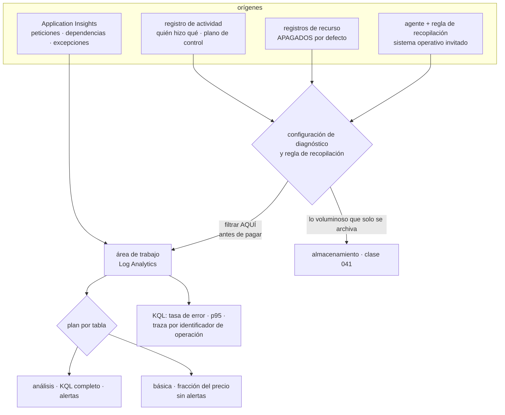

# 045 — Azure Monitor, Log Analytics y Application Insights

> [← 044 · Service Bus, Event Grid y Event Hubs](../../part-03-azure-core-platform/044-service-bus-event-grid-y-event-hubs/README.md) · [Índice de la parte](../README.md) · [046 · Key Vault, Defender for Cloud y Azure Policy →](../../part-03-azure-core-platform/046-key-vault-defender-for-cloud-y-azure-policy/README.md)

**Parte:** 03 — Azure: plataforma esencial<br>
**Nivel:** intermedio · **Horas estimadas:** 4<br>
**Laboratorio:** `observability` · **Estado:** `EXECUTABLE_CORE`

## 🎯 Propósito

Construir la evidencia operativa de una plataforma Azure sabiendo dos cosas que cambian todo lo demás: los registros de recurso **están apagados por defecto**, así que un incidente ocurrido antes de activarlos no tiene datos que analizar; y la misma señal puede almacenarse como métrica o como registro, con una diferencia de precio de dos órdenes de magnitud. La clase 034 dejó las cuatro preguntas de un incidente; aquí se responden con KQL y se paga la factura correcta por hacerlo.

## 📚 Resultados de aprendizaje

Al finalizar podrás:

1. **Distinguir** métricas de registros por costo, latencia y capacidad de consulta, y elegir dónde va cada señal.
2. **Activar** registros de recurso mediante directiva en vez de recurso por recurso, y comprobar la cobertura.
3. **Escribir** consultas KQL que respondan tasa de error, percentil de latencia y reconstrucción de una traza.
4. **Reducir** la factura de ingesta con filtrado en la regla de recopilación y planes por tabla, sin perder la señal.
5. **Elegir** entre alerta de métrica y alerta de registro sabiendo qué latencia añade cada una.

## 🧩 Conceptos centrales

| Concepto | Comprensión verificable |
|---|---|
| `configuración de diagnóstico` | Interruptor que envía los registros de un recurso a un destino. **Está apagado por defecto en todos los recursos**: sin él, el plano de datos no deja rastro. |
| `regla de recopilación de datos` | Define qué se recoge, cómo se transforma y adónde va. Es el punto donde se filtra **antes de pagar la ingesta**, no después. |
| `plan por tabla` | Cada tabla del área de trabajo puede ser de análisis, básica o auxiliar. La básica cuesta una fracción y renuncia a alertas y a parte de KQL. |
| `muestreo adaptativo` | Reducción automática del volumen que envía el SDK de Application Insights. Hace que `count()` mienta: hay que sumar `itemCount`. |
| `identificador de operación` | Correlador que atraviesa servicios siguiendo el estándar de traza del W3C. Es lo que convierte cuatro registros dispersos en una sola historia. |
| `alerta de registro frente a alerta de métrica` | La de métrica se evalúa en la canalización de métricas y avisa en cerca de un minuto; la de registro espera a la ingesta y a su ventana, y rara vez baja de cinco. |

## 🧠 Modelo mental

En Azure, identidad y jerarquía organizacional preceden al recurso: tenant, management group, suscripción y resource group determinan el alcance de control.

Aplicado a esta clase, separa siempre cuatro planos: **intención** (qué necesita el usuario),
**configuración** (qué declaramos), **estado observado** (qué existe de verdad) y
**evidencia** (cómo sabemos que cumple). Confundirlos produce diseños que se ven correctos
en un diagrama pero fallan al operar.

## 🗺️ Flujo de razonamiento



## 📖 Desarrollo

### 1. Nada se registra hasta que alguien lo enciende

Esta es la frase que hay que aprender antes que cualquier consulta. En Azure hay cuatro orígenes de telemetría y **solo uno funciona sin configurar nada**:

```text
registro de actividad     plano de control: quién creó, modificó o borró qué
                          ACTIVO siempre · 90 días · gratis
registros de recurso      plano de datos: consultas SQL, accesos a blobs,
                          peticiones de la pasarela
                          APAGADOS por defecto en TODOS los recursos
sistema operativo invitado agente + regla de recopilación
                          hay que instalarlo
aplicación                Application Insights
                          hay que instrumentarla
```

La segunda línea es la que produce la conversación más incómoda de un postmortem: hubo una caída, se abre el portal a buscar qué pasó y **no hay nada que mirar**, porque la configuración de diagnóstico de ese recurso nunca se creó. Y no se puede recuperar: los registros no existían.

Activarlo recurso por recurso no funciona a escala, por el mismo motivo que cualquier control manual: alguien despliega uno nuevo y nadie se acuerda. La solución es la de la clase 037 aplicada a la telemetría — una directiva que lo despliegue por sí sola:

```bash
$ az policy assignment create --name diagnostico-obligatorio \
    --scope "/subscriptions/$SUB" \
    --policy-set-definition "Deploy Diagnostic Settings to Azure Services" \
    --location westeurope --identity-scope "/subscriptions/$SUB" \
    --role Contributor -p "{\"logAnalytics\":{\"value\":\"$WORKSPACE_ID\"}}"
```

El efecto `DeployIfNotExists` corrige lo que existe y cubre lo que venga. Y la comprobación —que es el entregable, no la asignación— consiste en preguntar cuántos recursos siguen sin ella:

```kusto
resources
| where type in~ ("microsoft.sql/servers/databases",
                  "microsoft.network/applicationgateways",
                  "microsoft.storage/storageaccounts")
| join kind=leftanti (
    insightsresources
    | where type =~ "microsoft.insights/diagnosticsettings"
    | project id = tolower(tostring(split(id, "/providers/microsoft.insights")[0]))
  ) on $left.id == $right.id
| summarize sin_diagnostico = count() by type
```

Sobre el **registro de actividad** hay un límite que sorprende tarde: se conserva 90 días y no más. Una investigación sobre algo ocurrido hace cuatro meses no encuentra nada. Si la organización necesita responder «quién borró esto» más allá de ese plazo —y las auditorías lo necesitan—, hay que exportarlo con una configuración de diagnóstico, y el destino natural es una cuenta de almacenamiento con inmutabilidad de la clase 041: un registro de auditoría que el propio administrador puede borrar no es un registro de auditoría.

### 2. Métricas y registros: la misma señal con dos precios

Azure Monitor guarda dos tipos de datos, y la elección entre ellos es una decisión de arquitectura con consecuencias de factura:

| | Métricas | Registros |
|---|---|---|
| Forma | Serie temporal numérica | Registros estructurados |
| Latencia hasta ser consultable | ~1 min | 1-3 min, más si hay limitación |
| Retención | 93 días, incluida | Configurable, **se paga** |
| Dimensiones | Pocas y acotadas | Las que quieras |
| Costo de las de plataforma | Prácticamente nulo | ~2,30 USD por GB ingerido |
| Sirven para | Alertar rápido, ver tendencia | Investigar, correlacionar, auditar |

La clase 034 avisaba de que la cardinalidad multiplica la factura. En Azure ese principio se concreta en una pregunta por cada señal: **¿necesito filtrar esto por un valor que no conozco de antemano?** Si la respuesta es no —CPU, latencia media, profundidad de cola—, es una métrica y sale casi gratis. Si es sí —el identificador del cliente, la ruta exacta, el mensaje de error—, es un registro y se paga por GB.

El error caro consiste en emitir como registro lo que podía ser métrica: una línea de registro por petición para poder contar peticiones. Contar peticiones es exactamente lo que hace una métrica, por una fracción del precio y con menos latencia.

Y hay un tercer nivel entre ambos que casi nadie usa y resuelve el caso voluminoso: los **planes por tabla**.

```text
análisis    ~2,30 USD/GB   KQL completo, alertas, 31 días incluidos
básica      ~0,65 USD/GB   consultas limitadas, SIN alertas, 30 días
auxiliar    ~0,15 USD/GB   volcado barato para búsquedas ocasionales
archivo     ~0,03 USD/GB/mes  hay que lanzar un trabajo de búsqueda para leerlo
```

La decisión se toma **por tabla**, no por área de trabajo, y ahí está la palanca: los registros de acceso de una pasarela o la salida estándar de decenas de contenedores suelen ser el 70-80 % del volumen y casi nunca son el origen de una alerta. Ponerlos en plan básico no cambia lo que se puede investigar durante un incidente; cambia el precio de guardarlos.

El otro punto de control está antes: la **regla de recopilación** puede transformar y descartar **antes de la ingesta**, que es cuando se paga.

```kusto
source
| where TimeGenerated > ago(1h)
| where httpStatus_d >= 400 or timeTaken_d > 1.0
| project TimeGenerated, clientIP_s, requestUri_s, httpStatus_d, timeTaken_d
```

Dos efectos a la vez: se descarta el 95 % de las líneas —las peticiones correctas y rápidas, que ya están contadas en una métrica— y se recorta el ancho de las que quedan. Filtrar después, en la consulta, no ahorra un céntimo: el GB ya se pagó al entrar.

Y una regla de higiene que evita la sorpresa: **poner un presupuesto y un límite diario al área de trabajo desde el primer día**. El límite corta la ingesta al alcanzarlo, lo cual es malo; despertar un lunes con una factura de cuatro cifras por un componente que se volvió locuaz el viernes es peor, y sin límite no hay nada que lo impida.

### 3. KQL suficiente para responder las cuatro preguntas

La clase 034 planteaba cuatro preguntas durante un incidente: qué está roto, desde cuándo, qué cambió y quién lo hizo. Con un área de trabajo, las cuatro se responden con el mismo lenguaje.

**Qué está roto y cuánto.**

```kusto
requests
| where timestamp > ago(1h)
| summarize total = sum(itemCount),
            fallidas = sumif(itemCount, success == false) by operation_Name
| extend tasa_error = round(100.0 * fallidas / total, 2)
| where total > 100
| order by tasa_error desc
```

**Desde cuándo, y con qué latencia.**

```kusto
requests
| where timestamp > ago(6h) and operation_Name == "POST /api/pedidos"
| summarize p50 = percentile(duration, 50),
            p95 = percentile(duration, 95),
            p99 = percentile(duration, 99) by bin(timestamp, 5m)
| render timechart
```

**Qué dependencia lo causa.**

```kusto
dependencies
| where timestamp > ago(1h) and success == false
| summarize fallos = sum(itemCount) by target, type, resultCode
| order by fallos desc
```

**La historia completa de una petición concreta**, que es lo que convierte cuatro paneles en un diagnóstico:

```kusto
let op = "8f2a1c9e4b7d3a05";
union requests, dependencies, exceptions, traces
| where operation_Id == op
| project timestamp, itemType, name, target, resultCode, duration, message
| order by timestamp asc
```

Ese `operation_Id` viaja entre servicios en la cabecera `traceparent` del estándar del W3C. Es la pieza que hace que la traza cruce la pasarela, la aplicación web, la función y la cola. Y tiene una condición: **cada salto debe propagar la cabecera**. Un cliente HTTP escrito a mano que no la reenvíe corta la traza justo donde empieza a ser interesante.

**Quién lo hizo**, en el registro de actividad:

```kusto
AzureActivity
| where TimeGenerated > ago(7d)
| where OperationNameValue endswith "/DELETE"
| project TimeGenerated, Caller, OperationNameValue, _ResourceId, ActivityStatusValue
| order by TimeGenerated desc
```

Y ahora la advertencia que hace inútiles todas las consultas anteriores si se ignora. El SDK de Application Insights aplica **muestreo adaptativo por defecto**: cuando el volumen sube, envía una fracción y anota en `itemCount` a cuántos representa cada registro.

```text
count()                  cuenta REGISTROS ALMACENADOS      41.312
sum(itemCount)           cuenta peticiones REALES         413.120
```

Un factor de diez, silencioso, en cualquier panel escrito con `count()`. Y peor: una alerta con umbral sobre `count()` deja de dispararse justo cuando el tráfico sube, porque el muestreo se vuelve más agresivo precisamente entonces. **La regla es sencilla y no admite excepción: en tablas de Application Insights se suma `itemCount`, nunca se cuenta.**

Si para un flujo concreto —pagos, por ejemplo— hace falta el detalle completo, el muestreo se desactiva para ese tipo de telemetría en lugar de para toda la aplicación, y se acepta el costo de esa decisión sabiendo cuál es.

### 4. Alertas: la que llega en un minuto y la que llega en nueve

Hay tres clases de alerta y elegir mal añade minutos al tiempo de detección sin que nadie se dé cuenta:

| | Se evalúa sobre | Latencia típica | Costo |
|---|---|---|---|
| Métrica | La canalización de métricas | ~1 min | Muy bajo por regla |
| Registro | Una consulta KQL programada | 5-15 min | Por regla y frecuencia |
| Registro de actividad | Sucesos del plano de control | Minutos | Muy bajo |

La latencia de una alerta de registro es acumulativa y hay que sumarla entera:

```text
ingesta            1-3 min
frecuencia mínima  5 min
ventana            5-15 min según se defina
──────────────────────────
detección real     de 7 a 20 minutos
```

Eso descalifica a la alerta de registro como señal rápida. La distribución correcta:

```text
métrica    disponibilidad, tasa de error HTTP, latencia, profundidad de cola,
           CPU, mensajes fallidos  →  todo lo que despierta a alguien
registro   lo que solo se puede expresar consultando: una excepción concreta,
           una combinación de campos, una correlación entre tablas
actividad  cambios sensibles: borrado de recursos, cambios de rol,
           elevación de acceso (clase 038)
```

Dos ajustes que separan una alerta útil de un generador de ruido:

**Umbrales dinámicos.** Aprenden la estacionalidad de una métrica y avisan de la desviación. Son excelentes para tráfico con patrón diario y semanal —una tienda lo tiene— y son inútiles para una señal que nunca ha estado sana: el modelo aprende que la anomalía es lo normal.

**Grupos de acción con la severidad bien puesta.** Una alerta que no corresponde a una acción no debería despertar a nadie. El criterio de la clase 034 se mantiene: si la respuesta a una alerta es «ya, eso pasa a veces», la alerta está mal definida o el sistema está mal.

Y la alerta que casi nunca existe y que esta parte ha justificado tres veces —clase 043 con el consumidor en cero réplicas y clase 044 con la subcola de fallidos—: **la que detecta trabajo que se acumula**. Un proceso caído se nota; un proceso que se apagó ordenadamente y dejó de trabajar no.

```text
profundidad de cola creciente durante N minutos
edad del mensaje más antiguo por encima de un umbral
cuenta de mensajes fallidos mayor que cero
retraso del consumidor de Event Hubs respecto al último desplazamiento
```

Las cuatro son métricas, así que son baratas y rápidas. No tenerlas no es una cuestión de presupuesto: es que nadie se acordó de que un sistema puede fallar sin caerse.

Sobre el diseño del **área de trabajo**, una regla que evita una discusión recurrente: se separa por **control de acceso y residencia de datos**, no por orden estético. Una sola área de trabajo con acceso en contexto de recurso permite que cada equipo vea los registros de sus propios recursos sin ver los de los demás, y hace posibles las consultas que cruzan servicios — que son justamente las que resuelven los incidentes interesantes. Varias áreas por «tenerlo ordenado» obligan a consultas entre áreas de trabajo para todo y multiplican el costo fijo.

### 5. Operar la flota sin abrir puertos, y saber qué cambió

La clase 034 cerraba con dos capacidades que aquí tienen otras piezas y el mismo objetivo: entrar sin exponer y saber qué se movió.

**Entrar sin exponer.** Tres mecanismos, en orden de preferencia:

```text
no entrar             la mayoría de diagnósticos se resuelven con telemetría
                      si hace falta entrar a menudo, falta instrumentación
Bastion               sesión por el portal, sin IP pública en la máquina
                      subred AzureBastionSubnet, de la clase 039
comandos remotos      `az vm run-command` ejecuta sin sesión interactiva,
                      queda registrado en el registro de actividad
```

La primera línea es la importante y suele saltarse. Una plataforma en la que hay que abrir una sesión para saber qué ocurre es una plataforma con un problema de observabilidad, no de acceso.

Y una precisión sobre el segundo: los comandos remotos se ejecutan **con los permisos del agente**, es decir como administrador local, y aparecen en el registro de actividad como una única operación sin el contenido del comando. Conviene saberlo por lo que implica: es un camino de ejecución privilegiada que hay que restringir con RBAC igual que cualquier otro.

**Saber qué cambió.** Es la pregunta que más veces resuelve un incidente, y tiene dos fuentes:

```kusto
// cambios de configuración en las últimas 6 horas sobre los recursos afectados
AzureActivity
| where TimeGenerated > ago(6h)
| where OperationNameValue has_any ("WRITE", "DELETE", "ACTION")
| where ActivityStatusValue == "Success"
| project TimeGenerated, Caller, OperationNameValue, _ResourceId
| order by TimeGenerated asc
```

El **historial de cambios** de Azure Resource Graph completa la foto con el antes y el después de cada propiedad, que es lo que distingue «alguien tocó la pasarela» de «alguien cambió el tiempo de espera de 30 a 3 segundos».

Juntar ambas con la ventana del incidente es un hábito que ahorra horas:

```text
1. ¿cuándo empezó?              percentil de latencia o tasa de error
2. ¿qué cambió en esa ventana?  registro de actividad e historial de cambios
3. ¿qué traza lo demuestra?     una petición fallida por identificador de operación
4. ¿quién y con qué permiso?    autor del cambio y su rol (clase 038)
```

Y la conclusión que enlaza con el proyecto de la clase 048: estas cuatro consultas se escriben **una vez**, se guardan en el área de trabajo y se enlazan desde el manual de operación. Un incidente no es el momento de aprender KQL. La diferencia entre una plataforma observada y una instrumentada es que la primera tiene las preguntas escritas antes de necesitarlas.

## 🔬 Ejemplo trabajado

**CloudShop lleva un mes en Azure con todo desplegado y nada instrumentado más allá de lo que viene puesto. Una caída de 48 minutos abre cinco frentes, y el primero es que no hay datos de la caída.**

**Frente 1 — el incidente sin evidencia.**

La tienda devuelve 502 durante 48 minutos. Al abrir el portal a investigar:

```bash
$ az monitor diagnostic-settings list --resource $APPGW_ID --query "value[].name" -o tsv
(vacío)
$ az monitor diagnostic-settings list --resource $SQLDB_ID --query "value[].name" -o tsv
(vacío)
```

Ni la pasarela ni la base de datos habían registrado nada del plano de datos, porque nadie lo activó. La causa se termina deduciendo por eliminación, sin poder demostrarla. Se activa por directiva, no a mano:

```text                                  antes    después
recursos con diagnóstico configurado    3 de 61   61 de 61
mecanismo                             manual    DeployIfNotExists
recursos nuevos                    sin cobertura  cubiertos al crearse
```

Y el registro de actividad se exporta a almacenamiento con inmutabilidad, porque los 90 días por defecto no cubren una auditoría anual.

**Frente 2 — la factura de la telemetría, a los once días.**

```kusto
Usage
| where TimeGenerated > ago(7d) and IsBillable
| summarize GB = sum(Quantity)/1000 by DataType
| order by GB desc
```

```text
AzureDiagnostics (pasarela, registros de acceso)   154 GB   48 %
ContainerLogStdout                                  98 GB   30 %
AppRequests + AppDependencies                       43 GB   13 %
resto                                               27 GB    9 %
                                                   ──────
total                                              322 GB en 7 días → ~46 GB/día
```

```text
46 GB/día × 30 × 2,30 USD = 3.174 USD/mes solo de ingesta
```

Las dos primeras filas son el 78 % del gasto y nunca habían originado una alerta. Se actúa en los dos puntos, no en uno:

```text                                       antes        después
registros de acceso de la pasarela        22 GB/día     3 GB/día
  filtrado en la regla de recopilación:
  solo estado >= 400 o duración > 1 s
  el volumen completo se archiva en almacenamiento (clase 041)
salida estándar de contenedores           14 GB/día     5 GB/día en plan básico
  filtrado de líneas de depuración
telemetría de aplicación                   6 GB/día     6 GB/día  ← intacta
resto                                      4 GB/día     2 GB/día
```

```text                                     USD/mes
ingesta en plan de análisis (11 GB/día)      759
ingesta en plan básico (5 GB/día)             97
archivo en almacenamiento                     14
                                            ──────
                                             870      frente a 3.174   (−73 %)
```

Lo que se conserva íntegro es lo que se usa para investigar. Lo que se abarata es lo que solo se lee cuando alguien va a buscarlo, y sigue estando.

**Frente 3 — el panel que llevaba un mes mintiendo.**

El panel de tráfico marcaba 41.000 peticiones diarias. La facturación del proveedor de pago no cuadraba con ese volumen.

```kusto
requests | where timestamp > ago(1d)
| summarize registros = count(), reales = sum(itemCount)
```

```text
registros  41.312
reales    413.120
```

Muestreo adaptativo al 10 %. Todos los paneles y las dos alertas de volumen usaban `count()`.

```text                                  antes            después
agregación en paneles y alertas       count()         sum(itemCount)
muestreo para el flujo de pago       adaptativo       desactivado
muestreo para el resto               adaptativo       adaptativo (correcto)
alerta por caída de tráfico       nunca disparó    verificada con simulacro
```

La alerta por caída de tráfico era la peor de las tres: con `count()` y muestreo adaptativo, **una subida real de tráfico podía parecer una bajada**.

**Frente 4 — la alerta que llegó nueve minutos tarde.**

En la caída, la primera notificación llegó a las 09:31 para un incidente que empezó a las 09:22.

```text
inicio real                        09:22
ingesta del registro                09:24
frecuencia de evaluación (5 min)    09:29
ventana de 5 min ya cumplida        09:29
notificación                        09:31
```

Nueve minutos, todos estructurales. Se redistribuyen las alertas:

```text                                        antes         después
disponibilidad y 5xx de la pasarela      alerta de registro  alerta de métrica
latencia p95                             alerta de registro  alerta de métrica
excepción concreta con correlación         —                 alerta de registro
borrado de recursos                        —                 alerta de actividad
tiempo hasta la notificación             9 min               70 s
```

**Frente 5 — las alertas que faltaban y ya se habían pagado dos veces.**

Los incidentes de las clases 043 y 044 —el consumidor en cero réplicas y los 8.412 mensajes fallidos— tienen la misma forma: el sistema no se cayó, dejó de trabajar. Se añaden las cuatro señales de acumulación:

```text
profundidad de la cola de pedidos creciendo 15 min
edad del mensaje más antiguo > 10 min
mensajes fallidos > 0 durante 15 min
retraso del consumidor de Event Hubs > 100.000 eventos
```

Las cuatro son métricas: cuestan céntimos y avisan en un minuto.

**Y las cuatro consultas del manual de operación**, guardadas antes de necesitarlas:

```text
1. tasa de error por operación en la última hora
2. percentiles de latencia por operación, en serie temporal
3. traza completa por identificador de operación
4. cambios de configuración en la ventana del incidente, con autor
```

**Resumen de la observabilidad:**

```text                                        antes           después
recursos con registros activos                3 de 61         61 de 61
mecanismo de activación                       manual        por directiva
ingesta diaria                               46 GB/día       16 GB/día
costo mensual de telemetría                 3.174 USD        870 USD
exactitud del recuento de peticiones          ×0,1             exacta
tiempo hasta la notificación                  9 min             70 s
alertas sobre trabajo acumulado                 0                4
consultas de incidente escritas de antemano     0                4
```

**La lección que esta clase traslada al resto de la parte**: la observabilidad de Azure no falla por falta de herramientas sino por dos valores por defecto: **los registros de recurso vienen apagados y el muestreo viene encendido**. El primero deja un incidente sin datos; el segundo deja los datos con un factor de diez. Ninguno de los dos avisa, y los dos se comprueban en un minuto — el día que se despliega, no el día del incidente.

## 🧪 Laboratorio guiado

Ejecuta desde la raíz:

```bash
python classes/part-03-azure-core-platform/045-azure-monitor-log-analytics-y-application-insights/lab.py
```

El laboratorio selecciona el motor de práctica **`observability`** y produce
`lab_result.json`. El escenario, sus comprobaciones y el artefacto esperado corresponden a
esta clase; no requiere credenciales y deja explícito qué debe revalidarse en un sandbox real.

1. Lee `exercise.steps` y formula una predicción antes de ejecutar.
2. Ejecuta la práctica y verifica todos los elementos de `checks`.
3. Provoca el caso de `negative_test` y explica la señal observada.
4. Materializa `evidencia-operativa-azure` en `evidence/` usando la plantilla indicada.
5. Para proveedor real, sigue `sandbox.requires`, registra costo y ejecuta `destroy`.

### Evidencia esperada

El artefacto principal es telemetría correlacionada con una pregunta operativa. Además, la entrega debe incluir el comando ejecutado,
la salida estructurada y una conclusión que no exceda lo observado.

## 🏆 Reto verificable

Construye **`evidencia-operativa-azure`** para el caso CloudShop. Incluye una alternativa descartada,
un supuesto que pueda falsarse, una prueba de fallo y una decisión de rollback.

## ✅ Criterio de aceptación

- [ ] `lab.py` termina con código 0 y genera JSON válido.
- [ ] La entrega conecta al menos tres requisitos con mecanismos verificables.
- [ ] Existe una prueba positiva y una prueba negativa con evidencia.
- [ ] Seguridad, costo y operación aparecen como decisiones, no como anexos.
- [ ] Se declara una limitación y una condición que obligaría a revisar el diseño.
- [ ] Otra persona puede repetir el recorrido sin conocimiento tácito.

## ⚠️ Errores frecuentes

| Síntoma | Causa probable | Corrección |
|---|---|---|
| Tras una caída no hay registros que analizar | Las configuraciones de diagnóstico están apagadas por defecto y nunca se crearon | Actívalas por directiva con `DeployIfNotExists` y verifica la cobertura con una consulta sobre los recursos sin ella. |
| Los paneles muestran una fracción del tráfico real | El muestreo adaptativo de Application Insights está activo y las consultas usan `count()` | Suma `itemCount` en todas las agregaciones y desactiva el muestreo solo para los flujos que exijan detalle completo. |
| La factura de telemetría crece más rápido que la plataforma | Todo entra en plan de análisis, incluidos los registros de acceso y la salida estándar de los contenedores | Filtra en la regla de recopilación antes de la ingesta y asigna plan básico a las tablas voluminosas que no originan alertas. |
| Las alertas llegan varios minutos después del inicio del incidente | Son alertas de registro: suman ingesta, frecuencia y ventana | Pasa a alertas de métrica todo lo que despierte a alguien y reserva las de registro para lo que solo se puede expresar consultando. |
| Una traza se corta al llegar a un servicio interno | Ese salto no propaga la cabecera `traceparent` | Propaga la cabecera en todos los clientes HTTP y verifica la continuidad con una consulta por `operation_Id`. |
| No se puede saber quién borró un recurso hace cuatro meses | El registro de actividad se conserva 90 días | Expórtalo con una configuración de diagnóstico a almacenamiento inmutable desde el primer día. |

## 🛡️ Seguridad, ética y costo

Trabaja con cuentas propias o sandboxes autorizados. No publiques secretos, identificadores
reales ni datos personales. Antes de crear recursos pagos define presupuesto, etiquetas y
comando de destrucción; después verifica que no queden recursos huérfanos. Los ejemplos
locales enseñan contratos, pero no certifican cumplimiento ni disponibilidad de producción.

## ❓ Preguntas de comprobación

1. ¿Qué origen de telemetría funciona sin configurar nada y cuál está apagado en todos los recursos?
2. ¿Con qué criterio decides si una señal debe ser métrica o registro, y cuánto cambia el costo?
3. ¿Por qué `count()` sobre la tabla `requests` puede mentir, y qué se usa en su lugar?
4. Descompón los nueve minutos de latencia de una alerta de registro. ¿Cuáles de ellos se pueden reducir?
5. ¿Qué cuatro alertas detectan un sistema que dejó de trabajar sin caerse, y por qué son baratas?

## 🔗 Referencias

- Microsoft (2025). *Azure Monitor overview* — métricas, registros, orígenes y destinos. <https://learn.microsoft.com/en-us/azure/azure-monitor/overview>
- Microsoft (2025). *Diagnostic settings in Azure Monitor* — activación por recurso, destinos y despliegue por directiva. <https://learn.microsoft.com/en-us/azure/azure-monitor/essentials/diagnostic-settings>
- Microsoft (2025). *Log Analytics workspace table plans and cost optimization* — planes por tabla, retención y archivo. <https://learn.microsoft.com/en-us/azure/azure-monitor/logs/data-platform-logs>
- Microsoft (2025). *Sampling in Application Insights* — muestreo adaptativo, `itemCount` y sus efectos en las consultas. <https://learn.microsoft.com/en-us/azure/azure-monitor/app/sampling>
- Microsoft (2025). *Types of Azure Monitor alerts* — métrica, registro y registro de actividad, con sus latencias. <https://learn.microsoft.com/en-us/azure/azure-monitor/alerts/alerts-types>
- Documentación oficial vigente del servicio implementado; registra URL y fecha de consulta.

---

> [Evaluación](assessment.md) · [Contrato de clase](lesson.yaml) · [Índice de la parte](../README.md)

| Anterior | Índice | Siguiente |
|---|---|---|
| [← 044 · Service Bus, Event Grid y Event Hubs](../../part-03-azure-core-platform/044-service-bus-event-grid-y-event-hubs/README.md) | [Parte 03](../README.md) · [Programa](../../README.md) | [046 · Key Vault, Defender for Cloud y Azure Policy →](../../part-03-azure-core-platform/046-key-vault-defender-for-cloud-y-azure-policy/README.md) |
