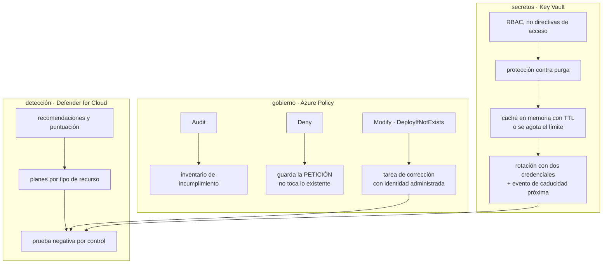

# 046 — Key Vault, Defender for Cloud y Azure Policy

> [← 045 · Azure Monitor, Log Analytics y Application Insights](../../part-03-azure-core-platform/045-azure-monitor-log-analytics-y-application-insights/README.md) · [Índice de la parte](../README.md) · [047 · Bicep, plantillas y despliegues por alcance →](../../part-03-azure-core-platform/047-bicep-plantillas-y-despliegues-por-alcance/README.md)

**Parte:** 03 — Azure: plataforma esencial<br>
**Nivel:** intermedio · **Horas estimadas:** 4<br>
**Laboratorio:** `security` · **Estado:** `EXECUTABLE_CORE`

## 🎯 Propósito

Aplicar defensa en profundidad a la plataforma Azure con las tres piezas que la sostienen, y con la precisión que más cuesta aprender: una directiva con efecto `Deny` **no arregla lo que ya existe**, porque actúa sobre la petición y no sobre el inventario. Asignarla y ver el panel en verde es el error de gobierno más repetido de esta parte. La clase 035 dejó el criterio —control de claves, rotación sin cortar conexiones, prueba negativa por control—; aquí cambian los mecanismos y aparece un motor de gobierno que no tiene equivalente directo en AWS.

## 📚 Resultados de aprendizaje

Al finalizar podrás:

1. **Elegir** el nivel de Key Vault y el modelo de permisos, y explicar qué escalada cierra cada decisión.
2. **Dimensionar** el acceso a secretos para no agotar el límite de transacciones del almacén.
3. **Distinguir** los efectos de Azure Policy y saber cuál corrige lo existente y cuál solo guarda la puerta.
4. **Rotar** claves y secretos sin cortar conexiones, con el patrón de dos credenciales y una reacción a evento.
5. **Verificar** cada control con su prueba negativa, incluida la del antimalware y la de la directiva.

## 🧩 Conceptos centrales

| Concepto | Comprensión verificable |
|---|---|
| `protección contra purga` | Impide eliminar definitivamente un almacén o sus objetos durante el periodo de retención. Es **irreversible al activarla**, y sin ella quien puede borrar una clave puede destruir los datos que esa clave cifra. |
| `modelo de permisos del almacén` | Directivas de acceso —heredadas, del propio almacén— o Azure RBAC. Con las primeras, quien tiene `Contributor` sobre el almacén **puede añadirse a sí mismo** y leerlo todo. |
| `clave gestionada por el cliente` | Clave propia en Key Vault que cifra un servicio. Da control real y traslada una responsabilidad real: perder el acceso a la clave deja el recurso inaccesible. |
| `efecto de directiva` | Qué hace una directiva al evaluar: `Audit` informa, `Deny` rechaza la petición, `Modify` y `DeployIfNotExists` corrigen. Solo los dos últimos actúan sobre lo que **ya existe**, y mediante una tarea de corrección. |
| `exención` | Excepción explícita, con motivo, responsable y fecha de caducidad. Se distingue de excluir un ámbito en la asignación, que es invisible y no caduca. |
| `puntuación de seguridad` | Priorización relativa de las recomendaciones de Defender for Cloud. Es una herramienta para ordenar el trabajo, **no un objetivo**: llegar al 100 % no equivale a estar seguro. |

## 🧠 Modelo mental

En Azure, identidad y jerarquía organizacional preceden al recurso: tenant, management group, suscripción y resource group determinan el alcance de control.

Aplicado a esta clase, separa siempre cuatro planos: **intención** (qué necesita el usuario),
**configuración** (qué declaramos), **estado observado** (qué existe de verdad) y
**evidencia** (cómo sabemos que cumple). Confundirlos produce diseños que se ven correctos
en un diagrama pero fallan al operar.

## 🗺️ Flujo de razonamiento



## 📖 Desarrollo

### 1. Key Vault: el modelo de permisos decide qué escalada existe

Antes de guardar el primer secreto hay dos decisiones que se toman una vez y se sufren siempre.

**El nivel**, que responde a un requisito, no a una preferencia:

```text
estándar        claves protegidas por software
premium         claves respaldadas por HSM, módulo compartido
HSM administrado  módulo dedicado de un solo inquilino
                  ~3,20 USD/h ≈ 2.300 USD/mes
```

El último no se elige «por si acaso»: se elige cuando una obligación regulatoria exige aislamiento de inquilino y un nivel de certificación concreto. Su precio es un dato de arquitectura.

**El modelo de permisos**, que es donde está la escalada. Las **directivas de acceso** son el modelo original: una lista en el propio almacén que dice quién puede hacer qué. Su defecto es estructural:

```text
quien tiene Contributor sobre el almacén
  → puede MODIFICAR la lista de directivas de acceso
  → puede añadirse a sí mismo con permisos de lectura de secretos
  → lee todos los secretos, y la operación es legítima en el registro
```

No hace falta ninguna vulnerabilidad: es cómo funciona. Con **Azure RBAC** eso se cierra, porque conceder acceso a los datos exige el rol correspondiente y **conceder roles exige a su vez un permiso distinto** —el de administrador de acceso de usuario—, que la clase 038 ya identificó como uno de los que deben ser elegibles y no permanentes.

```bash
$ az keyvault update -n kv-cloudshop -g rg-seg --enable-rbac-authorization true
$ az role assignment create --assignee $APP_ID --role "Key Vault Secrets User" \
    --scope "$KV_ID/secrets/db-password"
```

El ámbito de esa segunda línea importa: RBAC llega **hasta el secreto concreto**, mientras que una directiva de acceso solo llegaba al almacén entero. Es la diferencia entre «esta aplicación puede leer su contraseña» y «esta aplicación puede leer todas las contraseñas de la organización».

Y la tercera decisión, que solo se puede tomar en un sentido:

```bash
$ az keyvault update -n kv-cloudshop -g rg-seg --enable-purge-protection true
```

La eliminación temporal ya viene activa; la protección contra purga impide **eliminar definitivamente** durante el periodo de retención, y **no se puede desactivar**. El argumento que la justifica es directo: si el almacén guarda la clave que cifra una cuenta de almacenamiento, quien puede purgar esa clave puede destruir los datos sin tocarlos. Con protección contra purga, ese camino no existe.

Y el fallo operativo más frecuente de Key Vault no es de seguridad, es de **límite de transacciones**:

```text
tope orientativo   ~2.000 transacciones de secreto por cada 10 s y almacén
aplicación que lee el secreto en CADA petición, a 900 peticiones/s
  → 9.000 transacciones cada 10 s → 429 Too Many Requests
  → que la aplicación devuelve como 500 al usuario
```

El síntoma engaña porque parece un fallo de la base de datos: la aplicación no consigue su contraseña y lo reporta como error de conexión. La corrección es la evidente y casi nunca está puesta:

```text
leer el secreto al arrancar y guardarlo en memoria
refrescar con un TTL de minutos, no por petición
y refrescar además al recibir un error de autenticación
```

La última línea es la que permite rotar sin reiniciar: si la credencial falla, se relee del almacén antes de darse por vencido.

### 2. Claves propias: control real y responsabilidad real

La clase 035 estableció tres niveles de control sobre las claves. En Azure son estos:

| | Quién gestiona | Costo | Qué obtienes |
|---|---|---|---|
| Clave de plataforma | Microsoft | Incluido | Cifrado en reposo, sin trabajo |
| Clave del cliente | Tú, en Key Vault | Almacén + operaciones | Control de rotación y **de revocación** |
| Clave en HSM administrado | Tú, módulo dedicado | ~2.300 USD/mes | Aislamiento de inquilino |

La segunda fila es la que hay que entender bien, porque su ventaja y su riesgo son la misma propiedad: **puedes revocar el acceso a la clave**. Eso significa que puedes dejar un dato ilegible a voluntad, que es exactamente lo que se pide en una baja de servicio o en una respuesta a incidente. Y significa también que:

```text
si borras la clave                → la cuenta de almacenamiento queda inaccesible
si retiras el permiso a la identidad → el servicio deja de arrancar
si el almacén queda inalcanzable por red → lo mismo, sin haber tocado la clave
```

No es un fallo del diseño: es el precio del control, y hay que aceptarlo por escrito antes de activarlo. Las tres protecciones que lo hacen sostenible son la protección contra purga, un bloqueo de recurso sobre el almacén y una identidad **asignada por el usuario** —de la clase 038— para que la relación con la clave sobreviva a recrear el recurso.

Sobre la **rotación**, la precisión de la clase 035 se mantiene entera: rota la clave, no lo ya cifrado. Y en Azure hay un detalle comprobable que decide si la rotación sirve de algo:

```bash
# referencia SIN versión: el servicio toma automáticamente la versión nueva
https://kv-cloudshop.vault.azure.net/keys/clave-almacenamiento

# referencia CON versión: la rotación no cambia nada, sigue usando la vieja
https://kv-cloudshop.vault.azure.net/keys/clave-almacenamiento/7f3a…
```

Una rotación automática configurada sobre una referencia con versión fija se ejecuta puntualmente cada 90 días, genera una versión nueva, y el recurso sigue cifrando con la de siempre. El panel dice que la rotación está activa; la comprobación honesta es preguntar qué versión está usando el recurso.

La **rotación de secretos sin cortar conexiones** es el patrón de dos credenciales, y aquí encaja con lo construido en la clase 044:

```text
1. existen dos credenciales activas: primaria y secundaria
2. las aplicaciones usan la primaria
3. se rota la SECUNDARIA (nadie la está usando)
4. se promueve: las aplicaciones pasan a la secundaria ya rotada
5. se rota la antigua primaria, que ahora está libre
```

En ningún momento hay una ventana sin credencial válida. Y el disparador no tiene por qué ser un calendario: Key Vault emite un evento cuando un secreto se acerca a su caducidad.

```text
SecretNearExpiry → Event Grid → función que ejecuta la rotación
```

Es la reacción a hechos de la plataforma que la clase 044 describía, aplicada al caso donde más rinde: la rotación deja de depender de que alguien se acuerde.

### 3. Azure Policy: `Deny` guarda la puerta y no limpia la casa

Este es el mecanismo de gobierno que no tiene equivalente directo en AWS, y su malentendido más caro cabe en una línea: **`Deny` evalúa la petición, no el inventario**.

```text
efecto              qué hace                        ¿toca lo que ya existe?
Audit               marca incumplimiento             informa, no cambia
Deny                rechaza la creación o el cambio  NO
Modify              añade o cambia propiedades       sí, con tarea de corrección
DeployIfNotExists   despliega un recurso asociado    sí, con tarea de corrección
AuditIfNotExists    marca la falta de algo asociado  informa
Disabled            desactiva la regla               —
```

Asignar una directiva `Deny` de «las cuentas de almacenamiento no deben permitir acceso público» impide crear una nueva mal configurada y **deja intactas las catorce que ya lo están**. El panel puede mostrar que las creaciones recientes cumplen mientras el problema real sigue ahí. Corregir lo existente exige otro efecto y un paso explícito:

```bash
$ az policy remediation create --name corregir-red-almacenamiento \
    --policy-assignment $ASIGNACION_ID --resource-discovery-mode ReEvaluateCompliance
```

Y esa tarea necesita una identidad administrada con permiso suficiente para hacer el cambio, lo que a su vez es una decisión de seguridad: se le concede el rol mínimo, no `Contributor` sobre la suscripción.

Dos comportamientos temporales que evitan diagnósticos erróneos:

```text
al crear o modificar un recurso   la directiva se evalúa al instante
recursos existentes               se reevalúan cada ~24 h
```

Un panel de cumplimiento puede estar un día desfasado. Después de corregir algo, se fuerza la evaluación en vez de concluir que la corrección no funcionó.

Las **iniciativas** agrupan directivas con parámetros comunes, y las integradas cubren marcos completos —ISO 27001, PCI DSS, CIS—. Empezar por una integrada en modo `Audit` produce en un día el inventario que de otro modo cuesta semanas, **y sin bloquear nada**. La secuencia sensata es siempre la misma:

```text
1. Audit          descubre el tamaño real del problema
2. corregir       con tareas de corrección donde el efecto lo permita
3. Deny           solo cuando el inventario ya cumple
```

Hacerlo al revés —`Deny` primero— bloquea despliegues legítimos, produce una avalancha de excepciones y termina con la directiva desasignada «temporalmente».

Y sobre las excepciones, una distinción de gobierno que separa una plataforma auditable de una que aparenta serlo:

```text
exclusión de ámbito en la asignación
  invisible en los paneles, sin motivo, sin fecha, sin responsable
exención
  objeto propio, con categoría, justificación, responsable y CADUCIDAD
```

Las dos consiguen que un recurso deje de incumplir. Solo una de ellas se puede revisar. Una plataforma con cero incumplimientos y treinta exclusiones no documentadas está peor que una con treinta incumplimientos conocidos.

Un último enlace con la clase 038: cuando una directiva bloquea algo, el error **no** es de autorización, y leerlo ahorra buscar en el sitio equivocado:

```text
AuthorizationFailed          falta el rol
RequestDisallowedByPolicy    hay rol y la directiva lo impide
```

### 4. Defender for Cloud: dos mitades y una puntuación que no es la meta

Defender for Cloud hace dos cosas distintas que se facturan distinto:

```text
gestión de la postura (CSPM)   recomendaciones, puntuación de seguridad,
                               cumplimiento normativo
                               nivel gratuito incluido
protección de cargas (CWP)     detección de amenazas por tipo de recurso
                               planes de pago, uno por tipo
```

La segunda se activa **plan a plan**, y ahí está la decisión de costo. Encender todo en toda la suscripción es cómodo y caro; encender lo que corresponde al inventario real es trabajo de una hora:

```text                                    precio orientativo
Defender for Servers P2      ~15 USD por servidor y mes
Defender for Storage         ~10 USD por cuenta y mes (+ análisis por GB)
Defender for SQL             ~15 USD por instancia y mes
Defender for Containers      ~7 USD por vCPU y mes
Defender for Key Vault       por transacciones
```

La **puntuación de seguridad** ordena el trabajo por impacto relativo, y conviene decir con claridad qué no es: no es un objetivo. Subirla del 68 % al 74 % cerrando veinte recomendaciones de bajo impacto consume el mismo tiempo que cerrar la única que permitía movimiento lateral, y no reduce el mismo riesgo. La puntuación sirve para **priorizar**, y la priorización se corrige con criterio propio: qué explota un atacante primero en esta plataforma concreta.

El panel de **cumplimiento normativo** merece una nota, porque explica la arquitectura del producto: está construido sobre iniciativas de Azure Policy. Defender y Policy no son dos herramientas, son la misma evaluación presentada de dos formas. Lo que se corrige en una aparece en la otra.

Dos capacidades que enlazan con clases anteriores y rinden más de lo que cuestan:

**Acceso justo a tiempo a máquinas virtuales.** Los puertos de administración permanecen cerrados en el NSG y se abren, para una IP concreta y durante un plazo, previa solicitud registrada. Es exactamente el modelo de privilegio mínimo **en el tiempo** de la clase 038, aplicado a la red en lugar de a los roles. Y la aritmética es la misma: un puerto abierto 3 horas al mes en vez de 720 reduce la superficie un 99,6 %.

**Análisis antimalware en almacenamiento.** Analiza cada blob al subirlo. Tiene un costo por GB analizado, así que se activa en los contenedores que reciben ficheros de usuarios y no en los que guardan telemetría.

Y aquí vuelve, con toda su fuerza, la regla que cerraba la clase 035: **cada control necesita su prueba negativa**. Activar un plan de Defender no demuestra nada; lo que lo demuestra es provocar la detección:

```bash
# fichero de prueba estándar EICAR — inofensivo, reconocido por todo antimalware
$ printf 'X5O!P%%@AP[4\\PZX54(P^)7CC)7}$EICAR-STANDARD-ANTIVIRUS-TEST-FILE!$H+H*' \
    > eicar.txt
$ az storage blob upload -c cargas -f eicar.txt -n eicar.txt \
    --account-name stcloudshopprod --auth-mode login
# la alerta debe aparecer en Defender en minutos
```

Si no aparece, el control no está donde se creía —muy a menudo porque el plan se activó en la suscripción y esa cuenta de almacenamiento estaba excluida—. Y esa comprobación hay que repetirla, porque un control verificado una vez es un control verificado en el pasado.

### 5. La prueba negativa de cada control de esta parte

La clase 035 dejó el principio y la clase 036 lo aplicó a AWS. Cerrar la parte 03 exige la lista equivalente, porque un control sin prueba negativa es una afirmación, no un control.

```text
control                              prueba negativa que lo demuestra
─────────────────────────────────────────────────────────────────────────────
acceso público del almacenamiento    petición desde fuera → 403      (clase 041)
deshabilitado

punto de conexión privado activo     nslookup desde la subred devuelve 10.x
                                     y desde fuera falla             (clase 039)

salida de la subred cerrada          curl con tiempo límite → agota  (clase 039)

clave compartida deshabilitada       autenticación con la clave →
                                     KeyBasedAuthenticationNotPermitted (041)

federación acotada por sujeto        petición desde otro repositorio →
                                     AADSTS70021                     (clase 038)

directiva Deny asignada              crear el recurso prohibido →
                                     RequestDisallowedByPolicy

protección contra purga              intentar purgar → operación rechazada

antimalware en almacenamiento        subir el fichero EICAR → alerta

recuperación de contenedor           borrar y restaurar uno de prueba (041)

restauración de base de datos        restaurar a una copia y contar filas (042)

rotación de secreto                  rotar con tráfico en curso y medir
                                     errores: deben ser cero          (035)
```

La columna derecha es el entregable. Un informe de seguridad que dice «se ha habilitado X» no es comparable a uno que dice «se ha habilitado X y aquí está el error que devuelve al intentar lo que impide».

Y hay una prueba negativa de segundo orden que casi nunca se hace y descubre lo que las demás no: **comprobar que el control sigue activo pasado un tiempo**. Los controles se apagan solos por caminos perfectamente normales —alguien recrea el recurso desde una plantilla vieja, un despliegue sobrescribe la configuración, una excepción temporal se queda—. La defensa contra eso no es la memoria de nadie:

```text
directiva en modo Audit sobre cada control crítico
  → el panel muestra cualquier recurso que se salga
  → y la desviación aparece en horas, no en la siguiente auditoría
```

Es el mismo principio que cierra toda la parte: **lo que no tiene una señal automática, se degrada en silencio**. Los registros apagados de la clase 045, el consumidor en cero réplicas de la 043, la subcola de fallidos de la 044 y el control de seguridad revertido son el mismo problema con cuatro caras: sistemas que dejan de hacer su trabajo sin producir ningún error.

## 🔬 Ejemplo trabajado

**CloudShop cierra la seguridad de su plataforma Azure. El equipo activa Key Vault, asigna una iniciativa de cumplimiento y enciende Defender en toda la suscripción. A las seis semanas hay un panel en verde, una factura alta y cinco cosas que no eran ciertas.**

**Hecho 1 — la aplicación devuelve 500 en los picos y la culpa parecía de la base de datos.**

```text
09:40  errores 500 al 6 % · el registro dice "no se pudo conectar a la base de datos"
09:41  la base de datos está sana: CPU 22 %, ninguna conexión rechazada
```

```kusto
AzureDiagnostics
| where ResourceProvider == "MICROSOFT.KEYVAULT" and httpStatusCode_d == 429
| summarize limitadas = count() by bin(TimeGenerated, 1m)
```

```text
09:38   4.117
09:39  11.902
09:40  12.455
```

La aplicación leía la contraseña de Key Vault **en cada petición**. A 900 peticiones por segundo, el almacén limitaba, y el fallo se reportaba como error de base de datos porque es donde se manifestaba.

```text                                antes           después
lecturas del almacén            1 por petición   1 cada 30 min
transacciones en el pico        ~9.000/10 s        ~2/10 s
relectura ante fallo de auth        no                sí
errores 500 en el pico             6,0 %            0,0 %
```

**Hecho 2 — un ingeniero leyó todos los secretos y todo estaba permitido.**

Una revisión rutinaria encuentra una modificación de la lista de directivas de acceso seguida de cuarenta lecturas de secretos, todas correctas.

```kusto
AzureActivity
| where _ResourceId has "kv-cloudshop"
| where OperationNameValue endswith "VAULTS/WRITE"
| project TimeGenerated, Caller, ActivityStatusValue
```

No hubo intrusión: con `Contributor` sobre el almacén, añadirse a la lista es una operación legítima. Se cierra el camino:

```text                              antes                después
modelo de permisos          directivas de acceso     Azure RBAC
ámbito de la aplicación       almacén entero        un secreto concreto
quién puede conceder acceso  cualquier Contributor  administrador de acceso
                                                    de usuario, y elegible (038)
protección contra purga           no                    sí
alerta sobre cambios de rol       no                    sí, alerta de actividad
```

**Hecho 3 — el certificado se renovó y el sitio siguió sirviendo el viejo.**

A los cuatro días de la renovación automática, los clientes empiezan a ver avisos de certificado caducado.

```bash
$ az keyvault certificate show --vault-name kv-cloudshop -n cloudshop-tls \
    --query "attributes.expires" -o tsv
2027-07-30T00:00:00Z                       # renovado, correcto
$ echo | openssl s_client -connect cloudshop.example:443 2>/dev/null \
    | openssl x509 -noout -enddate
notAfter=Jul 31 09:00:00 2026 GMT          # lo que ve el cliente: el viejo
```

El enlace de la aplicación apuntaba a una **versión concreta** del certificado. La renovación creó otra versión y nadie la usaba.

```text                              antes              después
referencia al certificado      versión fija       sin versión
vigilancia del vencimiento     desde el almacén   desde FUERA, con una sonda TLS
aviso                          ninguno            30 días antes, sobre lo servido
```

La segunda fila es la lección: **el vencimiento se vigila donde lo ve el cliente**, no donde se guarda. El almacén decía la verdad y era irrelevante.

**Hecho 4 — cumplimiento en verde con catorce cuentas públicas.**

```bash
$ az policy state summarize --query "value[0].results.{cumple:nonCompliantResources}" -o tsv
0
$ az storage account list --query "[?allowBlobPublicAccess].name" -o tsv | wc -l
14
```

La contradicción se explica leyendo la asignación: efecto `Deny`, que solo evalúa peticiones nuevas, y un ámbito con **tres exclusiones** heredadas de la puesta en marcha, sin motivo ni fecha.

```text                                     antes             después
efecto de la directiva                    Deny        Audit → corregir → Deny
cuentas con acceso público                 14                 0
mecanismo de corrección                 ninguno      tarea de corrección
exclusiones de ámbito                      3                  0
exenciones documentadas                    0        2, con motivo y caducidad
```

Las dos exenciones que quedan son reales —un contenedor de recursos estáticos públicos por diseño— y ahora caducan en noventa días, así que alguien tendrá que volver a justificarlas.

**Hecho 5 — 3.100 USD al mes de Defender y un control que no estaba donde se creía.**

```text                                  activado    inventario real   costo
Defender for Servers P2                todo          22 servidores    330
Defender for Storage                   todo           3 cuentas         30
Defender for SQL                       todo           2 instancias      30
Defender for Containers                todo          16 vCPU          112
Defender for App Service, DNS, Resource Manager, APIs…                2.598
                                                                    ──────
                                                                     3.100
```

Se conservan los planes que corresponden al inventario y a la superficie real de ataque, y se retiran los que protegían servicios que CloudShop no usa:

```text                                                   USD/mes
planes conservados (servidores, almacenamiento, SQL,
contenedores, Key Vault, Resource Manager)                 ~640
```

Y la prueba negativa descubre lo importante:

```bash
$ az storage blob upload -c cargas -f eicar.txt -n eicar.txt \
    --account-name stcloudshopcargas --auth-mode login
# 20 minutos después: ninguna alerta
```

La cuenta que recibe los ficheros de los clientes —la única que de verdad importaba— se había creado después de activar el plan y estaba en otra suscripción sin cobertura. Se corrige y se repite la prueba:

```text
subida del fichero EICAR → alerta "Malicious file uploaded" en 4 min      ✓
```

**Resumen del cierre de seguridad:**

```text                                          antes          después
modelo de permisos del almacén        directivas de acceso     RBAC
protección contra purga                     no                  sí
errores 500 por limitación del almacén     6,0 %               0,0 %
cuentas de almacenamiento públicas           14                   0
exclusiones de ámbito sin justificar          3                   0
exenciones con motivo y caducidad             0                   2
planes de Defender activos               todos (3.100 USD)   los del inventario (640)
controles con prueba negativa ejecutada     0 de 11            11 de 11
```

**La lección que esta clase traslada al proyecto de la clase 048**: el panel en verde y el control efectivo son dos cosas distintas, y solo una de ellas se puede demostrar. `Deny` guardaba la puerta mientras catorce puertas ya estaban abiertas; el plan de antimalware protegía todo menos la cuenta que recibía ficheros de desconocidos. **La prueba negativa no es la parte opcional del trabajo: es la única parte que produce evidencia.**

## 🧪 Laboratorio guiado

Ejecuta desde la raíz:

```bash
python classes/part-03-azure-core-platform/046-key-vault-defender-for-cloud-y-azure-policy/lab.py
```

El laboratorio selecciona el motor de práctica **`security`** y produce
`lab_result.json`. El escenario, sus comprobaciones y el artefacto esperado corresponden a
esta clase; no requiere credenciales y deja explícito qué debe revalidarse en un sandbox real.

1. Lee `exercise.steps` y formula una predicción antes de ejecutar.
2. Ejecuta la práctica y verifica todos los elementos de `checks`.
3. Provoca el caso de `negative_test` y explica la señal observada.
4. Materializa `controles-azure` en `evidence/` usando la plantilla indicada.
5. Para proveedor real, sigue `sandbox.requires`, registra costo y ejecuta `destroy`.

### Evidencia esperada

El artefacto principal es un control con amenaza, mitigación y evidencia. Además, la entrega debe incluir el comando ejecutado,
la salida estructurada y una conclusión que no exceda lo observado.

## 🏆 Reto verificable

Construye **`controles-azure`** para el caso CloudShop. Incluye una alternativa descartada,
un supuesto que pueda falsarse, una prueba de fallo y una decisión de rollback.

## ✅ Criterio de aceptación

- [ ] `lab.py` termina con código 0 y genera JSON válido.
- [ ] La entrega conecta al menos tres requisitos con mecanismos verificables.
- [ ] Existe una prueba positiva y una prueba negativa con evidencia.
- [ ] Seguridad, costo y operación aparecen como decisiones, no como anexos.
- [ ] Se declara una limitación y una condición que obligaría a revisar el diseño.
- [ ] Otra persona puede repetir el recorrido sin conocimiento tácito.

## ⚠️ Errores frecuentes

| Síntoma | Causa probable | Corrección |
|---|---|---|
| La aplicación falla al conectar con la base de datos y la base de datos está sana | Se lee el secreto de Key Vault en cada petición y el almacén limita con 429 | Cachea el secreto en memoria con TTL y reléelo solo al recibir un error de autenticación. |
| Alguien con permisos administrativos sobre el almacén lee todos los secretos y todo aparece como legítimo | El modelo de directivas de acceso permite modificar la propia lista | Cambia a Azure RBAC, acota el ámbito al secreto y haz elegible el rol que concede acceso. |
| El certificado se renueva en el almacén y el cliente sigue viendo el caducado | El enlace apunta a una versión concreta, no al certificado | Referencia sin versión y vigila el vencimiento con una sonda TLS desde fuera, no desde el almacén. |
| El panel de cumplimiento está en verde y hay recursos incumpliendo | El efecto `Deny` solo evalúa peticiones nuevas, y había exclusiones de ámbito sin documentar | Empieza en `Audit`, corrige lo existente con tareas de corrección, y sustituye exclusiones por exenciones con motivo y caducidad. |
| La rotación automática de la clave se ejecuta y el recurso sigue usando la versión antigua | El recurso referencia una versión concreta en vez de la clave sin versión | Usa la referencia sin versión y comprueba qué versión está usando realmente el recurso. |
| Un plan de Defender está activo y no detecta nada al provocarlo | El recurso que importaba estaba fuera del ámbito donde se activó el plan | Ejecuta la prueba negativa —el fichero EICAR— contra el recurso real y repítela periódicamente. |

## 🛡️ Seguridad, ética y costo

Trabaja con cuentas propias o sandboxes autorizados. No publiques secretos, identificadores
reales ni datos personales. Antes de crear recursos pagos define presupuesto, etiquetas y
comando de destrucción; después verifica que no queden recursos huérfanos. Los ejemplos
locales enseñan contratos, pero no certifican cumplimiento ni disponibilidad de producción.

## ❓ Preguntas de comprobación

1. ¿Qué escalada permite el modelo de directivas de acceso y cómo la cierra Azure RBAC?
2. ¿Por qué una directiva con efecto `Deny` puede convivir con catorce recursos incumpliendo?
3. ¿Qué diferencia hay entre excluir un ámbito y crear una exención, y por qué importa para una auditoría?
4. ¿Qué ganas y qué asumes al cifrar con una clave propia en vez de con la de la plataforma?
5. Enumera tres controles de esta parte y la prueba negativa concreta que demuestra cada uno.

## 🔗 Referencias

- Microsoft (2025). *Azure Key Vault security overview* — modelos de permisos, protección contra purga y límites de servicio. <https://learn.microsoft.com/en-us/azure/key-vault/general/security-features>
- Microsoft (2025). *Customer-managed keys* — control, revocación y consecuencias de perder el acceso a la clave. <https://learn.microsoft.com/en-us/azure/storage/common/customer-managed-keys-overview>
- Microsoft (2025). *Understand Azure Policy effects* — `Audit`, `Deny`, `Modify`, `DeployIfNotExists` y su alcance. <https://learn.microsoft.com/en-us/azure/governance/policy/concepts/effects>
- Microsoft (2025). *Azure Policy exemption structure* — exenciones con motivo, responsable y caducidad. <https://learn.microsoft.com/en-us/azure/governance/policy/concepts/exemption-structure>
- Microsoft (2025). *Microsoft Defender for Cloud plans* — postura frente a protección de cargas y precios por tipo de recurso. <https://learn.microsoft.com/en-us/azure/defender-for-cloud/defender-for-cloud-introduction>
- Documentación oficial vigente del servicio implementado; registra URL y fecha de consulta.

---

> [Evaluación](assessment.md) · [Contrato de clase](lesson.yaml) · [Índice de la parte](../README.md)

**📥 Descargar:** [Parte 03 en PDF](../../../site/downloads/partes/manual-parte-03-azure-core-platform.pdf) · [Recorrido de Azure en PDF](../../../site/downloads/nubes/manual-azure.pdf) · [Manual integral](../../../site/downloads/multi-cloud-engineering-manual-v2.0.pdf)

| Anterior | Índice | Siguiente |
|---|---|---|
| [← 045 · Azure Monitor, Log Analytics y Application Insights](../../part-03-azure-core-platform/045-azure-monitor-log-analytics-y-application-insights/README.md) | [Parte 03](../README.md) · [Programa](../../README.md) | [047 · Bicep, plantillas y despliegues por alcance →](../../part-03-azure-core-platform/047-bicep-plantillas-y-despliegues-por-alcance/README.md) |
