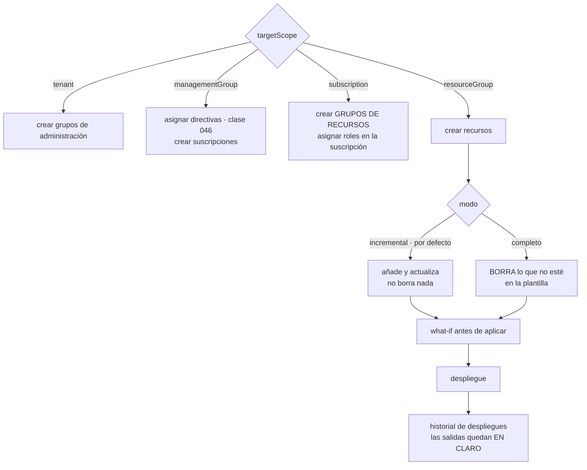

# 047 — Bicep, plantillas y despliegues por alcance

> [← Clase anterior](../../part-03-azure-core-platform/046-key-vault-defender-for-cloud-y-azure-policy/README.md) · [Índice de la parte](../README.md) · [Clase siguiente →](../../part-03-azure-core-platform/048-proyecto-aplicacion-de-tres-capas-en-azure/README.md)

**Parte:** 03 — Azure: plataforma esencial<br>
**Nivel:** intermedio · **Horas estimadas:** 4<br>
**Laboratorio:** `iac` · **Estado:** `EXECUTABLE_CORE`

## 🎯 Propósito

Declarar la infraestructura de Azure con Bicep entendiendo lo que lo hace distinto de todo lo que viene después en la parte 07: **no hay archivo de estado**, porque el estado deseado se compara contra el propio Azure. Eso elimina una clase entera de problemas y crea otra, y en medio está el alcance del despliegue —grupo de recursos, suscripción, grupo de administración o inquilino—, que es la decisión que más plantillas rompe al empezar.

## 📚 Resultados de aprendizaje

Al finalizar podrás:

1. **Elegir** el alcance de un despliegue y saber qué recursos solo pueden crearse en cada uno.
2. **Distinguir** el modo incremental del completo y explicar exactamente qué borra el segundo.
3. **Leer** la salida de `what-if` sabiendo qué diferencias son reales y cuáles son ruido del proveedor.
4. **Evitar** la desaparición de recursos hijo al mezclar declaración en línea y declaración independiente.
5. **Manejar** secretos en plantillas sin dejarlos en el historial de despliegues.

## 🧩 Conceptos centrales

| Concepto | Comprensión verificable |
|---|---|
| `alcance de despliegue` | Nivel en el que se ejecuta la plantilla: `resourceGroup`, `subscription`, `managementGroup` o `tenant`. Determina qué se puede crear: un grupo de recursos solo se crea desde el alcance de suscripción. |
| `modo completo` | Modo de despliegue que **elimina del grupo de recursos todo lo que no aparece en la plantilla**. No avisa por separado: es parte de la operación. |
| ``what-if`` | Simulación del cambio antes de aplicarlo. Es imprescindible y no es infalible: algunos proveedores informan de modificaciones que no ocurren, y ese ruido enseña a ignorarla. |
| `recurso hijo en línea o independiente` | Las reglas de un NSG, los ajustes de una aplicación o las entradas de DNS pueden declararse dentro del padre o como recurso propio. **Mezclar ambas formas hace desaparecer las que no están en la plantilla que se despliega.** |
| `salida de despliegue` | Valor devuelto por la plantilla. Se guarda en el historial de despliegues **en claro** y lo lee cualquiera con permiso de lectura: nunca debe contener un secreto. |
| `pila de despliegue` | Agrupación de recursos gestionada como una unidad, con control de ciclo de vida y ajustes de denegación. Es la respuesta moderna a la brusquedad del modo completo. |

## 🧠 Modelo mental

En Azure, identidad y jerarquía organizacional preceden al recurso: tenant, management group, suscripción y resource group determinan el alcance de control.

Aplicado a esta clase, separa siempre cuatro planos: **intención** (qué necesita el usuario),
**configuración** (qué declaramos), **estado observado** (qué existe de verdad) y
**evidencia** (cómo sabemos que cumple). Confundirlos produce diseños que se ven correctos
en un diagrama pero fallan al operar.

## 🗺️ Flujo de razonamiento



## 📖 Desarrollo

### 1. Sin archivo de estado: qué se gana y qué se pierde

Bicep es una sintaxis que compila a la plantilla JSON del Azure Resource Manager. La correspondencia es uno a uno: no hay nada que Bicep pueda expresar que ARM no acepte, ni al revés. Eso lo convierte en una abstracción transparente, y explica por qué se puede adoptar sin apuesta: se puede volver al JSON en cualquier momento, y el resultado de compilarlo es exactamente lo que se despliega.

La diferencia estructural con la herramienta de la parte 07 está en otro sitio:

```text
Terraform   mantiene un archivo de ESTADO con lo que cree que existe
Bicep/ARM   no mantiene estado: pregunta a Azure qué hay ahora mismo
```

Lo que se gana con eso es una lista concreta de problemas que dejan de existir:

```text
no hay estado que bloquear entre dos despliegues simultáneos
no hay estado que se corrompa ni que haya que migrar
no hay secretos guardados en el estado
no hay que importar un recurso creado a mano: la próxima ejecución lo ve
```

Ese último punto es más importante de lo que parece. Un recurso creado desde el portal no rompe el siguiente despliegue: la plantilla declara lo que quiere y Azure concilia. Un recurso creado a mano fuera de una herramienta con estado, en cambio, exige un paso de importación explícito.

Y lo que se pierde también es concreto:

```text
no hay una lista de "lo que este código gestiona"
  → nadie sabe qué recursos pertenecen a esta plantilla y cuáles no
no se detecta que alguien BORRÓ algo
  → la plantilla lo vuelve a crear en el siguiente despliegue,
    sin decir que había desaparecido
no hay destrucción ordenada del conjunto
  → borrar lo desplegado es borrar el grupo de recursos, o usar modo completo
```

La primera pérdida es la que causa incidentes. Sin una lista de pertenencia, la única forma de preguntar «¿qué gestiona esta plantilla?» es leerla, y la única forma de limpiar lo que sobra es el modo completo, que es un instrumento romo. Las **pilas de despliegue** existen precisamente para cubrir ese hueco: agrupan los recursos de un despliegue como una unidad con ciclo de vida propio y ajustes que impiden modificarlos fuera de la pila. Es lo más parecido a una lista de pertenencia que ARM ofrece, y conviene usarlas donde el conjunto tiene identidad —un entorno, un servicio completo—.

Una consecuencia práctica que conviene tener presente desde el principio: **la unidad natural de aislamiento en Azure es el grupo de recursos** (clase 037), y también lo es aquí. Un grupo de recursos por unidad desplegable evita casi todos los problemas que siguen, porque hace que la pregunta «qué pertenece a esta plantilla» tenga una respuesta obvia.

### 2. El alcance decide qué se puede crear

Es lo primero que rompe una plantilla al empezar, y el mensaje de error rara vez lo dice con claridad. Cada plantilla declara en qué nivel se ejecuta:

```bicep
targetScope = 'subscription'
```

Y el nivel determina qué recursos son válidos:

| Alcance | Se puede crear |
|---|---|
| `tenant` | Grupos de administración, asignaciones en la raíz |
| `managementGroup` | Asignaciones de directiva e iniciativas, suscripciones, asignaciones de rol |
| `subscription` | **Grupos de recursos**, directivas y roles de la suscripción |
| `resourceGroup` | Todo lo demás: la infraestructura propiamente dicha |

El caso que aparece siempre: **un grupo de recursos no se puede crear desde una plantilla de alcance `resourceGroup`**, porque el grupo tendría que existir ya para poder ejecutarla. La estructura correcta es una plantilla de suscripción que cree los grupos y llame a módulos dentro de cada uno:

```bicep
targetScope = 'subscription'

param entorno string
param ubicacion string = 'westeurope'

resource rgRed 'Microsoft.Resources/resourceGroups@2024-03-01' = {
  name: 'rg-cloudshop-red-${entorno}'
  location: ubicacion
}

module red 'modulos/red.bicep' = {
  name: 'despliegue-red'
  scope: rgRed                      // el módulo se ejecuta DENTRO del grupo
  params: { entorno: entorno, ubicacion: ubicacion }
}
```

La palabra clave es `scope` en el módulo: permite que una plantilla de un nivel despliegue en otro, que es como se construye una plataforma completa desde una sola ejecución. Y para referirse a algo que ya existe en otro sitio, sin crearlo:

```bicep
resource almacen 'Microsoft.KeyVault/vaults@2023-07-01' existing = {
  name: 'kv-cloudshop'
  scope: resourceGroup('rg-cloudshop-seg-prod')
}
```

`existing` no crea ni modifica nada: solo obtiene una referencia. Es la vía correcta para leer un identificador o un secreto de un recurso gestionado por otro equipo, y evita el antipatrón de pasar identificadores completos como parámetros de texto, que se rompen en cuanto algo cambia de nombre.

Dos precisiones que ahorran depuración:

**Los nombres de despliegue deben ser únicos por alcance y se conservan.** Reutilizar el mismo nombre sobrescribe la entrada del historial, que es justo lo que no se quiere cuando hay que investigar qué se desplegó cuando. Un nombre con marca de tiempo o con el identificador de la ejecución de la canalización resuelve el problema.

**Las funciones dependen del alcance.** `resourceGroup()` no existe en una plantilla de suscripción, y `subscription()` sí. Un error de «función no reconocida» casi siempre significa que la plantilla está en el nivel equivocado, no que la función esté mal escrita.

### 3. Modo completo y recursos hijo: las dos formas de borrar sin querer

**El modo de despliegue** tiene dos valores y una asimetría de consecuencias:

```text
incremental (por defecto)  añade lo que falta, actualiza lo que cambió,
                           NO toca lo que no aparece en la plantilla
completo                   además, ELIMINA del grupo de recursos
                           todo lo que no esté en la plantilla
```

El modo completo tiene un uso legítimo: garantizar que un entorno contiene exactamente lo declarado, sin residuos. Y tiene un riesgo que se materializa cuando el grupo de recursos contiene algo que otra persona creó por una razón válida — un disco de diagnóstico, una instantánea de una migración, un recurso de otro equipo. El despliegue no pregunta.

La protección no es la prudencia sino el diseño:

```text
1. un grupo de recursos por unidad desplegable
   → nada ajeno puede estar dentro
2. `what-if` obligatorio antes de aplicar en modo completo
   → las eliminaciones aparecen marcadas y hay que leerlas
3. bloqueo de recurso sobre lo que jamás debe borrarse (clase 042)
   → un bloqueo hace fallar el despliegue en vez de perder el recurso
```

La segunda forma de borrar sin querer es más sutil y no depende del modo. Muchos recursos de Azure admiten declarar sus hijos de dos maneras:

```bicep
// (a) en línea, dentro del padre
resource nsg 'Microsoft.Network/networkSecurityGroups@2024-01-01' = {
  name: 'nsg-app'
  location: ubicacion
  properties: {
    securityRules: [ { name: 'allow-lb-probe', properties: { /* … */ } } ]
  }
}

// (b) como recurso independiente
resource regla 'Microsoft.Network/networkSecurityGroups/securityRules@2024-01-01' = {
  parent: nsg
  name: 'allow-appgw-8080'
  properties: { /* … */ }
}
```

Cada forma es correcta por separado. **Mezclarlas destruye datos**: la declaración en línea es la lista completa de reglas, así que al desplegar el padre, Azure sustituye el conjunto entero por lo que hay en línea y **las reglas declaradas aparte desaparecen**. En el siguiente despliegue de la plantilla que las declaraba, vuelven. El resultado es un juego de reglas que aparecen y desaparecen según qué canalización se ejecutó la última, con incidentes de conectividad intermitentes de causa muy difícil de ver.

La regla de equipo es de una línea: **para cada tipo de recurso hijo, se elige una de las dos formas y se documenta**. Ocurre igual con los ajustes de aplicación de App Service, las reglas de firewall de una base de datos y los registros de una zona DNS.

Y el mismo mecanismo explica otra sorpresa habitual: un despliegue que «borra» la configuración que alguien puso a mano en el portal. No la borra por malicia — la plantilla declara el estado completo de esa propiedad, y lo que no está declarado vuelve a su valor por omisión. Es el comportamiento correcto de una herramienta declarativa, y es la razón por la que la configuración manual y la declarada no pueden convivir sobre el mismo recurso.

### 4. `what-if`, validación y el ruido que enseña a no mirar

`what-if` compara el estado deseado con el actual y muestra el cambio antes de aplicarlo:

```bash
$ az deployment group what-if -g rg-cloudshop-app-prod \
    --template-file main.bicep --parameters @prod.bicepparam

Resource and property changes are indicated with these symbols:
  + Create   ~ Modify   - Delete   = NoChange

~ Microsoft.Web/sites/app-tienda
  ~ properties.siteConfig.alwaysOn:  false → true
+ Microsoft.Insights/components/appi-tienda
```

Es obligatorio antes de cualquier aplicación y especialmente antes del modo completo, donde las líneas con `-` son las que hay que leer con atención.

Y tiene una limitación que hay que conocer para que no la desactive de hecho: **algunos proveedores informan de modificaciones que no van a ocurrir**. Devuelven propiedades calculadas o normalizan valores, y `what-if` las presenta como diferencias. El resultado predecible es que una salida con treinta líneas de ruido en cada ejecución enseña al equipo a hojearla, y el día que aparece un cambio real pasa desapercibido.

Las medidas que lo mantienen legible:

```text
módulos pequeños       una salida corta se lee; una de 300 líneas se hojea
lista de exclusiones   `--exclude-change-types NoChange Ignore`
tipos ruidosos aparte  desplegar por separado lo que siempre informa cambios
revisar el ruido       si una propiedad aparece siempre, o falta en la plantilla
                       o es calculada: en el primer caso, se añade y desaparece
```

La última es la más rentable: buena parte del ruido de `what-if` es real y señala propiedades que el proveedor fija y la plantilla no declara. Declararlas explícitamente elimina la línea y, de paso, documenta el valor.

La validación previa completa la red:

```bash
$ bicep lint main.bicep                    # reglas del linter, en el editor y en CI
$ az deployment group validate -g rg-cloudshop-app-prod \
    --template-file main.bicep --parameters @prod.bicepparam
```

`validate` comprueba sintaxis, referencias y permisos sin crear nada. Es rápida y detecta el error de alcance, el nombre inválido y el parámetro que falta — los tres fallos que si no aparecen en CI aparecen a mitad de un despliegue, con parte de los recursos ya creados.

Y eso lleva al punto que más tranquiliza saber de antemano: **un despliegue fallido no se revierte solo**. Si diez de quince recursos se crearon y el undécimo falla, los diez se quedan. ARM no tiene transacción. La consecuencia de diseño es que las plantillas deben ser **idempotentes y reejecutables**: la respuesta a un fallo a medias es corregir y volver a desplegar, no limpiar a mano. Una plantilla que solo funciona sobre un grupo de recursos vacío es una plantilla que no sirve para operar.

### 5. Secretos, módulos y el historial que todo el mundo puede leer

Tres prácticas cierran la clase, y la primera es la que más veces está mal.

**Las salidas quedan en claro en el historial de despliegues.** Cualquiera con permiso de lectura sobre el grupo de recursos puede consultarlas:

```bash
$ az deployment group show -g rg-cloudshop-app-prod -n despliegue-app \
    --query "properties.outputs" -o json
```

Devolver una cadena de conexión, una clave o una contraseña como salida es publicarla. Y no basta con dejar de hacerlo: **el historial conserva las anteriores**, así que un secreto que estuvo en una salida hay que considerarlo comprometido, rotarlo y borrar esa entrada del historial.

La forma correcta de que una plantilla use un secreto sin verlo:

```bicep
resource almacen 'Microsoft.KeyVault/vaults@2023-07-01' existing = {
  name: 'kv-cloudshop'
  scope: resourceGroup('rg-cloudshop-seg-prod')
}

module baseDatos 'modulos/sql.bicep' = {
  name: 'despliegue-sql'
  params: {
    contrasena: almacen.getSecret('sql-admin-password')   // no pasa por la plantilla
  }
}
```

`getSecret()` solo funciona pasando el valor a un parámetro marcado como seguro dentro de un módulo, y esa restricción es deliberada: impide usarlo en una expresión que acabe en un registro o en una salida.

```bicep
@secure()
@description('Contraseña del administrador. No se registra ni se devuelve.')
param contrasena string
```

Un parámetro `@secure()` se omite en el historial y en los registros. Sin la anotación, el valor del archivo de parámetros queda registrado igual que cualquier otro.

Y la mejor opción sigue siendo no tener el secreto: si el recurso admite identidad administrada, la clase 038 ya dio la respuesta — no hay contraseña que pasar.

**Los módulos se versionan como código.** Un módulo publicado en un registro de contenedores se referencia por versión, y eso permite que un equipo actualice cuando le convenga en vez de cuando otro despliegue:

```bicep
module red 'br:acrcloudshop.azurecr.io/bicep/modules/red:1.4.0' = {
  name: 'despliegue-red'
  params: { entorno: 'prod' }
}
```

Sin versión —referencias a una ruta local compartida o a `latest`— un cambio en el módulo se aplica a todos los que lo usan en su siguiente despliegue, que puede ser el de producción de otro equipo un viernes. Es el mismo argumento de fijar versiones de dependencias, aplicado a la infraestructura.

**Y la plantilla es el sitio donde vive el gobierno de la parte.** Las decisiones de las clases anteriores se declaran, no se recuerdan:

```bicep
resource cuenta 'Microsoft.Storage/storageAccounts@2023-05-01' = {
  name: nombreCuenta
  location: ubicacion
  sku: { name: 'Standard_ZRS' }                 // redundancia decidida (041)
  kind: 'StorageV2'
  properties: {
    allowBlobPublicAccess: false                // acceso público cerrado (041)
    allowSharedKeyAccess: false                 // sin clave compartida (041)
    minimumTlsVersion: 'TLS1_2'
    publicNetworkAccess: 'Disabled'             // solo punto privado (039)
  }
  tags: etiquetas                               // atribución de costo (037)
}
```

Seis decisiones de cuatro clases distintas, en un recurso. Esa es la función real de la infraestructura como código en este programa: **convertir lo que se aprendió en algo que no se puede olvidar al crear el siguiente recurso**. Y lo que la plantilla no puede garantizar por sí sola —que nadie lo cambie después— lo cubre la directiva de la clase 046. Las dos capas juntas son el mecanismo; ninguna de las dos basta sola.

## 🔬 Ejemplo trabajado

**CloudShop pasa a declarar su plataforma Azure en Bicep. La primera versión funciona y produce cuatro incidentes en dos meses, todos por comportamientos de ARM que la plantilla no controlaba.**

Punto de partida:

```text
un único main.bicep de 1.100 líneas, alcance resourceGroup
un grupo de recursos compartido: rg-cloudshop-prod
despliegue en modo completo "para que quede limpio"
los parámetros incluyen la contraseña de SQL en texto
```

**Incidente 1 — el despliegue borra un disco de otro equipo.**

El equipo de datos había creado una instantánea en el mismo grupo de recursos para una migración. El siguiente despliegue en modo completo la eliminó, junto con una cuenta de almacenamiento temporal con 900 GB.

```text
What-if habría mostrado:
  - Microsoft.Compute/snapshots/migracion-2026-06
  - Microsoft.Storage/storageAccounts/stmigraciontmp
pero no se ejecutó: el modo completo estaba en la canalización sin paso previo
```

Se corrige por diseño y no por prudencia:

```text                              antes                    después
grupos de recursos              1 compartido      4, uno por unidad desplegable
modo de despliegue              completo          incremental + pila de despliegue
`what-if` en la canalización    no                sí, obligatorio y revisado
bloqueos de recurso             ninguno           sobre almacén y servidor SQL
```

La pila de despliegue da lo que faltaba: una lista de qué pertenece a este despliegue, y un borrado ordenado cuando se retire el entorno.

**Incidente 2 — reglas de NSG que aparecen y desaparecen.**

Durante tres semanas hay fallos de conectividad intermitentes hacia la base de datos. La regla que permite el puerto 5432 desde `snet-app` está unas veces y otras no.

```bash
$ az network nsg rule list -g rg-cloudshop-red --nsg-name nsg-datos \
    --query "[].name" -o tsv
allow-lb-probe
deny-lateral
# falta allow-app-5432
```

La causa estaba repartida entre dos plantillas: la de red declaraba `securityRules` **en línea** dentro del NSG, y la de la aplicación declaraba `allow-app-5432` como recurso hijo independiente. Cada despliegue de red sustituía la lista completa y se llevaba la regla de la otra.

```text                                     antes              después
forma de declarar reglas         mezclada (dos plantillas)  solo recurso hijo
convención documentada                    no                     sí
fallos de conectividad en 3 semanas       11                      0
```

La regla escrita para el resto de la plataforma es la que evita la repetición: **para cada tipo de recurso hijo, una sola forma, y se decide una vez** — reglas de NSG, ajustes de aplicación, reglas de firewall de base de datos y registros de DNS.

**Incidente 3 — una cadena de conexión legible por veinte personas.**

Una auditoría de accesos revisa el historial de despliegues:

```bash
$ az deployment group show -g rg-cloudshop-app-prod -n despliegue-app \
    --query "properties.outputs.cadenaConexion.value" -o tsv
Server=tcp:sql-cloudshop-prod.database.windows.net;…;Password=…
```

La plantilla la devolvía como salida para que la usara el paso siguiente de la canalización. Cualquiera con permiso de lectura sobre el grupo de recursos —veintiuna personas— podía consultarla, y estaba en las 47 entradas del historial.

```text                                antes                después
secreto en salidas                    sí                    no
parámetro de contraseña          texto plano       @secure() + getSecret()
credencial de la aplicación        contraseña      identidad administrada (038)
historial con el secreto          47 entradas       purgado y contraseña rotada
```

La tercera fila es la corrección de fondo: el paso siguiente de la canalización no necesitaba la cadena, necesitaba poder conectarse. Con identidad administrada no hay ninguna cadena que pasar.

**Incidente 4 — el cambio real que nadie vio entre el ruido.**

Un despliegue rutinario deja el `Always On` de la aplicación de administración en `false`, y el servicio empieza a tardar ocho segundos en la primera petición de la mañana (clase 043). El `what-if` de esa ejecución lo mostraba:

```text
~ Microsoft.Web/sites/app-admin
  ~ properties.siteConfig.alwaysOn: true → false
```

Entre otras **214 líneas**, casi todas propiedades calculadas que aparecían en todas las ejecuciones. Nadie las leía desde hacía semanas.

```text                                antes            después
líneas de what-if por ejecución        214               9
módulos                            1 de 1.100 líneas   7 módulos
propiedades calculadas declaradas       no          sí, 31 añadidas
revisión del what-if en el pull request  informal    obligatoria, con aprobación
```

La reducción de 214 a 9 no se consiguió filtrando: se consiguió **declarando explícitamente** las propiedades que el proveedor fijaba y la plantilla no mencionaba. El ruido era información sobre lo que faltaba en la plantilla.

**Resumen del paso a infraestructura declarada:**

```text                                          antes          después
tamaño de la plantilla principal            1.100 líneas    7 módulos versionados
grupos de recursos                          1 compartido    4 por unidad
modo de despliegue                          completo       incremental + pila
recursos borrados por accidente                  2               0
fallos de conectividad por reglas volátiles     11               0
secretos en el historial de despliegues         47               0
líneas de what-if por ejecución                 214               9
tiempo de despliegue completo                 22 min          14 min
reversión ensayada                              no        sí, versión anterior
                                                            del módulo, 6 min
```

**La lección que esta clase traslada al proyecto de la clase 048 y a la parte 07**: una plantilla no es un guion de creación, es la **declaración del estado completo** de lo que toca. Todo lo que no declara vuelve a su valor por omisión, todo lo que declara dos veces se lo disputan dos canalizaciones, y todo lo que devuelve queda escrito donde muchos pueden leerlo. Entender esas tres consecuencias es la diferencia entre automatizar la infraestructura y automatizar los incidentes.

## 🧪 Laboratorio guiado

Ejecuta desde la raíz:

```bash
python classes/part-03-azure-core-platform/047-bicep-plantillas-y-despliegues-por-alcance/lab.py
```

El laboratorio selecciona el motor de práctica **`iac`** y produce
`lab_result.json`. El escenario, sus comprobaciones y el artefacto esperado corresponden a
esta clase; no requiere credenciales y deja explícito qué debe revalidarse en un sandbox real.

1. Lee `exercise.steps` y formula una predicción antes de ejecutar.
2. Ejecuta la práctica y verifica todos los elementos de `checks`.
3. Provoca el caso de `negative_test` y explica la señal observada.
4. Materializa `infraestructura-bicep` en `evidence/` usando la plantilla indicada.
5. Para proveedor real, sigue `sandbox.requires`, registra costo y ejecuta `destroy`.

### Evidencia esperada

El artefacto principal es un plan reproducible sin secretos ni cambios inesperados. Además, la entrega debe incluir el comando ejecutado,
la salida estructurada y una conclusión que no exceda lo observado.

## 🏆 Reto verificable

Construye **`infraestructura-bicep`** para el caso CloudShop. Incluye una alternativa descartada,
un supuesto que pueda falsarse, una prueba de fallo y una decisión de rollback.

## ✅ Criterio de aceptación

- [ ] `lab.py` termina con código 0 y genera JSON válido.
- [ ] La entrega conecta al menos tres requisitos con mecanismos verificables.
- [ ] Existe una prueba positiva y una prueba negativa con evidencia.
- [ ] Seguridad, costo y operación aparecen como decisiones, no como anexos.
- [ ] Se declara una limitación y una condición que obligaría a revisar el diseño.
- [ ] Otra persona puede repetir el recorrido sin conocimiento tácito.

## ⚠️ Errores frecuentes

| Síntoma | Causa probable | Corrección |
|---|---|---|
| Un despliegue elimina recursos que nadie tocó en la plantilla | El modo completo borra todo lo que no aparece en ella, y el grupo de recursos era compartido | Un grupo de recursos por unidad desplegable, modo incremental con pila de despliegue y `what-if` obligatorio antes de aplicar. |
| Unas reglas de red aparecen y desaparecen según qué canalización se ejecutó la última | El mismo tipo de recurso hijo está declarado en línea en una plantilla y como recurso independiente en otra | Elige una sola forma por tipo de recurso hijo, documéntala y aplícala en todas las plantillas. |
| Una contraseña aparece en el historial de despliegues | Se devolvió como salida o se pasó a un parámetro sin `@secure()` | Marca el parámetro como seguro, obtén el valor con `getSecret()` y, mejor aún, sustituye la credencial por identidad administrada; rota lo que ya se expuso. |
| Nadie revisa la salida de `what-if` porque siempre muestra decenas de cambios | La plantilla no declara propiedades que el proveedor fija, y aparecen como diferencias en cada ejecución | Declara esas propiedades explícitamente y divide en módulos: el objetivo es una salida corta que se lea de verdad. |
| Un despliegue falla a medias y deja recursos creados | ARM no tiene transacción: no revierte lo ya aplicado | Escribe plantillas idempotentes y reejecutables; la respuesta a un fallo parcial es corregir y volver a desplegar. |
| Error de función no reconocida o de recurso no válido al desplegar | La plantilla está en un alcance que no permite ese recurso o esa función | Ajusta `targetScope` y despliega dentro del nivel correcto con módulos y el parámetro `scope`. |

## 🛡️ Seguridad, ética y costo

Trabaja con cuentas propias o sandboxes autorizados. No publiques secretos, identificadores
reales ni datos personales. Antes de crear recursos pagos define presupuesto, etiquetas y
comando de destrucción; después verifica que no queden recursos huérfanos. Los ejemplos
locales enseñan contratos, pero no certifican cumplimiento ni disponibilidad de producción.

## ❓ Preguntas de comprobación

1. ¿Qué problemas desaparecen al no haber archivo de estado, y qué capacidad se pierde a cambio?
2. ¿Desde qué alcance se crea un grupo de recursos, y por qué no se puede hacer desde el de grupo de recursos?
3. Describe exactamente cómo desaparece una regla de NSG al mezclar declaración en línea y recurso independiente.
4. ¿Por qué una salida de despliegue no puede contener un secreto, y qué hay que hacer si ya lo contuvo?
5. Tu `what-if` muestra 200 líneas en cada ejecución. ¿Qué te dice eso sobre la plantilla y cómo lo reduces?

## 🔗 Referencias

- Microsoft (2025). *What is Bicep?* — relación con ARM, módulos y compilación transparente. <https://learn.microsoft.com/en-us/azure/azure-resource-manager/bicep/overview>
- Microsoft (2025). *Deployment scopes in Bicep* — `targetScope`, módulos con `scope` y qué se crea en cada nivel. <https://learn.microsoft.com/en-us/azure/azure-resource-manager/bicep/deploy-to-subscription>
- Microsoft (2025). *Azure Resource Manager deployment modes* — incremental frente a completo y qué elimina cada uno. <https://learn.microsoft.com/en-us/azure/azure-resource-manager/templates/deployment-modes>
- Microsoft (2025). *Deployment what-if operation* — símbolos, limitaciones y ruido de proveedores. <https://learn.microsoft.com/en-us/azure/azure-resource-manager/bicep/deploy-what-if>
- Microsoft (2025). *Use Azure Key Vault to pass secure parameter values* — `@secure()`, `getSecret()` e historial de despliegues. <https://learn.microsoft.com/en-us/azure/azure-resource-manager/bicep/key-vault-parameter>
- Documentación oficial vigente del servicio implementado; registra URL y fecha de consulta.

---

> [Evaluación](assessment.md) · [Contrato de clase](lesson.yaml) · [Índice de la parte](../README.md)
