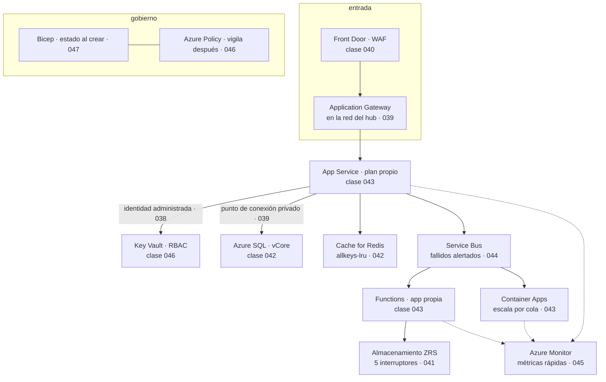

# 048 — Proyecto: aplicación de tres capas en Azure

> [← Clase anterior](../../part-03-azure-core-platform/047-bicep-plantillas-y-despliegues-por-alcance/README.md) · [Índice de la parte](../README.md) · [Clase siguiente →](../../part-04-gcp-core-platform/049-organizacion-folders-proyectos-billing-y-cuotas/README.md)

**Parte:** 03 — Azure: plataforma esencial<br>
**Nivel:** intermedio · **Horas estimadas:** 8<br>
**Laboratorio:** `capstone` · **Estado:** `EXECUTABLE_CORE`

## 🎯 Propósito

Integrar las once clases anteriores en una plataforma Azure que funcione, se observe, falle de forma controlada y cueste algo explicable — y responder con evidencia la pregunta que abrió la parte: **de todo lo aprendido en AWS, qué era arquitectura y ha reaparecido, y qué era mecanismo del proveedor**. La respuesta a esa pregunta, escrita y con las excepciones señaladas, es lo que se lleva a la parte 04 y lo que hace que la tercera plataforma cueste una fracción de esfuerzo que la segunda.

## 📚 Resultados de aprendizaje

Al finalizar podrás:

1. **Trazar** cada componente de la arquitectura hasta la clase que lo decidió y la alternativa descartada.
2. **Separar** el contrato portable del mecanismo específico del proveedor, señalando dónde no hubo equivalencia.
3. **Declarar** la línea base en dos capas: lo que la plantilla garantiza y lo que la directiva vigila.
4. **Provocar** tres fallos y medir detección, impacto y recuperación en cada uno.
5. **Comparar** dos plataformas con una unidad común, sabiendo por qué comparar facturas no sirve.

## 🧩 Conceptos centrales

| Concepto | Comprensión verificable |
|---|---|
| `trazabilidad de decisión` | Cada componente debe poder responder tres preguntas: qué requisito lo exige, qué alternativa se descartó y qué evidencia demuestra que cumple. Un componente sin las tres es una elección, no una decisión. |
| `contrato portable` | Lo que sobrevive al cambio de proveedor: el requisito, el patrón y la propiedad exigida al manejador. Cambia el nombre del servicio, no la obligación. |
| `línea base en dos capas` | La plantilla garantiza el estado al crear; la directiva vigila que siga así. Ninguna de las dos basta sola: la primera no impide un cambio posterior y la segunda no crea nada. |
| `hallazgo de prueba de fallo` | Lo que aparece al romper algo y no aparecía en ninguna configuración ni en ningún panel. Es el entregable real de un simulacro; que «todo aguantó» significa que el simulacro fue demasiado suave. |
| `riesgo residual declarado` | Lo que se decide no cubrir, con su motivo, su responsable y la condición que obligaría a revisarlo. Un riesgo no escrito no está aceptado: está ignorado. |
| `costo por unidad de negocio` | Única forma útil de comparar dos plataformas. Comparar facturas totales compara arquitecturas y tamaños distintos, no proveedores. |

## 🧠 Modelo mental

En Azure, identidad y jerarquía organizacional preceden al recurso: tenant, management group, suscripción y resource group determinan el alcance de control.

Aplicado a esta clase, separa siempre cuatro planos: **intención** (qué necesita el usuario),
**configuración** (qué declaramos), **estado observado** (qué existe de verdad) y
**evidencia** (cómo sabemos que cumple). Confundirlos produce diseños que se ven correctos
en un diagrama pero fallan al operar.

## 🗺️ Flujo de razonamiento



## 📖 Desarrollo

### 1. De dónde sale cada decisión, y qué trampa evitó

La arquitectura de la entrega no es una elección de servicios: es el resultado de once decisiones con su alternativa descartada. La tabla que hay que poder defender:

| Componente | Requisito que lo exige | Alternativa descartada | Trampa de Azure que evita |
|---|---|---|---|
| Grupos de recursos por unidad | Aislamiento de despliegue y borrado (037) | Un grupo compartido | El modo completo borrando lo ajeno (047) |
| Identidad administrada asignada por el usuario | Sin secretos y flota compartida (038) | Secreto de aplicación con dos años | La rotación que nadie hace |
| Roles de datos además de gestión | Leer blobs y secretos (038) | `Owner` sobre la suscripción | `AuthorizationPermissionMismatch` con Owner |
| NAT Gateway + subred sin salida | Salida declarada y auditable (039) | Confiar en la salida implícita | La «subred privada» que no lo era |
| Puntos de conexión privados + zona DNS | Datos fuera de internet (039) | Endpoints de servicio | Funcionar por el camino público sin saberlo |
| App Service en planes separados | Radio de impacto (043) | Un plan para todo | El vecino ruidoso que degrada la tienda |
| Aplicación de funciones por perfil de carga | Aislar lo interactivo (043) | Una sola aplicación | El escalado por aplicación, no por función |
| Service Bus para el trabajo | Entrega con fallo visible (044) | Event Hubs «porque escala» | La partición bloqueada sin cola de fallidos |
| Azure SQL vCore | Diagnóstico por recurso (042) | Modelo DTU | El 100 % que no dice de qué |
| Alertas de métrica para lo urgente | Detección en un minuto (045) | Alertas de registro | Nueve minutos estructurales |
| Bicep + directiva | Estado al crear y vigilancia después (046, 047) | Solo plantillas | El control que alguien revierte |

Cada fila responde a las tres preguntas de una decisión trazable: qué requisito, qué alternativa y qué evidencia. La cuarta columna es la que solo se puede escribir después de haber recorrido la parte: **es la lista de errores que esta plataforma ya no puede cometer**, porque su diseño los excluye en vez de confiar en que nadie los repita.

Y hay cuatro decisiones que se tomaron **en contra** de lo que sugería la traducción desde AWS, que conviene destacar porque son las que un revisor cuestionará:

```text
1. No se usó el grupo de recursos como equivalente de la cuenta de AWS.
   Las cuotas son de la suscripción y no hay aislamiento de red entre
   grupos (037): la frontera de aislamiento es la suscripción.

2. No se buscó un equivalente del `Deny` de IAM.
   Azure RBAC es aditivo; lo que cumple esa función es Azure Policy,
   y opera en otro plano y con otro código de error (038, 046).

3. No se replicó el patrón de subred pública y privada por tabla de rutas.
   No existe: hay que declarar la salida y desactivarla explícitamente (039).

4. No se eligió redundancia geográfica para los datos de facturación.
   La región emparejada la asigna Microsoft y quedaba fuera de la
   jurisdicción aprobada (041): se usó ZRS más replicación explícita.
```

Las cuatro tienen la misma forma: **el objetivo se conserva y el mecanismo no tiene equivalente**. Reconocer esa forma es lo que hace útil la comparación entre proveedores; buscar la traducción literal es lo que produce los incidentes de esta parte.

### 2. Lo portable y lo del proveedor, con las excepciones señaladas

Este es el entregable intelectual de la parte, y sirve exactamente para una cosa: hacer que la parte 04 cueste una fracción del esfuerzo.

**Lo que se repitió sin cambios** —el contrato— y solo cambió de nombre:

| Contrato que se conserva | En AWS (parte 02) | En Azure (parte 03) |
|---|---|---|
| Identidad de carga sin secretos | Rol de instancia y OIDC | Identidad administrada y federación |
| Sujeto de federación acotado | `sub` del rol federado | `subject` de la credencial federada |
| Frontera de aislamiento del entorno | Cuenta | **Suscripción** |
| Salida declarada y con costo por GB | NAT gateway | NAT Gateway |
| Acceso privado a servicios gestionados | Endpoint de interfaz | Punto de conexión privado |
| Entrega al menos una vez | SQS y sus reintentos | Service Bus y su bloqueo |
| Cola de mensajes fallidos con alerta a cero | Explícita | Automática, y sin alerta |
| Idempotencia en el manejador | Obligatoria | Obligatoria |
| Clave de partición como decisión irreversible | DynamoDB | Cosmos DB, con tope duro de 20 GB |
| Prueba negativa por control | Obligatoria | Obligatoria |
| Costo por unidad de negocio | Etiquetas y atribución | Etiquetas y atribución |

Once filas. **Ninguna de las once tuvo que volver a aprenderse**, y todas se implementaron más rápido la segunda vez.

**Lo que no tuvo equivalencia** y hubo que aprender de cero:

```text
dos planos de identidad          roles de directorio y roles de recurso
                                 son sistemas distintos (038)
actions frente a dataActions     gestionar un recurso no es leer sus datos (038)
sin subred privada por defecto   la salida es el estado inicial (039)
dos NSG en cadena                subred y NIC, ambos deben permitir (039)
dos límites de disco             el de la máquina suele mandar (040)
la cuenta como unidad            redundancia, red y claves son de la cuenta (041)
región emparejada asignada       no se elige el destino (041)
la unidad que escala             plan, aplicación de funciones, revisión (043)
Deny no toca lo existente        el gobierno actúa sobre la petición (046)
alcance de despliegue            qué se puede crear depende del nivel (047)
```

Diez conceptos. Ese es el tamaño real de la diferencia entre dos plataformas grandes: **once contratos que se reutilizan y diez mecanismos que se aprenden**. No es una proporción intuitiva, y explica por qué la segunda nube cuesta mucho menos de lo que la gente teme y la primera mucho más de lo que espera.

Y la conclusión operativa que se lleva a la parte 04: al abrir un proveedor nuevo, las once preguntas de la primera tabla ya están escritas y solo hay que averiguar **cómo se llama la respuesta**. El trabajo real está en detectar las excepciones —los sitios donde la respuesta es «aquí no existe»—, porque son las que producen incidentes cuando se asume equivalencia.

### 3. La línea base en dos capas, que es el entregable que más dura

La configuración de una plataforma se degrada. No por descuido excepcional, sino por caminos normales: alguien recrea un recurso desde una plantilla vieja, una excepción temporal se queda, un despliegue sobrescribe un ajuste. Un control verificado una vez es un control verificado en el pasado.

Por eso la línea base se declara en dos capas que hacen cosas distintas:

```text
capa 1 · Bicep      fija el estado en el momento de crear
                    lo que no declara vuelve a su valor por omisión (047)
capa 2 · Policy     vigila que siga así después
                    y en modo Audit lo hace sin bloquear nada (046)
```

Ninguna basta sola. La plantilla no impide que alguien cambie algo mañana desde el portal; la directiva no crea nada y solo constata. Juntas, un cambio fuera de la plantilla aparece como incumplimiento en horas.

La línea base concreta de esta entrega, con la clase que la justifica:

```text
red
  ninguna subred con salida no declarada                              039
  todo acceso a datos por punto de conexión privado con zona DNS      039
  segmentación explícita entre subredes                               039
datos
  acceso público deshabilitado en almacenamiento y base de datos      041, 042
  acceso con clave compartida deshabilitado                           041
  cinco interruptores de protección activos y probados                041
  retención a largo plazo y bloqueo sobre el servidor lógico          042
identidad
  cero secretos de aplicación; identidad administrada en todo         038
  Key Vault con RBAC y protección contra purga                        046
  roles privilegiados elegibles, no permanentes                       038
cómputo
  un plan por radio de impacto; una app de funciones por perfil       043
  sonda de estado que ejercita dependencias                           040
asíncrono
  manejadores idempotentes                                            044
  alerta de mensajes fallidos con umbral cero                         044
  alerta de acumulación en cada consumidor                            045
observabilidad
  diagnóstico activado por directiva en el 100 % de los recursos      045
  agregaciones con `sum(itemCount)`, nunca `count()`                  045
  alertas de métrica para lo urgente                                  045
gobierno
  cero exclusiones de ámbito; excepciones como exenciones con caducidad 046
  etiquetas de atribución de costo obligatorias                       037
```

Veintitrés afirmaciones. Cada una tiene su prueba negativa en el guion de verificación, y cada una tiene además una directiva en modo `Audit` que la vigila. Esa duplicidad es deliberada: el guion demuestra el estado **hoy**, la directiva detecta la desviación **mañana**.

Y el criterio para decidir qué entra en la línea base, que evita que crezca hasta ser inmanejable: **entra lo que, si se revierte, produce un incidente o una brecha**. Lo demás es una preferencia y se documenta en otro sitio.

### 4. Tres fallos provocados y lo que enseñó cada uno

Un simulacro en el que todo aguanta no aporta información: significa que fue demasiado suave. Los tres de esta entrega se eligieron porque atacan tres supuestos distintos.

**Fallo 1 — caída de una zona.** Se detienen las instancias de la zona 1 en el plan de App Service y se fuerza la conmutación de la base de datos.

```text
detección por alerta de métrica              52 s
p95 durante el episodio                     212 ms  (SLO 500 ms)
errores HTTP observados por el cliente      1.104
recuperación completa                       3 min 40 s
```

**Y el hallazgo, que ninguna configuración mostraba.** Los 1.104 errores no vinieron del frontal ni del balanceador: vinieron de la base de datos durante los 38 segundos de su conmutación entre réplicas. Azure SQL devuelve errores transitorios identificables durante ese intervalo —`40613`, `40501`, `49918`— y la aplicación no los reintentaba: los propagaba como error 500.

```text
síntoma observable      ninguno en los paneles de infraestructura
consecuencia real       1.104 peticiones perdidas, 47 pedidos sin registrar
causa                   sin manejo de fallos transitorios en el acceso a datos
```

La corrección no es de infraestructura: es de código, y es obligatoria en Azure SQL porque **la conmutación es parte del funcionamiento normal**, no un incidente.

```text
1. reintento con retroceso exponencial para los códigos transitorios conocidos
2. tiempo de espera de conexión menor que el plazo de la petición
3. la prueba de fallo pasa a incluir una conmutación forzada, no solo
   la caída de las instancias de cómputo
```

**Fallo 2 — revocación de la clave gestionada por el cliente.** Se retira el permiso de la identidad sobre la clave que cifra el almacenamiento, para comprobar que el control funciona y medir su radio.

```text
tiempo hasta que el almacenamiento queda inaccesible   11 min (caché de la clave)
servicios afectados esperados                          1 (subida de facturas)
servicios afectados reales                             3
recuperación tras restaurar el permiso                 6 min
```

**El hallazgo:** la misma cuenta de almacenamiento recibía la exportación del registro de actividad y el destino de mensajes fallidos de Event Grid. Revocar la clave no solo detuvo la subida de facturas: **detuvo la evidencia de auditoría y el destino de los eventos que fallaban**, justo cuando más falta hacían. El control funcionaba; el radio de impacto estaba mal estimado porque una cuenta servía a tres propósitos.

```text
corrección   separar por propósito: facturas, auditoría y eventos fallidos
             en cuentas distintas, con claves distintas
registro     el orden de las operaciones de revocación y restauración
             queda documentado como procedimiento, no improvisado
```

**Fallo 3 — consumidor detenido en silencio.** Se detiene el consumidor de notificaciones sin apagar nada más, que es la forma en que este sistema falló dos veces durante la parte.

```text                              antes de la parte 03    en la entrega
detección                            ninguna (2 días)         4 min 20 s
mensajes acumulados al detectar      41.000                     680
señal que lo detectó                   —              profundidad de cola
```

**El hallazgo:** la alerta se disparó correctamente y apuntaba a un procedimiento que describía cómo reiniciar el consumidor, sin decir cómo comprobar si los mensajes acumulados se habían procesado o duplicado tras el reinicio. La detección funcionaba y la respuesta estaba incompleta.

```text
corrección   el procedimiento incluye la verificación posterior:
             recuento de notificaciones enviadas frente a pedidos del intervalo,
             apoyándose en la idempotencia del manejador (044)
```

Los tres hallazgos tienen la misma forma, y merece la pena decirlo explícitamente porque es la lección de la parte: **la infraestructura aguantó los tres fallos y en los tres se perdió algo**. Lo que falló fue el manejo de errores transitorios, la estimación del radio de impacto y la completitud del procedimiento. Ninguna de las tres cosas aparece en una revisión de configuración.

### 5. La entrega, la comparación honesta y la pregunta que abre la parte 04

**La entrega, sin conocimiento tácito.** El criterio es el de la clase 036 y no ha cambiado: otra persona debe poder repetir el recorrido sin preguntar nada.

```text
infraestructura     Bicep en 7 módulos versionados, con `what-if` legible
línea base          23 afirmaciones, cada una con su prueba negativa
verificar.sh        ejecuta las 23 y devuelve código de salida
directivas          la iniciativa que vigila las 23 después
ADR                 11 decisiones con su alternativa descartada
riesgos residuales  5, con responsable y condición de revisión
consultas KQL       4, guardadas y enlazadas desde el manual
procedimientos      3 fallos ensayados, con su verificación posterior
línea base medida   rendimiento, costo y costo por pedido
```

Los **cinco riesgos residuales** merecen figurar porque declararlos es parte del trabajo:

```text
1. una sola región: el RTO ante caída regional es de horas, aceptado
2. la conmutación de la cuenta de almacenamiento la deja en LRS (041)
3. el paso por el concentrador cuesta 32 USD/mes en inspección (039)
4. dos cuentas de emergencia con acceso permanente, documentadas (038)
5. el nivel estándar de Service Bus no admite punto de conexión privado;
   se acepta hasta que el volumen justifique el nivel premium (044)
```

**La comparación con la parte 02, hecha de forma que signifique algo.**

La comparación ingenua es inútil y conviene enseñarla antes de descartarla:

```text
plataforma AWS (clase 036)     688,40 USD/mes
plataforma Azure, primera medida  1.389 USD/mes
```

Eso no compara proveedores: compara dos arquitecturas distintas y dos conjuntos de capacidades distintos. Al desglosarlo, **casi todo el hueco tenía nombre y apellidos**:

```text                                          USD/mes    después de aplicar
                                              primera      las palancas
base de datos aprovisionada frente a elástica    390            390
pasarela de aplicación con WAF                   185            185
telemetría en plan de análisis para todo         276            110   (045)
planes de Defender en todo                       230             96   (046)
cómputo, red, mensajería y almacenamiento        308            308
escalado automático de Cosmos mal dimensionado    —              —    (042)
                                              ───────       ───────
                                                1.389           940
```

Y la única cifra que compara de verdad, porque normaliza por trabajo hecho:

```text
AWS    0,000702 USD por pedido
Azure  0,000959 USD por pedido    (+37 %)
```

Ese 37 % es real y tiene dos partidas identificadas: la pasarela con WAF y la ingesta de telemetría, ambas más caras que sus equivalentes de la parte 02 al mismo volumen. **No es una penalización del proveedor: es el precio de dos capacidades concretas**, y con ese desglose se puede decidir si compensan. Sin él, la conversación se convierte en «Azure es más caro», que no es una afirmación accionable.

El rendimiento, medido con la misma carga y el mismo método:

```text                 AWS (036)    Azure (048)
rps sostenidos           987,4         984,1
p50                     38,4 ms       41,2 ms
p95                     91,2 ms       96,8 ms
p99                    184,7 ms      203,5 ms
errores                     0             0
p99/p50                   4,8×          4,9×
```

La conclusión honesta es que **no hay diferencia significativa**, y esa es una información valiosa: descarta el rendimiento como criterio de elección a esta escala y devuelve la decisión a donde corresponde —capacidades, costo por unidad, competencias del equipo y requisitos de residencia—.

**Y la pregunta que abre la parte 04.** Con dos plataformas construidas y comparadas, la pregunta ya no es cuál es mejor. Es esta:

> De las once filas del contrato portable, ¿cuántas seguirán siendo válidas en Google Cloud, y cuáles de los diez conceptos sin equivalencia volverán a aparecer con otra forma?

La hipótesis que se lleva escrita —para poder equivocarse de forma comprobable— es que el contrato se conserva entero y que las excepciones serán distintas: donde Azure separó identidad de directorio e identidad de recurso, Google Cloud tiene una jerarquía de proyectos y carpetas con herencia propia; donde Azure no tiene subred privada, otro proveedor tendrá otra asimetría. **Lo que se comprueba en la parte 04 no es una lista de servicios: es si el método de esta parte —contrato primero, excepciones señaladas, prueba negativa siempre— funciona a la tercera.**

## 🔬 Ejemplo trabajado

**Entrega del capstone de la parte 03, con las cifras que se llevan a la parte 04.**

**Verificación completa.** Las 23 afirmaciones de la línea base, cada una con su prueba negativa:

```bash
$ ./verificar.sh
✓ federación deniega desde otro repositorio        AADSTS70021
✓ almacenamiento sin acceso público                403 desde fuera
✓ clave compartida deshabilitada                   KeyBasedAuthenticationNotPermitted
✓ nombre de blob resuelve a IP privada             10.20.6.5
✓ subred de datos sin salida a internet            tiempo agotado a los 5 s
✓ base de datos sin acceso público                 conexión rechazada
✓ tráfico lateral bloqueado salvo 5432             Deny · deny-lateral
✓ sonda del balanceador permitida                  Allow · allow-lb-probe
✓ recuperación de contenedor                       50 blobs restaurados
✓ restauración de base de datos                    1.284.391 filas · 11 min
✓ protección contra purga del almacén              operación rechazada
✓ directiva de red de almacenamiento               RequestDisallowedByPolicy
✓ antimalware en cuenta de cargas                  alerta en 4 min
✓ rotación de secreto con tráfico en curso         0 errores
✓ mensajes fallidos alertan a cero                 aviso en 15 min
✓ acumulación en cola alerta                       aviso en 4 min
✓ diagnóstico en el 100 % de recursos              61 de 61
✓ recuento de peticiones exacto                    sum(itemCount) verificado
✓ salud del servicio                               200
✓ pedido con comilla simple y punto y coma         201
✓ despliegue en modo incremental                   0 eliminaciones en what-if
✓ sin secretos en el historial de despliegues      0 coincidencias
✓ roles Owner permanentes                          2, ambos de emergencia
23/23 correctas
```

**Línea base medida:**

```text
rps 984,1 · p50 41,2 ms · p95 96,8 ms · p99 203,5 ms · errores 0
L = 984 × 0,0412 = 40,5 de 50 solicitados → medida válida
p99/p50 = 4,9×
costo 940 USD/mes · 0,000959 USD/pedido
```

La comprobación de la ley de Little es la misma disciplina de la clase 036: si la concurrencia observada no cuadra con la solicitada, el generador de carga no estaba aplicando lo que decía y la medida no sirve.

**Los tres fallos, con lo aprendido en cada uno:**

```text                        detección   p95 durante   pérdida real   lección
caída de zona                   52 s        212 ms      1.104 peticiones
                                                        47 pedidos     los errores transitorios
                                                                       de SQL son normales:
                                                                       hay que reintentarlos

revocación de clave propia      11 min         —        3 servicios,    el radio de impacto
                                                        no 1            se estima mal cuando
                                                                        una cuenta sirve a tres
                                                                        propósitos

consumidor detenido           4 min 20 s    sin cambio   680 mensajes   detectar no es responder:
                                                        retrasados      el procedimiento no
                                                                        verificaba el resultado
```

**El hallazgo que justificó el capstone.** Todo estaba configurado correctamente, las 23 pruebas negativas pasaban y los paneles estuvieron en verde durante la caída de zona:

```kusto
requests
| where timestamp between (datetime(2026-07-28 10:14) .. datetime(2026-07-28 10:18))
| summarize peticiones = sum(itemCount),
            fallidas = sumif(itemCount, success == false)
```

```text
peticiones  58.402
fallidas     1.104        ← 1,9 %, por debajo del umbral de alerta del 3 %
```

```kusto
exceptions
| where timestamp between (datetime(2026-07-28 10:14) .. datetime(2026-07-28 10:18))
| summarize por = count() by outerMessage
```

```text
1.104 × "Database 'pedidos' on server '…' is not currently available" (40613)
```

**Mil ciento cuatro errores con todas las alarmas en verde**, porque el umbral estaba por encima y porque la infraestructura hizo exactamente lo que debía: conmutar en 38 segundos. La pérdida no la causó el fallo, la causó el código que no esperaba el fallo.

```text
síntoma observable   ninguno: alarmas en verde, conmutación correcta,
                     p95 dentro del SLO
consecuencia real    47 pedidos no registrados
causa                sin reintento de errores transitorios documentados
qué lo destapó       provocar el fallo, no revisar la configuración
```

Se corrige y se amplía el alcance del simulacro:

```text
1. reintento con retroceso para los códigos transitorios de Azure SQL
2. umbral de alerta por tasa de error bajado del 3 % al 1 %, con ventana corta
3. la prueba de fallo incluye conmutación forzada de base de datos
4. la comprobación posterior cuenta pedidos registrados frente a peticiones
   aceptadas: la diferencia debe ser cero
```

Repetido el simulacro con las cuatro correcciones:

```text                    antes de corregir    después
errores durante la conmutación    1.104            0
pedidos no registrados               47            0
detección                       no hubo         38 s
```

**Se entrega a la parte 04 con:**

```text
contrato portable    11 filas verificadas en dos proveedores
excepciones          10 conceptos sin equivalencia, con su síntoma
línea base           23 afirmaciones y su guion de verificación
ADR                  11 decisiones con alternativa descartada
riesgos residuales   5, con responsable y condición de revisión
comparación          costo por pedido y percentiles, con el desglose
                     que explica el 37 % de diferencia
```

Y la hipótesis escrita, para poder equivocarse de forma comprobable en la parte 04:

> El contrato de once filas se conservará entero en Google Cloud. Las excepciones serán otras diez, distintas de estas, y la que más incidentes producirá volverá a ser una en la que el sistema **funcione por el camino equivocado** en lugar de dar un error.

**La lección que esta parte deja al programa**: las tres pruebas de fallo mostraron infraestructura que aguantó y sistemas que perdieron datos. Configurar bien es necesario y no es suficiente; lo que separa una plataforma operable de una bien configurada es haber roto cada supuesto a propósito y haber medido qué se perdió.

## 🧪 Laboratorio guiado

Ejecuta desde la raíz:

```bash
python classes/part-03-azure-core-platform/048-proyecto-aplicacion-de-tres-capas-en-azure/lab.py
```

El laboratorio selecciona el motor de práctica **`capstone`** y produce
`lab_result.json`. El escenario, sus comprobaciones y el artefacto esperado corresponden a
esta clase; no requiere credenciales y deja explícito qué debe revalidarse en un sandbox real.

1. Lee `exercise.steps` y formula una predicción antes de ejecutar.
2. Ejecuta la práctica y verifica todos los elementos de `checks`.
3. Provoca el caso de `negative_test` y explica la señal observada.
4. Materializa `plataforma-azure` en `evidence/` usando la plantilla indicada.
5. Para proveedor real, sigue `sandbox.requires`, registra costo y ejecuta `destroy`.

### Evidencia esperada

El artefacto principal es un incremento integrado, demostrable y documentado. Además, la entrega debe incluir el comando ejecutado,
la salida estructurada y una conclusión que no exceda lo observado.

## 🏆 Reto verificable

Construye **`plataforma-azure`** para el caso CloudShop. Incluye una alternativa descartada,
un supuesto que pueda falsarse, una prueba de fallo y una decisión de rollback.

## ✅ Criterio de aceptación

- [ ] `lab.py` termina con código 0 y genera JSON válido.
- [ ] La entrega conecta al menos tres requisitos con mecanismos verificables.
- [ ] Existe una prueba positiva y una prueba negativa con evidencia.
- [ ] Seguridad, costo y operación aparecen como decisiones, no como anexos.
- [ ] Se declara una limitación y una condición que obligaría a revisar el diseño.
- [ ] Otra persona puede repetir el recorrido sin conocimiento tácito.

## ⚠️ Errores frecuentes

| Síntoma | Causa probable | Corrección |
|---|---|---|
| Un simulacro en el que todo aguanta y no se aprende nada | El fallo elegido no atacaba ningún supuesto real del diseño | Elige fallos que rompan un supuesto distinto cada uno y mide pérdida real, no solo disponibilidad. |
| Se pierden peticiones durante una conmutación de base de datos con todas las alarmas en verde | Los errores transitorios de Azure SQL son parte del funcionamiento normal y la aplicación no los reintenta | Reintento con retroceso para los códigos transitorios, umbral de alerta acorde y conmutación forzada dentro del simulacro. |
| Revocar una clave afecta a más servicios de los previstos | Una misma cuenta de almacenamiento servía a tres propósitos distintos | Separa por propósito y clave, y documenta el orden de las operaciones de revocación y restauración. |
| La alerta se dispara, el procedimiento se ejecuta y nadie sabe si se perdió trabajo | El procedimiento describe cómo restablecer y no cómo verificar el resultado | Todo procedimiento termina con una comprobación cuantitativa apoyada en la idempotencia del manejador. |
| Se comparan dos plataformas por su factura total y la conclusión no es accionable | Las facturas comparan arquitecturas y capacidades distintas, no proveedores | Normaliza por unidad de negocio y desglosa la diferencia hasta que cada partida tenga nombre. |
| Un control desaparece semanas después de haberse verificado | La plantilla fija el estado al crear y nada vigila lo que ocurre después | Línea base en dos capas: la plantilla garantiza y una directiva en modo `Audit` detecta la desviación en horas. |

## 🛡️ Seguridad, ética y costo

Trabaja con cuentas propias o sandboxes autorizados. No publiques secretos, identificadores
reales ni datos personales. Antes de crear recursos pagos define presupuesto, etiquetas y
comando de destrucción; después verifica que no queden recursos huérfanos. Los ejemplos
locales enseñan contratos, pero no certifican cumplimiento ni disponibilidad de producción.

## ❓ Preguntas de comprobación

1. Elige tres componentes de la arquitectura y di qué requisito los exige, qué alternativa se descartó y qué trampa de Azure evitan.
2. ¿Cuántos contratos se reutilizaron de la parte 02 y cuántos conceptos hubo que aprender de cero? ¿Qué implica esa proporción para la parte 04?
3. ¿Por qué la línea base necesita dos capas, y qué falla si solo existe una de ellas?
4. Durante la caída de zona hubo 1.104 errores con las alarmas en verde. ¿Qué falló exactamente y por qué no lo mostraba ninguna revisión de configuración?
5. ¿Qué hace inútil comparar las facturas de dos plataformas, y qué comparación sí es accionable?

## 🔗 Referencias

- Microsoft (2025). *Azure Well-Architected Framework* — los cinco pilares como rejilla de revisión de la entrega. <https://learn.microsoft.com/en-us/azure/well-architected/>
- Microsoft (2025). *Troubleshoot transient connection errors in Azure SQL* — códigos transitorios y lógica de reintento obligatoria. <https://learn.microsoft.com/en-us/azure/azure-sql/database/troubleshoot-common-connectivity-issues>
- Microsoft (2025). *Reliability in Azure: availability zones* — comportamiento de la conmutación y qué mide un simulacro de zona. <https://learn.microsoft.com/en-us/azure/reliability/availability-zones-overview>
- Microsoft (2025). *Cloud Adoption Framework: landing zone design areas* — línea base declarada y vigilada, y sus áreas de decisión. <https://learn.microsoft.com/en-us/azure/cloud-adoption-framework/ready/landing-zone/design-areas>
- Microsoft (2025). *Chaos Studio experiment design* — provocar fallos con alcance acotado y medir el resultado. <https://learn.microsoft.com/en-us/azure/chaos-studio/chaos-studio-overview>
- Documentación oficial vigente del servicio implementado; registra URL y fecha de consulta.

---

> [Evaluación](assessment.md) · [Contrato de clase](lesson.yaml) · [Índice de la parte](../README.md)
