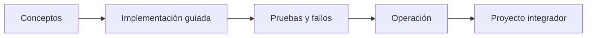

# Parte 03 — Azure: plataforma esencial

> [← Parte 02](../part-02-aws-core-platform/README.md) · [Índice completo](../README.md) · [Parte 04 →](../part-04-gcp-core-platform/README.md)

**Nivel:** intermedio · **Clases:** 12 · **Duración sugerida:** 6–8 semanas

Diseñar y operar una carga empresarial en Azure desde su jerarquía de gobierno.

## Resultados de la parte

Al completar esta parte podrás explicar el dominio con lenguaje independiente del proveedor,
implementar sus mecanismos esenciales, diagnosticar fallos y defender decisiones mediante
evidencia, costo, seguridad y objetivos de confiabilidad.

## Modelo mental

En Azure, identidad y jerarquía organizacional preceden al recurso: tenant, management group, suscripción y resource group determinan el alcance de control.

## Secuencia

## Clases

| ID | Clase | Laboratorio | Horas |
|---:|---|---|---:|
| 037 | [Tenant, management groups, suscripciones y resource groups](037-tenant-management-groups-suscripciones-y-resource-groups/README.md) | `governance` | 4 |
| 038 | [Microsoft Entra ID, RBAC, managed identities y PIM](038-microsoft-entra-id-rbac-managed-identities-y-pim/README.md) | `iam` | 4 |
| 039 | [Virtual Network, subredes, NSG, UDR, peering y Private Link](039-virtual-network-subredes-nsg-udr-peering-y-private-link/README.md) | `network` | 4 |
| 040 | [Virtual Machines, Scale Sets y Load Balancer](040-virtual-machines-scale-sets-y-load-balancer/README.md) | `compute` | 4 |
| 041 | [Blob Storage, Files, redundancia y lifecycle](041-blob-storage-files-redundancia-y-lifecycle/README.md) | `storage` | 4 |
| 042 | [Azure SQL, Cosmos DB y Azure Cache for Redis](042-azure-sql-cosmos-db-y-azure-cache-for-redis/README.md) | `data` | 4 |
| 043 | [App Service, Functions y Container Apps](043-app-service-functions-y-container-apps/README.md) | `serverless` | 4 |
| 044 | [Service Bus, Event Grid y Event Hubs](044-service-bus-event-grid-y-event-hubs/README.md) | `messaging` | 4 |
| 045 | [Azure Monitor, Log Analytics y Application Insights](045-azure-monitor-log-analytics-y-application-insights/README.md) | `observability` | 4 |
| 046 | [Key Vault, Defender for Cloud y Azure Policy](046-key-vault-defender-for-cloud-y-azure-policy/README.md) | `security` | 4 |
| 047 | [Bicep, plantillas y despliegues por alcance](047-bicep-plantillas-y-despliegues-por-alcance/README.md) | `iac` | 4 |
| 048 | [Proyecto: aplicación de tres capas en Azure](048-proyecto-aplicacion-de-tres-capas-en-azure/README.md) | `capstone` | 8 |

## Evaluación de la parte

- 35 % laboratorios y evidencia reproducible.
- 25 % retos verificables.
- 20 % decisiones y ADR.
- 10 % seguridad, confiabilidad y costo.
- 10 % proyecto integrador de la parte.

Se aprueba con 80 % de clases en nivel B o superior y el proyecto integrador reproducible.

## Pauta bibliográfica

- Azure Architecture Center — Microsoft.
- Azure for Architects — Ritesh Modi.
- Exam Ref AZ-305 — Microsoft Press.
