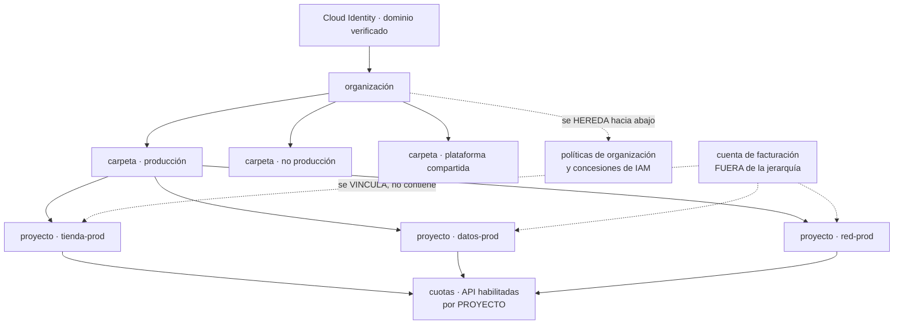

# 049 — Organización, folders, proyectos, billing y cuotas

> [← 048 · Proyecto: aplicación de tres capas en Azure](../../part-03-azure-core-platform/048-proyecto-aplicacion-de-tres-capas-en-azure/README.md) · [Índice de la parte](../README.md) · [050 · IAM, service accounts y Workload Identity Federation →](../../part-04-gcp-core-platform/050-iam-service-accounts-y-workload-identity-federation/README.md)

**Parte:** 04 — Google Cloud: plataforma esencial<br>
**Nivel:** intermedio · **Horas estimadas:** 4<br>
**Laboratorio:** `governance` · **Estado:** `EXECUTABLE_CORE`

## 🎯 Propósito

Montar la estructura de una organización en Google Cloud sabiendo que aquí el proyecto no equivale a la suscripción de Azure ni a la cuenta de AWS: es **barato, desechable y la unidad de casi todo** —API, cuotas, IAM, nombres—, y esa diferencia cambia el diseño en vez de solo cambiar los nombres. Es la clase donde se comprueba la primera parte de la hipótesis de la clase 048: qué contratos de las partes 02 y 03 reaparecen intactos y dónde aparece la primera asimetría propia.

## 📚 Resultados de aprendizaje

Al finalizar podrás:

1. **Diseñar** una jerarquía de carpetas y proyectos sabiendo qué se hereda y qué se decide en cada nivel.
2. **Usar** el identificador correcto de un proyecto y explicar por qué el nombre no sirve para automatizar.
3. **Dimensionar** cuotas por proyecto y por región, y planificar los aumentos con antelación en vez de descubrirlos.
4. **Separar** el eje de facturación del eje jerárquico, y activar la exportación de costos antes de necesitarla.
5. **Aplicar** políticas de organización distinguiéndolas de IAM, con su prueba negativa.

## 🧩 Conceptos centrales

| Concepto | Comprensión verificable |
|---|---|
| `organización` | Nodo raíz, vinculado a un dominio verificado en Cloud Identity o Workspace. Como el inquilino de Azure, **la identidad precede a la jerarquía**: sin dominio no hay organización. |
| `proyecto` | Unidad de API habilitadas, cuotas, IAM, red y nombres. Es barato y se crea en segundos, así que el idioma de Google Cloud es **tener muchos**, no pocos y grandes. |
| `identificador de proyecto` | Cadena **global, única e inmutable** que usan todas las API. Distinta del nombre, que se puede cambiar, y del número, que también es inmutable. Automatizar con el nombre es el error clásico. |
| `cuenta de facturación` | Objeto **fuera de la jerarquía**: se vincula a proyectos, no los contiene. Desvincularla no borra nada y **detiene los recursos** del proyecto. |
| `cuota` | Límite por proyecto y a menudo por región, de dos tipos: de tasa —por minuto— y de asignación —recursos existentes—. Ampliarlas es una solicitud con plazo, no un ajuste. |
| `política de organización` | Restricción sobre configuraciones permitidas, heredada por la jerarquía. **No es IAM**: acota lo que se puede configurar, con independencia de quién tenga permiso. |
| `proyecto huérfano` | Proyecto creado fuera de la organización. No hereda ninguna política, no aparece en la exportación de costos y nadie lo gobierna. |

## 🧠 Modelo mental

Un proyecto de Google Cloud es la unidad práctica de API, cuota, IAM y facturación; la organización aporta la política heredable.

Aplicado a esta clase, separa siempre cuatro planos: **intención** (qué necesita el usuario),
**configuración** (qué declaramos), **estado observado** (qué existe de verdad) y
**evidencia** (cómo sabemos que cumple). Confundirlos produce diseños que se ven correctos
en un diagrama pero fallan al operar.

## 🗺️ Flujo de razonamiento



## 📖 Desarrollo

### 1. El proyecto es barato, y eso cambia el diseño

La primera traducción que hace todo el mundo al llegar de AWS o de Azure es esta:

```text
cuenta de AWS  ≈  suscripción de Azure  ≈  proyecto de Google Cloud
```

Es correcta en lo que concentra —aislamiento, cuotas, facturación, IAM— y **falla en lo que cuesta**. Abrir una cuenta de AWS implica un proceso organizativo; crear una suscripción de Azure, un acuerdo comercial. Crear un proyecto es una llamada de API que tarda segundos:

```bash
$ gcloud projects create cloudshop-tienda-prod-01 \
    --folder $CARPETA_PROD --labels entorno=prod,sistema=tienda
$ gcloud beta billing projects link cloudshop-tienda-prod-01 \
    --billing-account $CUENTA_FACTURACION
```

Esa diferencia de costo administrativo produce un idioma distinto. En AWS y en Azure la presión es a **agrupar** para no multiplicar cuentas o suscripciones; en Google Cloud la presión es la contraria, y por tres razones concretas:

```text
1. las cuotas son POR PROYECTO
   más proyectos = más margen, sin pedir nada a nadie
2. las API habilitadas son POR PROYECTO
   un proyecto solo tiene encendido lo que usa: menos superficie
3. borrar un proyecto borra todo lo que contiene
   la limpieza de un entorno efímero es una operación, no un inventario
```

La tercera es la que más rinde en la práctica. Un entorno de pruebas completo se destruye con una llamada, y el borrado es **reversible durante 30 días** antes de hacerse definitivo, lo que da un margen que ni el grupo de recursos de Azure ni la cuenta de AWS ofrecen de la misma forma.

Y hay un detalle que rompe automatizaciones el primer día: **un proyecto tiene tres identificadores y solo uno sirve**.

```text
nombre        "CloudShop tienda producción"   legible, MUTABLE
identificador  cloudshop-tienda-prod-01       lo usan las API, INMUTABLE
                                              y ÚNICO EN GOOGLE CLOUD ENTERO
número         418293047512                   inmutable, lo usan algunos servicios
```

Dos consecuencias. La primera: cualquier automatización debe usar el identificador; usar el nombre funciona hasta que alguien lo edita. La segunda sorprende más: **el identificador es único globalmente**, entre todos los clientes de Google Cloud. `cloudshop-prod` puede estar cogido por una empresa que no conoces, y además **un identificador no se libera nunca**, ni siquiera al borrar el proyecto. La convención de nombres tiene que asumirlo desde el principio:

```text
cls-  tienda   -prod- euw1 -01
│     │         │      │     └── secuencia
│     │         │      └──────── región principal
│     │         └─────────────── entorno
│     └───────────────────────── sistema
└─────────────────────────────── prefijo corto de la organización
```

El prefijo no es estética: es lo que hace improbable la colisión global. Y el límite de 30 caracteres del identificador obliga a abreviar, así que conviene fijarlo antes de crear el primero y no a mitad del segundo entorno.

### 2. Carpetas, herencia y el proyecto que nadie gobierna

La jerarquía tiene cuatro niveles y hereda hacia abajo, igual que en las dos plataformas anteriores:

```text
organización        vinculada a un dominio verificado
  carpeta           anidable hasta 10 niveles
    carpeta
      proyecto      la unidad real
        recurso
```

Lo que se hereda es **IAM y políticas de organización**, y es acumulativo: un permiso concedido en la carpeta vale para todos los proyectos que contiene. Es el mismo comportamiento aditivo de Azure RBAC de la clase 038, y aquí Google Cloud ofrece **dos** mecanismos que restan en vez de uno: las **políticas de denegación de IAM** —que la clase 050 desarrolla— y las **políticas de organización**, que ocupan el mismo lugar que Azure Policy allí. Con tres plataformas ya se puede enunciar el patrón: **el permiso suma, y lo que resta vive en otro sistema, con otro error y otras reglas de herencia**. Lo que cambia entre proveedores es cuántos sistemas hay para restar, no que hagan falta.

El criterio para diseñar las carpetas es el mismo que la clase 037 estableció y conviene repetirlo porque la tentación es la misma: se ordena por **lo que necesita una política distinta**, no por el organigrama. Una estructura que sirve:

```text
organización
  produccion/         políticas estrictas, acceso restringido
    tienda/  datos/  red/
  no-produccion/      políticas relajadas, presupuestos bajos
    desarrollo/  pruebas/
  plataforma/         red compartida, registro central, artefactos
  aislados/           terceros, pruebas de concepto, sin datos reales
```

Las carpetas se reorganizan sin recrear proyectos —mover un proyecto de carpeta es una operación— así que equivocarse aquí es barato. Lo que no es barato es no tener organización en absoluto.

Y ese es el problema propio de Google Cloud que no existe en las otras dos: **un proyecto puede crearse fuera de cualquier organización**. Cualquiera con una cuenta de Google puede crear uno, vincularlo a una tarjeta y desplegar. Ese proyecto:

```text
no hereda ninguna política de organización
no aparece en la exportación de facturación de la empresa
no lo ve ningún panel de seguridad corporativo
si la persona se va, puede quedar sin propietario accesible
```

Es el equivalente al «TI en la sombra» con infraestructura real dentro, y suele descubrirse por una factura o por un incidente. Las dos medidas que lo cierran:

```bash
# 1. solo un grupo concreto puede crear proyectos en la organización
$ gcloud organizations add-iam-policy-binding $ORG_ID \
    --member "group:plataforma@cloudshop.example" \
    --role roles/resourcemanager.projectCreator

# 2. solo identidades del dominio propio pueden recibir permisos
$ gcloud resource-manager org-policies allow \
    constraints/iam.allowedPolicyMemberDomains $ID_CLIENTE_DOMINIO \
    --organization $ORG_ID
```

La segunda es una de las políticas de mayor rendimiento de toda la plataforma: impide conceder acceso a una cuenta personal de Gmail o al dominio de otra empresa. Sin ella, un `roles/editor` concedido a una dirección externa es una puerta permanente que ningún inventario de usuarios de la empresa muestra.

Y la parte que no cubre ninguna política: los proyectos que **ya existen** fuera de la organización. Se localizan por la facturación —una cuenta de facturación corporativa vinculada a un proyecto sin organización— y se migran, que es una operación posible y con requisitos. Es el mismo patrón de la clase 046: la política guarda la puerta y no limpia lo que ya está dentro.

### 3. API y cuotas: dos límites que se descubren tarde

**Ningún servicio existe en un proyecto hasta que se habilita su API.** No hay equivalente a esto en AWS ni en Azure, y produce dos efectos, uno bueno y uno molesto.

```bash
$ gcloud services enable run.googleapis.com sqladmin.googleapis.com \
    secretmanager.googleapis.com --project cls-tienda-prod-euw1-01
$ gcloud services list --enabled --project cls-tienda-prod-euw1-01 | wc -l
14
```

El efecto bueno es que la superficie de un proyecto es **explícita y auditable**: catorce API habilitadas es una afirmación verificable sobre lo que ese proyecto puede hacer. El molesto es que un despliegue falla con `SERVICE_DISABLED` la primera vez, y que habilitar una API tiene una **propagación de hasta unos minutos** — así que habilitarla y usarla en la misma ejecución de una plantilla puede fallar de forma intermitente. La solución es habilitar las API en un paso previo, no en el mismo despliegue que las usa.

Las **cuotas** son la segunda sorpresa, y esta cuesta calendario. Hay dos tipos y se confunden:

```text
de tasa        peticiones por minuto a una API
               se reinician solas; el síntoma es 429 RESOURCE_EXHAUSTED
de asignación  cantidad de recursos que pueden existir a la vez
               CPU por región, direcciones IP, instancias, reglas de firewall
               el síntoma es un despliegue que no puede crear más
```

Y el detalle que decide el diseño: **casi todas son por proyecto, y muchas además por región**. Eso convierte la granularidad de proyectos en una decisión de capacidad, no solo de orden:

```text
un proyecto grande con todo
  → una sola bolsa de CPU por región para todos los servicios
  → una prueba de carga de un equipo agota el margen de otro

varios proyectos por servicio
  → bolsas independientes
  → el ruido de un equipo no llega al de al lado
```

Lo que hay que anticipar es el plazo. Un aumento de cuota es una **solicitud** que se revisa, y puede tardar de horas a días:

```bash
$ gcloud compute regions describe europe-west1 \
    --format="table(quotas.metric,quotas.limit,quotas.usage)" | grep CPUS
CPUS            72.0    58.0
```

Cincuenta y ocho de setenta y dos usadas antes de una campaña que triplica el tráfico: eso no es un problema técnico, es un problema de planificación, y solo se ve mirándolo. La regla que lo evita es sencilla y casi nunca está: **revisar la cuota frente al pico previsto forma parte de la preparación de cualquier evento de carga**, junto con la prueba de carga misma.

Y una alerta que rinde más que muchas otras: la cuota consumida por encima del 80 %, que en Cloud Monitoring existe como métrica y avisa antes de que el despliegue falle en vez de después.

### 4. La facturación es otro eje, y la exportación no es retroactiva

Aquí está la asimetría estructural de esta clase, la que no tiene equivalente en las dos plataformas anteriores.

```text
AWS     la cuenta pagadora está DENTRO de la organización
Azure   la suscripción ES la frontera de facturación
Google  la cuenta de facturación está FUERA de la jerarquía
        y se VINCULA a los proyectos
```

Un proyecto puede moverse de carpeta sin cambiar de cuenta de facturación, y varias organizaciones pueden compartir una. La consecuencia práctica es que **la estructura de costos y la estructura de gobierno son dos diseños distintos** y hay que hacer los dos.

Y hay una operación con un efecto que sorprende: **desvincular la facturación de un proyecto no lo borra, pero detiene sus recursos**. Las máquinas se apagan, los servicios gestionados dejan de responder. Es a la vez un mecanismo de contención de emergencia y una forma muy eficaz de tumbar producción sin darse cuenta de lo que se estaba haciendo. Merece un bloqueo organizativo y figurar en la lista de operaciones peligrosas del equipo.

**La exportación de facturación a BigQuery es el mecanismo real de atribución**, y tiene una propiedad que hay que conocer antes y no después:

```bash
$ gcloud beta billing accounts describe $CUENTA_FACTURACION
# la exportación se configura en la consola de facturación → Exportación de BigQuery
```

```text
la exportación NO es retroactiva
lo que no se exportó mientras ocurría, no se puede recuperar después
```

Activarla el primer día cuesta cinco minutos y una tabla de BigQuery; activarla el tercer mes deja dos meses sin detalle, con solo los informes agregados de la consola. Es exactamente el mismo error de la clase 045 con los registros de recurso apagados: **una señal que no se recoge mientras ocurre no existe**.

Lo mismo vale para las **etiquetas**. La exportación atribuye costo por etiqueta, y solo desde el momento en que la etiqueta estaba puesta:

```sql
SELECT
  (SELECT value FROM UNNEST(labels) WHERE key = 'sistema') AS sistema,
  (SELECT value FROM UNNEST(labels) WHERE key = 'entorno') AS entorno,
  ROUND(SUM(cost), 2) AS costo
FROM `cls-facturacion.billing.gcp_billing_export_v1_XXXXXX`
WHERE DATE(usage_start_time) BETWEEN '2026-07-01' AND '2026-07-31'
GROUP BY sistema, entorno
ORDER BY costo DESC
```

Un recurso sin etiqueta aparece con `sistema` nulo, y esa fila —«coste no atribuible»— es la métrica de gobierno que importa: mientras no sea cero, hay gasto del que nadie responde. Es el mismo indicador que la clase 025 definió para AWS, con otra consulta.

Y sobre los **presupuestos**, una precisión que evita una expectativa falsa:

```text
un presupuesto NOTIFICA; no limita el gasto
```

Exactamente igual que en AWS. Limitar de verdad exige automatizar una reacción —notificación a Pub/Sub y una función que actúe— y la única acción realmente contundente es desvincular la facturación, que apaga el proyecto entero. Es una opción legítima para un entorno de pruebas y no lo es para producción, así que el control efectivo en producción sigue siendo el de siempre: **alertar pronto, atribuir bien y revisar**.

### 5. Políticas de organización: el gobierno que no es IAM

Es la tercera vez que aparece el mismo patrón, así que ya se puede enunciar como regla general del programa:

```text
AWS     política de control de servicios (SCP)
Azure   Azure Policy
Google  política de organización

las tres:  acotan CONFIGURACIONES, no identidades
           se heredan por la jerarquía
           producen un error DISTINTO al de falta de permiso
           y no arreglan lo que ya existe
```

Hay dos formas de restricción:

```text
booleana   se aplica o no
           constraints/storage.publicAccessPrevention
           constraints/compute.requireOsLogin
           constraints/iam.disableServiceAccountKeyCreation
de lista   permite o deniega valores concretos
           constraints/compute.vmExternalIpAccess
           constraints/gcp.resourceLocations
           constraints/iam.allowedPolicyMemberDomains
```

La que más rinde y conviene poner el primer día es `iam.disableServiceAccountKeyCreation`. Las claves de cuenta de servicio son ficheros JSON con credenciales de larga duración, y son **la fuga de credenciales más habitual de Google Cloud**: acaban en repositorios, en portátiles y en imágenes de contenedor. La clase 050 desarrolla la alternativa; la política que impide crearlas es lo que hace que la alternativa se use de verdad.

```bash
$ gcloud resource-manager org-policies enable-enforce \
    constraints/iam.disableServiceAccountKeyCreation --organization $ORG_ID
$ gcloud resource-manager org-policies enable-enforce \
    constraints/storage.publicAccessPrevention --organization $ORG_ID
```

Y dos comportamientos que conviene tener claros antes de asignarlas:

**La herencia se puede romper deliberadamente.** Una política definida en un proyecto puede sustituir a la de la carpeta si la restricción lo permite. Eso hace posible la excepción legítima —un proyecto que sí necesita un contenedor público para recursos estáticos— y también hace posible la excepción silenciosa. La comprobación es la misma que en la clase 046: **buscar dónde se ha roto la herencia y exigir que cada caso tenga motivo escrito**.

```bash
$ gcloud asset search-all-resources --scope organizations/$ORG_ID \
    --asset-types cloudresourcemanager.googleapis.com/Project \
    --format "value(name)" | while read p; do
    gcloud resource-manager org-policies describe \
      constraints/storage.publicAccessPrevention --project "$p" 2>/dev/null \
      | grep -q "enforce: false" && echo "excepción en $p"
  done
```

**No limpia lo existente.** Activar `publicAccessPrevention` impide abrir nuevos buckets al público y no cierra los que ya lo están. Es literalmente la lección de la clase 046 en otro proveedor, lo que confirma la parte de la hipótesis que decía que los contratos se conservan: la secuencia correcta vuelve a ser **inventariar, corregir y después imponer**.

Y la prueba negativa, que es la única evidencia aceptable:

```bash
$ gsutil iam ch allUsers:objectViewer gs://cls-tienda-publico
AccessDeniedException: 412 Request violates constraint
  constraints/storage.publicAccessPrevention                                ✓
```

El código de error importa por lo mismo que en las clases 038 y 046: **no dice que falte un permiso**. Añadir roles no habría cambiado nada, y saber leerlo es lo que evita una hora buscando en el sistema equivocado.

## 🔬 Ejemplo trabajado

**CloudShop abre su tercera plataforma. El equipo llega con el contrato de once filas de la clase 048 y lo aplica en dos días — y luego encuentra tres cosas que ese contrato no cubría, todas propias de Google Cloud.**

**Lo que se reutilizó sin discusión** (y confirma la primera parte de la hipótesis):

```text
la identidad precede a la jerarquía        organización desde dominio verificado
la jerarquía hereda y el permiso suma      carpetas y proyectos
el gobierno acota configuraciones          políticas de organización
la frontera de aislamiento es la de cuotas proyecto
etiquetas obligatorias para atribuir costo labels
inventariar → corregir → imponer           misma secuencia
```

Seis de las once filas quedaron resueltas en el primer día, sin aprender nada nuevo salvo el nombre.

**Sorpresa 1 — la traducción «suscripción → proyecto» sale cara en una prueba de carga.**

Siguiendo el modelo de Azure, se crean tres proyectos: `cls-dev`, `cls-stage`, `cls-prod`, con todo dentro. La primera prueba de carga previa a campaña falla al escalar:

```bash
$ gcloud compute instances create ... --zone europe-west1-b
ERROR: Quota 'CPUS' exceeded. Limit: 72.0 in region europe-west1.
$ gcloud compute regions describe europe-west1 \
    --format="value(quotas.filter(metric:CPUS).usage)"
71.0
```

Las cuotas son por proyecto, y en `cls-prod` convivían la tienda, el procesamiento por lotes y el entorno de análisis. La solicitud de aumento tardó **tres días**, con la campaña a cinco.

Se rehace la estructura con el idioma correcto de la plataforma:

```text                                    antes         después
proyectos                                   3              19
bolsas de CPU independientes por región     1               7
API habilitadas en el proyecto de tienda   61              14
aumento de cuota necesario                  sí             no
borrado de un entorno de pruebas       inventario a mano  gcloud projects delete
```

La fila de las API es un efecto secundario que nadie buscaba: al separar, cada proyecto solo habilita lo que usa, y sesenta y una API encendidas «por si acaso» pasaron a catorce declaradas.

**Sorpresa 2 — dos meses de gasto sin poder atribuirlo.**

A los dos meses, finanzas pide el costo por sistema. La consola da totales por proyecto y por servicio, y no por etiqueta.

```text
exportación de facturación a BigQuery   activada el día 61
datos disponibles                       desde el día 61
datos de los días 1 al 60               solo agregados, sin detalle
```

La exportación no es retroactiva. Y las etiquetas se habían añadido en la semana 4, así que incluso desde el día 61 una parte del gasto —recursos creados antes y nunca modificados— seguía sin `sistema`:

```sql
SELECT COUNT(*) AS lineas, ROUND(SUM(cost),2) AS costo
FROM `cls-facturacion.billing.gcp_billing_export_v1_XXXXXX`
WHERE (SELECT value FROM UNNEST(labels) WHERE key='sistema') IS NULL
```

```text                                antes           después
costo no atribuible                 2.140 USD/mes       0
etiquetas obligatorias           por convención   por política y en plantilla
exportación de facturación        día 61          día 1 en la organización nueva
```

La medida de fondo no fue etiquetar: fue **hacer de «costo no atribuible = 0» un indicador con dueño**, revisado cada semana. Una convención se erosiona; un número que alguien tiene que explicar, no.

**Sorpresa 3 — cuatro proyectos que nadie sabía que existían.**

Una revisión de la cuenta de facturación encuentra gasto en proyectos que no están en la organización:

```bash
$ gcloud beta billing projects list --billing-account $CUENTA \
    --format="value(projectId)" > facturados.txt
$ gcloud asset search-all-resources --scope organizations/$ORG_ID \
    --asset-types cloudresourcemanager.googleapis.com/Project \
    --format="value(displayName)" > en_organizacion.txt
$ comm -23 <(sort facturados.txt) <(sort en_organizacion.txt)
cloudshop-poc-ml
cloudshop-demo-cliente
prueba-integracion-2025
sandbox-jm
```

Cuatro proyectos creados con cuentas personales, vinculados a la facturación de la empresa. Sin políticas heredadas, sin registro central, sin aparecer en ningún panel de seguridad. Uno de ellos, `cloudshop-demo-cliente`, tenía un bucket público con datos de prueba que resultaron ser un volcado real anonimizado a medias.

```text                                          antes        después
proyectos fuera de la organización                4             0
quién puede crear proyectos                  cualquiera   grupo plataforma
dominios permitidos en IAM                   cualquiera   solo el propio
buckets públicos                                  1            0
comprobación de proyectos no gobernados        ninguna    semanal, automática
```

Y la prueba negativa que cierra el caso:

```bash
$ gsutil iam ch allUsers:objectViewer gs://cls-prueba
AccessDeniedException: 412 Request violates constraint
  constraints/storage.publicAccessPrevention                                ✓
$ gcloud projects add-iam-policy-binding cls-tienda-prod-euw1-01 \
    --member "user:externo@gmail.com" --role roles/viewer
ERROR: Request violates constraint constraints/iam.allowedPolicyMemberDomains ✓
```

**Resumen de la puesta en marcha:**

```text                                          antes         después
proyectos                                        3              19
proyectos fuera de la organización               4               0
API habilitadas en el proyecto principal        61              14
aumentos de cuota necesarios                     1               0
costo no atribuible                        2.140 USD/mes        0
exportación de facturación                    día 61          día 1
políticas de organización aplicadas              0               6
controles con prueba negativa                    0               6
```

**La lección que esta clase traslada al resto de la parte 04**: seis de los once contratos de la clase 048 se reutilizaron el primer día, y las tres sorpresas fueron todas de la misma familia — **cosas que en las otras plataformas eran caras y aquí son gratis, y que por eso se usan de otra manera**. El proyecto barato cambia la granularidad, la creación libre de proyectos abre un agujero de gobierno que no existía, y la facturación fuera de la jerarquía obliga a diseñar dos estructuras en vez de una. Ninguna de las tres es una carencia de la plataforma: son consecuencias de una decisión de diseño distinta, y confundirlas con carencias es lo que produce una arquitectura que pelea contra su proveedor.

## 🧪 Laboratorio guiado

Ejecuta desde la raíz:

```bash
python classes/part-04-gcp-core-platform/049-organizacion-folders-proyectos-billing-y-cuotas/lab.py
```

El laboratorio selecciona el motor de práctica **`governance`** y produce
`lab_result.json`. El escenario, sus comprobaciones y el artefacto esperado corresponden a
esta clase; no requiere credenciales y deja explícito qué debe revalidarse en un sandbox real.

1. Lee `exercise.steps` y formula una predicción antes de ejecutar.
2. Ejecuta la práctica y verifica todos los elementos de `checks`.
3. Provoca el caso de `negative_test` y explica la señal observada.
4. Materializa `jerarquia-gcp` en `evidence/` usando la plantilla indicada.
5. Para proveedor real, sigue `sandbox.requires`, registra costo y ejecuta `destroy`.

### Evidencia esperada

El artefacto principal es una jerarquía de política, ownership y evidencia. Además, la entrega debe incluir el comando ejecutado,
la salida estructurada y una conclusión que no exceda lo observado.

## 🏆 Reto verificable

Construye **`jerarquia-gcp`** para el caso CloudShop. Incluye una alternativa descartada,
un supuesto que pueda falsarse, una prueba de fallo y una decisión de rollback.

## ✅ Criterio de aceptación

- [ ] `lab.py` termina con código 0 y genera JSON válido.
- [ ] La entrega conecta al menos tres requisitos con mecanismos verificables.
- [ ] Existe una prueba positiva y una prueba negativa con evidencia.
- [ ] Seguridad, costo y operación aparecen como decisiones, no como anexos.
- [ ] Se declara una limitación y una condición que obligaría a revisar el diseño.
- [ ] Otra persona puede repetir el recorrido sin conocimiento tácito.

## ⚠️ Errores frecuentes

| Síntoma | Causa probable | Corrección |
|---|---|---|
| Una prueba de carga falla por cuota con margen aparente en la organización | Las cuotas son por proyecto y por región, y varios servicios compartían proyecto | Reparte en más proyectos —son baratos— y revisa la cuota frente al pico previsto antes de cualquier evento de carga. |
| La automatización deja de funcionar tras renombrar un proyecto | Se usó el nombre en vez del identificador, que es el inmutable | Usa siempre el identificador de proyecto y fija una convención de nombres con prefijo, porque el identificador es único en todo Google Cloud. |
| No se puede atribuir el gasto de los primeros meses | La exportación de facturación a BigQuery no es retroactiva y las etiquetas se pusieron tarde | Actívala el primer día y convierte «costo no atribuible = 0» en un indicador con responsable. |
| Aparecen proyectos con gasto que no están en la organización | Cualquiera con una cuenta de Google puede crear proyectos fuera de ella | Restringe la creación a un grupo, aplica `iam.allowedPolicyMemberDomains` y compara periódicamente los proyectos facturados con los gobernados. |
| Un despliegue falla con `SERVICE_DISABLED` de forma intermitente | La API se habilita en la misma ejecución que la usa y la propagación tarda | Habilita las API en un paso previo e independiente del despliegue que las consume. |
| Se activa una política de organización y siguen existiendo recursos que la incumplen | Las políticas acotan configuraciones nuevas y no corrigen lo existente | Inventaria, corrige y después impón; y busca dónde se ha roto la herencia con una excepción no documentada. |

## 🛡️ Seguridad, ética y costo

Trabaja con cuentas propias o sandboxes autorizados. No publiques secretos, identificadores
reales ni datos personales. Antes de crear recursos pagos define presupuesto, etiquetas y
comando de destrucción; después verifica que no queden recursos huérfanos. Los ejemplos
locales enseñan contratos, pero no certifican cumplimiento ni disponibilidad de producción.

## ❓ Preguntas de comprobación

1. ¿En qué se parece un proyecto a una suscripción de Azure y en qué cambia el diseño el hecho de que sea barato?
2. ¿Cuál de los tres identificadores de un proyecto debe usar la automatización, y qué implica que sea único globalmente?
3. ¿Por qué la granularidad de proyectos es una decisión de capacidad y no solo de orden?
4. ¿Qué se pierde por activar la exportación de facturación en el mes tres en vez de en el día uno?
5. ¿Qué distingue una política de organización de una concesión de IAM, y cómo lo confirma el mensaje de error?

## 🔗 Referencias

- Google Cloud (2025). *Resource hierarchy* — organización, carpetas, proyectos y herencia. <https://cloud.google.com/resource-manager/docs/cloud-platform-resource-hierarchy>
- Google Cloud (2025). *Creating and managing projects* — identificador, nombre, número y borrado con retención. <https://cloud.google.com/resource-manager/docs/creating-managing-projects>
- Google Cloud (2025). *Working with quotas* — cuotas de tasa y de asignación, por proyecto y por región. <https://cloud.google.com/docs/quotas/overview>
- Google Cloud (2025). *Export Cloud Billing data to BigQuery* — configuración, esquema y ausencia de retroactividad. <https://cloud.google.com/billing/docs/how-to/export-data-bigquery>
- Google Cloud (2025). *Organization policy constraints* — restricciones booleanas y de lista, herencia y excepciones. <https://cloud.google.com/resource-manager/docs/organization-policy/org-policy-constraints>
- Documentación oficial vigente del servicio implementado; registra URL y fecha de consulta.

---

> [Evaluación](assessment.md) · [Contrato de clase](lesson.yaml) · [Índice de la parte](../README.md)

| Anterior | Índice | Siguiente |
|---|---|---|
| [← 048 · Proyecto: aplicación de tres capas en Azure](../../part-03-azure-core-platform/048-proyecto-aplicacion-de-tres-capas-en-azure/README.md) | [Parte 04](../README.md) · [Programa](../../README.md) | [050 · IAM, service accounts y Workload Identity Federation →](../../part-04-gcp-core-platform/050-iam-service-accounts-y-workload-identity-federation/README.md) |
