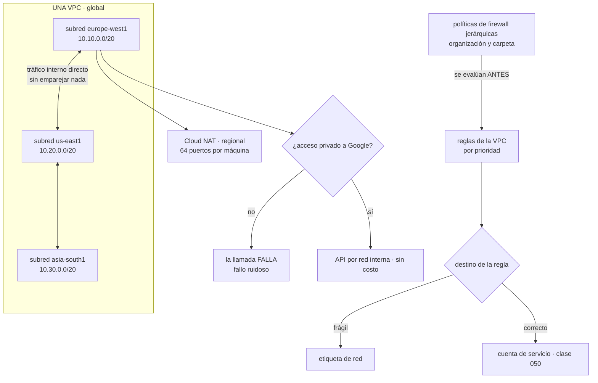

# 051 — VPC global, subredes regionales, firewall y Cloud NAT

> [← 050 · IAM, service accounts y Workload Identity Federation](../../part-04-gcp-core-platform/050-iam-service-accounts-y-workload-identity-federation/README.md) · [Índice de la parte](../README.md) · [052 · Compute Engine, managed instance groups y load balancing →](../../part-04-gcp-core-platform/052-compute-engine-managed-instance-groups-y-load-balancing/README.md)

**Parte:** 04 — Google Cloud: plataforma esencial<br>
**Nivel:** intermedio · **Horas estimadas:** 4<br>
**Laboratorio:** `network` · **Estado:** `EXECUTABLE_CORE`

## 🎯 Propósito

Diseñar la red de Google Cloud partiendo del hecho que reordena todo lo aprendido en las clases 027 y 039: **la VPC es global**. Una sola red cubre todas las regiones, las subredes son regionales y dos máquinas en continentes distintos se hablan por dirección interna sin ningún emparejamiento. Eso hace desaparecer el diseño de concentrador y radios para el caso interno, y desplaza el trabajo a otros sitios: quién puede usar qué subred, cómo se etiqueta el destino de una regla de firewall, y por qué una máquina sin dirección externa aquí sí está aislada de verdad.

## 📚 Resultados de aprendizaje

Al finalizar podrás:

1. **Explicar** qué implica que la VPC sea global y qué diseño de las partes anteriores deja de hacer falta.
2. **Elegir** entre VPC compartida, emparejamiento y red por proyecto según quién debe gobernar el firewall.
3. **Escribir** reglas de firewall dirigidas por cuenta de servicio en vez de por etiqueta, y justificar por qué.
4. **Habilitar** el acceso privado a las API de Google y distinguir su fallo del fallo silencioso de otras plataformas.
5. **Dimensionar** la asignación de puertos de Cloud NAT antes de que un servicio locuaz la agote.

## 🧩 Conceptos centrales

| Concepto | Comprensión verificable |
|---|---|
| `VPC global` | Red que abarca **todas las regiones**. Las subredes son regionales y el enrutamiento entre ellas es interno y automático: no hay emparejamiento ni pasarela entre regiones de la misma VPC. |
| `modo automático frente a personalizado` | La red por defecto crea una subred en cada región con rangos predefinidos que **coinciden con los de todo el mundo**. Eso impide emparejar más adelante. La única opción defendible es el modo personalizado. |
| `destino de regla de firewall` | A qué máquinas aplica una regla: a todas, a las que tengan una **etiqueta de red** o a las que ejecuten con una **cuenta de servicio**. La etiqueta la puede poner cualquiera que edite la máquina; la cuenta de servicio, no. |
| `VPC compartida` | Un proyecto anfitrión posee la red y otros proyectos despliegan dentro de ella. No es un emparejamiento: es **la misma red**, con IAM decidiendo quién puede usar cada subred. |
| `acceso privado a Google` | Ajuste **por subred** que permite a una máquina sin dirección externa alcanzar las API de Google por la red interna. Sin él, la llamada no funciona — y eso es una buena noticia. |
| `asignación de puertos de Cloud NAT` | Puertos de traducción reservados por máquina, 64 por defecto. Es el mismo agotamiento de las clases 039 y 043, con un tercer mecanismo y la misma señal. |

## 🧠 Modelo mental

Un proyecto de Google Cloud es la unidad práctica de API, cuota, IAM y facturación; la organización aporta la política heredable.

Aplicado a esta clase, separa siempre cuatro planos: **intención** (qué necesita el usuario),
**configuración** (qué declaramos), **estado observado** (qué existe de verdad) y
**evidencia** (cómo sabemos que cumple). Confundirlos produce diseños que se ven correctos
en un diagrama pero fallan al operar.

## 🗺️ Flujo de razonamiento



## 📖 Desarrollo

### 1. La VPC es global, y eso borra un diseño entero

En AWS una VPC vive en una región y sus subredes en zonas. En Azure, una red virtual vive en una región y conectar dos exige emparejarlas. En Google Cloud:

```text
la VPC es GLOBAL: abarca todas las regiones
la subred es REGIONAL: no zonal
```

Dos consecuencias inmediatas. La primera: **dos máquinas en regiones distintas de la misma VPC se hablan por dirección interna sin configurar nada**. No hay emparejamiento, no hay pasarela, no hay tabla de rutas que tocar. La segunda: una subred cubre todas las zonas de su región, así que la alta disponibilidad zonal no obliga a repartir direcciones entre subredes.

El efecto práctico sobre lo construido en la clase 039 es que **un diseño entero deja de hacer falta**:

```text
Azure    concentrador y radios, emparejamientos bidireccionales,
         allowForwardedTraffic, UDR por radio, tránsito facturado dos veces
Google   una VPC, subredes por región, y ya está
```

Eso no significa que no haya nada que diseñar: significa que el trabajo se desplaza. Lo que en Azure se resolvía con topología, aquí se resuelve con **IAM sobre la red**, y esa es la parte que sorprende a quien llega esperando dibujar cajas.

El segundo hecho estructural es la red por defecto. Todo proyecto nuevo recibe una VPC en **modo automático**: una subred en cada región, con rangos predefinidos dentro de `10.128.0.0/9`. Son los mismos rangos para todos los clientes de Google Cloud, así que:

```text
dos proyectos con red automática NO se pueden emparejar: sus rangos coinciden
tampoco se puede emparejar con la red de un socio que usara la automática
y descubrirlo es tarde: hay que recrear la red y mover todo lo que hay dentro
```

La medida se toma antes de crear el primer proyecto, y es una política de organización de la clase 049:

```bash
$ gcloud resource-manager org-policies enable-enforce \
    constraints/compute.skipDefaultNetworkCreation --organization $ORG_ID

$ gcloud compute networks create vpc-cloudshop --subnet-mode custom
$ gcloud compute networks subnets create snet-tienda-euw1 \
    --network vpc-cloudshop --region europe-west1 --range 10.10.0.0/20 \
    --enable-private-ip-google-access --enable-flow-logs
```

Y el reparto de direcciones se planifica con la misma disciplina de las clases 027 y 039, con dos particularidades: Google reserva **cuatro direcciones por subred** en lugar de cinco, y una subred **se puede ampliar en caliente** —cambiar su máscara a una mayor sin recrearla—, lo que no significa que se pueda improvisar, porque reducirla sigue sin ser posible.

```text
vpc-cloudshop (global)
  snet-tienda-euw1      10.10.0.0/20    europe-west1
  snet-datos-euw1       10.10.16.0/20   europe-west1
  snet-tienda-use1      10.20.0.0/20    us-east1
  rango secundario para contenedores    10.60.0.0/14   (parte 06)
```

La última línea conviene reservarla ya: los clústeres de Kubernetes en Google Cloud consumen **rangos secundarios de la subred** para pods y servicios, y son grandes. Descubrirlo en la parte 06 con el espacio ya repartido obliga a rehacer lo de arriba.

### 2. El firewall es de la red, y el destino correcto es una identidad

Las reglas de firewall en Google Cloud no cuelgan de la subred ni de la interfaz: **cuelgan de la VPC**, y se aplican a un conjunto de máquinas definido por el propio destino de la regla. Son con estado, tienen prioridad —número menor gana— y se evalúan hasta la primera coincidencia.

```text
reglas implícitas, que no se pueden borrar
  entrada  denegar todo         prioridad 65535
  salida   permitir todo        prioridad 65535
```

Comparado con las otras dos plataformas, esto ya es una diferencia notable: **la entrada está denegada por defecto entre máquinas de la misma red**, sin la regla `AllowVnetInBound` que en Azure dejaba hablar a todo con todo (clase 039). La red por defecto en modo automático sí trae una regla que permite el tráfico interno, y es otra razón para no usarla.

La decisión que de verdad importa es **a quién aplica la regla**, y hay tres formas:

| Destino | Cómo se asigna | Quién puede cambiarlo |
|---|---|---|
| Todas las instancias de la red | — | — |
| Etiqueta de red | Cadena en la máquina | **Cualquiera que pueda editar la máquina** |
| Cuenta de servicio | La identidad con la que ejecuta | Solo quien tenga `serviceAccountUser` sobre ella |

La fila del medio es la trampa. Una etiqueta de red es texto libre: quien tenga permiso para modificar una instancia puede añadirle `permitir-ssh` y quedar dentro del ámbito de la regla que abre el puerto 22. No hace falta tocar el firewall para abrir un puerto — basta con etiquetarse.

Dirigir por **cuenta de servicio** cierra ese camino y encadena con la clase 050: cambiar la identidad de una máquina exige permiso sobre esa cuenta de servicio, que es un permiso auditado y restringido.

```bash
$ gcloud compute firewall-rules create permitir-app-a-datos \
    --network vpc-cloudshop --direction INGRESS --priority 1000 --action ALLOW \
    --rules tcp:5432 \
    --source-service-accounts sa-tienda-web@cls-tienda-prod-euw1-01.iam.gserviceaccount.com \
    --target-service-accounts sa-datos@cls-datos-prod-euw1-01.iam.gserviceaccount.com
```

Esa regla dice exactamente lo que se quiere decir: **el servicio web puede hablar con la base de datos por el 5432**, sin mencionar direcciones ni depender de que nadie ponga la etiqueta correcta. Y sobrevive a que las máquinas cambien de dirección, de zona o de región.

Una limitación que hay que conocer: una regla **no puede mezclar** etiquetas y cuentas de servicio como origen y destino. La migración es por bloques, no gradual dentro de la misma regla.

Por encima de las reglas de la VPC están las **políticas de firewall jerárquicas**, definidas en la organización o en la carpeta y evaluadas **antes**:

```text
orden de evaluación
  1. política jerárquica de la organización
  2. política jerárquica de la carpeta
  3. reglas de la VPC
cada nivel puede permitir, denegar o ceder al siguiente con goto_next
```

Es el mismo patrón de gobierno de las clases 046 y 049 aplicado a la red: una regla que ningún equipo puede saltarse, como denegar el 22 y el 3389 desde internet en toda la organización. Y con la misma advertencia de siempre: **no cierra lo que ya está abierto por otra vía**, solo impide que las reglas de abajo lo permitan.

Y el registro de reglas de firewall, que conviene activar en las que importan aunque tenga costo, porque responde la pregunta que aparece en todo incidente de conectividad —qué regla decidió— sin tener que deducirla:

```bash
$ gcloud compute firewall-rules update permitir-app-a-datos --enable-logging
```

### 3. VPC compartida: la red la gobierna quien debe, no quien despliega

Con una VPC global y proyectos baratos (clase 049) aparece una pregunta que en las otras plataformas no se planteaba así: si cada equipo tiene sus propios proyectos, ¿cada uno tiene su propia red?

Las tres respuestas posibles y cuándo vale cada una:

| | Cómo funciona | Cuándo |
|---|---|---|
| Una red por proyecto | Cada proyecto con su VPC | Aislamiento fuerte, sin tráfico interno entre equipos |
| Emparejamiento de VPC | Redes distintas conectadas | Dos organizaciones, o un socio |
| **VPC compartida** | Un proyecto anfitrión posee la red; los demás despliegan **en ella** | El caso normal dentro de una organización |

La VPC compartida no es un emparejamiento: es **la misma red**, usada desde varios proyectos. El proyecto anfitrión posee las subredes, las reglas de firewall y las rutas; los proyectos de servicio crean máquinas, balanceadores y clústeres dentro de esas subredes. Y el reparto se hace con IAM:

```bash
$ gcloud compute shared-vpc enable cls-red-prod
$ gcloud compute shared-vpc associated-projects add cls-tienda-prod-euw1-01 \
    --host-project cls-red-prod

# el equipo de tienda solo puede usar SU subred, no todas
$ gcloud compute networks subnets add-iam-policy-binding snet-tienda-euw1 \
    --region europe-west1 --project cls-red-prod \
    --member "group:equipo-tienda@cloudshop.example" \
    --role roles/compute.networkUser
```

Esa última concesión es la pieza elegante del modelo: **el permiso de red se concede por subred**, así que un equipo puede desplegar en la suya y no en la de datos, sin que nadie tenga que dibujar una topología para conseguirlo. Lo que en Azure se resolvía separando redes y emparejándolas, aquí se resuelve con una concesión.

La contrapartida hay que aceptarla porque define el modelo operativo: **las reglas de firewall las gestiona el proyecto anfitrión**. Un equipo que necesita abrir un puerto no puede hacerlo solo. Eso es exactamente lo que se quiere en una organización con requisitos de seguridad, y es un cuello de botella si el equipo de red tarda días en atender una petición. La respuesta razonable no es repartir el permiso, sino automatizar la petición: las reglas se declaran en código en el repositorio del proyecto anfitrión y se aprueban por revisión, que es el flujo de la clase 059.

El **emparejamiento de VPC** queda entonces para lo que de verdad lo necesita —otra organización, un proveedor— y trae las restricciones conocidas:

```text
no es transitivo        A ↔ B ↔ C no da A ↔ C
rangos sin solapar      por eso importaba no usar la red automática
cuota de rutas          las rutas aprendidas cuentan contra un límite
firewall independiente  cada lado decide qué acepta
```

Y para el caso de muchas redes que sí necesitan hablarse entre sí, existe el centro de conectividad de red, que resuelve la transitividad con un concentrador gestionado — el mismo problema de la clase 039 con una pieza distinta. Conviene saber que existe y no llegar a él por costumbre: **con una VPC global bien diseñada, la mayoría de organizaciones no lo necesitan**.

### 4. Salir a internet y llegar a Google: dos caminos distintos

Aquí está la asimetría propia de esta plataforma, y va en la dirección contraria a la de Azure.

**Una máquina sin dirección IP externa no alcanza internet.** La ruta por defecto hacia la pasarela de internet existe en la tabla, y sin dirección externa y sin NAT el paquete no llega a ningún sitio. Comparado con lo aprendido en la clase 039:

```text
Azure    existía una traducción implícita: la "subred privada" salía igual
Google   no hay traducción implícita: sin dirección externa y sin NAT, no sale
```

Es decir: **el aislamiento es el estado por defecto**, y es la buena noticia de esta clase. Lo que hay que declarar aquí es lo contrario que allí — no cómo cerrar la salida, sino cómo abrirla cuando hace falta.

**Cloud NAT** es esa salida, y es regional y sin instancias que gestionar:

```bash
$ gcloud compute routers create rt-euw1 --network vpc-cloudshop --region europe-west1
$ gcloud compute routers nats create nat-euw1 --router rt-euw1 --region europe-west1 \
    --nat-all-subnet-ip-ranges --auto-allocate-nat-external-ips \
    --enable-dynamic-port-allocation --min-ports-per-vm 64 --max-ports-per-vm 2048 \
    --enable-logging --log-filter ERRORS_ONLY
```

Dos parámetros de esa orden merecen atención. El primero es el precio, que tiene la misma forma que en las otras dos plataformas y por tanto la misma lección:

```text
~0,044 USD/h por la pasarela  +  ~0,045 USD por GB procesado
```

El segundo es la **asignación de puertos**: por defecto, 64 por máquina. Un servicio que abre muchas conexiones cortas al mismo destino los agota, y el síntoma es el mismo de las clases 039 y 043 —tiempos de espera intermitentes hacia un destino concreto mientras el resto funciona—. Es la tercera vez que aparece este problema en el programa, con un tercer mecanismo:

```text
AWS     puertos del NAT gateway, gestionados por el servicio
Azure   64.000 repartidos entre instancias, o NAT Gateway bajo demanda
Google  64 por máquina por defecto, ampliables y con asignación dinámica
```

La asignación dinámica es la respuesta correcta: reparte entre un mínimo y un máximo según la necesidad, en vez de reservar por adelantado. Y el registro con `ERRORS_ONLY` da la señal exacta —`OUT_OF_RESOURCES`— en vez de dejar deducirlo desde la aplicación.

**Llegar a las API de Google es otro camino y no pasa por el NAT.** Cloud Storage, BigQuery, Secret Manager y el resto viven en direcciones públicas, así que una máquina sin dirección externa no las alcanza — salvo que la subred tenga habilitado el **acceso privado a Google**:

```bash
$ gcloud compute networks subnets update snet-datos-euw1 --region europe-west1 \
    --enable-private-ip-google-access
```

Es un ajuste de subred, gratuito, y **evita pagar el NAT por ese tráfico**, que suele ser la mayor parte. La aritmética es la misma de la clase 027 y vuelve a salir a cuenta:

```text
2,4 TB/mes hacia Cloud Storage por Cloud NAT   2.400 × 0,045 = 108 USD/mes
los mismos 2,4 TB con acceso privado a Google                    0 USD/mes
```

Y lo más valioso para quien viene de la clase 039: **cuando falta, falla**. Sin acceso privado a Google, la llamada agota su tiempo de espera y aparece en el registro. No hay un camino público alternativo por el que funcione mientras el diagrama afirma que es privado. Comparar los dos fallos es la lección portable:

```text
Azure sin zona DNS privada    funciona por el camino público → fallo SILENCIOSO
Google sin acceso privado     no funciona                    → fallo RUIDOSO
```

Un fallo ruidoso se arregla en diez minutos. Uno silencioso dura cuatro meses.

Para el resto de casos —una API concreta con una dirección interna elegida, o un servicio de un tercero— está **Private Service Connect**, que crea un extremo con IP interna propia y su entrada de DNS. Es el análogo del punto de conexión privado de Azure y del endpoint de interfaz de AWS, y trae de vuelta la parte de DNS: si el nombre no resuelve al extremo, el tráfico busca el camino de siempre. La comprobación es la misma que se hizo en la clase 039, y hay que hacerla igual.

### 5. Diagnóstico y evidencia de una red que no se ve

Con la topología reducida a una VPC, el diagnóstico se apoya menos en el diagrama y más en tres herramientas que conviene conocer antes del incidente.

**Pruebas de conectividad**, que simulan un paquete sin enviarlo y dicen qué lo permitiría o lo bloquearía:

```bash
$ gcloud network-management connectivity-tests create prueba-app-datos \
    --source-instance web-01 --destination-instance db-01 \
    --destination-port 5432 --protocol TCP
$ gcloud network-management connectivity-tests describe prueba-app-datos \
    --format="value(reachabilityDetails.result)"
REACHABLE
```

Es la respuesta a «¿está abierto?» sin tener que abrir una sesión en ninguna máquina, y funciona igual antes de desplegar que durante una caída. Que además se puedan guardar y reejecutar la convierte en el equivalente de red del guion de pruebas negativas de la clase 046:

```text
desde la subred de tienda a la base de datos por 5432   REACHABLE     ✓
desde la subred de tienda a la base de datos por 22     UNREACHABLE   ✓
desde internet a cualquier máquina por 22               UNREACHABLE   ✓
```

**Registros de flujo de VPC**, activados por subred, con muestreo configurable. Responden a quién habló con quién y cuánto, que es la pregunta de la investigación posterior. Su costo depende del muestreo, así que la decisión es la misma de la clase 045: se activan al 100 % donde hay datos sensibles y con muestreo bajo donde el volumen es alto.

**Espejo de paquetes**, para cuando hace falta el contenido y no el resumen. Es caro y es la única forma de responder ciertas preguntas; conviene tenerlo previsto y apagado.

Y el orden de diagnóstico, que con tres plataformas ya se puede escribir como método y no como receta de proveedor:

```text
1. ¿existe camino?        prueba de conectividad · ruta y firewall
2. ¿resuelve el nombre?   la respuesta debe ser una dirección interna
3. ¿tiene permiso?        IAM, y si no, política de organización (049, 050)
4. ¿lo permite el destino? firewall del otro lado, o su propia configuración
```

Los cuatro pasos son idénticos en AWS, Azure y Google Cloud. Lo único que cambia es el nombre del comando y el texto del error — y esa es exactamente la afirmación que la clase 048 dejó por comprobar.

## 🔬 Ejemplo trabajado

**CloudShop lleva a Google Cloud la red que diseñó en la clase 039. El primer día descubre que la mitad del diseño sobra, y las tres semanas siguientes descubre dónde estaba el trabajo de verdad.**

**Lo que desapareció el primer día.**

El diseño de Azure tenía un concentrador, tres radios, seis emparejamientos y una tabla de rutas por radio. Al trasladarlo:

```text                                          Azure          Google Cloud
redes virtuales / VPC                            4                 1
emparejamientos                                  6                 0
tablas de rutas definidas por el usuario         3                 0
costo mensual de tránsito entre radios       50,40 USD          0 USD
latencia entre servicios de regiones distintas  vía concentrador  directa
```

Los 50,40 USD al mes de la clase 039 —de los cuales 32,40 eran el precio de inspeccionar— desaparecen para el tráfico interno. Lo que **no** desaparece es la necesidad de inspeccionar: se traslada a las reglas de firewall y a las políticas jerárquicas, que no cuestan por GB.

**Incidente 1 — no se puede emparejar con la red del socio logístico.**

```bash
$ gcloud compute networks peerings create socio --network default \
    --peer-project socio-logistico --peer-network default
ERROR: IP range 10.128.0.0/9 overlaps with peer network range
```

Ambas partes usaban la red por defecto en modo automático, con los mismos rangos. No hay ajuste que lo resuelva: hay que recrear la red y mover lo que hay dentro.

```text                                    antes           después
modo de la red                        automático      personalizado
rangos                            10.128.0.0/9      10.10.0.0/16 planificado
redes por defecto en proyectos nuevos  se crean   bloqueadas por política
máquinas que hubo que recrear             9              —
tiempo de la migración                  2 días           —
```

Dos días de trabajo por una decisión que costaba un minuto antes de empezar.

**Incidente 2 — un puerto 22 abierto sin tocar el firewall.**

Una revisión encuentra una máquina de producción accesible por SSH desde una subred de desarrollo.

```bash
$ gcloud compute instances describe api-03 --zone europe-west1-b \
    --format="value(tags.items)"
permitir-ssh-dev
```

Nadie modificó ninguna regla: alguien añadió una etiqueta a la máquina y quedó dentro del ámbito de una regla existente. El permiso necesario para hacerlo era el de editar instancias, que tenían nueve personas.

```text                                        antes            después
reglas dirigidas por etiqueta de red           14                 0
reglas dirigidas por cuenta de servicio         0                14
quién puede cambiar el ámbito de una regla   9 personas   solo con permiso
                                                          sobre la cuenta (050)
política jerárquica que niega 22 y 3389
  desde internet                              ninguna       en la organización
```

Y la prueba negativa correspondiente:

```text
prueba de conectividad: internet → api-03 : 22    UNREACHABLE   ✓
prueba de conectividad: dev → api-03 : 22         UNREACHABLE   ✓
prueba de conectividad: tienda → datos : 5432     REACHABLE     ✓
```

**Incidente 3 — el procesador no puede leer de Cloud Storage, y se arregla en once minutos.**

Al quitar las direcciones externas de las máquinas de proceso, el trabajo nocturno falla:

```text
google.api_core.exceptions.RetryError: Deadline of 60.0s exceeded
  while calling storage.googleapis.com
```

```bash
$ gcloud compute networks subnets describe snet-datos-euw1 --region europe-west1 \
    --format="value(privateIpGoogleAccess)"
False
$ gcloud compute networks subnets update snet-datos-euw1 --region europe-west1 \
    --enable-private-ip-google-access
```

Once minutos desde el fallo hasta la corrección, porque **el fallo fue ruidoso**. El equipo anota la comparación con lo ocurrido en Azure, donde el mismo error conceptual —el camino privado no configurado— tardó cuatro meses en detectarse porque todo seguía funcionando por el camino público.

Y el efecto en la factura:

```text                                    antes           después
tráfico hacia API de Google por NAT     2,4 TB/mes         0
costo de ese tráfico                    108 USD/mes        0
tráfico restante por NAT                0,8 TB/mes      0,8 TB/mes
costo total de Cloud NAT                176 USD/mes      68 USD/mes
```

**Incidente 4 — tiempos de espera hacia la pasarela de pago en los picos.**

El mismo síntoma de la clase 043, con otro mecanismo debajo:

```bash
$ gcloud logging read 'resource.type="nat_gateway" AND jsonPayload.allocation_status="DROPPED"' \
    --limit 5 --format="value(jsonPayload.reason)"
OUT_OF_RESOURCES
```

Sesenta y cuatro puertos por máquina, y un cliente HTTP que abría conexión por petición.

```text                                    antes            después
asignación de puertos                  64 fijos     64-2048 dinámica
cliente HTTP                       uno por petición  uno por proceso
descartes por falta de recursos      1.412/hora           0
fallos hacia la pasarela               2,7 %             0,0 %
```

Dos correcciones a la vez, y la segunda es la que de verdad importa: **el mismo defecto de código ha producido el mismo incidente en tres plataformas distintas**, con tres mecanismos de traducción diferentes. Es la definición operativa de un problema portable.

**Incidente 5 — cuatro redes en la sombra.**

Con proyectos baratos, tres equipos habían creado sus propias VPC para no depender del equipo de red:

```bash
$ gcloud asset search-all-resources --scope organizations/$ORG_ID \
    --asset-types compute.googleapis.com/Network --format="value(name)" | wc -l
5
```

Cinco redes donde debía haber una, sin conectividad entre ellas y con reglas de firewall que nadie revisaba. Se migra a VPC compartida:

```text                                        antes          después
VPC en la organización                          5               1
quién gestiona las reglas de firewall      cada equipo    proyecto anfitrión,
                                                          por revisión de código
permiso de red                             completo por   por SUBRED, con
                                            proyecto      roles/compute.networkUser
tiempo medio de una petición de regla         —          4 h (revisión + despliegue)
reglas de firewall sin revisar                31               0
```

La fila del tiempo medio es la que se negoció explícitamente: cuatro horas es aceptable y cuatro días no lo sería. Sin ese compromiso, los equipos vuelven a crear redes propias.

**Resumen de la red:**

```text                                          Azure (039)    Google Cloud (051)
redes                                              4                  1
emparejamientos                                    6                  0
costo de tránsito interno                     50,40 USD/mes         0
costo de salida (NAT)                         68,85 USD/mes     68 USD/mes
reglas dirigidas por identidad                     —              14 de 14
fallo del camino privado                       silencioso         ruidoso
controles con prueba de conectividad guardada      0                  6
```

**La lección que esta clase traslada al resto de la parte 04**: la VPC global elimina un diseño entero y no elimina el trabajo — lo mueve de la topología a la identidad. Y la comparación entre el fallo silencioso de Azure y el ruidoso de Google Cloud es la más valiosa de la clase: **entre dos plataformas que fallan, es mejor la que falla ruidosamente**, y esa propiedad casi nunca aparece en una tabla comparativa de servicios.

## 🧪 Laboratorio guiado

Ejecuta desde la raíz:

```bash
python classes/part-04-gcp-core-platform/051-vpc-global-subredes-regionales-firewall-y-cloud-nat/lab.py
```

El laboratorio selecciona el motor de práctica **`network`** y produce
`lab_result.json`. El escenario, sus comprobaciones y el artefacto esperado corresponden a
esta clase; no requiere credenciales y deja explícito qué debe revalidarse en un sandbox real.

1. Lee `exercise.steps` y formula una predicción antes de ejecutar.
2. Ejecuta la práctica y verifica todos los elementos de `checks`.
3. Provoca el caso de `negative_test` y explica la señal observada.
4. Materializa `vpc-gcp` en `evidence/` usando la plantilla indicada.
5. Para proveedor real, sigue `sandbox.requires`, registra costo y ejecuta `destroy`.

### Evidencia esperada

El artefacto principal es una topología con rutas, puertos y controles. Además, la entrega debe incluir el comando ejecutado,
la salida estructurada y una conclusión que no exceda lo observado.

## 🏆 Reto verificable

Construye **`vpc-gcp`** para el caso CloudShop. Incluye una alternativa descartada,
un supuesto que pueda falsarse, una prueba de fallo y una decisión de rollback.

## ✅ Criterio de aceptación

- [ ] `lab.py` termina con código 0 y genera JSON válido.
- [ ] La entrega conecta al menos tres requisitos con mecanismos verificables.
- [ ] Existe una prueba positiva y una prueba negativa con evidencia.
- [ ] Seguridad, costo y operación aparecen como decisiones, no como anexos.
- [ ] Se declara una limitación y una condición que obligaría a revisar el diseño.
- [ ] Otra persona puede repetir el recorrido sin conocimiento tácito.

## ⚠️ Errores frecuentes

| Síntoma | Causa probable | Corrección |
|---|---|---|
| No se puede emparejar con la red de otra organización | Ambas usan la red por defecto en modo automático, con rangos idénticos | Bloquea la creación de la red por defecto con una política de organización y crea siempre VPC en modo personalizado con rangos planificados. |
| Un puerto queda abierto en producción sin que nadie modifique el firewall | La regla se dirige por etiqueta de red y cualquiera que edite la máquina puede ponérsela | Dirige las reglas por cuenta de servicio y añade una política de firewall jerárquica que niegue los puertos de administración desde internet. |
| Una máquina sin dirección externa no alcanza Cloud Storage | La subred no tiene habilitado el acceso privado a Google | Habilítalo en la subred: es gratuito y además evita pagar Cloud NAT por ese tráfico. |
| Tiempos de espera intermitentes hacia un destino externo concreto | Se agotan los 64 puertos por máquina que Cloud NAT asigna por defecto | Activa la asignación dinámica de puertos, revisa el registro con `ERRORS_ONLY` y reutiliza el cliente HTTP en la aplicación. |
| Aparecen varias VPC creadas por equipos distintos sin conectividad entre ellas | Los proyectos son baratos y crear una red propia es más rápido que pedir una regla | VPC compartida con permiso por subred, y un compromiso de tiempo de respuesta para las peticiones de firewall declaradas en código. |
| El espacio de direcciones no da para desplegar un clúster de Kubernetes | No se reservaron rangos secundarios para pods y servicios, que son grandes | Reserva los rangos secundarios al planificar la subred, antes de necesitarlos. |

## 🛡️ Seguridad, ética y costo

Trabaja con cuentas propias o sandboxes autorizados. No publiques secretos, identificadores
reales ni datos personales. Antes de crear recursos pagos define presupuesto, etiquetas y
comando de destrucción; después verifica que no queden recursos huérfanos. Los ejemplos
locales enseñan contratos, pero no certifican cumplimiento ni disponibilidad de producción.

## ❓ Preguntas de comprobación

1. ¿Qué implica que la VPC sea global y qué parte del diseño de la clase 039 deja de ser necesaria?
2. ¿Por qué dirigir una regla de firewall por cuenta de servicio es más seguro que por etiqueta de red?
3. ¿Qué diferencia hay entre VPC compartida y emparejamiento, y qué gobierna cada una?
4. Una máquina sin IP externa no alcanza una API de Google. ¿Qué falta y por qué este fallo es preferible al equivalente de Azure?
5. ¿Cuál es la tercera versión del agotamiento de puertos de traducción que aparece en el programa y cómo se corrige aquí?

## 🔗 Referencias

- Google Cloud (2025). *VPC network overview* — alcance global, subredes regionales y rutas. <https://cloud.google.com/vpc/docs/vpc>
- Google Cloud (2025). *VPC firewall rules* — prioridad, reglas implícitas y destinos por etiqueta o cuenta de servicio. <https://cloud.google.com/firewall/docs/firewalls>
- Google Cloud (2025). *Shared VPC overview* — proyecto anfitrión, proyectos de servicio y permiso por subred. <https://cloud.google.com/vpc/docs/shared-vpc>
- Google Cloud (2025). *Private Google Access* — acceso a las API desde máquinas sin dirección externa. <https://cloud.google.com/vpc/docs/private-google-access>
- Google Cloud (2025). *Cloud NAT overview* — asignación de puertos, asignación dinámica y registro. <https://cloud.google.com/nat/docs/overview>
- Documentación oficial vigente del servicio implementado; registra URL y fecha de consulta.

---

> [Evaluación](assessment.md) · [Contrato de clase](lesson.yaml) · [Índice de la parte](../README.md)

| Anterior | Índice | Siguiente |
|---|---|---|
| [← 050 · IAM, service accounts y Workload Identity Federation](../../part-04-gcp-core-platform/050-iam-service-accounts-y-workload-identity-federation/README.md) | [Parte 04](../README.md) · [Programa](../../README.md) | [052 · Compute Engine, managed instance groups y load balancing →](../../part-04-gcp-core-platform/052-compute-engine-managed-instance-groups-y-load-balancing/README.md) |
