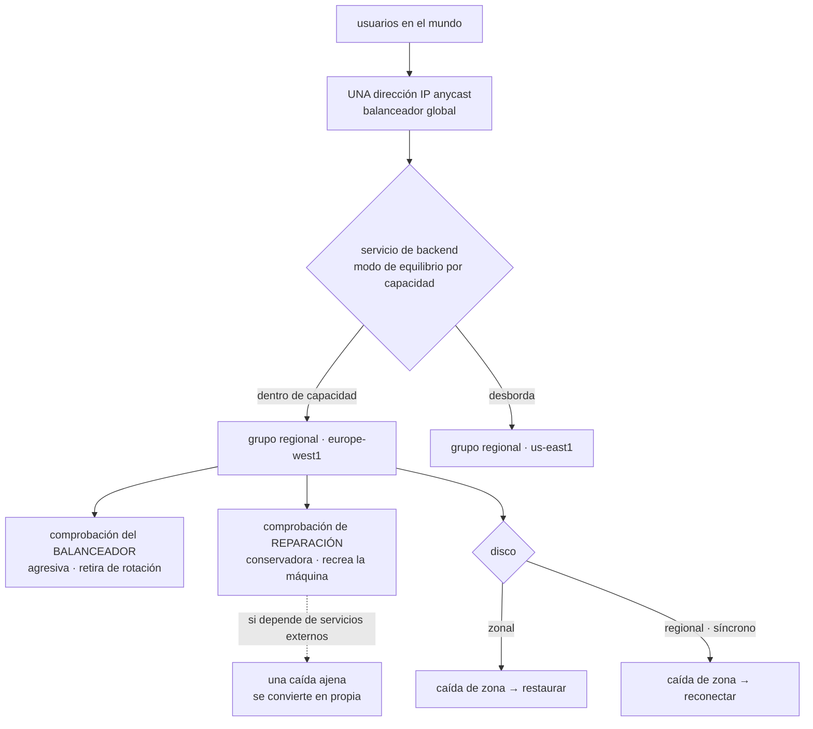

# 052 — Compute Engine, managed instance groups y load balancing

> [← Clase anterior](../../part-04-gcp-core-platform/051-vpc-global-subredes-regionales-firewall-y-cloud-nat/README.md) · [Índice de la parte](../README.md) · [Clase siguiente →](../../part-04-gcp-core-platform/053-cloud-storage-clases-lifecycle-y-replicacion/README.md)

**Parte:** 04 — Google Cloud: plataforma esencial<br>
**Nivel:** intermedio · **Horas estimadas:** 4<br>
**Laboratorio:** `compute` · **Estado:** `EXECUTABLE_CORE`

## 🎯 Propósito

Dimensionar cómputo y reparto de carga en Google Cloud, donde tres cosas funcionan al revés de lo aprendido: el descuento por uso sostenido **se aplica solo**, sin comprar nada; la máquina se puede definir con el número exacto de vCPU y de memoria que hace falta; y el balanceador global tiene **una sola dirección IP para todo el planeta**, así que la conmutación entre regiones no depende del DNS ni de su TTL. A cambio, reaparece por tercera vez el problema de los dos límites de disco y aparece una forma nueva de tumbar un servicio: la reparación automática.

## 📚 Resultados de aprendizaje

Al finalizar podrás:

1. **Elegir** tipo de máquina, incluido uno personalizado, a partir del uso medido en vez del catálogo.
2. **Calcular** el costo real considerando el descuento automático por uso sostenido antes de comprometer nada.
3. **Separar** la comprobación de estado del balanceador de la de reparación automática, y explicar qué rompe mezclarlas.
4. **Configurar** un balanceador global con modo de equilibrio por capacidad y medir su conmutación entre regiones.
5. **Decidir** entre disco zonal y disco regional a partir del RTO exigido ante la caída de una zona.

## 🧩 Conceptos centrales

| Concepto | Comprensión verificable |
|---|---|
| `tipo de máquina personalizado` | Definición con el número exacto de vCPU y de memoria, dentro de unas proporciones permitidas. Elimina el redondeo al escalón siguiente, que en las otras plataformas es obligatorio. |
| `descuento por uso sostenido` | Reducción **automática y sin compromiso** que crece con el porcentaje del mes que la máquina está encendida, hasta cerca del 30 %. No hay que comprar nada ni pedir nada. |
| `migración en vivo` | Traslado transparente de una máquina en ejecución durante el mantenimiento del anfitrión. Hace innecesario el concepto de dominio de actualización de la clase 040 — salvo en excedente y algunos tipos, que sí terminan. |
| `plantilla de instancia` | Definición **inmutable** de cómo es una instancia. Cambiar algo obliga a crear otra plantilla y ejecutar una actualización progresiva, lo que hace que cada cambio quede versionado. |
| `reparación automática` | Sustitución de instancias que fallan su comprobación de estado. Con una comprobación que depende de servicios externos, **convierte una caída ajena en una caída propia**. |
| `modo de equilibrio por capacidad` | Declaración de cuántas peticiones por segundo aguanta cada instancia. El balanceador global desborda a la región siguiente al superarla: así conmuta sin tocar el DNS. |
| `disco persistente regional` | Disco replicado de forma **síncrona entre dos zonas**. Permite reconectar el volumen en la otra zona en minutos, sin restaurar nada. |

## 🧠 Modelo mental

Un proyecto de Google Cloud es la unidad práctica de API, cuota, IAM y facturación; la organización aporta la política heredable.

Aplicado a esta clase, separa siempre cuatro planos: **intención** (qué necesita el usuario),
**configuración** (qué declaramos), **estado observado** (qué existe de verdad) y
**evidencia** (cómo sabemos que cumple). Confundirlos produce diseños que se ven correctos
en un diagrama pero fallan al operar.

## 🗺️ Flujo de razonamiento



## 📖 Desarrollo

### 1. La máquina a medida y el descuento que no hay que pedir

La nomenclatura es la más simple de las tres plataformas y no esconde letras con significado:

```text
n2 - standard - 8
│    │          └── vCPU
│    └───────────── perfil de memoria: standard (4 GB/vCPU),
│                   highmem (8), highcpu (2)
└────────────────── familia
```

```text
E2   propósito general económico; en tamaños pequeños comparte núcleo
N2 / N2D   propósito general, Intel y AMD
C3 / C4    cómputo, la generación con mejor rendimiento por núcleo
M3         memoria extrema
A3 / G2    aceleradores
T2D        rendimiento por precio para cargas escalables
```

Y una capacidad que ninguna de las otras dos ofrece: **el tipo personalizado**. Si el servicio usa 6 vCPU y 50 GB, no hay que comprar el escalón de 16 vCPU y 64 GB para llegar a la memoria:

```bash
$ gcloud compute instances create app-01 --zone europe-west1-b \
    --custom-cpu 8 --custom-memory 52GB --custom-vm-type n2
```

Las proporciones tienen límites —hay un mínimo y un máximo de memoria por vCPU—, y dentro de ellos el ajuste es exacto. En una flota mediana, dejar de pagar el redondeo es de los ahorros más grandes y menos laboriosos que existen: no cambia la arquitectura, solo el tamaño.

El segundo hecho cambia por completo la conversación sobre compromisos. En AWS y en Azure, el precio bajo exige comprar por adelantado. Aquí hay **un descuento automático por uso sostenido**:

```text
porcentaje del mes encendida        descuento aproximado
25 %                                  ~10 %
50 %                                  ~20 %
100 %                                 ~30 %
```

No se solicita, no se compra y no se puede olvidar. Una máquina encendida todo el mes ya está pagando cerca de un 30 % menos que su precio de lista, sin que nadie haya hecho nada. La consecuencia práctica al comparar costos entre proveedores es que **el precio de lista de Google Cloud no es el precio que se paga**, y compararlo con el precio de lista de otro proveedor sobreestima el gasto.

Encima de eso están los **compromisos de uso**, en dos formas:

```text
por recurso   familia y región concretas, 1 o 3 años
              descuento mayor, flexibilidad menor
por gasto     un importe por hora comprometido, aplicable a varias familias
              descuento algo menor, mucha más flexibilidad
```

El orden correcto de decisión es el mismo que la clase 028 estableció y aquí tiene un escalón más: **medir, ajustar el tamaño, dejar que el descuento automático haga su parte, y solo entonces comprometer lo que quede estable**. Comprometerse antes de ajustar el tamaño es comprometerse con el desperdicio.

Y sobre el **excedente**, la tercera medición del mismo dato del programa:

```text
AWS     ~120 s de aviso
Azure    ~30 s
Google   ~30 s
```

Treinta segundos, otra vez, dan para abortar y no para drenar. El aviso llega por el servicio de metadatos y por una señal del sistema operativo, así que se puede atender desde un script de apagado:

```bash
$ curl -s -H "Metadata-Flavor: Google" \
    "http://metadata.google.internal/computeMetadata/v1/instance/preempted"
TRUE
```

Y un detalle que evita una sorpresa: las máquinas de excedente **no migran en vivo**, terminan. La migración en vivo —que en el resto de casos hace que un mantenimiento del anfitrión no reinicie nada, y por eso aquí no existe el concepto de dominio de actualización de la clase 040— no aplica al excedente ni a algunos tipos con acelerador.

### 2. Discos: los dos límites, por tercera vez, y uno que sí replica

El disco persistente está conectado por red, no al anfitrión, y su rendimiento depende de **dos cosas a la vez**:

```text
del TAMAÑO del disco       pd-ssd: ~30 IOPS por GB
del NÚMERO DE vCPU         cada tamaño de máquina tiene su tope
```

Es el mismo patrón de la clase 040 con otra aritmética, y es la tercera vez que aparece en el programa:

```text
AWS     el volumen y la instancia tienen topes separados
Azure   el disco y la máquina tienen topes separados
Google  el disco escala por GB y la máquina por vCPU
```

La consecuencia es idéntica: **el caudal real es el mínimo de los dos**, y ampliar el disco no mueve la cifra si el techo era el otro.

```text
pd-ssd de 1.024 GB            ~30.000 IOPS de lectura
n2-standard-2 (2 vCPU)        ~15.000 IOPS de lectura
→ real: 15.000
cambiar a n2-standard-8       ~25.000 IOPS  → real: 25.000
```

Los tipos disponibles y para qué sirve cada uno:

```text
pd-standard    disco duro; archivos y arranques que no importan
pd-balanced    valor por defecto razonable para casi todo
pd-ssd         latencia baja y IOPS por GB
pd-extreme     IOPS aprovisionadas de forma independiente
Hyperdisk      familia moderna: tamaño, IOPS y caudal se fijan por separado
SSD local      efímero, muy rápido, SE PIERDE al detener la máquina
```

La última línea repite la lección de la clase 040: es la versión de Google Cloud del disco temporal, con la misma trampa. Sirve para caché, archivos temporales e índices reconstruibles, y no para datos.

Y aquí está la capacidad que **no tiene equivalente directo en las otras dos plataformas**: el **disco persistente regional**, replicado de forma síncrona entre dos zonas de la misma región.

```bash
$ gcloud compute disks create datos-01 --size 500GB --type pd-balanced \
    --region europe-west1 --replica-zones europe-west1-b,europe-west1-c
```

Lo que compra es un RTO distinto ante la caída de una zona:

```text
disco zonal     la zona cae → el disco no está → restaurar desde instantánea
                RTO: el tiempo de restaurar y arrancar
disco regional  la zona cae → conectar el disco a una máquina de la otra zona
                RTO: minutos, sin restaurar nada
```

El precio es aproximadamente el doble por GB y la escritura paga la latencia de confirmar en dos zonas, así que no es la opción por defecto: es la opción para el volumen cuya pérdida de disponibilidad define el RTO del servicio — típicamente el de una base de datos que no está en un servicio gestionado.

Un apunte sobre **instantáneas** que ahorra trabajo: son incrementales y **globales**, así que una instantánea tomada en Europa se restaura en Estados Unidos sin copiarla explícitamente. Eso convierte la recuperación entre regiones en una operación sencilla, y hace que la política de instantáneas programadas sea una de las cosas más rentables de configurar el primer día.

### 3. Grupos gestionados: la plantilla inmutable y la reparación que hace daño

Un grupo de instancias gestionado se define con una **plantilla inmutable**. No se edita: para cambiar algo se crea otra y se ejecuta una actualización progresiva. Eso obliga a que cada cambio quede versionado, que es exactamente lo que se quiere:

```bash
$ gcloud compute instance-templates create tpl-tienda-v8 \
    --machine-type n2-standard-4 --image-family cls-tienda --image-project cls-imagenes \
    --service-account sa-tienda-web@cls-tienda-prod-euw1-01.iam.gserviceaccount.com \
    --scopes cloud-platform --no-address

$ gcloud compute instance-groups managed rolling-action start-update mig-tienda \
    --region europe-west1 --version template=tpl-tienda-v8 \
    --max-surge 2 --max-unavailable 0
```

`--max-unavailable 0` es la elección por defecto correcta: se crean instancias nuevas antes de retirar las viejas, así que la capacidad nunca baja durante el despliegue. Y el canario está integrado, sin infraestructura adicional:

```bash
$ gcloud compute instance-groups managed rolling-action start-update mig-tienda \
    --region europe-west1 \
    --version template=tpl-tienda-v7 \
    --canary-version template=tpl-tienda-v8,target-size=10%
```

El grupo debe ser **regional**, no zonal: reparte automáticamente entre las zonas de la región y sobrevive a la caída de una. Un grupo zonal es un punto único de fallo con nombre de grupo.

Y ahora la parte que produce el incidente más caro de esta clase. Un grupo gestionado usa comprobaciones de estado para dos cosas **distintas**, y la tentación es usar la misma:

```text
comprobación del BALANCEADOR      decide si la instancia recibe tráfico
                                  debe ser exigente: si no puede servir,
                                  que salga de rotación
comprobación de REPARACIÓN        decide si la instancia se DESTRUYE
                                  y se crea otra
```

Si la comprobación de reparación consulta las dependencias —base de datos, caché, otro servicio—, entonces una caída ajena hace que **todas** las instancias fallen a la vez, y el grupo las recrea todas a la vez. El resultado es que un fallo externo de cuarenta segundos se convierte en una caída propia de varios minutos: mientras las instancias nuevas arrancan, no hay ninguna sirviendo, y las nuevas fallan la misma comprobación en cuanto arrancan.

La regla que lo evita:

```text
reparación → comprueba si el PROCESO está vivo, y nada más
             /healthz, sin dependencias, con retardo inicial generoso
balanceador → comprueba si la instancia PUEDE SERVIR
             /readyz, con dependencias, umbral corto
```

Es la distinción entre vivacidad y disponibilidad que la clase 029 introdujo, y aquí tiene una consecuencia destructiva si se ignora, porque el mecanismo no retira de rotación: **borra la máquina**.

```bash
$ gcloud compute health-checks create http hc-reparacion \
    --request-path /healthz --check-interval 30s --timeout 10s \
    --unhealthy-threshold 5 --healthy-threshold 2
$ gcloud compute instance-groups managed update mig-tienda --region europe-west1 \
    --health-check hc-reparacion --initial-delay 300
```

El retardo inicial de 300 segundos es la otra mitad: sin él, una instancia que tarda cuatro minutos en calentarse se destruye antes de llegar a servir, y el grupo entra en un ciclo de creación y destrucción que no converge nunca.

Y sobre el **autoescalado**, los cuatro parámetros de la clase 029 siguen valiendo. Lo que añade Google Cloud es un control de reducción que evita el otro extremo:

```bash
$ gcloud compute instance-groups managed set-autoscaling mig-tienda \
    --region europe-west1 --min-num-replicas 3 --max-num-replicas 30 \
    --target-cpu-utilization 0.6 --cool-down-period 90 \
    --scale-in-control max-scaled-in-replicas=3,time-window=600
```

Esa última línea limita cuántas instancias pueden retirarse en una ventana. Es la respuesta al comportamiento que la clase 029 describía: escalar hacia arriba es barato y escalar hacia abajo demasiado rápido deja al servicio sin margen justo cuando vuelve la carga.

### 4. Una sola dirección IP para el mundo

El balanceador externo global de aplicación es la pieza donde Google Cloud se separa más de las otras dos plataformas, y conviene entender **por qué** funciona como funciona.

```text
una única dirección IP anycast, anunciada desde todo el borde de Google
el usuario conecta al borde más cercano
el borde decide a qué región enviar
```

Comparado con lo aprendido en la clase 040:

| | Ámbito | Conmutación entre regiones |
|---|---|---|
| Traffic Manager (Azure) | DNS | La caché del cliente: minutos |
| Front Door (Azure) | Anycast | Segundos |
| Balanceador global (Google) | Anycast | **Segundos, y por capacidad** |

La última columna esconde el mecanismo interesante. El reparto entre regiones no es una lista de prioridades: es **capacidad declarada**.

```bash
$ gcloud compute backend-services add-backend bs-tienda --global \
    --instance-group mig-tienda --instance-group-region europe-west1 \
    --balancing-mode RATE --max-rate-per-instance 120 --capacity-scaler 1.0
$ gcloud compute backend-services add-backend bs-tienda --global \
    --instance-group mig-tienda-use --instance-group-region us-east1 \
    --balancing-mode RATE --max-rate-per-instance 120 --capacity-scaler 1.0
```

Con eso, el balanceador envía a la región más cercana **mientras quepa**, y desborda a la siguiente cuando se supera la capacidad declarada o cuando las comprobaciones de estado la marcan como no disponible. No hay DNS de por medio, así que el TTL no interviene y la cola larga de clientes que seguían yendo a la región caída —los nueve minutos de la clase 040— no existe.

Y el `capacity-scaler` es una palanca operativa que conviene conocer: ponerlo a 0 **drena** una región sin borrar nada, lo que convierte un mantenimiento regional en una operación de una línea y reversible.

La familia completa, para elegir sin confundirse:

```text
global externo de aplicación    HTTP(S), anycast, multirregión, con Cloud Armor
regional externo de aplicación  HTTP(S) en una región; requisitos de residencia
interno de aplicación           HTTP(S) dentro de la VPC
pasarela de red externo         capa 4, conserva la IP de origen
interno de paso                 capa 4 interno, para dispositivos y bases de datos
```

Y dos piezas que completan el borde:

**Cloud Armor** aplica reglas de WAF y protección contra denegación de servicio **en el borde**, antes de llegar a la región. La disciplina de la clase 035 se traslada entera: primero medir en modo vista previa, luego bloquear. Una regla desplegada directamente en modo bloqueo contra tráfico real es la forma habitual de cortar a clientes legítimos.

```bash
$ gcloud compute security-policies rules create 1000 --security-policy pol-tienda \
    --expression "evaluatePreconfiguredExpr('sqli-v33-stable')" --action deny-403 \
    --preview
```

**Cloud CDN** se activa como una propiedad del servicio de backend, no como un producto aparte. Un solo interruptor pone el contenido estático en el borde, y su efecto sobre el costo de salida es inmediato — la partida que la clase 025 identificó como la que más sorprende.

Y la comprobación de estado, otra vez: la del balanceador es la exigente, y **debe ejercitar las dependencias**. Un `/` que devuelve 200 con la base de datos caída mantiene en rotación una región entera que no puede servir, y el desbordamiento por capacidad no se activa porque, desde fuera, esa región parece sana.

### 5. Elegir el tamaño con datos, no con la talla anterior

Con el descuento automático, el tipo personalizado y el recomendador, Google Cloud permite cerrar el bucle de dimensionamiento con datos en las tres decisiones. Merece un método corto porque es lo que se lleva a la clase 060.

```bash
$ gcloud recommender recommendations list --project cls-tienda-prod-euw1-01 \
    --location europe-west1-b --recommender google.compute.instance.MachineTypeRecommender \
    --format "table(content.overview.resourceName, content.overview.recommendedMachineType)"
```

Las recomendaciones de tamaño se basan en el uso de las últimas semanas, y tienen los mismos dos límites que las de permisos de la clase 050: no ven lo que ocurre una vez al trimestre, y miden lo usado y no lo necesario. La forma responsable de aplicarlas es la misma —empezar por lo predecible, observar, y tener a mano la vuelta atrás— con una ventaja: cambiar el tipo de máquina de un grupo gestionado es crear otra plantilla y hacer una actualización progresiva, que ya está ensayada.

El orden completo, que evita el error de comprometer desperdicio:

```text
1. medir uso real de CPU y memoria durante al menos dos semanas,
   incluyendo el pico estacional si lo hay
2. ajustar el tamaño, usando tipo personalizado si el escalón no encaja
3. dejar que el descuento por uso sostenido se aplique solo
4. comprometer solo la parte que llevará un año encendida
5. mover a excedente lo que tolere 30 segundos de aviso
```

Y una comparación que conviene tener escrita para cuando alguien proponga migrar por precio:

```text                                  precio de lista   lo que se paga
máquina encendida todo el mes                100 %          ~70 %  (uso sostenido)
+ tamaño ajustado con tipo personalizado                    ~55 %
+ compromiso de un año sobre la base                        ~40 %
+ excedente para la capacidad de pico                       ~30 %
```

Cada línea es acumulativa y ninguna cambia la arquitectura. Es el mismo argumento de la clase 028 —la elección de capacidad es una decisión medible— con una plataforma que regala el primer escalón y permite el segundo con precisión.

Y el cierre que conecta con lo que viene: **todo esto es cómputo gestionado por ti**. Las clases 055 y 060 plantearán la pregunta que hace obsoleta buena parte de este ajuste — si el servicio puede correr en una plataforma que escala a cero, el trabajo de dimensionar deja de existir. Conviene medir el cómputo bien antes de decidir si merece la pena seguir teniéndolo.

## 🔬 Ejemplo trabajado

**CloudShop traslada su capa de cómputo a Google Cloud. La primera medición trae una sorpresa agradable y las cuatro siguientes son problemas — uno de ellos, el mismo que ya había aparecido dos veces en el programa.**

**Sorpresa inicial — el descuento ya estaba aplicado.**

La estimación previa se hizo con precios de lista y salió más cara que Azure. La primera factura real:

```text                                    estimado      real
6 × n2-standard-4, mes completo        1.128 USD    790 USD
                                                    (−30 % por uso sostenido)
```

Nadie compró nada. El equipo corrige el método de estimación: **comparar precios de lista entre proveedores con modelos de descuento distintos produce conclusiones falsas**, y hay que comparar el precio efectivo de una carga concreta.

**Incidente 1 — el disco de 1 TB que rinde la mitad.**

La base de datos autogestionada de informes no pasa de 15.000 IOPS con un disco que debería dar 30.000.

```bash
$ gcloud compute disks describe datos-informes --zone europe-west1-b \
    --format="value(sizeGb,type)"
1024   pd-ssd
$ gcloud compute instances describe informes-01 --zone europe-west1-b \
    --format="value(machineType.basename())"
n2-standard-2
```

Es la tercera vez que el programa encuentra este problema: en AWS con el volumen y la instancia, en Azure con el disco y el tamaño de máquina, y aquí con los GB del disco y las vCPU de la máquina.

```text                              antes              después
máquina                   n2-standard-2 (15.000)  n2-standard-8 (25.000)
disco                     pd-ssd 1.024 GB         pd-ssd 1.024 GB
IOPS reales                     15.000                25.000
duración del informe nocturno   94 min                41 min
```

**Incidente 2 — 16 vCPU para usar 6.**

El servicio de catálogo estaba en `n2-standard-16` porque necesitaba memoria, no CPU:

```text
uso medido    CPU 34 % de 16 vCPU     memoria 51 GB de 64
```

```text                                  antes            después
tipo                            n2-standard-16    n2-custom-8-53248
vCPU                                  16                  8
memoria                              64 GB              52 GB
costo mensual por instancia         ~395 USD          ~232 USD
instancias                             4                  4
costo mensual del servicio         1.580 USD          928 USD
```

Seiscientos cincuenta dólares al mes por no redondear al escalón siguiente. La arquitectura no cambió.

**Incidente 3 — una caída de 40 segundos que duró nueve minutos.**

La base de datos gestionada conmutó entre zonas —40 segundos—. El servicio estuvo caído nueve minutos.

```bash
$ gcloud compute operations list --filter="operationType:compute.instances.insert" \
    --format="value(insertTime,targetLink.basename())" | head
10:14:22  tienda-a7f2
10:14:22  tienda-c91e
10:14:23  tienda-b03d
10:14:23  tienda-4ae8
```

Las cuatro instancias se recrearon a la vez. La comprobación de reparación automática consultaba `/readyz`, que verifica la base de datos: al conmutar esta, las cuatro instancias fallaron a la vez y el grupo las destruyó a la vez. Las nuevas tardaron cuatro minutos en arrancar y volvieron a fallar la misma comprobación.

```text                                antes                después
comprobación de reparación         /readyz (dependencias)  /healthz (proceso vivo)
umbral de fallo                    2 fallos               5 fallos
intervalo                          10 s                   30 s
retardo inicial                    0 s                    300 s
comprobación del balanceador       /readyz                /readyz  ← se queda
duración del episodio equivalente   9 min                  41 s
```

La comprobación del balanceador **no cambió**: estaba bien. Lo que estaba mal era usar la misma para decidir si destruir una máquina.

**Incidente 4 — el simulacro de región, comparado con la clase 040.**

Se drena `europe-west1` poniendo su escalador de capacidad a cero:

```bash
$ gcloud compute backend-services update-backend bs-tienda --global \
    --instance-group mig-tienda --instance-group-region europe-west1 \
    --capacity-scaler 0.0
```

```text                                    Azure (040)         Google Cloud
mecanismo                        Traffic Manager / Front Door  anycast + capacidad
conmutación observada             9 min / 35 s                    2,4 s
errores vistos por el cliente     algunos / ninguno tras reintento  ninguno
direcciones IP implicadas              2                             1
reversión                        cambiar destinos             capacity-scaler 1.0
```

Dos coma cuatro segundos y una sola dirección IP. Y la operación inversa es la misma línea con otro valor, lo que la convierte en un procedimiento de mantenimiento y no en un plan de contingencia.

**Incidente 5 — una zona cae y el disco estaba en ella.**

El simulacro de zona deja fuera la máquina que aloja el servicio de búsqueda, con su índice en un disco zonal:

```text                            disco zonal        disco regional
recuperación                  restaurar instantánea  conectar en la otra zona
RTO medido                        47 min                 4 min
pérdida de datos                  hasta 6 h              ninguna
costo mensual del volumen         42 USD                 84 USD
```

Cuarenta y dos dólares al mes por bajar el RTO de 47 a 4 minutos, solo para el volumen cuya disponibilidad define el RTO del servicio. El resto de discos se quedan zonales con instantáneas programadas.

**Resumen de la capa de cómputo:**

```text                                          antes         después
tipo de las máquinas de catálogo         n2-standard-16   n2-custom-8-53248
IOPS reales del volumen de informes           15.000          25.000
duración del informe nocturno                 94 min          41 min
episodio por conmutación de base de datos      9 min           41 s
conmutación entre regiones                       —             2,4 s
RTO ante caída de zona del índice             47 min           4 min
costo mensual de cómputo                     2.370 USD      1.718 USD
```

**La lección que esta clase traslada al resto de la parte 04**: dos de los cinco problemas eran conocidos —los dos límites de disco y la comprobación de estado que confunde vivacidad con disponibilidad— y aparecieron igual, porque son propiedades del problema y no del proveedor. El único mecanismo genuinamente nuevo, la reparación automática, hizo más daño que ninguno: **es la primera pieza del programa que responde a un fallo destruyendo infraestructura sana**, y por eso su comprobación tiene que ser la más conservadora de todo el sistema.

## 🧪 Laboratorio guiado

Ejecuta desde la raíz:

```bash
python classes/part-04-gcp-core-platform/052-compute-engine-managed-instance-groups-y-load-balancing/lab.py
```

El laboratorio selecciona el motor de práctica **`compute`** y produce
`lab_result.json`. El escenario, sus comprobaciones y el artefacto esperado corresponden a
esta clase; no requiere credenciales y deja explícito qué debe revalidarse en un sandbox real.

1. Lee `exercise.steps` y formula una predicción antes de ejecutar.
2. Ejecuta la práctica y verifica todos los elementos de `checks`.
3. Provoca el caso de `negative_test` y explica la señal observada.
4. Materializa `servicio-elastico-gcp` en `evidence/` usando la plantilla indicada.
5. Para proveedor real, sigue `sandbox.requires`, registra costo y ejecuta `destroy`.

### Evidencia esperada

El artefacto principal es una selección de capacidad justificada y observable. Además, la entrega debe incluir el comando ejecutado,
la salida estructurada y una conclusión que no exceda lo observado.

## 🏆 Reto verificable

Construye **`servicio-elastico-gcp`** para el caso CloudShop. Incluye una alternativa descartada,
un supuesto que pueda falsarse, una prueba de fallo y una decisión de rollback.

## ✅ Criterio de aceptación

- [ ] `lab.py` termina con código 0 y genera JSON válido.
- [ ] La entrega conecta al menos tres requisitos con mecanismos verificables.
- [ ] Existe una prueba positiva y una prueba negativa con evidencia.
- [ ] Seguridad, costo y operación aparecen como decisiones, no como anexos.
- [ ] Se declara una limitación y una condición que obligaría a revisar el diseño.
- [ ] Otra persona puede repetir el recorrido sin conocimiento tácito.

## ⚠️ Errores frecuentes

| Síntoma | Causa probable | Corrección |
|---|---|---|
| Se amplía el disco y las IOPS no cambian | El tope efectivo lo pone el número de vCPU de la máquina, no el tamaño del disco | Consulta ambos límites: el caudal real es el mínimo, y se corrige subiendo de tipo de máquina. |
| Un fallo externo de segundos se convierte en una caída propia de minutos | La comprobación de reparación automática consulta dependencias, así que todas las instancias fallan y se destruyen a la vez | Reparación con `/healthz` sin dependencias, umbral alto y retardo inicial; balanceador con `/readyz`. |
| Un grupo gestionado crea y destruye instancias sin converger | El retardo inicial es menor que el tiempo de arranque del servicio | Fija `--initial-delay` por encima del arranque real medido, con margen. |
| La comparación de costos con otro proveedor sale muy desfavorable | Se compararon precios de lista y el descuento por uso sostenido se aplica solo | Compara el precio efectivo de una carga concreta, con descuentos y tamaños ajustados en ambos lados. |
| Se paga una máquina grande para llegar a la memoria necesaria | Se eligió un tipo predefinido y el escalón siguiente duplica también la CPU | Usa un tipo personalizado con las vCPU y la memoria medidas, dentro de las proporciones permitidas. |
| Tras la caída de una zona hay que restaurar para recuperar un volumen | El disco era zonal y su disponibilidad definía el RTO del servicio | Usa disco persistente regional solo para ese volumen y deja el resto zonal con instantáneas programadas. |

## 🛡️ Seguridad, ética y costo

Trabaja con cuentas propias o sandboxes autorizados. No publiques secretos, identificadores
reales ni datos personales. Antes de crear recursos pagos define presupuesto, etiquetas y
comando de destrucción; después verifica que no queden recursos huérfanos. Los ejemplos
locales enseñan contratos, pero no certifican cumplimiento ni disponibilidad de producción.

## ❓ Preguntas de comprobación

1. ¿Qué descuento se aplica sin comprar nada y cómo cambia la forma correcta de comparar costos entre proveedores?
2. ¿Qué dos factores determinan las IOPS de un disco persistente, y en qué se parece a lo visto en las clases 028 y 040?
3. ¿Por qué la comprobación de reparación automática debe ser distinta de la del balanceador, y qué ocurre si son la misma?
4. ¿Cómo conmuta entre regiones un balanceador global sin depender del DNS, y qué papel tiene la capacidad declarada?
5. ¿En qué caso concreto compensa un disco persistente regional y cómo se justifica su costo?

## 🔗 Referencias

- Google Cloud (2025). *Machine families resource and comparison guide* — familias, tipos personalizados y proporciones. <https://cloud.google.com/compute/docs/machine-resource>
- Google Cloud (2025). *Sustained use discounts* — descuento automático y su interacción con los compromisos. <https://cloud.google.com/compute/docs/sustained-use-discounts>
- Google Cloud (2025). *Block storage performance* — IOPS por GB y límites por número de vCPU. <https://cloud.google.com/compute/docs/disks/performance>
- Google Cloud (2025). *Autohealing instances in MIGs* — comprobación de reparación, retardo inicial y diferencias con la del balanceador. <https://cloud.google.com/compute/docs/instance-groups/autohealing-instances-in-migs>
- Google Cloud (2025). *External Application Load Balancer overview* — anycast, modos de equilibrio y escalador de capacidad. <https://cloud.google.com/load-balancing/docs/https>
- Documentación oficial vigente del servicio implementado; registra URL y fecha de consulta.

---

> [Evaluación](assessment.md) · [Contrato de clase](lesson.yaml) · [Índice de la parte](../README.md)
