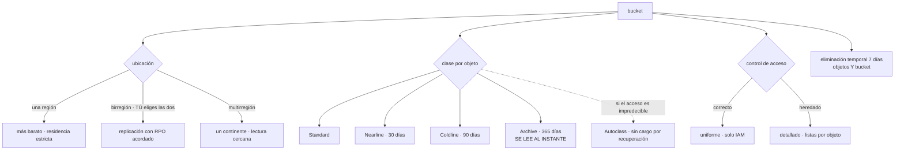

# 053 — Cloud Storage, clases, lifecycle y replicación

> [← 052 · Compute Engine, managed instance groups y load balancing](../../part-04-gcp-core-platform/052-compute-engine-managed-instance-groups-y-load-balancing/README.md) · [Índice de la parte](../README.md) · [054 · Cloud SQL, Spanner, Firestore y Memorystore →](../../part-04-gcp-core-platform/054-cloud-sql-spanner-firestore-y-memorystore/README.md)

**Parte:** 04 — Google Cloud: plataforma esencial<br>
**Nivel:** intermedio · **Horas estimadas:** 4<br>
**Laboratorio:** `storage` · **Estado:** `EXECUTABLE_CORE`

## 🎯 Propósito

Operar el almacenamiento de objetos de Google Cloud, donde dos de las trampas que costaron caro en las clases 030 y 041 sencillamente no existen —la región del par replicado se elige, y el nivel más frío se lee al instante— y aparece una dimensión que ninguna de las dos plataformas anteriores obligaba a considerar: **el número de objetos cuesta dinero además del volumen**, y una regla de ciclo de vida mal escrita puede gastar más en operaciones de lo que ahorra en almacenamiento.

## 📚 Resultados de aprendizaje

Al finalizar podrás:

1. **Elegir** ubicación —región, birregión o multirregión— a partir de residencia de datos y RPO exigido.
2. **Calcular** el ahorro de un cambio de clase incluyendo el costo por operación y el número de objetos.
3. **Configurar** acceso uniforme y prevención de acceso público, con su prueba negativa.
4. **Emitir** URL firmadas sin ninguna clave, mediante suplantación y firma delegada.
5. **Verificar** la recuperación de objetos y de buckets borrados en vez de suponerla.

## 🧩 Conceptos centrales

| Concepto | Comprensión verificable |
|---|---|
| `ubicación del bucket` | Región, **birregión** —dos regiones que **eliges tú**— o multirregión. Es lo que en la clase 041 no se podía elegir, y aquí sí. |
| `clase de almacenamiento` | Propiedad de cada objeto. Las cuatro clases tienen **acceso en milisegundos**: no hay rehidratación. Lo que sube al enfriar no es el tiempo, es el precio de leer y de operar. |
| `operación de clase A y de clase B` | Escrituras y listados frente a lecturas. Su precio **sube al enfriar la clase**, hasta diez veces, así que mover millones de objetos pequeños puede costar más que guardarlos. |
| `acceso uniforme a nivel de bucket` | Modo en el que solo IAM decide el acceso. El modo detallado mantiene además listas de control por objeto, invisibles en la política del bucket. |
| `Autoclass` | Cambio de clase automático por objeto según su acceso real, **sin cargos por recuperación**, a cambio de una tarifa de gestión. Es la respuesta cuando el patrón de acceso no se puede predecir. |
| `eliminación temporal` | Retención por defecto de los objetos borrados **y del bucket**, durante siete días. Cubre de un golpe el hueco que en la clase 041 exigía dos interruptores distintos. |

## 🧠 Modelo mental

Un proyecto de Google Cloud es la unidad práctica de API, cuota, IAM y facturación; la organización aporta la política heredable.

Aplicado a esta clase, separa siempre cuatro planos: **intención** (qué necesita el usuario),
**configuración** (qué declaramos), **estado observado** (qué existe de verdad) y
**evidencia** (cómo sabemos que cumple). Confundirlos produce diseños que se ven correctos
en un diagrama pero fallan al operar.

## 🗺️ Flujo de razonamiento



## 📖 Desarrollo

### 1. La ubicación se elige, y eso resuelve un problema de la clase 041

Un bucket tiene un nombre global —como el identificador de proyecto de la clase 049, único entre todos los clientes— y una **ubicación** que se fija al crearlo y no cambia:

| | Qué replica | Cuándo |
|---|---|---|
| Región | Dentro de una región, entre zonas | Residencia estricta y menor costo |
| **Birregión** | Entre **dos regiones que eliges** | Recuperación regional con control del destino |
| Multirregión | Dentro de un continente | Lectura desde muchos sitios, sin elegir dónde |

La fila del medio merece detenerse, porque responde a un problema concreto que la clase 041 dejó sin solución elegante. Allí, la redundancia geográfica de Azure replicaba a una **región emparejada asignada por Microsoft**, y cuando ese destino caía fuera de la jurisdicción aprobada había que renunciar a la redundancia geográfica y montar una replicación explícita.

Aquí la birregión se declara:

```bash
$ gcloud storage buckets create gs://cls-facturas \
    --placement europe-west1,europe-west4 \
    --default-storage-class STANDARD --uniform-bucket-level-access \
    --enable-autoclass
```

Dos regiones elegidas, ambas dentro del espacio aprobado, con una sola URL y una sola API. Y si el RPO importa, la **replicación turbo** lo convierte en un compromiso medible en vez de en una aspiración:

```text
replicación birregional por defecto   asíncrona, sin RPO comprometido
replicación turbo                     objetivo de 15 minutos, con acuerdo
```

Esa segunda línea es el contraste directo con `lastSyncTime` de la clase 041: allí el RPO era un número que había que medir y que nadie garantizaba; aquí hay un compromiso, a cambio de un precio.

Un detalle de ingeniería que conviene entender antes de elegir multirregión por comodidad: la replicación **no es síncrona**, así que una escritura confirmada en una región puede no estar en la otra durante un intervalo. La consistencia de una lectura tras escritura sí está garantizada para el objeto —Google Cloud Storage es fuertemente consistente en lectura tras escritura y en listados— y lo que no está garantizado es que la copia de la otra región esté al día en ese instante. Diseñar suponiendo lo contrario produce el mismo tipo de sorpresa que la conmutación de la clase 041.

Y hay una asimetría de costos que decide más de lo que parece: **multirregión cuesta más por GB almacenado** y, según la operación, más por operación. Para datos que se leen desde una sola región, pagar la multirregión es pagar disponibilidad que nadie usa. El criterio es el de siempre: la ubicación se elige por el requisito de residencia y de recuperación, no por el que suena mejor.

### 2. Enfriar cuesta operaciones, no tiempo

Aquí está la diferencia que más cambia el diseño respecto a las dos plataformas anteriores. Las cuatro clases se leen **en milisegundos**:

| Clase | Almacenamiento aprox. | Permanencia mínima | Recuperación por GB | ¿Hay que rehidratar? |
|---|---|---|---|---|
| Standard | ~0,020 USD/GB/mes | — | — | — |
| Nearline | ~0,010 | 30 días | ~0,01 | **No** |
| Coldline | ~0,004 | 90 días | ~0,02 | **No** |
| Archive | ~0,0012 | 365 días | ~0,05 | **No** |

Comparado con lo aprendido:

```text
Azure archivo   hasta 15 h de rehidratación → incompatible con casi cualquier RTO
AWS Glacier     minutos a horas según el nivel
Google Archive  milisegundos, con cargo por lectura
```

Eso elimina la frontera que la clase 041 estableció —«archivo es para lo que hay que guardar, no para lo que hay que poder leer»— y la sustituye por otra: **archivo es para lo que casi nunca se lee, porque leerlo cuesta**.

Y aparece la dimensión nueva, la que ninguna de las dos plataformas anteriores obligaba a mirar: **el precio por operación sube al enfriar la clase**.

```text                     operación de clase A (escribir, listar)
Standard                    ~0,005 USD por 1.000
Nearline                    ~0,010
Coldline                    ~0,020
Archive                     ~0,050            ← diez veces la de Standard
```

Una regla de ciclo de vida que mueve millones de objetos pequeños a Archive ejecuta **una operación de clase A por objeto**:

```text
4,2 millones de objetos a Archive
  4.200.000 / 1.000 × 0,05 = 210 USD, de una vez

y si esos objetos suman 300 GB:
  ahorro mensual = 300 × (0,020 − 0,0012) = 5,64 USD/mes
  → la operación tarda 37 MESES en amortizarse
```

Y eso sin contar que cada lectura posterior cuesta 0,05 USD por GB. **La operación destruye valor**, y en las plataformas anteriores el mismo razonamiento no aparecía porque el precio por operación no cambiaba con la clase.

La corrección es una condición de tamaño en la regla, para que el ciclo de vida ignore lo pequeño:

```json
{
  "lifecycle": {"rule": [
    {"action": {"type": "SetStorageClass", "storageClass": "NEARLINE"},
     "condition": {"age": 30, "matchesPrefix": ["facturas/"],
                   "matchesStorageClass": ["STANDARD"]}},
    {"action": {"type": "SetStorageClass", "storageClass": "ARCHIVE"},
     "condition": {"age": 365, "matchesStorageClass": ["NEARLINE"]}},
    {"action": {"type": "Delete"},
     "condition": {"daysSinceNoncurrentTime": 90, "isLive": false}}
  ]}
}
```

La última regla es la que ya ha aparecido en las clases 030 y 041 y aquí es la cuarta: **con versionado activo, borrar no libera nada**. Las versiones no actuales siguen facturando hasta que una regla las retire, y la factura no baja tras una limpieza si nadie escribió esa condición.

Y cuando el patrón de acceso no se puede predecir —que es el caso honesto en la mayoría de conjuntos de datos—, está **Autoclass**:

```text
mueve cada objeto de clase según SU acceso real
no cobra recuperación al leer un objeto frío
no cobra la operación de transición
cobra una tarifa de gestión por objeto y mes
```

Eso elimina de un golpe todo el cálculo de punto de equilibrio de las clases 030 y 041. La decisión pasa a ser una comparación simple: la tarifa de gestión frente al ahorro esperado. Para un bucket con acceso irregular, casi siempre gana Autoclass; para uno con un patrón claro y estable, una regla explícita sale más barata.

### 3. Acceso: uniforme, sin claves y sin URL eternas

Google Cloud Storage tiene dos modelos de control de acceso y uno de ellos es un problema heredado:

```text
acceso uniforme a nivel de bucket   solo IAM decide. Auditable.
acceso detallado                    IAM + listas de control POR OBJETO
```

El segundo es la razón por la que un bucket puede estar exponiendo un objeto concreto mientras su política de IAM parece impecable: la lista de control vive **en el objeto**, no en el bucket, y revisar la política no la muestra. Encontrar todos los objetos con una lista permisiva exige recorrerlos uno a uno.

```bash
$ gcloud storage buckets update gs://cls-facturas --uniform-bucket-level-access
```

Una vez activado, las listas por objeto dejan de tener efecto. Y por encima, la política de organización de la clase 049 impide que nadie vuelva a abrirlo:

```bash
$ gcloud resource-manager org-policies enable-enforce \
    constraints/storage.publicAccessPrevention --organization $ORG_ID
$ gcloud storage buckets add-iam-policy-binding gs://cls-facturas \
    --member allUsers --role roles/storage.objectViewer
ERROR: 412 Request violates constraint storage.publicAccessPrevention     ✓
```

Es la misma prueba negativa de la clase 046, ejecutada por segunda vez con otro vocabulario y el mismo valor: **el mensaje no habla de permisos**, así que añadir roles no habría cambiado nada.

Y sobre el acceso temporal a un objeto concreto, la **URL firmada** tiene el mismo problema estructural que la SAS de la clase 041:

```text
una URL firmada NO se puede revocar
solo caduca
```

La diferencia está en con qué se firma. La vía cómoda es una clave HMAC o una clave de cuenta de servicio, y las dos son exactamente lo que la clase 050 acaba de eliminar. La vía correcta no crea ninguna clave: la firma la produce la propia API de IAM, previa suplantación.

```bash
$ gcloud storage sign-url gs://cls-facturas/2026-07.pdf \
    --duration 15m \
    --impersonate-service-account firmador@cls-tienda-prod-euw1-01.iam.gserviceaccount.com
```

Eso exige que quien firma tenga `roles/iam.serviceAccountTokenCreator` sobre la cuenta firmadora, lo que a su vez es auditable y caduca. Y la duración corta es la única protección real: si no se puede revocar, que dure quince minutos y no siete días.

Tres piezas más completan el control, y cada una responde a un requisito distinto:

```text
política de retención + bloqueo   WORM: ni el propietario puede borrar antes
                                  el bloqueo es IRREVERSIBLE, como en la clase 041
retención por objeto              plazo distinto para objetos distintos
clave gestionada por el cliente   control y revocación, con la responsabilidad
                                  descrita en la clase 046
```

Y el que quien pague sea el lector —**el bucket con pago por solicitante**— resuelve un caso concreto que aparece al compartir datos: publicar un conjunto grande sin pagar la salida de quien lo descargue. Es una decisión de costo con nombre, y conviene conocerla antes de que alguien proponga copiar el conjunto a otro sitio para evitar el gasto.

### 4. Borrar y recuperar: el hueco de la clase 041 aquí está cubierto

La clase 041 dejó el incidente más caro de la parte 03: la eliminación temporal de blob estaba activa, la de contenedor no, y un contenedor borrado se llevó 412 GiB sin recuperación posible. Eran dos interruptores independientes y solo uno estaba puesto.

Aquí ese hueco no existe de la misma forma. La **eliminación temporal** de Cloud Storage está activada por defecto con siete días de retención y cubre las dos cosas a la vez:

```bash
$ gcloud storage buckets describe gs://cls-facturas \
    --format="value(soft_delete_policy.retentionDurationSeconds)"
604800
```

```text
objetos borrados      recuperables durante la retención
BUCKET borrado        recuperable durante la retención, con su contenido
```

La restauración de un bucket entero:

```bash
$ gcloud storage buckets list --soft-deleted --format="value(name,generation)"
cls-pruebas   1753992014882
$ gcloud storage buckets restore gs://cls-pruebas --generation 1753992014882
```

Eso no elimina la obligación de probarlo. Es exactamente el mismo argumento de la clase 041: **la única forma honesta de saber si una recuperación funciona es borrar algo a propósito y recuperarlo**, y hacerlo periódicamente, porque la retención se puede reducir y alguien puede hacerlo.

Los mecanismos completos y qué cubre cada uno, que siguen siendo varios y no uno:

```text
eliminación temporal   borrado accidental de objetos y del bucket, 7 días
versionado             sobrescrituras: conserva la versión anterior
retención + bloqueo    borrado deliberado, incluso por el propietario
instantáneas / copias  corrupción lógica propagada por la aplicación
```

La cuarta fila es la que ninguna de las tres primeras cubre y la que más se olvida: si la aplicación escribe datos corruptos, el versionado guarda la versión buena y la eliminación temporal no interviene, pero **nadie avisa**, y cuando se descubre puede haber pasado la ventana. La defensa es la de la clase 030: una copia con ciclo de vida propio, en otro proyecto, con permisos distintos.

Y una decisión de gobierno que conviene tomar pronto: el proyecto que contiene las copias **no debe ser administrable por quien administra el original**. Es la diferencia entre una copia de seguridad y una segunda carpeta.

La comparación final con las dos plataformas anteriores, que es lo que se lleva a la clase 060:

```text                           AWS (030)      Azure (041)     Google (053)
protección por defecto           ninguna       ninguna     eliminación temporal
interruptores necesarios            3             5              2
región del par replicado         se elige     asignada        se elige
lectura del nivel más frío       minutos-horas  hasta 15 h    milisegundos
costo por operación al enfriar    estable      estable       hasta ×10
```

La última fila es la única en la que Google Cloud añade una trampa que las otras no tenían. Las cuatro primeras van en la otra dirección, y confirman la parte de la hipótesis de la clase 048 que decía que **las excepciones serían otras**: no se repite ninguna de las de Azure, y aparece una nueva que hay que aprender.

### 5. Lo que cuesta de verdad: salida, operaciones y objetos pequeños

La factura de almacenamiento tiene cuatro partidas y la primera casi nunca es la mayor:

```text
almacenamiento    GB por mes, según clase y ubicación
operaciones       clase A y clase B, según clase
recuperación      GB leídos desde clases frías
salida de red     GB que salen de Google Cloud
```

La **salida de red** es la que sorprende, igual que en las dos plataformas anteriores, y tiene aquí una respuesta directa: casi todo el tráfico interno no sale. Un servicio en Compute Engine o Cloud Run leyendo de un bucket de la misma región **no genera salida**, y el acceso privado a Google de la clase 051 asegura además que no pase por Cloud NAT. Las dos decisiones juntas eliminan la partida entera para el tráfico interno.

Para el tráfico hacia usuarios, la palanca es **Cloud CDN** delante del bucket, que la clase 052 dejó a un interruptor de distancia. El cálculo es el de siempre: cuánto del contenido es cacheable y qué proporción de peticiones deja de llegar al origen.

Y la partida de **operaciones** merece una regla propia, porque es donde esta plataforma se comporta distinto:

```text
un objeto de 2 KB en Archive
  almacenamiento    0,0000024 USD/mes
  una lectura       0,0000004 USD de operación + 0,0000001 de recuperación
  → el objeto cuesta más leerlo que guardarlo un año
```

Eso lleva a un principio de diseño que no aparecía en las clases 030 ni 041: **agrupar objetos pequeños antes de enfriarlos**. Un millón de registros de 2 KB en un solo archivo comprimido cuesta una operación en lugar de un millón, y el ahorro es de dos órdenes de magnitud. La composición de objetos y los formatos columnares existen para eso, y la decisión se toma al escribir, no al archivar.

El método completo para decidir una regla de ciclo de vida, que es el entregable de esta clase:

```text
1. ¿cuántos objetos y de qué tamaño medio?
   si el tamaño medio es de pocos KB, agrupar antes de nada
2. ¿qué proporción se relee al mes?
   por encima del punto de equilibrio, enfriar cuesta dinero
3. ¿se puede predecir el acceso?
   si no, Autoclass y se acabó el cálculo
4. ¿cuánto cuesta la transición?
   objetos × precio de operación de la clase destino, de una vez
5. ¿en cuántos meses se amortiza?
   si la respuesta es más de doce, no se hace
```

El paso 5 es el que falta en casi todas las políticas de ciclo de vida que existen, y es el único que convierte la decisión en algo defendible.

## 🔬 Ejemplo trabajado

**CloudShop lleva su almacenamiento a Google Cloud con la línea base de la clase 041 en la mano. Dos de los cinco problemas de aquella clase no se reproducen, uno se reproduce igual, y aparece uno nuevo que cuesta 210 dólares en una tarde.**

**Lo que no se reprodujo.**

```text
la región del par replicado           en Azure se asignaba; aquí se eligió
                                      europe-west1 + europe-west4, ambas
                                      dentro de la jurisdicción aprobada
borrado de un contenedor              en Azure se perdieron 412 GiB por tener
                                      un interruptor de dos; aquí la eliminación
                                      temporal viene activa y cubre las dos cosas
```

Ambas se verificaron en vez de darse por buenas:

```bash
$ gcloud storage buckets delete gs://cls-prueba-recuperacion
$ gcloud storage buckets list --soft-deleted --format="value(name,generation)"
cls-prueba-recuperacion   1753992014882
$ gcloud storage buckets restore gs://cls-prueba-recuperacion --generation 1753992014882
$ gcloud storage ls gs://cls-prueba-recuperacion | wc -l
50                                                                          ✓
```

**Incidente 1 — la regla de ciclo de vida que destruyó valor.**

Se aplicó la política de la clase 041 traducida: a los 365 días, todo a Archive. El bucket de eventos contenía 4,2 millones de objetos de 71 KB de media.

```bash
$ gcloud storage ls -l gs://cls-eventos/** | tail -1
TOTAL: 4203118 objects, 298471029248 bytes (278 GiB)
```

```text
costo de la transición
  4.203.118 / 1.000 × 0,05 USD = 210,16 USD, cobrados de una vez
ahorro mensual
  278 GiB × (0,020 − 0,0012) = 5,22 USD/mes
amortización                                    40 meses
```

Y el golpe real llegó al mes siguiente: un análisis releyó el 12 % del conjunto.

```text
recuperación   33 GiB × 0,05 = 1,65 USD
operaciones    504.000 lecturas / 1.000 × 0,05 = 25,20 USD
total del análisis, que en Standard habría costado ~2,50 USD:  26,85 USD
```

La corrección tiene dos partes, y la segunda es la que dura:

```text                                antes              después
regla de ciclo de vida         todo a Archive a 365 d   solo objetos > 1 MB
objetos pequeños                    4,1 M              agrupados al escribir:
                                                       un archivo diario
objetos tras agrupar                4,2 M               31.400
clase del conjunto agrupado         Archive             Coldline
costo de la siguiente transición   210 USD              1,57 USD
costo del mismo análisis            26,85 USD           2,90 USD
```

**Incidente 2 — un objeto público con la política del bucket impecable.**

Una revisión externa encuentra una factura accesible sin autenticar. La política del bucket no concede nada a `allUsers`.

```bash
$ gcloud storage buckets describe gs://cls-facturas \
    --format="value(uniform_bucket_level_access.enabled)"
False
$ gcloud storage objects describe gs://cls-facturas/2025-11.pdf --format="value(acl)"
[{'entity': 'allUsers', 'role': 'READER'}]
```

Una lista de control **en el objeto**, puesta dos años atrás por una herramienta de migración. La política del bucket nunca la mostró.

```text                                        antes          después
modelo de acceso                          detallado       uniforme
objetos con lista de control permisiva        3               0
prevención de acceso público            no aplicada    política de organización
prueba negativa                              no          sí, ejecutada
```

**Incidente 3 — la factura que no baja. Cuarta vez.**

```text
datos visibles     412 GiB
facturado        1.108 GiB
```

Versionado activo y ninguna regla sobre versiones no actuales. Es el mismo problema del marcador de borrado de la clase 030 y de las versiones de la clase 041, con un tercer nombre.

```text                          antes      a las 24 h
facturado                    1.108 GiB     430 GiB
costo mensual del bucket      22,16 USD     8,60 USD
```

La nota que el equipo añade a su lista de comprobación de plataforma nueva: **si hay versionado, tiene que haber una regla que retire versiones, y hay que verificar que el facturado coincide con lo visible**.

**Incidente 4 — una URL firmada de siete días y la clave con la que se firmaba.**

```bash
$ gcloud storage hmac list --project cls-tienda-prod-euw1-01 --format="value(accessId,state)"
GOOG1E…   ACTIVE
```

La aplicación móvil pedía al backend una URL firmada de siete días, y el backend firmaba con una clave HMAC guardada en su configuración. Dos problemas encadenados: la clave es una credencial de larga duración —justo lo que la clase 050 eliminó— y la URL no se puede revocar.

```text                                antes              después
firma                          clave HMAC en config   API de IAM, sin clave
duración de la URL                  7 días              15 minutos
revocación posible                    no          irrelevante: caduca sola
claves HMAC activas                    1                   0
```

**Resumen del almacenamiento:**

```text                                          antes         después
objetos en el bucket de eventos                4,2 M          31.400
costo de una transición de clase              210 USD        1,57 USD
costo de un análisis del 12 %                 26,85 USD      2,90 USD
facturado frente a visible                   1.108/412 GiB   430/412 GiB
objetos públicos                                  3              0
claves de firma de larga duración                 1              0
duración de las URL firmadas                   7 días        15 minutos
recuperación de bucket probada                   no        sí, mensual
costo mensual de almacenamiento               64,80 USD     28,40 USD
```

**La lección que esta clase traslada al resto de la parte 04**: dos trampas de la clase 041 no se repitieron y una tercera —la factura que no baja con versionado— apareció por cuarta vez, lo que la confirma como propiedad del problema y no del proveedor. Y la trampa nueva tiene una forma que conviene reconocer para el futuro: **una plataforma que abarata el almacenamiento y encarece la operación cambia el punto de equilibrio de sitio**, y una política copiada de otro proveedor puede costar más de lo que ahorra sin que nada falle.

## 🧪 Laboratorio guiado

Ejecuta desde la raíz:

```bash
python classes/part-04-gcp-core-platform/053-cloud-storage-clases-lifecycle-y-replicacion/lab.py
```

El laboratorio selecciona el motor de práctica **`storage`** y produce
`lab_result.json`. El escenario, sus comprobaciones y el artefacto esperado corresponden a
esta clase; no requiere credenciales y deja explícito qué debe revalidarse en un sandbox real.

1. Lee `exercise.steps` y formula una predicción antes de ejecutar.
2. Ejecuta la práctica y verifica todos los elementos de `checks`.
3. Provoca el caso de `negative_test` y explica la señal observada.
4. Materializa `bucket-gobernado-gcp` en `evidence/` usando la plantilla indicada.
5. Para proveedor real, sigue `sandbox.requires`, registra costo y ejecuta `destroy`.

### Evidencia esperada

El artefacto principal es una política de durabilidad, acceso, retención y costo. Además, la entrega debe incluir el comando ejecutado,
la salida estructurada y una conclusión que no exceda lo observado.

## 🏆 Reto verificable

Construye **`bucket-gobernado-gcp`** para el caso CloudShop. Incluye una alternativa descartada,
un supuesto que pueda falsarse, una prueba de fallo y una decisión de rollback.

## ✅ Criterio de aceptación

- [ ] `lab.py` termina con código 0 y genera JSON válido.
- [ ] La entrega conecta al menos tres requisitos con mecanismos verificables.
- [ ] Existe una prueba positiva y una prueba negativa con evidencia.
- [ ] Seguridad, costo y operación aparecen como decisiones, no como anexos.
- [ ] Se declara una limitación y una condición que obligaría a revisar el diseño.
- [ ] Otra persona puede repetir el recorrido sin conocimiento tácito.

## ⚠️ Errores frecuentes

| Síntoma | Causa probable | Corrección |
|---|---|---|
| Una regla de ciclo de vida dispara la factura en vez de reducirla | Mueve millones de objetos pequeños a una clase cuyo precio por operación es hasta diez veces mayor | Añade condición de tamaño mínimo, agrupa los objetos pequeños al escribirlos y calcula en cuántos meses se amortiza la transición. |
| Un objeto es público y la política del bucket no concede nada a nadie | El bucket está en modo de acceso detallado y el permiso está en una lista de control del objeto | Activa el acceso uniforme a nivel de bucket y la prevención de acceso público, y verifica con la prueba negativa. |
| Se libera espacio y el facturado no baja | Con versionado activo, borrar conserva la versión no actual | Añade una regla sobre `daysSinceNoncurrentTime` y comprueba que el volumen facturado converge con el visible. |
| Una URL firmada filtrada sigue siendo válida durante días | No se puede revocar y se emitió con una duración larga, firmada con una clave de larga duración | Firma mediante suplantación con la API de IAM, sin claves, y emite duraciones de minutos. |
| Leer un conjunto archivado cuesta más que haberlo dejado en Standard | El costo de recuperación y el de operación por objeto superan el ahorro de almacenamiento | Calcula la proporción releída al mes; si no se puede predecir, usa Autoclass, que no cobra recuperación. |
| Se elige multirregión por comodidad y el costo por GB sube | La ubicación se decidió por preferencia y no por requisito de residencia o recuperación | Elige región para lectura local, birregión con destino propio para recuperación y multirregión solo cuando la lectura es realmente global. |

## 🛡️ Seguridad, ética y costo

Trabaja con cuentas propias o sandboxes autorizados. No publiques secretos, identificadores
reales ni datos personales. Antes de crear recursos pagos define presupuesto, etiquetas y
comando de destrucción; después verifica que no queden recursos huérfanos. Los ejemplos
locales enseñan contratos, pero no certifican cumplimiento ni disponibilidad de producción.

## ❓ Preguntas de comprobación

1. ¿Qué problema concreto de la clase 041 resuelve poder elegir las dos regiones de una birregión?
2. ¿Por qué aquí no hay rehidratación y en qué cambia eso el criterio para usar la clase más fría?
3. Calcula si compensa mover 3 millones de objetos de 40 KB a Archive, y explica qué dato falta si no puedes.
4. Un objeto es público con la política del bucket vacía. ¿Dónde está el permiso y cómo se elimina esa clase entera de problemas?
5. ¿Cómo se emite una URL firmada sin que exista ninguna clave, y por qué la duración corta es la única protección real?

## 🔗 Referencias

- Google Cloud (2025). *Bucket locations* — región, birregión con destino elegido, multirregión y replicación turbo. <https://cloud.google.com/storage/docs/locations>
- Google Cloud (2025). *Storage classes* — permanencia mínima, recuperación y precios por operación. <https://cloud.google.com/storage/docs/storage-classes>
- Google Cloud (2025). *Object Lifecycle Management* — condiciones, versiones no actuales y transiciones. <https://cloud.google.com/storage/docs/lifecycle>
- Google Cloud (2025). *Uniform bucket-level access* — IAM frente a listas de control por objeto. <https://cloud.google.com/storage/docs/uniform-bucket-level-access>
- Google Cloud (2025). *Soft delete* — retención de objetos y de buckets, y restauración. <https://cloud.google.com/storage/docs/soft-delete>
- Documentación oficial vigente del servicio implementado; registra URL y fecha de consulta.

---

> [Evaluación](assessment.md) · [Contrato de clase](lesson.yaml) · [Índice de la parte](../README.md)

| Anterior | Índice | Siguiente |
|---|---|---|
| [← 052 · Compute Engine, managed instance groups y load balancing](../../part-04-gcp-core-platform/052-compute-engine-managed-instance-groups-y-load-balancing/README.md) | [Parte 04](../README.md) · [Programa](../../README.md) | [054 · Cloud SQL, Spanner, Firestore y Memorystore →](../../part-04-gcp-core-platform/054-cloud-sql-spanner-firestore-y-memorystore/README.md) |
