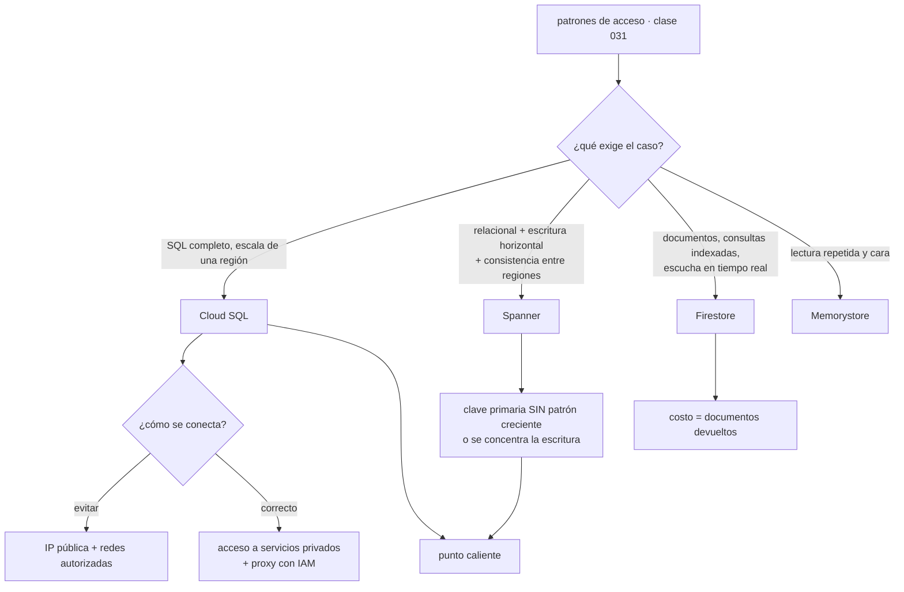

# 054 — Cloud SQL, Spanner, Firestore y Memorystore

> [← Clase anterior](../../part-04-gcp-core-platform/053-cloud-storage-clases-lifecycle-y-replicacion/README.md) · [Índice de la parte](../README.md) · [Clase siguiente →](../../part-04-gcp-core-platform/055-cloud-run-cloud-functions-y-api-gateway/README.md)

**Parte:** 04 — Google Cloud: plataforma esencial<br>
**Nivel:** intermedio · **Horas estimadas:** 4<br>
**Laboratorio:** `data` · **Estado:** `EXECUTABLE_CORE`

## 🎯 Propósito

Elegir motor de datos en Google Cloud con el criterio de la clase 031 —los patrones de acceso primero— y con tres precisiones que solo aparecen aquí: llegar a Cloud SQL por red privada exige reservar un rango de direcciones que nadie planificó, Spanner cuesta lo que cuesta y solo se justifica por lo que **únicamente** él da, y en Firestore el precio de una consulta es el **número de documentos que devuelve**, así que un panel mal escrito factura más que la base de datos entera.

## 📚 Resultados de aprendizaje

Al finalizar podrás:

1. **Conectar** a Cloud SQL por red privada sabiendo qué rango hay que reservar y por qué el proxy autenticado es la vía correcta.
2. **Decidir** entre Cloud SQL, Spanner y Firestore con una justificación de costo y de patrón de acceso, no de catálogo.
3. **Diseñar** una clave primaria que no concentre las escrituras, en el motor que sea.
4. **Calcular** el costo de una consulta de Firestore a partir del tamaño del resultado.
5. **Anticipar** las decisiones irreversibles de esta clase, empezando por el almacenamiento que crece y no baja.

## 🧩 Conceptos centrales

| Concepto | Comprensión verificable |
|---|---|
| `acceso a servicios privados` | Emparejamiento con una red gestionada por Google que permite alcanzar Cloud SQL por dirección interna. Consume un **rango reservado de tu espacio**, que hay que planificar en la clase 051. |
| `proxy de autenticación de Cloud SQL` | Conector que autentica con IAM y cifra el tránsito sin gestionar certificados ni listas de direcciones autorizadas. Es la vía recomendada y la que evita exponer una IP pública. |
| `punto caliente` | Concentración de escrituras en una porción del espacio de claves. Una clave primaria creciente —una marca de tiempo, un contador— lo garantiza, y limita el rendimiento por mucho que se añada capacidad. |
| `consistencia externa` | Garantía de Spanner: las transacciones se ven en un orden global coherente incluso entre regiones. Es lo único que no se puede construir encima de otro motor, y es lo que se está pagando. |
| `lectura de documento` | Unidad de facturación de Firestore. Una consulta que devuelve mil documentos cuesta mil lecturas: **el precio es el tamaño del resultado**, no la complejidad. |
| `crecimiento automático de almacenamiento` | Cloud SQL amplía el disco solo cuando hace falta y **no lo reduce nunca**. Un crecimiento accidental fija un costo mensual hasta que se migre la instancia. |

## 🧠 Modelo mental

Un proyecto de Google Cloud es la unidad práctica de API, cuota, IAM y facturación; la organización aporta la política heredable.

Aplicado a esta clase, separa siempre cuatro planos: **intención** (qué necesita el usuario),
**configuración** (qué declaramos), **estado observado** (qué existe de verdad) y
**evidencia** (cómo sabemos que cumple). Confundirlos produce diseños que se ven correctos
en un diagrama pero fallan al operar.

## 🗺️ Flujo de razonamiento



## 📖 Desarrollo

### 1. Llegar a Cloud SQL sin exponerlo: el rango que nadie reservó

Una instancia de Cloud SQL no vive en tu VPC. Vive en una red gestionada por Google, y eso deja tres formas de llegar a ella, con consecuencias muy distintas:

```text
IP pública + redes autorizadas   el tráfico sale de tu red y vuelve
                                 la lista de direcciones hay que mantenerla
                                 y una IP dinámica la rompe
acceso a servicios privados      emparejamiento con la red de Google
                                 dirección interna, tráfico que no sale
Private Service Connect          extremo con IP interna elegida por ti
                                 el modelo de la clase 051
```

La primera es la que sale por defecto y la que hay que evitar. La segunda es la habitual, y tiene un requisito que se descubre a mitad del despliegue: **consume un rango de tu espacio de direcciones**, que hay que reservar explícitamente.

```bash
$ gcloud compute addresses create rango-servicios-google \
    --global --purpose VPC_PEERING --prefix-length 20 \
    --network vpc-cloudshop --addresses 10.90.0.0
$ gcloud services vpc-peerings connect --service servicenetworking.googleapis.com \
    --ranges rango-servicios-google --network vpc-cloudshop
```

Un `/20` para empezar, y conviene que sea holgado: **el rango se comparte entre todos los servicios gestionados que usen este mecanismo** —Cloud SQL, Memorystore, algunas versiones de otros productos— y ampliarlo después obliga a recrear el emparejamiento. Es exactamente el tipo de reserva que la clase 051 pedía hacer al planificar la subred, junto con los rangos secundarios de Kubernetes.

Y sobre cómo se autentica la aplicación, la vía correcta elimina dos gestiones a la vez:

```bash
$ ./cloud-sql-proxy --private-ip --auto-iam-authn \
    cls-datos-prod-euw1-01:europe-west1:pg-pedidos
```

```text
--private-ip      usa la dirección interna, no la pública
--auto-iam-authn  autentica con la identidad de la carga (clase 050)
                  → no hay contraseña de base de datos que guardar ni rotar
```

La segunda línea cierra el círculo que empezó en la clase 026 y siguió en la 038: **el motor de datos deja de tener una credencial propia**. El usuario de base de datos se corresponde con una cuenta de servicio, y quitarle el acceso es quitarle un rol.

Dos comportamientos de la alta disponibilidad que hay que anticipar:

**La conmutación produce errores transitorios.** Una instancia con alta disponibilidad mantiene una réplica en espera en otra zona, y la conmutación tarda alrededor de un minuto. Durante ese minuto, las conexiones fallan. Es la **cuarta vez** que este hecho aparece en el programa —la clase 048 lo descubrió midiendo 1.104 peticiones perdidas con las alarmas en verde— y merece enunciarse como propiedad general: **en cualquier base de datos gestionada, la conmutación es parte del funcionamiento normal y el cliente tiene que reintentar**. Ninguna cantidad de infraestructura sustituye ese reintento.

**El mantenimiento reinicia.** A diferencia de Compute Engine, que migra en vivo (clase 052), los servicios gestionados de datos aplican mantenimiento con un reinicio dentro de una ventana declarada. Elegir esa ventana y declararla como parte del contrato del servicio es trabajo de diseño, no un trámite:

```bash
$ gcloud sql instances patch pg-pedidos \
    --maintenance-window-day SUN --maintenance-window-hour 3 \
    --maintenance-release-channel production
```

Y una puerta de un solo sentido con precio mensual: **el almacenamiento crece automáticamente y no se reduce nunca**. Una tabla de registro descontrolada que lleve el disco de 500 GB a 4 TB deja ese costo fijado hasta que alguien migre los datos a una instancia nueva. Conviene poner un límite al crecimiento automático y una alerta sobre el uso, en vez de confiar en que nada crezca.

### 2. Spanner: qué se está comprando y qué exige a cambio

Spanner es un motor relacional que escala horizontalmente la escritura y mantiene **consistencia externa** entre regiones. Es la única pieza del programa que ofrece las tres cosas a la vez, y la conversación honesta empieza por el precio:

```text
~0,90 USD por nodo y hora en configuración regional
→ ~657 USD por nodo y mes, más almacenamiento
una configuración de producción razonable son 3 nodos: ~1.970 USD/mes
```

Comparado con una instancia de Cloud SQL equivalente en capacidad para una carga de una región:

```text
Cloud SQL 4 vCPU / 16 GB con alta disponibilidad   ~320 USD/mes
Spanner, 3 nodos                                  ~1.970 USD/mes
```

Seis veces. Eso no descalifica a Spanner: sitúa la pregunta. **¿Qué hace este caso que solo Spanner resuelve?**

```text
sí lo justifica
  escritura que no cabe en una instancia vertical, con esquema relacional
  consistencia fuerte entre regiones, sin ventana de replicación
  crecimiento sin ventanas de mantenimiento ni fragmentación manual

no lo justifica
  "queremos que escale" sin una cifra que lo respalde
  volumen que cabe en una instancia grande de Cloud SQL
  necesidad de extensiones o funciones específicas de PostgreSQL
```

Y si se elige, exige una disciplina de esquema que no es opcional. **La clave primaria decide el rendimiento**, y una clave creciente lo destruye:

```sql
-- concentra TODAS las escrituras en la última división
CREATE TABLE pedidos (
  creado TIMESTAMP NOT NULL,
  pedido_id STRING(36) NOT NULL,
) PRIMARY KEY (creado, pedido_id);

-- reparte: el identificador aleatorio distribuye por el espacio de claves
CREATE TABLE pedidos (
  pedido_id STRING(36) NOT NULL,   -- UUID v4
  creado TIMESTAMP NOT NULL,
) PRIMARY KEY (pedido_id);
```

El mecanismo del fallo es el mismo que la clase 042 describió para Cosmos DB y la 031 para DynamoDB, con una diferencia importante: aquí **no hay un límite duro que produzca un error**. La escritura no falla; simplemente no pasa de un techo, y añadir nodos no lo mueve porque el trabajo sigue cayendo en la misma división. El síntoma es una gráfica de rendimiento plana con la CPU de un nodo alta y la de los demás baja.

Es la tercera aparición del mismo problema en el programa, con tres formas de manifestarse:

```text
DynamoDB    partición caliente: limitación
Cosmos DB   partición lógica llena: error 403, la escritura FALLA
Spanner     división caliente: techo de rendimiento, sin ningún error
```

La versión de Spanner es la más difícil de diagnosticar precisamente porque no falla nada.

Y la herramienta de localidad propia del motor, las **tablas intercaladas**, guarda las filas hijas físicamente junto a la padre:

```sql
CREATE TABLE lineas_pedido (
  pedido_id STRING(36) NOT NULL,
  linea_id INT64 NOT NULL,
) PRIMARY KEY (pedido_id, linea_id),
  INTERLEAVE IN PARENT pedidos ON DELETE CASCADE;
```

Leer un pedido con todas sus líneas pasa a ser una sola lectura local en vez de una unión distribuida. Es la misma idea que la clave de partición compartida de la clase 031, expresada en el esquema.

### 3. Firestore: el precio es el tamaño del resultado

Firestore es una base de datos de documentos con dos propiedades que definen cómo se diseña encima de ella.

**Toda consulta necesita un índice.** Los de un solo campo se crean solos; los compuestos se declaran. Y una consulta sin índice **no se ejecuta lentamente: falla**, con un mensaje que incluye el enlace para crear el que falta.

```text
FAILED_PRECONDITION: The query requires an index.
```

Eso es una buena noticia por la misma razón que lo era el fallo ruidoso de la clase 051: **no existe la consulta que funciona en desarrollo con mil documentos y tumba producción con diez millones**, porque no llega a ejecutarse sin índice. El coste de esta propiedad es que el conjunto de consultas posibles se declara por adelantado, así que un patrón de acceso nuevo exige un despliegue de índices.

**El precio es el número de documentos.** No hay unidades de solicitud ni horas de instancia:

```text
lecturas   ~0,03 USD por 100.000 documentos
escrituras ~0,09 USD por 100.000
borrados   ~0,01 USD por 100.000
```

La consecuencia práctica cambia el diseño de la aplicación más que cualquier ajuste de infraestructura:

```text
una consulta que devuelve 40.000 documentos cuesta 40.000 lecturas
aunque la aplicación solo muestre un total
```

Un panel que calcula «pedidos de hoy» leyendo todos los pedidos de hoy paga por cada uno, cada vez que alguien abre la página. La aritmética se hace grande deprisa:

```text
40.000 documentos por carga × 12.000 cargas al día × 30 días
= 14.400 millones de lecturas al mes
× 0,03 / 100.000 = 4.320 USD/mes por un contador
```

Las dos correcciones son de modelo de datos, no de configuración:

```text
1. consultas de agregación (COUNT, SUM) — se facturan por índice leído,
   no por documento devuelto
2. contadores materializados: un documento que la escritura actualiza
   y el panel lee de uno en uno
```

La segunda trae de vuelta el problema de los puntos calientes en su forma documental: **un documento admite del orden de una escritura por segundo de forma sostenida**. Un contador global actualizado por cada pedido se convierte en el cuello de botella de todo el sistema. La solución conocida es repartirlo:

```text
contador repartido en N documentos, elegido al azar al escribir
lectura = suma de los N
con N = 10, se admiten ~10 escrituras por segundo
```

Y los **modos** conviene aclararlos porque el nombre confunde: Firestore tiene modo nativo y modo Datastore, la elección se hace **al crear la base de datos** y no se cambia. El nativo es el que trae escuchas en tiempo real y bibliotecas para cliente móvil; el modo Datastore existe por compatibilidad. Para todo lo nuevo, nativo.

Sobre **Memorystore** basta con situarlo, porque las lecciones de la clase 042 se aplican sin cambios: nivel básico sin réplica y sin acuerdo de servicio —no para producción—, política de expulsión que debe considerar todas las claves, TTL siempre, y una sola conexión reutilizada por proceso. Lo único propio es que se conecta por el mismo mecanismo de acceso a servicios privados que Cloud SQL, así que consume del mismo rango reservado.

### 4. Elegir con una tabla y defenderlo con un número

La discusión sobre qué motor usar se repite en cada equipo hasta que alguien la escribe. Escrita, cabe aquí:

| Pregunta | Cloud SQL | Spanner | Firestore |
|---|---|---|---|
| ¿SQL completo y extensiones? | **Sí** | Subconjunto | No |
| ¿Transacciones entre entidades? | Sí | **Sí, entre regiones** | Sí, acotadas |
| ¿Escritura que escala horizontalmente? | No | **Sí** | Sí |
| ¿Consultas no previstas? | Sí | Sí | **No: hacen falta índices** |
| ¿Escucha en tiempo real? | No | No | **Sí** |
| Se paga por | Instancia y hora | Nodo y hora | **Documento** |
| Costo de partida | ~320 USD/mes | ~1.970 USD/mes | Casi cero |

La última fila engaña si se lee sola. Firestore empieza casi gratis y **su costo crece con el uso de la aplicación**, no con el tamaño de los datos: una aplicación con pocos datos y muchas lecturas puede costar más que una instancia de Cloud SQL con terabytes. Al revés, Cloud SQL cobra la instancia esté ociosa o no.

La forma defendible de decidir es estimar el costo de la carga real en los candidatos, con las cifras que se conocen:

```text
para CloudShop, catálogo con 4M de productos y 30M de lecturas al mes:
  Cloud SQL 4 vCPU con alta disponibilidad          ~320 USD/mes
  Firestore: 30M lecturas × 0,03/100.000              ~9 USD/mes
              + escrituras y almacenamiento            ~40 USD/mes
  → Firestore, con diferencia

para pedidos, con transacciones entre pedido, stock y pago:
  Firestore obliga a rediseñar la transacción
  Cloud SQL lo resuelve sin cambiar el modelo
  → Cloud SQL
```

Ese ejercicio de dos párrafos evita la discusión de dos semanas, y deja escrito por qué. Lo que hay que exigir a cualquier propuesta es exactamente eso: **una cifra por candidato para la carga real**, no una preferencia.

Y las tres decisiones de esta clase que no se deshacen editando una configuración, que conviene señalar antes de tomarlas:

```text
1. la clave primaria de una tabla de Spanner
   cambiarla es crear otra tabla y migrar
2. el modo de Firestore, nativo o Datastore
   se elige al crear la base de datos
3. el almacenamiento de Cloud SQL, que crece y no baja
   revertirlo es volcar y restaurar en una instancia nueva
```

Las tres tienen la misma forma que las de la clase 042 y la misma respuesta: se toman con la evidencia delante, se documentan como decisión con su alternativa descartada, y se protegen con un límite o una alerta que avise antes de que sea tarde.

### 5. Diagnosticar por el límite que no es la CPU

La clase 042 cerró con una afirmación que aquí se confirma con otros tres motores: **el recurso que se agota primero casi nunca es la CPU**, y el panel por defecto muestra la CPU.

Lo que hay que mirar en cada uno:

```text
Cloud SQL
  conexiones activas frente al máximo    un agotamiento de conexiones
                                          parece lentitud del motor
  retraso de la réplica de lectura        informes leyendo datos viejos
  IOPS del disco                          ligadas al TAMAÑO del disco,
                                          igual que en la clase 052
  espera de bloqueos                      una transacción larga bloquea a todas

Spanner
  utilización de CPU POR DIVISIÓN         la media engaña; el punto caliente
                                          es una división al 100 %
  latencia por operación                  y su percentil, no la media

Firestore
  lecturas por operación                  el indicador de costo y de diseño
  contención en documentos                escrituras al mismo documento
```

La fila de las IOPS de Cloud SQL merece subrayarse porque es la cuarta aparición del mismo patrón: **el rendimiento del disco depende del tamaño del disco**, así que una instancia con un disco pequeño tiene un techo de E/S bajo aunque le sobre CPU. Ampliar el disco lo sube — y como el almacenamiento no baja, esa ampliación es permanente.

El orden de diagnóstico que sirve para los tres, y que ya es el mismo de las partes 02 y 03:

```text
1. ¿qué límite está al 100 %?   conexiones, E/S, bloqueos, una división
2. ¿desde cuándo?               percentil de latencia en serie temporal
3. ¿qué cambió en esa ventana?  despliegue, esquema, índice, volumen
4. ¿qué consulta concreta?      Query Insights o el registro de consultas lentas
```

Y una recomendación de operación que evita la mitad de los incidentes de esta clase: **medir el costo de las consultas en el mismo sitio donde se mide su latencia**. En Firestore eso significa registrar cuántos documentos devolvió cada consulta; en Cloud SQL, cuántas filas examinó frente a cuántas devolvió. Las dos cifras detectan el mismo problema —una consulta que lee mucho para devolver poco— y lo detectan el día del despliegue en lugar de en la factura del mes siguiente. Es el mismo principio de la cabecera de costo por consulta de la clase 042: **lo que tiene número se discute; lo que no, se opina**.

## 🔬 Ejemplo trabajado

**CloudShop reparte su capa de datos en Google Cloud. La decisión inicial es razonable, el despliegue falla por una razón de red, y después aparecen cuatro problemas de los cuales dos ya se habían visto en otras plataformas.**

Decisión inicial, documentada con cifras:

```text
pedidos      Cloud SQL PostgreSQL, alta disponibilidad   transacciones entre entidades
catálogo     Firestore modo nativo                       30M lecturas/mes, sin uniones
sesiones     Memorystore Redis estándar                   caché con TTL
inventario   pendiente de decidir                         se propone Spanner
```

**Incidente 1 — la aplicación no puede conectar, y la solución rápida saca el tráfico de la VPC.**

```bash
$ gcloud sql instances describe pg-pedidos --format="value(ipAddresses[].type)"
PRIMARY
```

Solo IP pública. Para conectar en privado hacía falta acceso a servicios privados, y este exige un rango reservado que no estaba en el plan de direcciones de la clase 051. La solución de urgencia fue autorizar el rango de salida del NAT, lo que significaba que el tráfico salía de la red y volvía.

```text                                        antes             después
camino del tráfico              sale por NAT y vuelve   dirección interna
rango reservado para servicios       ninguno            10.90.0.0/20
autenticación                     contraseña en secreto  IAM con el proxy
contraseñas de base de datos            2                    0
IP pública de la instancia            activa             desactivada
```

Y la prueba negativa:

```bash
$ psql "host=34.78.x.x dbname=pedidos" -c "select 1"
psql: error: connection to server ... failed: Connection timed out            ✓
```

**Incidente 2 — la conmutación de alta disponibilidad, por cuarta vez en el programa.**

```text
simulacro de conmutación
  duración                        62 s
  errores devueltos al cliente    847
  pedidos no registrados          31
```

El mismo hallazgo de la clase 048, con otro motor y otros códigos de error. El equipo ya tenía la corrección escrita del capstone anterior y la aplicó directamente:

```text                                antes        después
reintento de errores transitorios       no            sí
tiempo de espera de conexión        30 s (largo)   5 s + reintento
errores en la conmutación repetida     847             0
```

Es la primera vez en el programa que un problema conocido se corrige **antes** de causar daño en la plataforma nueva. Ese es el valor concreto del contrato portable de la clase 048.

**Incidente 3 — el disco que creció a 4 TB y no baja.**

Una tabla de auditoría sin política de retención creció durante siete semanas.

```bash
$ gcloud sql instances describe pg-pedidos \
    --format="value(settings.dataDiskSizeGb,settings.storageAutoResize)"
4096   True
$ psql -c "SELECT pg_size_pretty(pg_total_relation_size('auditoria'))"
3312 GB
```

Se purgó la tabla y el disco siguió en 4 TB, porque el crecimiento automático no se revierte.

```text                                antes            después
disco                                4.096 GB      500 GB (instancia nueva)
costo mensual del almacenamiento      ~697 USD         ~85 USD
límite de crecimiento automático      ninguno          800 GB
alerta de uso de disco                ninguna          > 70 %
retención de la tabla de auditoría    ninguna     90 días, exportada a
                                                  Cloud Storage (clase 053)
migración necesaria                      —        volcado y restauración, 4 h
```

Seiscientos doce dólares al mes y cuatro horas de migración por un límite que se configura en un minuto.

**Incidente 4 — Spanner sí, pero no como se propuso.**

La propuesta era «inventario en Spanner porque escala». La evaluación con cifras:

```text
volumen de inventario                    18 GB
escrituras en el pico                 1.400 por segundo
requisito real          stock coherente entre tres regiones,
                        sin vender dos veces la última unidad
```

El volumen cabía en Cloud SQL de sobra; lo que no cabía era el requisito de consistencia entre regiones sin ventana de replicación. **Eso sí es lo que solo Spanner da**, y quedó escrito así en la decisión.

Pero la primera implementación no llegaba a 1.200 escrituras por segundo con tres nodos:

```sql
PRIMARY KEY (actualizado, sku)   -- marca de tiempo primero
```

```text
utilización media de CPU        38 %
utilización de la división caliente   99 %
```

Ninguna escritura falló: simplemente había un techo. Es la tercera versión del mismo problema del programa y la más difícil de ver, porque no produce ningún error.

```text                                antes              después
clave primaria               (actualizado, sku)    (sku)  — reparte por hash
tablas relacionadas             tablas aparte      intercaladas en el padre
escrituras por segundo             1.180              6.400
nodos                                3                  3
lectura de un SKU con su historial  2 consultas    1 lectura local
```

El rendimiento se multiplicó por cinco **sin añadir capacidad**. Es la misma lección de la clase 042 con otro motor: el precio de un modelo de datos equivocado no se paga con infraestructura.

**Incidente 5 — un panel que costaba más que la base de datos.**

```text
factura de Firestore, mes 2
  lecturas   14.380 millones     4.314 USD
  escrituras     41 millones        37 USD
  almacenamiento                    12 USD
```

El panel de operaciones cargaba «pedidos de hoy» leyendo todos los documentos del día para contarlos, en cada carga de página.

```text                                    antes              después
cálculo del total                  leer 40.000 docs   consulta de agregación
contador de pedidos                     —            documento repartido en 10
lecturas mensuales                14.380 millones     62 millones
costo mensual de Firestore           4.363 USD          31 USD
```

Y se añadió la medida que evita la repetición: **el número de documentos devueltos se registra en cada consulta**, junto a su latencia, y aparece en el mismo panel.

**Resumen de la capa de datos:**

```text                                          antes         después
camino a Cloud SQL                        público          privado
contraseñas de base de datos                  2               0
errores en conmutación de alta disponibilidad 847             0
almacenamiento de Cloud SQL                4.096 GB        500 GB
escrituras por segundo en Spanner           1.180           6.400
lecturas mensuales de Firestore        14.380 M            62 M
costo mensual de la capa de datos        7.190 USD       2.470 USD
```

**La lección que esta clase traslada al resto de la parte 04**: de los cinco problemas, dos eran conocidos —la conmutación que exige reintento y la clave que concentra escrituras— y uno de ellos se corrigió antes de causar daño porque estaba escrito en el contrato de la clase 048. Los otros tres eran propios de la plataforma, y los tres tenían la misma forma: **un valor por defecto cómodo que fija un costo o un límite difícil de revertir**. La IP pública, el crecimiento automático de disco y el precio por documento no fallan; simplemente cobran.

## 🧪 Laboratorio guiado

Ejecuta desde la raíz:

```bash
python classes/part-04-gcp-core-platform/054-cloud-sql-spanner-firestore-y-memorystore/lab.py
```

El laboratorio selecciona el motor de práctica **`data`** y produce
`lab_result.json`. El escenario, sus comprobaciones y el artefacto esperado corresponden a
esta clase; no requiere credenciales y deja explícito qué debe revalidarse en un sandbox real.

1. Lee `exercise.steps` y formula una predicción antes de ejecutar.
2. Ejecuta la práctica y verifica todos los elementos de `checks`.
3. Provoca el caso de `negative_test` y explica la señal observada.
4. Materializa `matriz-datos-gcp` en `evidence/` usando la plantilla indicada.
5. Para proveedor real, sigue `sandbox.requires`, registra costo y ejecuta `destroy`.

### Evidencia esperada

El artefacto principal es un modelo de datos ligado a patrones de acceso. Además, la entrega debe incluir el comando ejecutado,
la salida estructurada y una conclusión que no exceda lo observado.

## 🏆 Reto verificable

Construye **`matriz-datos-gcp`** para el caso CloudShop. Incluye una alternativa descartada,
un supuesto que pueda falsarse, una prueba de fallo y una decisión de rollback.

## ✅ Criterio de aceptación

- [ ] `lab.py` termina con código 0 y genera JSON válido.
- [ ] La entrega conecta al menos tres requisitos con mecanismos verificables.
- [ ] Existe una prueba positiva y una prueba negativa con evidencia.
- [ ] Seguridad, costo y operación aparecen como decisiones, no como anexos.
- [ ] Se declara una limitación y una condición que obligaría a revisar el diseño.
- [ ] Otra persona puede repetir el recorrido sin conocimiento tácito.

## ⚠️ Errores frecuentes

| Síntoma | Causa probable | Corrección |
|---|---|---|
| La aplicación no puede conectar a Cloud SQL por dirección interna | El acceso a servicios privados exige un rango reservado del propio espacio de direcciones | Reserva un rango holgado al planificar la red y conecta con el proxy autenticado por IAM, sin IP pública. |
| Se purga una tabla enorme y el costo de almacenamiento no baja | El crecimiento automático de Cloud SQL amplía el disco y nunca lo reduce | Pon un límite al crecimiento y una alerta de uso; revertir exige volcar y restaurar en una instancia nueva. |
| Spanner no supera un techo de escrituras pese a tener nodos libres | La clave primaria es creciente y concentra las escrituras en una división | Usa una clave que reparta —identificador aleatorio o secuencia invertida— e intercala las tablas hijas. |
| La factura de Firestore es mayor que la de la base de datos relacional | El precio es el número de documentos devueltos y un panel los leía todos para contar | Usa consultas de agregación o contadores materializados repartidos, y registra los documentos devueltos junto a la latencia. |
| Una consulta nueva falla en producción con `FAILED_PRECONDITION` | Firestore exige un índice para cada consulta y el compuesto no estaba declarado | Declara los índices como parte del despliegue; el fallo es ruidoso y es preferible a una consulta que degrada en silencio. |
| Se pierden peticiones durante un mantenimiento planificado | Los servicios gestionados de datos reinician en su ventana, a diferencia de la migración en vivo de Compute Engine | Declara la ventana, reintenta los errores transitorios y prueba la conmutación como parte del simulacro. |

## 🛡️ Seguridad, ética y costo

Trabaja con cuentas propias o sandboxes autorizados. No publiques secretos, identificadores
reales ni datos personales. Antes de crear recursos pagos define presupuesto, etiquetas y
comando de destrucción; después verifica que no queden recursos huérfanos. Los ejemplos
locales enseñan contratos, pero no certifican cumplimiento ni disponibilidad de producción.

## ❓ Preguntas de comprobación

1. ¿Qué hay que reservar para llegar a Cloud SQL por red privada, y en qué clase debía haberse planificado?
2. ¿Qué exige un caso para justificar el sobrecoste de Spanner frente a Cloud SQL?
3. ¿Cómo se manifiesta un punto caliente en Spanner y por qué es más difícil de diagnosticar que en Cosmos DB?
4. Calcula el costo mensual de un panel que lee 25.000 documentos y se carga 8.000 veces al día.
5. ¿Cuál es la cuarta aparición en el programa del problema de los errores transitorios, y qué lo corrige?

## 🔗 Referencias

- Google Cloud (2025). *Configure private IP for Cloud SQL* — acceso a servicios privados y rango reservado. <https://cloud.google.com/sql/docs/postgres/configure-private-ip>
- Google Cloud (2025). *About the Cloud SQL Auth Proxy* — autenticación con IAM y conexión cifrada. <https://cloud.google.com/sql/docs/postgres/sql-proxy>
- Google Cloud (2025). *Schema design best practices in Spanner* — claves primarias, puntos calientes y tablas intercaladas. <https://cloud.google.com/spanner/docs/schema-design>
- Google Cloud (2025). *Understand Firestore billing* — lecturas, escrituras y costo de las consultas. <https://cloud.google.com/firestore/docs/billing-example>
- Google Cloud (2025). *Distributed counters in Firestore* — límite de escritura por documento y contadores repartidos. <https://cloud.google.com/firestore/docs/solutions/counters>
- Documentación oficial vigente del servicio implementado; registra URL y fecha de consulta.

---

> [Evaluación](assessment.md) · [Contrato de clase](lesson.yaml) · [Índice de la parte](../README.md)
