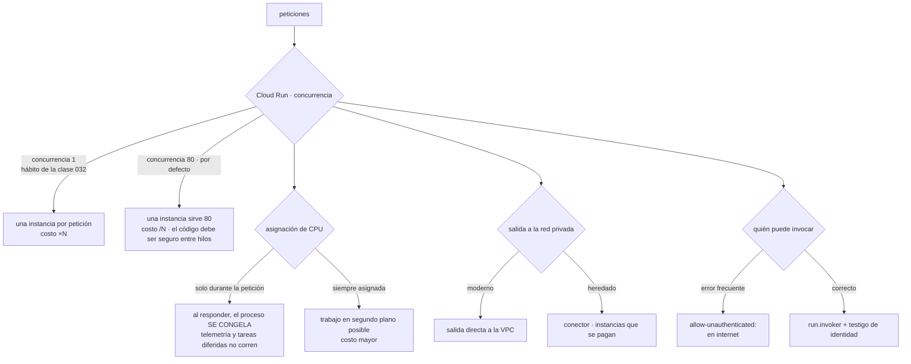

# 055 — Cloud Run, Cloud Functions y API Gateway

> [← 054 · Cloud SQL, Spanner, Firestore y Memorystore](../../part-04-gcp-core-platform/054-cloud-sql-spanner-firestore-y-memorystore/README.md) · [Índice de la parte](../README.md) · [056 · Pub/Sub, Cloud Tasks y Workflows →](../../part-04-gcp-core-platform/056-pub-sub-cloud-tasks-y-workflows/README.md)

**Parte:** 04 — Google Cloud: plataforma esencial<br>
**Nivel:** intermedio · **Horas estimadas:** 4<br>
**Laboratorio:** `serverless` · **Estado:** `EXECUTABLE_CORE`

## 🎯 Propósito

Ejecutar aplicaciones sin gestionar servidores en Google Cloud, donde la pieza central se comporta de una forma que rompe el hábito adquirido en las clases 032 y 043: **una instancia de Cloud Run atiende muchas peticiones a la vez**. Esa sola propiedad cambia el costo por un factor cercano a diez, cambia lo que el código puede suponer sobre su propio aislamiento, y hace que el ajuste por defecto —la CPU solo se asigna durante la petición— produzca el fallo más desconcertante de la clase: trabajo que se planifica y nunca se ejecuta.

## 📚 Resultados de aprendizaje

Al finalizar podrás:

1. **Explicar** el efecto de la concurrencia por instancia sobre el costo y sobre los requisitos del código.
2. **Diagnosticar** por qué desaparecen registros, métricas o tareas en segundo plano según la asignación de CPU.
3. **Desplegar** revisiones con reparto de tráfico y una URL propia para probar antes de dirigir usuarios.
4. **Autenticar** llamadas entre servicios con testigos de identidad en vez de dejarlos públicos.
5. **Elegir** entre salida directa a la VPC y conector, y entre servicio, trabajo y pasarela de API.

## 🧩 Conceptos centrales

| Concepto | Comprensión verificable |
|---|---|
| `concurrencia por instancia` | Número de peticiones que una misma instancia atiende a la vez, 80 por defecto. Es lo que separa el modelo de Cloud Run del de una función por petición, y lo que divide el costo. |
| `asignación de CPU` | Por defecto **solo durante la petición**. Fuera de ella el proceso está congelado: lo que se programó para «después de responder» no se ejecuta hasta la petición siguiente, si la hay. |
| `instancias mínimas` | Instancias mantenidas vivas para evitar el arranque en frío. Convierten la latencia del arranque en un costo fijo, con el mismo criterio de la clase 032. |
| `revisión con etiqueta` | Versión inmutable con URL propia. Permite probar una revisión con tráfico real dirigido a mano antes de asignarle un porcentaje del tráfico general. |
| `testigo de identidad` | Credencial que un servicio presenta a otro para demostrar quién es. Con `roles/run.invoker`, sustituye a dejar el servicio abierto a internet. |
| `trabajo de Cloud Run` | Ejecución por lotes con tareas paralelas y reintentos, sin servidor HTTP. Es la respuesta al proceso largo que en la clase 043 chocaba con un tope de diez minutos. |

## 🧠 Modelo mental

Un proyecto de Google Cloud es la unidad práctica de API, cuota, IAM y facturación; la organización aporta la política heredable.

Aplicado a esta clase, separa siempre cuatro planos: **intención** (qué necesita el usuario),
**configuración** (qué declaramos), **estado observado** (qué existe de verdad) y
**evidencia** (cómo sabemos que cumple). Confundirlos produce diseños que se ven correctos
en un diagrama pero fallan al operar.

## 🗺️ Flujo de razonamiento



## 📖 Desarrollo

### 1. Una instancia atiende ochenta peticiones, y eso cambia la aritmética

La clase 032 estableció que en serverless la concurrencia es el recurso que se agota, con un modelo donde **cada petición ocupa un entorno de ejecución**. La clase 043 mantuvo esa forma. Cloud Run funciona al revés:

```text
modelo de función por petición   1 petición  → 1 entorno ocupado
Cloud Run                         N peticiones → 1 instancia, hasta la concurrencia
```

La consecuencia inmediata es de costo, y es grande. Con 10 millones de peticiones al mes de 200 ms, 1 vCPU y 512 MiB:

```text
concurrencia 1
  10.000.000 × 0,2 s = 2.000.000 vCPU-s × 0,000024 =  48,00 USD
  memoria                                            +  2,50
  peticiones  10 M × 0,40/millón                     +  4,00
                                                     ─────────
                                                       54,50 USD/mes

concurrencia 80 (con empaquetado imperfecto y algo de tiempo ocioso)
                                                       ~8,90 USD/mes
```

Seis veces menos por un parámetro. Y el error que produce la cifra alta es exactamente el que comete quien llega de las clases 032 o 043: poner la concurrencia a 1 «para que cada petición esté aislada», que es como funcionaba allí.

Pero el aislamiento que se pierde es real y hay que entenderlo, porque la concurrencia impone dos requisitos al código:

```text
1. tiene que ser seguro entre peticiones simultáneas
   una variable global mutable la comparten 80 peticiones a la vez
2. su consumo de memoria y de conexiones se multiplica por la concurrencia
   80 peticiones × una conexión a la base de datos cada una = 80 conexiones
   por instancia
```

La segunda es la que produce el incidente sutil: un servicio con 20 instancias y concurrencia 80 puede abrir 1.600 conexiones a una base de datos que admite 200. La corrección es un grupo de conexiones acotado **por instancia**, dimensionado como `máximo de conexiones / instancias máximas`, y no como «una por petición».

La primera produce algo peor: si un objeto global guarda estado de la petición en curso —un cliente con una cabecera de usuario, un contexto que se reasigna—, dos peticiones simultáneas se pisan y **un usuario ve datos de otro**. No hay error, no hay traza: hay una respuesta incorrecta. Es el tipo de fallo que aparece solo bajo carga y desaparece al reproducirlo.

La forma de elegir el valor no es dejar el que viene:

```text
servicio con trabajo ligado a E/S (espera a la base de datos, a otra API)
  → concurrencia alta: la instancia está esperando, no calculando
servicio con trabajo intensivo de CPU (imágenes, cifrado, compresión)
  → concurrencia baja: las peticiones compiten por el mismo núcleo
servicio con memoria proporcional a la petición
  → concurrencia limitada por la memoria de la instancia
```

Y se comprueba midiendo, no razonando: se sube la concurrencia y se observa el percentil 95. Cuando empieza a subir, se ha pasado el punto donde las peticiones compiten.

### 2. La CPU solo durante la petición: el trabajo que nunca se ejecuta

Este es el fallo más desconcertante de la clase, porque no produce ningún error y desaparece cuando se investiga.

Por defecto, Cloud Run asigna CPU **únicamente mientras se procesa una petición**. En cuanto el servicio responde, el proceso se congela: sigue en memoria y no ejecuta nada.

```text
recibe petición  → CPU asignada → procesa → responde → CPU RETIRADA
                                                        el proceso se congela
```

Todo lo que el código haga «después de responder» queda pendiente hasta la petición siguiente:

```text
volcado de telemetría por lotes      los registros no aparecen, o aparecen tarde
                                     y atribuidos a otra petición
métricas acumuladas en memoria       se pierden si la instancia se retira
tareas diferidas tras responder      no se ejecutan
mantenimiento del grupo de conexiones no se ejecuta: conexiones muertas
reintentos programados               no se ejecutan
```

El síntoma que llega al equipo suele ser «faltan registros» o «la última petición de cada rato falla con conexión cerrada», y ninguno de los dos apunta a la causa.

Hay dos respuestas, y la elección tiene precio:

```bash
# opción A: hacer el trabajo ANTES de responder
#   correcto, y añade latencia a la petición

# opción B: CPU siempre asignada
$ gcloud run deploy svc-tienda --no-cpu-throttling --min-instances 1
```

La opción B cobra la CPU también fuera de la petición, a una tarifa menor, y es la única que permite trabajo real en segundo plano. Es obligatoria si el servicio mantiene una conexión persistente, consume de una suscripción o procesa en un hilo propio.

La regla de decisión, corta:

```text
servicio HTTP puro, sin nada que hacer entre peticiones   por defecto
cualquier cosa que deba ocurrir sin una petición en curso  CPU siempre asignada
```

Y sobre el **arranque en frío**, el método de la clase 032 se aplica sin cambios —comparar con el percentil del SLO, no con la media— y las palancas aquí son tres:

```bash
$ gcloud run deploy svc-tienda \
    --min-instances 2 \            # instancias vivas: latencia → costo fijo
    --cpu-boost \                  # más CPU durante el arranque
    --execution-environment gen2
```

La imagen del contenedor también pesa: una imagen de 900 MB arranca claramente más despacio que una de 80 MB, y esa es una optimización que no cuesta dinero, solo un `Dockerfile` con varias etapas.

Y un tercer modo de ejecución que resuelve el problema con el que chocó la clase 043 —el proceso de catorce minutos contra un tope de diez—: los **trabajos** de Cloud Run.

```bash
$ gcloud run jobs create cierre-mensual --image $IMAGEN \
    --tasks 12 --parallelism 4 --max-retries 3 --task-timeout 3600
$ gcloud run jobs execute cierre-mensual --wait
```

No hay servidor HTTP, hay tareas con índice, paralelismo, reintentos y un tiempo límite de horas. Es la forma correcta de ejecutar un cierre, una migración o una reindexación, y evita la deformación de convertir un proceso por lotes en un servicio web que se llama a sí mismo.

### 3. Revisiones, reparto de tráfico y quién puede invocar

Cada despliegue crea una **revisión inmutable**, y el tráfico se dirige por porcentaje o por etiqueta:

```bash
$ gcloud run deploy svc-tienda --image $IMAGEN --tag rc8 --no-traffic
# → https://rc8---svc-tienda-xxxx.a.run.app  : URL propia, 0 % del tráfico

$ gcloud run services update-traffic svc-tienda --to-tags rc8=10
$ gcloud run services update-traffic svc-tienda --to-revisions svc-tienda-rc8=100
$ gcloud run services update-traffic svc-tienda --to-revisions svc-tienda-rc7=100  # vuelta atrás
```

La etiqueta con `--no-traffic` es la pieza que faltaba en los espacios de la clase 043: una URL real, con tráfico real dirigido a mano, **sin que ningún usuario llegue a ella por accidente**. El canario posterior por porcentaje es el mismo mecanismo de las revisiones de Container Apps, y con la misma condición: **hace falta una señal por revisión** para que repartir 90/10 signifique algo. La clase 057 monta esa parte.

La vuelta atrás es un cambio de porcentaje, así que dura segundos. Es la misma propiedad que hacía valiosos los espacios de App Service, sin el problema de los ajustes que viajan.

Y ahora la decisión de seguridad que más veces está mal en despliegues nuevos:

```bash
$ gcloud run deploy svc-pedidos --allow-unauthenticated
```

Esa opción publica el servicio **en internet**, sin autenticación, con una URL adivinable por su patrón. Es correcta para el frontal público y es un error para todo lo demás: un servicio interno desplegado así es una API abierta que ningún firewall protege, porque no está en la VPC.

El patrón correcto para llamadas entre servicios:

```bash
$ gcloud run deploy svc-pedidos --no-allow-unauthenticated \
    --service-account sa-pedidos@cls-tienda-prod-euw1-01.iam.gserviceaccount.com
$ gcloud run services add-iam-policy-binding svc-pedidos \
    --member "serviceAccount:sa-tienda@cls-tienda-prod-euw1-01.iam.gserviceaccount.com" \
    --role roles/run.invoker
```

Y el llamante presenta un testigo de identidad obtenido de su propia cuenta de servicio, sin ninguna credencial almacenada:

```python
import google.auth.transport.requests, google.oauth2.id_token

destino = "https://svc-pedidos-xxxx.a.run.app"
testigo = google.oauth2.id_token.fetch_id_token(
    google.auth.transport.requests.Request(), destino)
respuesta = requests.post(f"{destino}/pedidos", json=datos,
                          headers={"Authorization": f"Bearer {testigo}"})
```

La prueba negativa correspondiente es de una línea y debería estar en el guion de verificación:

```bash
$ curl -s -o /dev/null -w '%{http_code}\n' https://svc-pedidos-xxxx.a.run.app/pedidos
403                                                                         ✓
```

Para la **salida hacia la red privada** —alcanzar Cloud SQL o Memorystore de la clase 054— hay dos mecanismos y uno está obsoleto:

```text
salida directa a la VPC    la instancia obtiene una dirección de tu subred
                           sin infraestructura intermedia que pagar, escala mejor
conector de acceso serverless  máquinas gestionadas que hacen de puente
                           se pagan por hora y son un cuello de botella propio
```

```bash
$ gcloud run deploy svc-pedidos --network vpc-cloudshop \
    --subnet snet-serverless-euw1 --vpc-egress private-ranges-only
```

`private-ranges-only` envía por la VPC solo lo dirigido a rangos privados y deja salir el resto por el camino de siempre; `all-traffic` lo manda todo, que es lo que hace falta si la salida debe pasar por Cloud NAT para tener una dirección de origen estable. La subred necesita espacio suficiente: es otra reserva que la clase 051 debía haber previsto.

### 4. Funciones y pasarelas: menos productos de los que parece

Dos aclaraciones ahorran una discusión de arquitectura entera.

**Las funciones de segunda generación son Cloud Run.** Se ejecutan sobre la misma plataforma, con el mismo modelo de concurrencia, la misma asignación de CPU y las mismas revisiones. Lo que cambia es el empaquetado: en vez de una imagen de contenedor se entrega código fuente y la plataforma construye la imagen.

```text
función         despliegas código; la plataforma construye
                disparadores integrados de eventos
servicio        despliegas una imagen; controlas el entorno completo
```

La consecuencia práctica es que **la elección es de empaquetado, no de capacidades**, y que todo lo aprendido sobre concurrencia y CPU se aplica igual a las dos. Y que migrar de una a otra es cambiar cómo se despliega, no rehacer la aplicación.

Los disparadores de eventos son la parte propia, y conectan con la clase 056:

```bash
$ gcloud functions deploy indexar-factura --gen2 --runtime python312 \
    --trigger-event-filters="type=google.cloud.storage.object.v1.finalized" \
    --trigger-event-filters="bucket=cls-facturas" \
    --run-service-account sa-indexador@cls-tienda-prod-euw1-01.iam.gserviceaccount.com
```

**La pasarela de API hace falta menos veces de las que se cree.** Hay tres productos y conviene situarlos antes de elegir:

| | Qué aporta | Cuándo |
|---|---|---|
| Balanceador global + Cloud Armor | Enrutamiento, TLS, WAF, CDN, una IP global | La mayoría de los casos |
| API Gateway | Contrato OpenAPI, claves de API, autenticación por API | Exponer API a terceros con contrato |
| Apigee | Gestión completa: monetización, portal, cuotas por cliente | Programa de API como producto |

La primera fila cubre lo que la mayoría de los equipos busca cuando dice «necesitamos una pasarela»: un punto de entrada, TLS, reglas de seguridad y reparto por ruta. Eso ya está montado desde la clase 052 y no añade un salto más en la ruta de la petición.

API Gateway aporta algo distinto y concreto: un **contrato declarado** que valida las peticiones y gestiona claves para consumidores externos. Si no hay terceros ni contrato que imponer, añade latencia y una pieza más que operar.

Y Apigee resuelve un problema de negocio —API como producto, con planes y facturación— cuyo precio solo se justifica si ese negocio existe.

La regla que evita el sobrediseño: **añade una pasarela cuando puedas nombrar la función concreta que hace y que no hace el balanceador**. Si no se puede nombrar, no hace falta.

### 5. Qué cuesta y qué se mide

El modelo de precio de Cloud Run tiene tres componentes y una decisión que los domina:

```text
CPU        ~0,000024 USD por vCPU-segundo mientras hay asignación
memoria    ~0,0000025 USD por GiB-segundo
peticiones ~0,40 USD por millón
```

Y la decisión que los domina es la concurrencia, porque divide los dos primeros. Las palancas, en orden de efecto:

```text
1. concurrencia            divide el costo por instancia-segundo
2. tamaño de la instancia  1 vCPU y 512 MiB suele bastar; medir antes de subir
3. instancias mínimas      cuestan cuando no hay tráfico: solo donde el SLO lo exige
4. asignación de CPU       «siempre» cuesta más: solo donde haga falta
5. tamaño de la imagen     no cuesta dinero directamente; acorta el arranque
```

Y una comparación honesta con lo construido en las clases 032 y 043, para el mismo servicio y el mismo volumen:

```text                                      costo mensual   arranque en frío
función por petición (clase 032)               ~54 USD           sí
plan de App Service con instancias fijas       ~124 USD          no
Cloud Run, concurrencia 80, sin mínimos          ~9 USD          sí
Cloud Run, concurrencia 80, 2 mínimas           ~38 USD          no
```

La última fila es la que suele elegirse en producción: elimina el arranque en frío y sigue costando menos de un tercio que un plan con instancias fijas. Y la tercera es la que hace que un entorno de pruebas o un servicio poco usado cueste prácticamente nada.

Lo que hay que medir, y que no es lo mismo que en las plataformas anteriores:

```text
utilización de la concurrencia   peticiones simultáneas frente al máximo
                                 si nunca se acerca, la concurrencia sobra
                                 y hay instancias de más
instancias activas               la curva que explica la factura
tiempo de arranque de instancia  el que decide si hacen falta mínimas
peticiones con arranque en frío  proporción, no media
conexiones abiertas por instancia el número que hay que multiplicar
                                 por el máximo de instancias
```

La última merece una alerta propia, porque su fallo no ocurre en el servicio sino en la base de datos, y llega justo en el pico: **el máximo de instancias multiplicado por las conexiones por instancia debe caber en el límite del motor**. Es una cuenta de una línea que casi nunca se hace y que la clase 054 dejó preparada.

```text
máximo de instancias (100) × conexiones por instancia (10) = 1.000
límite de la instancia de Cloud SQL                        =   200
→ el servicio puede tumbar su propia base de datos al escalar
```

La corrección es acotar las dos cifras a la vez —`--max-instances` y el tamaño del grupo de conexiones—, y no solo una.

## 🔬 Ejemplo trabajado

**CloudShop despliega su capa de aplicación en Cloud Run. La traducción desde las clases 032 y 043 funciona a la primera y cuesta seis veces de más; los cuatro problemas siguientes son consecuencias del modelo que nadie había tenido que considerar antes.**

Despliegue inicial, traducido literalmente:

```text
svc-tienda      concurrencia 1  · "para que cada petición esté aislada"
svc-pedidos     concurrencia 1  · --allow-unauthenticated
svc-informes    concurrencia 1  · proceso de cierre partido en trozos de 9 min
conector de acceso serverless para llegar a Cloud SQL
```

**Problema 1 — la factura del primer mes.**

```text                                    concurrencia 1    concurrencia 80
svc-tienda   (10,2 M peticiones)            54,80 USD          8,90 USD
svc-pedidos  (3,1 M)                        17,40 USD          3,20 USD
svc-informes (0,4 M)                         9,10 USD          2,10 USD
                                          ──────────         ─────────
                                            81,30 USD         14,20 USD
```

El cambio fue un parámetro. Y la comprobación de que la concurrencia elegida es correcta se hizo midiendo, no razonando:

```text
concurrencia   p95      instancias activas en el pico
     1        118 ms              210
    40        121 ms                7
    80        124 ms                4
   200        347 ms                2     ← aquí las peticiones ya compiten
```

Se fija en 80. El percentil apenas se mueve y las instancias caen de 210 a 4.

**Problema 2 — faltan registros y las conexiones mueren.**

Dos síntomas aparentemente sin relación:

```text
los registros de una petición aparecen atribuidos a la SIGUIENTE
la primera petición tras un rato de silencio falla con "connection reset"
```

Ambos tienen la misma causa: la CPU solo se asigna durante la petición, así que el volcado de telemetría por lotes y el mantenimiento del grupo de conexiones quedaban congelados hasta la petición siguiente.

```text                                      antes            después
asignación de CPU                    solo en petición   siempre asignada
instancias mínimas                          0                 1
volcado de telemetría                  por lotes      síncrono antes de responder
registros mal atribuidos                 ~7 %                0
fallos de primera petición              1 de 12              0
costo adicional                            —              +11 USD/mes
```

Once dólares al mes por eliminar dos clases de fallo que consumieron una semana de investigación entre los dos.

**Problema 3 — un cliente ve el pedido de otro.**

Un cliente reporta ver, durante un segundo, datos que no eran suyos. Ocurre menos de una vez cada diez mil peticiones y solo en horas punta.

```python
# el cliente HTTP era global y guardaba la cabecera de la petición en curso
cliente = ApiClient()

def manejar(peticion):
    cliente.headers["X-Usuario"] = peticion.usuario     # ← compartido entre 80
    return cliente.get("/perfil")
```

Con concurrencia 1 esto era correcto. Con concurrencia 80, ochenta peticiones comparten ese objeto y se pisan la cabecera.

```text                                antes              después
estado por petición              en objeto global   pasado como argumento
pruebas de concurrencia               ninguna       carga con 200 simultáneas
                                                    y verificación de aislamiento
incidencias reportadas                  3                  0
```

La medida que evita la repetición no es la corrección: es la **prueba de carga con verificación de aislamiento**, que comprueba que cada respuesta corresponde a su petición. Sin ella, el mismo defecto vuelve con el siguiente objeto global.

**Problema 4 — la API interna estaba en internet.**

```bash
$ curl -s -o /dev/null -w '%{http_code}\n' https://svc-pedidos-xxxx.a.run.app/pedidos
200
```

Desplegado con `--allow-unauthenticated`, sin ninguna red que lo protegiera, porque Cloud Run no está en la VPC.

```text                                      antes           después
servicios públicos                        3 de 3           1 de 3
autenticación entre servicios            ninguna     testigo de identidad
permiso de invocación                   allUsers      roles/run.invoker
                                                      a cuentas concretas
prueba negativa                            no        sí, 403 sin testigo
```

**Problema 5 — el conector y el cierre mensual.**

Dos correcciones menores con efecto medible:

```text                                      antes              después
salida a la red privada             conector (2 instancias)  salida directa
costo del conector                     ~74 USD/mes              0
cierre mensual                    7 llamadas HTTP encadenadas  trabajo de Cloud Run
                                   con estado en un bucket     12 tareas, 4 en paralelo
duración del cierre                      52 min                 14 min
fallos parciales sin reintento          sí, a mano          reintento automático
```

El cierre mensual era el proceso que en la clase 043 había obligado a usar Durable Functions por el tope de diez minutos. Aquí el mecanismo correcto existe de fábrica y además paraleliza.

**Resumen de la capa de aplicación:**

```text                                          antes         después
concurrencia por instancia                       1              80
instancias activas en el pico                   210               4
servicios expuestos a internet                 3 de 3          1 de 3
registros mal atribuidos                        ~7 %              0
incidencias de datos cruzados                     3               0
duración del cierre mensual                    52 min          14 min
costo mensual de la capa de aplicación        155 USD          64 USD
```

**La lección que esta clase traslada al resto de la parte 04**: los tres primeros problemas tienen la misma raíz y no la tenía ninguna plataforma anterior — **una instancia sirve a muchas peticiones a la vez, y el proceso se congela cuando no hay ninguna**. Ese modelo divide el costo por seis y exige del código dos propiedades que antes se podían ignorar: aislamiento entre peticiones simultáneas y ningún trabajo que dependa de ejecutarse «después». No es una configuración: es un contrato con la aplicación, y el único de los tres proveedores que lo pide de forma explícita.

## 🧪 Laboratorio guiado

Ejecuta desde la raíz:

```bash
python classes/part-04-gcp-core-platform/055-cloud-run-cloud-functions-y-api-gateway/lab.py
```

El laboratorio selecciona el motor de práctica **`serverless`** y produce
`lab_result.json`. El escenario, sus comprobaciones y el artefacto esperado corresponden a
esta clase; no requiere credenciales y deja explícito qué debe revalidarse en un sandbox real.

1. Lee `exercise.steps` y formula una predicción antes de ejecutar.
2. Ejecuta la práctica y verifica todos los elementos de `checks`.
3. Provoca el caso de `negative_test` y explica la señal observada.
4. Materializa `api-serverless-gcp` en `evidence/` usando la plantilla indicada.
5. Para proveedor real, sigue `sandbox.requires`, registra costo y ejecuta `destroy`.

### Evidencia esperada

El artefacto principal es una función con límites, reintentos e idempotencia. Además, la entrega debe incluir el comando ejecutado,
la salida estructurada y una conclusión que no exceda lo observado.

## 🏆 Reto verificable

Construye **`api-serverless-gcp`** para el caso CloudShop. Incluye una alternativa descartada,
un supuesto que pueda falsarse, una prueba de fallo y una decisión de rollback.

## ✅ Criterio de aceptación

- [ ] `lab.py` termina con código 0 y genera JSON válido.
- [ ] La entrega conecta al menos tres requisitos con mecanismos verificables.
- [ ] Existe una prueba positiva y una prueba negativa con evidencia.
- [ ] Seguridad, costo y operación aparecen como decisiones, no como anexos.
- [ ] Se declara una limitación y una condición que obligaría a revisar el diseño.
- [ ] Otra persona puede repetir el recorrido sin conocimiento tácito.

## ⚠️ Errores frecuentes

| Síntoma | Causa probable | Corrección |
|---|---|---|
| El costo por petición es varias veces mayor de lo esperado | La concurrencia se puso a 1 por costumbre del modelo de una función por petición | Sube la concurrencia midiendo el percentil 95: si no empeora, la instancia estaba desaprovechada. |
| Faltan registros o aparecen atribuidos a la petición siguiente | La CPU solo se asigna durante la petición y el volcado por lotes queda congelado | Vuelca antes de responder o activa la CPU siempre asignada; el trabajo en segundo plano exige lo segundo. |
| Bajo carga, una respuesta contiene datos de otra petición | Un objeto global mutable se comparte entre las peticiones simultáneas de la instancia | Pasa el estado por argumento y añade una prueba de carga que verifique el aislamiento entre respuestas. |
| Un servicio interno responde desde internet | Se desplegó con `--allow-unauthenticated` y Cloud Run no está dentro de la VPC | Despliega sin acceso anónimo, concede `roles/run.invoker` a las cuentas llamantes y verifica que sin testigo devuelve 403. |
| La base de datos agota sus conexiones cuando el servicio escala | Conexiones por instancia multiplicadas por el máximo de instancias supera el límite del motor | Acota `--max-instances` y el tamaño del grupo de conexiones a la vez, con la cuenta hecha explícitamente. |
| Un proceso por lotes se implementa como una cadena de llamadas HTTP con estado externo | Se arrastró la limitación de tiempo de una plataforma anterior | Usa un trabajo de Cloud Run con tareas, paralelismo y reintentos; el tiempo límite es de horas. |

## 🛡️ Seguridad, ética y costo

Trabaja con cuentas propias o sandboxes autorizados. No publiques secretos, identificadores
reales ni datos personales. Antes de crear recursos pagos define presupuesto, etiquetas y
comando de destrucción; después verifica que no queden recursos huérfanos. Los ejemplos
locales enseñan contratos, pero no certifican cumplimiento ni disponibilidad de producción.

## ❓ Preguntas de comprobación

1. ¿Cómo cambia el costo al pasar la concurrencia de 1 a 80, y qué dos requisitos impone eso al código?
2. ¿Qué deja de ejecutarse con la asignación de CPU por defecto, y qué dos síntomas produce?
3. ¿Cómo pruebas una revisión con tráfico real sin que ningún usuario llegue a ella?
4. ¿Por qué un servicio interno con `--allow-unauthenticated` no está protegido por ninguna regla de red?
5. Con 100 instancias máximas y 10 conexiones por instancia, ¿qué comprobación hay que hacer contra la base de datos?

## 🔗 Referencias

- Google Cloud (2025). *About instance concurrency in Cloud Run* — concurrencia, efecto en costo y requisitos del código. <https://cloud.google.com/run/docs/about-concurrency>
- Google Cloud (2025). *CPU allocation in Cloud Run* — CPU durante la petición frente a siempre asignada. <https://cloud.google.com/run/docs/configuring/cpu-allocation>
- Google Cloud (2025). *Rollbacks, gradual rollouts and traffic migration* — revisiones, etiquetas y reparto de tráfico. <https://cloud.google.com/run/docs/rollouts-rollbacks-traffic-migration>
- Google Cloud (2025). *Authenticating service-to-service* — testigos de identidad y `roles/run.invoker`. <https://cloud.google.com/run/docs/authenticating/service-to-service>
- Google Cloud (2025). *Cloud Run jobs overview* — tareas, paralelismo, reintentos y tiempos límite. <https://cloud.google.com/run/docs/create-jobs>
- Documentación oficial vigente del servicio implementado; registra URL y fecha de consulta.

---

> [Evaluación](assessment.md) · [Contrato de clase](lesson.yaml) · [Índice de la parte](../README.md)

| Anterior | Índice | Siguiente |
|---|---|---|
| [← 054 · Cloud SQL, Spanner, Firestore y Memorystore](../../part-04-gcp-core-platform/054-cloud-sql-spanner-firestore-y-memorystore/README.md) | [Parte 04](../README.md) · [Programa](../../README.md) | [056 · Pub/Sub, Cloud Tasks y Workflows →](../../part-04-gcp-core-platform/056-pub-sub-cloud-tasks-y-workflows/README.md) |
