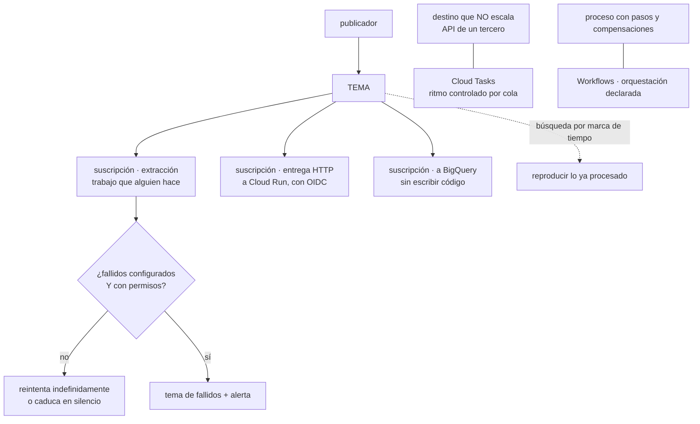

# 056 — Pub/Sub, Cloud Tasks y Workflows

> [← 055 · Cloud Run, Cloud Functions y API Gateway](../../part-04-gcp-core-platform/055-cloud-run-cloud-functions-y-api-gateway/README.md) · [Índice de la parte](../README.md) · [057 · Cloud Logging, Monitoring, Trace y Audit Logs →](../../part-04-gcp-core-platform/057-cloud-logging-monitoring-trace-y-audit-logs/README.md)

**Parte:** 04 — Google Cloud: plataforma esencial<br>
**Nivel:** intermedio · **Horas estimadas:** 4<br>
**Laboratorio:** `messaging` · **Estado:** `EXECUTABLE_CORE`

## 🎯 Propósito

Construir la columna asíncrona de Google Cloud, donde la pregunta que ordenó la clase 044 —¿el mensaje se consume o se observa?— ya no elige entre productos: **la responden las suscripciones de un mismo tema**. A cambio aparecen tres decisiones que allí no existían: qué tipo de suscripción, quién controla el ritmo de entrega hacia un destino que no escala, y qué significa exactamente la entrega «exactamente una vez» que esta plataforma ofrece y las anteriores no.

## 📚 Resultados de aprendizaje

Al finalizar podrás:

1. **Modelar** consumo y observación con temas y suscripciones en vez de con dos productos distintos.
2. **Configurar** una cola de mensajes fallidos que de verdad reciba mensajes, y demostrarlo.
3. **Elegir** entre Pub/Sub y Cloud Tasks a partir de quién debe controlar el ritmo de entrega.
4. **Explicar** qué garantiza la entrega exactamente una vez y qué sigue exigiendo idempotencia.
5. **Reproducir** un intervalo de mensajes ya procesados para reparar un daño posterior.

## 🧩 Conceptos centrales

| Concepto | Comprensión verificable |
|---|---|
| `tema y suscripción` | El tema recibe; **cada suscripción tiene su propia copia y su propio estado de confirmación**. Añadir un consumidor es añadir una suscripción, no otro producto. |
| `suscripción de extracción o de entrega` | La primera la consume el cliente; la segunda hace que Pub/Sub llame por HTTP a un extremo, autenticándose. La misma pieza cubre lo que en la clase 044 eran una cola y un enrutador. |
| `plazo de confirmación` | Tiempo reservado para procesar antes de reentregar. Las bibliotecas lo amplían solas **si el hilo puede ejecutarse**: es la tercera versión del mismo problema del programa. |
| `entrega exactamente una vez` | Garantía de que Pub/Sub no reentrega un mensaje ya confirmado dentro de una región. **No garantiza que el efecto se aplique una sola vez**: si el proceso muere tras aplicar y antes de confirmar, se repite. |
| `límite de ritmo de la cola` | Capacidad de Cloud Tasks para entregar como mucho N por segundo. Pub/Sub no tiene equivalente: entrega tan rápido como puede. |
| `búsqueda por marca de tiempo` | Reposicionar una suscripción en el pasado para volver a entregar lo ya procesado. Es lo que permite reparar un daño detectado tarde. |

## 🧠 Modelo mental

Un proyecto de Google Cloud es la unidad práctica de API, cuota, IAM y facturación; la organización aporta la política heredable.

Aplicado a esta clase, separa siempre cuatro planos: **intención** (qué necesita el usuario),
**configuración** (qué declaramos), **estado observado** (qué existe de verdad) y
**evidencia** (cómo sabemos que cumple). Confundirlos produce diseños que se ven correctos
en un diagrama pero fallan al operar.

## 🗺️ Flujo de razonamiento



## 📖 Desarrollo

### 1. Un producto, y la decisión se traslada a la suscripción

La clase 044 separaba tres servicios con una pregunta: si el mensaje se consume, Service Bus; si se observa, Event Hubs; si se enruta, Event Grid. Aquí hay **un tema** y la respuesta está en cuántas suscripciones tiene y de qué tipo:

```text
tema "pedidos"
  ├─ suscripción "facturacion"    extracción · su propio estado de confirmación
  ├─ suscripción "almacen"        extracción · su propio estado
  ├─ suscripción "notificar"      entrega HTTP a Cloud Run
  └─ suscripción "analitica"       escritura directa a BigQuery, sin código
```

Cada suscripción recibe **una copia** y avanza por su cuenta. Eso significa que «observar» —varios interesados leyendo lo mismo a su ritmo— y «consumir» —trabajo que alguien hace una vez— son la misma pieza usada de dos maneras, y que añadir un consumidor nuevo no obliga a elegir otro producto.

Los tipos de suscripción y cuándo usa cada uno:

| Tipo | Quién inicia | Encaja con |
|---|---|---|
| Extracción | El consumidor | Trabajo por lotes, control de ritmo propio, consumidores largos |
| Entrega HTTP | Pub/Sub | Cloud Run y funciones: el consumidor escala con la carga |
| A BigQuery | Pub/Sub | Analítica sin escribir ni operar un consumidor |
| A Cloud Storage | Pub/Sub | Archivo en bruto, como la captura de la clase 044 |

Las dos últimas merecen conocerse porque eliminan código: una suscripción a BigQuery sustituye a un consumidor que solo insertaba filas, con su despliegue, su vigilancia y sus fallos.

Y hay una diferencia que hay que anticipar respecto de la clase 044: una suscripción **creada hoy no recibe lo publicado ayer**. Es el mismo comportamiento de las suscripciones de un tema de Service Bus, y aquí tiene un remedio que allí no existía —la reproducción, que veremos más abajo— siempre que el tema tenga retención configurada.

```bash
$ gcloud pubsub topics create pedidos --message-retention-duration 7d
$ gcloud pubsub subscriptions create facturacion --topic pedidos \
    --ack-deadline 60 --retain-acked-messages --message-retention-duration 7d
```

Esa retención tiene costo de almacenamiento y es lo que hace posible reparar un error detectado tres días después. Sin ella, un mensaje confirmado desaparece y la única fuente es el sistema que lo originó.

### 2. La cola de fallidos que no recibe nada

Este es el fallo de configuración más frecuente de Pub/Sub y es completamente silencioso.

A diferencia de Service Bus, donde la subcola de fallidos **existe siempre** (clase 044), aquí hay que configurarla:

```bash
$ gcloud pubsub topics create pedidos-fallidos
$ gcloud pubsub subscriptions update facturacion \
    --dead-letter-topic pedidos-fallidos --max-delivery-attempts 5
```

Y ahí termina la mayoría de las configuraciones, que es donde empieza el problema: **Pub/Sub necesita permisos propios** para publicar en el tema de fallidos y para confirmar en la suscripción de origen. Sin ellos, no hay error visible; el mensaje simplemente **se reintenta indefinidamente** hasta caducar.

```bash
$ AGENTE="service-${NUM_PROYECTO}@gcp-sa-pubsub.iam.gserviceaccount.com"
$ gcloud pubsub topics add-iam-policy-binding pedidos-fallidos \
    --member "serviceAccount:$AGENTE" --role roles/pubsub.publisher
$ gcloud pubsub subscriptions add-iam-policy-binding facturacion \
    --member "serviceAccount:$AGENTE" --role roles/pubsub.subscriber
```

Y la prueba negativa, que es lo único que demuestra que funciona:

```bash
$ gcloud pubsub topics publish pedidos --message '{"roto": true}'
# el consumidor rechaza el mensaje cinco veces
$ gcloud pubsub subscriptions pull fallidos-sub --limit 1 --auto-ack \
    --format="value(message.data)" | base64 -d
{"roto": true}                                                              ✓
```

Sin esa comprobación, un equipo puede pasar meses creyendo que tiene una red de seguridad que no existe. Y el resto de la disciplina de la clase 044 se aplica igual, empezando por la alerta:

```text
mensajes en el tema de fallidos > 0 durante N minutos  →  aviso
edad del mensaje más antiguo sin confirmar > umbral    →  aviso
```

La segunda es la que detecta el sistema que dejó de trabajar sin caerse, que es el fallo silencioso que este programa ha encontrado ya en tres plataformas.

El **plazo de confirmación** repite el patrón del bloqueo de Service Bus, con los mismos números que importan:

```text
por defecto           10 s
máximo por mensaje   600 s
las bibliotecas lo amplían solas mientras el mensaje se procesa
  → SI el hilo puede ejecutarse
```

Y con **suscripción de entrega HTTP** hay una precisión propia: el plazo de confirmación **es** el tiempo que Pub/Sub espera la respuesta HTTP. Un manejador en Cloud Run que tarda 90 segundos con un plazo de 60 recibe una reentrega mientras sigue trabajando — el mismo escenario que en la clase 044 cobró dos pedidos duplicados. La corrección es la misma que allí y no ha cambiado en tres plataformas: **el manejador registra la intención y devuelve; el trabajo largo ocurre fuera**.

Y el **control de flujo** del cliente, que en las plataformas anteriores no era tan visible:

```python
from google.cloud import pubsub_v1

flujo = pubsub_v1.types.FlowControl(max_messages=100, max_bytes=50 * 1024 * 1024)
suscriptor.subscribe(ruta, callback=manejar, flow_control=flujo)
```

Sin acotarlo, un consumidor que se reincorpora tras una caída puede traerse decenas de miles de mensajes a memoria y morir por falta de ella — repitiendo el ciclo indefinidamente. Es un fallo que solo aparece después de un incidente, es decir, en el peor momento.

### 3. «Exactamente una vez» dicho con precisión

Pub/Sub ofrece entrega exactamente una vez en suscripciones de extracción dentro de una región. Es una capacidad real y conviene decir con exactitud qué cubre, porque la frase invita a concluir de más.

```bash
$ gcloud pubsub subscriptions create facturacion --topic pedidos \
    --enable-exactly-once-delivery --ack-deadline 60
```

```text
lo que garantiza
  un mensaje ya confirmado NO se vuelve a entregar
  no hay reentregas por vencimiento de plazo mal calculado
  la confirmación es transaccional: o vale, o falla y lo sabes

lo que NO garantiza
  que el EFECTO se aplique una sola vez
```

La secuencia que lo demuestra, y que ninguna garantía de transporte puede evitar:

```text
1. el consumidor recibe el mensaje
2. aplica el efecto: cobra el pedido
3. el proceso muere antes de confirmar
4. el mensaje NO estaba confirmado → se entrega otra vez
5. otro consumidor vuelve a cobrar
```

Es el mismo razonamiento de las clases 033 y 044, y el hueco está en el paso 3, que está fuera del alcance del sistema de mensajería. La conclusión del programa se mantiene entera y ahora con tres plataformas detrás:

> **La entrega exactamente una vez se compra; el efecto exactamente una vez se construye en el manejador.**

```python
def manejar(mensaje):
    clave = mensaje.attributes["idempotency-key"]
    if repositorio.ya_procesado(clave):
        mensaje.ack(); return
    with repositorio.transaccion():
        aplicar_efecto(mensaje)
        repositorio.marcar_procesado(clave)   # en la MISMA transacción
    mensaje.ack()
```

Lo que sí cambia la garantía es el **volumen de trabajo del manejador**: sin ella, la idempotencia se ejercita constantemente; con ella, solo en el caso raro del fallo entre aplicar y confirmar. Eso reduce la contención sobre la tabla de claves procesadas, que en volumen alto es una diferencia medible.

Y tiene un coste que hay que conocer: la entrega exactamente una vez **reduce el rendimiento máximo** de la suscripción y solo funciona en extracción. Para un flujo de telemetría de alto volumen donde un duplicado es irrelevante, activarla es pagar por una garantía que nadie necesita.

Sobre el **orden**, la tercera aparición del mismo compromiso del programa:

```bash
$ gcloud pubsub topics publish pedidos --message "$CUERPO" --ordering-key "$PEDIDO_ID"
```

```text
el orden se garantiza por CLAVE de ordenación, dentro de una región
y la clave de ordenación es también la unidad de SERIALIZACIÓN
```

Exactamente igual que la sesión de Service Bus (clase 044) y que la clave de partición de Cosmos DB y Spanner (clases 042 y 054). Una clave demasiado gruesa —el país, la tienda— convierte el consumo en un solo hilo. La regla es la de siempre: **se pide orden donde el negocio lo exige, con la clave más fina que lo satisfaga**.

### 4. Cloud Tasks: cuando el destino no puede con el ritmo

Pub/Sub entrega **tan rápido como puede**. Es lo correcto cuando el consumidor escala, y es un problema cuando el destino no escala: una API de un tercero con un límite de peticiones, un sistema heredado, un servicio con cuota.

Cloud Tasks existe para eso, y su diferencia es la cola con ritmo:

```bash
$ gcloud tasks queues create envio-facturas \
    --max-dispatches-per-second 10 --max-concurrent-dispatches 5 \
    --max-attempts 8 --min-backoff 10s --max-backoff 600s
```

```text
Pub/Sub      abanico de eventos a N interesados, a la velocidad del consumidor
Cloud Tasks  envío controlado a UN destino, al ritmo que ese destino aguanta
```

Y dos capacidades más que Pub/Sub no tiene y que resuelven casos concretos:

**Programar una tarea para un instante.** No «dentro de un rato» sino a las 09:00 del martes:

```python
tarea = {"http_request": {"http_method": "POST", "url": destino, "body": cuerpo},
         "schedule_time": momento,          # instante exacto
         "name": f"{cola}/tasks/recordatorio-{pedido_id}"}
```

**Deduplicar por nombre.** Dar nombre a la tarea impide crear otra igual durante aproximadamente una hora. Es útil para el caso «si el usuario pulsa cinco veces, se envía un correo», y tiene el mismo límite que la detección de duplicados de la clase 044: **es una ventana, no una garantía**, y la idempotencia sigue haciendo falta.

La regla de decisión, que evita la discusión:

```text
¿varios interesados en el mismo hecho?              Pub/Sub
¿un destino concreto que hay que llamar?            Cloud Tasks
¿hay que controlar el ritmo o programar el momento? Cloud Tasks
¿hace falta reproducir el histórico?                Pub/Sub
```

Y **Workflows** cubre el tercer caso, el que la clase 032 planteó como orquestación frente a coreografía: un proceso con pasos, condiciones, compensaciones y espera.

```yaml
main:
  params: [pedido]
  steps:
    - reservar_stock:
        call: http.post
        args: {url: "${ALMACEN}/reservar", body: "${pedido}"}
        result: reserva
        retry: {predicate: "${http.default_retry_predicate}", max_retries: 5,
                backoff: {initial_delay: 1, max_delay: 60, multiplier: 2}}
    - cobrar:
        try:
          call: http.post
          args: {url: "${PAGOS}/cobrar", body: "${pedido}"}
        except:
          as: e
          steps:
            - compensar:
                call: http.post
                args: {url: "${ALMACEN}/liberar", body: "${reserva}"}
            - propagar:
                raise: "${e}"
    - confirmar:
        return: "${pedido.id}"
```

Lo que aporta frente a encadenar mensajes es que **la compensación está escrita en un sitio y se puede leer**. En una coreografía por eventos, la respuesta a «qué pasa si el cobro falla después de reservar» está repartida entre tres servicios y nadie la tiene entera.

Su precio es por paso ejecutado —del orden de céntimos por millar—, así que es barato para procesos de negocio y caro para bucles con miles de iteraciones. Y su límite es el mismo de toda orquestación: introduce un componente que conoce el proceso completo, lo que hay que asumir a cambio de poder leerlo.

### 5. Reproducir: la capacidad que repara un daño detectado tarde

Esta es la propiedad que en la clase 044 no existía y que conviene tener presente antes de necesitarla.

Una suscripción puede reposicionarse en el pasado:

```bash
# volver a entregar todo lo publicado desde un instante
$ gcloud pubsub subscriptions seek facturacion \
    --time 2026-07-28T02:00:00Z

# o saltar hacia adelante para descartar lo pendiente
$ gcloud pubsub subscriptions seek facturacion --time $(date -u +%Y-%m-%dT%H:%M:%SZ)
```

Y con **instantáneas**, se puede guardar el estado de confirmación de una suscripción antes de un despliegue arriesgado y volver a él:

```bash
$ gcloud pubsub snapshots create antes-de-v8 --subscription facturacion
# … despliegue, y si sale mal:
$ gcloud pubsub subscriptions seek facturacion --snapshot antes-de-v8
```

Eso convierte un fallo lógico en un incidente reparable. El caso típico: un cambio introduce un error de cálculo que corrompe datos durante dos días, y se detecta al tercero. Sin reproducción, la reparación es un guion a medida que lee del sistema de origen. Con reproducción, es corregir el consumidor y reposicionar la suscripción.

Con dos condiciones que hay que haber cumplido **antes**:

```text
1. el tema y la suscripción deben tener retención suficiente
   la ventana de reparación es exactamente la retención configurada
2. el consumidor debe ser IDEMPOTENTE
   reproducir entrega mensajes que YA se procesaron
```

La segunda es la que convierte la capacidad en utilizable. Un consumidor no idempotente enfrentado a una reproducción duplica todos los efectos del intervalo, así que la herramienta de reparación se convierte en la causa de un daño mayor. Es el mismo argumento de idempotencia por cuarta vez en el programa, ahora con una razón nueva: **no solo por los duplicados que ocurren, sino por los que tú vas a provocar a propósito el día que necesites reparar algo**.

Y el resto del ecosistema encaja alrededor. **Eventarc** unifica el enrutamiento de eventos de la plataforma —un blob nuevo en un bucket de la clase 053, un cambio de configuración auditado de la clase 049— hacia Cloud Run o hacia Workflows:

```bash
$ gcloud eventarc triggers create indexar-factura \
    --destination-run-service svc-indexador --destination-run-region europe-west1 \
    --event-filters="type=google.cloud.storage.object.v1.finalized" \
    --event-filters="bucket=cls-facturas" \
    --service-account sa-eventarc@cls-tienda-prod-euw1-01.iam.gserviceaccount.com
```

Por debajo eso crea un tema y una suscripción de entrega, así que **todo lo de esta clase se aplica igual**: plazo de confirmación, fallidos con permisos, idempotencia y alertas. Saberlo evita tratarlo como una caja distinta cuando algo va mal.

## 🔬 Ejemplo trabajado

**CloudShop monta su columna asíncrona en Google Cloud con el contrato de la clase 044 en la mano. Dos problemas conocidos se evitan de entrada, uno reaparece con otra cara, y aparecen dos propios de la plataforma — uno de ellos completamente silencioso.**

**Lo que se evitó por venir escrito.**

```text
manejadores idempotentes desde el primer día     (044)
alerta sobre mensajes fallidos con umbral cero   (044)
el manejador registra la intención y devuelve;
  el trabajo largo ocurre fuera                  (044)
clave de ordenación fina: pedidoId, no pais      (042, 044, 054)
```

Cuatro decisiones tomadas antes de desplegar, cada una por un incidente pagado en otra plataforma.

**Problema 1 — la cola de fallidos llevaba tres semanas sin recibir nada.**

La alerta de mensajes fallidos nunca se disparó. El equipo lo interpretó como buena señal, hasta que una revisión encontró mensajes con más de 400 intentos de entrega:

```bash
$ gcloud pubsub subscriptions pull facturacion --limit 1 --format="value(deliveryAttempt)"
412
```

Cuatrocientos doce intentos con `--max-delivery-attempts 5` configurado. La causa: el agente de servicio de Pub/Sub no tenía permiso para publicar en el tema de fallidos, así que el traslado fallaba y el mensaje volvía a la cola.

```text                                          antes           después
permisos del agente de servicio               ninguno      publisher + subscriber
mensajes con más de 5 intentos                 1.841              0
mensajes en el tema de fallidos                   0               1.841 trasladados
prueba negativa de la cola de fallidos           no          sí, ejecutada
```

El equipo añade la comprobación a su lista de plataforma nueva, en la forma que ya tienen para otras: **una cola de fallidos sin una prueba que demuestre que recibe es una cola de fallidos que no existe**.

**Problema 2 — el proveedor de envíos bloquea a CloudShop por exceso de peticiones.**

El servicio de notificación de envíos usaba una suscripción de entrega HTTP hacia un servicio que llamaba a la API del transportista. En una campaña, Pub/Sub entregó todo lo acumulado de golpe:

```text
peticiones al transportista en 60 s   4.312
límite contratado                       600 por minuto
resultado                             bloqueo de la cuenta durante 2 h
```

Pub/Sub no tiene control de ritmo: entrega tan rápido como el consumidor acepta, y el consumidor escalaba. Se cambia la pieza:

```text                                    antes                después
mecanismo                       Pub/Sub → Cloud Run     Pub/Sub → Cloud Run
                                → API del transportista  → Cloud Tasks
                                                         → API del transportista
ritmo hacia el transportista      sin control        10 por segundo, 5 simultáneas
reintentos                      del consumidor      de la cola, con retroceso
bloqueos del proveedor               1                     0
```

La lección se generaliza: **el ritmo lo tiene que controlar quien conoce el límite del destino**, y ese no es el sistema de mensajería.

**Problema 3 — el plazo de confirmación, por tercera vez.**

El consumidor de facturación tardaba entre 40 y 95 segundos, con un plazo de 60.

```text
mensajes reentregados mientras seguían procesándose   214 en 24 h
facturas duplicadas                                     0
```

Cero facturas duplicadas, porque los manejadores eran idempotentes desde el primer día. El daño fue trabajo desperdiciado, no datos incorrectos — que es exactamente la diferencia que la idempotencia compra.

```text                                antes              después
plazo de confirmación                 60 s               600 s
trabajo dentro del manejador     generar la factura   registrar y devolver
generación de la factura              —              trabajo de Cloud Run (055)
reentregas mientras se procesa       214                  0
```

**Problema 4 — dos días de comisiones mal calculadas.**

Un cambio en el cálculo de comisiones introdujo un error que se detectó al tercer día: 61.000 pedidos con la comisión mal.

En la plataforma anterior esto habría exigido un guion de reparación leyendo del sistema de pedidos. Aquí:

```bash
$ gcloud pubsub snapshots create antes-de-reparar --subscription comisiones
$ gcloud pubsub subscriptions seek comisiones --time 2026-07-26T00:00:00Z
```

```text
mensajes reentregados                 61.412
duración del reproceso                 38 min
efectos duplicados                        0    ← por la idempotencia
comisiones corregidas                 61.412
reparación manual necesaria            ninguna
```

La fila de los efectos duplicados es la que hace que esto funcione. La idempotencia, que hasta ahora se justificaba por los duplicados **que ocurren**, aquí se justifica por los duplicados **que se provocan a propósito**. Sin ella, la herramienta de reparación habría multiplicado el daño por dos.

**Y una simplificación que quitó código.**

El consumidor de analítica solo insertaba filas en el almacén de datos:

```text                                antes                después
consumidor de analítica       servicio propio en Cloud Run   suscripción a BigQuery
líneas de código                     310                        0
despliegues que mantener              1                         0
fallos de ese consumidor en 3 meses   4                         —
costo mensual                      12 USD                    2 USD
```

**Resumen de la columna asíncrona:**

```text                                          antes         después
productos usados                            1 (Pub/Sub)     3, por criterio
mensajes atascados sin llegar a fallidos      1.841             0
bloqueos del proveedor externo                    1             0
reentregas por plazo corto                      214             0
consumidores escritos a mano                      4             3
reparación de un daño de 2 días            no posible    38 min, sin duplicados
costo mensual de mensajería                  47 USD         29 USD
```

**La lección que esta clase traslada al resto de la parte 04**: el contrato de la clase 044 se reutilizó entero y evitó cuatro incidentes antes de ocurrir, y los dos problemas nuevos fueron de la misma familia que los de las plataformas anteriores — **una red de seguridad que parecía existir y no existía, y un destino que no aguantaba el ritmo de quien le enviaba**. Lo genuinamente nuevo fue la capacidad de reproducir, y su valor dependió por completo de una propiedad que ya estaba escrita en el contrato: sin manejadores idempotentes, reproducir habría sido peor que no poder hacerlo.

## 🧪 Laboratorio guiado

Ejecuta desde la raíz:

```bash
python classes/part-04-gcp-core-platform/056-pub-sub-cloud-tasks-y-workflows/lab.py
```

El laboratorio selecciona el motor de práctica **`messaging`** y produce
`lab_result.json`. El escenario, sus comprobaciones y el artefacto esperado corresponden a
esta clase; no requiere credenciales y deja explícito qué debe revalidarse en un sandbox real.

1. Lee `exercise.steps` y formula una predicción antes de ejecutar.
2. Ejecuta la práctica y verifica todos los elementos de `checks`.
3. Provoca el caso de `negative_test` y explica la señal observada.
4. Materializa `flujo-eventos-gcp` en `evidence/` usando la plantilla indicada.
5. Para proveedor real, sigue `sandbox.requires`, registra costo y ejecuta `destroy`.

### Evidencia esperada

El artefacto principal es un flujo que declara orden, entrega y manejo de errores. Además, la entrega debe incluir el comando ejecutado,
la salida estructurada y una conclusión que no exceda lo observado.

## 🏆 Reto verificable

Construye **`flujo-eventos-gcp`** para el caso CloudShop. Incluye una alternativa descartada,
un supuesto que pueda falsarse, una prueba de fallo y una decisión de rollback.

## ✅ Criterio de aceptación

- [ ] `lab.py` termina con código 0 y genera JSON válido.
- [ ] La entrega conecta al menos tres requisitos con mecanismos verificables.
- [ ] Existe una prueba positiva y una prueba negativa con evidencia.
- [ ] Seguridad, costo y operación aparecen como decisiones, no como anexos.
- [ ] Se declara una limitación y una condición que obligaría a revisar el diseño.
- [ ] Otra persona puede repetir el recorrido sin conocimiento tácito.

## ⚠️ Errores frecuentes

| Síntoma | Causa probable | Corrección |
|---|---|---|
| La cola de mensajes fallidos nunca recibe nada y hay mensajes con cientos de intentos | El agente de servicio de Pub/Sub no tiene permiso para publicar en el tema de fallidos ni para confirmar en el origen | Concede `publisher` y `subscriber` al agente y demuéstralo publicando un mensaje que el consumidor rechace. |
| Un proveedor externo bloquea la cuenta por exceso de peticiones | Pub/Sub entrega tan rápido como el consumidor acepta y el destino tiene un límite | Interpón Cloud Tasks con `max-dispatches-per-second` acorde al límite del destino. |
| Mensajes reentregados mientras el manejador sigue trabajando | El plazo de confirmación es menor que el tiempo de proceso; en entrega HTTP, ese plazo es el tiempo de espera de la respuesta | Registra la intención y devuelve; ejecuta el trabajo largo en un trabajo aparte y amplía el plazo si hace falta. |
| Se activa la entrega exactamente una vez y sigue habiendo efectos duplicados | La garantía es de entrega, no de aplicación: un fallo entre aplicar y confirmar reentrega | Idempotencia en el manejador, marcando la clave en la misma transacción que el efecto. |
| Un consumidor muere por falta de memoria al reincorporarse tras una caída | Sin control de flujo, se trae a memoria todo el acumulado | Configura `max_messages` y `max_bytes` en el cliente antes de que ocurra el primer incidente. |
| No se puede reparar un daño detectado tres días después | La retención del tema y de la suscripción era menor que ese plazo | Configura la retención según la ventana de reparación que quieras tener, y verifica que los consumidores son idempotentes antes de reproducir. |

## 🛡️ Seguridad, ética y costo

Trabaja con cuentas propias o sandboxes autorizados. No publiques secretos, identificadores
reales ni datos personales. Antes de crear recursos pagos define presupuesto, etiquetas y
comando de destrucción; después verifica que no queden recursos huérfanos. Los ejemplos
locales enseñan contratos, pero no certifican cumplimiento ni disponibilidad de producción.

## ❓ Preguntas de comprobación

1. ¿Cómo se resuelve con un solo producto la distinción entre consumir y observar de la clase 044?
2. ¿Qué tres cosas hacen falta para que una cola de mensajes fallidos reciba de verdad, y cómo lo demuestras?
3. ¿Qué garantiza exactamente la entrega exactamente una vez y qué secuencia sigue produciendo efectos duplicados?
4. ¿En qué caso concreto Cloud Tasks es la pieza correcta y Pub/Sub no puede sustituirlo?
5. ¿Qué dos condiciones hay que haber cumplido antes para poder reparar un daño reproduciendo mensajes?

## 🔗 Referencias

- Google Cloud (2025). *Pub/Sub subscription types* — extracción, entrega HTTP, BigQuery y Cloud Storage. <https://cloud.google.com/pubsub/docs/subscriber>
- Google Cloud (2025). *Handling message failures* — cola de fallidos, permisos del agente de servicio y reintentos. <https://cloud.google.com/pubsub/docs/handling-failures>
- Google Cloud (2025). *Exactly-once delivery* — alcance de la garantía y sus límites. <https://cloud.google.com/pubsub/docs/exactly-once-delivery>
- Google Cloud (2025). *Replay and purge messages* — búsqueda por marca de tiempo e instantáneas. <https://cloud.google.com/pubsub/docs/replay-overview>
- Google Cloud (2025). *Cloud Tasks overview* — control de ritmo, programación y deduplicación por nombre. <https://cloud.google.com/tasks/docs/dual-overview>
- Documentación oficial vigente del servicio implementado; registra URL y fecha de consulta.

---

> [Evaluación](assessment.md) · [Contrato de clase](lesson.yaml) · [Índice de la parte](../README.md)

**📥 Descargar:** [Parte 04 en PDF](../../../site/downloads/partes/manual-parte-04-gcp-core-platform.pdf) · [Recorrido de Google Cloud en PDF](../../../site/downloads/nubes/manual-google-cloud.pdf) · [Manual integral](../../../site/downloads/multi-cloud-engineering-manual-v2.0.pdf)

| Anterior | Índice | Siguiente |
|---|---|---|
| [← 055 · Cloud Run, Cloud Functions y API Gateway](../../part-04-gcp-core-platform/055-cloud-run-cloud-functions-y-api-gateway/README.md) | [Parte 04](../README.md) · [Programa](../../README.md) | [057 · Cloud Logging, Monitoring, Trace y Audit Logs →](../../part-04-gcp-core-platform/057-cloud-logging-monitoring-trace-y-audit-logs/README.md) |
