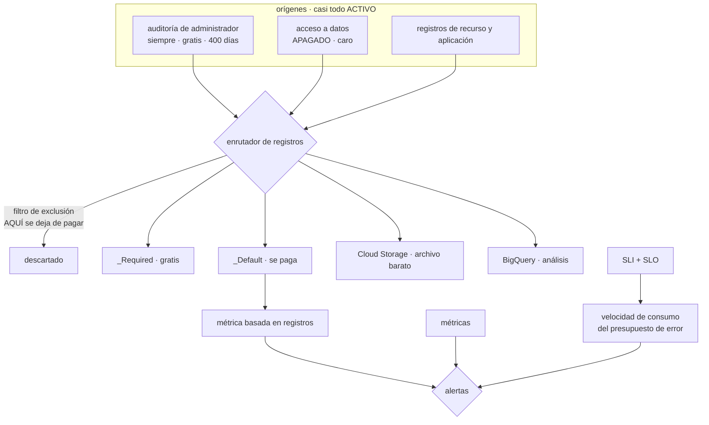

# 057 — Cloud Logging, Monitoring, Trace y Audit Logs

> [← 056 · Pub/Sub, Cloud Tasks y Workflows](../../part-04-gcp-core-platform/056-pub-sub-cloud-tasks-y-workflows/README.md) · [Índice de la parte](../README.md) · [058 · Cloud KMS, Secret Manager y Security Command Center →](../../part-04-gcp-core-platform/058-cloud-kms-secret-manager-y-security-command-center/README.md)

**Parte:** 04 — Google Cloud: plataforma esencial<br>
**Nivel:** intermedio · **Horas estimadas:** 4<br>
**Laboratorio:** `observability` · **Estado:** `EXECUTABLE_CORE`

## 🎯 Propósito

Construir la evidencia operativa de una plataforma de Google Cloud, donde el problema es el contrario al de la clase 045: aquí **casi todo se registra desde el primer minuto**, así que un incidente nunca se queda sin datos y la factura llega antes que la pregunta. Y donde existe la pieza que faltaba en las dos plataformas anteriores: alertar sobre el **consumo del presupuesto de error** en lugar de sobre umbrales de recursos, que es la diferencia entre 340 avisos al mes y once que importan.

## 📚 Resultados de aprendizaje

Al finalizar podrás:

1. **Distinguir** qué registros están activos y son gratuitos de los que hay que habilitar y se pagan.
2. **Reducir** la factura de ingesta con filtros de exclusión y destinos, sin perder capacidad de investigación.
3. **Convertir** un patrón de registro en una métrica para alertar en un minuto en vez de en quince.
4. **Definir** un SLI y un SLO, y alertar por velocidad de consumo del presupuesto de error.
5. **Reconstruir** una petición completa entre servicios y localizar el salto que corta la traza.

## 🧩 Conceptos centrales

| Concepto | Comprensión verificable |
|---|---|
| `registro de auditoría de actividad de administrador` | Quién creó, modificó o borró qué. Está **siempre activo, es gratuito y se conserva 400 días** sin configurar nada — justo lo que en la clase 045 exigía exportar. |
| `registro de acceso a datos` | Quién leyó qué dato. Está **apagado** por defecto —salvo excepciones— y es el más voluminoso: habilitarlo en todo es la forma más rápida de multiplicar la factura. |
| `enrutador de registros` | Punto por el que pasa todo antes de almacenarse. Es donde se **excluye antes de pagar** y donde se decide el destino: bucket de registros, almacenamiento, BigQuery o Pub/Sub. |
| `métrica basada en registros` | Contador o distribución extraído de un patrón de texto. Convierte una señal que solo existe en los registros en una métrica sobre la que se alerta en un minuto. |
| `presupuesto de error` | Fracción de peticiones que el SLO permite fallar en un periodo. Alertar sobre su **velocidad de consumo** sustituye a los umbrales de CPU y elimina la mayoría de los avisos inútiles. |
| `perfilador continuo` | Muestreo de CPU y memoria en producción con sobrecarga mínima. Responde a «dónde se va el tiempo» sin reproducir nada en un entorno de pruebas. |

## 🧠 Modelo mental

Un proyecto de Google Cloud es la unidad práctica de API, cuota, IAM y facturación; la organización aporta la política heredable.

Aplicado a esta clase, separa siempre cuatro planos: **intención** (qué necesita el usuario),
**configuración** (qué declaramos), **estado observado** (qué existe de verdad) y
**evidencia** (cómo sabemos que cumple). Confundirlos produce diseños que se ven correctos
en un diagrama pero fallan al operar.

## 🗺️ Flujo de razonamiento



## 📖 Desarrollo

### 1. Aquí el problema no es la falta de datos, es la factura

La clase 045 empezaba con una frase que aquí no vale: «nada se registra hasta que alguien lo enciende». En Google Cloud el reparto es el contrario, y conviene conocerlo con precisión porque decide dónde está el riesgo.

```text
siempre activo y GRATUITO
  auditoría de actividad de administrador   quién creó, modificó o borró
  auditoría de eventos del sistema          acciones de la propia plataforma
  → se guardan 400 días en el bucket _Required, que no se puede modificar

activo y facturado
  registros de aplicación y de la mayoría de servicios
  registros de peticiones de los balanceadores y de Cloud Run
  auditoría de política denegada

APAGADO por defecto
  auditoría de ACCESO A DATOS: quién leyó qué
```

La primera línea resuelve de fábrica el problema que la clase 045 tuvo que resolver exportando a almacenamiento inmutable: **quién borró un recurso hace cuatro meses tiene respuesta**, sin haber configurado nada, y sin que nadie pueda borrar esa respuesta.

```bash
$ gcloud logging read 'protoPayload.methodName:"delete" AND
  timestamp>="2026-04-01T00:00:00Z"' --limit 20 \
  --format="table(timestamp, protoPayload.authenticationInfo.principalEmail,
                  protoPayload.methodName, protoPayload.resourceName)"
```

La tercera línea es la asimetría propia, y es una decisión con precio. Los registros de acceso a datos responden a «quién leyó la tabla de clientes», que es la pregunta de cualquier investigación sobre datos personales — y son, con diferencia, los más voluminosos, porque hay muchas más lecturas que cambios de configuración.

```bash
$ gcloud projects get-iam-policy $PROYECTO --format=json > politica.json
# habilitar SOLO donde importa, no en toda la organización
```

El criterio que evita la factura sin renunciar a la evidencia: **habilitarlos por servicio y por proyecto, en los que contienen datos personales o financieros**, y dejarlos apagados en el resto. Activarlos en la organización entera «por si acaso» es la forma más rápida de multiplicar el gasto de telemetría por varias veces.

Y el modelo de precios, que cambia lo que es razonable guardar:

```text
ingesta          ~0,50 USD por GiB
retención        30 días incluidos en _Default; más allá, por GiB y mes
_Required        gratis, 400 días, no configurable
métricas de plataforma  gratuitas
```

Compararlo con la clase 045 explica por qué el diseño cambia: allí la ingesta costaba unas cuatro veces más, así que la palanca era el plan por tabla. Aquí la ingesta es más barata y el volumen es mayor porque todo está encendido, de modo que la palanca principal es otra: **descartar antes de ingerir**.

### 2. El enrutador: excluir antes de pagar, archivar lo que solo se guarda

Todo registro pasa por el enrutador antes de almacenarse, y ahí hay dos operaciones distintas que se confunden:

```text
destino (sink)     copia los registros que coinciden hacia un destino
                   → se paga la ingesta en el destino que corresponda
exclusión          DESCARTA antes de almacenar
                   → no se paga
```

La exclusión es la que baja la factura. Y se escribe con el mismo lenguaje de filtro que las consultas:

```bash
$ gcloud logging sinks update _Default \
    --add-exclusion=name=peticiones-correctas,\
filter='resource.type="cloud_run_revision" AND httpRequest.status<400'

$ gcloud logging sinks update _Default \
    --add-exclusion=name=flujos-vpc-muestreo,\
filter='resource.type="gce_subnetwork" AND log_id("compute.googleapis.com/vpc_flows")
        AND sample(insertId, 0.05)'
```

La segunda usa muestreo: conserva el 5 % de los registros de flujo de la clase 051 y descarta el resto. Para detectar patrones de tráfico, una muestra basta; para una investigación forense concreta, no — y ahí es donde entra el archivo barato:

```bash
$ gcloud logging sinks create archivo-crudo \
    storage.googleapis.com/projects/$P/buckets/cls-registros-crudos \
    --log-filter='resource.type="gce_subnetwork" OR resource.type="http_load_balancer"'
```

Ese destino escribe a Cloud Storage, donde el GB cuesta una fracción y las reglas de ciclo de vida de la clase 053 lo retiran solas. La combinación resuelve las dos necesidades sin pagar dos veces:

```text
lo que se consulta a diario   en el bucket de registros, con retención corta
lo que se consulta una vez    en Cloud Storage, barato, con ciclo de vida
lo que no se consulta nunca   excluido: no se paga
```

La tercera línea exige una comprobación honesta que casi nadie hace: **mirar qué se ha consultado de verdad** en los últimos noventa días. Un tipo de registro que nadie ha buscado nunca es candidato a exclusión o a archivo, y esa revisión es la que convierte la reducción de costo en una decisión con datos en vez de en un recorte a ciegas.

Y para el análisis, **Log Analytics** convierte un bucket de registros en algo consultable con SQL, lo que evita mover los datos a otro sitio solo para poder agregarlos:

```sql
SELECT
  JSON_VALUE(resource.labels.service_name) AS servicio,
  COUNT(*) AS peticiones,
  COUNTIF(CAST(JSON_VALUE(http_request.status) AS INT64) >= 500) AS errores
FROM `cls-obs.global._Default._AllLogs`
WHERE timestamp > TIMESTAMP_SUB(CURRENT_TIMESTAMP(), INTERVAL 1 HOUR)
GROUP BY servicio ORDER BY errores DESC
```

Y un límite del enrutador que produce una sorpresa: **las exclusiones se aplican al bucket de destino, no al origen**. Un registro excluido de `_Default` sigue llegando a otros destinos que lo seleccionen. Es lo que se quiere —excluir del caro y archivar en el barato— y hay que tenerlo presente al calcular el ahorro.

### 3. Alertar por presupuesto de error, no por umbral de recurso

Esta es la pieza que las clases 034 y 045 no tenían y que cambia la operación más que ninguna otra de la parte.

El problema con las alertas de umbral es conocido: la CPU al 85 % puede ser perfectamente normal, y el 40 % puede ser catastrófico si la mitad de las peticiones fallan. Un panel lleno de avisos que nadie atiende no es vigilancia, es ruido con guardia.

Google Cloud modela el objetivo directamente:

```text
SLI   indicador: proporción de peticiones buenas sobre el total
SLO   objetivo: 99,9 % en 28 días
presupuesto de error   0,1 % de las peticiones
  con 10 M de peticiones al mes → 10.000 peticiones pueden fallar
```

Y la alerta se define sobre **la velocidad a la que se consume ese presupuesto**:

```text
velocidad de consumo = tasa de error observada / tasa que agota justo el presupuesto

velocidad 1    a este ritmo, el presupuesto se agota exactamente al final del periodo
velocidad 14,4 el presupuesto de 28 días se agota en 2 días
               → si dura una hora, ya se ha gastado el 2 % del mes
```

La configuración estándar usa dos ventanas, y su lógica merece entenderse porque es lo que elimina el ruido:

```text
ventana corta + velocidad alta   (5 min, ×14,4)    incidente agudo → avisar YA
ventana larga + velocidad baja   (6 h, ×1)         degradación lenta → avisar,
                                                    pero sin urgencia
y se exige que AMBAS ventanas coincidan
  → un pico de 30 segundos no dispara nada
  → una degradación sostenida sí
```

```bash
$ gcloud alpha monitoring policies create --policy-from-file - <<'YAML'
displayName: "Consumo rápido del presupuesto de error · tienda"
conditions:
  - displayName: "velocidad de consumo > 14,4 en 5 min y 1 h"
    conditionThreshold:
      filter: 'select_slo_burn_rate("projects/…/services/tienda/serviceLevelObjectives/disponibilidad-999", "3600s")'
      comparison: COMPARISON_GT
      thresholdValue: 14.4
      duration: 300s
YAML
```

Lo que se gana no es solo menos ruido. Se gana que **cada alerta corresponde a algo que el usuario nota**, y que la urgencia está calibrada: una alerta de velocidad 14,4 significa que si nadie hace nada en dos días no queda presupuesto, lo que es una frase que un responsable de guardia puede entender a las tres de la madrugada. «CPU al 85 %» no lo es.

Y las alertas de umbral no desaparecen: se quedan para lo que sí es un límite duro, que es distinto de una degradación:

```text
SLO / presupuesto de error   la experiencia del usuario
umbral                        cuotas, disco lleno, certificado que caduca,
                              conexiones al máximo, mensajes fallidos > 0
```

La segunda columna incluye la alerta que este programa ha justificado en tres plataformas: **trabajo que se acumula**. Un consumidor detenido no consume presupuesto de error de un servicio HTTP, así que un sistema que solo vigile el SLO de la API no lo detecta.

Y para lo que solo existe en los registros, la **métrica basada en registros** cierra el hueco que la clase 045 dejó abierto —allí, alertar sobre un registro costaba entre siete y veinte minutos—:

```bash
$ gcloud logging metrics create errores-cobro \
    --description "Excepciones del servicio de cobro" \
    --log-filter='resource.type="cloud_run_revision"
      AND resource.labels.service_name="svc-pagos"
      AND severity>=ERROR AND jsonPayload.tipo="CobroRechazado"'
```

Una vez extraída, es una métrica normal: se alerta sobre ella en aproximadamente un minuto, con el mismo mecanismo rápido que cualquier otra.

### 4. Trazas, errores y dónde se va el tiempo

Tres herramientas responden tres preguntas distintas, y las tres están integradas sin montar nada.

**Cloud Trace** reconstruye la petición completa entre servicios. La correlación viaja en la cabecera estándar del W3C —o en la propia de Google— y tiene la misma condición que en la clase 045: **cada salto debe propagarla**.

```text
X-Cloud-Trace-Context: TRACE_ID/SPAN_ID;o=1
traceparent: 00-<trace-id>-<span-id>-01
```

Y el mismo síntoma cuando falta: la traza se corta justo en el servicio interno que se escribió a mano, que es normalmente el interesante. La comprobación es directa —buscar una traza y contar los tramos esperados— y conviene hacerla el día que se despliega un servicio nuevo, no durante un incidente.

En Cloud Run hay un detalle que ahorra trabajo: **la plataforma ya emite un tramo por petición**, así que el mapa básico existe sin instrumentar nada. Lo que hay que añadir es la propagación entre servicios propios y los tramos de las llamadas a bases de datos, que es donde suele estar el tiempo.

**Error Reporting** agrupa las excepciones por firma y cuenta ocurrencias, primera y última vez. Sustituye a buscar cadenas en los registros y responde a la pregunta que abre casi todo incidente de aplicación: **qué ha empezado a fallar ahora que antes no fallaba**. Funciona sin configuración si las excepciones se escriben con la severidad y el formato adecuados, lo que es un argumento concreto para registrar en estructura y no en texto libre:

```python
import json, sys
print(json.dumps({
    "severity": "ERROR",
    "message": str(exc),
    "stack_trace": traceback.format_exc(),
    "logging.googleapis.com/trace": f"projects/{proyecto}/traces/{trace_id}",
}), file=sys.stderr)
```

Ese campo de traza es el que enlaza el error con su petición completa: desde la excepción se llega a la traza, y desde la traza a la dependencia que la causó. Es la cadena que la clase 034 pedía y que aquí cuesta una línea.

**Cloud Profiler** responde a una pregunta que ninguna de las plataformas anteriores contestaba en producción: **dónde se va el tiempo de CPU y la memoria**. Muestrea continuamente con una sobrecarga muy baja y presenta el resultado como gráfico de llamas.

```python
import googlecloudprofiler
googlecloudprofiler.start(service="svc-tienda", service_version="v8")
```

Su valor es que encuentra cosas que nadie buscaría: un serializador que consume un tercio de la CPU, una expresión regular recompilada en cada petición, una biblioteca de fechas que domina el perfil. Son mejoras que no aparecen en ninguna traza porque están **dentro** de un tramo, y que suelen tener una corrección de pocas líneas.

Y el **Servicio Gestionado para Prometheus** merece mención porque decide el diseño de la parte 06: Google Cloud ingiere métricas en formato Prometheus de forma nativa, con consultas en PromQL. Eso significa que la instrumentación de una aplicación **no es específica del proveedor**: las mismas métricas y los mismos paneles valen aquí, en un clúster propio o en otra nube. Es exactamente el tipo de contrato portable que la clase 048 pedía identificar, y aparece en la capa donde más veces se pierde.

### 5. El método, ya idéntico en tres plataformas

Con tres proveedores recorridos, el procedimiento de investigación ya no es una receta por producto. Es el mismo, y solo cambia el nombre del comando:

```text
1. ¿el usuario lo nota?        SLO y presupuesto de error, no CPU
2. ¿desde cuándo?              percentil de latencia y tasa de error en serie
3. ¿qué cambió en la ventana?  auditoría de administrador + despliegues
4. ¿qué traza lo demuestra?    una petición fallida, de extremo a extremo
5. ¿qué dependencia?           tramos de la traza, o errores agrupados
6. ¿quién y con qué permiso?   auditoría, y el sistema de identidad (050)
```

Y las consultas de cada paso se escriben **una vez** y se guardan, por la razón que la clase 045 ya dio: un incidente no es el momento de aprender a consultar.

```bash
# 3. qué cambió en las últimas 6 horas
$ gcloud logging read 'logName:"cloudaudit.googleapis.com%2Factivity"
  AND timestamp>="'$(date -u -d "6 hours ago" +%Y-%m-%dT%H:%M:%SZ)'"' \
  --format="table(timestamp, protoPayload.authenticationInfo.principalEmail,
                  protoPayload.methodName, resource.labels.service_name)"
```

Y la comparación de las tres plataformas en observabilidad, que es lo que se lleva a la clase 060:

```text                              AWS (034)     Azure (045)    Google (057)
registros de recurso              parcial       APAGADOS       activos
auditoría, retención gratuita     90 días       90 días        400 días
precio de ingesta                 medio         ~2,30 USD/GiB  ~0,50 USD/GiB
registros de acceso a datos       opcionales    opcionales     apagados, caros
alerta rápida sobre registros     métrica       ~9 min         métrica de registro
SLO y presupuesto de error        se construye  se construye   INTEGRADO
perfilado en producción           aparte        aparte         INTEGRADO
```

Dos filas van claramente a favor de esta plataforma y una en contra —los registros de acceso a datos apagados, que es la versión local del error de la clase 045—. Y la fila del SLO es la que más cambia la operación diaria, porque no es una herramienta más: **es la que decide qué despierta a alguien**.

Un cierre que conviene dejar escrito para el proyecto de la clase 060: la observabilidad no se juzga por cuántos paneles hay, sino por dos números que se pueden medir en un simulacro —**cuánto tarda en detectarse un fallo y cuánto en localizar su causa**—. Todo lo de esta clase existe para bajar esos dos números, y cualquier pieza que no lo haga es decoración que cuesta dinero al mes.

## 🔬 Ejemplo trabajado

**CloudShop instrumenta su plataforma de Google Cloud. El incidente que abrió la clase 045 —una caída sin datos que analizar— no se reproduce: los registros estaban. Los cinco problemas de este mes son de otra naturaleza.**

**Lo que no se reprodujo.**

```text
en Azure    48 minutos de caída sin ningún registro del plano de datos,
            porque las configuraciones de diagnóstico estaban apagadas
aquí        los registros de la petición, del balanceador y de la auditoría
            estaban desde el primer minuto, sin configurar nada
tiempo hasta identificar la causa raíz    23 minutos
```

**Problema 1 — la factura de telemetría, en el día doce.**

```sql
SELECT log_name, ROUND(SUM(bytes)/POW(1024,3), 1) AS gib
FROM `cls-obs.global._Default._AllLogs` …
```

```text
flujos de VPC (clase 051)                     31 GiB/día   50 %
peticiones de Cloud Run, todas                18 GiB/día   29 %
balanceador, incluidas las 2xx                 9 GiB/día   15 %
resto                                          4 GiB/día    6 %
                                            ──────────
                                              62 GiB/día  → ~930 USD/mes
```

El 94 % del gasto eran registros que nadie había consultado nunca. La comprobación se hizo mirando el historial de consultas, no por intuición.

```text                                          antes         después
flujos de VPC                                31 GiB/día   1,6 GiB/día (muestreo 5 %)
  el volumen íntegro va a Cloud Storage con ciclo de vida a 30 días
peticiones de Cloud Run                      18 GiB/día   3,1 GiB/día (solo >= 400)
balanceador                                   9 GiB/día   1,4 GiB/día (solo >= 400)
resto                                         4 GiB/día     4 GiB/día
                                            ──────────    ──────────
ingesta                                      62 GiB/día  10,1 GiB/día
costo mensual de ingesta                     ~930 USD       ~152 USD
archivo en Cloud Storage                          —          ~19 USD
```

Capacidad de investigación perdida: ninguna. Lo excluido sigue existiendo, más barato y más lento de consultar.

**Problema 2 — «¿quién leyó la tabla de clientes?» no tenía respuesta.**

Una consulta de cumplimiento pregunta por accesos a datos personales de los tres meses anteriores.

```bash
$ gcloud logging read 'protoPayload.methodName="google.cloud.bigquery.v2.JobService.InsertJob"
  AND protoPayload.resourceName:"clientes"' --limit 5
# (vacío para los servicios distintos de BigQuery)
```

Los registros de acceso a datos estaban apagados, que es su valor por defecto. Se habilitan **de forma selectiva**, con la aritmética delante:

```text                                    si se habilita en todo   selectivo
volumen añadido estimado                   +48 GiB/día        +2,3 GiB/día
costo añadido                              +720 USD/mes        +35 USD/mes
cobertura                                  todo                los 4 proyectos
                                                               con datos personales
```

Treinta y cinco dólares al mes por poder responder la pregunta que importa. Setecientos veinte por poder responder también las que nadie hace.

**Problema 3 — 340 alertas al mes y ninguna correspondía a un usuario afectado.**

```text
alertas del mes anterior            340
de ellas, con impacto en usuarios     6
de ellas, atendidas                  31
de ellas, silenciadas                46
```

El resto se ignoraron. Se sustituyen los umbrales de recurso por objetivos de servicio:

```text
SLI      peticiones con estado < 500 y latencia < 800 ms / total
SLO      99,9 % en 28 días
presupuesto de error   0,1 % → ~10.200 peticiones al mes
alertas  velocidad ×14,4 en ventanas de 5 min y 1 h   → aviso inmediato
         velocidad ×1 en ventanas de 6 h y 3 días     → aviso sin urgencia
```

```text                                antes          después
alertas al mes                          340             11
con impacto real en usuarios              6             11
falsos positivos                        334              0
alertas silenciadas                      46              0
tiempo medio hasta la detección       19 min         3 min 40 s
```

Once alertas, once incidentes reales. Y se conservan seis alertas de umbral para lo que sí es un límite duro: cuota al 80 %, disco al 70 %, certificado a 30 días, conexiones al 85 %, mensajes fallidos mayor que cero y acumulación en cola — la última, por tercera vez en el programa.

**Problema 4 — la traza se cortaba en el servicio de precios.**

```text
tramos esperados en una petición de pedido    6
tramos observados                             3
el corte, siempre en la llamada a svc-precios
```

El cliente HTTP de ese servicio se había escrito a mano y no reenviaba la cabecera de traza. Tercera vez que este fallo aparece en el programa, con la misma corrección.

```text                                antes        después
propagación de la cabecera        4 de 6 saltos   6 de 6
tiempo hasta localizar una dependencia lenta   ~25 min   ~3 min
comprobación de continuidad de traza  ninguna   en el despliegue de cada servicio
```

**Problema 5 — el 38 % de la CPU estaba en un sitio que nadie habría mirado.**

Con el perfilador activo una semana:

```text
serialización a JSON del catálogo completo    38 % del tiempo de CPU
  causa: se serializaba el objeto entero para devolver 4 campos
```

```text                                antes        después
CPU en serialización                  38 %          6 %
p95 del listado de catálogo         214 ms        131 ms
instancias en el pico                   9             5
costo mensual de Cloud Run           31 USD       19 USD
```

Una corrección de once líneas, encontrada porque el perfilador estaba encendido y no porque nadie sospechara.

**Resumen de la observabilidad:**

```text                                          antes         después
ingesta diaria                               62 GiB/día    10,1 GiB/día
costo mensual de telemetría                   930 USD        206 USD
registros de acceso a datos                 apagados     activos en 4 proyectos
alertas al mes                                  340             11
falsos positivos                                334              0
tiempo medio hasta la detección              19 min         3 min 40 s
propagación de traza                        4 de 6 saltos   6 de 6
```

**La lección que esta clase traslada al proyecto de la clase 060**: el problema de la observabilidad cambia de forma según la plataforma —en la parte 03 era la ausencia de datos, aquí es su exceso— y no cambia el criterio. En ambos casos la pregunta correcta es la misma: **¿qué señal necesito para responder a un incidente, y qué estoy pagando que nunca he consultado?** La respuesta se obtiene mirando el historial de consultas, y casi siempre sorprende.

## 🧪 Laboratorio guiado

Ejecuta desde la raíz:

```bash
python classes/part-04-gcp-core-platform/057-cloud-logging-monitoring-trace-y-audit-logs/lab.py
```

El laboratorio selecciona el motor de práctica **`observability`** y produce
`lab_result.json`. El escenario, sus comprobaciones y el artefacto esperado corresponden a
esta clase; no requiere credenciales y deja explícito qué debe revalidarse en un sandbox real.

1. Lee `exercise.steps` y formula una predicción antes de ejecutar.
2. Ejecuta la práctica y verifica todos los elementos de `checks`.
3. Provoca el caso de `negative_test` y explica la señal observada.
4. Materializa `evidencia-operativa-gcp` en `evidence/` usando la plantilla indicada.
5. Para proveedor real, sigue `sandbox.requires`, registra costo y ejecuta `destroy`.

### Evidencia esperada

El artefacto principal es telemetría correlacionada con una pregunta operativa. Además, la entrega debe incluir el comando ejecutado,
la salida estructurada y una conclusión que no exceda lo observado.

## 🏆 Reto verificable

Construye **`evidencia-operativa-gcp`** para el caso CloudShop. Incluye una alternativa descartada,
un supuesto que pueda falsarse, una prueba de fallo y una decisión de rollback.

## ✅ Criterio de aceptación

- [ ] `lab.py` termina con código 0 y genera JSON válido.
- [ ] La entrega conecta al menos tres requisitos con mecanismos verificables.
- [ ] Existe una prueba positiva y una prueba negativa con evidencia.
- [ ] Seguridad, costo y operación aparecen como decisiones, no como anexos.
- [ ] Se declara una limitación y una condición que obligaría a revisar el diseño.
- [ ] Otra persona puede repetir el recorrido sin conocimiento tácito.

## ⚠️ Errores frecuentes

| Síntoma | Causa probable | Corrección |
|---|---|---|
| La factura de telemetría es varias veces la prevista desde el primer mes | Casi todo se registra por defecto, incluidos los flujos de red y las peticiones correctas | Excluye en el enrutador antes de ingerir, muestrea lo voluminoso y archiva el volumen íntegro en Cloud Storage con ciclo de vida. |
| No se puede saber quién leyó un dato personal | Los registros de auditoría de acceso a datos están apagados por defecto | Habilítalos de forma selectiva en los proyectos y servicios con datos sensibles, no en toda la organización. |
| Cientos de alertas al mes y casi ninguna corresponde a impacto real | Se alerta sobre umbrales de recursos en vez de sobre la experiencia del usuario | Define SLI y SLO y alerta por velocidad de consumo del presupuesto de error, con dos ventanas que deban coincidir. |
| Una alerta basada en registros llega demasiado tarde | Se evalúa como consulta programada, con la latencia acumulada de la clase 045 | Convierte el patrón en una métrica basada en registros y alerta sobre ella como sobre cualquier métrica. |
| La traza se corta siempre en el mismo servicio | Ese salto no propaga la cabecera de contexto de traza | Propágala en todos los clientes HTTP y comprueba el número de tramos al desplegar cada servicio. |
| Se optimiza el servicio y la latencia no mejora | El tiempo se va dentro de un tramo, donde ninguna traza lo muestra | Activa el perfilador continuo en producción: su sobrecarga es mínima y localiza el consumo real. |

## 🛡️ Seguridad, ética y costo

Trabaja con cuentas propias o sandboxes autorizados. No publiques secretos, identificadores
reales ni datos personales. Antes de crear recursos pagos define presupuesto, etiquetas y
comando de destrucción; después verifica que no queden recursos huérfanos. Los ejemplos
locales enseñan contratos, pero no certifican cumplimiento ni disponibilidad de producción.

## ❓ Preguntas de comprobación

1. ¿Qué registros están activos y son gratuitos aquí, y qué problema concreto de la clase 045 resuelven?
2. ¿Cuál es la diferencia entre un destino y una exclusión en el enrutador, y cuál baja la factura?
3. Explica qué significa una velocidad de consumo de 14,4 y por qué se exigen dos ventanas coincidentes.
4. ¿Qué tipo de alerta sigue necesitando un umbral aunque exista el presupuesto de error?
5. ¿Qué pregunta responde el perfilador que ninguna traza puede responder, y por qué?

## 🔗 Referencias

- Google Cloud (2025). *Cloud Audit Logs overview* — tipos, cuáles están activos y cuáles se pagan. <https://cloud.google.com/logging/docs/audit>
- Google Cloud (2025). *Routing and storage overview* — enrutador, destinos, exclusiones y buckets `_Required` y `_Default`. <https://cloud.google.com/logging/docs/routing/overview>
- Google Cloud (2025). *Log-based metrics* — contadores y distribuciones extraídos de registros. <https://cloud.google.com/logging/docs/logs-based-metrics>
- Google Cloud (2025). *SLO monitoring and burn rate alerts* — SLI, SLO, presupuesto de error y ventanas múltiples. <https://cloud.google.com/stackdriver/docs/solutions/slo-monitoring>
- Google Cloud (2025). *Cloud Profiler concepts* — muestreo continuo en producción y su sobrecarga. <https://cloud.google.com/profiler/docs/concepts-profiling>
- Documentación oficial vigente del servicio implementado; registra URL y fecha de consulta.

---

> [Evaluación](assessment.md) · [Contrato de clase](lesson.yaml) · [Índice de la parte](../README.md)

**📥 Descargar:** [Parte 04 en PDF](../../../site/downloads/partes/manual-parte-04-gcp-core-platform.pdf) · [Recorrido de Google Cloud en PDF](../../../site/downloads/nubes/manual-google-cloud.pdf) · [Manual integral](../../../site/downloads/multi-cloud-engineering-manual-v2.0.pdf)

| Anterior | Índice | Siguiente |
|---|---|---|
| [← 056 · Pub/Sub, Cloud Tasks y Workflows](../../part-04-gcp-core-platform/056-pub-sub-cloud-tasks-y-workflows/README.md) | [Parte 04](../README.md) · [Programa](../../README.md) | [058 · Cloud KMS, Secret Manager y Security Command Center →](../../part-04-gcp-core-platform/058-cloud-kms-secret-manager-y-security-command-center/README.md) |
