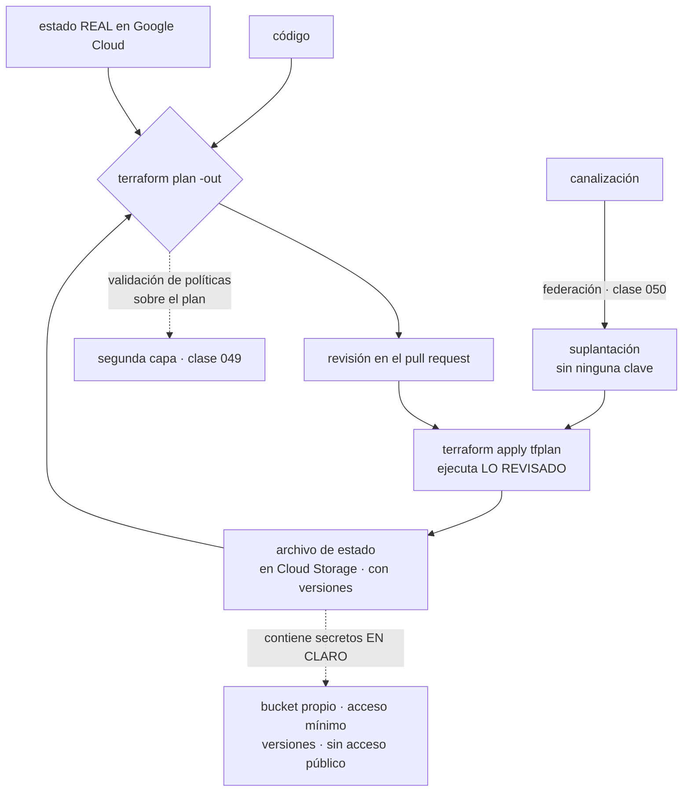

# 059 — Terraform y despliegues reproducibles en GCP

> [← 058 · Cloud KMS, Secret Manager y Security Command Center](../../part-04-gcp-core-platform/058-cloud-kms-secret-manager-y-security-command-center/README.md) · [Índice de la parte](../README.md) · [060 · Proyecto: aplicación de tres capas en Google Cloud →](../../part-04-gcp-core-platform/060-proyecto-aplicacion-de-tres-capas-en-google-cloud/README.md)

**Parte:** 04 — Google Cloud: plataforma esencial<br>
**Nivel:** intermedio · **Horas estimadas:** 4<br>
**Laboratorio:** `iac` · **Estado:** `EXECUTABLE_CORE`

## 🎯 Propósito

Declarar la infraestructura de Google Cloud con Terraform, entendiendo la pieza que la clase 047 no tenía y que lo cambia todo: **el archivo de estado**. Da lo que a Bicep le faltaba —saber qué gestiona este código, destruirlo ordenadamente, detectar que alguien borró algo— y trae tres problemas propios: hay que guardarlo, hay que bloquearlo, y **contiene los secretos en claro**. A eso se suman dos trampas del proveedor que destruyen recursos sanos sin que nadie lo pida.

## 📚 Resultados de aprendizaje

Al finalizar podrás:

1. **Explicar** qué capacidades da el archivo de estado y qué obligaciones impone su custodia.
2. **Garantizar** que lo que se aplica es exactamente lo que se revisó, y no una nueva planificación.
3. **Evitar** la destrucción de recursos ajenos al cambio por reindexación y por estado compartido.
4. **Autenticar** la canalización sin ninguna clave, con federación y suplantación.
5. **Comparar** un modelo con estado y otro sin él con criterios operativos, no de preferencia.

## 🧩 Conceptos centrales

| Concepto | Comprensión verificable |
|---|---|
| `archivo de estado` | Registro de lo que este código gestiona y de sus atributos. Permite destruir, detectar desviación e importar — y **guarda valores sensibles en claro**, así que es el fichero más delicado del proyecto. |
| `bloqueo de estado` | Exclusión mutua para que dos ejecuciones simultáneas no escriban a la vez. Sin él, dos canalizaciones concurrentes pueden corromper el estado. |
| `plan guardado` | Resultado de la planificación escrito a fichero. Aplicar ese fichero garantiza que se ejecuta **lo revisado**; sin él, `apply` vuelve a planificar y puede hacer otra cosa. |
| `reindexación por `count`` | Las instancias de un recurso con `count` se identifican por posición. Quitar una del medio **desplaza a todas las siguientes**, y Terraform destruye y recrea las que no cambiaron. |
| `suplantación del proveedor` | Autenticación de Terraform como una cuenta de servicio sin ninguna clave, partiendo de la identidad de la canalización. Es la aplicación directa de la clase 050. |
| `desviación` | Diferencia entre lo declarado y lo que existe de verdad. Con estado se detecta en la planificación; sin estado, un borrado ajeno pasa desapercibido. |

## 🧠 Modelo mental

Un proyecto de Google Cloud es la unidad práctica de API, cuota, IAM y facturación; la organización aporta la política heredable.

Aplicado a esta clase, separa siempre cuatro planos: **intención** (qué necesita el usuario),
**configuración** (qué declaramos), **estado observado** (qué existe de verdad) y
**evidencia** (cómo sabemos que cumple). Confundirlos produce diseños que se ven correctos
en un diagrama pero fallan al operar.

## 🗺️ Flujo de razonamiento



## 📖 Desarrollo

### 1. El estado: lo que resuelve y lo que obliga

La clase 047 terminó con una lista de lo que se pierde al no tener estado. Terraform lo tiene, así que esa lista se convierte en capacidades:

```text
saber qué gestiona este código   el estado es la lista de pertenencia
destruir ordenadamente           terraform destroy, en orden de dependencias
detectar que alguien BORRÓ algo  la planificación lo muestra como cambio
adoptar lo creado a mano         import, sin recrear nada
```

La tercera es la que más se echa de menos sin estado: si alguien elimina un recurso desde la consola, un modelo sin estado simplemente lo vuelve a crear en el siguiente despliegue, sin decir que había desaparecido. Con estado, la planificación lo señala:

```text
# google_compute_firewall.permitir_datos has been deleted
  - resource "google_compute_firewall" "permitir_datos" { … }
Plan: 1 to add, 0 to change, 0 to destroy.
```

Y las tres obligaciones que trae, en orden de importancia:

**Contiene secretos en claro.** Cualquier valor que haya pasado por un recurso —una contraseña generada, una clave, un certificado— queda escrito. No hay cifrado a nivel de campo:

```bash
$ terraform state pull | jq -r '.resources[].instances[].attributes | select(.password)' | head -3
```

Eso convierte al estado en el fichero más sensible del repositorio, y su custodia en una decisión de seguridad, no de almacenamiento:

```hcl
terraform {
  backend "gcs" {
    bucket = "cls-tfstate-prod"
    prefix = "red"
  }
}
```

```text
bucket propio, en un proyecto de plataforma
acceso uniforme y prevención de acceso público   (clase 053)
versionado activo: un estado corrupto se recupera
IAM mínimo: quien puede leer el estado puede leer los secretos
clave del cliente si el requisito lo exige        (clase 058)
```

**Hay que bloquearlo.** Dos ejecuciones a la vez sobre el mismo estado lo corrompen. El backend de Cloud Storage lo gestiona, y conviene comprobarlo la primera vez en lugar de suponerlo: una segunda ejecución debe esperar o fallar con un error de bloqueo, no continuar.

**Hay que decidir su granularidad**, y esa decisión es la misma que en la clase 047 con otra pieza. Allí el radio de impacto lo marcaba el grupo de recursos; aquí lo marca el estado:

```text
un estado para toda la plataforma
  → terraform destroy en pruebas puede tocar lo que comparte estado
  → cada planificación consulta cientos de recursos: lenta
  → dos equipos se bloquean mutuamente

un estado por unidad de despliegue
  cls-tfstate-prod/red
  cls-tfstate-prod/datos
  cls-tfstate-prod/tienda
  → cada uno se destruye y se planifica por separado
```

Y para conectarlos, salidas remotas o —mejor— **fuentes de datos que consultan Google Cloud directamente**, que no crean acoplamiento entre estados:

```hcl
data "google_compute_subnetwork" "tienda" {
  name    = "snet-tienda-euw1"
  region  = "europe-west1"
  project = var.proyecto_red
}
```

Una dependencia por dato es más robusta que una por estado: si el estado de red se recrea, el consumidor no se entera.

### 2. Aplicar lo revisado, y las dos formas de destruir sin querer

**El plan guardado no es opcional.** Sin él, `apply` vuelve a planificar en el momento de ejecutarse, y entre la revisión y la ejecución pueden haber cambiado cosas: una fuente de datos, una versión de imagen, un recurso tocado a mano.

```bash
$ terraform plan -out=tfplan -lock-timeout=5m
$ terraform show -no-color tfplan > plan.txt      # esto es lo que se revisa
$ terraform apply tfplan                          # esto ejecuta EXACTAMENTE eso
```

La diferencia con `terraform apply` a secas es que el segundo pide confirmación sobre **un plan nuevo** que nadie ha revisado. En una canalización con aprobación manual, eso rompe la garantía entera: se aprueba un texto y se ejecuta otro.

Y ahora las dos formas de destruir recursos sanos, que son las que producen los incidentes de esta clase.

**La primera: `count` y la reindexación.** Las instancias creadas con `count` se identifican por su posición:

```hcl
resource "google_compute_firewall" "reglas" {
  count = length(var.reglas)
  name  = var.reglas[count.index].nombre
  # …
}
```

Quitar el segundo elemento de una lista de cinco **desplaza a los tres siguientes**, y Terraform los ve como cambios de identidad:

```text
  # google_compute_firewall.reglas[1] must be replaced
  # google_compute_firewall.reglas[2] must be replaced
  # google_compute_firewall.reglas[3] must be replaced
Plan: 3 to add, 0 to change, 4 to destroy.
```

Se pidió quitar una regla y se van a recrear tres que no cambiaron. Con reglas de firewall el efecto es una ventana sin protección; con bases de datos o discos, es pérdida de datos.

La corrección es identificar por **clave estable** en lugar de por posición:

```hcl
resource "google_compute_firewall" "reglas" {
  for_each = { for r in var.reglas : r.nombre => r }
  name     = each.value.nombre
  # …
}
```

Con `for_each`, quitar un elemento afecta **solo a ese elemento**. La regla de equipo es corta y ahorra incidentes: **`count` únicamente para «cero o uno»; para colecciones, siempre `for_each`**.

**La segunda: el estado compartido y `destroy`.** Es el mismo incidente que en la clase 047 causó el modo completo, con otro mecanismo: `terraform destroy` en un directorio cuyo estado incluye recursos compartidos se los lleva.

Las protecciones, que se ponen antes y no después:

```hcl
resource "google_sql_database_instance" "pedidos" {
  # …
  deletion_protection = true            # protección del propio proveedor
  lifecycle { prevent_destroy = true }  # Terraform se niega a planificar su borrado
}
```

Las dos capas hacen cosas distintas: `prevent_destroy` hace fallar la planificación —así que el error aparece en la revisión, antes de ejecutar nada—, y `deletion_protection` lo impide en el servicio aunque alguien lo intente por otra vía. Y para el proyecto entero existe un **gravamen** que impide su eliminación, que es el equivalente al bloqueo de recurso de la clase 042:

```bash
$ gcloud resource-manager liens create --restrictions=resourcemanager.projects.delete \
    --parent=projects/cls-datos-prod-euw1-01 --reason="produccion"
```

Y una comprobación que conviene automatizar en la canalización: **rechazar cualquier plan que destruya recursos no esperados**.

```bash
$ terraform show -json tfplan | jq -r '
    .resource_changes[] | select(.change.actions | index("delete"))
    | .address' | tee borrados.txt
$ [ ! -s borrados.txt ] || echo "revisar: el plan destruye recursos"
```

No se trata de prohibir los borrados, sino de que ninguno pase sin que alguien lo haya leído.

### 3. Autenticar sin claves, que es lo que la clase 050 exigía

La forma cómoda de autenticar Terraform en una canalización es una clave de cuenta de servicio en un secreto del sistema de CI. Es exactamente lo que la clase 050 eliminó, y lo que la política de organización de la clase 049 impide crear.

La forma correcta encadena las dos piezas ya montadas:

```yaml
- uses: google-github-actions/auth@v2
  with:
    workload_identity_provider: projects/418293047512/locations/global/workloadIdentityPools/cls-ci/providers/github
    service_account: tf-plan@cls-plataforma.iam.gserviceaccount.com
```

Y dentro de Terraform, la suplantación permite que la identidad de planificación y la de aplicación sean distintas:

```hcl
provider "google" {
  project                     = var.proyecto
  region                      = var.region
  impersonate_service_account = var.cuenta_terraform
}
```

```text
tf-plan@…    permisos de LECTURA sobre todo lo que gestiona
             se usa en los pull requests: puede planificar, no puede cambiar
tf-apply@…   permisos de escritura acotados
             solo desde la rama principal, con la condición de atributo de la clase 050
```

Esa separación es la que hace seguro publicar el plan en el pull request: la identidad que lo genera **no puede aplicar nada**, así que una rama maliciosa no consigue más que leer. Sin ella, ejecutar `plan` desde una rama arbitraria es dar permiso de escritura a quien pueda abrir un pull request.

Y dos particularidades del proveedor de Google que producen fallos intermitentes si no se anticipan:

**Las API hay que habilitarlas y tardan en propagarse** (clase 049):

```hcl
resource "google_project_service" "servicios" {
  for_each = toset(["run.googleapis.com", "sqladmin.googleapis.com",
                    "secretmanager.googleapis.com"])
  project            = var.proyecto
  service            = each.value
  disable_on_destroy = false
}
```

`disable_on_destroy = false` importa: al destruir el directorio, deshabilitar una API afecta a **todo el proyecto**, incluido lo que gestionan otros. Es un borrado con radio de impacto mayor del que el código sugiere.

**Hay dos proveedores, estable y beta.** Un recurso o un atributo puede existir solo en beta, y mezclarlos exige declararlo en el recurso:

```hcl
resource "google_some_resource" "x" {
  provider = google-beta
  # …
}
```

Y conviene saber lo que implica: un recurso en beta puede cambiar de forma incompatible entre versiones del proveedor. Fijar la versión del proveedor deja de ser una buena práctica y pasa a ser un requisito:

```hcl
terraform {
  required_version = "~> 1.9"
  required_providers {
    google      = { source = "hashicorp/google",      version = "~> 6.12" }
    google-beta = { source = "hashicorp/google-beta", version = "~> 6.12" }
  }
}
```

Y el fichero de bloqueo de dependencias se versiona en el repositorio, por la misma razón que cualquier otro: dos ejecuciones del mismo código en semanas distintas deben usar el mismo proveedor.

### 4. La canalización y la segunda capa de gobierno

El flujo completo, que es el entregable de esta clase:

```text
en el pull request
  1. terraform fmt -check        formato
  2. terraform validate          sintaxis y referencias
  3. tflint                      errores propios del proveedor
  4. terraform plan -out=tfplan  con la identidad de LECTURA
  5. validación de políticas sobre el plan
  6. publicar el plan en el pull request

al fusionar en la rama principal
  7. terraform apply tfplan      con la identidad de escritura, desde main
```

El paso 5 es el que convierte esto en gobierno y no solo en automatización. La clase 049 dejó las políticas de organización, que actúan **en el momento de la llamada a la API**; una validación sobre el plan actúa **antes**, en la revisión, y puede expresar reglas que una política de organización no expresa:

```rego
package terraform.cloudshop

deny[msg] {
  r := input.resource_changes[_]
  r.type == "google_storage_bucket"
  not r.change.after.uniform_bucket_level_access
  msg := sprintf("%s: falta acceso uniforme a nivel de bucket", [r.address])
}

deny[msg] {
  r := input.resource_changes[_]
  r.type == "google_sql_database_instance"
  r.change.after.settings[_].ip_configuration[_].ipv4_enabled
  msg := sprintf("%s: no debe tener IP pública (clase 054)", [r.address])
}
```

Son las dos capas de la clase 048 otra vez, con otros nombres: **el código fija el estado al crear y la política vigila después**, y ahora se añade una tercera que avisa **antes de crear**, en la revisión, cuando corregir cuesta menos.

Y el resultado de las tres capas juntas, expresado como decisiones de las clases anteriores que quedan declaradas en un solo recurso:

```hcl
resource "google_storage_bucket" "facturas" {
  name                        = "cls-facturas"
  location                    = "EU"
  storage_class               = "STANDARD"
  uniform_bucket_level_access = true                       # clase 053
  public_access_prevention    = "enforced"                 # clases 049, 053
  versioning { enabled = true }                            # clase 053

  soft_delete_policy { retention_duration_seconds = 604800 }

  lifecycle_rule {                                          # clase 053
    condition { days_since_noncurrent_time = 90 }
    action    { type = "Delete" }
  }

  encryption { default_kms_key_name = google_kms_crypto_key.facturas.id }  # 058
  labels = local.etiquetas                                  # clase 049

  lifecycle { prevent_destroy = true }
}
```

Siete decisiones de cinco clases distintas, en un recurso, imposibles de olvidar al crear el siguiente. Esa es la función real de la infraestructura como código en este programa, y es idéntica a la que la clase 047 enunció con otra herramienta.

### 5. Con estado o sin él: la comparación honesta

Con las clases 047 y 059 hechas, se puede comparar sin partidismo. La parte 07 profundiza; aquí interesa el criterio operativo.

| | Bicep / ARM (047) | Terraform (059) |
|---|---|---|
| Estado | No: pregunta a la nube | Fichero que hay que custodiar |
| Saber qué gestiona el código | No, salvo pilas de despliegue | Sí |
| Detectar un borrado ajeno | No | **Sí, en la planificación** |
| Destrucción ordenada | Modo completo o pilas | `destroy`, por dependencias |
| Secretos | No quedan en ningún estado | **En claro en el estado** |
| Ejecuciones simultáneas | Sin problema | Requieren bloqueo |
| Multiproveedor | No | Sí |
| Adoptar recursos existentes | Automático | `import` explícito |
| Fidelidad de la previsión | `what-if`, con ruido | Plan, más fiel, con `known after apply` |

Dos filas resumen el intercambio: **el estado compra visibilidad y cobra custodia**. Saber qué gestionas y detectar desviación son capacidades operativas de primer orden; a cambio, el fichero más sensible del proyecto pasa a ser responsabilidad tuya.

Y hay una fila que no está en la tabla porque no es técnica y suele decidir: **Terraform vale para los tres proveedores de este programa**. Un equipo que opera en más de una nube paga el coste de aprender una herramienta en vez de tres, y —más importante— puede aplicar el mismo flujo de revisión, la misma validación de políticas y la misma canalización en todas. Eso es exactamente el tipo de contrato portable que la clase 048 pedía identificar, y aparece en la capa que más trabajo repetido genera.

Lo que **no** hace portable a Terraform, y conviene decirlo para no crear una expectativa falsa: los recursos son específicos del proveedor. Un módulo de red de Google Cloud no vale en Azure. Lo portable es el **método** —planificar, revisar, validar, aplicar, versionar—, no el código.

Y dos límites que comparten las dos herramientas y que la parte 07 desarrollará:

```text
no hay transacción      un fallo a mitad deja lo ya aplicado
                        → las plantillas deben ser reejecutables
no cubren el día dos    ninguna gestiona una migración de datos,
                        un cambio de esquema ni un despliegue progresivo
```

La segunda es la que más veces se olvida al defender la infraestructura como código: describe el **estado deseado**, no el **camino** para llegar a él cuando el camino importa. Para eso están las clases de entrega continua de la parte 08.

## 🔬 Ejemplo trabajado

**CloudShop pasa su plataforma de Google Cloud a Terraform. El equipo llega con la experiencia de la clase 047 y evita dos de sus incidentes; los cuatro que aparecen son propios del modelo con estado.**

**Lo que se evitó por venir escrito de la clase 047:**

```text
un estado por unidad de despliegue, no uno compartido
decidir una sola forma por tipo de recurso hijo
plan obligatorio y revisado antes de aplicar
nada de secretos en salidas
```

**Incidente 1 — catorce personas podían leer todas las contraseñas.**

Una revisión de accesos sobre el bucket de estado:

```bash
$ gcloud storage buckets get-iam-policy gs://cls-tfstate-prod \
    --format="value(bindings.members)" | tr ';' '\n' | wc -l
14
$ terraform state pull | grep -c '"password"'
7
```

El bucket había heredado los permisos del proyecto de plataforma, donde catorce personas tenían lectura. Siete contraseñas en claro, incluidas las de las bases de datos de producción.

```text                                        antes         después
proyecto del bucket de estado          plataforma      proyecto propio
principales con lectura                    14               2
versionado del bucket                       no              sí
prevención de acceso público          no aplicada       aplicada
cifrado con clave del cliente               no       sí (clase 058)
contraseñas rotadas tras el hallazgo         —          las 7
```

La rotación no era opcional: un secreto que estuvo accesible se considera comprometido, exactamente como en la clase 047 con el historial de despliegues.

**Incidente 2 — se pidió quitar una regla y se recrearon tres.**

```text
Plan: 3 to add, 0 to change, 4 to destroy.
```

La revisión del pull request lo detectó **antes** de aplicar, porque el plan se publicaba y alguien lo leyó. Las reglas de firewall estaban declaradas con `count` sobre una lista, y quitar el segundo elemento desplazó a los tres siguientes.

```text                                        antes         después
identificación de las instancias         por posición   por nombre (`for_each`)
recursos afectados al quitar uno              4              1
ventana sin regla de firewall            ~40 s por regla     ninguna
comprobación de borrados en el plan        ninguna      falla si hay borrados
                                                        no declarados
```

**Incidente 3 — se aprobó un plan y se ejecutó otro.**

Una aplicación en producción creó una instancia con un tipo de máquina distinto al revisado. La causa:

```bash
# la canalización hacía esto
$ terraform plan          # se publica y se aprueba
$ terraform apply -auto-approve   # ← vuelve a planificar
```

Entre la revisión y la ejecución, una fuente de datos que resolvía la última imagen devolvió una versión nueva.

```text                                        antes            después
plan                                   sin guardar        -out=tfplan
aplicación                          replanifica         aplica el fichero
diferencias entre lo aprobado y lo aplicado   1              0
plan publicado en el pull request          sí               sí
```

**Incidente 4 — la canalización usaba una clave, contra la política.**

```bash
$ gcloud asset search-all-resources --scope organizations/$ORG_ID \
    --asset-types iam.googleapis.com/ServiceAccountKey \
    --query "NOT name:*/keys/system-managed*" --format="value(name)"
projects/cls-plataforma/serviceAccounts/terraform@…/keys/9f2c…
```

Una clave creada antes de aplicar la política de la clase 050, guardada en el sistema de CI. Y con permisos de escritura, usada también en los pull requests: cualquiera que abriera uno podía ejecutar una planificación con credenciales de escritura.

```text                                        antes            después
autenticación                         clave en el CI    federación (050)
identidad en pull request           escritura          lectura, tf-plan@
identidad en la rama principal      la misma           escritura, tf-apply@
condición de atributo                 ninguna     repositorio + rama main
claves de cuenta de servicio              1                 0
```

Y la prueba negativa, la cuarta vez que este programa la ejecuta:

```text
plan desde una rama de trabajo         funciona, solo lectura     ✓
apply desde una rama de trabajo        permiso denegado           ✓
apply desde main                       funciona                   ✓
```

**Incidente 5 — `destroy` en pruebas tocó algo compartido.**

El directorio de pruebas incluía el recurso `google_project_service` de las API, con el valor por defecto:

```text
google_project_service.servicios["run.googleapis.com"] will be destroyed
```

Deshabilitar esa API afecta al **proyecto entero**, no solo a lo que gestiona ese directorio. La destrucción del entorno de pruebas dejó sin servicio a dos despliegues que compartían proyecto.

```text                                        antes            después
disable_on_destroy                        true (defecto)      false
proyectos por entorno                     compartido       uno por entorno
protección de recursos críticos             ninguna     prevent_destroy +
                                                        deletion_protection + gravamen
duración del incidente                      26 min             —
```

**Resumen del paso a infraestructura declarada:**

```text                                          antes         después
principales con acceso al estado                 14              2
secretos en claro accesibles                      7              0
recursos destruidos sin pedirlo               4 en 1 cambio      0
planes aplicados distintos del revisado           1              0
claves de cuenta de servicio en la canalización   1              0
estados de Terraform                              1              4
duración de una planificación                  3 min 40 s      38 s
reglas de política validadas sobre el plan        0             11
```

**La lección que esta clase traslada al proyecto de la clase 060 y a la parte 07**: el archivo de estado da tres capacidades que Bicep no tenía y cobra por ellas con una responsabilidad concreta —**es el fichero que contiene todos los secretos, y su control de acceso es un control de seguridad de primer nivel, no una configuración de almacenamiento**—. Y las dos formas de destruir sin querer que aparecieron aquí, la reindexación y el estado compartido, son la misma lección que el modo completo de la clase 047 con otro mecanismo: **una herramienta declarativa hace exactamente lo que dice el código, y el código dice más cosas de las que parece**.

## 🧪 Laboratorio guiado

Ejecuta desde la raíz:

```bash
python classes/part-04-gcp-core-platform/059-terraform-y-despliegues-reproducibles-en-gcp/lab.py
```

El laboratorio selecciona el motor de práctica **`iac`** y produce
`lab_result.json`. El escenario, sus comprobaciones y el artefacto esperado corresponden a
esta clase; no requiere credenciales y deja explícito qué debe revalidarse en un sandbox real.

1. Lee `exercise.steps` y formula una predicción antes de ejecutar.
2. Ejecuta la práctica y verifica todos los elementos de `checks`.
3. Provoca el caso de `negative_test` y explica la señal observada.
4. Materializa `infraestructura-gcp` en `evidence/` usando la plantilla indicada.
5. Para proveedor real, sigue `sandbox.requires`, registra costo y ejecuta `destroy`.

### Evidencia esperada

El artefacto principal es un plan reproducible sin secretos ni cambios inesperados. Además, la entrega debe incluir el comando ejecutado,
la salida estructurada y una conclusión que no exceda lo observado.

## 🏆 Reto verificable

Construye **`infraestructura-gcp`** para el caso CloudShop. Incluye una alternativa descartada,
un supuesto que pueda falsarse, una prueba de fallo y una decisión de rollback.

## ✅ Criterio de aceptación

- [ ] `lab.py` termina con código 0 y genera JSON válido.
- [ ] La entrega conecta al menos tres requisitos con mecanismos verificables.
- [ ] Existe una prueba positiva y una prueba negativa con evidencia.
- [ ] Seguridad, costo y operación aparecen como decisiones, no como anexos.
- [ ] Se declara una limitación y una condición que obligaría a revisar el diseño.
- [ ] Otra persona puede repetir el recorrido sin conocimiento tácito.

## ⚠️ Errores frecuentes

| Síntoma | Causa probable | Corrección |
|---|---|---|
| Los secretos de producción son legibles por más gente de la prevista | El archivo de estado guarda los valores en claro y su bucket heredó permisos amplios | Bucket propio en un proyecto de plataforma, IAM mínimo, versionado, sin acceso público, y rota lo que estuvo expuesto. |
| Quitar un elemento de una lista destruye y recrea varios recursos | Las instancias con `count` se identifican por posición y se reindexan | Usa `for_each` con una clave estable; reserva `count` para el caso de cero o uno. |
| Se aplica algo distinto de lo que se revisó | `apply` sin plan guardado vuelve a planificar en el momento de ejecutarse | `terraform plan -out=tfplan` y `terraform apply tfplan`; publica el plan revisado en el pull request. |
| Cualquiera que abre un pull request puede modificar infraestructura | La canalización usa una única identidad con permisos de escritura para planificar y aplicar | Dos cuentas: lectura para planificar en ramas, escritura solo desde la principal, con federación y condición de atributo. |
| Destruir un entorno de pruebas deja sin servicio a otro despliegue | El estado incluía recursos de alcance de proyecto, como la habilitación de una API | Un proyecto por entorno, `disable_on_destroy = false`, y protecciones en los recursos críticos. |
| Dos ejecuciones simultáneas corrompen el estado | No hay bloqueo configurado o se está usando un backend que no lo soporta | Usa el backend de Cloud Storage y comprueba que una segunda ejecución espera o falla, en vez de suponerlo. |

## 🛡️ Seguridad, ética y costo

Trabaja con cuentas propias o sandboxes autorizados. No publiques secretos, identificadores
reales ni datos personales. Antes de crear recursos pagos define presupuesto, etiquetas y
comando de destrucción; después verifica que no queden recursos huérfanos. Los ejemplos
locales enseñan contratos, pero no certifican cumplimiento ni disponibilidad de producción.

## ❓ Preguntas de comprobación

1. ¿Qué tres capacidades da el archivo de estado que la clase 047 no tenía, y qué obligación impone cada una?
2. ¿Por qué `terraform apply` sin plan guardado rompe la garantía de una aprobación manual?
3. Explica la reindexación por `count` con un ejemplo y di cuándo sigue siendo correcto usarlo.
4. ¿Por qué la identidad que planifica en un pull request no debe poder aplicar?
5. ¿Qué hace portable a Terraform entre proveedores y qué no lo hace?

## 🔗 Referencias

- HashiCorp (2025). *State: purpose and sensitive data* — qué guarda el estado y por qué se protege. <https://developer.hashicorp.com/terraform/language/state/sensitive-data>
- HashiCorp (2025). *`count` and `for_each`* — identificación por posición frente a clave estable. <https://developer.hashicorp.com/terraform/language/meta-arguments/for_each>
- HashiCorp (2025). *Command: plan and saved plan files* — planificar, guardar y aplicar exactamente lo revisado. <https://developer.hashicorp.com/terraform/cli/commands/plan>
- Google Cloud (2025). *Terraform GCS backend and state management* — bucket de estado, bloqueo y versionado. <https://cloud.google.com/docs/terraform/resource-management/store-state>
- Google Cloud (2025). *Authenticate Terraform with Workload Identity Federation* — suplantación sin claves en la canalización. <https://cloud.google.com/blog/products/identity-security/enabling-keyless-authentication-from-github-actions>
- Documentación oficial vigente del servicio implementado; registra URL y fecha de consulta.

---

> [Evaluación](assessment.md) · [Contrato de clase](lesson.yaml) · [Índice de la parte](../README.md)

**📥 Descargar:** [Parte 04 en PDF](../../../site/downloads/partes/manual-parte-04-gcp-core-platform.pdf) · [Recorrido de Google Cloud en PDF](../../../site/downloads/nubes/manual-google-cloud.pdf) · [Manual integral](../../../site/downloads/multi-cloud-engineering-manual-v2.0.pdf)

| Anterior | Índice | Siguiente |
|---|---|---|
| [← 058 · Cloud KMS, Secret Manager y Security Command Center](../../part-04-gcp-core-platform/058-cloud-kms-secret-manager-y-security-command-center/README.md) | [Parte 04](../README.md) · [Programa](../../README.md) | [060 · Proyecto: aplicación de tres capas en Google Cloud →](../../part-04-gcp-core-platform/060-proyecto-aplicacion-de-tres-capas-en-google-cloud/README.md) |
