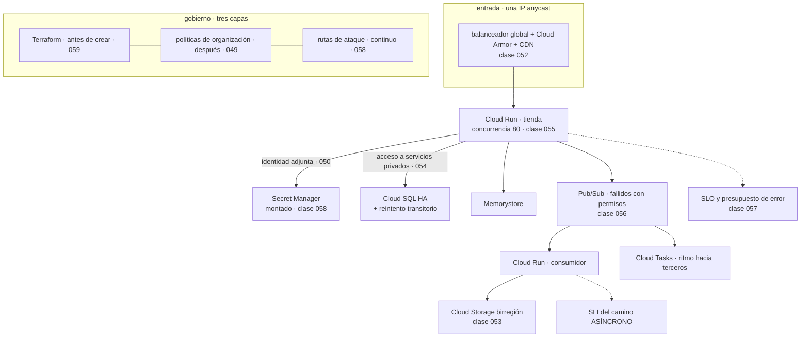

# 060 — Proyecto: aplicación de tres capas en Google Cloud

> [← Clase anterior](../../part-04-gcp-core-platform/059-terraform-y-despliegues-reproducibles-en-gcp/README.md) · [Índice de la parte](../README.md) · [Clase siguiente →](../../part-05-containers-docker-oci/061-imagenes-capas-registros-y-estandar-oci/README.md)

**Parte:** 04 — Google Cloud: plataforma esencial<br>
**Nivel:** intermedio · **Horas estimadas:** 8<br>
**Laboratorio:** `capstone` · **Estado:** `EXECUTABLE_CORE`

## 🎯 Propósito

Integrar las once clases anteriores en una plataforma de Google Cloud que funcione, se observe, falle de forma controlada y cueste algo explicable — y **calificar con evidencia la hipótesis que escribió la clase 048**. Esa hipótesis acertó en dos de tres afirmaciones y falló en la tercera, y el fallo es más valioso que los aciertos: la familia de incidentes más cara de esta parte no fue la que se predijo, y corregir la ley con lo observado es lo que se lleva a la parte 05.

## 📚 Resultados de aprendizaje

Al finalizar podrás:

1. **Trazar** cada componente hasta la clase que lo decidió y la alternativa descartada.
2. **Calificar** la hipótesis de la clase 048 con evidencia, incluida la parte que resultó falsa.
3. **Enunciar** las leyes que ya se han observado en tres plataformas independientes.
4. **Provocar** tres fallos y medir detección, impacto y recuperación, incluida la recuperación bloqueada.
5. **Comparar** tres plataformas por costo por unidad y explicar por qué la mayor partida es la misma en las tres.

## 🧩 Conceptos centrales

| Concepto | Comprensión verificable |
|---|---|
| `hipótesis calificada` | Predicción escrita antes de la evidencia y evaluada después, incluida la parte errónea. Sin la parte errónea no es una hipótesis: es un resumen. |
| `ley observada` | Comportamiento que ha aparecido en **tres plataformas independientes** con tres mecanismos distintos. Deja de ser una peculiaridad del proveedor y pasa a ser una propiedad del problema. |
| `recuperación bloqueada` | Situación en la que la herramienta necesaria para reparar depende de lo que se ha roto. Es el fallo que ningún plan detecta sin ensayarlo. |
| `conmutación parcial` | El tráfico se traslada de región y los datos no. La infraestructura responde correctamente y el servicio incumple su objetivo. |
| `SLI del camino asíncrono` | Indicador de frescura del trabajo en segundo plano. Un SLO de la API no lo cubre: un consumidor detenido no afecta a ninguna petición HTTP. |
| `costo por unidad de negocio` | Única comparación accionable entre plataformas. Compara arquitecturas antes que proveedores, y por eso la mayor partida suele coincidir. |

## 🧠 Modelo mental

Un proyecto de Google Cloud es la unidad práctica de API, cuota, IAM y facturación; la organización aporta la política heredable.

Aplicado a esta clase, separa siempre cuatro planos: **intención** (qué necesita el usuario),
**configuración** (qué declaramos), **estado observado** (qué existe de verdad) y
**evidencia** (cómo sabemos que cumple). Confundirlos produce diseños que se ven correctos
en un diagrama pero fallan al operar.

## 🗺️ Flujo de razonamiento



## 📖 Desarrollo

### 1. De dónde sale cada decisión, y qué trampa evitó

La arquitectura entregada es el resultado de once decisiones con su alternativa descartada. La cuarta columna es la que solo se puede escribir después de recorrer la parte:

| Componente | Requisito | Alternativa descartada | Trampa que evita |
|---|---|---|---|
| Proyectos por servicio y entorno | Cuotas y superficie (049) | Tres proyectos por entorno | La cuota de región que bloquea una campaña |
| Cuenta de servicio dedicada por carga | Privilegio mínimo (050) | La cuenta por defecto | Ejecutar con `Editor` sin saberlo |
| Federación con condición de atributo | Sin claves (050) | Clave en el sistema de CI | Que cualquier repositorio obtenga credenciales |
| Una VPC global, compartida | Simplicidad y gobierno (051) | Una red por equipo | Cinco redes en la sombra sin revisar |
| Firewall dirigido por cuenta de servicio | Integridad del control (051) | Etiquetas de red | Abrir un puerto poniéndose una etiqueta |
| Acceso privado a Google en todas las subredes | Costo y aislamiento (051) | Salida por NAT | Pagar 108 USD/mes por tráfico que no debía salir |
| Cloud Run con concurrencia 80 | Costo y densidad (055) | Concurrencia 1 | Pagar seis veces por costumbre |
| Cloud SQL con reintento transitorio | Continuidad (054) | Confiar en la alta disponibilidad | Perder peticiones en cada conmutación |
| Pub/Sub con fallidos y permisos | Trabajo visible (056) | Fallidos solo configurados | Una red de seguridad que no existe |
| SLO con presupuesto de error | Alertas útiles (057) | Umbrales de recurso | 340 avisos y 6 incidentes |
| Terraform con estado por unidad | Radio de impacto (059) | Un estado compartido | Destruir lo que comparte estado |

Y cuatro decisiones tomadas **en contra** de la traducción literal desde Azure, que son las que un revisor cuestionará:

```text
1. No se replicó el diseño de concentrador y radios.
   La VPC es global: los emparejamientos y las tablas de rutas sobraban (051).

2. No se agruparon servicios en pocos proyectos grandes.
   Las cuotas son por proyecto y los proyectos son baratos: la granularidad
   fina es una decisión de capacidad, no de orden (049).

3. No se usó una única cuenta de almacenamiento por entorno.
   Aquí la ubicación y la clase son propiedades del bucket y del objeto,
   no de una cuenta compartida (053).

4. No se copió la política de ciclo de vida de la parte 03.
   El precio por operación sube al enfriar, y la política traducida
   habría costado más de lo que ahorraba (053).
```

La cuarta es la que mejor resume el riesgo de la portabilidad mal entendida: **un patrón correcto en una plataforma puede destruir valor en otra sin que nada falle**.

### 2. La hipótesis de la clase 048, calificada

La clase 048 dejó escrito, para poder equivocarse de forma comprobable:

> El contrato de once filas se conservará entero en Google Cloud. Las excepciones serán otras diez, distintas de estas, y la que más incidentes producirá volverá a ser una en la que el sistema **funcione por el camino equivocado** en lugar de dar un error.

Tres afirmaciones. Dos se cumplieron y una es falsa.

**Afirmación 1 — el contrato se conserva. CIERTA, con dos matices.**

```text
contrato                                    ¿se conservó?
identidad de carga sin secretos              sí · cuenta de servicio adjunta
sujeto de federación acotado                 sí · y volvió a fallar la 1.ª vez
frontera de aislamiento del entorno          sí · proyecto, pero BARATO
salida declarada con costo por GB            sí · Cloud NAT
acceso privado a servicios gestionados       sí · acceso privado a Google
entrega al menos una vez                     MATIZADO ↓
cola de fallidos con alerta a cero           sí · pero hay que darle permisos
idempotencia en el manejador                 REFORZADO ↓
clave de partición irreversible              sí · tercera forma, silenciosa
prueba negativa por control                  sí · doce ejecutadas
costo por unidad de negocio                  sí
```

Los dos matices son mejoras del contrato, no excepciones:

```text
entrega al menos una vez
  Pub/Sub ofrece entrega EXACTAMENTE UNA VEZ dentro de una región.
  El contrato se refina: lo que no existe en ninguna plataforma
  es el EFECTO exactamente una vez.

idempotencia en el manejador
  gana una razón nueva: la reproducción de mensajes (056).
  Ya no se justifica solo por los duplicados que ocurren,
  sino por los que se provocan a propósito al reparar un daño.
```

**Afirmación 2 — las excepciones serán otras diez. CIERTA.**

Ninguna de las diez de Azure se repitió, y aparecieron diez propias:

```text
el proyecto es barato y cambia la granularidad          049
se pueden crear proyectos fuera de la organización      049
la facturación está fuera de la jerarquía y su
  exportación no es retroactiva                         049
la cuenta de servicio es identidad Y recurso            050
la VPC es global                                        051
el descuento por uso sostenido se aplica solo           052
la reparación automática destruye infraestructura sana  052
el precio por operación sube al enfriar la clase        053
concurrencia por instancia y CPU solo durante la petición 055
el archivo de estado contiene los secretos en claro     059
```

**Afirmación 3 — el peor incidente será «funcionar por el camino equivocado». FALSA.**

Y es el resultado más útil de la parte. En Google Cloud, los equivalentes de aquel fallo **fueron todos ruidosos**:

```text
sin acceso privado a Google         la llamada falla       → 11 min hasta corregir
sin índice en Firestore             la consulta falla      → visible al desplegar
Cloud SQL sin ruta privada          la conexión falla      → visible al desplegar
```

Lo que sí produjo los incidentes más caros fue otra familia:

```text
la cola de fallidos que no recibía nada por falta de permisos    (056)
  1.841 mensajes atascados durante tres semanas, sin una sola alerta,
  porque la ausencia de mensajes se interpretó como buena señal

la regla de ciclo de vida que costó 210 USD para ahorrar 5,22    (053)
  nada falló: cobró

la estimación con precios de lista, que sobrevaloró el gasto     (052)
  nada falló: la conclusión era falsa
```

Las tres tienen una forma común que la clase 048 no supo nombrar. **La ley corregida:**

> El fallo más caro no es el que ocurre por el camino equivocado. Es el de **un mecanismo que parece estar haciendo algo y no lo está** — y su caso más peligroso es aquel en el que la ausencia de señal se interpreta como buena noticia.

Eso incluye el camino privado silencioso de la clase 039, la cola de fallidos vacía de la 056, los registros apagados de la 045 y el control de seguridad revertido de la 046. Cuatro caras del mismo problema, en tres plataformas.

Y la consecuencia operativa, que es lo que se lleva a la parte 05: **todo mecanismo de protección necesita una prueba que lo obligue a actuar**. No basta con que no salten alarmas: hay que provocar la condición y ver la reacción. Una cola de fallidos sin un mensaje envenenado de prueba, una copia de seguridad sin una restauración y un antimalware sin un fichero de prueba son la misma afirmación sin evidencia.

### 3. Diez leyes ya observadas en tres plataformas

Un comportamiento que aparece tres veces con tres mecanismos distintos ha dejado de ser una peculiaridad del proveedor. Estas diez ya cumplen ese criterio, y son el activo que hace barata la cuarta plataforma:

```text
 1. El permiso suma; lo que resta vive en OTRO sistema, con otro error.
    SCP · Azure Policy · políticas de organización y de denegación

 2. El gobierno guarda la puerta y no limpia la casa.
    Inventariar → corregir → imponer. Al revés, panel en verde con
    catorce recursos incumpliendo (046).

 3. Los puertos de traducción de salida se agotan, y el error apunta al destino.
    NAT gateway · puertos repartidos del balanceador · 64 por máquina

 4. El caudal de disco es el MÍNIMO de dos límites, y casi nunca es el que compraste.
    volumen/instancia · disco/máquina · GB del disco/vCPU

 5. La unidad de orden es también la unidad de serialización.
    FIFO · sesiones · particiones · claves de ordenación · claves primarias

 6. La entrega exactamente una vez se compra; el efecto se construye en el manejador.
    Y con reproducción, la idempotencia deja de ser opcional.

 7. La conmutación de una base de datos gestionada es funcionamiento normal.
    El cliente reintenta o pierde peticiones, con las alarmas en verde (048).

 8. Con versionado, borrar no libera nada hasta que una regla retire las versiones.
    Marcadores de borrado · versiones · versiones no actuales

 9. Una traza se corta en el salto que alguien escribió a mano.
    Y siempre es el interesante.

10. Leer un secreto en cada petición agota una cuota, y el error parece de la
    base de datos.  Key Vault · Secret Manager · gestores equivalentes
```

Diez leyes, cada una observada de forma independiente en tres implementaciones que no comparten código. Y una observación sobre su naturaleza que merece decirse: **ninguna de las diez es un fallo de las plataformas**. Todas son consecuencias de problemas reales —traducción de direcciones, orden distribuido, límites de E/S, entrega en red no fiable— que cualquier implementación tiene que resolver de alguna manera.

Eso convierte la lista en algo más útil que un resumen: es un **cuestionario para la plataforma siguiente**. Ante un proveedor nuevo, las diez preguntas ya están escritas y solo hay que averiguar cómo se llaman aquí las respuestas y dónde está la excepción.

Y dos afirmaciones que **no** han alcanzado ese estatus y conviene no dar por buenas:

```text
"el archivo de estado es un problema"     depende de la herramienta, no del proveedor
"lo global es mejor que lo regional"      la VPC global simplifica y la
                                          conmutación parcial es un riesgo nuevo (abajo)
```

### 4. Tres fallos provocados y lo que enseñó cada uno

Los tres se eligieron para atacar supuestos distintos, y los tres dejaron un hallazgo que ninguna revisión de configuración habría dado.

**Fallo 1 — pérdida de una zona.** Se retiran las instancias de `europe-west1-b` y se fuerza la conmutación de Cloud SQL.

```text
detección por alerta de consumo de presupuesto   1 min 10 s
errores durante la conmutación de la base           0   ← el reintento estaba (048)
p95 durante el episodio                          142 ms
recuperación completa                            2 min 05 s
```

Cero errores en la conmutación. Es la segunda vez que un problema conocido no cuesta nada, porque estaba escrito en el contrato.

**Y el hallazgo, que es nuevo.** Al perder capacidad en la región europea, el balanceador global desbordó tráfico a `us-east1`, tal como se había diseñado. Pero la base de datos seguía en Europa:

```text
peticiones servidas desde us-east1               18.400
p99 de esas peticiones                           612 ms   (SLO: 500 ms)
causa                                            latencia transatlántica
                                                 hacia la base de datos primaria
```

**La conmutación funcionó en la capa de red y rompió el objetivo en la capa de datos.** El desbordamiento por capacidad de la clase 052 mueve el cómputo y no mueve los datos, y ninguna de las dos piezas está mal configurada.

```text
correcciones
1. réplica de lectura en us-east1, y lecturas dirigidas a la local
2. las escrituras siguen yendo a Europa: se acepta y se documenta
3. el escalador de capacidad de us-east1 se limita a 0,3:
   absorbe un pico, no sustituye a la región
4. el simulacro pasa a medir el p99 POR REGIÓN DE ORIGEN, no agregado
```

La cuarta es la que habría detectado el problema sin romper nada: el percentil agregado estaba dentro del objetivo porque solo el 12 % del tráfico venía de la otra región.

**Fallo 2 — revocación de una clave del cliente.** Se retira el permiso de la identidad sobre `k-facturas`.

```text
servicios afectados esperados     1 (subida de facturas)
servicios afectados reales        1                       ← la separación funcionó
recuperación tras restaurar       4 min
```

La separación por propósito de la clase 058, que venía del simulacro de la clase 048, evitó el radio de impacto ampliado. Pero apareció otra cosa:

**El hallazgo: la recuperación estaba bloqueada por lo que se había roto.** El bucket del estado de Terraform usaba la misma clave, así que el intento de restaurar el permiso mediante la canalización falló:

```text
Error: googleapi: Error 403: The caller does not have permission
  to use kms key … for bucket cls-tfstate-prod
```

La herramienta que arregla la plataforma dependía de la clave que se acababa de revocar. La recuperación se hizo a mano, con una identidad de emergencia, y tardó cuatro minutos porque alguien conocía el camino — no porque estuviera escrito.

```text
correcciones
1. el bucket de estado usa una clave PROPIA, en otro anillo
2. procedimiento de recuperación con identidad de emergencia, escrito y ensayado
3. regla general añadida a la línea base:
   ninguna herramienta de recuperación puede depender de lo que recupera
```

**Fallo 3 — consumidor detenido en silencio.** El fallo que este programa ha provocado en las tres plataformas.

```text                         parte 02   parte 03   parte 04
detección                      no hubo    4 min 20 s  3 min 40 s
mensajes acumulados            14         680         512
```

**El hallazgo:** la alerta de acumulación se disparó y **la alerta de presupuesto de error no**, exactamente como la clase 057 anticipó — un consumidor detenido no afecta a ninguna petición HTTP, así que el SLI de la API no se mueve. Al revisarlo, apareció el hueco real:

```text
SLO definidos               1 · disponibilidad y latencia de la API
SLO del camino asíncrono    ninguno
```

La plataforma tenía un objetivo para lo que el usuario ve al pulsar y ninguno para lo que espera recibir después.

```text
corrección
SLI de frescura: proporción de notificaciones enviadas en menos de 5 min
SLO 99 % en 28 días, con alerta por velocidad de consumo
→ el mismo mecanismo de la clase 057, aplicado a un camino que no es HTTP
```

Los tres hallazgos comparten forma con los de la clase 048 y merece señalarlo: **la infraestructura aguantó los tres fallos, y en los tres había algo que ninguna revisión de configuración podía mostrar** — una latencia entre capas, una dependencia circular de recuperación y un objetivo que nunca se definió.

### 5. La entrega, las tres plataformas y la pregunta que abre la parte 05

**La entrega, sin conocimiento tácito.**

```text
infraestructura     Terraform, 4 estados, plan revisado y validado por políticas
línea base          24 afirmaciones, cada una con su prueba negativa
verificar.sh        ejecuta las 24 y devuelve código de salida
políticas           de organización, y validación sobre el plan
ADR                 11 decisiones con su alternativa descartada
riesgos residuales  5, con responsable y condición de revisión
SLO                 2: camino síncrono y camino asíncrono
consultas guardadas 4, enlazadas desde el manual de operación
procedimientos      3 fallos ensayados, con verificación posterior
línea base medida   rendimiento, costo y costo por pedido
```

Los **cinco riesgos residuales**:

```text
1. las escrituras solo ocurren en Europa: la conmutación a us-east1 es parcial
2. Secret Manager no rota por sí solo: la función de rotación es código propio
3. el gestor de claves externo se descartó; se revisará si hay obligación contractual
4. dos cuentas de emergencia con acceso permanente, documentadas
5. los registros de acceso a datos solo están activos en 4 proyectos
```

**La comparación de las tres plataformas, hecha de forma que signifique algo.**

```text                                      AWS (036)   Azure (048)   Google (060)
rps sostenidos                               987,4        984,1         985,7
p50                                         38,4 ms      41,2 ms       39,8 ms
p95                                         91,2 ms      96,8 ms       94,1 ms
p99                                        184,7 ms     203,5 ms      197,2 ms
p99/p50                                       4,8×         4,9×          5,0×
errores                                          0            0             0
```

**No hay diferencia significativa de rendimiento a esta escala.** Es la segunda vez que se mide y la conclusión se repite, así que ya se puede afirmar: a este volumen, el rendimiento no es un criterio de elección entre proveedores. Lo que decide son capacidades, costo por unidad, requisitos de residencia y competencias del equipo.

Y el costo, desglosado hasta que cada partida tenga nombre:

```text                                     AWS      Azure     Google
entrada y borde                             48       185         62
cómputo de aplicación                      164       344         84
base de datos relacional                   210       390        390
caché                                       46        55         58
mensajería                                  31        22         29
almacenamiento y salida                     42        48         34
salida a internet (NAT)                     58        69         68
telemetría                                  52       110         88
seguridad y gobierno                        37        96         48
                                          ─────     ─────      ─────
total                                      688       940        861
costo por pedido                       0,000702  0,000959   0,000879
```

Dos lecturas, y la segunda es la importante.

La primera: Google Cloud queda entre las dos, un 25 % por encima de AWS y un 8 % por debajo de Azure. Las diferencias tienen nombre: el cómputo de aplicación es menos de la mitad que en Azure por la concurrencia de la clase 055, y el borde cuesta un tercio que la pasarela con WAF.

La segunda: **la mayor partida es la misma en las tres, y en dos de ellas es idéntica**. La base de datos relacional aprovisionada es entre el 30 % y el 45 % del total en todos los casos, porque es la misma decisión de arquitectura tomada tres veces. Y de ahí la conclusión que cierra las cuatro partes:

> Comparar proveedores compara tu arquitectura contigo mismo. La partida que domina la factura la eligió el equipo, no el proveedor.

Cambiar de nube habría movido el 25 %. Cambiar la decisión de datos —a un motor que escala a cero, a un modelo que no necesita una instancia encendida 720 horas al mes— movería más, y no depende de ningún proveedor.

**Y la pregunta que abre la parte 05.**

En las tres plataformas, la capa de aplicación acabó ejecutando **contenedores**: Cloud Run aquí, Container Apps allí, servicios gestionados de contenedor en AWS. Las tres convergieron sin que nadie lo planificara, y eso reorienta la pregunta:

> Si el contenedor es la unidad de despliegue en las tres nubes, ¿qué garantiza exactamente ese contrato y dónde deja de garantizar? ¿Qué parte de lo aprendido en estas cuatro partes es del proveedor, y qué parte es de la plataforma que ejecuta el contenedor?

La hipótesis que se escribe ahora, para poder equivocarse otra vez de forma comprobable:

> El contrato del contenedor —imagen, proceso, puerto, variables, señales— será portable de verdad, y **las fugas estarán en los bordes**: almacenamiento persistente, red, identidad y todo lo que ocurre antes del primer proceso y después de la señal de terminación. Y volverá a aparecer al menos una de las diez leyes de esta clase, con un mecanismo nuevo.

La parte 05 la califica.

## 🔬 Ejemplo trabajado

**Entrega del capstone de la parte 04, con las cifras que se llevan a la parte 05.**

**Verificación completa.** Las 24 afirmaciones de la línea base:

```bash
$ ./verificar.sh
✓ federación deniega desde otro repositorio       permiso denegado
✓ ninguna clave de cuenta de servicio             0 encontradas
✓ creación de claves bloqueada                    violación de restricción
✓ bucket no público                               412 · publicAccessPrevention
✓ recuperación de bucket                          50 objetos restaurados
✓ facturado converge con lo visible               430 GiB / 412 GiB
✓ URL firmada sin claves, 15 min                  caduca correctamente
✓ subred sin salida a internet                    tiempo agotado a los 5 s
✓ firewall dirigido por identidad                 UNREACHABLE por 22
✓ acceso privado a Google activo                  resuelve interno
✓ Cloud SQL sin IP pública                        tiempo agotado
✓ reintento de errores transitorios               conmutación sin errores
✓ punto caliente de Spanner                       6.400 escrituras/s
✓ servicios internos no públicos                  403 sin testigo
✓ concurrencia verificada bajo carga              0 respuestas cruzadas
✓ cola de fallidos recibe                         mensaje envenenado llega
✓ acumulación en cola alerta                      aviso en 3 min 40 s
✓ auditoría de acceso a datos activa              entrada localizada
✓ traza completa entre servicios                  6 de 6 tramos
✓ destrucción de versión de clave                 restaurada en la ventana
✓ rotación de secreto con tráfico                 0 errores
✓ estado de Terraform con acceso mínimo           2 principales
✓ plan aplicado idéntico al revisado              tfplan verificado
✓ pedido con comilla simple y punto y coma        201
24/24 correctas
```

**Línea base medida:**

```text
rps 985,7 · p50 39,8 ms · p95 94,1 ms · p99 197,2 ms · errores 0
L = 985,7 × 0,0398 = 39,2 de 50 solicitados → medida válida
p99/p50 = 5,0×
costo 861 USD/mes · 0,000879 USD/pedido
```

**Los tres fallos, con lo aprendido en cada uno:**

```text                        detección    p95 durante   pérdida real   lección
pérdida de zona               1 min 10 s    142 ms      0 peticiones   la conmutación
                                                        18.400 fuera    mueve el cómputo
                                                        del SLO         y no los datos

revocación de clave           inmediata        —        1 servicio      la herramienta de
                                                        (lo previsto)   recuperación no
                                                                        puede depender de
                                                                        lo que recupera

consumidor detenido           3 min 40 s   sin cambio   512 mensajes    faltaba un SLO
                                                        retrasados      para el camino
                                                                        asíncrono
```

**El hallazgo que justificó el capstone.** Durante la pérdida de zona, todos los paneles agregados estuvieron dentro del objetivo:

```text
p99 agregado durante el episodio     213 ms   (SLO 500 ms)      ✓ verde
presupuesto de error consumido        0,7 %                     ✓ verde
```

Y al desglosar por región de origen:

```sql
SELECT region_origen,
       APPROX_QUANTILES(latencia_ms, 100)[OFFSET(99)] AS p99,
       COUNT(*) AS peticiones
FROM peticiones
WHERE ts BETWEEN '2026-07-30 14:02' AND '2026-07-30 14:07'
GROUP BY region_origen
```

```text
europe-west1   p99  148 ms   134.900 peticiones
us-east1       p99  612 ms    18.400 peticiones      ← fuera del SLO
```

**Dieciocho mil cuatrocientas peticiones fuera del objetivo, invisibles en el agregado** porque eran el 12 % del tráfico. La infraestructura hizo exactamente lo que se le pidió: desbordar a la región con capacidad. Nadie había comprobado qué latencia tendría esa región contra una base de datos que seguía en Europa.

```text
síntoma observable   ninguno: percentil agregado en verde,
                     presupuesto de error casi intacto
consecuencia real    12 % de los usuarios con latencia 4× durante 5 minutos
causa                el desbordamiento mueve el cómputo, no los datos
qué lo destapó       desglosar por región, no el simulacro en sí
```

Repetido el simulacro con las cuatro correcciones:

```text                              antes de corregir   después
p99 desde us-east1                       612 ms         171 ms
peticiones fuera del SLO                 18.400              0
escalador de capacidad de us-east1          1,0            0,3
SLO medidos por región de origen            no              sí
```

**Se entrega a la parte 05 con:**

```text
diez leyes observadas en tres plataformas independientes
contrato portable de once filas, dos de ellas refinadas
la ley corregida sobre la familia de fallos más cara
24 afirmaciones y su guion de verificación
11 decisiones con alternativa descartada
5 riesgos residuales con responsable
comparación de costo por pedido en tres nubes, desglosada
```

Y la hipótesis escrita para la parte 05, que ya se puede calificar dentro de doce clases:

> El contrato del contenedor será portable de verdad y las fugas estarán en los bordes —almacenamiento, red, identidad, arranque y terminación—. Volverá a aparecer al menos una de las diez leyes, con un mecanismo nuevo.

**La lección que esta parte deja al programa**: la hipótesis de la clase 048 acertó en el contrato y en las excepciones, y **falló en predecir qué familia de fallos costaría más**. Corregir esa predicción con evidencia vale más que haberla acertado: la familia real —un mecanismo que parece estar protegiendo y no lo está— explica el fallo más caro de las tres partes, y su antídoto es una sola regla que ahora está escrita en la línea base: **todo mecanismo de protección necesita una prueba que lo obligue a actuar**.

## 🧪 Laboratorio guiado

Ejecuta desde la raíz:

```bash
python classes/part-04-gcp-core-platform/060-proyecto-aplicacion-de-tres-capas-en-google-cloud/lab.py
```

El laboratorio selecciona el motor de práctica **`capstone`** y produce
`lab_result.json`. El escenario, sus comprobaciones y el artefacto esperado corresponden a
esta clase; no requiere credenciales y deja explícito qué debe revalidarse en un sandbox real.

1. Lee `exercise.steps` y formula una predicción antes de ejecutar.
2. Ejecuta la práctica y verifica todos los elementos de `checks`.
3. Provoca el caso de `negative_test` y explica la señal observada.
4. Materializa `plataforma-gcp` en `evidence/` usando la plantilla indicada.
5. Para proveedor real, sigue `sandbox.requires`, registra costo y ejecuta `destroy`.

### Evidencia esperada

El artefacto principal es un incremento integrado, demostrable y documentado. Además, la entrega debe incluir el comando ejecutado,
la salida estructurada y una conclusión que no exceda lo observado.

## 🏆 Reto verificable

Construye **`plataforma-gcp`** para el caso CloudShop. Incluye una alternativa descartada,
un supuesto que pueda falsarse, una prueba de fallo y una decisión de rollback.

## ✅ Criterio de aceptación

- [ ] `lab.py` termina con código 0 y genera JSON válido.
- [ ] La entrega conecta al menos tres requisitos con mecanismos verificables.
- [ ] Existe una prueba positiva y una prueba negativa con evidencia.
- [ ] Seguridad, costo y operación aparecen como decisiones, no como anexos.
- [ ] Se declara una limitación y una condición que obligaría a revisar el diseño.
- [ ] Otra persona puede repetir el recorrido sin conocimiento tácito.

## ⚠️ Errores frecuentes

| Síntoma | Causa probable | Corrección |
|---|---|---|
| El percentil agregado está dentro del objetivo y hay usuarios claramente afectados | Una minoría del tráfico, desde otra región u origen, queda diluida en el agregado | Mide y alerta por región de origen y por segmento, no solo agregado; el simulacro debe desglosarlo. |
| El tráfico conmuta de región y el servicio incumple su objetivo igualmente | El desbordamiento por capacidad mueve el cómputo y no los datos | Réplica de lectura local, escalador de capacidad limitado en la región secundaria y decisión escrita sobre dónde se escribe. |
| La recuperación de un incidente falla porque la herramienta depende de lo que se rompió | El estado o la canalización usan el mismo recurso o la misma clave que se ha revocado | Aísla lo que recupera de lo que se recupera, y ensaya el procedimiento con una identidad de emergencia. |
| Un consumidor detenido no dispara ninguna alerta de objetivo de servicio | El SLI mide peticiones HTTP y el camino asíncrono no tiene objetivo propio | Define un SLI de frescura para el trabajo en segundo plano y aplícale el mismo mecanismo de presupuesto de error. |
| Una política correcta en otra plataforma cuesta dinero en esta | El modelo de precios cambia el punto de equilibrio, aunque el patrón sea el mismo | Recalcula la aritmética con los precios de la plataforma antes de trasladar cualquier política de ciclo de vida o de escalado. |
| Se elige proveedor por precio y la factura no cambia lo esperado | La mayor partida es una decisión de arquitectura idéntica en las tres plataformas | Desglosa hasta que cada partida tenga nombre; la decisión de datos suele mover más que la de proveedor. |

## 🛡️ Seguridad, ética y costo

Trabaja con cuentas propias o sandboxes autorizados. No publiques secretos, identificadores
reales ni datos personales. Antes de crear recursos pagos define presupuesto, etiquetas y
comando de destrucción; después verifica que no queden recursos huérfanos. Los ejemplos
locales enseñan contratos, pero no certifican cumplimiento ni disponibilidad de producción.

## ❓ Preguntas de comprobación

1. ¿Cuáles de las tres afirmaciones de la hipótesis de la clase 048 se cumplieron, y qué dice la ley corregida?
2. Enumera cuatro de las diez leyes observadas en tres plataformas y el mecanismo distinto que tuvo cada una.
3. Durante la pérdida de zona todo estaba en verde y 18.400 peticiones incumplían el SLO. ¿Por qué, y qué medición lo habría mostrado?
4. ¿Qué significa que la herramienta de recuperación dependa de lo que recupera, y cómo se evita?
5. ¿Por qué la mayor partida de costo coincide en las tres plataformas y qué implica eso al elegir proveedor?

## 🔗 Referencias

- Google Cloud (2025). *Architecture Framework* — los pilares como rejilla de revisión de la entrega. <https://cloud.google.com/architecture/framework>
- Google Cloud (2025). *Patterns for scalable and resilient apps* — desbordamiento entre regiones y ubicación de los datos. <https://cloud.google.com/architecture/scalable-and-resilient-apps>
- Google Cloud (2025). *Disaster recovery planning guide* — RTO, RPO y ensayo de procedimientos. <https://cloud.google.com/architecture/dr-scenarios-planning-guide>
- Google (2018). *The Site Reliability Workbook*, cap. 2 — SLI, SLO y alertas por consumo de presupuesto de error. <https://sre.google/workbook/implementing-slos/>
- Google Cloud (2025). *Landing zone design in Google Cloud* — jerarquía, red e identidad como línea base declarada. <https://cloud.google.com/architecture/landing-zones>
- Documentación oficial vigente del servicio implementado; registra URL y fecha de consulta.

---

> [Evaluación](assessment.md) · [Contrato de clase](lesson.yaml) · [Índice de la parte](../README.md)
