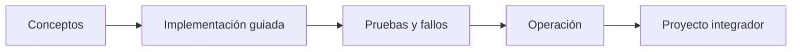

# Parte 04 — Google Cloud: plataforma esencial

> [← Parte 03](../part-03-azure-core-platform/README.md) · [Índice completo](../README.md) · [Parte 05 →](../part-05-containers-docker-oci/README.md)

**Nivel:** intermedio · **Clases:** 12 · **Duración sugerida:** 6–8 semanas

Diseñar y operar una carga en Google Cloud con proyectos, identidades y datos bien delimitados.

## Resultados de la parte

Al completar esta parte podrás explicar el dominio con lenguaje independiente del proveedor,
implementar sus mecanismos esenciales, diagnosticar fallos y defender decisiones mediante
evidencia, costo, seguridad y objetivos de confiabilidad.

## Modelo mental

Un proyecto de Google Cloud es la unidad práctica de API, cuota, IAM y facturación; la organización aporta la política heredable.

## Secuencia

## Clases

| ID | Clase | Laboratorio | Horas |
|---:|---|---|---:|
| 049 | [Organización, folders, proyectos, billing y cuotas](049-organizacion-folders-proyectos-billing-y-cuotas/README.md) | `governance` | 4 |
| 050 | [IAM, service accounts y Workload Identity Federation](050-iam-service-accounts-y-workload-identity-federation/README.md) | `iam` | 4 |
| 051 | [VPC global, subredes regionales, firewall y Cloud NAT](051-vpc-global-subredes-regionales-firewall-y-cloud-nat/README.md) | `network` | 4 |
| 052 | [Compute Engine, managed instance groups y load balancing](052-compute-engine-managed-instance-groups-y-load-balancing/README.md) | `compute` | 4 |
| 053 | [Cloud Storage, clases, lifecycle y replicación](053-cloud-storage-clases-lifecycle-y-replicacion/README.md) | `storage` | 4 |
| 054 | [Cloud SQL, Spanner, Firestore y Memorystore](054-cloud-sql-spanner-firestore-y-memorystore/README.md) | `data` | 4 |
| 055 | [Cloud Run, Cloud Functions y API Gateway](055-cloud-run-cloud-functions-y-api-gateway/README.md) | `serverless` | 4 |
| 056 | [Pub/Sub, Cloud Tasks y Workflows](056-pub-sub-cloud-tasks-y-workflows/README.md) | `messaging` | 4 |
| 057 | [Cloud Logging, Monitoring, Trace y Audit Logs](057-cloud-logging-monitoring-trace-y-audit-logs/README.md) | `observability` | 4 |
| 058 | [Cloud KMS, Secret Manager y Security Command Center](058-cloud-kms-secret-manager-y-security-command-center/README.md) | `security` | 4 |
| 059 | [Terraform y despliegues reproducibles en GCP](059-terraform-y-despliegues-reproducibles-en-gcp/README.md) | `iac` | 4 |
| 060 | [Proyecto: aplicación de tres capas en Google Cloud](060-proyecto-aplicacion-de-tres-capas-en-google-cloud/README.md) | `capstone` | 8 |

## Evaluación de la parte

- 35 % laboratorios y evidencia reproducible.
- 25 % retos verificables.
- 20 % decisiones y ADR.
- 10 % seguridad, confiabilidad y costo.
- 10 % proyecto integrador de la parte.

Se aprueba con 80 % de clases en nivel B o superior y el proyecto integrador reproducible.

## Pauta bibliográfica

- Google Cloud Architecture Framework — Google.
- Official Google Cloud Certified Professional Cloud Architect Study Guide — Dan Sullivan.
- Data Engineering with Google Cloud Platform — Adi Wijaya.
