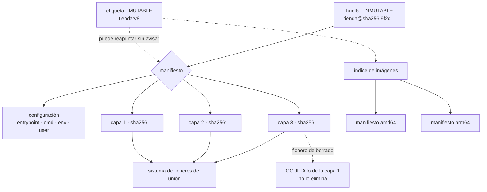

# 061 — Imágenes, capas, registros y estándar OCI

> [← 060 · Proyecto: aplicación de tres capas en Google Cloud](../../part-04-gcp-core-platform/060-proyecto-aplicacion-de-tres-capas-en-google-cloud/README.md) · [Índice de la parte](../README.md) · [062 · Dockerfile reproducible y builds multi-stage →](../../part-05-containers-docker-oci/062-dockerfile-reproducible-y-builds-multi-stage/README.md)

**Parte:** 05 — Contenedores, Docker y OCI<br>
**Nivel:** intermedio · **Horas estimadas:** 4<br>
**Laboratorio:** `container` · **Estado:** `EXECUTABLE_CORE`

## 🎯 Propósito

Establecer con precisión qué es una imagen de contenedor y qué garantiza exactamente el estándar OCI, porque de ahí sale la primera mitad del contrato que la clase 060 dejó por comprobar. Una imagen no es un fichero: es un manifiesto que apunta a capas por su huella, y esa propiedad decide tres cosas que en producción se pagan caras — que una etiqueta puede cambiar bajo tus pies, que un fichero borrado sigue dentro, y que la misma etiqueta puede entregar imágenes distintas según la arquitectura de quien la descarga.

## 📚 Resultados de aprendizaje

Al finalizar podrás:

1. **Describir** qué normaliza cada una de las tres especificaciones OCI y qué queda fuera del contrato.
2. **Desplegar** por huella en vez de por etiqueta, y justificar la diferencia con un incidente concreto.
3. **Demostrar** que un fichero borrado en una capa posterior sigue presente en la imagen.
4. **Construir** y verificar un índice de imágenes para varias arquitecturas.
5. **Leer** la configuración de una imagen y distinguir lo que el motor aplica de lo que es solo documentación.

## 🧩 Conceptos centrales

| Concepto | Comprensión verificable |
|---|---|
| `manifiesto` | Documento JSON que enumera la configuración y las capas de una imagen **por su huella**. La imagen no es un archivo: es este documento y lo que referencia. |
| `direccionamiento por contenido` | Todo se identifica por `sha256`. Una **etiqueta es un puntero mutable**; una huella es inmutable y verificable. |
| `índice de imágenes` | Manifiesto que apunta a varios manifiestos, uno por arquitectura y sistema operativo. Explica que la misma etiqueta entregue binarios distintos a máquinas distintas. |
| `capa` | Archivo tar con las diferencias respecto de la anterior. Las capas se apilan en un sistema de ficheros de unión y **una capa nunca modifica a la anterior**: la tapa. |
| `fichero de borrado` | Marca especial que oculta un fichero de una capa inferior. Lo oculta: **no lo elimina**, así que sigue extraíble de la imagen. |
| `configuración de la imagen` | JSON con punto de entrada, comando, variables, usuario y directorio de trabajo. Es el contrato de ejecución — y parte de sus campos son solo documentación. |

## 🧠 Modelo mental

Una imagen es un artefacto inmutable; un contenedor es un proceso aislado con límites y dependencias explícitas, no una máquina virtual pequeña.

Aplicado a esta clase, separa siempre cuatro planos: **intención** (qué necesita el usuario),
**configuración** (qué declaramos), **estado observado** (qué existe de verdad) y
**evidencia** (cómo sabemos que cumple). Confundirlos produce diseños que se ven correctos
en un diagrama pero fallan al operar.

## 🗺️ Flujo de razonamiento



## 📖 Desarrollo

### 1. Tres especificaciones, y lo que queda fuera

«Contenedor OCI» no es una cosa sino tres normas que encajan:

```text
especificación de IMAGEN        cómo se describe y se empaqueta
  manifiesto, configuración, capas, índice para varias arquitecturas

especificación de EJECUCIÓN     cómo se arranca un contenedor a partir de un
  paquete de sistema de ficheros y un `config.json` con espacios de nombres,
  límites y capacidades

especificación de DISTRIBUCIÓN  cómo se sube y se baja de un registro
  una API HTTP con verbos, huellas y un flujo de autenticación
```

Lo que garantizan juntas es exactamente lo que la clase 060 llamó «el contrato del contenedor»: **una imagen construida con una herramienta se ejecuta con otro motor y se guarda en cualquier registro**, sin acuerdos privados entre fabricantes. Esa portabilidad es real y es lo que hizo que las tres nubes convergieran.

Y conviene ser igual de preciso con lo que **no** normalizan, porque ahí están las fugas que la hipótesis predijo:

```text
fuera del contrato
  cómo se CONSTRUYE la imagen        (Dockerfile no es una norma OCI)
  la red: nombres, DNS, publicación de puertos
  el almacenamiento persistente y su ciclo de vida
  la identidad con la que el contenedor habla con el exterior
  la orquestación: reinicio, escalado, ubicación
  la política de seguridad efectiva del anfitrión
```

Esa lista es el índice de las once clases siguientes, y no es casualidad: **todo lo que la norma no cubre es donde cada plataforma decide por su cuenta**, y donde una aplicación que «funciona en mi máquina» deja de funcionar en otra.

Una precisión que ahorra confusión de vocabulario:

```text
imagen        el artefacto: manifiesto + configuración + capas
contenedor    una ejecución de esa imagen, con su capa de escritura propia
registro      el almacén que sirve manifiestos y capas por huella
motor         quien las descarga y prepara: containerd, CRI-O, Podman, Docker
tiempo de ejecución  quien crea el proceso aislado: runc, crun, youki
```

Docker es un producto que integra varias de esas piezas; ninguna de ellas es «Docker» en el sentido normativo. Saberlo importa porque las plataformas gestionadas de las partes 02 a 04 ejecutan contenedores **sin Docker**, y aun así ejecutan las mismas imágenes.

### 2. La etiqueta miente; la huella no

Esta es la regla operativa más importante de la clase, y la que más incidentes evita.

Una imagen se identifica de dos formas:

```text
registro/tienda:v8                       ETIQUETA · puntero mutable
registro/tienda@sha256:9f2c4a…           HUELLA   · contenido exacto
```

Una etiqueta es un nombre que apunta a un manifiesto y **puede reapuntar en cualquier momento**. Nada impide reconstruir y volver a subir `v8` con otro contenido. Y `latest` no tiene ninguna propiedad especial: es una etiqueta por defecto, no «la última».

Las consecuencias en producción son tres y se dan juntas:

```text
1. la plataforma puede reiniciar una instancia y descargar OTRA imagen
   sin que nadie haya desplegado nada
2. dos instancias del mismo servicio pueden estar ejecutando
   contenidos distintos con la misma etiqueta
3. la investigación de un incidente no puede reconstruir qué se ejecutaba
```

La comprobación es directa:

```bash
$ docker inspect --format '{{index .RepoDigests 0}}' registro/tienda:v8
registro/tienda@sha256:9f2c4a1b…

$ crane digest registro/tienda:v8
sha256:9f2c4a1b…
```

Y la regla que se deriva, que debe estar en la línea base de cualquier plataforma:

```text
se CONSTRUYE con etiquetas legibles
se DESPLIEGA por huella
la canalización resuelve la etiqueta a huella una vez y propaga la huella
```

Esa resolución única es la pieza práctica: la canalización descubre la huella al publicar y la escribe en el manifiesto de despliegue, de modo que lo que se revisó y lo que se ejecuta son verificablemente lo mismo — el mismo argumento del plan guardado de la clase 059.

Complementariamente, los registros permiten **etiquetas inmutables**, que rechazan la reescritura:

```bash
$ gcloud artifacts repositories update cls --immutable-tags
$ aws ecr put-image-tag-mutability --repository-name tienda --image-tag-mutability IMMUTABLE
```

Con eso, `v8` significa siempre lo mismo. Es una defensa en profundidad y no sustituye a desplegar por huella: la etiqueta inmutable protege de la reescritura y no protege de que alguien despliegue una etiqueta distinta de la revisada.

Y hay una tercera cara del mismo problema, que aparece cuando alguien intenta "limpiar": **borrar una etiqueta no borra el contenido**, y borrar un manifiesto puede dejar imágenes rotas si comparten capas y se aplica una recolección agresiva. Los registros lo resuelven con recolección de basura por referencias; la regla de operación es no borrar por antigüedad sin comprobar que nada en producción apunta a esa huella.

### 3. Las capas apilan y tapan: lo borrado sigue dentro

Una imagen se compone de capas, cada una un archivo tar con las diferencias respecto de la anterior. Se montan apiladas en un sistema de ficheros de unión, y de ahí salen dos propiedades con consecuencias opuestas.

**La buena: las capas se comparten.** Dos imágenes con la misma base comparten esas capas en el registro y en el disco del nodo. Se descargan una vez. Ese es el argumento real para tener una base común en la organización, y se mide:

```text
12 servicios con bases distintas   descarga inicial por nodo: 3,4 GB
12 servicios con base común        descarga inicial por nodo: 780 MB
```

**La peligrosa: una capa no modifica a la anterior, la tapa.** Borrar un fichero en una capa posterior escribe un **fichero de borrado** que lo oculta en la vista final. El contenido original sigue en la capa donde entró:

```dockerfile
COPY .npmrc /root/.npmrc      # capa 3: el token entra en la imagen
RUN npm ci && rm /root/.npmrc # capa 4: lo oculta, no lo elimina
```

Y se demuestra en tres órdenes:

```bash
$ docker save registro/tienda:v8 -o imagen.tar
$ mkdir -p x && tar -xf imagen.tar -C x
$ for capa in x/blobs/sha256/*; do
    tar -tzf "$capa" 2>/dev/null | grep -q '\.npmrc' && echo "token en $capa"
  done
token en x/blobs/sha256/4b1e9c…
```

Cualquiera que pueda descargar la imagen puede extraer ese fichero. **Un secreto que ha estado en una capa está comprometido**, y la respuesta no es cambiar el `Dockerfile`: es rotar el secreto y después cambiar el `Dockerfile`. La forma correcta de construir sin dejar rastro es de la clase 062.

La misma propiedad explica por qué «limpiar al final» no reduce el tamaño:

```dockerfile
RUN apt-get install -y build-essential   # capa: +380 MB
RUN apt-get remove -y build-essential    # capa: +2 KB de marcas de borrado
# la imagen sigue pesando 380 MB más
```

Y una precisión sobre el tamaño que evita optimizar lo que no importa: **lo que cuesta tiempo no es el tamaño de la imagen sino las capas que el nodo aún no tiene**. Un servicio que cambia solo su capa de aplicación descarga unos megabytes aunque la imagen pese 900. Por eso el orden de las capas —lo estable abajo, lo volátil arriba— importa más que el total, y es el eje de la clase siguiente.

Un último detalle que aparece al inspeccionar imágenes ajenas: el historial de construcción viaja **dentro de la configuración**, así que las órdenes ejecutadas son legibles por cualquiera que tenga la imagen:

```bash
$ docker history --no-trunc registro/tienda:v8 | head -5
```

Un argumento con una contraseña en línea queda ahí registrado aunque el fichero no exista en el sistema de ficheros final.

### 4. Una etiqueta, varias arquitecturas

El **índice de imágenes** es un manifiesto que apunta a otros manifiestos, uno por plataforma:

```bash
$ docker manifest inspect registro/tienda:v8 | \
    jq -r '.manifests[] | "\(.platform.os)/\(.platform.architecture)  \(.digest[0:19])"'
linux/amd64   sha256:9f2c4a1b3d5e
linux/arm64   sha256:71ae0c9d2f48
```

El motor elige el que corresponde a su máquina. Por eso `docker pull tienda:v8` entrega binarios distintos en un portátil con procesador ARM y en un servidor amd64, **con la misma etiqueta y sin que nada lo indique**.

El fallo que produce es característico y desconcierta la primera vez:

```text
exec /usr/local/bin/app: exec format error
```

No es una imagen corrupta: es una imagen para otra arquitectura. Ocurre cuando alguien construye en su portátil y publica, porque la construcción local produce **solo** la plataforma del anfitrión.

La construcción correcta declara las plataformas:

```bash
$ docker buildx build --platform linux/amd64,linux/arm64 \
    -t registro/tienda:v8 --push .
```

Y la verificación forma parte de la publicación, no de la confianza:

```bash
$ docker manifest inspect registro/tienda:v8 | jq -e \
    '[.manifests[].platform.architecture] | contains(["amd64","arm64"])' \
  && echo "índice correcto"
```

Dos matices operativos que conviene conocer antes de adoptar varias arquitecturas:

**La construcción cruzada por emulación es lenta.** Construir arm64 sobre amd64 emulando puede multiplicar por cinco o por diez el tiempo, sobre todo si hay compilación. La alternativa es construir cada plataforma en un nodo nativo y unir los manifiestos, que es más trabajo de canalización y mucho más rápido.

**No todo se comporta igual en ambas.** Dependencias con extensiones nativas, bibliotecas con rutas de código específicas y diferencias de rendimiento por núcleo hacen que «funciona en amd64» no implique «funciona en arm64». Si se publican las dos, hay que **probar las dos**; publicar una arquitectura sin ejecutar sus pruebas es publicar una promesa.

Y una tercera diferencia que muerde en desarrollo: un portátil ARM ejecutando una imagen amd64 por emulación puede ser entre tres y diez veces más lento, lo que lleva a diagnosticar problemas de rendimiento que no existen en producción.

### 5. La configuración: lo que el motor aplica y lo que solo documenta

La configuración de la imagen es el contrato de ejecución. Conviene leerla entera al menos una vez:

```bash
$ docker inspect registro/tienda:v8 --format '{{json .Config}}' | jq
{
  "User": "10001",
  "Env": ["PATH=/usr/local/bin:…", "NODE_ENV=production"],
  "Entrypoint": ["/usr/local/bin/app"],
  "Cmd": ["--puerto=8080"],
  "WorkingDir": "/app",
  "ExposedPorts": {"8080/tcp": {}},
  "Labels": {"org.opencontainers.image.revision": "a1b2c3d"}
}
```

Y separar lo que tiene efecto de lo que no, porque la mitad de las suposiciones erróneas están aquí:

```text
tiene efecto
  Entrypoint y Cmd   qué proceso arranca y con qué argumentos
  Env                variables presentes en el proceso
  User               identidad efectiva del proceso
  WorkingDir         directorio inicial

es solo documentación
  ExposedPorts       NO publica nada ni abre ningún puerto
  Labels             metadatos; útiles y sin efecto en la ejecución
```

`ExposedPorts` declara una intención para quien lea la imagen. Publicar un puerto es una decisión de ejecución, de la clase 065. Creer lo contrario lleva a desplegar un servicio inalcanzable y a buscar el problema en la imagen.

Y tres precisiones sobre los campos que sí tienen efecto:

**`Entrypoint` y `Cmd` se combinan**: el segundo son los argumentos por defecto del primero, y se sustituyen al ejecutar. La forma de lista —no la de cadena— es la correcta, porque la de cadena arranca un intérprete de órdenes intermedio que **se traga las señales**, y ahí está la mitad del problema de apagado ordenado de la clase 068.

**`Env` queda escrito en la imagen.** Una variable con una contraseña es un secreto publicado, legible con `docker inspect` por cualquiera que tenga la imagen. Las variables de la imagen sirven para configuración no sensible y valores por defecto; lo sensible se inyecta al ejecutar.

**`User` es un identificador numérico en la práctica.** El motor resuelve un nombre contra el `/etc/passwd` de la imagen, y las plataformas suelen exigir un número para poder aplicar políticas. Declarar `USER 10001` en vez de un nombre evita que una política de «no ejecutar como root» no pueda verificarlo.

Y las **etiquetas estándar** merecen ponerse siempre, porque son lo que permite responder «de qué código salió esto» sin adivinar:

```text
org.opencontainers.image.source     repositorio
org.opencontainers.image.revision   commit exacto
org.opencontainers.image.created    fecha de construcción
```

Con la huella en el despliegue y la revisión en la etiqueta, la cadena queda cerrada: **del contenedor en ejecución al commit, sin preguntar a nadie**. Es la misma trazabilidad que las clases 047 y 059 pedían para la infraestructura, aplicada al artefacto.

## 🔬 Ejemplo trabajado

**CloudShop empaqueta sus servicios en contenedores. Las imágenes se construyen y funcionan en la primera tarde; los cinco problemas del primer mes son todos propiedades de la imagen que nadie había tenido que mirar.**

Punto de partida:

```text
construcción en el portátil de cada desarrollador
etiqueta `latest` en los despliegues
registro público como base, sin espejo
una imagen por servicio, cada una con su base
```

**Problema 1 — producción cambió sin que nadie desplegara.**

Un servicio empieza a fallar a las 11:40. Nadie ha desplegado desde hace cuatro días.

```bash
$ kubectl get pods -o jsonpath='{.items[*].status.containerStatuses[*].imageID}' | tr ' ' '\n' | sort -u
registro/tienda@sha256:9f2c4a1b…
registro/tienda@sha256:c74e0182…
```

**Dos huellas distintas con la misma etiqueta.** Una instancia se había reiniciado a las 11:38 y descargó la imagen que una canalización de pruebas había publicado sobre `latest` esa mañana.

```text                                        antes            después
referencia en el despliegue                etiqueta          huella
etiquetas inmutables en el registro           no                sí
resolución de etiqueta a huella           en cada nodo     una vez, en la canalización
versiones distintas en producción a la vez     2                 0
reconstruir qué se ejecutaba              imposible       trivial: la huella
```

**Problema 2 — la mitad de la flota no arranca.**

```text
exec /usr/local/bin/app: exec format error
```

La imagen se había construido en un portátil con procesador ARM y publicada tal cual. Los nodos amd64 no podían ejecutarla; los nodos ARM sí, y por eso el fallo parecía intermitente.

```text                                        antes            después
plataformas en el índice                     1 (arm64)      amd64 + arm64
construcción                          portátil de cada uno   canalización
                                                             con nodos nativos
verificación del índice al publicar          ninguna     obligatoria, falla el paso
duración de la construcción                  4 min          6 min
```

Seis minutos en vez de cuatro, con nodos nativos por arquitectura. La alternativa por emulación tardaba 21.

**Problema 3 — un token de registro de paquetes dentro de la imagen.**

Una revisión de seguridad extrae las capas:

```bash
$ for capa in x/blobs/sha256/*; do
    tar -tzf "$capa" 2>/dev/null | grep -q '\.npmrc' && echo "$capa"
  done
x/blobs/sha256/4b1e9c…
$ tar -xzf x/blobs/sha256/4b1e9c… -O root/.npmrc | grep _authToken
//registro.interno/:_authToken=npm_A7f2…
```

El `Dockerfile` lo borraba en la orden siguiente. La imagen llevaba once semanas publicada en un registro con lectura para toda la organización.

```text                                        antes            después
token en una capa                              sí               no
método de construcción                COPY + rm         montaje de secreto (062)
token rotado                                   —              sí, el mismo día
comprobación de secretos en capas         ninguna     en la canalización, bloquea
```

El orden importó: **primero rotar, después corregir**. Un secreto que estuvo en una capa publicada se considera comprometido, exactamente igual que el del historial de despliegues de la clase 047 y el del estado de Terraform de la clase 059. Tercera vez en el programa.

**Problema 4 — los despliegues fallan a las horas punta.**

```text
toomanyrequests: You have reached your pull rate limit
```

Todas las imágenes partían de una base descargada del registro público en cada construcción y en cada nodo nuevo.

```text                                        antes            después
origen de las imágenes base            registro público   espejo propio
descargas externas por día                   ~900              12
despliegues fallidos por límite de tasa    7 en un mes          0
base común de la organización                 no          sí, 3 variantes
capas descargadas por nodo nuevo            3,4 GB          780 MB
```

La base común no se adoptó por el ahorro de descarga sino por poder parchear una vulnerabilidad en un sitio; la reducción de 3,4 GB a 780 MB fue una consecuencia.

**Problema 5 — fallos intermitentes de resolución de nombres.**

Al pasar la imagen a una base minimalista con otra biblioteca de sistema, aparecieron fallos de DNS que solo se daban con ciertos nombres largos y bajo carga.

```text
causa    la biblioteca de sistema de esa base resuelve nombres de forma
         distinta: manejo diferente de dominios de búsqueda y del cambio
         a TCP cuando la respuesta no cabe en un paquete UDP
```

```text                                        antes            después
base                                     minimalista con     minimalista con
                                         otra biblioteca     biblioteca estándar
tamaño de la imagen                          78 MB            121 MB
fallos de resolución por día                  ~40                0
```

Cuarenta y tres megabytes más por eliminar una clase entera de fallos intermitentes. La lección que se anota: **una base más pequeña no es gratis**, y la diferencia no está en el tamaño sino en qué implementación de las bibliotecas del sistema trae.

**Resumen del empaquetado:**

```text                                          antes         después
referencia en el despliegue                  etiqueta        huella
versiones distintas en producción a la vez        2             0
plataformas publicadas                            1             2
secretos extraíbles de las capas                  1             0
despliegues fallidos por límite del registro      7             0
capas descargadas por nodo nuevo               3,4 GB        780 MB
fallos de resolución de nombres al día          ~40             0
trazabilidad de contenedor a commit         imposible      etiqueta estándar
```

**La lección que esta clase traslada al resto de la parte 05**: el contrato OCI garantiza que la imagen se ejecute en cualquier sitio, y no garantiza nada sobre **cuál** imagen es. Las cinco incidencias se reducen a dos preguntas que hay que poder responder siempre: **qué huella exacta se está ejecutando, y qué hay dentro de sus capas**. Las dos se responden con una orden, y ninguna de las dos se responde con una etiqueta.

## 🧪 Laboratorio guiado

Ejecuta desde la raíz:

```bash
python classes/part-05-containers-docker-oci/061-imagenes-capas-registros-y-estandar-oci/lab.py
```

El laboratorio selecciona el motor de práctica **`container`** y produce
`lab_result.json`. El escenario, sus comprobaciones y el artefacto esperado corresponden a
esta clase; no requiere credenciales y deja explícito qué debe revalidarse en un sandbox real.

1. Lee `exercise.steps` y formula una predicción antes de ejecutar.
2. Ejecuta la práctica y verifica todos los elementos de `checks`.
3. Provoca el caso de `negative_test` y explica la señal observada.
4. Materializa `inspeccion-imagen` en `evidence/` usando la plantilla indicada.
5. Para proveedor real, sigue `sandbox.requires`, registra costo y ejecuta `destroy`.

### Evidencia esperada

El artefacto principal es una imagen mínima, escaneada y ejecutada sin privilegios. Además, la entrega debe incluir el comando ejecutado,
la salida estructurada y una conclusión que no exceda lo observado.

## 🏆 Reto verificable

Construye **`inspeccion-imagen`** para el caso CloudShop. Incluye una alternativa descartada,
un supuesto que pueda falsarse, una prueba de fallo y una decisión de rollback.

## ✅ Criterio de aceptación

- [ ] `lab.py` termina con código 0 y genera JSON válido.
- [ ] La entrega conecta al menos tres requisitos con mecanismos verificables.
- [ ] Existe una prueba positiva y una prueba negativa con evidencia.
- [ ] Seguridad, costo y operación aparecen como decisiones, no como anexos.
- [ ] Se declara una limitación y una condición que obligaría a revisar el diseño.
- [ ] Otra persona puede repetir el recorrido sin conocimiento tácito.

## ⚠️ Errores frecuentes

| Síntoma | Causa probable | Corrección |
|---|---|---|
| Producción cambia de comportamiento sin que nadie despliegue | El despliegue referencia una etiqueta, que es un puntero mutable | Resuelve la etiqueta a huella en la canalización y despliega por huella; activa además etiquetas inmutables en el registro. |
| `exec format error` en parte de la flota | La imagen se construyó para una sola arquitectura, la del equipo que la construyó | Construye un índice con todas las plataformas de destino y verifica su contenido como paso obligatorio de la publicación. |
| Un secreto sigue siendo extraíble aunque el Dockerfile lo borre | Una capa posterior oculta el fichero pero no lo elimina de la capa donde entró | Rota el secreto primero y construye después con montajes de secreto en vez de copiarlo. |
| Los despliegues fallan por límite de descargas del registro público | Cada construcción y cada nodo nuevo descargan la base desde fuera | Usa un espejo propio y una base común de la organización, que además comparte capas entre servicios. |
| Un servicio publica un puerto y es inalcanzable | `EXPOSE` es documentación: no publica nada | Publica el puerto en la ejecución o en la plataforma; la imagen solo declara la intención. |
| Una imagen más pequeña introduce fallos intermitentes de red o de fecha | La base minimalista trae otra implementación de las bibliotecas del sistema | Valida la base con las mismas pruebas de integración; el tamaño no es el único criterio. |

## 🛡️ Seguridad, ética y costo

Trabaja con cuentas propias o sandboxes autorizados. No publiques secretos, identificadores
reales ni datos personales. Antes de crear recursos pagos define presupuesto, etiquetas y
comando de destrucción; después verifica que no queden recursos huérfanos. Los ejemplos
locales enseñan contratos, pero no certifican cumplimiento ni disponibilidad de producción.

## ❓ Preguntas de comprobación

1. ¿Qué normaliza cada una de las tres especificaciones OCI y qué queda explícitamente fuera?
2. ¿Por qué desplegar por etiqueta impide reconstruir qué se ejecutaba durante un incidente?
3. Demuestra en tres órdenes que un fichero borrado en el Dockerfile sigue dentro de la imagen.
4. ¿Por qué la misma etiqueta puede entregar binarios distintos a dos máquinas, y cómo se verifica?
5. ¿Qué campos de la configuración tienen efecto en la ejecución y cuáles son solo documentación?

## 🔗 Referencias

- Open Container Initiative (2025). *Image Format Specification* — manifiesto, configuración, capas e índice. <https://github.com/opencontainers/image-spec/blob/main/spec.md>
- Open Container Initiative (2025). *Distribution Specification* — API del registro, huellas y autenticación. <https://github.com/opencontainers/distribution-spec/blob/main/spec.md>
- Open Container Initiative (2025). *Runtime Specification* — paquete de sistema de ficheros y configuración de ejecución. <https://github.com/opencontainers/runtime-spec/blob/main/spec.md>
- Docker (2025). *Multi-platform builds* — buildx, índices de imágenes y construcción nativa frente a emulada. <https://docs.docker.com/build/building/multi-platform/>
- Docker (2025). *Image layers and storage drivers* — sistema de ficheros de unión y ficheros de borrado. <https://docs.docker.com/engine/storage/drivers/>
- Documentación oficial vigente del servicio implementado; registra URL y fecha de consulta.

---

> [Evaluación](assessment.md) · [Contrato de clase](lesson.yaml) · [Índice de la parte](../README.md)

| Anterior | Índice | Siguiente |
|---|---|---|
| [← 060 · Proyecto: aplicación de tres capas en Google Cloud](../../part-04-gcp-core-platform/060-proyecto-aplicacion-de-tres-capas-en-google-cloud/README.md) | [Parte 05](../README.md) · [Programa](../../README.md) | [062 · Dockerfile reproducible y builds multi-stage →](../../part-05-containers-docker-oci/062-dockerfile-reproducible-y-builds-multi-stage/README.md) |
