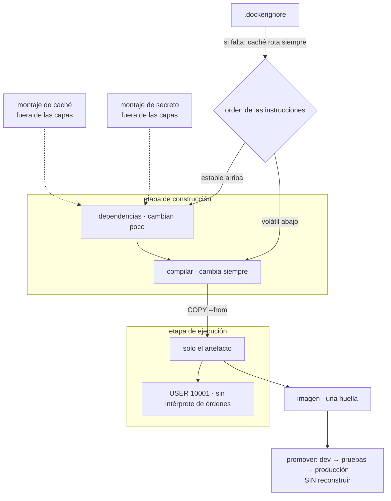

# 062 — Dockerfile reproducible y builds multi-stage

> [← 061 · Imágenes, capas, registros y estándar OCI](../../part-05-containers-docker-oci/061-imagenes-capas-registros-y-estandar-oci/README.md) · [Índice de la parte](../README.md) · [063 · Namespaces, cgroups y runtime de contenedores →](../../part-05-containers-docker-oci/063-namespaces-cgroups-y-runtime-de-contenedores/README.md)

**Parte:** 05 — Contenedores, Docker y OCI<br>
**Nivel:** intermedio · **Horas estimadas:** 4<br>
**Laboratorio:** `container` · **Estado:** `EXECUTABLE_CORE`

## 🎯 Propósito

Escribir un `Dockerfile` que produzca imágenes reproducibles, pequeñas y con poca superficie, y hacerlo entendiendo que las dos mitades del problema son distintas: **la caché decide cuánto tarda** y **las etapas deciden qué acaba dentro**. La clase 061 dejó tres deudas concretas —un token dentro de una capa, un índice de paquetes de hace meses y la imposibilidad de saber qué se ejecutaba—; las tres se pagan aquí, y con ellas se establece el principio que gobierna las partes 08 y siguientes: **se construye una vez y se promueve, nunca se reconstruye por entorno**.

## 📚 Resultados de aprendizaje

Al finalizar podrás:

1. **Ordenar** las instrucciones para que la caché invalide lo mínimo y medir la diferencia.
2. **Separar** la etapa de construcción de la de ejecución y justificarlo por superficie, no por tamaño.
3. **Usar** montajes de caché y de secreto para no dejar rastro ni repetir descargas.
4. **Fijar** base, dependencias y contexto para que dos construcciones del mismo commit se comporten igual.
5. **Aplicar** el principio de construir una vez y promover por huella entre entornos.

## 🧩 Conceptos centrales

| Concepto | Comprensión verificable |
|---|---|
| `invalidación de caché` | Una instrucción reutiliza su capa si su entrada no cambió **y ninguna anterior cambió**. Por eso el orden decide el tiempo de construcción mucho más que el contenido. |
| `construcción por etapas` | Varias imágenes intermedias de las que solo se copia el resultado. La etapa final no contiene compilador, gestor de paquetes ni código fuente. |
| `montaje de caché` | Directorio persistente entre construcciones que **no forma parte de ninguna capa**. Acelera sin engordar la imagen ni filtrar nada. |
| `montaje de secreto` | Fichero disponible solo durante una instrucción y ausente de la capa resultante. Es la corrección del token filtrado de la clase 061. |
| `contexto de construcción` | Lo que se envía al motor. Sin `.dockerignore` incluye el repositorio entero, así que engorda la imagen y **invalida la caché en cada cambio**. |
| `construir una vez y promover` | El mismo artefacto, identificado por huella, recorre todos los entornos. Lo que cambia entre ellos es la configuración inyectada al ejecutar, nunca la imagen. |

## 🧠 Modelo mental

Una imagen es un artefacto inmutable; un contenedor es un proceso aislado con límites y dependencias explícitas, no una máquina virtual pequeña.

Aplicado a esta clase, separa siempre cuatro planos: **intención** (qué necesita el usuario),
**configuración** (qué declaramos), **estado observado** (qué existe de verdad) y
**evidencia** (cómo sabemos que cumple). Confundirlos produce diseños que se ven correctos
en un diagrama pero fallan al operar.

## 🗺️ Flujo de razonamiento



## 📖 Desarrollo

### 1. El orden decide el tiempo

La regla de la caché tiene una sola frase y una consecuencia grande: **una instrucción reutiliza su capa si su entrada no cambió y ninguna anterior cambió**. Un cambio en una línea invalida todo lo que viene después.

El error más extendido cabe en dos líneas:

```dockerfile
COPY . .            # cualquier cambio en el repositorio invalida aquí
RUN npm ci          # → se reinstalan TODAS las dependencias en cada construcción
```

Y la corrección, que separa lo que cambia poco de lo que cambia siempre:

```dockerfile
COPY package.json package-lock.json ./
RUN npm ci                       # solo se reejecuta si cambian las dependencias
COPY . .                         # el código, que cambia en cada commit
RUN npm run build
```

La diferencia es medible y grande, porque las dependencias son casi siempre la parte lenta:

```text
construcción tras cambiar una línea de código
  con COPY . . primero      6 min 40 s
  con dependencias aparte      48 s
```

El mismo principio vale para cualquier lenguaje: primero el manifiesto de dependencias y su instalación, después el código. En compilados con un gestor propio, el patrón se repite con el fichero de bloqueo.

Y el **contexto de construcción** es la otra mitad del problema, porque decide qué entra en `COPY . .`. Sin `.dockerignore`, entra el repositorio completo:

```text
.git/               historial entero, a veces con secretos ya rotados
node_modules/       megabytes que se van a reinstalar igualmente
.env                configuración local, a menudo con credenciales
cobertura, registros, artefactos de compilación previos
```

Y hay un efecto secundario que sorprende: **cualquier cambio en cualquiera de esos ficheros invalida la caché**, incluido un fichero de registro que la ejecución anterior acaba de escribir. Un `.dockerignore` decente no es higiene, es rendimiento:

```text
.git
node_modules
.env*
**/*.log
coverage
dist
Dockerfile
.dockerignore
```

Dos trampas más de orden, con consecuencias distintas:

**Actualizar el índice de paquetes en una instrucción aparte.**

```dockerfile
RUN apt-get update                          # ← esta capa se cachea
RUN apt-get install -y curl ca-certificates # y usa un índice de hace meses
```

La primera capa se reutiliza indefinidamente porque su texto no cambia, así que la instalación resuelve contra un índice antiguo y puede traer versiones que ya se corrigieron. Van siempre en la misma instrucción, y limpiando en ella:

```dockerfile
RUN apt-get update \
 && apt-get install -y --no-install-recommends curl ca-certificates \
 && rm -rf /var/lib/apt/lists/*
```

La limpieza en la **misma** instrucción sí reduce el tamaño; en una posterior no, por lo que la clase 061 demostró sobre los ficheros de borrado.

**`ADD` en vez de `COPY`.** `ADD` extrae automáticamente los archivos comprimidos y descarga direcciones remotas, dos comportamientos implícitos que rara vez se quieren y que dificultan razonar sobre el resultado. `COPY` para todo, salvo que se necesite justo lo que `ADD` hace de más.

### 2. Las etapas deciden la superficie

La construcción por etapas se explica casi siempre por el tamaño, y el tamaño es el argumento menos importante. El argumento real es **qué queda dentro para que alguien lo use**.

```dockerfile
# ---- construcción ----
FROM golang:1.23@sha256:1a2b3c... AS construccion
WORKDIR /src
COPY go.mod go.sum ./
RUN --mount=type=cache,target=/go/pkg/mod go mod download
COPY . .
RUN --mount=type=cache,target=/root/.cache/go-build \
    CGO_ENABLED=0 go build -trimpath -ldflags="-s -w" -o /bin/app ./cmd/app

# ---- ejecución ----
FROM gcr.io/distroless/static-debian12:nonroot@sha256:4d5e6f...
COPY --from=construccion /bin/app /bin/app
USER 65532:65532
ENTRYPOINT ["/bin/app"]
```

Lo que la etapa final **no** tiene, y lo que eso significa:

```text
sin compilador ni cadena de herramientas   no se puede compilar nada dentro
sin gestor de paquetes                     no se puede instalar nada dentro
sin intérprete de órdenes                  una ejecución de órdenes remota
                                           no tiene con qué ejecutarlas
sin código fuente ni ficheros de proyecto  no hay nada que leer
```

La tercera línea es la que más cambia el resultado de una intrusión: buena parte de las cadenas de explotación conocidas dependen de disponer de un intérprete de órdenes o de una utilidad de descarga dentro del contenedor. Sin ellos, la misma vulnerabilidad rinde mucho menos.

Y tiene una contrapartida honesta que hay que aceptar por adelantado: **no se puede depurar entrando**. `docker exec` no tiene nada que ejecutar. La respuesta correcta es la de la clase 057 —si hace falta entrar a menudo, falta instrumentación— y la técnica concreta es un contenedor efímero de depuración que comparte los espacios de nombres del que se investiga, que la clase 070 desarrolla.

Los tamaños resultantes ordenan la elección de base final:

```text
imagen sin etapas, base completa      1,2 GB
base minimalista con paquetes         180 MB
base minimalista sin intérprete        96 MB
binario estático sobre base vacía      12 MB
```

Y la advertencia de la clase 061 sigue vigente: bajar de base no es gratis. Una base sin bibliotecas estándar exige un binario realmente estático, y una base con otra implementación de las bibliotecas del sistema cambia comportamientos de red y de fecha. **Se elige la base más pequeña que pase las pruebas de integración**, no la más pequeña.

Un detalle de etapas que ahorra tiempo en canalizaciones grandes: las etapas que no se necesitan no se construyen. `--target` permite construir solo hasta una, lo que hace posible tener en el mismo fichero una etapa de pruebas, una de análisis y una de ejecución sin pagar todas en cada construcción.

```bash
$ docker build --target pruebas -t tienda:test .
$ docker build -t tienda:v8 .
```

### 3. Montajes: acelerar sin engordar, usar secretos sin filtrarlos

Los montajes de construcción resuelven dos problemas que antes obligaban a elegir entre velocidad y limpieza.

**Montaje de caché.** Un directorio que persiste entre construcciones y **no forma parte de ninguna capa**:

```dockerfile
RUN --mount=type=cache,target=/root/.npm \
    npm ci --prefer-offline

RUN --mount=type=cache,target=/var/cache/apt,sharing=locked \
    --mount=type=cache,target=/var/lib/apt,sharing=locked \
    apt-get update && apt-get install -y --no-install-recommends curl
```

La diferencia con dejar la caché dentro de una capa es doble: no engorda la imagen y sobrevive a la invalidación. Cuando cambia el fichero de dependencias, la instrucción se reejecuta pero **los paquetes ya descargados siguen ahí**, así que la reinstalación completa tarda segundos en vez de minutos.

**Montaje de secreto.** Es la corrección directa del incidente de la clase 061:

```dockerfile
RUN --mount=type=secret,id=npmrc,target=/root/.npmrc \
    npm ci
```

```bash
$ docker build --secret id=npmrc,src=$HOME/.npmrc -t tienda:v8 .
```

El fichero existe durante esa instrucción y no aparece en la capa resultante. La comprobación es la misma de la clase 061 y debe formar parte de la canalización:

```bash
$ docker save tienda:v8 -o img.tar && mkdir -p x && tar -xf img.tar -C x
$ for c in x/blobs/sha256/*; do tar -tzf "$c" 2>/dev/null; done | grep -c npmrc
0                                                                           ✓
```

Y para clonar repositorios privados durante la construcción, el montaje de agente evita meter una clave:

```dockerfile
RUN --mount=type=ssh git clone git@interno:cls/biblioteca.git
```

Lo que **no** hay que usar para secretos, y aparece en muchas guías antiguas:

```text
ARG TOKEN                 queda en el historial de la imagen (clase 061)
ENV TOKEN                 queda en la configuración, legible con inspect
COPY secreto / + RUN rm   queda en la capa donde entró
```

Los tres dejan rastro recuperable. El montaje de secreto es la única forma que no lo deja.

Y en la canalización, la **caché compartida en un registro** es lo que hace que la primera construcción de un agente efímero no empiece de cero:

```bash
$ docker buildx build \
    --cache-from type=registry,ref=registro/tienda:cache \
    --cache-to   type=registry,ref=registro/tienda:cache,mode=max \
    -t registro/tienda:v8 --push .
```

Es la diferencia entre una canalización que tarda once minutos y una que tarda noventa segundos, y cuesta un repositorio adicional en el registro.

### 4. Reproducible: lo que se puede prometer y lo que no

«Reproducible» se usa con dos significados distintos y conviene separarlos, porque uno es alcanzable y el otro es un proyecto en sí mismo.

```text
mismo commit → mismo COMPORTAMIENTO      alcanzable, y es lo que importa
mismo commit → mismos BYTES exactos      difícil: marcas de tiempo, orden de
                                         ficheros, rutas absolutas, aleatoriedad
```

Perseguir lo segundo sin necesitarlo consume tiempo. Conseguir lo primero es cuestión de fijar cuatro cosas:

**La base, por huella.** Una etiqueta de base se mueve, con lo que dos construcciones del mismo commit pueden partir de sistemas distintos:

```dockerfile
FROM node:22-bookworm-slim@sha256:0c1f2e3d...
```

Y hay que aceptar la consecuencia: la base fijada **no recibe parches automáticamente**. La actualización pasa a ser un cambio explícito en el repositorio, revisable y trazable — que es exactamente lo que se quiere, siempre que exista un proceso que la proponga con regularidad. Sin ese proceso, fijar por huella congela vulnerabilidades.

**Las dependencias, por fichero de bloqueo.** `npm ci` en vez de `npm install`, y el equivalente en cada ecosistema. La orden que instala «lo que diga el manifiesto» resuelve versiones nuevas en cada construcción.

**Los paquetes del sistema, por versión**, cuando importa:

```dockerfile
RUN apt-get update && apt-get install -y --no-install-recommends \
      curl=7.88.1-10+deb12u* ca-certificates
```

Con el matiz de que los repositorios de distribución retiran versiones antiguas, así que fijar de más produce construcciones que fallan solas con el tiempo. La práctica sostenible es fijar la base por huella —que ya congela el conjunto de paquetes— y no fijar cada paquete.

**El contexto**, con `.dockerignore`, para que un fichero local no cambie el resultado.

Y para acercarse a la reproducibilidad de bytes cuando de verdad hace falta —cadenas de suministro auditadas, que es materia de la clase 067—, existen mecanismos que normalizan las marcas de tiempo:

```bash
$ SOURCE_DATE_EPOCH=$(git log -1 --pretty=%ct) \
  docker buildx build --output type=registry,rewrite-timestamp=true .
```

Y el principio que gobierna todo lo demás, que es el que se lleva a las partes 08 y 12:

```text
se construye UNA vez y se promueve
  dev → pruebas → preproducción → producción
  la misma HUELLA en los cuatro
  lo que cambia es la configuración inyectada al ejecutar
```

Reconstruir por entorno destruye la garantía entera: lo que se probó en preproducción no es lo que se ejecuta en producción, aunque el commit sea el mismo. Y la señal de que un equipo lo está haciendo mal es fácil de buscar: **si el `Dockerfile` menciona el entorno, algo va mal**.

```dockerfile
ARG ENTORNO=produccion         # ← señal de alarma
RUN cp config.$ENTORNO.json config.json
```

La configuración por entorno se inyecta al ejecutar, como variables o como ficheros montados, que es el modelo que las clases 043, 055 y 066 usan.

### 5. El resultado, revisado como se revisa el código

Un `Dockerfile` bien escrito se reconoce por lo que **no** tiene, y merece una lista de revisión corta que se pueda aplicar en un pull request:

```text
☐ base fijada por huella, con un proceso que proponga actualizarla
☐ dependencias antes que código, para que la caché sirva
☐ .dockerignore presente y con .git, secretos y artefactos
☐ actualización e instalación de paquetes en la MISMA instrucción, con limpieza
☐ etapa de ejecución sin compilador, sin gestor de paquetes y sin intérprete
☐ ningún secreto por ARG, ENV ni COPY: solo montaje de secreto
☐ USER numérico y distinto de 0
☐ ENTRYPOINT en forma de lista, no de cadena
☐ etiquetas estándar de origen y revisión (clase 061)
☐ nada específico de entorno
```

La penúltima merece una explicación porque su efecto es invisible hasta que hace falta. En forma de cadena, el motor arranca un intérprete de órdenes que ejecuta el programa como hijo:

```dockerfile
ENTRYPOINT /bin/app --puerto=8080     # forma de cadena: sh -c "…"
ENTRYPOINT ["/bin/app", "--puerto=8080"]  # forma de lista: el proceso ES el 1
```

Con la primera, el proceso número uno es el intérprete, **las señales le llegan a él y no las reenvía**. Una petición de parada se ignora y la plataforma acaba matando el contenedor pasado el plazo, cortando peticiones en curso. Es la causa más frecuente del apagado no ordenado, y la clase 068 lo desarrolla; aquí basta con no crearlo.

Y dos comprobaciones automáticas que conviene tener en la canalización, porque detectan casi todo lo de la lista:

```bash
$ hadolint Dockerfile                      # reglas del propio formato
$ docker scout cves registro/tienda:v8     # o trivy / grype (clase 067)
```

Más las dos pruebas negativas propias de esta clase, que son las que demuestran lo que no se puede ver:

```bash
# ningún secreto en las capas
$ docker save registro/tienda:v8 | tar -xO | strings | grep -Ec 'authToken|BEGIN PRIVATE KEY'
0                                                                           ✓

# la etapa final no tiene intérprete de órdenes
$ docker run --rm --entrypoint sh registro/tienda:v8 -c 'echo hola'
docker: Error response from daemon: … "sh": executable file not found       ✓
```

La segunda es una prueba negativa en el sentido exacto de las clases 046 y 058: **el éxito es que falle**. Y como toda prueba negativa del programa, su valor está en ejecutarse en cada construcción y no en haberse ejecutado una vez.

## 🔬 Ejemplo trabajado

**CloudShop reescribe sus `Dockerfile`. La construcción tarda once minutos, la imagen pesa 1,2 GB y las tres deudas de la clase 061 siguen abiertas. Cinco cambios las cierran y dejan un principio que gobierna el resto del programa.**

Punto de partida:

```dockerfile
FROM node:22
WORKDIR /app
COPY . .
RUN npm install
RUN npm run build
COPY .npmrc /root/.npmrc
RUN npm ci --production && rm /root/.npmrc
EXPOSE 8080
CMD npm start
```

**Cambio 1 — el orden, y once minutos que pasan a noventa segundos.**

```text                                        antes         después
construcción tras cambiar una línea         6 min 40 s       48 s
construcción en agente efímero de CI       11 min 20 s    1 min 30 s
contexto enviado al motor                     412 MB          9 MB
```

Tres medidas a la vez: dependencias antes que código, `.dockerignore` con `.git` y `node_modules`, y caché compartida en el registro para los agentes efímeros. El contexto de 412 MB era casi todo `.git` y `node_modules`, y además invalidaba la caché en cada construcción porque cualquier fichero local cambiaba.

**Cambio 2 — etapas, y lo que deja de estar dentro.**

```dockerfile
FROM node:22-bookworm-slim@sha256:0c1f2e3d... AS deps
WORKDIR /app
COPY package.json package-lock.json ./
RUN --mount=type=cache,target=/root/.npm \
    --mount=type=secret,id=npmrc,target=/root/.npmrc \
    npm ci

FROM deps AS construccion
COPY . .
RUN npm run build

FROM gcr.io/distroless/nodejs22-debian12:nonroot@sha256:7a8b9c...
WORKDIR /app
COPY --from=construccion /app/dist ./dist
COPY --from=deps /app/node_modules ./node_modules
USER 65532:65532
ENTRYPOINT ["/nodejs/bin/node", "dist/main.js"]
```

```text                                        antes         después
tamaño de la imagen                          1,2 GB         148 MB
intérprete de órdenes en la imagen final       sí             no
gestor de paquetes en la imagen final          sí             no
código fuente en la imagen final               sí             no
paquetes del sistema con vulnerabilidades
  conocidas (alta o crítica)                    41              3
```

Los tres restantes son de la propia base y se siguen con el proceso de actualización, no con un parche local.

**Cambio 3 — el token, cerrado de verdad.**

El orden fue el mismo que en la clase 061 y no es negociable: **rotar primero, corregir después**.

```bash
$ docker save registro/tienda:v9 | tar -xO | strings | grep -Ec 'authToken'
0                                                                           ✓
```

```text                                        antes         después
método                              COPY + rm en capa    montaje de secreto
token extraíble de las capas                 sí               no
comprobación en la canalización            ninguna     bloquea la publicación
```

**Cambio 4 — el índice de paquetes de hace cuatro meses.**

```bash
$ docker run --rm --entrypoint cat registro/tienda:v8 /var/lib/apt/lists/lock 2>/dev/null
$ docker history registro/tienda:v8 | grep 'apt-get update'
<hace 118 días>   RUN apt-get update
```

La capa de actualización llevaba cuatro meses reutilizándose, así que la instalación resolvía contra un índice de entonces. Dos paquetes con correcciones publicadas seguían entrando en cada construcción nueva.

```text                                        antes            después
actualización e instalación           dos instrucciones   una, con limpieza
antigüedad del índice de paquetes         118 días          la de la base
paquetes desactualizados en la imagen         2                 0
```

**Cambio 5 — se construía una vez por entorno.**

La canalización ejecutaba una construcción para preproducción y otra para producción, con un argumento distinto:

```text
ARG ENTORNO   →   cp config.$ENTORNO.json config.json
```

Eso producía dos imágenes distintas del mismo commit, y explicaba un incidente anterior: un fallo que solo se daba en producción y no se reproducía en preproducción, porque **no eran el mismo artefacto**.

```text                                        antes            después
imágenes por commit                             2                1
configuración                          dentro de la imagen  inyectada al ejecutar
lo probado y lo desplegado             commit igual,      MISMA HUELLA
                                       artefacto distinto
tiempo total de la canalización            22 min           3 min 10 s
```

La última fila es consecuencia de todo lo anterior: una construcción en vez de dos, con caché compartida y contexto pequeño.

**Resumen del empaquetado:**

```text                                          antes         después
construcción en agente efímero              11 min 20 s    1 min 30 s
tamaño de la imagen                            1,2 GB        148 MB
contexto enviado                               412 MB          9 MB
secretos extraíbles de las capas                  1             0
intérprete de órdenes en la imagen final         sí            no
vulnerabilidades de alta o crítica               41             3
imágenes distintas por commit                     2             1
usuario del proceso                             root       65532
```

**La lección que esta clase traslada al resto de la parte 05**: la construcción por etapas se vende por el tamaño y vale por la superficie —una imagen sin intérprete de órdenes cambia lo que una intrusión puede hacer—, y la caché se arregla ordenando, no añadiendo herramientas. Pero el cambio con más consecuencias fue el quinto, que no toca el `Dockerfile`: **construir una vez y promover por huella** es lo que hace que «lo probado» y «lo desplegado» sean la misma frase. Sin eso, todas las pruebas del programa hablan de un artefacto que no es el que corre.

## 🧪 Laboratorio guiado

Ejecuta desde la raíz:

```bash
python classes/part-05-containers-docker-oci/062-dockerfile-reproducible-y-builds-multi-stage/lab.py
```

El laboratorio selecciona el motor de práctica **`container`** y produce
`lab_result.json`. El escenario, sus comprobaciones y el artefacto esperado corresponden a
esta clase; no requiere credenciales y deja explícito qué debe revalidarse en un sandbox real.

1. Lee `exercise.steps` y formula una predicción antes de ejecutar.
2. Ejecuta la práctica y verifica todos los elementos de `checks`.
3. Provoca el caso de `negative_test` y explica la señal observada.
4. Materializa `imagen-minima` en `evidence/` usando la plantilla indicada.
5. Para proveedor real, sigue `sandbox.requires`, registra costo y ejecuta `destroy`.

### Evidencia esperada

El artefacto principal es una imagen mínima, escaneada y ejecutada sin privilegios. Además, la entrega debe incluir el comando ejecutado,
la salida estructurada y una conclusión que no exceda lo observado.

## 🏆 Reto verificable

Construye **`imagen-minima`** para el caso CloudShop. Incluye una alternativa descartada,
un supuesto que pueda falsarse, una prueba de fallo y una decisión de rollback.

## ✅ Criterio de aceptación

- [ ] `lab.py` termina con código 0 y genera JSON válido.
- [ ] La entrega conecta al menos tres requisitos con mecanismos verificables.
- [ ] Existe una prueba positiva y una prueba negativa con evidencia.
- [ ] Seguridad, costo y operación aparecen como decisiones, no como anexos.
- [ ] Se declara una limitación y una condición que obligaría a revisar el diseño.
- [ ] Otra persona puede repetir el recorrido sin conocimiento tácito.

## ⚠️ Errores frecuentes

| Síntoma | Causa probable | Corrección |
|---|---|---|
| Cada construcción reinstala todas las dependencias | El código se copia antes de instalarlas, así que cualquier cambio invalida esa capa | Copia el manifiesto de dependencias e instálalas antes de copiar el código. |
| La caché nunca acierta aunque el código no cambie | Falta `.dockerignore` y ficheros locales —registros, artefactos, `.git`— entran en el contexto | Escribe `.dockerignore` con `.git`, dependencias instaladas, secretos y artefactos, y comprueba el tamaño del contexto. |
| La imagen instala versiones antiguas de paquetes ya corregidos | La actualización del índice está en una instrucción propia y su capa se reutiliza indefinidamente | Actualiza e instala en la misma instrucción, con limpieza en esa misma instrucción. |
| Un secreto sigue siendo extraíble pese a no aparecer en el sistema de ficheros final | Se pasó por `ARG`, por `ENV` o por `COPY`, y queda en el historial o en la capa | Usa montaje de secreto, rota lo ya expuesto y añade la comprobación de capas a la canalización. |
| Un fallo solo se reproduce en producción con el mismo commit | Se construye una imagen por entorno, así que los artefactos son distintos | Construye una vez y promueve por huella; la configuración se inyecta al ejecutar. |
| El contenedor ignora la petición de parada y lo acaban matando | `ENTRYPOINT` en forma de cadena arranca un intérprete que no reenvía las señales | Usa la forma de lista para que el proceso de la aplicación sea el número uno. |

## 🛡️ Seguridad, ética y costo

Trabaja con cuentas propias o sandboxes autorizados. No publiques secretos, identificadores
reales ni datos personales. Antes de crear recursos pagos define presupuesto, etiquetas y
comando de destrucción; después verifica que no queden recursos huérfanos. Los ejemplos
locales enseñan contratos, pero no certifican cumplimiento ni disponibilidad de producción.

## ❓ Preguntas de comprobación

1. ¿Por qué copiar el código antes de instalar dependencias multiplica el tiempo de construcción?
2. ¿Cuál es el argumento principal de la construcción por etapas, y por qué el tamaño es el secundario?
3. ¿Qué tres formas de pasar un secreto dejan rastro recuperable y cuál no?
4. ¿Qué se puede prometer sobre reproducibilidad fijando la base por huella, y qué obligación crea?
5. ¿Qué señal en un `Dockerfile` indica que el equipo está reconstruyendo por entorno, y por qué importa?

## 🔗 Referencias

- Docker (2025). *Dockerfile best practices* — orden de instrucciones, caché y contexto. <https://docs.docker.com/build/building/best-practices/>
- Docker (2025). *Multi-stage builds* — etapas, `--target` y copia entre etapas. <https://docs.docker.com/build/building/multi-stage/>
- Docker (2025). *Build secrets and cache mounts* — `--mount=type=secret` y `type=cache`. <https://docs.docker.com/build/building/secrets/>
- Docker (2025). *Cache storage backends* — caché compartida en registro para canalizaciones. <https://docs.docker.com/build/cache/backends/>
- Google (2025). *Distroless container images* — bases sin intérprete de órdenes ni gestor de paquetes. <https://github.com/GoogleContainerTools/distroless>
- Documentación oficial vigente del servicio implementado; registra URL y fecha de consulta.

---

> [Evaluación](assessment.md) · [Contrato de clase](lesson.yaml) · [Índice de la parte](../README.md)

**📥 Descargar:** [Parte 05 en PDF](../../../site/downloads/partes/manual-parte-05-containers-docker-oci.pdf) · [Manual integral](../../../site/downloads/multi-cloud-engineering-manual-v2.0.pdf)

| Anterior | Índice | Siguiente |
|---|---|---|
| [← 061 · Imágenes, capas, registros y estándar OCI](../../part-05-containers-docker-oci/061-imagenes-capas-registros-y-estandar-oci/README.md) | [Parte 05](../README.md) · [Programa](../../README.md) | [063 · Namespaces, cgroups y runtime de contenedores →](../../part-05-containers-docker-oci/063-namespaces-cgroups-y-runtime-de-contenedores/README.md) |
