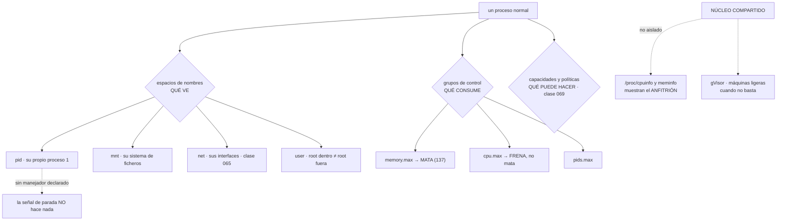

# 063 — Namespaces, cgroups y runtime de contenedores

> [← Clase anterior](../../part-05-containers-docker-oci/062-dockerfile-reproducible-y-builds-multi-stage/README.md) · [Índice de la parte](../README.md) · [Clase siguiente →](../../part-05-containers-docker-oci/064-volumenes-bind-mounts-y-persistencia/README.md)

**Parte:** 05 — Contenedores, Docker y OCI<br>
**Nivel:** intermedio · **Horas estimadas:** 4<br>
**Laboratorio:** `container` · **Estado:** `EXECUTABLE_CORE`

## 🎯 Propósito

Entender qué es un contenedor de verdad, porque no es una cosa: es **un proceso normal con tres mecanismos del núcleo aplicados encima**. De ahí salen los comportamientos que desconciertan en producción —un proceso que ignora la señal de parada, un límite de CPU que no aparece como CPU alta, un contenedor que sigue sano con su trabajador muerto— y de ahí sale también la respuesta a la pregunta que abrió la parte: **qué queda fuera del aislamiento**, que es exactamente donde la portabilidad del contenedor deja de valer.

## 📚 Resultados de aprendizaje

Al finalizar podrás:

1. **Construir** un aislamiento equivalente a un contenedor con órdenes sueltas, para demostrar que no hay ningún objeto «contenedor».
2. **Explicar** por qué el proceso número uno ignora las señales que no ha declarado, y qué consecuencia tiene.
3. **Diagnosticar** una limitación de CPU distinguiéndola de una CPU saturada.
4. **Detectar** un proceso terminado por falta de memoria, incluido el caso en que el contenedor sobrevive.
5. **Enumerar** qué no está aislado y qué alternativas existen cuando el núcleo compartido no es aceptable.

## 🧩 Conceptos centrales

| Concepto | Comprensión verificable |
|---|---|
| `espacio de nombres` | Mecanismo que cambia **lo que un proceso ve**: sus procesos, su red, sus montajes, su nombre de máquina. No limita nada; solo delimita la vista. |
| `grupo de control` | Mecanismo que limita y contabiliza **lo que un proceso puede consumir**: memoria, CPU, entrada/salida y número de procesos. |
| `proceso número uno` | El primero del espacio de nombres de procesos. El núcleo **no le instala los manejadores por defecto**: una señal que el programa no declare simplemente no hace nada. |
| `limitación de CPU` | El límite de CPU no corta: **frena**. Se manifiesta como latencia con uso aparentemente bajo, y su señal es el contador de periodos limitados. |
| `terminación por memoria` | El límite de memoria no ralentiza: **mata**. El núcleo elige un proceso del grupo, que puede no ser el número uno, y el contenedor sigue en pie sin hacer nada. |
| `núcleo compartido` | Todos los contenedores de una máquina usan el mismo núcleo. Es lo que los hace ligeros y lo que fija el límite de su aislamiento. |

## 🧠 Modelo mental

Una imagen es un artefacto inmutable; un contenedor es un proceso aislado con límites y dependencias explícitas, no una máquina virtual pequeña.

Aplicado a esta clase, separa siempre cuatro planos: **intención** (qué necesita el usuario),
**configuración** (qué declaramos), **estado observado** (qué existe de verdad) y
**evidencia** (cómo sabemos que cumple). Confundirlos produce diseños que se ven correctos
en un diagrama pero fallan al operar.

## 🗺️ Flujo de razonamiento



## 📖 Desarrollo

### 1. No hay ningún objeto «contenedor»

El núcleo no tiene una estructura llamada contenedor. Hay procesos, y sobre un proceso se pueden aplicar tres cosas independientes:

```text
espacios de nombres   cambian lo que VE
grupos de control     limitan lo que CONSUME
capacidades y políticas de seguridad   acotan lo que PUEDE HACER  (clase 069)
```

Un contenedor es la aplicación conjunta de las tres. Y se puede demostrar sin ningún motor, lo que conviene hacer una vez porque cambia el modelo mental para siempre:

```bash
# un "contenedor" a mano: vista de procesos, montajes y nombre propios
$ sudo unshare --pid --mount --uts --ipc --net --fork --mount-proc \
    /bin/bash

# dentro:
# ps aux
USER  PID  COMMAND
root    1  /bin/bash        ← este intérprete es el proceso 1
root    8  ps aux

# hostname aislado
# ip link
1: lo: <LOOPBACK> mtu 65536 …     ← solo el bucle local: no hay red
```

Y el límite se aplica escribiendo en el sistema de ficheros de grupos de control, que también es texto plano:

```bash
$ sudo mkdir /sys/fs/cgroup/demo
$ echo 268435456 | sudo tee /sys/fs/cgroup/demo/memory.max   # 256 MiB
$ echo "20000 100000" | sudo tee /sys/fs/cgroup/demo/cpu.max # 0,2 CPU
$ echo $PID | sudo tee /sys/fs/cgroup/demo/cgroup.procs
```

Eso es todo lo que hace un motor de contenedores, más la preparación del sistema de ficheros a partir de las capas de la clase 061 y la aplicación de las políticas de la clase 069.

La cadena real, de arriba abajo, aclara un comportamiento operativo que confunde:

```text
plataforma (orquestador o motor)
  → containerd            gestiona imágenes y ciclo de vida
    → shim                proceso intermedio, uno por contenedor
      → runc              aplica espacios, grupos y políticas
        → tu proceso      y runc SALE
```

Como `runc` termina en cuanto ha arrancado el proceso, y quien queda como padre es el shim, **reiniciar el motor no mata los contenedores**. Es lo que permite actualizar `containerd` sin cortar el servicio, y explica por qué al listar procesos en el anfitrión no aparece ningún `runc`.

Y los espacios de nombres que importan, con la clase donde se cobra cada uno:

```text
pid     su propio proceso 1              → señales y apagado ordenado (068)
mnt     su vista del sistema de ficheros → volúmenes y persistencia   (064)
net     sus interfaces y sus rutas        → red y publicación         (065)
user    su propia correspondencia de uid  → sin privilegios           (069)
uts     su nombre de máquina
ipc     su memoria compartida
cgroup  su vista del árbol de grupos
```

### 2. El proceso número uno no es un proceso normal

Esta es la particularidad del núcleo que más incidentes produce y la que menos gente conoce.

Para el proceso número uno de un espacio de nombres, **el núcleo no instala los manejadores de señal por defecto**. En un proceso normal, recibir una petición de terminación lo mata aunque el programa no haga nada. En el proceso número uno:

```text
señal de terminación (TERM) sin manejador declarado  →  NO OCURRE NADA
señal de matar (KILL)                                →  siempre mata
```

La consecuencia es directa: una plataforma que pide parar de forma ordenada envía la primera señal, espera el plazo de gracia —treinta segundos por defecto en la mayoría— y después envía la segunda. Si el programa no declaró el manejador, **el plazo entero se desperdicia y el proceso muere de golpe**, cortando peticiones en curso.

```bash
$ docker run --rm -d --name demo imagen:v1
$ time docker stop demo
real    0m10.4s        ← el plazo completo: nadie escuchó
```

Hay dos causas y conviene distinguirlas:

```text
1. el programa no declara el manejador
   → se corrige en el código, y es lo correcto
2. el proceso 1 es un intérprete de órdenes que no reenvía
   → ENTRYPOINT en forma de cadena (clase 062)
   → el intérprete recibe la señal y su hijo no se entera
```

La segunda es la más común y la más fácil de arreglar: forma de lista en el punto de entrada, para que el proceso de la aplicación sea el uno.

Y hay un tercer efecto del proceso uno que produce fugas lentas: **es el responsable de recoger a los procesos huérfanos**. Si la aplicación lanza procesos hijos y no los espera, sus entradas se acumulan como procesos zombis y consumen entradas de la tabla del núcleo hasta agotar `pids.max`.

```bash
$ docker exec demo ps -eo pid,stat,comm | grep -c ' Z'
1847
```

La corrección es un proceso de inicio mínimo que recoja hijos y reenvíe señales, que la mayoría de motores ofrecen como interruptor:

```bash
$ docker run --init imagen:v1
```

Y cuándo hace falta, dicho con precisión, porque añadirlo a ciegas es innecesario:

```text
hace falta   si la aplicación lanza procesos hijos que no espera
             o si el punto de entrada es un guion con varios procesos
no hace falta si el proceso 1 es un binario único que declara sus manejadores
```

La clase 068 desarrolla el apagado ordenado completo; lo que hay que llevarse aquí es **por qué** el mecanismo se comporta así: no es una peculiaridad del motor, es el contrato del proceso número uno en el núcleo.

### 3. La memoria mata y la CPU frena

Los dos límites más usados se comportan de forma opuesta, y confundirlos lleva a diagnosticar al revés.

**El límite de memoria mata.** No hay ralentización previa ni aviso: cuando el grupo supera su límite, el núcleo elige un proceso del grupo y lo termina.

```bash
$ docker inspect demo --format '{{.State.ExitCode}} {{.State.OOMKilled}}'
137 true
```

El código 137 es la firma. Y hay un caso que produce el fallo silencioso más difícil de ver de esta clase: **el núcleo no siempre mata al proceso número uno**. Si la aplicación tiene un proceso principal ligero y trabajadores pesados, el elegido puede ser un trabajador:

```text
el trabajador muere
el proceso 1 sigue vivo
el contenedor sigue "en ejecución"
la comprobación de estado responde 200
y el trabajo deja de hacerse
```

Es exactamente la familia de fallos que la clase 060 identificó como la más cara: **un mecanismo que parece estar haciendo algo y no lo está**. Se detecta contando trabajadores vivos, no comprobando que el proceso responda:

```bash
$ cat /sys/fs/cgroup/memory.events
low 0
high 0
max 4127
oom 3
oom_kill 3
```

Ese contador debería ser una métrica vigilada. Un `oom_kill` mayor que cero es siempre un incidente, incluso si nadie ha notado nada.

**El límite de CPU frena.** No mata, no falla, y **no aparece como CPU alta**. El grupo recibe una cuota por periodo y, al agotarla, sus hilos se detienen hasta el siguiente:

```text
cpu.max = "20000 100000"   → 20 ms de cada 100: 0,2 CPU
```

El síntoma es latencia con uso aparentemente bajo, y la señal es otra:

```bash
$ cat /sys/fs/cgroup/cpu.stat
usage_usec 41283991
nr_periods 129483
nr_throttled 41207          ← el 32 % de los periodos, frenado
throttled_usec 8814299
```

Un 32 % de periodos frenados explica un percentil alto que ninguna gráfica de CPU muestra. **`nr_throttled` es la métrica que falta en casi todos los paneles.**

Y la causa más frecuente de limitación no es que falte CPU, sino un tercer hecho que une los dos apartados anteriores: **lo que no está aislado**.

### 4. Lo que el contenedor ve del anfitrión, y por qué se dimensiona mal solo

Los espacios de nombres delimitan procesos, red y montajes. **No delimitan lo que el núcleo publica sobre el hardware.** Dentro de un contenedor con 2 CPU y 512 MiB de límite:

```bash
$ docker run --rm --cpus 2 --memory 512m alpine sh -c 'nproc; free -m | head -2'
64                                    ← los del ANFITRIÓN
              total   used   free
Mem:         257843  91223  16620    ← la del ANFITRIÓN
```

Y de ahí sale el problema que produce la mitad de las limitaciones de CPU y de las terminaciones por memoria del mundo real: **los tiempos de ejecución se dimensionan solos leyendo esa información**.

```text
un tiempo de ejecución que crea un hilo por CPU     → 64 hilos con 2 CPU de cuota
                                                      → limitación constante
una máquina virtual que calcula su montón como una
fracción de la memoria "disponible"                  → 64 GiB de montón
                                                      con 512 MiB de límite
                                                      → terminación por memoria
un compilador que lanza trabajos según los núcleos   → 96 trabajos con 2 CPU
```

Las correcciones son por tiempo de ejecución y hay que ponerlas explícitamente:

```text
Go         GOMAXPROCS acorde a la cuota, o una biblioteca que la lea del grupo
Java       versiones recientes detectan el límite; conviene fijar el porcentaje
           máximo de memoria en vez del tamaño absoluto
Node       el tamaño del espacio de memoria antiguo no se deduce del límite
Python     el número de trabajadores del servidor no se calcula con nproc
compiladores  el paralelismo se fija, no se detecta
```

La comprobación general es una línea y debería estar en la lista de revisión de cualquier imagen:

```bash
$ docker run --rm --cpus 2 --memory 512m imagen:v9 \
    sh -c 'cat /sys/fs/cgroup/cpu.max /sys/fs/cgroup/memory.max'
200000 100000
536870912
```

Si el proceso no está leyendo esos dos ficheros —directamente o a través de su tiempo de ejecución—, se está dimensionando con datos del anfitrión.

Y la lista completa de **lo que no está aislado**, que es la respuesta a la pregunta con la que se abrió la parte 05:

```text
el NÚCLEO                    uno solo para toda la máquina
  → una vulnerabilidad del núcleo es una fuga completa
la información de hardware   /proc/cpuinfo, /proc/meminfo, /sys
la mayoría de parámetros del núcleo   son del anfitrión
el reloj                     salvo con espacio de nombres de tiempo
la caché de páginas          compartida: un contenedor puede desalojar
                             lo que otro estaba leyendo
el ancho de banda de disco y de red   salvo que se limiten explícitamente
```

La penúltima explica un fenómeno molesto: un proceso que lee un fichero enorme puede degradar a los vecinos sin superar ningún límite, porque compite por la caché del anfitrión y no por una cuota.

Y cuando el núcleo compartido no es aceptable —ejecución de código de terceros, requisitos regulatorios— existen dos familias de alternativas:

```text
núcleo en espacio de usuario   intercepta las llamadas al sistema y las
                               reimplementa: aislamiento mucho mayor,
                               a costa de compatibilidad y de rendimiento
máquinas virtuales ligeras     un núcleo por contenedor, con arranque
                               en decenas de milisegundos
```

Ambas ejecutan **las mismas imágenes OCI**, que es la confirmación de la hipótesis de la clase 060: el contrato de la imagen se conserva, y lo que cambia es lo que hay debajo.

### 5. Diagnosticar con los ficheros del grupo de control

Casi todo lo de esta clase se responde leyendo cuatro ficheros, y conviene conocerlos porque son la fuente de verdad detrás de cualquier panel:

```bash
# dentro del contenedor, con grupos de control v2
$ cat /sys/fs/cgroup/memory.max      # límite; "max" si no hay
$ cat /sys/fs/cgroup/memory.current  # uso actual
$ cat /sys/fs/cgroup/memory.events   # oom_kill: un número mayor que 0 es un incidente
$ cat /sys/fs/cgroup/cpu.stat        # nr_throttled y throttled_usec
$ cat /sys/fs/cgroup/pids.current /sys/fs/cgroup/pids.max
```

Y el orden de diagnóstico, que distingue las tres causas que se confunden entre sí:

```text
síntoma: el servicio va lento
  1. ¿nr_throttled sube?          → falta cuota de CPU, no CPU
  2. ¿memory.current cerca del máximo?  → presión: el núcleo desaloja caché
                                          y la E/S se dispara
  3. ¿ninguno de los dos?         → el problema no es el contenedor

síntoma: el proceso desaparece
  1. código de salida 137 y oom_kill > 0   → terminación por memoria
  2. código 137 sin oom_kill               → alguien envió una señal de matar
  3. código 143                            → terminación tras señal de parada

síntoma: no se puede crear un proceso o un hilo
  1. pids.current contra pids.max          → tope de procesos
  2. procesos zombis acumulados            → falta recolección (proceso 1)
```

La segunda línea del primer bloque merece una nota, porque es un caso que se diagnostica mal a menudo: un contenedor cerca de su límite de memoria **no se ralentiza por la memoria**, se ralentiza porque el núcleo desaloja continuamente la caché de páginas para no superarlo, y eso convierte lecturas que estaban en memoria en lecturas de disco. El síntoma es E/S alta con una aplicación que no ha cambiado.

Y las tres métricas que deberían estar en el panel de cualquier plataforma de contenedores y casi nunca están completas:

```text
oom_kill acumulado por contenedor        cualquier valor mayor que 0 alerta
proporción de periodos limitados         por encima del 5 % ya duele
procesos frente al tope                  detecta fugas antes del fallo
```

Con el uso de CPU y de memoria solos, los tres problemas de esta clase son invisibles: la limitación aparece como CPU baja, la terminación por memoria aparece como un reinicio sin causa y la fuga de procesos no aparece hasta que algo falla.

Un cierre que conecta con el resto de la parte: los límites no son una medida de ahorro, son **una frontera de radio de impacto**. Un contenedor sin límite de memoria puede tumbar al anfitrión entero y con él a todos sus vecinos; con límite, se mata a sí mismo. La decisión no es «cuánto le pongo» sino «qué prefiero que ocurra cuando se pase», y esa pregunta tiene una respuesta clara en cualquier plataforma multiinquilino.

## 🔬 Ejemplo trabajado

**CloudShop despliega sus contenedores con límites puestos a ojo. Los cuatro incidentes del primer mes tienen la misma raíz —el contenedor ve el anfitrión y se dimensiona con esa información— y ninguno se manifiesta como lo que es.**

Punto de partida:

```text
nodos de 64 CPU y 256 GiB
límites por contenedor: 2 CPU y 512 MiB
vigilancia: uso de CPU y de memoria
```

**Incidente 1 — el servicio de catálogo va lento con la CPU al 38 %.**

```bash
$ kubectl exec catalogo-7f4 -- cat /sys/fs/cgroup/cpu.stat
nr_periods 129483
nr_throttled 41207
throttled_usec 8814299
```

Un 32 % de los periodos frenados. La causa, dentro:

```bash
$ kubectl exec catalogo-7f4 -- sh -c 'nproc; echo $GOMAXPROCS'
64
(vacío)
```

El tiempo de ejecución creaba 64 hilos ejecutables con una cuota de 2 CPU, así que el planificador repartía la cuota entre 64 hilos y cambiaba de contexto sin parar.

```text                                        antes         después
paralelismo del tiempo de ejecución             64              2
periodos limitados                            32 %           0,4 %
p95 del listado de catálogo                  412 ms         96 ms
cuota de CPU                                  2 CPU          2 CPU   ← sin cambios
```

El percentil bajó cuatro veces **sin añadir un solo núcleo**.

**Incidente 2 — reinicios cada pocas horas atribuidos a una fuga de memoria.**

```bash
$ kubectl get pod pedidos-3a1 -o jsonpath='{.status.containerStatuses[0].lastState.terminated.reason}'
OOMKilled
$ kubectl exec pedidos-3a1 -- sh -c 'java -XX:+PrintFlagsFinal -version | grep MaxHeapSize'
   size_t MaxHeapSize = 68719476736    ← 64 GiB
```

Con un límite de 512 MiB, la máquina virtual había calculado un montón de 64 GiB a partir de la memoria del anfitrión. No había ninguna fuga: el proceso pedía memoria hasta cruzar el límite del grupo.

```text                                        antes         después
tamaño máximo del montón                     64 GiB         320 MiB
                                                        (62,5 % del límite)
terminaciones por memoria al día                 6              0
límite de memoria del contenedor              512 MiB        512 MiB   ← sin cambios
```

**Incidente 3 — el contenedor sano que había dejado de trabajar.**

Durante seis horas no se procesó ningún pedido en segundo plano. El contenedor figuraba en ejecución y su comprobación de estado devolvía 200.

```bash
$ kubectl exec procesador-9c2 -- cat /sys/fs/cgroup/memory.events | grep oom_kill
oom_kill 3
$ kubectl exec procesador-9c2 -- ps -eo pid,comm
  PID COMMAND
    1 supervisor
```

El núcleo había terminado los tres procesos trabajadores y había dejado vivo al supervisor, que era ligero. El contenedor «existía» y no hacía nada.

```text                                        antes            después
comprobación de estado             proceso 1 responde   nº de trabajadores vivos
                                                        y edad del último trabajo
alerta sobre oom_kill                   ninguna         > 0 → aviso inmediato
tiempo hasta detectar la parada          6 h              90 s
```

Es la cuarta aparición en el programa de la misma familia de fallos, y merece anotarse junto a las otras tres: el punto de conexión privado que funcionaba por el camino público, la cola de fallidos que no recibía y los registros apagados. **Un mecanismo que parece estar haciendo algo y no lo está.**

**Incidente 4 — la construcción en contenedor tarda más que en el portátil.**

```bash
$ docker run --rm --cpus 2 imagen-build make -j$(nproc)
# → make -j64 con una cuota de 2 CPU
```

```text                                        antes         después
trabajos paralelos                              64              4
duración de la construcción                 14 min 20 s     3 min 40 s
periodos limitados durante la construcción     71 %           2 %
```

El paralelismo excesivo no solo no ayuda: multiplica el cambio de contexto y el uso de memoria, y los dos empeoran el resultado.

**Y una revisión de límites que cambió el criterio.**

Al repasar la flota apareció que once contenedores no tenían límite de memoria, por miedo a las terminaciones:

```text                                        antes            después
contenedores sin límite de memoria            11                0
qué ocurre al pasarse             el anfitrión se queda    se mata el contenedor
                                  sin memoria y el núcleo   que se pasó
                                  mata algo al azar
incidentes de nodo por memoria                 2                0
```

El criterio quedó escrito así: **un límite no es un ahorro, es una frontera de radio de impacto**. La pregunta no es cuánta memoria darle, sino qué se prefiere que ocurra cuando se pase — y que se mate el culpable siempre es mejor que que el núcleo elija por sorpresa entre todos los vecinos.

**Resumen:**

```text                                          antes         después
periodos de CPU limitados (catálogo)            32 %          0,4 %
p95 del catálogo                              412 ms          96 ms
terminaciones por memoria al día                  6              0
tiempo hasta detectar un trabajador muerto       6 h           90 s
duración de la construcción en contenedor    14 min 20 s    3 min 40 s
contenedores sin límite de memoria               11              0
métricas de grupo de control en el panel        0 de 3         3 de 3
```

**La lección que esta clase traslada al resto de la parte 05**: los cuatro incidentes se corrigieron **sin añadir capacidad**, porque ninguno era un problema de capacidad. Los tres primeros salen del mismo hecho —el contenedor ve el hardware del anfitrión y sus tiempos de ejecución se dimensionan con esa información—, y ese hecho es una consecuencia directa de lo que los espacios de nombres **no** aíslan. Conocer la frontera del aislamiento no es teoría: es lo que permite leer `nr_throttled` en vez de pedir más CPU.

## 🧪 Laboratorio guiado

Ejecuta desde la raíz:

```bash
python classes/part-05-containers-docker-oci/063-namespaces-cgroups-y-runtime-de-contenedores/lab.py
```

El laboratorio selecciona el motor de práctica **`container`** y produce
`lab_result.json`. El escenario, sus comprobaciones y el artefacto esperado corresponden a
esta clase; no requiere credenciales y deja explícito qué debe revalidarse en un sandbox real.

1. Lee `exercise.steps` y formula una predicción antes de ejecutar.
2. Ejecuta la práctica y verifica todos los elementos de `checks`.
3. Provoca el caso de `negative_test` y explica la señal observada.
4. Materializa `mapa-aislamiento` en `evidence/` usando la plantilla indicada.
5. Para proveedor real, sigue `sandbox.requires`, registra costo y ejecuta `destroy`.

### Evidencia esperada

El artefacto principal es una imagen mínima, escaneada y ejecutada sin privilegios. Además, la entrega debe incluir el comando ejecutado,
la salida estructurada y una conclusión que no exceda lo observado.

## 🏆 Reto verificable

Construye **`mapa-aislamiento`** para el caso CloudShop. Incluye una alternativa descartada,
un supuesto que pueda falsarse, una prueba de fallo y una decisión de rollback.

## ✅ Criterio de aceptación

- [ ] `lab.py` termina con código 0 y genera JSON válido.
- [ ] La entrega conecta al menos tres requisitos con mecanismos verificables.
- [ ] Existe una prueba positiva y una prueba negativa con evidencia.
- [ ] Seguridad, costo y operación aparecen como decisiones, no como anexos.
- [ ] Se declara una limitación y una condición que obligaría a revisar el diseño.
- [ ] Otra persona puede repetir el recorrido sin conocimiento tácito.

## ⚠️ Errores frecuentes

| Síntoma | Causa probable | Corrección |
|---|---|---|
| El servicio va lento con el uso de CPU bajo | El grupo de control está limitando: la cuota se agota antes de que la CPU parezca alta | Vigila `nr_throttled` en `cpu.stat` y ajusta el paralelismo del tiempo de ejecución a la cuota, no a los núcleos del anfitrión. |
| Reinicios periódicos que parecen una fuga de memoria | El tiempo de ejecución dimensiona su memoria leyendo la del anfitrión, no el límite del grupo | Fija el tamaño máximo como porcentaje del límite del contenedor y comprueba `memory.max` desde dentro. |
| El contenedor está en ejecución y su trabajo no avanza | El núcleo terminó por memoria a un proceso hijo y dejó vivo al proceso número uno | Alerta sobre `oom_kill` mayor que cero y comprueba trabajadores vivos, no solo que el proceso responda. |
| La petición de parada no tiene ningún efecto durante el plazo de gracia | El proceso número uno no tiene manejadores por defecto, o es un intérprete que no reenvía | Declara el manejador en el programa y usa la forma de lista en el punto de entrada. |
| Se acumulan procesos zombis hasta agotar el tope | El proceso número uno no recoge a los huérfanos | Usa un proceso de inicio mínimo cuando la aplicación lance hijos que no espera. |
| Un contenedor sin límite tumba el nodo entero | Sin límite de memoria, el núcleo elige una víctima entre todos los procesos de la máquina | Pon siempre límite: no es ahorro, es acotar el radio de impacto al que se pasa. |

## 🛡️ Seguridad, ética y costo

Trabaja con cuentas propias o sandboxes autorizados. No publiques secretos, identificadores
reales ni datos personales. Antes de crear recursos pagos define presupuesto, etiquetas y
comando de destrucción; después verifica que no queden recursos huérfanos. Los ejemplos
locales enseñan contratos, pero no certifican cumplimiento ni disponibilidad de producción.

## ❓ Preguntas de comprobación

1. Demuestra con órdenes sueltas que un contenedor es un proceso con espacios de nombres y grupos de control.
2. ¿Por qué el proceso número uno ignora una señal de parada que no ha declarado, y qué dos causas lo producen?
3. ¿En qué se diferencian el comportamiento del límite de memoria y el de CPU, y qué métrica revela cada uno?
4. ¿Por qué un tiempo de ejecución se dimensiona mal dentro de un contenedor y cómo se corrige?
5. Enumera cuatro cosas que no están aisladas y di qué consecuencia práctica tiene cada una.

## 🔗 Referencias

- Linux (2025). *namespaces(7)* — los siete espacios de nombres y su semántica. <https://man7.org/linux/man-pages/man7/namespaces.7.html>
- Linux (2025). *cgroups(7)* y documentación de cgroup v2 — `memory.max`, `cpu.max` e interfaces de eventos. <https://man7.org/linux/man-pages/man7/cgroups.7.html>
- Linux (2025). *pid_namespaces(7)* — semántica de señales del proceso número uno y recolección de huérfanos. <https://man7.org/linux/man-pages/man7/pid_namespaces.7.html>
- Open Container Initiative (2025). *Runtime Specification* — configuración que aplica el tiempo de ejecución. <https://github.com/opencontainers/runtime-spec/blob/main/config-linux.md>
- Google (2025). *gVisor: what is it* — aislamiento con núcleo en espacio de usuario y sus compromisos. <https://gvisor.dev/docs/>
- Documentación oficial vigente del servicio implementado; registra URL y fecha de consulta.

---

> [Evaluación](assessment.md) · [Contrato de clase](lesson.yaml) · [Índice de la parte](../README.md)
