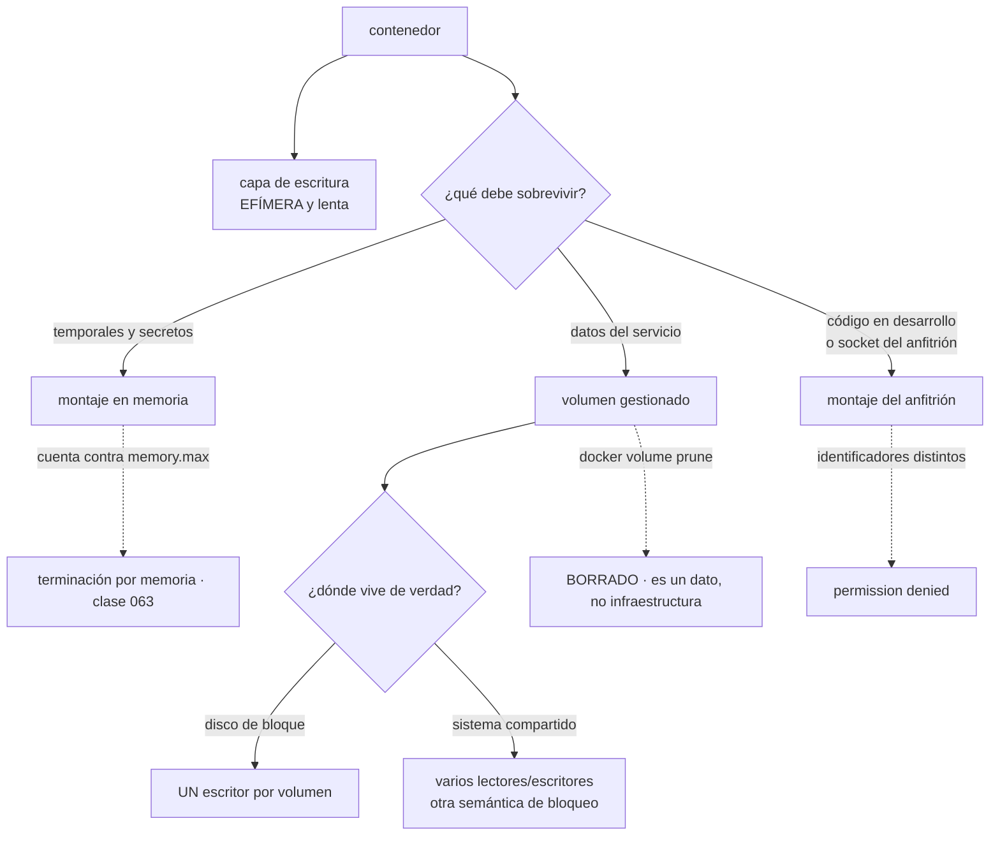

# 064 — Volúmenes, bind mounts y persistencia

> [← 063 · Namespaces, cgroups y runtime de contenedores](../../part-05-containers-docker-oci/063-namespaces-cgroups-y-runtime-de-contenedores/README.md) · [Índice de la parte](../README.md) · [065 · Redes bridge, DNS interno y publicación de puertos →](../../part-05-containers-docker-oci/065-redes-bridge-dns-interno-y-publicacion-de-puertos/README.md)

**Parte:** 05 — Contenedores, Docker y OCI<br>
**Nivel:** intermedio · **Horas estimadas:** 4<br>
**Laboratorio:** `storage` · **Estado:** `EXECUTABLE_CORE`

## 🎯 Propósito

Persistir datos en contenedores, que es la primera de las cuatro fugas que la clase 060 predijo y la que más datos ha destruido en la práctica. El sistema de ficheros de un contenedor es efímero por diseño; todo lo que deba sobrevivir es un montaje, y cada tipo de montaje trae su propio problema: el volumen gestionado se puede borrar con una orden de limpieza, el montaje del anfitrión choca con los identificadores de usuario, y el de memoria **cuenta contra el límite de memoria** de la clase 063.

## 📚 Resultados de aprendizaje

Al finalizar podrás:

1. **Elegir** entre volumen gestionado, montaje del anfitrión y montaje en memoria según lo que debe sobrevivir y a qué.
2. **Resolver** el desajuste de identificadores de usuario sin abrir permisos a todo el mundo.
3. **Explicar** por qué escribir en la capa de escritura es lento además de efímero.
4. **Anticipar** las restricciones del almacenamiento en red: un escritor por volumen de bloque, y semántica distinta en sistemas compartidos.
5. **Demostrar** la recuperación de un volumen en vez de suponerla.

## 🧩 Conceptos centrales

| Concepto | Comprensión verificable |
|---|---|
| `capa de escritura` | Capa temporal que el motor añade sobre las de la imagen. Muere con el contenedor y, además, **es lenta**: modificar un fichero existente obliga a copiarlo entero primero. |
| `volumen gestionado` | Almacenamiento con nombre que el motor administra. Sobrevive al contenedor y **no sobrevive a una orden de limpieza**: es datos, no infraestructura. |
| `montaje del anfitrión` | Ruta concreta de la máquina montada dentro. Máxima potencia y cero portabilidad: ata el contenedor a un nodo y expone al anfitrión. |
| `montaje en memoria` | Sistema de ficheros que nunca toca el disco. Ideal para ficheros temporales y secretos — y **cuenta contra el límite de memoria del grupo de control**. |
| `desajuste de identificadores` | El proceso escribe con un identificador numérico que el directorio del anfitrión no reconoce. Es la causa del `permission denied` más frecuente, y `chmod 777` no es su corrección. |
| `un escritor por volumen` | Un volumen de bloque se conecta a un nodo cada vez. Es la restricción que da forma a cualquier carga con estado, y es idéntica en las tres nubes del programa. |

## 🧠 Modelo mental

Una imagen es un artefacto inmutable; un contenedor es un proceso aislado con límites y dependencias explícitas, no una máquina virtual pequeña.

Aplicado a esta clase, separa siempre cuatro planos: **intención** (qué necesita el usuario),
**configuración** (qué declaramos), **estado observado** (qué existe de verdad) y
**evidencia** (cómo sabemos que cumple). Confundirlos produce diseños que se ven correctos
en un diagrama pero fallan al operar.

## 🗺️ Flujo de razonamiento



## 📖 Desarrollo

### 1. Lo efímero es el diseño, no un defecto

Un contenedor arranca con las capas de la imagen en solo lectura y una **capa de escritura** encima. Todo lo que escriba va ahí, y esa capa se destruye con el contenedor.

Eso no es una limitación que haya que rodear: es la propiedad que hace que un contenedor sea reemplazable, y por tanto que se pueda reiniciar, escalar y desplegar sin ceremonia. Un servicio que necesita conservar su capa de escritura ha dejado de ser reemplazable.

Y hay una segunda razón para no escribir ahí que se conoce menos: **es lenta**. El sistema de ficheros de unión funciona por copia al escribir, así que la primera modificación de un fichero existente obliga a copiarlo entero a la capa superior antes de tocar un solo byte:

```text
modificar 4 KB de un fichero de 2 GB en la capa de escritura
  → se copian los 2 GB primero
modificar 4 KB del mismo fichero en un volumen
  → se escriben 4 KB
```

Por eso una base de datos en la capa de escritura no solo pierde los datos: va mal desde el primer minuto, y el síntoma —latencia de escritura alta que empeora con el tamaño— no apunta a la causa.

Los tres tipos de montaje y para qué sirve cada uno:

| | Vive en | Sobrevive al contenedor | Portable | Cuándo |
|---|---|---|---|---|
| Volumen gestionado | Área del motor o un controlador | Sí | Sí | Datos del servicio |
| Montaje del anfitrión | Una ruta concreta de la máquina | Sí | **No** | Desarrollo, sockets, configuración del nodo |
| Montaje en memoria | Memoria | No | Sí | Temporales y secretos |

```bash
$ docker run -d \
    -v datos-pedidos:/var/lib/postgresql/data \
    --tmpfs /tmp:rw,noexec,nosuid,size=64m \
    -v /var/run/docker.sock:/var/run/docker.sock:ro \
    imagen:v9
```

Y una regla que ahorra discusiones sobre qué merece un volumen:

```text
sí
  ficheros de una base de datos que se opera uno mismo
  contenido subido por usuarios que no está en almacenamiento de objetos
  cachés que compensa conservar entre reinicios

no
  configuración        se inyecta al ejecutar
  secretos             gestor de secretos o montaje en memoria
  registros            salida estándar (clases 045, 057)
  estado que podría estar en un servicio gestionado
```

La última línea merece decirse con claridad después de cuatro partes: **para un servicio sin estado, la cantidad correcta de volumen persistente es cero**, y las partes 02 a 04 mostraron las alternativas gestionadas para casi todo lo demás. Un volumen es una decisión que hay que justificar, no un valor por defecto.

### 2. El desajuste de identificadores, y por qué 777 no es la corrección

Es el error más frecuente de esta clase y su corrección equivocada es peor que el problema.

El proceso dentro del contenedor escribe con un identificador numérico —el de `USER`, de la clase 061—. El directorio del anfitrión pertenece a otro. El núcleo compara **números**, no nombres, y no hay ninguna traducción:

```bash
$ docker run --rm -u 10001 -v /datos/tienda:/datos alpine touch /datos/x
touch: /datos/x: Permission denied

$ ls -ldn /datos/tienda
drwxr-xr-x 2 1000 1000 4096 /datos/tienda
```

Dentro es 10001, fuera pertenece a 1000. No hay usuario «app» ni nada parecido: hay números que no coinciden.

Las correcciones, ordenadas de mejor a peor:

```text
1. hacer coincidir el identificador
   el proceso escribe con el mismo número que posee el directorio
   → nada que cambiar en el anfitrión, nada que abrir

2. dejar que la plataforma lo resuelva
   los orquestadores ajustan la propiedad del volumen al arrancar
   (fsGroup y equivalentes): es la vía normal en producción

3. ajustar la propiedad al arrancar, desde el punto de entrada
   funciona, exige privilegios para hacerlo y no escala bien

4. espacios de nombres de usuario
   traducen los identificadores del contenedor a otros del anfitrión
   → clase 069; resuelve esto y mucho más
```

Y la que aparece en la mitad de las respuestas de internet:

```bash
$ chmod -R 777 /datos/tienda      # ← no
```

Abre el directorio a **todos los procesos de la máquina**, incluidos los de cualquier otro contenedor que monte esa ruta y cualquier proceso del anfitrión. Convierte un problema de configuración en una exposición permanente, y no arregla el caso en que el fichero lo crea el contenedor y luego lo tiene que leer otro proceso con otro identificador.

Un caso particular que conviene conocer porque tiene solución propia: el **socket del motor de contenedores**. Montarlo dentro de un contenedor —para que una canalización construya imágenes, por ejemplo— es equivalente a dar acceso de administrador al anfitrión, porque quien habla con ese socket puede arrancar un contenedor con privilegios y montar el disco raíz. No es una exageración:

```bash
$ docker run -v /var/run/docker.sock:/var/run/docker.sock imagen \
    docker run -v /:/anfitrion --privileged alpine chroot /anfitrion sh
```

La alternativa para construir dentro de contenedores es un constructor sin demonio y sin privilegios, que la clase 069 desarrolla.

Y el montaje **de solo lectura** merece ser el valor por defecto en todo lo que no necesite escribir, incluida la raíz del contenedor:

```bash
$ docker run --read-only --tmpfs /tmp -v datos:/var/lib/app imagen:v9
```

Una raíz de solo lectura elimina de golpe la posibilidad de que un atacante escriba un binario o modifique un fichero de configuración, y obliga a declarar explícitamente dónde se escribe. Es una comprobación barata de la lista de la clase 072.

### 3. El montaje en memoria cuenta contra la memoria

Este detalle une esta clase con la 063 y produce un diagnóstico erróneo que cuesta días.

Un montaje en memoria es un sistema de ficheros que vive en la memoria del anfitrión, y **su ocupación se contabiliza en el grupo de control del contenedor**:

```bash
$ docker run -d --memory 512m --tmpfs /tmp:size=1g imagen:v9
```

Esa configuración permite escribir hasta 1 GiB en `/tmp` con un límite de memoria de 512 MiB. Al llegar a los 512 MiB entre proceso y ficheros temporales, el núcleo termina un proceso del grupo. El síntoma es una terminación por memoria que **no se corresponde con el consumo del proceso**, así que el equipo busca una fuga que no existe.

```text
regla   el tamaño del montaje en memoria SIEMPRE menor que el límite de memoria,
        y con margen para el proceso
```

```bash
$ docker run -d --memory 512m --tmpfs /tmp:rw,noexec,nosuid,size=64m imagen:v9
```

Las tres opciones adicionales tienen su razón: `noexec` impide ejecutar desde ahí —que es lo primero que intenta cualquier cadena de explotación que consigue escribir—, `nosuid` desactiva la elevación por permisos especiales, y el tamaño acotado impide que un fichero temporal descontrolado consuma la memoria del contenedor.

Y el uso más valioso del montaje en memoria es para **secretos**: un fichero que nunca toca el disco, que desaparece con el contenedor y que no puede quedarse en una instantánea del volumen. Es el mecanismo que la clase 058 recomendaba para que una rotación se pudiera releer sin redesplegar.

Hay un segundo consumo de memoria menos evidente y que aparece en los diagnósticos de la clase 070: **la caché de páginas de los ficheros que el contenedor lee también se contabiliza**. Un proceso que lee secuencialmente un fichero grande puede acercar el grupo a su límite sin haber reservado memoria, y el núcleo responde desalojando caché — con el resultado de que la E/S se dispara y el servicio se ralentiza sin que ninguna métrica de memoria del proceso lo explique.

```bash
$ cat /sys/fs/cgroup/memory.stat | grep -E '^(anon|file|slab) '
anon   183238656
file   291504128        ← caché de ficheros, dentro del mismo límite
slab    12058624
```

Saber que esa fila existe es lo que separa «el contenedor consume 460 MiB» de «el proceso consume 183 MiB y hay 291 de caché que el núcleo puede soltar».

### 4. Almacenamiento en red: un escritor, y la semántica que cambia

En cuanto el contenedor puede ejecutarse en cualquier nodo, el volumen tiene que estar disponible desde cualquier nodo, y aparecen dos familias con propiedades muy distintas.

**Volumen de bloque** —el disco de las clases 040, 052 y equivalentes—:

```text
se conecta a UN nodo cada vez
rendimiento y semántica de un disco local
si el contenedor se mueve, el volumen se desconecta y se vuelve a conectar
```

La restricción de un solo escritor es la que da forma a toda carga con estado, y es idéntica en las tres nubes. Consecuencias prácticas:

```text
no se pueden tener dos réplicas del mismo servicio escribiendo el mismo volumen
un despliegue progresivo con volumen de bloque exige apagar antes de arrancar,
  porque el nuevo no puede conectar hasta que el viejo suelte
el tiempo de desconexión y reconexión forma parte del tiempo de recuperación
```

La segunda es la que sorprende: un servicio con estado no admite el patrón de «crear el nuevo antes de retirar el viejo» que la clase 052 recomendaba para los sin estado. Hay que invertir el orden y aceptar una ventana.

**Sistema de ficheros compartido** —los servicios de archivos de las tres nubes—:

```text
varios lectores y escritores a la vez
semántica de red: el bloqueo de ficheros y la confirmación en disco
  NO se comportan igual que en un disco local
```

La segunda línea es la que produce corrupciones difíciles de explicar. Un motor de base de datos que asume que una confirmación en disco garantiza durabilidad puede recibir esa confirmación de un cliente de red que aún no ha escrito, y un bloqueo de fichero que en local es atómico puede no serlo. Por eso **la recomendación de casi todos los motores es no ponerlos sobre un sistema de ficheros de red**, y por eso conviene tratar esa recomendación como un requisito y no como una preferencia.

Un sistema compartido sí es la respuesta correcta para lo que de verdad necesita acceso simultáneo: contenido subido, artefactos compartidos, directorios de trabajo de procesos por lotes que se coordinan por otro medio.

Y una tercera opción que este programa ya ha usado tres veces y conviene volver a poner sobre la mesa: **no usar un volumen**. Contenido subido por usuarios en almacenamiento de objetos (clases 030, 041, 053), estado de sesión en una caché gestionada, datos relacionales en un servicio gestionado. La pregunta antes de crear cualquier volumen es la misma:

```text
¿este dato existe porque el diseño lo necesita en un sistema de ficheros,
 o porque la aplicación se escribió cuando no había otra opción?
```

### 5. Un volumen con datos necesita una restauración probada

Los volúmenes se borran con una orden, y las órdenes de limpieza son cómodas:

```bash
$ docker volume prune -f        # borra TODOS los volúmenes sin contenedor asociado
$ docker compose down -v        # la -v borra los volúmenes del proyecto
```

La segunda es especialmente peligrosa porque aparece en guiones de reinicio y en instrucciones de «empezar de cero». Un contenedor parado durante un mantenimiento deja su volumen sin asociar, y una limpieza rutinaria se lo lleva.

Es la cuarta vez que este programa llega a la misma conclusión, después de las clases 030, 041 y 053:

> **Un almacén de datos sin una restauración probada no tiene copia de seguridad, tiene una intención.**

El procedimiento completo para un volumen, que cabe en tres órdenes y hay que ensayar:

```bash
# copia
$ docker run --rm -v datos-pedidos:/origen:ro -v $(pwd):/destino alpine \
    tar czf /destino/pedidos-$(date +%F).tar.gz -C /origen .

# restauración en un volumen NUEVO, nunca sobre el original
$ docker volume create datos-pedidos-prueba
$ docker run --rm -v datos-pedidos-prueba:/destino -v $(pwd):/origen:ro alpine \
    tar xzf /origen/pedidos-2026-08-01.tar.gz -C /destino

# verificación cuantitativa: no "parece bien", sino un recuento
$ docker run --rm -v datos-pedidos-prueba:/var/lib/postgresql/data postgres:16 \
    postgres --single -D /var/lib/postgresql/data pedidos <<< 'SELECT count(*) FROM pedidos;'
```

El tercer paso es el que casi nunca se hace y el único que demuestra algo. Y para una base de datos, hay una precisión importante: **copiar los ficheros de un motor en marcha no produce una copia consistente**. Hay que usar el mecanismo del propio motor —una copia en caliente, un volcado lógico— o detener el servicio. Un archivo tar de un directorio de datos vivo restaura a menudo, y cuando no restaura es siempre en el peor momento.

Las tres protecciones que conviene tener antes del primer dato real:

```text
1. copia con el mecanismo del motor, no del sistema de ficheros
2. restauración mensual sobre un volumen nuevo, con recuento verificado
3. la duración de esa restauración se REGISTRA: es el tiempo de recuperación real
```

La tercera se olvida siempre y es la única cifra que un plan de recuperación puede usar. En las clases 042 y 048 esa medición dio números bastante mayores que los que figuraban en el plan, y no hay ninguna razón para que aquí sea distinto.

Y una última comprobación que cierra la clase y enlaza con la 072: **el inventario de volúmenes con dueño**. Un volumen sin nombre reconocible y sin responsable es un dato que nadie sabe si se puede borrar, y esa duda se resuelve siempre de la peor manera —conservándolo para siempre o borrándolo justo cuando hacía falta—.

```bash
$ docker volume ls --format '{{.Name}}\t{{.Labels}}' | grep -v 'sistema='
```

## 🔬 Ejemplo trabajado

**CloudShop mueve a contenedores un servicio con estado. Los cinco problemas del primer trimestre son todos de persistencia, y el más caro no fue una pérdida de datos sino un diagnóstico equivocado que duró once días.**

**Problema 1 — `permission denied` y la corrección que abrió el anfitrión.**

Al montar el directorio de subidas, el contenedor no podía escribir. Se resolvió esa tarde:

```bash
$ chmod -R 777 /datos/subidas
```

Seis semanas después, una revisión de seguridad lo marcó: cualquier proceso del anfitrión y cualquier contenedor que montara esa ruta podía leer y modificar el contenido subido por los usuarios.

```text                                        antes            después
permisos del directorio                       777              750
identificador del proceso                    10001            10001
propietario del directorio                    1000            10001
procesos del anfitrión con acceso            todos               1
montaje                                    lectura-escritura  lectura-escritura
raíz del contenedor                        escribible         solo lectura + tmpfs
```

Hacer coincidir el número fue la corrección entera. No hizo falta cambiar la imagen ni el anfitrión: solo el propietario del directorio.

**Problema 2 — la base de datos que iba mal y además se perdió.**

Un servicio auxiliar guardaba su base en la capa de escritura. Iba lento desde el principio y nadie sabía por qué; un redespliegue rutinario se llevó cuatro días de datos.

```text                                        antes            después
ubicación de los datos             capa de escritura      volumen gestionado
latencia de escritura p95                  84 ms             6 ms
datos tras un redespliegue                 se pierden        persisten
causa de la lentitud            copia al escribir del      escritura directa
                                fichero completo en la
                                primera modificación
```

Catorce veces más rápido por cambiar dónde se escribe. La lentitud y la pérdida tenían la misma causa y solo una era visible.

**Problema 3 — once días buscando una fuga de memoria que no existía.**

```text
terminaciones por memoria                 3-5 al día
memoria del proceso según su propio informe   210 MiB
límite del contenedor                          512 MiB
```

El proceso consumía menos de la mitad del límite y aun así lo cruzaba.

```bash
$ kubectl exec proc-4a1 -- df -h /tmp
Filesystem   Size  Used Avail Use% Mounted on
tmpfs        1.0G  289M  735M  29% /tmp
$ kubectl exec proc-4a1 -- cat /sys/fs/cgroup/memory.stat | grep -E '^(anon|file) '
anon 220200960
file 303038464
```

El montaje en memoria tenía 1 GiB de tamaño con un límite de contenedor de 512 MiB, y los ficheros temporales de la conversión de imágenes contaban contra ese límite.

```text                                        antes            después
tamaño del montaje en memoria                1 GiB           64 MiB
opciones del montaje                        rw            rw,noexec,nosuid
terminaciones por memoria al día             3-5               0
días buscando una fuga inexistente            11               —
```

La métrica que lo habría mostrado el primer día estaba disponible desde el principio: la separación entre memoria anónima y caché de ficheros en las estadísticas del grupo de control.

**Problema 4 — una limpieza rutinaria borró producción.**

```bash
$ docker volume prune -f
Deleted Volumes:
datos-pedidos
datos-informes
Total reclaimed space: 41.7GB
```

El servicio estaba parado por un mantenimiento, así que sus volúmenes figuraban como no asociados. La copia de seguridad existía —un archivo tar del directorio de datos con el motor en marcha— y **no restauró**: el motor rechazó los ficheros por inconsistencia.

```text                                        antes            después
mecanismo de copia               tar del directorio vivo   copia en caliente
                                                            del propio motor
restauración probada                       nunca         mensual, en volumen nuevo
verificación                              ninguna        recuento de filas
tiempo de recuperación en el plan          "1 hora"       2 h 40 min medidos
órdenes de limpieza en guiones          prune -f        lista explícita de nombres
etiquetas de propietario en volúmenes        no                sí
```

La recuperación real se hizo desde una réplica lógica que existía por otro motivo. La cifra de 2 h 40 min es la del ensayo posterior, y sustituyó a la hora que figuraba en el plan sin haberse medido nunca.

**Problema 5 — dos réplicas y un volumen de bloque.**

Al escalar el servicio a dos réplicas, la segunda no arrancaba:

```text
MultiAttachError: Volume is already exclusively attached to one node
```

No era un fallo de configuración: es la restricción del volumen de bloque. Se replanteó el servicio en vez de buscar un rodeo:

```text                                        antes            después
contenido subido                    volumen de bloque    almacenamiento de objetos
                                    compartido            (clase 053)
índice de búsqueda local            volumen de bloque    se reconstruye al arrancar
réplicas posibles                          1                   6
volúmenes persistentes                     2                   0
```

Al final del ejercicio, el servicio no necesitaba ningún volumen. Los dos que tenía existían porque la aplicación se había escrito cuando el almacenamiento de objetos no formaba parte del diseño.

**Resumen de la persistencia:**

```text                                          antes         después
permisos del directorio de subidas             777            750
latencia p95 de escritura                     84 ms            6 ms
terminaciones por memoria al día               3-5              0
volúmenes en producción                          4              1
restauración probada                            no        mensual, verificada
tiempo de recuperación                     "1 hora"        2 h 40 min medidos
réplicas máximas del servicio                    1              6
raíz del contenedor escribible                  sí             no
```

**La lección que esta clase traslada al resto de la parte 05**: los cinco problemas venían de tratar el almacenamiento del contenedor como si fuera el de una máquina. Y el resultado más útil es el último: **al terminar, el servicio necesitaba un volumen en vez de cuatro**, porque tres de ellos existían por inercia de un diseño anterior. Antes de resolver un problema de persistencia conviene preguntar si hay que persistir eso, y las partes 02 a 04 dieron la alternativa gestionada para casi todos los casos.

## 🧪 Laboratorio guiado

Ejecuta desde la raíz:

```bash
python classes/part-05-containers-docker-oci/064-volumenes-bind-mounts-y-persistencia/lab.py
```

El laboratorio selecciona el motor de práctica **`storage`** y produce
`lab_result.json`. El escenario, sus comprobaciones y el artefacto esperado corresponden a
esta clase; no requiere credenciales y deja explícito qué debe revalidarse en un sandbox real.

1. Lee `exercise.steps` y formula una predicción antes de ejecutar.
2. Ejecuta la práctica y verifica todos los elementos de `checks`.
3. Provoca el caso de `negative_test` y explica la señal observada.
4. Materializa `persistencia-contenedor` en `evidence/` usando la plantilla indicada.
5. Para proveedor real, sigue `sandbox.requires`, registra costo y ejecuta `destroy`.

### Evidencia esperada

El artefacto principal es una política de durabilidad, acceso, retención y costo. Además, la entrega debe incluir el comando ejecutado,
la salida estructurada y una conclusión que no exceda lo observado.

## 🏆 Reto verificable

Construye **`persistencia-contenedor`** para el caso CloudShop. Incluye una alternativa descartada,
un supuesto que pueda falsarse, una prueba de fallo y una decisión de rollback.

## ✅ Criterio de aceptación

- [ ] `lab.py` termina con código 0 y genera JSON válido.
- [ ] La entrega conecta al menos tres requisitos con mecanismos verificables.
- [ ] Existe una prueba positiva y una prueba negativa con evidencia.
- [ ] Seguridad, costo y operación aparecen como decisiones, no como anexos.
- [ ] Se declara una limitación y una condición que obligaría a revisar el diseño.
- [ ] Otra persona puede repetir el recorrido sin conocimiento tácito.

## ⚠️ Errores frecuentes

| Síntoma | Causa probable | Corrección |
|---|---|---|
| `permission denied` al escribir en un montaje del anfitrión | El identificador numérico del proceso no coincide con el propietario del directorio | Haz coincidir el identificador o deja que la plataforma ajuste la propiedad; `chmod 777` expone el directorio a toda la máquina. |
| La escritura es lenta y empeora con el tamaño de los ficheros | Se escribe en la capa de escritura, que copia el fichero entero en la primera modificación | Monta un volumen para los datos; la capa de escritura es para lo efímero y pequeño. |
| Terminaciones por memoria con el proceso muy por debajo del límite | Un montaje en memoria mayor que el límite del contenedor consume ese mismo presupuesto | Dimensiona el montaje muy por debajo del límite y añade `noexec,nosuid`; revisa la separación entre memoria anónima y caché. |
| Una limpieza rutinaria borra datos de producción | Los volúmenes de un servicio parado figuran como no asociados y las órdenes de purga los eliminan | Nunca purgues por defecto: borra por nombre explícito, etiqueta los volúmenes con su responsable y ten una restauración probada. |
| Una copia del directorio de datos no restaura | Se copió con el motor en marcha, así que los ficheros no son consistentes entre sí | Usa el mecanismo de copia del propio motor y verifica cada restauración con un recuento, registrando su duración. |
| La segunda réplica no arranca por el volumen | Un volumen de bloque se conecta a un solo nodo a la vez | Mueve el dato a almacenamiento de objetos o a un servicio gestionado, o acepta una sola réplica y una ventana en el despliegue. |

## 🛡️ Seguridad, ética y costo

Trabaja con cuentas propias o sandboxes autorizados. No publiques secretos, identificadores
reales ni datos personales. Antes de crear recursos pagos define presupuesto, etiquetas y
comando de destrucción; después verifica que no queden recursos huérfanos. Los ejemplos
locales enseñan contratos, pero no certifican cumplimiento ni disponibilidad de producción.

## ❓ Preguntas de comprobación

1. ¿Por qué escribir en la capa de escritura es lento además de efímero?
2. ¿Cuál es la corrección correcta del desajuste de identificadores y por qué `chmod 777` es peor que el problema?
3. ¿Qué relación hay entre un montaje en memoria y el límite de memoria del contenedor?
4. ¿Qué restricción impone un volumen de bloque a un despliegue progresivo, y por qué?
5. ¿Qué tres pasos convierten una copia de seguridad de un volumen en algo demostrable?

## 🔗 Referencias

- Docker (2025). *Manage data in Docker* — volúmenes, montajes del anfitrión y montajes en memoria. <https://docs.docker.com/engine/storage/>
- Docker (2025). *Storage drivers and copy-on-write* — coste de la primera escritura sobre un fichero existente. <https://docs.docker.com/engine/storage/drivers/>
- Linux (2025). *tmpfs* — contabilidad de memoria y opciones de montaje. <https://www.kernel.org/doc/html/latest/filesystems/tmpfs.html>
- Kubernetes (2025). *Persistent volumes and access modes* — un escritor por volumen de bloque y sistemas compartidos. <https://kubernetes.io/docs/concepts/storage/persistent-volumes/>
- Docker (2025). *Back up, restore, or migrate data volumes* — procedimiento y sus límites con motores en marcha. <https://docs.docker.com/engine/storage/volumes/#back-up-restore-or-migrate-data-volumes>
- Documentación oficial vigente del servicio implementado; registra URL y fecha de consulta.

---

> [Evaluación](assessment.md) · [Contrato de clase](lesson.yaml) · [Índice de la parte](../README.md)

| Anterior | Índice | Siguiente |
|---|---|---|
| [← 063 · Namespaces, cgroups y runtime de contenedores](../../part-05-containers-docker-oci/063-namespaces-cgroups-y-runtime-de-contenedores/README.md) | [Parte 05](../README.md) · [Programa](../../README.md) | [065 · Redes bridge, DNS interno y publicación de puertos →](../../part-05-containers-docker-oci/065-redes-bridge-dns-interno-y-publicacion-de-puertos/README.md) |
