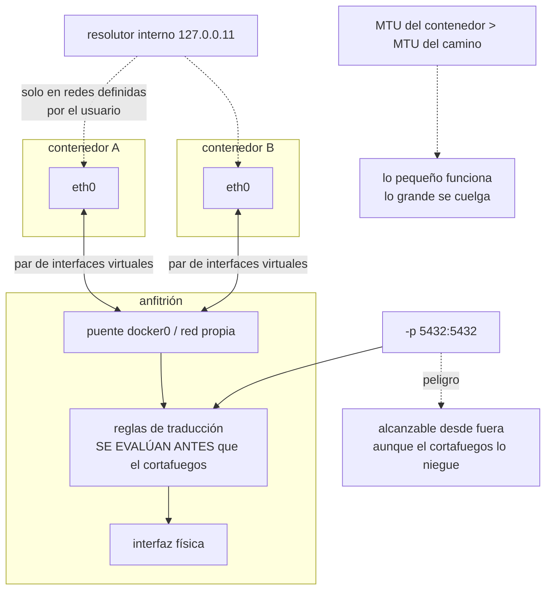

# 065 — Redes bridge, DNS interno y publicación de puertos

> [← 064 · Volúmenes, bind mounts y persistencia](../../part-05-containers-docker-oci/064-volumenes-bind-mounts-y-persistencia/README.md) · [Índice de la parte](../README.md) · [066 · Docker Compose y aplicaciones multiservicio →](../../part-05-containers-docker-oci/066-docker-compose-y-aplicaciones-multiservicio/README.md)

**Parte:** 05 — Contenedores, Docker y OCI<br>
**Nivel:** intermedio · **Horas estimadas:** 4<br>
**Laboratorio:** `network` · **Estado:** `EXECUTABLE_CORE`

## 🎯 Propósito

Conectar contenedores entre sí y con el exterior, que es la segunda fuga que la clase 060 predijo y la que produce los diagnósticos más largos. Tres hechos concretos explican casi todos los incidentes: la red por defecto **no resuelve nombres** entre contenedores, publicar un puerto **puede saltarse el cortafuegos del anfitrión**, y una unidad máxima de transmisión mal ajustada hace que las peticiones pequeñas funcionen y las grandes se queden colgadas — el fallo de red más difícil de atribuir que existe.

## 📚 Resultados de aprendizaje

Al finalizar podrás:

1. **Explicar** qué crea el motor al conectar un contenedor y por qué la red por defecto no resuelve nombres.
2. **Publicar** un puerto sabiendo qué regla se inserta y por qué puede eludir el cortafuegos del anfitrión.
3. **Diagnosticar** un problema de unidad máxima de transmisión distinguiéndolo de un fallo de aplicación.
4. **Anticipar** el efecto de la caché de resolución de nombres cuando un contenedor cambia de dirección.
5. **Elegir** el modo de red adecuado y justificar cuándo compensa renunciar al aislamiento.

## 🧩 Conceptos centrales

| Concepto | Comprensión verificable |
|---|---|
| `par de interfaces virtuales` | Cable virtual con dos extremos: uno dentro del contenedor y otro en el anfitrión, conectado a un puente. Es toda la conectividad del modo por defecto. |
| `red definida por el usuario` | Red propia con **resolución de nombres integrada**. La red por defecto no la tiene: ahí los contenedores solo se alcanzan por dirección. |
| `publicación de puertos` | Regla de traducción en el anfitrión que redirige un puerto suyo al contenedor. **Se evalúa antes que muchas reglas de cortafuegos**, así que puede exponer lo que se creía cerrado. |
| `unidad máxima de transmisión` | Tamaño máximo de paquete. Si la del contenedor es mayor que la del camino real, los paquetes grandes se descartan: lo pequeño funciona y lo grande se cuelga. |
| `caché de resolución` | Dirección guardada por la aplicación tras resolver un nombre. Si el contenedor destino se recrea con otra dirección, el cliente sigue hablando con una que ya no existe. |
| `modo de red del anfitrión` | El contenedor comparte la pila de red de la máquina: sin traducción, sin aislamiento y sin publicación. Se elige por rendimiento, no por comodidad. |

## 🧠 Modelo mental

Una imagen es un artefacto inmutable; un contenedor es un proceso aislado con límites y dependencias explícitas, no una máquina virtual pequeña.

Aplicado a esta clase, separa siempre cuatro planos: **intención** (qué necesita el usuario),
**configuración** (qué declaramos), **estado observado** (qué existe de verdad) y
**evidencia** (cómo sabemos que cumple). Confundirlos produce diseños que se ven correctos
en un diagrama pero fallan al operar.

## 🗺️ Flujo de razonamiento



## 📖 Desarrollo

### 1. Qué crea el motor, y por qué la red por defecto no resuelve nombres

Al arrancar un contenedor en el modo habitual, el motor hace tres cosas:

```text
1. crea un espacio de nombres de red propio (clase 063)
2. crea un par de interfaces virtuales: un extremo dentro, otro en el anfitrión
3. conecta el extremo del anfitrión a un puente y añade reglas de traducción
```

Se puede ver desde los dos lados:

```bash
$ docker run -d --name a --network cls alpine sleep 1d
$ docker exec a ip -br addr
lo    UNKNOWN  127.0.0.1/8
eth0  UP       172.19.0.2/16

$ ip -br link | grep veth
veth8a1c2f@if12  UP
$ bridge link | grep veth8a1c2f
… master br-4f2a91c
```

Y aquí está la diferencia que causa el «no encuentro el otro contenedor»:

```text
red por defecto (bridge)        NO hay resolución de nombres entre contenedores
red definida por el usuario     SÍ: un resolutor interno traduce el nombre
                                del contenedor o del servicio a su dirección
```

```bash
$ docker run --rm alpine ping -c1 a                  # red por defecto
ping: bad address 'a'

$ docker network create cls
$ docker run --rm --network cls alpine ping -c1 a    # red propia
64 bytes from 172.19.0.2: seq=0 ttl=64 time=0.077 ms
```

La regla operativa es corta: **nunca se usa la red por defecto**. Una red por aplicación o por grupo de servicios da resolución de nombres, aislamiento respecto de contenedores ajenos del mismo anfitrión y un rango de direcciones controlado.

El resolutor vive en una dirección de bucle local dentro del contenedor y reenvía al del anfitrión lo que no conoce:

```bash
$ docker exec a cat /etc/resolv.conf
nameserver 127.0.0.11
options ndots:0
```

Y de ahí sale un fallo que aparece al conectar un contenedor a varias redes: **el orden de resolución y de rutas depende del orden de conexión**, así que un contenedor en dos redes puede salir por la que no se esperaba. La corrección es no conectar a varias redes salvo que haga falta, y cuando haga falta, declarar explícitamente por dónde sale.

Una precisión sobre lo que la resolución de nombres **no** arregla: sigue siendo una dirección, y las direcciones cambian. Un contenedor recreado obtiene otra, así que la resolución hay que hacerla cuando se necesita, no una vez al arrancar. Es la tercera vez que la resolución de nombres aparece como causa raíz en este programa —la zona privada de la clase 039 y el acceso privado de la 051— y no será la última.

### 2. Publicar un puerto no es abrir un puerto: es insertar una regla

Este es el hecho de seguridad más importante de la clase y el menos conocido.

```bash
$ docker run -d -p 5432:5432 postgres:16
```

Eso no «abre» nada en el sentido del cortafuegos: **inserta una regla de traducción de destino** que redirige el puerto del anfitrión al contenedor. Y esa regla se evalúa en una cadena que, en la configuración habitual, **se procesa antes que las reglas del cortafuegos de usuario**.

La consecuencia es directa y sorprende siempre:

```bash
$ sudo ufw status
Status: active
To          Action  From
22/tcp      ALLOW   Anywhere
(todo lo demás denegado)

$ nmap -p 5432 el-servidor-desde-fuera
PORT     STATE
5432/tcp open        ← el cortafuegos dice que no y el puerto responde
```

Una base de datos publicada con la sintaxis corta queda escuchando en **todas** las interfaces, incluida la pública, con un cortafuegos activo que parece protegerla. Es una de las causas más habituales de bases de datos expuestas en internet.

Las tres correcciones, y hay que aplicar al menos una:

```text
1. publicar solo en bucle local
   -p 127.0.0.1:5432:5432        ← accesible desde el anfitrión y de nadie más

2. no publicar en absoluto
   los contenedores de la misma red se alcanzan por nombre y puerto interno;
   publicar solo lo que de verdad entra desde fuera

3. reglas de cortafuegos en la cadena correcta
   la que el motor consulta, no la de usuario
```

La segunda es la correcta en la mayoría de los casos y la que menos se usa. En una aplicación con base de datos, caché y servicio web, **lo único que debería publicarse es el puerto del servicio web**. Todo lo demás se habla por la red interna.

Y la comprobación, que es una prueba negativa en el sentido de las clases 046 y 058:

```bash
$ ss -ltnp | grep 5432
LISTEN 0 4096 127.0.0.1:5432   ← solo bucle local                        ✓
$ nmap -p 5432 $IP_PUBLICA
5432/tcp filtered                                                         ✓
```

Sobre la **salida**, el mecanismo es la traducción de origen: el contenedor sale con la dirección del anfitrión. Eso trae dos consecuencias conocidas de las partes anteriores:

```text
el destino ve la IP del anfitrión, no la del contenedor
  → las listas de permitidos de terceros se hacen con la del anfitrión
el número de conexiones simultáneas al mismo destino tiene un tope
  → es el agotamiento de puertos de traducción de las clases 039, 043 y 051
```

Cuarta aparición del mismo problema, con un cuarto mecanismo. Y la misma corrección de siempre en la aplicación: reutilizar el cliente en vez de abrir una conexión por petición.

Y un conflicto de direcciones que aparece en redes corporativas: el motor elige rangos privados por defecto para sus puentes, y esos rangos **pueden coincidir con los de la red de la empresa**. El síntoma es que algunos destinos internos dejan de ser alcanzables desde los contenedores y otros no, según qué rango colisione. Se corrige declarando los rangos:

```bash
$ cat /etc/docker/daemon.json
{"default-address-pools": [{"base": "10.240.0.0/12", "size": 24}]}
```

Es la misma planificación de direcciones de las clases 027, 039 y 051, aplicada al anfitrión.

### 3. La unidad máxima de transmisión: lo pequeño funciona y lo grande se cuelga

Merece una sección propia porque es el fallo de red más difícil de atribuir, y su síntoma engaña a todo el mundo.

Si el contenedor cree que puede enviar paquetes de 1.500 bytes y el camino real solo admite 1.400 —porque hay una red superpuesta, un túnel o una red privada virtual por medio—, los paquetes grandes se descartan. Y como las peticiones pequeñas caben, **todo parece funcionar**:

```text
funciona     conexión, negociación de cifrado, peticiones pequeñas,
             comprobaciones de estado, `curl` de una página
se cuelga    subidas, respuestas grandes, consultas con mucho resultado,
             clonar un repositorio
```

El diagnóstico habitual va a la aplicación, al servidor, al tiempo de espera. Y la comprobación que lo identifica en un minuto es esta:

```bash
# paquete de 1472 + 28 de cabeceras = 1500, sin fragmentar
$ docker exec app ping -M do -s 1472 -c1 destino.interno
ping: local error: message too long, mtu=1400

$ docker exec app ping -M do -s 1372 -c1 destino.interno
64 bytes from …: seq=0 ttl=63 time=1.21 ms          ← 1400 sí cabe
```

Y el ajuste, en la red del contenedor:

```bash
$ docker network create --opt com.docker.network.driver.mtu=1400 cls
$ docker exec app ip link show eth0 | head -1
2: eth0@if14: <BROADCAST,MULTICAST,UP> mtu 1400
```

La causa profunda es que el mecanismo que debería resolverlo solo —el descubrimiento de la unidad máxima del camino— depende de mensajes de control que **muchos cortafuegos bloquean por costumbre**. Cuando esos mensajes no llegan, el emisor nunca se entera de que sus paquetes son demasiado grandes y sencillamente reintenta hasta agotar el tiempo.

Dos lugares donde esto aparece casi siempre:

```text
redes superpuestas entre nodos    encapsulan y restan bytes a cada paquete
redes privadas virtuales          lo mismo, con otro encabezado
```

Y una regla práctica que evita la clase entera de incidentes: **al montar cualquier red que encapsule, se comprueba la unidad máxima efectiva antes de desplegar nada**, con la orden de arriba. Cuesta un minuto y ahorra los días que cuesta encontrarlo después, cuando el síntoma es «las subidas grandes fallan a veces».

### 4. Las direcciones cambian y la aplicación no se entera

La resolución de nombres integrada resuelve el nombre a una dirección **en el momento de preguntar**. Un contenedor recreado obtiene otra dirección, y ahí empieza el problema.

```bash
$ docker inspect -f '{{range .NetworkSettings.Networks}}{{.IPAddress}}{{end}}' bd
172.19.0.3
$ docker compose up -d --force-recreate bd
$ docker inspect -f '{{range .NetworkSettings.Networks}}{{.IPAddress}}{{end}}' bd
172.19.0.7                     ← otra
```

Si el cliente resolvió al arrancar y guardó la dirección, sigue intentando la antigua. El síntoma es característico: **el servicio funciona hasta que se reinicia su dependencia, y entonces falla hasta que se reinicia él también**. Y como reiniciarlo lo arregla, se archiva como «cosa rara» en vez de corregirse.

Los culpables habituales:

```text
tiempos de ejecución que cachean para siempre por defecto
  ciertas máquinas virtuales guardan la resolución sin caducidad
  salvo que se les indique lo contrario
grupos de conexiones que resuelven una vez al crearse
clientes que guardan la dirección en lugar del nombre
```

Las correcciones, por orden:

```text
1. que el cliente resuelva por NOMBRE en cada conexión nueva
2. acotar la caché de resolución a segundos, no a infinito
3. que el grupo de conexiones cierre y recree conexiones periódicamente
4. reintentar ante un fallo de conexión en lugar de propagarlo
```

La cuarta es la que convierte el incidente en invisible, y es la misma conclusión que este programa ha alcanzado ya cuatro veces con las conmutaciones de bases de datos gestionadas: **una dependencia que cambia de sitio es funcionamiento normal, y el cliente tiene que sobrevivir a ello**.

Y un detalle de la resolución interna que conviene conocer para no perseguirlo: la opción de puntos que el motor escribe en la configuración del resolutor hace que ciertos nombres se intenten primero con sufijos de búsqueda. En entornos con muchos sufijos, eso multiplica las consultas y añade latencia a cada resolución nueva. Se nota en aplicaciones que abren muchas conexiones a nombres externos, y se corrige poniendo el nombre completo con punto final o ajustando la opción.

```bash
$ time docker exec app getent hosts api.proveedor.com
real    0m0.312s          ← cinco consultas fallidas antes de la buena
$ time docker exec app getent hosts api.proveedor.com.
real    0m0.021s
```

### 5. Los cuatro modos de red y cuándo compensa renunciar al aislamiento

```text
puente (por defecto)   espacio de red propio, traducción, publicación de puertos
anfitrión              comparte la pila de red de la máquina
ninguna                sin red: solo bucle local
compartida             usa el espacio de red de OTRO contenedor
```

**El modo anfitrión** elimina la traducción y el par de interfaces, y con ellos su coste. Es la respuesta correcta para cargas con muchísimo tráfico o muy sensibles a la latencia, y hay que aceptar lo que se pierde:

```text
se gana   sin traducción: menos latencia y más rendimiento por núcleo
          la aplicación ve la IP de origen real de los clientes
se pierde aislamiento de red: el contenedor puede escuchar en cualquier puerto
          del anfitrión y ver todo su tráfico
          no hay publicación: los puertos son los del anfitrión, con sus conflictos
```

La penúltima línea es la que decide: en una máquina compartida por varios equipos, el modo anfitrión reparte el espacio de puertos entre todos y un servicio puede ocupar el puerto de otro.

**El modo compartido** es el más interesante conceptualmente, porque explica dos cosas del resto del programa:

```bash
$ docker run --rm -it --network container:app --pid container:app \
    nicolaka/netshoot ss -ltnp
```

Eso arranca un contenedor con herramientas de diagnóstico **dentro de la red y los procesos del contenedor que se investiga**, lo que resuelve el problema que la clase 062 dejó abierto: cómo depurar una imagen sin intérprete de órdenes. Es la técnica que la clase 070 desarrolla.

Y es exactamente el mecanismo con el que funciona la unidad de despliegue de la parte 06: varios contenedores que comparten espacio de red **se ven entre sí en el bucle local** y comparten una única dirección. Conocerlo aquí hace que aquello no parezca magia:

```text
contenedores que comparten espacio de red
  → se llaman por 127.0.0.1
  → comparten los puertos: dos no pueden escuchar en el mismo
  → una sola dirección para el conjunto
```

Y **el modo sin red** tiene un uso real que se olvida: un proceso por lotes que solo lee de un volumen y escribe en él no necesita red, y quitársela elimina una superficie entera. Es la aplicación del privilegio mínimo a la conectividad, y es gratis.

Para terminar, el criterio de elección resumido:

```text
puente con red propia   valor por defecto para todo
anfitrión               rendimiento medido que lo justifique, máquina dedicada
ninguna                 procesos por lotes sin dependencias de red
compartida              diagnóstico, y como modelo mental de la parte 06
```

Y la comprobación que cierra la clase, que debería estar en el guion de verificación de la 072:

```bash
# ningún servicio interno publicado hacia fuera
$ docker ps --format '{{.Names}}\t{{.Ports}}' | grep -v '127.0.0.1' | grep '0.0.0.0'
(vacío salvo el frontal)                                                    ✓
```

## 🔬 Ejemplo trabajado

**CloudShop conecta sus contenedores. La aplicación funciona en el portátil de todo el mundo y produce cinco incidentes en cuanto sale de ahí — dos de conectividad, uno de seguridad y dos que tardaron días porque el síntoma no señalaba a la red.**

**Incidente 1 — el servicio no encuentra la base de datos.**

```text
Error: getaddrinfo ENOTFOUND bd
```

Ambos contenedores estaban en la red por defecto, que no resuelve nombres. La solución de urgencia fue usar la dirección; la correcta, una red propia.

```text                                        antes            después
red                                        por defecto      una por aplicación
resolución entre contenedores                  no                sí
referencia en la configuración          172.17.0.3           bd:5432
al recrear la base de datos            hay que reconfigurar   sigue funcionando
```

**Incidente 2 — la base de datos estaba en internet.**

Una revisión externa encuentra el puerto 5432 accesible desde fuera del centro de datos, con el cortafuegos del anfitrión activo y denegando todo salvo el 22.

```bash
$ docker ps --format '{{.Names}}\t{{.Ports}}'
bd    0.0.0.0:5432->5432/tcp
$ sudo iptables -t nat -L DOCKER -n | grep 5432
DNAT  tcp -- 0.0.0.0/0  0.0.0.0/0  tcp dpt:5432 to:172.19.0.3:5432
```

La regla de traducción se evaluaba antes que las del cortafuegos de usuario. La base había estado alcanzable **once días**.

```text                                        antes            después
publicación de la base de datos        0.0.0.0:5432       no se publica
publicación de la caché                0.0.0.0:6379       no se publica
puertos publicados en total                  4                 1
contraseña de la base de datos          la de siempre    rotada el mismo día
prueba negativa desde fuera               ninguna       en el guion de verificación
```

El orden fue el de todas las exposiciones de este programa: **rotar primero, corregir después**. Cuarta vez.

**Incidente 3 — las subidas grandes se quedaban colgadas.**

Durante tres semanas, las subidas de facturas de más de unos 200 KB fallaban «a veces». Las pequeñas siempre funcionaban, la comprobación de estado siempre en verde, y el proveedor de la red privada virtual decía que todo estaba bien.

```bash
$ docker exec app ping -M do -s 1472 -c1 almacen.interno
ping: local error: message too long, mtu=1400
```

La red privada virtual entre el centro de datos y el proveedor restaba 100 bytes por paquete, y la red del contenedor seguía anunciando 1.500.

```text                                        antes            después
unidad máxima de la red del contenedor      1.500            1.400
subidas grandes fallidas                   ~18 %              0 %
días hasta encontrar la causa                21                —
comprobación al montar una red que encapsula  ninguna    obligatoria, documentada
```

Veintiún días para una comprobación de un minuto. La medida que evita la repetición no es el ajuste: es haber puesto la comprobación en la lista de puesta en marcha de cualquier red que encapsule.

**Incidente 4 — el servicio falla cada vez que se reinicia la base de datos.**

```text
patrón   se reinicia la base de datos → el servicio empieza a fallar
         se reinicia el servicio → todo vuelve a funcionar
```

El cliente resolvía el nombre al crear el grupo de conexiones y la máquina virtual del lenguaje guardaba esa resolución **sin caducidad**, que era su valor por defecto.

```text                                        antes            después
caducidad de la caché de resolución      indefinida           30 s
resolución                              una vez al arrancar  por conexión nueva
renovación del grupo de conexiones         nunca          cada 30 min
reintento ante fallo de conexión             no               sí
reinicios del servicio por este motivo    9 en 2 meses          0
```

**Incidente 5 — algunos destinos internos dejaron de ser alcanzables.**

Desde los contenedores de un nodo concreto, tres sistemas internos no respondían y el resto sí.

```bash
$ docker network inspect cls -f '{{range .IPAM.Config}}{{.Subnet}}{{end}}'
172.20.0.0/16
$ ip route | grep 172.20
172.20.0.0/16 dev br-4f2a91c        ← y la empresa usa 172.20.4.0/24 para nóminas
```

El puente había elegido un rango que colisionaba con una red corporativa, así que el tráfico hacia ella se quedaba en el puente local.

```text                                        antes            después
rangos del motor                        elegidos solos    declarados: 10.240.0.0/12
destinos internos inalcanzables               3                 0
coordinación con el plan de direcciones      ninguna     el mismo de la clase 051
```

**Resumen de la red:**

```text                                          antes         después
redes definidas por el usuario                    0             3
puertos publicados hacia todas las interfaces     4             1
días de la base de datos expuesta                11             0
subidas grandes fallidas                       ~18 %          0 %
reinicios por caché de resolución            9 en 2 meses       0
destinos internos inalcanzables                   3             0
comprobaciones de red en la verificación          0             4
```

**La lección que esta clase traslada al resto de la parte 05**: tres de los cinco incidentes no parecían de red. La subida colgada parecía de la aplicación, el fallo tras reiniciar la dependencia parecía «cosa rara» y la exposición de la base de datos no parecía nada porque el cortafuegos decía que estaba cerrada. Los tres se diagnostican con una orden cada uno, y las tres órdenes caben en un guion de verificación. **La red de contenedores no es difícil: es invisible**, y lo que la hace manejable es tener escritas las cuatro comprobaciones antes de necesitarlas.

## 🧪 Laboratorio guiado

Ejecuta desde la raíz:

```bash
python classes/part-05-containers-docker-oci/065-redes-bridge-dns-interno-y-publicacion-de-puertos/lab.py
```

El laboratorio selecciona el motor de práctica **`network`** y produce
`lab_result.json`. El escenario, sus comprobaciones y el artefacto esperado corresponden a
esta clase; no requiere credenciales y deja explícito qué debe revalidarse en un sandbox real.

1. Lee `exercise.steps` y formula una predicción antes de ejecutar.
2. Ejecuta la práctica y verifica todos los elementos de `checks`.
3. Provoca el caso de `negative_test` y explica la señal observada.
4. Materializa `red-contenedores` en `evidence/` usando la plantilla indicada.
5. Para proveedor real, sigue `sandbox.requires`, registra costo y ejecuta `destroy`.

### Evidencia esperada

El artefacto principal es una topología con rutas, puertos y controles. Además, la entrega debe incluir el comando ejecutado,
la salida estructurada y una conclusión que no exceda lo observado.

## 🏆 Reto verificable

Construye **`red-contenedores`** para el caso CloudShop. Incluye una alternativa descartada,
un supuesto que pueda falsarse, una prueba de fallo y una decisión de rollback.

## ✅ Criterio de aceptación

- [ ] `lab.py` termina con código 0 y genera JSON válido.
- [ ] La entrega conecta al menos tres requisitos con mecanismos verificables.
- [ ] Existe una prueba positiva y una prueba negativa con evidencia.
- [ ] Seguridad, costo y operación aparecen como decisiones, no como anexos.
- [ ] Se declara una limitación y una condición que obligaría a revisar el diseño.
- [ ] Otra persona puede repetir el recorrido sin conocimiento tácito.

## ⚠️ Errores frecuentes

| Síntoma | Causa probable | Corrección |
|---|---|---|
| Un contenedor no resuelve el nombre de otro | Ambos están en la red por defecto, que no tiene resolución de nombres integrada | Crea una red propia por aplicación; nunca uses la red por defecto. |
| Un servicio interno es alcanzable desde internet con el cortafuegos activo | La publicación de puertos inserta una regla de traducción que se evalúa antes que el cortafuegos de usuario | No publiques lo interno; si hace falta, publica solo en bucle local y verifica desde fuera con una prueba negativa. |
| Las peticiones pequeñas funcionan y las grandes se quedan colgadas | La unidad máxima de transmisión del contenedor es mayor que la del camino real | Comprueba con `ping -M do -s` y ajusta la unidad máxima de la red; hazlo siempre al montar una red que encapsule. |
| El servicio falla al reiniciar su dependencia y se arregla reiniciándolo | La aplicación cacheó la dirección resuelta sin caducidad | Resuelve por nombre en cada conexión nueva, acota la caché a segundos y reintenta ante fallo de conexión. |
| Algunos destinos internos son inalcanzables desde los contenedores | El rango del puente colisiona con una red corporativa | Declara los rangos del motor dentro del plan de direcciones de la organización. |
| Se agotan las conexiones salientes hacia un destino concreto | Traducción de origen con un tope de puertos, cuarta aparición del mismo problema | Reutiliza el cliente en la aplicación; el mecanismo cambia y la corrección es siempre la misma. |

## 🛡️ Seguridad, ética y costo

Trabaja con cuentas propias o sandboxes autorizados. No publiques secretos, identificadores
reales ni datos personales. Antes de crear recursos pagos define presupuesto, etiquetas y
comando de destrucción; después verifica que no queden recursos huérfanos. Los ejemplos
locales enseñan contratos, pero no certifican cumplimiento ni disponibilidad de producción.

## ❓ Preguntas de comprobación

1. ¿Por qué dos contenedores en la red por defecto no se encuentran por nombre, y cuál es la corrección?
2. ¿Qué inserta exactamente `-p 5432:5432` y por qué puede eludir el cortafuegos del anfitrión?
3. Describe el síntoma de una unidad máxima mal ajustada y la orden que lo confirma en un minuto.
4. ¿Por qué un servicio falla al reiniciar su base de datos y se arregla reiniciándolo?
5. ¿Qué se gana y qué se pierde con el modo de red del anfitrión, y qué explica el modo compartido sobre la parte 06?

## 🔗 Referencias

- Docker (2025). *Networking overview* — puentes, redes definidas por el usuario y resolución de nombres. <https://docs.docker.com/engine/network/>
- Docker (2025). *Packet filtering and firewalls* — cadenas de traducción y su relación con el cortafuegos del anfitrión. <https://docs.docker.com/engine/network/packet-filtering-firewalls/>
- Docker (2025). *Network drivers and options* — modo anfitrión, ninguno, compartido y opciones de unidad máxima. <https://docs.docker.com/engine/network/drivers/>
- Linux (2025). *veth(4)* — pares de interfaces virtuales. <https://man7.org/linux/man-pages/man4/veth.4.html>
- Cloudflare (2024). *Path MTU discovery in practice* — por qué falla el descubrimiento y cómo se manifiesta. <https://blog.cloudflare.com/path-mtu-discovery-in-practice/>
- Documentación oficial vigente del servicio implementado; registra URL y fecha de consulta.

---

> [Evaluación](assessment.md) · [Contrato de clase](lesson.yaml) · [Índice de la parte](../README.md)

**📥 Descargar:** [Parte 05 en PDF](../../../site/downloads/partes/manual-parte-05-containers-docker-oci.pdf) · [Manual integral](../../../site/downloads/multi-cloud-engineering-manual-v2.0.pdf)

| Anterior | Índice | Siguiente |
|---|---|---|
| [← 064 · Volúmenes, bind mounts y persistencia](../../part-05-containers-docker-oci/064-volumenes-bind-mounts-y-persistencia/README.md) | [Parte 05](../README.md) · [Programa](../../README.md) | [066 · Docker Compose y aplicaciones multiservicio →](../../part-05-containers-docker-oci/066-docker-compose-y-aplicaciones-multiservicio/README.md) |
