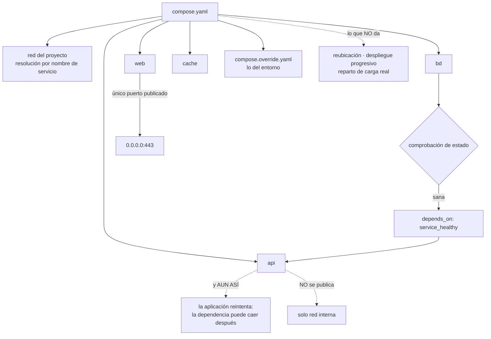

# 066 — Docker Compose y aplicaciones multiservicio

> [← 065 · Redes bridge, DNS interno y publicación de puertos](../../part-05-containers-docker-oci/065-redes-bridge-dns-interno-y-publicacion-de-puertos/README.md) · [Índice de la parte](../README.md) · [067 · Registros, SBOM, firma y procedencia de imágenes →](../../part-05-containers-docker-oci/067-registros-sbom-firma-y-procedencia-de-imagenes/README.md)

**Parte:** 05 — Contenedores, Docker y OCI<br>
**Nivel:** intermedio · **Horas estimadas:** 4<br>
**Laboratorio:** `orchestration` · **Estado:** `EXECUTABLE_CORE`

## 🎯 Propósito

Definir una aplicación de varios servicios con Compose, que resuelve muy bien un problema —que todo el equipo levante lo mismo con una orden— y resuelve muy mal otro que se le pide constantemente: ser la plataforma de producción. La clase enseña las dos cosas: cómo se escribe un fichero que funciona igual en todas las máquinas, y **dónde está exactamente la frontera** a partir de la cual seguir usándolo es una decisión que hay que justificar por escrito.

## 📚 Resultados de aprendizaje

Al finalizar podrás:

1. **Declarar** dependencias que esperen a que el servicio esté listo, no a que haya arrancado.
2. **Separar** lo que es de la imagen de lo que es del entorno, sin reconstruir nada.
3. **Publicar** únicamente lo que entra desde fuera y comprobarlo.
4. **Enumerar** qué garantiza Compose y qué no, con la consecuencia operativa de cada carencia.
5. **Traducir** un fichero de Compose a un despliegue de plataforma señalando qué se conserva y qué no.

## 🧩 Conceptos centrales

| Concepto | Comprensión verificable |
|---|---|
| ``depends_on` simple` | Solo espera a que el contenedor **arranque**, no a que el servicio esté listo. Es la causa del fallo de arranque más repetido con Compose. |
| `condición de salud` | `condition: service_healthy` combinado con una comprobación de estado. Es lo único que convierte `depends_on` en una espera útil. |
| `perfil` | Etiqueta que hace opcional a un servicio. Permite un fichero único para desarrollo, pruebas y herramientas puntuales sin levantarlo todo siempre. |
| `superposición de ficheros` | Compose combina `compose.yaml` con otros por capas. Es el mecanismo para que la misma definición valga en varios entornos sin duplicarla. |
| `red del proyecto` | Red propia que Compose crea, con resolución de nombres por nombre de servicio. Es una red definida por el usuario de la clase 065, con sus mismas propiedades. |
| `política de reinicio` | Instrucción para volver a arrancar un contenedor caído en la **misma** máquina. No es alta disponibilidad: no reubica nada si la máquina desaparece. |

## 🧠 Modelo mental

Una imagen es un artefacto inmutable; un contenedor es un proceso aislado con límites y dependencias explícitas, no una máquina virtual pequeña.

Aplicado a esta clase, separa siempre cuatro planos: **intención** (qué necesita el usuario),
**configuración** (qué declaramos), **estado observado** (qué existe de verdad) y
**evidencia** (cómo sabemos que cumple). Confundirlos produce diseños que se ven correctos
en un diagrama pero fallan al operar.

## 🗺️ Flujo de razonamiento



## 📖 Desarrollo

### 1. Esperar a que arranque no es esperar a que esté listo

Es el error más repetido con Compose y produce el mismo síntoma en todos los equipos: la primera vez que alguien levanta la aplicación, falla; la segunda, funciona.

```yaml
services:
  api:
    image: registro/api@sha256:9f2c…
    depends_on: [bd]        # ← solo espera a que el CONTENEDOR arranque
```

Un motor de base de datos tarda varios segundos en aceptar conexiones después de que su contenedor exista. `depends_on` en su forma simple no lo sabe: arranca `api` en cuanto `bd` existe, y `api` falla al conectar.

La corrección tiene dos mitades y hacen falta las dos.

**La primera: una comprobación de estado real y una condición.**

```yaml
services:
  bd:
    image: postgres:16@sha256:1a2b…
    environment:
      POSTGRES_PASSWORD_FILE: /run/secrets/bd_password
    healthcheck:
      test: ["CMD-SHELL", "pg_isready -U app -d pedidos"]
      interval: 5s
      timeout: 3s
      retries: 10
      start_period: 30s

  api:
    image: registro/api@sha256:9f2c…
    depends_on:
      bd:
        condition: service_healthy
```

El `start_period` merece atención: durante ese plazo inicial, los fallos **no cuentan** para marcar el servicio como enfermo. Sin él, un motor que tarda cuarenta segundos en abrir se marca como enfermo antes de estar listo y el conjunto no levanta nunca. Es el mismo retardo inicial que la reparación automática de la clase 052 necesitaba, con el mismo razonamiento.

**La segunda: la aplicación reintenta igualmente.**

La condición de salud resuelve el arranque y no resuelve la vida. La base de datos puede reiniciarse a las tres horas, y entonces no hay ningún `depends_on` que ayude. Es la quinta vez que este programa llega a la misma conclusión —las conmutaciones gestionadas de las clases 048, 054 y 060, la resolución de nombres de la 065 y ahora esta—, así que ya se puede enunciar sin matices:

> **Una dependencia que no está disponible es funcionamiento normal, no un caso excepcional. El cliente reintenta con retroceso o el sistema no es correcto.**

Y conviene saber qué hace la comprobación de estado en Compose y qué no: marca el servicio como sano o enfermo, y **no lo reinicia**. Para eso está la política de reinicio, que es otra cosa y se combina con ella.

Un detalle práctico que ahorra tiempo en canalizaciones: `--wait` bloquea hasta que todos los servicios con comprobación estén sanos, lo que convierte el arranque en algo verificable:

```bash
$ docker compose up -d --wait --wait-timeout 120
$ echo $?      # 0 solo si todo llegó a sano
```

Eso es exactamente lo que hace falta en una prueba de integración: no «arrancó», sino «está listo».

### 2. Lo de la imagen, lo del entorno y lo que no debe estar

La clase 062 estableció el principio: **se construye una vez y se promueve; lo que cambia entre entornos es la configuración inyectada al ejecutar**. Compose es donde ese principio se materializa en local.

La estructura que lo consigue:

```yaml
# compose.yaml — lo común, válido en cualquier entorno
services:
  api:
    image: registro/api@sha256:9f2c…
    environment:
      LOG_LEVEL: ${LOG_LEVEL:-info}
      BD_HOST: bd
    secrets: [bd_password]
    read_only: true
    tmpfs: [/tmp:size=64m,noexec,nosuid]
    user: "10001:10001"

secrets:
  bd_password:
    file: ./.secretos/bd_password
```

```yaml
# compose.override.yaml — solo desarrollo; Compose lo aplica encima solo
services:
  api:
    build: .
    environment:
      LOG_LEVEL: debug
    develop:
      watch:
        - action: sync
          path: ./src
          target: /app/src
```

Dos cosas que hace bien esa separación. La primera: el fichero base **no construye**, usa una huella, así que en pruebas y en preproducción se ejecuta el mismo artefacto que en producción. La segunda: la sincronización de código para desarrollo está en la capa que no viaja, en vez de resolverse con un montaje del anfitrión que después alguien copia a un entorno real.

Y los **perfiles** evitan el fichero que levanta doce servicios cuando hacen falta tres:

```yaml
services:
  panel-bd:
    image: adminer
    profiles: [herramientas]
```

```bash
$ docker compose up -d                        # sin panel-bd
$ docker compose --profile herramientas up -d # con él
```

Sobre los **secretos**, la regla es la de las clases 061 y 062, y Compose tiene un mecanismo propio que evita la vía cómoda:

```text
mal   environment: BD_PASSWORD=…       queda en la configuración del contenedor,
                                        legible con inspect por cualquiera
      un .env con credenciales reales   acaba en el repositorio

bien  secrets: montados como fichero    fuera de la configuración,
                                        y en producción los sustituye
                                        el gestor de la plataforma
```

Y una advertencia sobre `.env` que se paga en casi todos los equipos: Compose lo lee automáticamente y su nombre invita a poner credenciales. Debe estar en `.gitignore` desde el primer commit, contener solo valores no sensibles, y tener un `\.env.example` versionado que documente las claves sin los valores.

Y la red, que es la de la clase 065 con otro nombre: Compose crea una red propia del proyecto, con resolución por nombre de servicio, así que `BD_HOST: bd` funciona sin ninguna dirección. De ahí se sigue la regla de publicación:

```yaml
services:
  web:
    ports: ["127.0.0.1:8080:8080"]   # lo único que entra desde fuera
  api: {}                             # sin ports: solo red interna
  bd:  {}                             # sin ports
```

Publicar la base de datos «para poder conectarme con mi cliente» es exactamente el incidente de la clase 065. Si hace falta, se publica en bucle local y se documenta.

### 3. Dónde está la frontera, dicho sin rodeos

Compose se acaba usando en producción por una progresión razonable: funciona, el equipo lo conoce y montar otra cosa cuesta. Conviene tener la lista de lo que **no** hace, porque cada carencia tiene una consecuencia operativa concreta.

```text
no reubica              si la máquina cae, la aplicación no se mueve a ninguna parte
                        `restart: always` solo reinicia en LA MISMA máquina
no despliega progresivamente
                        `up -d` para y arranca: hay corte, de segundos a minutos
no reparte carga        `--scale 3` da tres contenedores y la resolución interna
                        devuelve las tres direcciones; el reparto depende del cliente
no gestiona secretos    los lee de ficheros locales
no controla capacidad   nada impide que dos aplicaciones del mismo nodo compitan
no tiene salud del conjunto
                        cada servicio tiene la suya; nadie decide si el conjunto sirve
```

La tercera línea produce un fallo instructivo que enlaza con la clase 065: al escalar, la resolución interna devuelve varias direcciones, y **un cliente que resuelve una vez y guarda la primera envía todo el tráfico a un solo contenedor**. Los otros dos existen, están sanos y no reciben nada. Es un reparto de carga solo si el cliente colabora.

Y dicho todo eso, hay un caso en el que usar Compose en producción es una decisión defendible, y conviene reconocerlo en lugar de fingir que no existe:

```text
una sola máquina, sin requisito de alta disponibilidad
corte de despliegue aceptado y documentado en el acuerdo de servicio
copias de seguridad y restauración probadas (clase 064)
vigilancia externa que detecte que la máquina no responde
y la decisión escrita, con la condición que obligaría a revisarla
```

Eso describe muchas herramientas internas, entornos de demostración y sistemas de bajo tráfico. **Lo que no es defendible es llegar ahí sin haberlo decidido.** La señal de alarma es concreta: si el acuerdo de servicio promete algo que la lista de arriba no puede dar, hay una discrepancia que alguien va a descubrir durante un incidente.

Y la traducción a una plataforma real, para cuando llegue el momento, con lo que se conserva y lo que no:

```text
se conserva casi tal cual
  la imagen por huella
  las variables de entorno
  la comprobación de estado (cambia la sintaxis, no la idea)
  los nombres de servicio como nombres de red
  el usuario no privilegiado y la raíz de solo lectura

hay que rehacerlo
  la publicación de puertos → objeto de servicio y entrada
  los volúmenes → reclamaciones de almacenamiento (clase 064)
  los secretos → gestor de la plataforma (clases 046, 058)
  `restart: always` → el orquestador lo hace por diseño
  `depends_on` → NO existe: cada servicio arranca cuando puede
```

La última línea es la más importante de la traducción y la que más sorprende: **en una plataforma real no hay orden de arranque garantizado**. La condición de salud de Compose se convierte en «el cliente reintenta», que ya era obligatorio. Un equipo que se apoyó en `depends_on` en vez de en el reintento descubre en la migración que su aplicación nunca supo arrancar sin ayuda.

### 4. Un fichero que sirve de contrato del entorno

El valor real de Compose no es técnico: es que **el entorno de desarrollo deja de ser conocimiento tácito**. Un fichero versionado con las dependencias exactas sustituye a una página de instrucciones que envejece.

El fichero completo de una aplicación pequeña, con todo lo de las clases anteriores aplicado:

```yaml
name: cloudshop

services:
  web:
    image: registro/web@sha256:3c4d…
    ports: ["127.0.0.1:8080:8080"]
    environment:
      API_URL: http://api:9000
    depends_on:
      api: {condition: service_healthy}
    read_only: true
    tmpfs: ["/tmp:size=32m,noexec,nosuid"]
    user: "10001:10001"
    cap_drop: [ALL]
    security_opt: ["no-new-privileges:true"]
    healthcheck:
      test: ["CMD", "/bin/web", "-healthcheck"]
      interval: 10s
      start_period: 20s
    deploy:
      resources:
        limits: {cpus: "1.0", memory: 512M}

  api:
    image: registro/api@sha256:9f2c…
    environment:
      BD_HOST: bd
      CACHE_HOST: cache
      GOMAXPROCS: "2"                    # clase 063
    secrets: [bd_password]
    depends_on:
      bd:    {condition: service_healthy}
      cache: {condition: service_started}
    read_only: true
    tmpfs: ["/tmp:size=64m,noexec,nosuid"]
    user: "10001:10001"
    cap_drop: [ALL]
    security_opt: ["no-new-privileges:true"]
    healthcheck:
      test: ["CMD", "/bin/api", "-readyz"]
      interval: 10s
      start_period: 30s
    deploy:
      resources:
        limits: {cpus: "2.0", memory: 1G}

  bd:
    image: postgres:16@sha256:1a2b…
    environment:
      POSTGRES_DB: pedidos
      POSTGRES_USER: app
      POSTGRES_PASSWORD_FILE: /run/secrets/bd_password
    secrets: [bd_password]
    volumes: ["datos-bd:/var/lib/postgresql/data"]
    healthcheck:
      test: ["CMD-SHELL", "pg_isready -U app -d pedidos"]
      interval: 5s
      start_period: 30s

  cache:
    image: redis:7-alpine@sha256:5e6f…
    command: ["redis-server", "--maxmemory", "256mb", "--maxmemory-policy", "allkeys-lru"]

volumes:
  datos-bd:
    labels: {responsable: "equipo-pedidos"}

secrets:
  bd_password:
    file: ./.secretos/bd_password
```

Cada bloque viene de una clase anterior y merece señalarse, porque el fichero es donde todo se junta:

```text
imagen por huella                       clase 061
GOMAXPROCS acorde al límite             clase 063
límites de CPU y memoria siempre        clase 063
volumen con etiqueta de responsable     clase 064
un solo puerto publicado, en bucle local clase 065
raíz de solo lectura y montaje en memoria acotado  clases 064, 069
sin capacidades y sin elevación         clase 069
comprobación de estado con retardo inicial  clases 052, 068
política de expulsión de la caché       clase 042
```

Y dos comprobaciones que conviene tener automatizadas sobre el propio fichero, porque detectan casi todos los errores de esta clase:

```bash
# la definición es válida y resuelve todas las variables
$ docker compose config --quiet

# nada publicado hacia todas las interfaces salvo el frontal
$ docker compose config --format json \
  | jq -r '.services | to_entries[] | select(.value.ports)
           | "\(.key): \(.value.ports[].published)"'
```

La primera detecta variables sin definir, que es como se cuela una configuración vacía en producción. La segunda es la prueba negativa de la clase 065, ejecutada sobre la declaración en vez de sobre el sistema en marcha — más barata y más temprana.

### 5. Operar con Compose sin sorpresas

Cuatro órdenes concentran casi todos los accidentes, y merece la pena conocer exactamente qué hacen.

```text
docker compose up -d        crea o recrea lo que cambió; PARA y arranca: hay corte
docker compose down         para y elimina contenedores y redes
docker compose down -v      …y BORRA LOS VOLÚMENES  ← el destructor
docker compose restart      reinicia sin releer la configuración
```

La tercera es la que apareció en la clase 064 y conviene repetir porque está en muchos guiones de «empezar de cero». En una máquina compartida, un `down -v` se lleva los datos de todo el proyecto.

La cuarta esconde una trampa distinta: `restart` **no relee el fichero**. Un cambio de variable de entorno seguido de `restart` no tiene ningún efecto, y el equipo concluye que la variable no funciona. Lo que aplica cambios es `up -d`.

Y una nota sobre el corte: `up -d` recrea el contenedor cambiado, con lo que hay una ventana sin servicio. Se puede reducir, no eliminar:

```bash
$ docker compose up -d --no-deps --wait api
```

`--no-deps` evita recrear lo que no cambió y `--wait` espera a que el nuevo esté sano. Sigue habiendo corte porque el viejo se detiene antes de que el nuevo levante, y esa es precisamente la carencia estructural: **el despliegue sin corte necesita un orquestador que sepa tener dos versiones a la vez**, que es lo que la parte 06 introduce.

Para diagnosticar, cuatro órdenes que responden las preguntas habituales:

```bash
$ docker compose ps --format 'table {{.Service}}\t{{.Status}}\t{{.Health}}'
$ docker compose logs -f --tail 100 api
$ docker compose exec api sh -c 'cat /sys/fs/cgroup/memory.max'   # clase 063
$ docker compose events --json | jq -r '"\(.time) \(.service) \(.action)"'
```

La última es poco conocida y muy útil: muestra el flujo de sucesos —creaciones, muertes, reinicios— y responde de un vistazo a «qué se está reiniciando en bucle», que en un fichero con ocho servicios cuesta ver de otra forma.

Y el cierre que enlaza con el resto del programa: un fichero de Compose bien escrito es, de hecho, **la especificación de lo que hay que pedirle a cualquier plataforma**. Contiene la imagen exacta, los límites, la comprobación de salud, las dependencias, los secretos y qué se publica. Migrar a una plataforma consiste en traducir ese fichero, y las traducciones difíciles —volúmenes, publicación, arranque sin orden— son exactamente las cuatro fugas que la clase 060 predijo. Que la traducción sea mecánica en todo lo demás es la confirmación de la primera mitad de la hipótesis.

## 🔬 Ejemplo trabajado

**CloudShop define su aplicación en Compose. Funciona el primer día, se convierte en el entorno de desarrollo de todo el equipo, y acaba en una máquina de producción sin que nadie lo decidiera. Cinco incidentes ordenan las dos cosas.**

**Incidente 1 — «la primera vez nunca levanta».**

```text
api | Error: connect ECONNREFUSED 172.19.0.3:5432
api exited with code 1
```

Y funcionaba al segundo intento, así que la instrucción de puesta en marcha del equipo decía literalmente «si falla, vuelve a ejecutarlo».

```text                                        antes            después
depends_on                              forma simple     condition: service_healthy
comprobación de estado de la base           ninguna        pg_isready con
                                                          start_period de 30 s
reintento en la aplicación                   no        con retroceso, 5 intentos
arranques fallidos en frío                 100 %             0 %
instrucción "vuelve a ejecutarlo"             sí            eliminada
```

Las dos correcciones a la vez: la condición resolvió el arranque y el reintento resolvió los reinicios de la base de datos a mitad del día, que la condición no cubre.

**Incidente 2 — un `.env` con credenciales de producción.**

```bash
$ git log --oneline -S 'BD_PASSWORD' -- .env | wc -l
1
$ git show <commit>:.env | grep BD_PASSWORD
BD_PASSWORD=Pr0d-2026-…
```

El fichero se había versionado once meses atrás. Y algo peor: alguien había levantado el entorno local con él, así que su máquina se conectó a la base de datos real durante una tarde de pruebas.

```text                                        antes            después
.env en el repositorio                        sí               no
secretos                              variables de entorno   ficheros montados
                                                             como secretos
.env.example versionado                       no               sí
credencial rotada                              —          la misma tarde
escaneo de secretos en el repositorio      ninguno       en cada pull request
```

**Incidente 3 — `down -v` en la máquina compartida.**

Un guion de «reiniciar el entorno» ejecutaba `docker compose down -v`. En la máquina de integración compartida, se llevó los datos de prueba de tres equipos, incluida una base de datos con casos reproducidos durante semanas.

```text                                        antes            después
orden en el guion                       down -v          down (sin -v)
reinicio de datos                       implícito        objetivo aparte,
                                                          con confirmación
copia de la base de integración          ninguna         diaria, restaurada
                                                          y verificada una vez al mes
etiquetas de responsable en volúmenes        no               sí
```

**Incidente 4 — producción en Compose, descubierta durante un corte.**

La máquina de producción se reinició por mantenimiento del proveedor. Al volver, la aplicación estaba a medias:

```text
web    up      (restart: always)
api    up      (restart: always)
bd     exited  (sin política de reinicio)
cache  up      (restart: always)
```

Y el análisis posterior encontró más de lo esperado:

```text                                        realidad
reubicación si la máquina cae            ninguna
corte en cada despliegue                 38 s medidos
acuerdo de servicio prometido            99,9 %
disponibilidad alcanzable con este montaje   ~99,2 % con suerte
copias de seguridad                      existían, nunca restauradas
vigilancia externa                       ninguna
```

La discrepancia entre lo prometido y lo alcanzable llevaba dieciocho meses sin que nadie la hubiera escrito. Se tomaron dos decisiones, y lo importante es que se **tomaron**:

```text
servicios internos de baja criticidad   se quedan en Compose, con la decisión
                                        documentada y el acuerdo corregido
tienda y api                            migran a plataforma en la parte 06
todos                                   política de reinicio uniforme,
                                        vigilancia externa y restauración probada
```

**Incidente 5 — tres réplicas y una que recibía todo.**

```bash
$ docker compose up -d --scale api=3
$ docker compose exec web sh -c 'for i in $(seq 20); do curl -s api:9000/quien; done' | sort | uniq -c
     20 api-1
```

Las tres estaban sanas. El cliente resolvía el nombre una vez, guardaba la primera dirección y la reutilizaba — el mismo problema de caché de resolución de la clase 065, con otra consecuencia.

```text                                        antes            después
réplicas                                       3                 3
réplicas que recibían tráfico                  1                 3
resolución en el cliente             una vez, cacheada    por conexión, con TTL corto
reparto real                              ninguno        proporcional
```

Y la conclusión que se anotó: **escalar con Compose reparte contenedores, no tráfico**. El reparto depende del cliente, y por eso deja de ser suficiente en cuanto el servicio importa.

**Resumen:**

```text                                          antes         después
arranques en frío fallidos                    100 %            0 %
secretos en el repositorio                       1              0
volúmenes borrados por un guion                  3              0
puertos publicados hacia todas las interfaces    4              1
réplicas que reciben tráfico                   1 de 3         3 de 3
servicios en producción sobre Compose            4              2, documentados
corte por despliegue                           38 s        38 s (aceptado por escrito)
```

**La lección que esta clase traslada al resto de la parte 05**: Compose resuelve bien el problema del entorno reproducible y **su fichero acaba siendo la especificación de lo que hay que pedirle a cualquier plataforma**. Los cinco incidentes se reparten entre los dos usos: tres eran de higiene del fichero y dos eran de haber cruzado la frontera sin decidirlo. La frontera no es un problema técnico —Compose no promete nada que incumpla— sino de expectativa: el acuerdo de servicio prometía una disponibilidad que ninguna configuración de una sola máquina puede dar, y eso no se descubre hasta que la máquina se reinicia.

## 🧪 Laboratorio guiado

Ejecuta desde la raíz:

```bash
python classes/part-05-containers-docker-oci/066-docker-compose-y-aplicaciones-multiservicio/lab.py
```

El laboratorio selecciona el motor de práctica **`orchestration`** y produce
`lab_result.json`. El escenario, sus comprobaciones y el artefacto esperado corresponden a
esta clase; no requiere credenciales y deja explícito qué debe revalidarse en un sandbox real.

1. Lee `exercise.steps` y formula una predicción antes de ejecutar.
2. Ejecuta la práctica y verifica todos los elementos de `checks`.
3. Provoca el caso de `negative_test` y explica la señal observada.
4. Materializa `stack-compose` en `evidence/` usando la plantilla indicada.
5. Para proveedor real, sigue `sandbox.requires`, registra costo y ejecuta `destroy`.

### Evidencia esperada

El artefacto principal es servicios coordinados con health checks y apagado limpio. Además, la entrega debe incluir el comando ejecutado,
la salida estructurada y una conclusión que no exceda lo observado.

## 🏆 Reto verificable

Construye **`stack-compose`** para el caso CloudShop. Incluye una alternativa descartada,
un supuesto que pueda falsarse, una prueba de fallo y una decisión de rollback.

## ✅ Criterio de aceptación

- [ ] `lab.py` termina con código 0 y genera JSON válido.
- [ ] La entrega conecta al menos tres requisitos con mecanismos verificables.
- [ ] Existe una prueba positiva y una prueba negativa con evidencia.
- [ ] Seguridad, costo y operación aparecen como decisiones, no como anexos.
- [ ] Se declara una limitación y una condición que obligaría a revisar el diseño.
- [ ] Otra persona puede repetir el recorrido sin conocimiento tácito.

## ⚠️ Errores frecuentes

| Síntoma | Causa probable | Corrección |
|---|---|---|
| La aplicación falla la primera vez que se levanta y funciona al reintentar | `depends_on` simple espera a que el contenedor arranque, no a que el servicio acepte conexiones | Añade comprobación de estado con `start_period` y `condition: service_healthy`, y reintenta también en la aplicación. |
| Un cambio de variable de entorno no tiene efecto | Se usó `restart`, que no relee la configuración | Aplica cambios con `up -d`; `restart` solo reinicia el proceso. |
| Un guion de reinicio borra datos | `down -v` elimina los volúmenes del proyecto | Nunca pongas `-v` en un guion rutinario; separa el reinicio de datos en un objetivo explícito con confirmación. |
| Credenciales reales en el repositorio | `.env` se lee automáticamente y su nombre invita a poner secretos | Ignóralo desde el primer commit, versiona un `.env.example` y usa secretos montados como fichero. |
| Se escala a tres réplicas y una recibe todo el tráfico | El reparto depende del cliente y este cachea la primera dirección resuelta | Resuelve por conexión con caché corta; para reparto real hace falta un balanceador o un orquestador. |
| Tras un reinicio de la máquina, la aplicación queda a medias | Las políticas de reinicio eran distintas por servicio y no hay reubicación | Unifica la política, añade vigilancia externa y decide por escrito si esa máquina puede sostener el acuerdo de servicio. |

## 🛡️ Seguridad, ética y costo

Trabaja con cuentas propias o sandboxes autorizados. No publiques secretos, identificadores
reales ni datos personales. Antes de crear recursos pagos define presupuesto, etiquetas y
comando de destrucción; después verifica que no queden recursos huérfanos. Los ejemplos
locales enseñan contratos, pero no certifican cumplimiento ni disponibilidad de producción.

## ❓ Preguntas de comprobación

1. ¿Qué espera exactamente `depends_on` en su forma simple y qué hace falta para que espere a que el servicio esté listo?
2. ¿Por qué la condición de salud no elimina la necesidad de reintentar en la aplicación?
3. ¿Qué se conserva y qué hay que rehacer al traducir un fichero de Compose a una plataforma real?
4. Enumera cuatro cosas que Compose no hace y la consecuencia operativa de cada una.
5. ¿Por qué escalar con Compose no reparte tráfico, y con qué clase anterior se relaciona el motivo?

## 🔗 Referencias

- Docker (2025). *Compose file reference* — servicios, dependencias, perfiles y secretos. <https://docs.docker.com/reference/compose-file/>
- Docker (2025). *Control startup order* — `depends_on`, condiciones y comprobaciones de estado. <https://docs.docker.com/compose/how-tos/startup-order/>
- Docker (2025). *Merge Compose files* — superposición, `override` y variables de entorno. <https://docs.docker.com/compose/how-tos/multiple-compose-files/merge/>
- Docker (2025). *Compose Develop specification* — sincronización de código para desarrollo. <https://docs.docker.com/compose/how-tos/file-watch/>
- Docker (2025). *Use secrets in Compose* — secretos como ficheros en vez de variables de entorno. <https://docs.docker.com/compose/how-tos/use-secrets/>
- Documentación oficial vigente del servicio implementado; registra URL y fecha de consulta.

---

> [Evaluación](assessment.md) · [Contrato de clase](lesson.yaml) · [Índice de la parte](../README.md)

| Anterior | Índice | Siguiente |
|---|---|---|
| [← 065 · Redes bridge, DNS interno y publicación de puertos](../../part-05-containers-docker-oci/065-redes-bridge-dns-interno-y-publicacion-de-puertos/README.md) | [Parte 05](../README.md) · [Programa](../../README.md) | [067 · Registros, SBOM, firma y procedencia de imágenes →](../../part-05-containers-docker-oci/067-registros-sbom-firma-y-procedencia-de-imagenes/README.md) |
