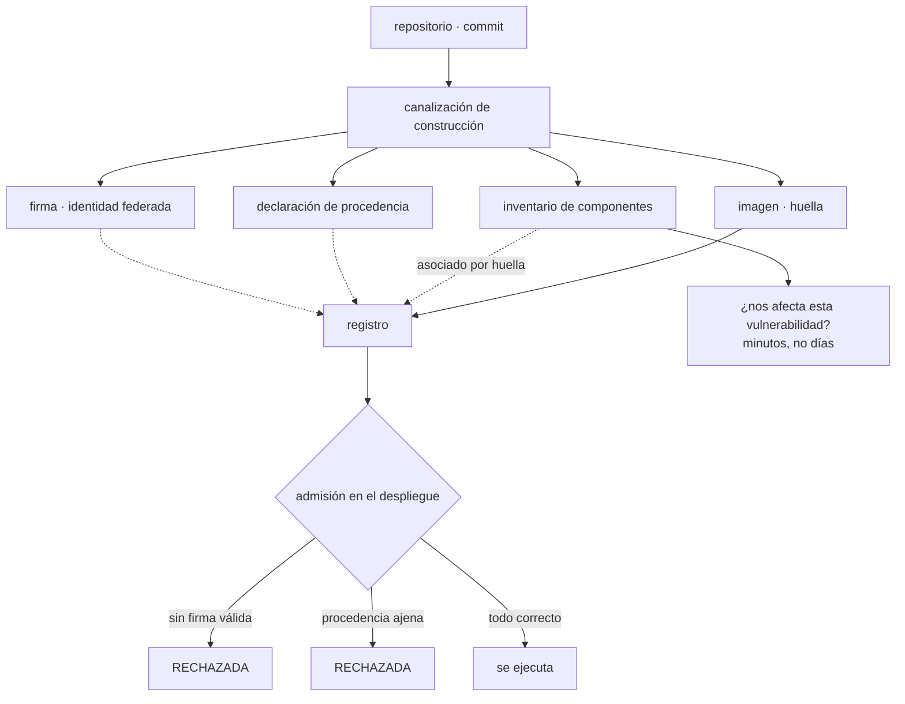

# 067 — Registros, SBOM, firma y procedencia de imágenes

> [← 066 · Docker Compose y aplicaciones multiservicio](../../part-05-containers-docker-oci/066-docker-compose-y-aplicaciones-multiservicio/README.md) · [Índice de la parte](../README.md) · [068 · Límites, health checks y apagado ordenado →](../../part-05-containers-docker-oci/068-limites-health-checks-y-apagado-ordenado/README.md)

**Parte:** 05 — Contenedores, Docker y OCI<br>
**Nivel:** intermedio · **Horas estimadas:** 4<br>
**Laboratorio:** `supply-chain` · **Estado:** `EXECUTABLE_CORE`

## 🎯 Propósito

Responder tres preguntas sobre una imagen que está a punto de ejecutarse en producción: **qué lleva dentro**, **quién dice que es suya** y **cómo se construyó**. Cada una tiene un artefacto —inventario de componentes, firma y declaración de procedencia— que se guarda junto a la imagen en el registro. Y la clase insiste en la disciplina que este programa ya ha aplicado tres veces: firmar sin verificar es teatro, exactamente igual que una directiva sin prueba negativa o una cola de fallidos sin un mensaje envenenado.

## 📚 Resultados de aprendizaje

Al finalizar podrás:

1. **Generar** un inventario de componentes y usarlo para responder «¿nos afecta?» en minutos en vez de en días.
2. **Firmar** imágenes sin gestionar ninguna clave y **verificar** la firma en el momento de desplegar.
3. **Exigir** procedencia para que solo se ejecute lo que salió de la canalización declarada.
4. **Definir** una puerta de vulnerabilidades que el equipo no acabe desactivando.
5. **Separar** las identidades de publicación y de descarga en el registro, con su prueba negativa.

## 🧩 Conceptos centrales

| Concepto | Comprensión verificable |
|---|---|
| `inventario de componentes` | Lista de todo lo que contiene una imagen con sus versiones. Su valor no es documental: es responder en minutos si una vulnerabilidad recién publicada afecta a algo tuyo. |
| `firma sin claves` | Firma emitida a partir de una identidad federada, sin material criptográfico que custodiar. Es la aplicación directa de la federación de las clases 026, 038 y 050. |
| `declaración de procedencia` | Documento verificable que dice de qué repositorio, qué commit y qué constructor salió una imagen. Impide que algo publicado desde un portátil pase por artefacto oficial. |
| `artefacto referente` | Objeto que el registro asocia a una imagen **por su huella**. Es lo que permite guardar inventario, firma y procedencia junto a la imagen sin cambiarla. |
| `puerta de vulnerabilidades` | Regla que detiene la publicación. Si bloquea por todo, el equipo la desactiva; si bloquea por lo crítico y corregible, se respeta. |
| `excepción con caducidad` | Permiso temporal para publicar algo que incumple, con motivo, responsable y fecha. Es la misma disciplina de las clases 046 y 049 aplicada a la cadena de suministro. |

## 🧠 Modelo mental

Una imagen es un artefacto inmutable; un contenedor es un proceso aislado con límites y dependencias explícitas, no una máquina virtual pequeña.

Aplicado a esta clase, separa siempre cuatro planos: **intención** (qué necesita el usuario),
**configuración** (qué declaramos), **estado observado** (qué existe de verdad) y
**evidencia** (cómo sabemos que cumple). Confundirlos produce diseños que se ven correctos
en un diagrama pero fallan al operar.

## 🗺️ Flujo de razonamiento



## 📖 Desarrollo

### 1. Tres preguntas, tres artefactos

La clase 061 dejó que una imagen se identifica por su huella y que la huella es verificable. Eso responde a «¿es exactamente este contenido?» y no responde a nada más. Las tres preguntas que quedan, con el artefacto que contesta cada una:

```text
¿qué lleva dentro?        inventario de componentes
¿quién dice que es suya?  firma
¿cómo se construyó?       declaración de procedencia
```

Y los tres se guardan **en el registro, asociados a la huella de la imagen**, sin modificarla. Esa es la parte del estándar de distribución que la clase 061 mencionó y que aquí se cobra: un registro puede alojar objetos que apuntan a otro objeto, y un cliente puede pedir «todo lo que hace referencia a esta huella».

```bash
$ cosign tree registro/tienda@sha256:9f2c4a1b…
📦 Supply Chain Security Related artifacts
├── 🔐 Signatures
├── 📦 SBOMs
└── 💾 Attestations
```

La propiedad importante es que **la asociación es por huella, no por etiqueta**. Una firma vale para un contenido exacto; si la etiqueta se mueve, la firma no la sigue. Es la misma razón por la que se despliega por huella, con una consecuencia adicional: sin desplegar por huella, la verificación de firma no significa gran cosa.

El orden en el que conviene adoptarlos no es el orden en que se enumeran, y merece decirlo porque adoptar el tercero primero es un error común:

```text
1. inventario   valor inmediato, sin cambiar el despliegue,
                y responde a la pregunta que llega de urgencia
2. firma + verificación   valor real solo si se verifica
3. procedencia + política  valor máximo, y exige que 1 y 2 funcionen
```

Y una advertencia que se aplica a los tres: **generarlos sin usarlos no aporta nada**. Un inventario que nadie consulta, una firma que nadie verifica y una procedencia que ninguna política exige son tres artefactos que ocupan espacio en el registro y producen la sensación de estar protegido. Es la misma familia de fallos que la clase 060 identificó como la más cara — un mecanismo que parece estar haciendo algo y no lo está — y aquí aparece por quinta vez.

### 2. El inventario: responder «¿nos afecta?» en minutos

Cuando se publica una vulnerabilidad grave en una biblioteca muy usada, la pregunta llega a la vez desde dirección, desde clientes y desde seguridad, y tiene una forma concreta:

```text
¿qué servicios nuestros incluyen esa biblioteca, en qué versión,
 y desde cuándo están desplegados?
```

Sin inventario, la respuesta se construye a mano: buscar en repositorios, revisar ficheros de dependencias, comprobar qué versión se desplegó de verdad. En una organización mediana eso son días, y mientras tanto no se puede decir nada.

Con inventario, la respuesta es una consulta:

```bash
$ syft registro/tienda@sha256:9f2c… -o spdx-json > sbom.json
$ cosign attach sbom --sbom sbom.json registro/tienda@sha256:9f2c…

# y cuando llega la pregunta:
$ for img in $(kubectl get pods -A -o jsonpath='{..imageID}' | tr ' ' '\n' | sort -u); do
    cosign download sbom "$img" 2>/dev/null \
      | jq -r --arg i "$img" '.packages[] | select(.name=="biblioteca-x") | "\($i) \(.versionInfo)"'
  done
```

Dos formatos conviven —uno más orientado a licencias y cumplimiento, otro más orientado a seguridad— y ambos sirven. Lo que importa es elegir uno y generarlo siempre.

Y hay una diferencia entre generarlo **durante** la construcción y **escaneando** la imagen terminada que conviene conocer, porque ninguna de las dos es completa sola:

```text
durante la construcción
  ve el grafo de dependencias real, con las transitivas y sus versiones exactas
  no ve lo que se instaló por otros medios

escaneando la imagen
  ve los paquetes del sistema y lo que hay en el sistema de ficheros
  no distingue una dependencia de una copia suelta ni ve lo eliminado
```

La práctica sensata es generar el inventario en la construcción, donde la información es mejor, y escanear la imagen publicada como comprobación independiente. Cuando los dos discrepan, la discrepancia es en sí misma un hallazgo: significa que algo entró en la imagen por un camino que la construcción no declara.

Y el inventario tiene un segundo uso que se descubre tarde y compensa el esfuerzo: **la comparación entre versiones**. Un cambio de dependencias inesperado en un despliegue rutinario se ve de un vistazo:

```bash
$ diff <(cosign download sbom $ANTERIOR | jq -r '.packages[].name' | sort) \
       <(cosign download sbom $NUEVA    | jq -r '.packages[].name' | sort)
> paquete-que-nadie-pidio
```

Esa línea de más es la señal de una dependencia transitiva nueva, que es como entran la mayoría de los problemas de cadena de suministro.

### 3. Firmar sin claves, y verificar de verdad

La firma responde a quién publicó una imagen, y el modelo moderno evita el problema que este programa ha señalado tres veces: **no hay ninguna clave que custodiar**.

```bash
$ cosign sign --yes registro/tienda@sha256:9f2c4a1b…
```

Lo que ocurre por debajo es la federación de las clases 026, 038 y 050 aplicada a la firma: la canalización demuestra su identidad ante un servicio que emite un certificado de corta duración, se firma con él, y la firma queda registrada en un registro público de transparencia. No hay clave privada que rotar, filtrar ni perder.

La firma vincula tres cosas: **la huella de la imagen, la identidad que firmó y el momento**. Y la verificación comprueba la identidad, no solo la validez:

```bash
$ cosign verify registro/tienda@sha256:9f2c4a1b… \
    --certificate-identity-regexp '^https://github\.com/cloudshop/tienda/\.github/workflows/publicar\.yml@refs/heads/main$' \
    --certificate-oidc-issuer https://token.actions.githubusercontent.com
```

Esa expresión es la pieza crítica y es exactamente el mismo campo que en las tres federaciones anteriores: **sin acotar la identidad, cualquiera con una identidad válida puede firmar y la verificación pasa**. Verificar «que está firmada» sin comprobar por quién es equivalente a aceptar cualquier pasaporte sin mirar el nombre. Cuarta vez que este programa señala el mismo campo.

Y aquí está el punto que da sentido a toda la clase. Firmar es la parte fácil y la que se adopta primero; **verificar es la que aporta**, y se hace en el momento de admitir el despliegue:

```yaml
# política de admisión: solo imágenes firmadas por nuestra canalización
apiVersion: policy.sigstore.dev/v1beta1
kind: ClusterImagePolicy
spec:
  images:
    - glob: "registro.interno/cloudshop/**"
  authorities:
    - keyless:
        url: https://fulcio.sigstore.dev
        identities:
          - issuer: https://token.actions.githubusercontent.com
            subjectRegExp: "^https://github\\.com/cloudshop/.*/\\.github/workflows/publicar\\.yml@refs/heads/main$"
```

Sin esa política, la firma es un adorno. Y la prueba negativa correspondiente es la misma que este programa ha exigido en cada control:

```bash
$ kubectl run prueba --image=registro.interno/cloudshop/tienda@sha256:sinfirma…
Error from server: admission webhook denied the request:
  no matching signatures                                                    ✓
```

La **procedencia** va un paso más allá y responde cómo se construyó:

```bash
$ cosign verify-attestation --type slsaprovenance registro/tienda@sha256:9f2c… \
    --certificate-identity-regexp '…' --certificate-oidc-issuer '…' \
  | jq -r '.payload' | base64 -d \
  | jq '{repo: .predicate.invocation.configSource.uri,
         commit: .predicate.invocation.configSource.digest.sha1,
         constructor: .predicate.builder.id}'
{
  "repo": "git+https://github.com/cloudshop/tienda@refs/heads/main",
  "commit": "a1b2c3d4e5f6…",
  "constructor": "https://github.com/actions/runner"
}
```

Eso cierra la cadena completa que la clase 061 empezó: **del contenedor en ejecución al commit exacto, de forma verificable y sin preguntar a nadie**. Y lo que impide es concreto: que una imagen construida en el portátil de alguien —con dependencias distintas, con código sin revisar— se despliegue como si fuera oficial. Sin procedencia exigida, nada lo distingue: las dos imágenes tienen huella válida y las dos pueden estar firmadas por una identidad de la organización.

### 4. Una puerta de vulnerabilidades que el equipo no desactive

El escaneo de vulnerabilidades falla casi siempre por el mismo motivo: se configura para bloquear por todo, produce cientos de hallazgos, el equipo no puede avanzar y **alguien lo desactiva**. Después figura como implantado.

```bash
$ trivy image --severity CRITICAL,HIGH registro/tienda@sha256:9f2c…
Total: 412 (HIGH: 371, CRITICAL: 41)
```

Cuatrocientos doce hallazgos en una imagen recién construida no significan cuatrocientos doce problemas. Significan tres cosas mezcladas:

```text
1. vulnerabilidades en paquetes del sistema base, la mayoría
2. vulnerabilidades sin corrección disponible todavía
3. vulnerabilidades en código que la aplicación nunca ejecuta
```

La puerta que funciona distingue esas categorías:

```bash
$ trivy image --exit-code 1 \
    --severity CRITICAL,HIGH \
    --ignore-unfixed \
    --ignorefile .trivyignore \
    registro/tienda@sha256:9f2c…
```

`--ignore-unfixed` es la opción que cambia el resultado: **bloquear por algo que no se puede arreglar solo enseña a saltarse la puerta**. Lo que queda es lo crítico y corregible, que es accionable por definición.

Y la palanca con más rendimiento no es corregir hallazgos uno a uno: es **actualizar la base**. La mayoría de los hallazgos vienen de ahí, así que una cadencia de actualización de la imagen base resuelve en bloque lo que de otro modo se persigue individualmente:

```text
sin cadencia de actualización de base    412 hallazgos, creciendo cada mes
con actualización mensual de la base      41 tras la primera, 3-8 en régimen
```

Eso conecta con la decisión de la clase 062 de fijar la base por huella: fijarla congela también sus vulnerabilidades, así que **fijar exige un proceso que proponga la actualización**. Un robot que abre un cambio con la huella nueva y deja que la canalización decida es suficiente, y es lo que convierte la fijación en algo sostenible en vez de en deuda.

Para lo que no se puede corregir ahora, la **excepción con caducidad**, que es la misma disciplina de las clases 046 y 049:

```text
# .trivyignore
# CVE-2026-1234 — biblioteca X, sin corrección; el código afectado no se
# alcanza desde ninguna ruta de la aplicación.
# Responsable: equipo-tienda   Revisar: 2026-10-01
CVE-2026-1234 exp:2026-10-01
```

Tres campos obligatorios: por qué, quién y hasta cuándo. Una lista de exclusiones sin fechas es una lista que crece para siempre y que nadie vuelve a mirar.

Y una precisión honesta sobre lo que un escáner puede y no puede decir: informa de que **una versión vulnerable está presente**, no de que sea alcanzable desde tu aplicación. La diferencia es grande —muchos hallazgos afectan a rutas de código que nunca se ejecutan— y existen formatos para declarar esa evaluación de forma verificable. Sin ellos, la alternativa es la lista de exclusiones documentada, que es peor pero funciona si se revisa.

### 5. El registro como control, no como almacén

El registro es donde todo lo anterior vive, y merece tratarse como un componente de seguridad y no como un disco.

**Identidades separadas para publicar y para descargar.** Es el error de configuración más frecuente:

```text
identidad de la canalización     puede PUBLICAR en su repositorio, y solo en él
identidad de los nodos           puede DESCARGAR, y nada más
personas                         descargan; publicar es de la canalización
```

Si los nodos pueden publicar, un contenedor comprometido puede sustituir la imagen del siguiente despliegue. Y si las personas pueden publicar, la procedencia deja de significar nada porque siempre habrá un camino alternativo. La prueba negativa:

```bash
$ docker push registro.interno/cloudshop/tienda:prueba   # con credenciales de nodo
denied: requested access to the resource is denied                          ✓
```

**Etiquetas inmutables y retención**, de la clase 061, más una precisión sobre el borrado: una política de retención por antigüedad puede eliminar la huella que producción está usando si ese despliegue lleva meses sin cambiar. La retención se define por **referencias**, no solo por fecha:

```text
conservar siempre   toda huella referenciada por algún despliegue activo
conservar N meses   el resto
nunca borrar        lo que tenga una firma o una procedencia asociadas
                    y siga referenciado
```

**Espejo de lo externo**, que la clase 061 ya justificó por los límites de descarga y que aquí tiene una segunda razón más importante: una imagen base externa copiada al registro propio **es un artefacto controlado**, con su inventario y su escaneo, en vez de una descarga que cambia cuando el tercero decide.

Y el flujo completo de la cadena, que es el entregable de esta clase:

```text
en la construcción
  1. construir con base fijada por huella           (062)
  2. generar el inventario de componentes
  3. escanear: bloquear crítico y corregible
  4. publicar por huella
  5. firmar con identidad federada
  6. adjuntar inventario y procedencia

en el despliegue
  7. resolver a huella y desplegar por huella        (061)
  8. admisión: verificar firma e identidad del firmante
  9. admisión: verificar procedencia del repositorio esperado

en operación
 10. reescanear las huellas EN PRODUCCIÓN periódicamente
     una imagen no cambia; las vulnerabilidades conocidas sí
```

El paso 10 se olvida siempre y es el que detecta el problema real: una imagen escaneada limpia hace tres meses puede tener hoy una vulnerabilidad crítica publicada la semana pasada. El escaneo en la construcción es una foto; **lo que hace falta es reescanear lo que está en ejecución**, con una consulta que empiece por el inventario de huellas desplegadas.

```bash
$ kubectl get pods -A -o jsonpath='{..imageID}' | tr ' ' '\n' | sort -u \
  | while read img; do trivy image --severity CRITICAL --ignore-unfixed -q "$img"; done
```

## 🔬 Ejemplo trabajado

**CloudShop endurece su cadena de suministro. El detonante es una pregunta que llega un viernes y que nadie puede responder; los cuatro cambios posteriores se ordenan por lo que aporta cada uno, no por lo que suena mejor.**

**El detonante — «¿nos afecta?» sin poder contestar.**

Se publica una vulnerabilidad crítica en una biblioteca de uso muy extendido. Dirección pregunta si CloudShop está expuesta.

```text
tiempo hasta una respuesta con confianza      6 días
método                        revisar repositorios uno a uno,
                              comprobar qué versión se desplegó de verdad,
                              y aun así con dudas sobre dependencias transitivas
respuesta final               2 servicios afectados de 14
```

Seis días sin poder decir nada. Con inventario adjunto a cada imagen, el mismo ejercicio repetido tres meses después con otra vulnerabilidad:

```text
tiempo hasta la respuesta                    11 minutos
servicios revisados                          14 de 14, por huella desplegada
afectados                                    1, con la versión exacta
```

**Cambio 1 — inventario en cada construcción.**

```text                                        antes            después
inventario de componentes                   ninguno      generado y adjunto
comparación entre versiones             no era posible   automática en el pull request
dependencias transitivas nuevas detectadas       —          3 en el primer trimestre
```

Una de esas tres era un paquete que nadie había pedido, incorporado por una actualización menor de otra dependencia. Se detectó por la comparación de inventarios, no por una alerta de seguridad.

**Cambio 2 — la puerta de vulnerabilidades que se había desactivado.**

```bash
$ git log --oneline -S 'continue-on-error: true' .github/workflows/publicar.yml
a4f8e21  "desbloquear la canalización"
```

Ocho meses atrás alguien había desactivado el escáner porque bloqueaba por 412 hallazgos, la mayoría sin corrección disponible. Desde entonces figuraba como implantado.

```text                                        antes            después
criterio de bloqueo               crítico y alto, todo    crítico y CORREGIBLE
hallazgos que bloqueaban                   412                  41
tras actualizar la base                     —                    3
cadencia de actualización de la base     ninguna         mensual, por robot
excepciones                          sin fecha ni motivo   3, con responsable
                                                          y fecha de revisión
escáner activo                        desactivado           activo
```

La cifra de 41 a 3 se consiguió actualizando la base, no corrigiendo hallazgos uno a uno. Es la palanca que este programa ya identificó en las clases 046 y 058: **corregir por bloque siempre gana a corregir por elemento**.

**Cambio 3 — firmado durante dos meses sin verificar nada.**

La firma se adoptó pronto porque era fácil. La verificación no, porque exigía tocar la admisión del clúster. Una revisión encontró lo previsible:

```bash
$ kubectl get pods -A -o jsonpath='{..imageID}' | tr ' ' '\n' | sort -u \
  | while read i; do cosign verify "$i" --certificate-identity-regexp '…' \
      --certificate-oidc-issuer '…' >/dev/null 2>&1 || echo "SIN FIRMA VÁLIDA: $i"; done
SIN FIRMA VÁLIDA: registro.interno/cloudshop/informes@sha256:c74e…
SIN FIRMA VÁLIDA: registro.interno/cloudshop/migrador@sha256:81ab…
```

Dos imágenes en producción sin firma válida. Una se había publicado desde un portátil durante una urgencia; la otra la había construido una canalización antigua que nunca se migró.

```text                                        antes            después
imágenes firmadas                          12 de 14         14 de 14
verificación en la admisión                 ninguna         política obligatoria
identidad del firmante comprobada              —        expresión acotada al
                                                        repositorio y a la rama
prueba negativa                             ninguna     imagen sin firma rechazada
imágenes sin trazar a un commit                2                0
```

La quinta aparición de la misma familia de fallos del programa: **un mecanismo que parecía estar protegiendo y no estaba conectado a nada**.

**Cambio 4 — procedencia exigida, y lo que destapó.**

Al exigir que la procedencia declarara un repositorio de la organización y la rama principal, tres despliegues empezaron a fallar:

```text
dos       construidos desde ramas de trabajo, en pruebas: correcto que fallen
uno       construido por una canalización de un repositorio archivado
          que seguía publicando a producción cada noche
```

El tercero llevaba catorce meses ejecutándose y nadie sabía que existía esa canalización.

```text                                        antes            después
canalizaciones que publican a producción      4 (una desconocida)   3
procedencia exigida en la admisión           no                sí
despliegues sin origen verificable             1                 0
```

**Y el paso que faltaba: reescanear lo que está en ejecución.**

```text                                        antes            después
escaneo                            solo en la construcción   también semanal
                                                             sobre las huellas
                                                             desplegadas
vulnerabilidades críticas descubiertas
  en imágenes ya desplegadas               no se detectaban    2 el primer mes
tiempo desde la publicación de la
  vulnerabilidad hasta detectarla                —            < 7 días
```

Las dos del primer mes correspondían a imágenes que habían pasado limpias en su construcción. La imagen no había cambiado; lo que cambió fue lo que se sabe de ella.

**Resumen de la cadena de suministro:**

```text                                          antes         después
tiempo para responder "¿nos afecta?"          6 días         11 min
escáner activo en la canalización            desactivado      activo
hallazgos críticos y corregibles                 41              3
imágenes con firma verificada                  0 de 14       14 de 14
imágenes sin trazar a un commit                   2              0
canalizaciones que publican a producción      4 (una ignorada)  3
reescaneo de lo desplegado                    ninguno        semanal
excepciones con responsable y fecha           0 de 3          3 de 3
```

**La lección que esta clase traslada al resto de la parte 05**: los cuatro artefactos —inventario, firma, procedencia y escaneo— solo valen conectados a algo que decida. El inventario valió porque alguien lo consultó, la firma no valía nada hasta que la admisión la verificó, la procedencia destapó una canalización fantasma en cuanto se exigió, y el escáner llevaba ocho meses desactivado porque bloqueaba por lo que no se podía arreglar. **Generar evidencia es barato; usarla es lo que cuesta y lo único que protege.**

## 🧪 Laboratorio guiado

Ejecuta desde la raíz:

```bash
python classes/part-05-containers-docker-oci/067-registros-sbom-firma-y-procedencia-de-imagenes/lab.py
```

El laboratorio selecciona el motor de práctica **`supply-chain`** y produce
`lab_result.json`. El escenario, sus comprobaciones y el artefacto esperado corresponden a
esta clase; no requiere credenciales y deja explícito qué debe revalidarse en un sandbox real.

1. Lee `exercise.steps` y formula una predicción antes de ejecutar.
2. Ejecuta la práctica y verifica todos los elementos de `checks`.
3. Provoca el caso de `negative_test` y explica la señal observada.
4. Materializa `cadena-suministro-imagen` en `evidence/` usando la plantilla indicada.
5. Para proveedor real, sigue `sandbox.requires`, registra costo y ejecuta `destroy`.

### Evidencia esperada

El artefacto principal es procedencia, inventario y verificación del artefacto. Además, la entrega debe incluir el comando ejecutado,
la salida estructurada y una conclusión que no exceda lo observado.

## 🏆 Reto verificable

Construye **`cadena-suministro-imagen`** para el caso CloudShop. Incluye una alternativa descartada,
un supuesto que pueda falsarse, una prueba de fallo y una decisión de rollback.

## ✅ Criterio de aceptación

- [ ] `lab.py` termina con código 0 y genera JSON válido.
- [ ] La entrega conecta al menos tres requisitos con mecanismos verificables.
- [ ] Existe una prueba positiva y una prueba negativa con evidencia.
- [ ] Seguridad, costo y operación aparecen como decisiones, no como anexos.
- [ ] Se declara una limitación y una condición que obligaría a revisar el diseño.
- [ ] Otra persona puede repetir el recorrido sin conocimiento tácito.

## ⚠️ Errores frecuentes

| Síntoma | Causa probable | Corrección |
|---|---|---|
| Nadie puede decir si una vulnerabilidad recién publicada afecta a la organización | No hay inventario de componentes asociado a las imágenes desplegadas | Genera el inventario en la construcción, adjúntalo a la huella y consulta por las huellas en ejecución. |
| El escáner de vulnerabilidades acaba desactivado | Bloquea por hallazgos sin corrección disponible, así que impide avanzar sin aportar | Bloquea solo por crítico y corregible, actualiza la base con cadencia y registra excepciones con motivo, responsable y fecha. |
| Las imágenes están firmadas y se ejecutan imágenes sin firmar | Se adoptó la firma y no la verificación en la admisión | Añade la política de admisión, acota la identidad del firmante y comprueba con una imagen sin firma que el rechazo ocurre. |
| Una imagen en producción no se puede trazar a ningún commit | Se publicó fuera de la canalización y nada lo impedía | Exige procedencia en la admisión y separa las identidades de publicación y de descarga en el registro. |
| Una imagen escaneada limpia resulta vulnerable meses después | El escaneo de construcción es una foto y las vulnerabilidades conocidas cambian | Reescanea periódicamente las huellas que están en ejecución, no solo las que se construyen. |
| Una política de retención borra una imagen que producción está usando | La retención se definió por antigüedad y ese despliegue llevaba meses sin cambiar | Define la retención por referencias: conserva siempre lo que algún despliegue activo referencia. |

## 🛡️ Seguridad, ética y costo

Trabaja con cuentas propias o sandboxes autorizados. No publiques secretos, identificadores
reales ni datos personales. Antes de crear recursos pagos define presupuesto, etiquetas y
comando de destrucción; después verifica que no queden recursos huérfanos. Los ejemplos
locales enseñan contratos, pero no certifican cumplimiento ni disponibilidad de producción.

## ❓ Preguntas de comprobación

1. ¿Qué tres preguntas responde cada uno de los artefactos de la cadena de suministro, y en qué orden conviene adoptarlos?
2. ¿Por qué la asociación por huella hace que desplegar por etiqueta debilite la verificación de firma?
3. ¿Qué campo hay que acotar al verificar una firma, y con qué tres clases anteriores se relaciona?
4. ¿Qué opción del escáner evita que el equipo acabe desactivándolo, y por qué?
5. ¿Por qué hay que reescanear las imágenes que están en ejecución si la imagen no cambia?

## 🔗 Referencias

- Sigstore (2025). *Keyless signing and verification with cosign* — identidad federada y registro de transparencia. <https://docs.sigstore.dev/cosign/signing/overview/>
- SLSA (2025). *Provenance and build levels* — qué declara la procedencia y qué ataques cubre cada nivel. <https://slsa.dev/spec/v1.0/provenance>
- OCI (2025). *Referrers API in the distribution specification* — artefactos asociados a una imagen por huella. <https://github.com/opencontainers/distribution-spec/blob/main/spec.md#listing-referrers>
- CISA (2024). *Minimum elements for a Software Bill of Materials* — contenido mínimo y usos previstos. <https://www.cisa.gov/sbom>
- Aqua Security (2025). *Trivy: filtering and ignore files* — severidad, hallazgos sin corrección y excepciones con caducidad. <https://trivy.dev/latest/docs/configuration/filtering/>
- Documentación oficial vigente del servicio implementado; registra URL y fecha de consulta.

---

> [Evaluación](assessment.md) · [Contrato de clase](lesson.yaml) · [Índice de la parte](../README.md)

| Anterior | Índice | Siguiente |
|---|---|---|
| [← 066 · Docker Compose y aplicaciones multiservicio](../../part-05-containers-docker-oci/066-docker-compose-y-aplicaciones-multiservicio/README.md) | [Parte 05](../README.md) · [Programa](../../README.md) | [068 · Límites, health checks y apagado ordenado →](../../part-05-containers-docker-oci/068-limites-health-checks-y-apagado-ordenado/README.md) |
