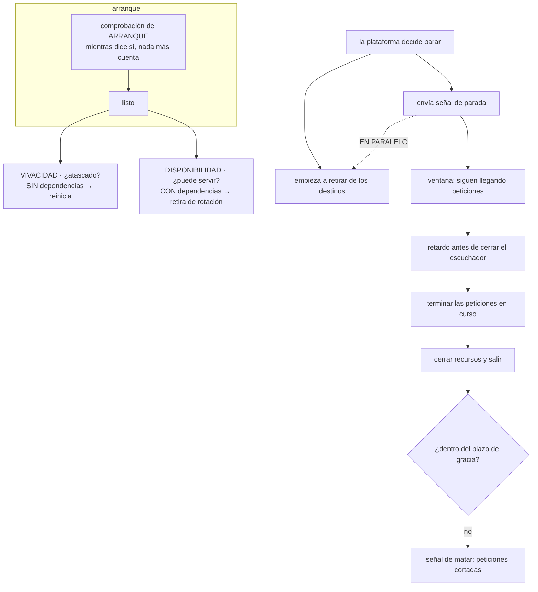

# 068 — Límites, health checks y apagado ordenado

> [← 067 · Registros, SBOM, firma y procedencia de imágenes](../../part-05-containers-docker-oci/067-registros-sbom-firma-y-procedencia-de-imagenes/README.md) · [Índice de la parte](../README.md) · [069 · Rootless, capabilities, seccomp y secretos →](../../part-05-containers-docker-oci/069-rootless-capabilities-seccomp-y-secretos/README.md)

**Parte:** 05 — Contenedores, Docker y OCI<br>
**Nivel:** intermedio · **Horas estimadas:** 4<br>
**Laboratorio:** `reliability` · **Estado:** `EXECUTABLE_CORE`

## 🎯 Propósito

Hacer que un contenedor arranque, sirva y se apague sin perder peticiones, que es lo que ocurre entre el momento en que la plataforma decide algo y el momento en que el proceso se entera. Dos hechos explican casi todos los errores durante los despliegues: **las tres comprobaciones de estado responden preguntas distintas** y confundirlas convierte un problema ajeno en una caída propia; y **la señal de parada y la retirada del tráfico ocurren a la vez**, así que hay una ventana en la que siguen llegando peticiones a un proceso que ya está cerrando.

## 📚 Resultados de aprendizaje

Al finalizar podrás:

1. **Distinguir** las tres comprobaciones de estado por la pregunta que responden y por lo que provocan al fallar.
2. **Describir** la secuencia completa de un apagado y localizar la ventana en la que se pierden peticiones.
3. **Calcular** el plazo de gracia a partir de la petición más larga y del retardo de retirada.
4. **Decidir** con criterio si poner límite de CPU, sabiendo qué protege y qué empeora.
5. **Demostrar** con una prueba de carga que un despliegue no produce errores.

## 🧩 Conceptos centrales

| Concepto | Comprensión verificable |
|---|---|
| `comprobación de vivacidad` | ¿El proceso está atascado? Al fallar, **se reinicia el contenedor**. Por eso no debe consultar dependencias: un fallo ajeno se convertiría en una caída propia. |
| `comprobación de disponibilidad` | ¿Puede servir **ahora**? Al fallar, se retira del reparto de tráfico sin reiniciar nada. Aquí sí se consultan las dependencias. |
| `comprobación de arranque` | ¿Sigue iniciándose? Mientras responde que sí, los fallos de las otras dos **no cuentan**. Es lo que evita el reinicio en bucle de un proceso lento. |
| `ventana de carrera del apagado` | Intervalo entre que la plataforma envía la señal de parada y que deja de enviar tráfico. Ocurren **en paralelo**, y ahí se pierden las peticiones de un despliegue. |
| `plazo de gracia` | Tiempo entre la señal de parada y la de matar. Debe ser mayor que el retardo de retirada más la petición más larga más el cierre de recursos. |
| `solicitud frente a límite` | La solicitud decide dónde cabe el contenedor; el límite decide qué ocurre cuando se pasa. Son dos decisiones distintas y se confunden constantemente. |

## 🧠 Modelo mental

Una imagen es un artefacto inmutable; un contenedor es un proceso aislado con límites y dependencias explícitas, no una máquina virtual pequeña.

Aplicado a esta clase, separa siempre cuatro planos: **intención** (qué necesita el usuario),
**configuración** (qué declaramos), **estado observado** (qué existe de verdad) y
**evidencia** (cómo sabemos que cumple). Confundirlos produce diseños que se ven correctos
en un diagrama pero fallan al operar.

## 🗺️ Flujo de razonamiento



## 📖 Desarrollo

### 1. Tres comprobaciones, tres preguntas, tres consecuencias

Las tres se escriben igual y hacen cosas muy distintas. Confundirlas es la causa del incidente más caro de esta clase.

| | Pregunta | Al fallar | ¿Consulta dependencias? |
|---|---|---|---|
| Vivacidad | ¿Está atascado? | **Reinicia el contenedor** | **No** |
| Disponibilidad | ¿Puede servir ahora? | Lo retira del reparto | **Sí** |
| Arranque | ¿Sigue iniciándose? | Espera; las otras no cuentan | No |

La columna de la derecha es la que decide, y merece un ejemplo concreto de lo que pasa si se pone mal:

```text
vivacidad que consulta la base de datos
  la base conmuta durante 40 segundos
  TODAS las réplicas fallan la comprobación a la vez
  la plataforma las reinicia TODAS a la vez
  las nuevas tardan 90 s en arrancar y vuelven a fallar
  → un fallo ajeno de 40 s se convierte en una caída propia de varios minutos
```

Es el mismo incidente que la clase 052 midió con la reparación automática, y la razón es idéntica: **el mecanismo no retira, destruye**. Por eso la comprobación de vivacidad tiene que ser lo más tonta posible:

```text
vivacidad correcta      ¿responde el proceso? ¿está el bucle principal vivo?
                        sin red hacia fuera, sin base de datos, sin caché
disponibilidad correcta ¿tengo conexión a la base? ¿está la caché? ¿he cargado
                        la configuración? ¿estoy cerrando?
```

Y la de **arranque** resuelve un problema distinto que se manifiesta como un bucle infinito. Un proceso que tarda dos minutos en cargar su estado inicial falla la comprobación de vivacidad mucho antes de estar listo, así que lo reinician, y vuelve a empezar:

```text
sin comprobación de arranque, con vivacidad cada 10 s y 3 fallos permitidos
  a los 30 s se reinicia; el proceso necesitaba 120
  → nunca llega a estar listo, y el registro solo muestra arranques
```

La alternativa antigua —un retardo inicial largo en la comprobación de vivacidad— funciona y tiene un coste: ese retardo se aplica también **después** del arranque, así que un proceso atascado tarda ese mismo tiempo en detectarse. La comprobación de arranque separa los dos casos: tolerante al principio, exigente después.

```yaml
startupProbe:   {httpGet: {path: /healthz}, periodSeconds: 5,  failureThreshold: 30}
livenessProbe:  {httpGet: {path: /healthz}, periodSeconds: 10, failureThreshold: 3}
readinessProbe: {httpGet: {path: /readyz},  periodSeconds: 5,  failureThreshold: 2}
```

Con esos números, el arranque tolera hasta 150 segundos y, una vez listo, un atasco se detecta en 30. Y hay una aritmética que conviene comprobar siempre: **el tiempo de espera de la comprobación tiene que caber en su periodo**. Una comprobación cada 5 segundos con un tiempo de espera de 10 se solapa consigo misma y produce fallos bajo carga que no corresponden a nada.

Un último caso que aparece en aplicaciones con estado interno: una comprobación de disponibilidad debe poder decir «no» **por decisión propia**. Un proceso que está reconstruyendo un índice, drenando una cola o cerrando debe retirarse del reparto sin que nadie se lo pida. Esa es la mitad de la solución del apartado siguiente.

### 2. La ventana en la que se pierden las peticiones

Aquí está el hecho que explica los errores que aparecen en cada despliegue y que casi siempre se archivan como «normal al desplegar».

Cuando la plataforma decide parar un contenedor ocurren **dos cosas a la vez**:

```text
1. envía la señal de parada al proceso
2. empieza a retirarlo de la lista de destinos del reparto de tráfico
```

La segunda es asíncrona y tarda: hay que propagar el cambio a los balanceadores, a las tablas de rutas y a los clientes. Mientras tanto, **siguen llegando peticiones**. Si el proceso cierra su escuchador al recibir la señal —que es lo que hace la implementación intuitiva—, esas peticiones se rechazan.

```text
t+0,00  señal de parada       el proceso cierra el escuchador
t+0,00  empieza la retirada
t+0,05  llega una petición    → conexión rechazada
t+0,30  llega otra            → conexión rechazada
t+2,10  la retirada se completa
```

Dos segundos de errores por contenedor y por despliegue. Con veinte contenedores y ocho despliegues al día, es una cifra que aparece en el presupuesto de error de la clase 057 sin que nadie sepa de dónde sale.

La corrección es contraintuitiva y es la clave de la clase: **al recibir la señal de parada, lo primero es esperar**.

```text
secuencia correcta
  1. recibir la señal
  2. marcar la disponibilidad como "no": la plataforma acelera la retirada
  3. ESPERAR el tiempo de propagación (2-5 s típicos) SIN dejar de servir
  4. cerrar el escuchador: no se aceptan conexiones nuevas
  5. terminar las peticiones en curso
  6. cerrar recursos: base de datos, caché, productores de mensajes
  7. salir con código 0
```

El paso 3 es el que falta en casi todas las implementaciones. Se puede hacer en el código o con un gancho previo a la parada que la plataforma ejecuta antes de la señal:

```yaml
lifecycle:
  preStop:
    exec: {command: ["/bin/sleep", "5"]}
terminationGracePeriodSeconds: 60
```

Y en el código, la forma que además sirve para el paso 2:

```go
sig := make(chan os.Signal, 1)
signal.Notify(sig, syscall.SIGTERM, syscall.SIGINT)
<-sig

listo.Store(false)              // 2: /readyz empieza a devolver 503
time.Sleep(5 * time.Second)     // 3: se sigue SIRVIENDO durante la espera

ctx, cancel := context.WithTimeout(context.Background(), 45*time.Second)
defer cancel()
srv.Shutdown(ctx)               // 4 y 5: sin conexiones nuevas, termina las vivas
cerrarRecursos()                // 6
```

Y un detalle que hace que todo lo anterior no baste: **las conexiones persistentes**. Un balanceador que mantiene conexiones abiertas puede seguir enviando peticiones por una conexión ya establecida aunque el destino se haya retirado de la lista. La solución es que el servidor deje de reutilizar esas conexiones en cuanto empieza a cerrar:

```text
durante el apagado, responder con la cabecera que indica cierre de conexión
→ el cliente abre una conexión nueva, que ya irá a otro destino
```

Sin eso, un cliente con una conexión persistente puede seguir enviando peticiones al contenedor que está cerrando durante todo el plazo de gracia.

### 3. La aritmética del plazo de gracia

El plazo de gracia es el tiempo entre la señal de parada y la señal que mata sin remedio. Y no es un número redondo que se elige: se calcula.

```text
plazo de gracia  >  retardo de propagación
                  + petición más larga que se admite
                  + cierre de recursos
                  + margen
```

Con cifras reales de un servicio:

```text
retardo de propagación de la retirada        5 s
percentil 99,9 de la duración de la petición 12 s
cierre de conexiones y volcado de telemetría  3 s
margen                                        10 s
                                            ──────
plazo de gracia mínimo                        30 s
```

Y los dos errores que produce equivocarse en cada dirección:

```text
plazo demasiado CORTO
  la señal de matar llega con peticiones en curso
  → se cortan a mitad, y el cliente ve una conexión cerrada sin respuesta
  → en un proceso por lotes, trabajo a medias sin marcar

plazo demasiado LARGO
  cada despliegue tarda ese plazo por contenedor si el proceso no sale antes
  → un despliegue de veinte contenedores con plazo de 300 s puede durar
    una hora si el proceso nunca sale por su cuenta
```

El segundo aparece cuando el proceso **no maneja la señal** (clase 063): el plazo entero se consume siempre, en cada contenedor. La comprobación es directa:

```bash
$ time docker stop demo
real    0m10,4s      ← plazo completo: nadie escuchó

$ time docker stop demo
real    0m1,2s       ← salió por su cuenta: correcto
```

Esa medición debería estar en la lista de verificación de cualquier servicio. Un apagado que tarda exactamente el plazo configurado es siempre un fallo, aunque no produzca errores visibles.

Y hay un caso que exige más cuidado: **los consumidores de mensajes**. Cerrar un consumidor a mitad de un mensaje no confirmado hace que se reentregue —lo cual es correcto y para eso está la idempotencia de las clases 044 y 056—, pero un apagado ordenado lo hace mejor:

```text
1. dejar de pedir mensajes nuevos
2. terminar los que se están procesando y confirmarlos
3. cerrar el cliente
```

Con eso, un despliegue no genera reentregas. Sin eso, cada despliegue produce una tanda de duplicados que la idempotencia absorbe pero que aparece en las métricas y confunde durante un incidente.

Y para los **trabajos por lotes**, el plazo de gracia rara vez alcanza: un proceso de dos horas no cabe en ningún plazo razonable. La respuesta correcta no es alargar el plazo sino que el trabajo sea **reanudable**: puntos de control periódicos, y al recibir la señal, marcar el progreso y salir. Es exactamente el mismo diseño que exigían los avisos de desalojo de 30 segundos de las clases 040 y 052.

### 4. Solicitudes y límites: dos decisiones que se confunden

La clase 063 explicó el mecanismo; aquí está la decisión.

```text
solicitud   lo que la plataforma RESERVA para decidir dónde cabe
            no limita nada: es planificación
límite      lo que el grupo de control impone
            memoria: mata · CPU: frena
```

Y de ahí salen los cuatro casos posibles, con lo que produce cada uno:

```text
sin solicitud, sin límite    el contenedor cabe en cualquier sitio y puede
                             consumirlo todo: tumba a sus vecinos
solicitud sin límite         se planifica bien y sigue pudiendo consumir de más
límite sin solicitud         se planifica mal: la plataforma cree que no consume
ambos                        lo normal
```

Sobre la **memoria**, no hay debate y conviene decirlo así: **el límite es obligatorio**. Sin él, un contenedor con una fuga agota la memoria del nodo y el núcleo elige una víctima entre todos los procesos de la máquina, que puede ser cualquiera. Con límite, se mata el culpable. Es la conclusión de la clase 063.

Sobre la **CPU** sí hay un debate real y merece presentarse con honestidad, porque la respuesta no es la misma en todos los casos:

```text
a favor del límite de CPU
  impide que un contenedor con un bucle descontrolado consuma el nodo
  hace el rendimiento predecible y reproducible entre entornos
  en plataformas multiinquilino, es un requisito

en contra
  la limitación frena aunque el nodo tenga CPU libre
  un pico corto y legítimo se convierte en latencia
  con un límite ajustado, el percentil alto empeora sin que falte capacidad
```

La posición defendible, y la que conviene escribir en la línea base:

```text
memoria      solicitud y límite, siempre, y el límite ajustado al uso real
CPU          solicitud siempre; límite sí cuando el nodo se comparte entre
             equipos o cuando la reproducibilidad importa más que el pico,
             y NO cuando el servicio es sensible a la latencia y el nodo
             es del propio equipo
en cualquier caso  vigilar la proporción de periodos limitados (clase 063):
                   si sube del 5 %, el límite está haciendo daño
```

La última línea convierte el debate en una medición. No hace falta decidir en abstracto: se pone el límite, se mide la limitación y se ajusta con el dato delante.

Y el **reinicio en bucle**, que es donde límites y comprobaciones se cruzan. Un contenedor que muere se reinicia con espera creciente, y esa espera es la que salva al nodo:

```text
reinicio 1   inmediato
reinicio 2   10 s
reinicio 3   20 s … hasta un tope de varios minutos
```

El caso que rompe esto es una comprobación de vivacidad mal ajustada: el contenedor no muere, **lo matan**, y el ciclo puede ser mucho más rápido. El síntoma es un servicio que reinicia constantemente con el proceso aparentemente sano, y la causa está casi siempre en el apartado primero de esta clase.

### 5. Demostrarlo: un despliegue sin errores es una medición

Todo lo anterior se puede afirmar o se puede demostrar, y este programa ya ha establecido cuál de las dos cuenta.

La prueba es un despliegue con carga en curso:

```bash
# carga sostenida durante todo el ejercicio
$ hey -z 3m -c 50 -q 20 https://tienda.interno/api/pedidos > carga.txt &

# despliegue a mitad
$ sleep 60 && kubectl set image deploy/tienda tienda=registro/tienda@sha256:nueva…
$ kubectl rollout status deploy/tienda

$ grep -E 'Status code|error' carga.txt
  [200] 179880 responses
  [503]      0 responses
  errors     0                                                             ✓
```

Cero errores durante un despliegue completo es el criterio. Y conviene fijarlo como umbral en la canalización, porque es una propiedad que se rompe sola: un cambio en el plazo de gracia, una petición que se vuelve más lenta o una comprobación mal ajustada la degradan sin que nadie lo note.

La lista de verificación de esta clase, que se aplica servicio a servicio:

```text
☐ las tres comprobaciones existen y responden preguntas distintas
☐ la de vivacidad NO consulta ninguna dependencia
☐ la de disponibilidad SÍ, y puede decir "no" por decisión propia
☐ el tiempo de espera de cada comprobación cabe en su periodo
☐ el proceso maneja la señal de parada: `docker stop` tarda < 2 s
☐ hay retardo antes de cerrar el escuchador, mayor que la propagación
☐ el plazo de gracia es mayor que retardo + petición más larga + cierre
☐ durante el apagado se dejan de reutilizar las conexiones persistentes
☐ los consumidores terminan y confirman lo que tienen en curso
☐ los trabajos largos son reanudables, no dependen del plazo
☐ memoria: solicitud y límite; CPU: solicitud, y límite con criterio
☐ un despliegue con carga produce cero errores
```

Y dos mediciones que conviene tener como métricas permanentes, porque detectan la degradación de esta lista sin que nadie la revise:

```text
duración del apagado por contenedor    si se acerca al plazo, alguien dejó de
                                       manejar la señal
errores durante la ventana de despliegue  debe ser cero; cualquier otra cosa
                                       es una regresión de esta clase
```

Un cierre que conecta con el resto del programa: de las once leyes que la clase 060 enumeró, esta clase toca tres —la conmutación como funcionamiento normal, el reintento del cliente y el fallo silencioso—. Y añade una observación propia que la parte 06 va a necesitar: **el contrato entre la aplicación y la plataforma no es solo la imagen**. Es también qué señales entiende, qué responde en cada comprobación y cuánto tarda en irse. Esa parte del contrato no está en ninguna especificación OCI, y es exactamente la cuarta fuga que la clase 060 predijo: **lo que ocurre antes del primer proceso y después de la señal de terminación**.

## 🔬 Ejemplo trabajado

**CloudShop despliega ocho veces al día y cada despliegue produce errores. Nadie lo trata como un incidente porque «es normal al desplegar». Cinco correcciones lo llevan a cero, y la última destapa un problema que llevaba meses.**

Punto de partida:

```text
una sola comprobación, /health, usada como vivacidad y disponibilidad
consulta la base de datos
plazo de gracia por defecto: 30 s
el proceso no maneja la señal de parada
errores por despliegue: entre 300 y 900
```

**Corrección 1 — la comprobación que convertía un parpadeo ajeno en una caída propia.**

Una conmutación de la base de datos de 38 segundos produjo 11 minutos de caída:

```bash
$ kubectl get events --field-selector reason=Unhealthy -o wide | head
… Liveness probe failed: HTTP probe failed with statuscode: 503   (× 14 pods)
$ kubectl get pods -l app=tienda -o jsonpath='{..restartCount}'
3 3 3 3 3 3 3 3 3 3 3 3 3 3
```

Las catorce réplicas fallaron la vivacidad a la vez y se reiniciaron a la vez; las nuevas tardaban 70 s en arrancar y volvían a fallar.

```text                                        antes            después
comprobaciones                            1 (/health)      3, separadas
vivacidad                          consulta la base   solo el bucle principal
disponibilidad                            —            base y caché
arranque                                  —            hasta 150 s tolerados
duración del episodio equivalente        11 min            38 s
reinicios durante el episodio              42                0
```

**Corrección 2 — los errores de cada despliegue tenían una causa concreta.**

```text
t+0,00  señal de parada · el proceso cierra el escuchador al instante
t+0,00  empieza la retirada de destinos
t+2,30  la retirada se completa
→ 2,3 s de conexiones rechazadas por contenedor
```

Con catorce contenedores y ocho despliegues diarios, la cuenta cuadraba con los errores observados.

```text                                        antes            después
retardo antes de cerrar el escuchador        0 s             5 s
disponibilidad marcada como "no" al recibir
  la señal                                    no              sí
errores por despliegue                     300-900            0
```

Cinco segundos de espera por contenedor eliminaron entre 2.400 y 7.200 errores diarios.

**Corrección 3 — el plazo de gracia y las peticiones cortadas.**

Aunque los errores de conexión desaparecieron, quedaba un residuo de respuestas incompletas.

```text
plazo de gracia                              30 s
retardo de propagación                        5 s
percentil 99,9 de la petición                12 s
cierre de recursos                            3 s
→ 20 s necesarios, 30 disponibles: correcto
```

Pero la exportación de informes admitía peticiones de hasta 90 segundos:

```text                                        antes            después
plazo de gracia (servicio general)           30 s             30 s
plazo de gracia (exportación)                30 s            120 s
peticiones cortadas por despliegue            17               0
```

La lección anotada: **el plazo se calcula por servicio, no por convención de la organización**.

**Corrección 4 — el proceso que nunca salía por su cuenta.**

```bash
$ time kubectl delete pod tienda-7f4c9
real    0m30,2s        ← el plazo entero, en cada contenedor
```

El punto de entrada estaba en forma de cadena, así que el proceso número uno era un intérprete de órdenes que no reenviaba las señales — el fallo de las clases 062 y 063.

```text                                        antes            después
punto de entrada                        forma de cadena   forma de lista
duración del apagado                        30,2 s           1,1 s
duración de un despliegue completo         7 min 20 s      1 min 05 s
```

Seis minutos menos por despliegue, ocho veces al día.

**Corrección 5 — el consumidor que duplicaba en cada despliegue.**

Al revisar las métricas de mensajería apareció un patrón que llevaba meses:

```text
mensajes reentregados      picos exactos en cada despliegue
cantidad por despliegue    entre 40 y 120
```

El consumidor cerraba su cliente al recibir la señal, dejando sin confirmar los mensajes en curso. La idempotencia de la clase 056 evitaba el daño, así que nadie lo había investigado.

```text                                        antes            después
apagado del consumidor          cierre inmediato     deja de pedir, termina
                                                     los que tiene, confirma
reentregas por despliegue                40-120            0
efectos duplicados                          0               0   ← ya era 0
```

Cero efectos duplicados antes y después: la idempotencia funcionaba. Lo que se corrigió fue el ruido, y con él la confusión que ese ruido causaba durante cualquier incidente coincidente con un despliegue.

**La prueba final:**

```bash
$ hey -z 3m -c 50 -q 20 https://tienda.interno/api/pedidos > carga.txt &
$ sleep 60 && kubectl set image deploy/tienda tienda=registro/tienda@sha256:nueva…
$ grep -E '\[503\]|errors' carga.txt
  [503]  0 responses
  errors 0                                                                  ✓
```

**Resumen:**

```text                                          antes         después
comprobaciones de estado                          1             3
reinicios durante una conmutación de la base     42             0
duración de un episodio de 38 s ajeno         11 min          38 s
errores por despliegue                        300-900           0
peticiones cortadas por despliegue               17             0
duración del apagado por contenedor            30,2 s         1,1 s
duración de un despliegue completo           7 min 20 s     1 min 05 s
reentregas de mensajes por despliegue          40-120           0
```

**La lección que esta clase traslada al resto de la parte 05**: los cinco problemas ocurrían **en cada despliegue, ocho veces al día, y ninguno se estaba tratando como un incidente**. Se habían normalizado porque coincidían con una operación esperada, y esa normalización es lo que impidió verlos durante meses. El criterio que los destapó es una sola frase que ahora está en la línea base: **un despliegue con carga en curso produce cero errores, y cualquier otra cosa es una regresión**.

## 🧪 Laboratorio guiado

Ejecuta desde la raíz:

```bash
python classes/part-05-containers-docker-oci/068-limites-health-checks-y-apagado-ordenado/lab.py
```

El laboratorio selecciona el motor de práctica **`reliability`** y produce
`lab_result.json`. El escenario, sus comprobaciones y el artefacto esperado corresponden a
esta clase; no requiere credenciales y deja explícito qué debe revalidarse en un sandbox real.

1. Lee `exercise.steps` y formula una predicción antes de ejecutar.
2. Ejecuta la práctica y verifica todos los elementos de `checks`.
3. Provoca el caso de `negative_test` y explica la señal observada.
4. Materializa `contenedor-operable` en `evidence/` usando la plantilla indicada.
5. Para proveedor real, sigue `sandbox.requires`, registra costo y ejecuta `destroy`.

### Evidencia esperada

El artefacto principal es un escenario de fallo con objetivo y recuperación medida. Además, la entrega debe incluir el comando ejecutado,
la salida estructurada y una conclusión que no exceda lo observado.

## 🏆 Reto verificable

Construye **`contenedor-operable`** para el caso CloudShop. Incluye una alternativa descartada,
un supuesto que pueda falsarse, una prueba de fallo y una decisión de rollback.

## ✅ Criterio de aceptación

- [ ] `lab.py` termina con código 0 y genera JSON válido.
- [ ] La entrega conecta al menos tres requisitos con mecanismos verificables.
- [ ] Existe una prueba positiva y una prueba negativa con evidencia.
- [ ] Seguridad, costo y operación aparecen como decisiones, no como anexos.
- [ ] Se declara una limitación y una condición que obligaría a revisar el diseño.
- [ ] Otra persona puede repetir el recorrido sin conocimiento tácito.

## ⚠️ Errores frecuentes

| Síntoma | Causa probable | Corrección |
|---|---|---|
| Un fallo breve de la base de datos provoca el reinicio de toda la flota | La comprobación de vivacidad consulta dependencias, y al fallar reinicia en vez de retirar | Vivacidad sin dependencias, disponibilidad con ellas; el reinicio es para procesos atascados, no para dependencias caídas. |
| Un proceso lento reinicia en bucle y nunca llega a estar listo | La vivacidad lo mata antes de terminar el arranque | Añade comprobación de arranque tolerante; una vez listo, la vivacidad puede ser exigente. |
| Cada despliegue produce un pico de errores de conexión | El proceso cierra el escuchador al recibir la señal mientras la retirada de tráfico aún se propaga | Marca la disponibilidad como no, espera el tiempo de propagación sirviendo, y solo entonces cierra. |
| El apagado tarda exactamente el plazo de gracia configurado | El proceso no maneja la señal, casi siempre por un punto de entrada en forma de cadena | Forma de lista y manejador declarado; mide que `stop` tarde menos de dos segundos. |
| Se cortan peticiones largas durante los despliegues | El plazo de gracia es menor que el retardo de propagación más la petición más larga | Calcula el plazo por servicio; para trabajos largos, hazlos reanudables en lugar de alargar el plazo. |
| Cada despliegue genera una tanda de mensajes reentregados | El consumidor cierra sin terminar ni confirmar lo que estaba procesando | Deja de pedir mensajes, termina y confirma los en curso, y después cierra el cliente. |

## 🛡️ Seguridad, ética y costo

Trabaja con cuentas propias o sandboxes autorizados. No publiques secretos, identificadores
reales ni datos personales. Antes de crear recursos pagos define presupuesto, etiquetas y
comando de destrucción; después verifica que no queden recursos huérfanos. Los ejemplos
locales enseñan contratos, pero no certifican cumplimiento ni disponibilidad de producción.

## ❓ Preguntas de comprobación

1. ¿Qué pregunta responde cada una de las tres comprobaciones y qué provoca el fallo de cada una?
2. Describe la ventana en la que se pierden peticiones durante un apagado y la corrección contraintuitiva que la elimina.
3. Calcula el plazo de gracia de un servicio con propagación de 5 s, percentil 99,9 de 12 s y cierre de 3 s.
4. ¿Cuándo pondrías límite de CPU y cuándo no, y qué medición resuelve el debate?
5. ¿Qué medición demuestra que un despliegue no pierde peticiones, y por qué debe ser un umbral de la canalización?

## 🔗 Referencias

- Kubernetes (2025). *Configure liveness, readiness and startup probes* — semántica y parámetros de las tres. <https://kubernetes.io/docs/tasks/configure-pod-container/configure-liveness-readiness-startup-probes/>
- Kubernetes (2025). *Pod lifecycle: termination* — orden de la señal, retirada de destinos y plazo de gracia. <https://kubernetes.io/docs/concepts/workloads/pods/pod-lifecycle/#pod-termination>
- Kubernetes (2025). *Requests and limits* — planificación frente a imposición, y efectos de cada una. <https://kubernetes.io/docs/concepts/configuration/manage-resources-containers/>
- Docker (2025). *docker stop and signal handling* — plazo, señales y comportamiento del proceso número uno. <https://docs.docker.com/reference/cli/docker/container/stop/>
- Google (2018). *The Site Reliability Workbook*, cap. 4 — errores durante despliegues y presupuesto de error. <https://sre.google/workbook/implementing-slos/>
- Documentación oficial vigente del servicio implementado; registra URL y fecha de consulta.

---

> [Evaluación](assessment.md) · [Contrato de clase](lesson.yaml) · [Índice de la parte](../README.md)

**📥 Descargar:** [Parte 05 en PDF](../../../site/downloads/partes/manual-parte-05-containers-docker-oci.pdf) · [Manual integral](../../../site/downloads/multi-cloud-engineering-manual-v2.0.pdf)

| Anterior | Índice | Siguiente |
|---|---|---|
| [← 067 · Registros, SBOM, firma y procedencia de imágenes](../../part-05-containers-docker-oci/067-registros-sbom-firma-y-procedencia-de-imagenes/README.md) | [Parte 05](../README.md) · [Programa](../../README.md) | [069 · Rootless, capabilities, seccomp y secretos →](../../part-05-containers-docker-oci/069-rootless-capabilities-seccomp-y-secretos/README.md) |
