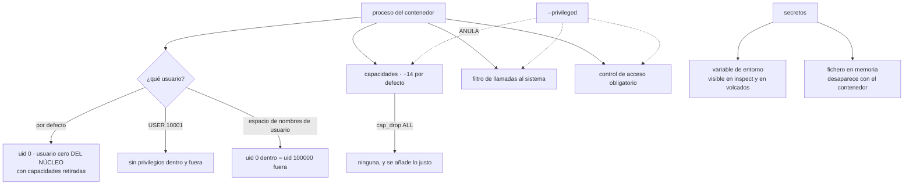

# 069 — Rootless, capabilities, seccomp y secretos

> [← Clase anterior](../../part-05-containers-docker-oci/068-limites-health-checks-y-apagado-ordenado/README.md) · [Índice de la parte](../README.md) · [Clase siguiente →](../../part-05-containers-docker-oci/070-diagnostico-de-cpu-memoria-red-y-filesystem/README.md)

**Parte:** 05 — Contenedores, Docker y OCI<br>
**Nivel:** intermedio · **Horas estimadas:** 4<br>
**Laboratorio:** `security` · **Estado:** `EXECUTABLE_CORE`

## 🎯 Propósito

Reducir lo que un contenedor puede hacer contra el anfitrión, partiendo de un hecho que la clase 063 dejó establecido y que casi nadie asume: **el núcleo es uno solo**, así que el usuario cero dentro del contenedor es el usuario cero del núcleo, con algunas capacidades retiradas. La clase ordena los cuatro mecanismos que acotan eso —usuario, capacidades, filtro de llamadas al sistema y control de acceso obligatorio—, señala cuál de ellos se desactiva más a menudo por copiar una respuesta de internet, y cierra el tratamiento de secretos en ejecución que las clases 058 y 066 dejaron a medias.

## 📚 Resultados de aprendizaje

Al finalizar podrás:

1. **Ejecutar** sin privilegios y explicar qué cambia realmente respecto de ejecutar como usuario cero.
2. **Retirar** todas las capacidades y añadir solo las necesarias, con la prueba negativa correspondiente.
3. **Reconocer** las opciones que anulan las defensas y qué se pierde exactamente con cada una.
4. **Sustituir** el socket del motor por un constructor sin privilegios en las canalizaciones.
5. **Inyectar** secretos en ejecución sin que aparezcan en el entorno del proceso ni en un volcado.

## 🧩 Conceptos centrales

| Concepto | Comprensión verificable |
|---|---|
| `capacidad` | Una de las cuarenta piezas en que está dividido el poder del usuario cero. Un contenedor no privilegiado conserva unas catorce por defecto, y varias sorprenden. |
| `modo privilegiado` | Todas las capacidades, todos los dispositivos y **ninguna** política de filtrado. Es equivalente a ser administrador del anfitrión, no una versión algo más permisiva. |
| `sin nuevos privilegios` | Impide que un proceso gane permisos al ejecutar un binario con bit de elevación. Cuesta una línea y corta una familia entera de escaladas. |
| `filtro de llamadas al sistema` | Lista de llamadas permitidas. El perfil por defecto bloquea unas decenas; **desactivarlo** es lo que sugieren muchas respuestas de internet para arreglar un fallo. |
| `espacio de nombres de usuario` | Traducción de identificadores: el usuario cero dentro corresponde a un usuario sin privilegios fuera. Es la única de las cuatro capas que cambia el resultado de una fuga. |
| `secreto en variable de entorno` | Valor legible en la configuración del contenedor, en el entorno del proceso y en cualquier volcado de fallo. Es el mecanismo más cómodo y el peor. |

## 🧠 Modelo mental

Una imagen es un artefacto inmutable; un contenedor es un proceso aislado con límites y dependencias explícitas, no una máquina virtual pequeña.

Aplicado a esta clase, separa siempre cuatro planos: **intención** (qué necesita el usuario),
**configuración** (qué declaramos), **estado observado** (qué existe de verdad) y
**evidencia** (cómo sabemos que cumple). Confundirlos produce diseños que se ven correctos
en un diagrama pero fallan al operar.

## 🗺️ Flujo de razonamiento



## 📖 Desarrollo

### 1. El usuario cero del contenedor es el del núcleo

La clase 063 estableció que el núcleo es uno solo. La consecuencia para la seguridad es directa y se enuncia mal muy a menudo:

```text
contenedor sin opciones especiales
  el proceso corre como uid 0
  el núcleo lo VE como uid 0
  lo que lo separa del anfitrión son los espacios de nombres
  y un conjunto reducido de capacidades
```

Es decir: no hay una capa de traducción. Si aparece una vulnerabilidad del núcleo que permita salir del aislamiento, se sale **como administrador de la máquina**. Y hay caminos más prosaicos: un volumen montado con datos del anfitrión, un dispositivo accesible, un socket del motor.

Lo primero, entonces, es no ser el usuario cero:

```dockerfile
USER 10001:10001
```

Y conviene declararlo con número, por lo que la clase 061 explicó: las políticas de plataforma comprueban el número, y un nombre que hay que resolver contra el fichero de usuarios de la imagen no siempre se puede verificar.

Dos objeciones habituales, con su respuesta:

```text
"necesito el puerto 80"
  → escucha en 8080 y publica el 80 desde fuera (clase 065)
     abrir puertos bajos exige una capacidad que casi nunca hace falta

"necesito escribir en el sistema de ficheros"
  → declara dónde: un volumen o un montaje en memoria (clase 064)
     y deja la raíz de solo lectura
```

La segunda lleva a una configuración que conviene adoptar como valor por defecto y que corta muchas cadenas de explotación de golpe:

```bash
$ docker run \
    --user 10001:10001 \
    --read-only --tmpfs /tmp:rw,noexec,nosuid,size=64m \
    --cap-drop ALL \
    --security-opt no-new-privileges:true \
    registro/tienda@sha256:9f2c…
```

Cuatro opciones. Y la tercera merece detallarse porque el conjunto por defecto sorprende.

**Las capacidades** son las piezas en que está dividido el poder del usuario cero. Un contenedor no privilegiado conserva unas catorce, y estas tres explican por qué conviene retirarlas todas:

```text
ignorar permisos de fichero   permite leer cualquier fichero del sistema
                              de ficheros del contenedor, incluidos los montados,
                              sin importar sus permisos
cambiar de identidad          permite convertirse en otro usuario
cambiar propietarios          permite reasignar ficheros
```

La primera es la que convierte una ejecución de código en lectura de todo lo montado. Retirarlas y añadir solo lo necesario es una línea:

```bash
--cap-drop ALL --cap-add NET_BIND_SERVICE      # solo si de verdad hace falta
```

Y la prueba negativa, que se puede automatizar:

```bash
$ docker run --rm --cap-drop ALL --user 10001 imagen \
    sh -c 'cat /etc/shadow' 2>&1 | head -1
cat: /etc/shadow: Permission denied                                         ✓

$ docker inspect contenedor --format '{{.HostConfig.CapAdd}} {{.HostConfig.CapDrop}}'
[NET_BIND_SERVICE] [ALL]                                                    ✓
```

### 2. Las tres opciones que anulan las defensas

Hay tres opciones que aparecen constantemente en respuestas de internet como solución a un fallo, y las tres desactivan protecciones. Conviene saber exactamente qué hace cada una para poder decir que no con argumentos.

**Modo privilegiado.** Se describe a veces como «un poco más de permisos». No lo es:

```text
--privileged
  todas las capacidades
  todos los dispositivos del anfitrión accesibles
  el filtro de llamadas al sistema, desactivado
  el control de acceso obligatorio, desactivado
  las rutas del núcleo enmascaradas, visibles
```

Con eso, montar el disco raíz del anfitrión y cambiar la raíz a él es cuestión de dos órdenes. **Es administrador de la máquina, sin matices.** Si un contenedor lo necesita, la pregunta correcta no es cómo concederlo con cuidado, sino qué hace ese contenedor y si puede hacerlo de otra forma.

**Filtro de llamadas al sistema desactivado.** Es la sugerencia habitual cuando algo falla con un error de operación no permitida:

```bash
--security-opt seccomp=unconfined      # ← "así funciona"
```

El perfil por defecto bloquea varias decenas de llamadas que casi ninguna aplicación necesita y que sí necesitan muchas cadenas de explotación. Desactivarlo funciona, y funciona porque quita el filtro entero. Las alternativas, en orden:

```text
1. actualizar el tiempo de ejecución o la biblioteca del sistema
   la mayoría de estos fallos son incompatibilidades ya corregidas
2. permitir la llamada concreta con un perfil derivado del de por defecto
3. desactivarlo, documentado, temporal y con fecha de revisión
```

La tercera es una excepción con caducidad, en el sentido de las clases 046, 049 y 067. Lo que no es aceptable es que aparezca en un fichero sin explicación.

**Montar el socket del motor.** Ya apareció en la clase 064 y merece repetirse porque es la más frecuente en canalizaciones:

```text
quien habla con el socket del motor puede arrancar un contenedor privilegiado
→ montar el socket es conceder administrador del anfitrión
```

Y la alternativa existe y es madura: construir imágenes **sin demonio y sin privilegios**.

```bash
# constructor sin privilegios, sin socket y sin modo privilegiado
$ buildctl-daemonless.sh build \
    --frontend dockerfile.v0 --local context=. --local dockerfile=. \
    --output type=image,name=registro/tienda:v9,push=true
```

Con eso, un agente de canalización comprometido no obtiene el anfitrión. Es la corrección con más rendimiento de toda la clase, porque los agentes de construcción ejecutan código de cualquiera que abra un cambio.

Y la cuarta opción, que **sí** conviene activar y casi nunca está:

```bash
--security-opt no-new-privileges:true
```

Impide que un proceso gane permisos al ejecutar un binario con bit de elevación. Corta la escalada clásica dentro del contenedor —de usuario sin privilegios a usuario cero del contenedor— y no rompe nada salvo que la aplicación dependa precisamente de eso, que es rarísimo.

### 3. Espacios de nombres de usuario: la capa que cambia el resultado

Las tres capas anteriores reducen lo que el contenedor puede hacer. Esta cambia **qué es** desde el punto de vista del núcleo, y es la única que altera el resultado de una fuga.

```text
sin espacio de nombres de usuario
  uid 0 dentro  →  uid 0 para el núcleo

con espacio de nombres de usuario
  uid 0 dentro  →  uid 100000 para el núcleo, sin ningún privilegio
```

Es decir: un proceso que consiga salir del aislamiento aparece fuera como un usuario que no puede hacer nada. Lo que dentro parece administración total, fuera es un usuario cualquiera.

Hay dos formas de adoptarlo:

```text
el motor lo aplica a los contenedores
  el demonio sigue siendo privilegiado; los contenedores no
modo sin privilegios completo
  el propio demonio corre como usuario normal
  → el anfitrión no tiene ningún proceso de contenedores como usuario cero
```

La segunda es la correcta para máquinas de desarrollo y **especialmente** para agentes de canalización, por el motivo del apartado anterior: ahí se ejecuta código que no ha revisado nadie.

Y hay que decir lo que cuesta, porque no es gratis y presentarlo como tal lleva a adoptarlo y revertirlo:

```text
puertos por debajo de 1024        no se pueden abrir sin configuración extra
algunos controladores de
  almacenamiento                  rendimiento distinto según el sistema de ficheros
montajes del anfitrión            los identificadores se traducen: hay que
                                  recalcular la propiedad (clase 064)
algunas cargas específicas        depuradores, herramientas de red y ciertos
                                  perfiles de rendimiento necesitan ajustes
```

La tercera fila es la que produce la sorpresa inmediata: un directorio del anfitrión que funcionaba con identificador 10001 deja de funcionar, porque ese identificador ahora se traduce a otro. Es el mismo problema de la clase 064 con una capa más, y la corrección es la misma: hacer coincidir los números, ahora contando la traducción.

```bash
$ cat /etc/subuid
usuario:100000:65536

# uid 10001 dentro  →  110000 fuera
$ sudo chown -R 110000:110000 /datos/subidas
```

El **control de acceso obligatorio** completa el conjunto y casi nunca hay que tocarlo: el perfil por defecto del motor impide escrituras en rutas sensibles del núcleo y montajes arbitrarios. Lo importante es no desactivarlo, que es lo que hace el modo privilegiado.

Y la jerarquía de las cuatro capas, para saber qué aporta cada una:

```text
usuario no privilegiado     lo más barato; evita la mayoría de los accidentes
capacidades retiradas       corta caminos concretos dentro del contenedor
filtro y control obligatorio reduce la superficie del núcleo alcanzable
espacios de usuario         cambia lo que ocurre SI todo lo demás falla
```

Las cuatro son acumulativas y las tres primeras cuestan una línea cada una. La cuarta cuesta trabajo y es la única que responde a la pregunta que importa: **qué pasa el día que haya una vulnerabilidad del núcleo**.

### 4. Secretos en ejecución: dónde acaban de verdad

Las clases 058 y 066 dejaron establecido que un secreto en una variable de entorno es un secreto publicado. Conviene ver **dónde** acaba exactamente, porque la lista es más larga de lo que parece:

```text
en la configuración del contenedor      docker inspect lo muestra
en el entorno del proceso               /proc/<pid>/environ, legible por
                                        cualquier proceso del mismo usuario
en los procesos hijos                   se hereda a todo lo que se lance
en los volcados de fallo                muchos recolectores de errores envían
                                        el entorno completo con la excepción
en los registros de arranque            si alguien imprime la configuración
en la plataforma                        en la definición del despliegue,
                                        legible por quien pueda leerla
```

La cuarta es la que produce las filtraciones más embarazosas: un servicio de seguimiento de errores externo recibe la excepción **con todas las variables de entorno adjuntas**, y ahí van las credenciales.

La alternativa es un fichero en un sistema de ficheros en memoria:

```text
no aparece en la configuración del contenedor
no se hereda a los hijos
no lo recoge un volcado de excepción
no toca el disco ni queda en una instantánea del volumen
se puede releer tras una rotación sin redesplegar (clase 058)
```

```bash
$ docker run \
    --mount type=tmpfs,destination=/run/secretos,tmpfs-size=1m \
    --env BD_PASSWORD_FILE=/run/secretos/bd \
    registro/tienda@sha256:9f2c…
```

Y la convención de la variable con sufijo de fichero merece adoptarse en toda la organización, porque hace explícito que el valor no está en el entorno:

```text
BD_PASSWORD        ← el valor: mal
BD_PASSWORD_FILE   ← la ruta: bien
```

Muchas imágenes oficiales ya la soportan, y para las propias es una línea de código.

Dos comprobaciones que conviene tener automatizadas:

```bash
# ningún secreto en la configuración del contenedor
$ docker inspect contenedor --format '{{json .Config.Env}}' \
  | grep -Eic 'password|secret|token|key' || echo "sin secretos en el entorno   ✓"

# ningún secreto en el entorno del proceso
$ docker exec contenedor sh -c 'tr "\0" "\n" < /proc/1/environ' \
  | grep -Eic 'password|secret|token' || echo "entorno limpio                 ✓"
```

Y una precisión honesta sobre el alcance: nada de esto protege frente a un atacante que ya ejecuta código **dentro** del contenedor con el mismo usuario que la aplicación. Ese puede leer el fichero igual que lo lee la aplicación. Lo que se consigue es eliminar las vías **indirectas** —la configuración, los volcados, los registros, los procesos hijos, la definición del despliegue—, que son por donde salen casi todas las filtraciones reales.

La protección contra el primer caso es distinta y ya se trató: privilegio mínimo del secreto (clase 058), duración corta y rotación posible sin corte.

### 5. La lista de endurecimiento, y sus pruebas

Todo lo anterior cabe en una lista de verificación por contenedor, y su valor está en poder ejecutarla automáticamente:

```text
☐ usuario numérico distinto de cero
☐ raíz de solo lectura, con los puntos de escritura declarados
☐ todas las capacidades retiradas; las añadidas, justificadas una a una
☐ sin nuevos privilegios activado
☐ filtro de llamadas al sistema y control obligatorio en su perfil por defecto
☐ sin modo privilegiado
☐ sin socket del motor montado
☐ montajes del anfitrión: los mínimos, y de solo lectura
☐ límites de memoria y de procesos (clases 063, 068)
☐ secretos como fichero en memoria, nunca en variables
☐ imagen sin intérprete de órdenes cuando sea posible (clase 062)
```

Y la comprobación sobre lo que está en ejecución, que es la que detecta la desviación:

```bash
$ docker ps -q | while read c; do
    docker inspect "$c" --format '{{.Name}} priv={{.HostConfig.Privileged}} \
user={{.Config.User}} ro={{.HostConfig.ReadonlyRootfs}} caps={{.HostConfig.CapDrop}}'
  done | grep -E 'priv=true|user= |ro=false'
```

Cualquier línea que aparezca es un contenedor que se salta la línea base. Y en una plataforma, esto mismo se expresa como política de admisión, que es la forma sostenible: **la lista se comprueba antes de ejecutar, no después**.

Las pruebas negativas de esta clase, en el sentido exacto de las clases 046, 058 y 067 —el éxito es que fallen—:

```bash
# 1. no se puede escribir en la raíz
$ docker exec c touch /prueba
touch: /prueba: Read-only file system                                       ✓

# 2. no se puede escalar con un binario de elevación
$ docker exec c sh -c '/usr/bin/newgrp root'
setgid: Operation not permitted                                             ✓

# 3. no se pueden crear sockets sin procesar
$ docker exec c ping -c1 10.0.0.1
ping: permission denied (are you root?)                                     ✓

# 4. no hay intérprete de órdenes en la imagen final
$ docker run --rm --entrypoint sh registro/tienda@sha256:9f2c… -c id
executable file not found                                                   ✓

# 5. no hay secretos en el entorno
$ docker exec c sh -c 'tr "\0" "\n" < /proc/1/environ' | grep -c PASSWORD
0                                                                           ✓
```

Y un cierre que sitúa esta clase en el conjunto del programa. La seguridad de un contenedor tiene tres niveles y conviene no confundirlos:

```text
qué contiene la imagen        clases 061, 062, 067
qué puede hacer el proceso    esta clase
qué puede alcanzar por red    clases 065, y las de red de las partes 02 a 04
```

Los tres son necesarios y ninguno sustituye a otro. Una imagen impecable ejecutándose en modo privilegiado es un anfitrión comprometido; un contenedor perfectamente acotado con una imagen que lleva una biblioteca vulnerable y acceso de red a todo sigue siendo un problema. Lo que hace manejable el conjunto es que las tres listas son cortas, están escritas y se comprueban solas.

## 🔬 Ejemplo trabajado

**CloudShop endurece sus contenedores después de un incidente real: una vulnerabilidad en una dependencia permitió ejecutar código dentro de un servicio. El daño fue mucho mayor de lo que debería, y el análisis explica por qué.**

**El incidente y por qué escaló.**

```text
vulnerabilidad          ejecución de código en el servicio de informes
lo que debería haber
  conseguido el atacante  el contenido de ese contenedor
lo que consiguió        credenciales de la base de datos, el fichero de
                        configuración de otro servicio y la clave de la
                        canalización de despliegue
```

Los tres pasos que lo permitieron:

```bash
# 1. el proceso corría como usuario cero
$ docker inspect informes --format '{{.Config.User}}'
(vacío)

# 2. con la capacidad de ignorar permisos de fichero, leyó ficheros
#    del volumen compartido que no le pertenecían
$ docker inspect informes --format '{{.HostConfig.CapDrop}}'
[]

# 3. las credenciales estaban en variables de entorno
$ docker inspect informes --format '{{json .Config.Env}}' | grep -c PASSWORD
2
```

**Corrección 1 — usuario, capacidades y raíz de solo lectura.**

```text                                        antes            después
usuario                                   0 (root)          10001
capacidades                              14 por defecto     ninguna
raíz                                      escribible      solo lectura + tmpfs
sin nuevos privilegios                        no               sí
ficheros del volumen legibles por el proceso  todos     solo los suyos
```

Repetido el mismo ataque en un entorno controlado con la configuración nueva:

```text
lectura de ficheros ajenos del volumen      denegada
escritura de un binario en la raíz          denegada
escalada a usuario cero                     denegada
lo conseguido                               el contenido de ese contenedor
```

Exactamente el alcance que debía tener.

**Corrección 2 — el agente de canalización en modo privilegiado.**

```bash
$ grep -rn 'privileged' .gitlab-ci.yml .github/workflows/
.github/workflows/publicar.yml:  options: --privileged
```

Estaba ahí desde el primer día porque la construcción de imágenes «lo necesitaba». El agente ejecuta el código de cualquiera que abra un cambio, incluidos colaboradores externos.

```text                                        antes            después
modo del agente                          privilegiado    sin privilegios
construcción de imágenes            socket del motor     constructor sin demonio
acceso al anfitrión desde el agente      completo           ninguno
duración de la construcción              1 min 30 s       1 min 40 s
```

Diez segundos más por eliminar el camino más directo del repositorio al anfitrión.

**Corrección 3 — el filtro desactivado por una respuesta de internet.**

```bash
$ grep -rn 'seccomp=unconfined' compose.yaml manifiestos/
compose.yaml:  security_opt: ["seccomp=unconfined"]
```

El comentario adyacente decía «necesario, si no falla al arrancar». El fallo era una incompatibilidad entre la biblioteca del sistema de la imagen y la versión del núcleo, corregida en versiones posteriores de ambas.

```text                                        antes            después
filtro de llamadas al sistema          desactivado       perfil por defecto
causa real del fallo original      incompatibilidad     imagen base actualizada
contenedores con el filtro desactivado      3                 0
excepciones documentadas con fecha           0             1, con revisión
```

La excepción restante corresponde a una herramienta de diagnóstico que sí necesita llamadas del sistema poco habituales, y tiene motivo, responsable y fecha.

**Corrección 4 — las credenciales que viajaron a un servicio externo.**

Al revisar el recolector de errores apareció lo peor del incidente:

```text
excepciones enviadas con el entorno completo adjunto     11.400 en 8 meses
credenciales visibles en ellas                            2 distintas
servicio externo con acceso a esos datos                  sí
```

Las credenciales llevaban ocho meses saliendo de la organización en cada excepción, con independencia del ataque.

```text                                        antes            después
secretos                            variables de entorno   ficheros en memoria
convención                             BD_PASSWORD         BD_PASSWORD_FILE
envío del entorno al recolector           activado          desactivado
credenciales rotadas                          —             las 2, ese día
comprobación automática del entorno       ninguna      en la admisión
```

**Corrección 5 — espacios de nombres de usuario en los agentes.**

Se adoptó donde más aporta y no en todas partes, con los costes aceptados por escrito:

```text                                        agentes de CI    producción
espacios de nombres de usuario                  sí              no, por ahora
motivo                                 ejecutan código      la plataforma no lo
                                       no revisado          soporta todavía
coste asumido                    ajuste de propiedad de     —
                                 los directorios de caché
resultado de una fuga hipotética   usuario sin privilegios  usuario cero
```

La segunda columna quedó como riesgo residual declarado, con la condición de revisión: cuando la plataforma lo soporte.

**Resumen del endurecimiento:**

```text                                          antes         después
contenedores como usuario cero                 9 de 11        0 de 11
contenedores con todas las capacidades         11 de 11       0 de 11
raíz de solo lectura                            0 de 11       11 de 11
modo privilegiado                                 1              0
socket del motor montado                          2              0
filtro de llamadas desactivado                    3         1, documentado
secretos en variables de entorno                  7              0
credenciales enviadas a servicios externos     11.400            0
pruebas negativas de endurecimiento             0 de 5         5 de 5
```

**La lección que esta clase traslada al resto de la parte 05**: el ataque no tuvo éxito por una vulnerabilidad excepcional, sino porque **cada capa que debía acotarlo estaba desactivada por una razón razonable en su momento** — el usuario cero por comodidad, el modo privilegiado para construir, el filtro por una respuesta de internet y las variables de entorno por ser lo fácil. Las cuatro se corrigen con cuatro líneas de configuración, y la única que costó trabajo real —los espacios de nombres de usuario— es también la única que cambia lo que ocurre el día que falle todo lo demás.

## 🧪 Laboratorio guiado

Ejecuta desde la raíz:

```bash
python classes/part-05-containers-docker-oci/069-rootless-capabilities-seccomp-y-secretos/lab.py
```

El laboratorio selecciona el motor de práctica **`security`** y produce
`lab_result.json`. El escenario, sus comprobaciones y el artefacto esperado corresponden a
esta clase; no requiere credenciales y deja explícito qué debe revalidarse en un sandbox real.

1. Lee `exercise.steps` y formula una predicción antes de ejecutar.
2. Ejecuta la práctica y verifica todos los elementos de `checks`.
3. Provoca el caso de `negative_test` y explica la señal observada.
4. Materializa `contenedor-endurecido` en `evidence/` usando la plantilla indicada.
5. Para proveedor real, sigue `sandbox.requires`, registra costo y ejecuta `destroy`.

### Evidencia esperada

El artefacto principal es un control con amenaza, mitigación y evidencia. Además, la entrega debe incluir el comando ejecutado,
la salida estructurada y una conclusión que no exceda lo observado.

## 🏆 Reto verificable

Construye **`contenedor-endurecido`** para el caso CloudShop. Incluye una alternativa descartada,
un supuesto que pueda falsarse, una prueba de fallo y una decisión de rollback.

## ✅ Criterio de aceptación

- [ ] `lab.py` termina con código 0 y genera JSON válido.
- [ ] La entrega conecta al menos tres requisitos con mecanismos verificables.
- [ ] Existe una prueba positiva y una prueba negativa con evidencia.
- [ ] Seguridad, costo y operación aparecen como decisiones, no como anexos.
- [ ] Se declara una limitación y una condición que obligaría a revisar el diseño.
- [ ] Otra persona puede repetir el recorrido sin conocimiento tácito.

## ⚠️ Errores frecuentes

| Síntoma | Causa probable | Corrección |
|---|---|---|
| Una ejecución de código en un servicio permite leer ficheros de otros | El proceso corre como usuario cero con la capacidad de ignorar permisos de fichero | Usuario numérico distinto de cero, todas las capacidades retiradas y raíz de solo lectura. |
| El agente de la canalización necesita modo privilegiado para construir imágenes | Se construye a través del socket del motor, que equivale a administrador del anfitrión | Usa un constructor sin demonio y sin privilegios; el coste son segundos de construcción. |
| Un contenedor solo arranca con el filtro de llamadas desactivado | Incompatibilidad entre la biblioteca del sistema de la imagen y el núcleo, casi siempre ya corregida | Actualiza la base o permite la llamada concreta; desactivarlo entero es una excepción con fecha, no una solución. |
| Aparecen credenciales en un servicio externo de seguimiento de errores | Los secretos están en variables de entorno y el recolector adjunta el entorno a cada excepción | Pásalos como ficheros en memoria con la convención de sufijo, desactiva el envío del entorno y rota lo expuesto. |
| Al activar espacios de nombres de usuario dejan de funcionar los montajes del anfitrión | Los identificadores se traducen, así que la propiedad de los directorios ya no coincide | Recalcula la propiedad sumando el desplazamiento de la traducción, como en la clase 064. |
| Un contenedor con la imagen endurecida sigue alcanzando servicios que no le tocan | El endurecimiento del proceso no acota la red | Los tres niveles son necesarios: contenido de la imagen, permisos del proceso y alcance de red. |

## 🛡️ Seguridad, ética y costo

Trabaja con cuentas propias o sandboxes autorizados. No publiques secretos, identificadores
reales ni datos personales. Antes de crear recursos pagos define presupuesto, etiquetas y
comando de destrucción; después verifica que no queden recursos huérfanos. Los ejemplos
locales enseñan contratos, pero no certifican cumplimiento ni disponibilidad de producción.

## ❓ Preguntas de comprobación

1. ¿Por qué el usuario cero del contenedor es el usuario cero del núcleo, y qué cambia con espacios de nombres de usuario?
2. Nombra tres capacidades del conjunto por defecto y di qué permite cada una.
3. ¿Qué desactiva exactamente el modo privilegiado, y por qué montar el socket del motor es equivalente?
4. ¿Dónde acaba un secreto pasado como variable de entorno? Enumera al menos cuatro sitios.
5. Escribe tres pruebas negativas de endurecimiento y di qué demuestra cada una.

## 🔗 Referencias

- Linux (2025). *capabilities(7)* — las piezas del poder del usuario cero y su semántica. <https://man7.org/linux/man-pages/man7/capabilities.7.html>
- Docker (2025). *Runtime privilege and Linux capabilities* — conjunto por defecto y modo privilegiado. <https://docs.docker.com/engine/containers/run/#runtime-privilege-and-linux-capabilities>
- Docker (2025). *Seccomp security profiles* — perfil por defecto y consecuencias de desactivarlo. <https://docs.docker.com/engine/security/seccomp/>
- Docker (2025). *Rootless mode* — espacios de nombres de usuario, limitaciones y configuración. <https://docs.docker.com/engine/security/rootless/>
- NIST (2022). *SP 800-190: Application Container Security Guide* — modelo de amenazas y controles por capa. <https://csrc.nist.gov/pubs/sp/800/190/final>
- Documentación oficial vigente del servicio implementado; registra URL y fecha de consulta.

---

> [Evaluación](assessment.md) · [Contrato de clase](lesson.yaml) · [Índice de la parte](../README.md)
