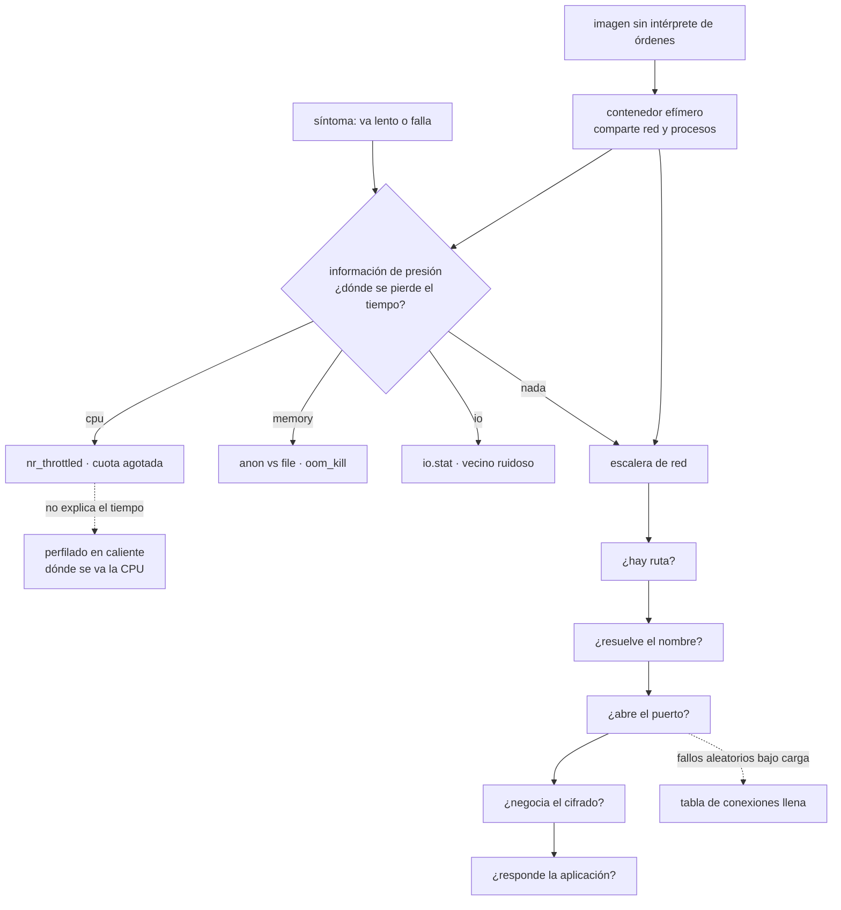

# 070 — Diagnóstico de CPU, memoria, red y filesystem

> [← Clase anterior](../../part-05-containers-docker-oci/069-rootless-capabilities-seccomp-y-secretos/README.md) · [Índice de la parte](../README.md) · [Clase siguiente →](../../part-05-containers-docker-oci/071-migracion-de-una-aplicacion-legacy-a-contenedores/README.md)

**Parte:** 05 — Contenedores, Docker y OCI<br>
**Nivel:** intermedio · **Horas estimadas:** 4<br>
**Laboratorio:** `observability` · **Estado:** `EXECUTABLE_CORE`

## 🎯 Propósito

Diagnosticar un contenedor que va mal, con dos restricciones que las clases anteriores han creado a propósito: **la imagen no tiene intérprete de órdenes** y **los límites, no el anfitrión, son el techo**. De ahí sale un método distinto del de una máquina: se entra con un contenedor efímero que comparte los espacios de nombres, se leen los ficheros del grupo de control en vez del panel del anfitrión, y se usa una señal que casi nadie mira y que mide exactamente lo que importa: **cuánto tiempo se pierde esperando por cada recurso**.

## 📚 Resultados de aprendizaje

Al finalizar podrás:

1. **Investigar** un contenedor sin intérprete de órdenes usando un contenedor efímero que comparte sus espacios de nombres.
2. **Leer** la información de presión por recurso y usarla como aviso antes del fallo.
3. **Distinguir** saturación de CPU, de memoria, de disco y de red con la señal propia de cada una.
4. **Localizar** el consumo real de un proceso en producción sin reiniciarlo ni modificar la imagen.
5. **Recorrer** la escalera de diagnóstico de red hasta el punto exacto donde se rompe.

## 🧩 Conceptos centrales

| Concepto | Comprensión verificable |
|---|---|
| `contenedor efímero de diagnóstico` | Contenedor con herramientas que se une a los espacios de nombres de otro. Permite investigar una imagen mínima sin añadirle nada. |
| `información de presión` | Medida del **tiempo perdido esperando** por CPU, memoria o disco, disponible por grupo de control. Es la señal que se corresponde con lo que sufre el usuario. |
| `saturación frente a utilización` | La utilización dice cuánto se usa; la saturación, cuánto se espera. Un recurso al 60 % con cola es peor que uno al 95 % sin ella. |
| `tabla de seguimiento de conexiones` | Registro del núcleo con las conexiones traducidas. Al llenarse, se descartan paquetes **sin ningún error en la aplicación**. |
| `perfilado en caliente` | Obtener el consumo por función de un proceso en marcha, sin reiniciarlo ni cambiar la imagen. Responde lo que ninguna traza puede responder. |
| `escalera de red` | Secuencia fija —ruta, nombre, puerto, cifrado, aplicación— que localiza en qué peldaño se rompe una conexión en vez de adivinarlo. |

## 🧠 Modelo mental

Una imagen es un artefacto inmutable; un contenedor es un proceso aislado con límites y dependencias explícitas, no una máquina virtual pequeña.

Aplicado a esta clase, separa siempre cuatro planos: **intención** (qué necesita el usuario),
**configuración** (qué declaramos), **estado observado** (qué existe de verdad) y
**evidencia** (cómo sabemos que cumple). Confundirlos produce diseños que se ven correctos
en un diagrama pero fallan al operar.

## 🗺️ Flujo de razonamiento



## 📖 Desarrollo

### 1. Entrar sin entrar: el contenedor efímero

Las clases 062 y 069 dejaron imágenes sin intérprete de órdenes, sin gestor de paquetes y sin utilidades. Eso es lo correcto y crea un problema práctico:

```bash
$ docker exec -it tienda sh
OCI runtime exec failed: exec: "sh": executable file not found
```

La respuesta **no** es añadir un intérprete a la imagen de producción. Es traer las herramientas en otro contenedor que se una a los espacios de nombres del que se investiga — el modo compartido de la clase 065:

```bash
$ docker run --rm -it \
    --network container:tienda \
    --pid container:tienda \
    --cap-add SYS_PTRACE \
    nicolaka/netshoot
```

Dentro de ese contenedor se ve **la red y los procesos del otro**, con todas las herramientas:

```bash
# ss -ltnp                 → los puertos que escucha el proceso investigado
# ps aux                   → sus procesos
# tcpdump -i any port 5432 → su tráfico
# cat /proc/1/environ      → su entorno (clase 069)
```

En una plataforma, el mecanismo tiene nombre propio y funciona igual:

```bash
$ kubectl debug -it tienda-7f4c9 --image=nicolaka/netshoot \
    --target=tienda --profile=general
```

`--target` es la parte importante: sin él, el contenedor comparte la red pero **no los procesos**, y la mitad de las comprobaciones no sirven.

Y desde el anfitrión, cuando ni siquiera eso está disponible, se entra en los espacios de nombres directamente:

```bash
$ PID=$(docker inspect -f '{{.State.Pid}}' tienda)
$ sudo nsenter -t $PID -n ss -ltnp        # solo la red
$ sudo ls -l /proc/$PID/root/etc/         # su sistema de ficheros, desde fuera
$ sudo cat /proc/$PID/limits
```

La segunda línea es especialmente útil: **el sistema de ficheros del contenedor es accesible desde el anfitrión** a través de la raíz del proceso, sin necesidad de ejecutar nada dentro. Se pueden leer ficheros de configuración y registros de una imagen que no tiene con qué mostrarlos.

Y una regla que conviene fijar antes de necesitarla: **el contenedor de diagnóstico se documenta y se autoriza**. Tiene herramientas de red y capacidad de inspeccionar procesos, así que es exactamente lo que un atacante querría. En producción debe estar sujeto a la misma política de admisión que el resto (clase 067) y su uso debe quedar registrado, igual que el acceso justo a tiempo de la clase 046.

### 2. La presión: la señal que mide lo que duele

Los paneles muestran utilización: porcentaje de CPU, memoria usada, operaciones de disco. Ninguna de esas cifras responde a la pregunta que importa, que es **cuánto tiempo se está perdiendo esperando**.

El núcleo la publica por grupo de control, y casi nadie la mira:

```bash
$ cat /sys/fs/cgroup/cpu.pressure
some avg10=34.21 avg60=28.90 avg300=19.44 total=418293991

$ cat /sys/fs/cgroup/memory.pressure
some avg10=0.00 avg60=0.00 avg300=0.00 total=0
full avg10=0.00 avg60=0.00 avg300=0.00 total=0

$ cat /sys/fs/cgroup/io.pressure
some avg10=2.11 avg60=1.80 avg300=1.02 total=88142991
```

Cómo se lee:

```text
some   porcentaje de tiempo en que AL MENOS una tarea esperaba por ese recurso
full   porcentaje de tiempo en que TODAS esperaban: nadie avanzaba
avg10  media de los últimos 10 segundos
```

Y por qué es mejor señal que la utilización:

```text
CPU al 95 % sin cola          el contenedor está aprovechando su cuota: sano
CPU al 40 % con presión 34 %  hay trabajo esperando: la cuota es el problema
memoria al 80 % sin presión   normal
memoria al 70 % con presión   el núcleo está desalojando caché sin parar:
                              la E/S se va a disparar antes que la memoria falle
```

La última fila es la más valiosa, porque es un **aviso previo**: la presión de memoria sube minutos antes de la terminación por falta de memoria de la clase 063. Un umbral sobre `memory.pressure some avg60 > 10` avisa mientras todavía se puede actuar; el contador de terminaciones avisa después.

Los umbrales que funcionan como punto de partida, y que hay que ajustar por servicio:

```text
cpu.pressure    some avg60 > 20 %   la cuota está frenando de forma sostenida
memory.pressure some avg60 > 10 %   el límite está cerca; revisar antes del fallo
io.pressure     some avg60 > 20 %   disco saturado, propio o de un vecino
io.pressure     full avg10 > 10 %   nadie avanza: incidente
```

Y las tres métricas de grupo de control que la clase 063 pedía, ampliadas con estas tres de presión, forman el panel mínimo de cualquier plataforma de contenedores:

```text
oom_kill acumulado          cualquier valor > 0
proporción de periodos limitados
procesos frente al tope
presión de CPU, memoria y E/S
```

Seis señales. Con ellas, los incidentes de las clases 063, 064 y 068 se detectan antes de producir daño; sin ellas, se detectan por sus consecuencias.

### 3. Dónde se va el tiempo: perfilar sin reiniciar

Cuando la presión no explica nada —el contenedor tiene cuota de sobra, memoria libre y disco tranquilo— el problema está **dentro del proceso**, y ninguna traza distribuida lo va a mostrar porque ocurre dentro de un tramo.

La herramienta es el perfilado, y lo importante es que se puede hacer **sobre el proceso en marcha, en producción, sin reiniciar y sin cambiar la imagen**.

Si la aplicación expone un punto de perfilado —lo habitual en varios lenguajes— basta con consultarlo:

```bash
$ kubectl port-forward tienda-7f4c9 6060:6060 &
$ go tool pprof -http=:8080 http://localhost:6060/debug/pprof/profile?seconds=30
$ go tool pprof -http=:8081 http://localhost:6060/debug/pprof/heap
```

Y si no la expone, hay perfiladores que se adjuntan desde fuera al proceso en ejecución:

```bash
# desde un contenedor efímero que comparte los procesos
$ py-spy top --pid 1
$ py-spy dump --pid 1          # la pila de cada hilo, ahora mismo
```

La segunda orden merece atención porque resuelve un caso concreto que cuesta horas: un proceso **colgado**. Un volcado de pilas dice exactamente en qué línea está esperando cada hilo, y eso distingue de un vistazo entre un bloqueo mutuo, una espera en una llamada de red sin plazo y un bucle.

Desde el anfitrión, con herramientas del núcleo, funciona para cualquier lenguaje:

```bash
$ PID=$(docker inspect -f '{{.State.Pid}}' tienda)
$ sudo perf record -F 99 -p $PID -g -- sleep 30
$ sudo perf script | stackcollapse-perf.pl | flamegraph.pl > perfil.svg
```

Y los tres hallazgos típicos, que casi nunca están donde el equipo cree:

```text
serialización y deserialización   con frecuencia el mayor consumo de un servicio
compilación repetida de expresiones regulares o de plantillas
criptografía y compresión         a veces correcta, a veces aplicada dos veces
manejo de fechas y zonas horarias  sorprendentemente caro en algunos entornos
```

Y el perfil de **memoria**, que responde a la pregunta que la clase 063 dejaba abierta cuando la terminación no venía de un montaje en memoria ni de una configuración mal dimensionada:

```bash
$ go tool pprof -http=:8081 http://localhost:6060/debug/pprof/heap
# o, para comparar dos momentos y ver qué crece
$ curl -s localhost:6060/debug/pprof/heap > t0.pprof
$ sleep 600; curl -s localhost:6060/debug/pprof/heap > t1.pprof
$ go tool pprof -base t0.pprof t1.pprof
```

La comparación entre dos instantes es lo que distingue una fuga de un uso alto pero estable, y es la única forma de demostrar cuál de las dos es. Un servicio que crece 40 MiB cada diez minutos tiene una fuga; uno que se estabiliza en 400 MiB tiene un límite mal puesto.

Y el perfilador continuo de la clase 057 hace todo esto sin que nadie lo pida, que es la diferencia entre encontrarlo durante el incidente y haberlo encontrado antes.

### 4. La escalera de red y las dos causas que no dan error

El diagnóstico de red se hace en orden fijo, porque cada peldaño depende del anterior y saltarse uno hace perder tiempo:

```bash
# 1. ¿hay ruta?
# ip route get 10.20.5.7

# 2. ¿resuelve el nombre?
# dig +short bd.interno
# getent hosts bd.interno

# 3. ¿abre el puerto?
# nc -zv bd.interno 5432

# 4. ¿negocia el cifrado?
# openssl s_client -connect api.proveedor.com:443 -servername api.proveedor.com </dev/null

# 5. ¿responde la aplicación?
# curl -v -m 5 http://bd.interno:8080/readyz
```

Y cuando el resultado es «a veces sí y a veces no», hay dos causas que **no producen ningún error en la aplicación** y que conviene descartar antes de nada.

**La tabla de seguimiento de conexiones llena.** El núcleo mantiene un registro de las conexiones traducidas, y ese registro tiene un tamaño. Al llenarse, descarta paquetes en silencio:

```bash
$ cat /proc/sys/net/netfilter/nf_conntrack_count /proc/sys/net/netfilter/nf_conntrack_max
262144
262144                 ← lleno
$ dmesg | grep -c 'nf_conntrack: table full'
1284
```

El síntoma es exactamente el que más despista: **conexiones que fallan al azar bajo carga, en cualquier servicio del nodo, sin patrón**. Y la causa suele ser un servicio que abre muchas conexiones cortas —el mismo defecto de las clases 039, 043, 051 y 065—, con lo que la corrección tiene dos partes: subir el tamaño de la tabla y reducir las conexiones en la aplicación.

**Retransmisiones y colas del socket.** Antes de culpar a la red conviene mirar si el problema es de la máquina:

```bash
$ ss -ti | grep -A1 ESTAB | grep -E 'retrans|rto' | head
$ ss -ltn '( sport = :8080 )'
Recv-Q Send-Q  Local Address:Port
   511    511        0.0.0.0:8080     ← la cola de aceptación, llena
$ nstat -az TcpExtListenOverflows TcpExtListenDrops
TcpExtListenOverflows           4127
```

Una cola de aceptación desbordada significa que el proceso **no acepta conexiones tan rápido como llegan**. No es un problema de red: es un problema de la aplicación, y se manifiesta como tiempos de espera del cliente. La corrección puede ser aumentar la cola, y casi siempre es que el proceso está bloqueado en otra cosa — lo que devuelve al perfilado del apartado anterior.

Y la captura de tráfico, que es el último recurso y hay que saber acotarla para que sirva:

```bash
# desde el contenedor efímero, que comparte la red del investigado
$ tcpdump -i any -nn -c 200 'host 10.20.5.7 and port 5432' -w /tmp/captura.pcap
```

Con el filtro puesto y un número máximo de paquetes. Una captura sin filtro en un servicio con tráfico produce gigabytes ilegibles y añade carga justo cuando el sistema ya está mal.

### 5. El método, y las dos preguntas que lo cierran

Con las señales y las herramientas anteriores, el diagnóstico de un contenedor sigue siempre el mismo orden:

```text
1. ¿el usuario lo nota?        SLO y presupuesto de error (clase 057)
2. ¿qué recurso tiene presión? cpu, memory, io — por grupo de control
3. si hay presión de CPU       ¿es cuota (nr_throttled) o es trabajo real?
   si hay presión de memoria   ¿anónima o caché? ¿oom_kill > 0?
   si hay presión de E/S       ¿este contenedor o un vecino del nodo?
   si no hay presión           el tiempo se va dentro del proceso o en la red
4. dentro del proceso          perfil de CPU o volcado de pilas
   en la red                   escalera de cinco peldaños
5. ¿qué cambió?                despliegue, configuración, volumen de tráfico
```

El paso 3 con presión de E/S merece una nota porque es el único que apunta fuera del contenedor: **el disco del nodo lo comparten todos sus contenedores**, y un vecino que escribe mucho degrada a los demás sin superar ningún límite propio. Se confirma comparando la presión del contenedor con la del nodo:

```bash
$ cat /sys/fs/cgroup/io.pressure          # este contenedor
some avg10=18.40
$ cat /proc/pressure/io                   # el nodo entero
some avg10=61.22 full avg10=44.10         ← el problema no es de este contenedor
```

Y las dos preguntas que cierran cualquier diagnóstico y que este programa ha ido repitiendo:

**¿Qué señal habría detectado esto antes?** Si la respuesta es «ninguna», el resultado del incidente no es solo la corrección: es la métrica que falta. Los seis indicadores de grupo de control de esta clase salieron todos de esa pregunta.

**¿Está escrita la consulta que lo encontró?** Un diagnóstico que costó tres horas y no dejó una consulta guardada costará tres horas la próxima vez. Es el mismo criterio de las clases 045 y 057: **un incidente no es el momento de aprender a consultar**.

Y un cierre honesto sobre los límites de esta clase. Todo lo anterior diagnostica **un contenedor**. Cuando el problema está en la interacción entre varios —una cascada, una dependencia circular, un reparto de carga desequilibrado— hacen falta las trazas distribuidas de las clases 045 y 057 y los conceptos de sistemas distribuidos de la parte 12. La señal de que se ha cruzado esa frontera es concreta: **cada componente parece sano por separado y el conjunto no funciona**. Ahí, seguir mirando grupos de control no lleva a ninguna parte.

## 🔬 Ejemplo trabajado

**CloudShop tiene tres incidentes en dos semanas y ninguno se diagnostica con las herramientas que el equipo usaba. Los tres se resuelven con el método de esta clase, y los tres dejan una métrica que no existía.**

**Incidente 1 — el percentil 99 se dispara y no hay nada saturado.**

```text
p99 del catálogo        112 ms → 890 ms, sin cambios de código ni de tráfico
CPU del contenedor      41 %
memoria                 38 % del límite
```

Con las herramientas anteriores, el diagnóstico se detenía ahí. Con la presión:

```bash
$ kubectl exec catalogo-7f4 -- cat /sys/fs/cgroup/io.pressure
some avg10=19.80 avg60=17.22
$ kubectl debug node/nodo-14 -it --image=busybox -- cat /proc/pressure/io
some avg10=64.10 full avg10=47.33
```

La presión de E/S del nodo era tres veces la del contenedor: el problema estaba fuera. Un trabajo de indexación en otro contenedor del mismo nodo escribía 400 MB/s.

```text                                        antes            después
límite de E/S en el trabajo de indexación   ninguno       100 MB/s declarado
presión de E/S del nodo                     64 %              9 %
p99 del catálogo                           890 ms           118 ms
métrica de presión en el panel                no          las tres, por contenedor
```

Y se anotó la lección: **un contenedor puede estar dentro de todos sus límites y sufrir por el vecino**, y la única señal que lo muestra es la presión comparada.

**Incidente 2 — conexiones que fallan al azar bajo carga.**

```text
síntoma    ~0,8 % de conexiones fallidas en el pico, en TODOS los servicios
           del nodo, sin patrón por destino ni por servicio
```

La escalera de red daba correcto en los cinco peldaños cuando se probaba a mano. La causa apareció en el núcleo:

```bash
$ kubectl debug node/nodo-14 -it --image=busybox -- \
    sh -c 'cat /proc/sys/net/netfilter/nf_conntrack_count /proc/sys/net/netfilter/nf_conntrack_max; dmesg | tail -3'
262144
262144
nf_conntrack: table full, dropping packet
```

La tabla estaba llena. El origen: un servicio que abría una conexión por petición hacia la pasarela de pago — el mismo defecto que este programa ha encontrado en las clases 039, 043, 051 y 065, ahora con una quinta manifestación.

```text                                        antes            después
cliente HTTP                       uno por petición    uno por proceso
entradas en la tabla en el pico        262.144            41.200
tamaño de la tabla                     262.144           524.288
conexiones fallidas en el pico           0,8 %             0,0 %
alerta sobre ocupación de la tabla      ninguna       > 70 % → aviso
```

Las dos correcciones: la de la aplicación es la que resuelve, la del tamaño es el margen.

**Incidente 3 — una fuga de memoria en una imagen sin intérprete de órdenes.**

```text
terminaciones por memoria    1 cada 6 horas
montaje en memoria           64 MiB, correcto (clase 064)
configuración del tiempo
  de ejecución               acorde al límite (clase 063)
```

Descartadas las dos causas conocidas, quedaba el proceso. Y la imagen no tenía con qué mirar dentro:

```bash
$ kubectl exec informes-3a1 -- sh
error: exec: "sh": executable file not found
```

Con un contenedor efímero que comparte los procesos:

```bash
$ kubectl debug -it informes-3a1 --image=nicolaka/netshoot --target=informes
# curl -s localhost:6060/debug/pprof/heap > /tmp/t0
# sleep 600 && curl -s localhost:6060/debug/pprof/heap > /tmp/t1
```

Y la comparación entre los dos instantes:

```text
crecimiento en 10 minutos          +38 MiB
concentrado en                     una caché en memoria sin límite ni vencimiento
                                   de plantillas compiladas por cliente
```

```text                                        antes            después
caché de plantillas                sin límite         acotada, con vencimiento
crecimiento de memoria             +38 MiB / 10 min      estable
terminaciones por memoria           1 cada 6 h              0
tiempo hasta el diagnóstico            —              47 min con el método
```

No hizo falta cambiar la imagen, ni añadir un intérprete de órdenes, ni reiniciar el proceso investigado.

**Y lo que quedó escrito.**

Las tres investigaciones dejaron seis métricas y cuatro consultas que antes no existían:

```text
métricas nuevas
  presión de CPU, memoria y E/S por contenedor
  presión de E/S del nodo
  ocupación de la tabla de conexiones
  desbordamientos de la cola de aceptación

consultas guardadas
  comparar presión de contenedor con la del nodo
  volcado de pilas de un proceso colgado
  comparación de dos perfiles de memoria
  escalera de red desde un contenedor efímero
```

**Resumen:**

```text                                          antes         después
p99 del catálogo en horas de indexación       890 ms         118 ms
conexiones fallidas en el pico                 0,8 %          0,0 %
terminaciones por memoria                  1 cada 6 h           0
métricas de presión en el panel                  0             4
tiempo medio hasta un diagnóstico de este tipo  horas       < 1 hora
consultas de diagnóstico guardadas               0             4
```

**La lección que esta clase traslada al proyecto de la clase 072**: los tres incidentes eran invisibles con las métricas de utilización, y los tres tenían una señal disponible en el núcleo que nadie estaba leyendo. La presión mide **el tiempo perdido esperando**, que es exactamente lo que sufre el usuario, y está publicada por grupo de control desde hace años sin coste. Y la restricción que las clases 062 y 069 crearon —una imagen sin herramientas— no dificultó ningún diagnóstico: **las herramientas se traen, no se instalan**, y esa es la práctica que hay que ensayar antes del incidente y no durante.

## 🧪 Laboratorio guiado

Ejecuta desde la raíz:

```bash
python classes/part-05-containers-docker-oci/070-diagnostico-de-cpu-memoria-red-y-filesystem/lab.py
```

El laboratorio selecciona el motor de práctica **`observability`** y produce
`lab_result.json`. El escenario, sus comprobaciones y el artefacto esperado corresponden a
esta clase; no requiere credenciales y deja explícito qué debe revalidarse en un sandbox real.

1. Lee `exercise.steps` y formula una predicción antes de ejecutar.
2. Ejecuta la práctica y verifica todos los elementos de `checks`.
3. Provoca el caso de `negative_test` y explica la señal observada.
4. Materializa `informe-diagnostico` en `evidence/` usando la plantilla indicada.
5. Para proveedor real, sigue `sandbox.requires`, registra costo y ejecuta `destroy`.

### Evidencia esperada

El artefacto principal es telemetría correlacionada con una pregunta operativa. Además, la entrega debe incluir el comando ejecutado,
la salida estructurada y una conclusión que no exceda lo observado.

## 🏆 Reto verificable

Construye **`informe-diagnostico`** para el caso CloudShop. Incluye una alternativa descartada,
un supuesto que pueda falsarse, una prueba de fallo y una decisión de rollback.

## ✅ Criterio de aceptación

- [ ] `lab.py` termina con código 0 y genera JSON válido.
- [ ] La entrega conecta al menos tres requisitos con mecanismos verificables.
- [ ] Existe una prueba positiva y una prueba negativa con evidencia.
- [ ] Seguridad, costo y operación aparecen como decisiones, no como anexos.
- [ ] Se declara una limitación y una condición que obligaría a revisar el diseño.
- [ ] Otra persona puede repetir el recorrido sin conocimiento tácito.

## ⚠️ Errores frecuentes

| Síntoma | Causa probable | Corrección |
|---|---|---|
| No se puede investigar un contenedor porque la imagen no tiene intérprete de órdenes | La imagen está endurecida a propósito, según las clases 062 y 069 | Usa un contenedor efímero que comparta red y procesos del investigado; nunca añadas herramientas a la imagen de producción. |
| El servicio va lento con todos los recursos dentro de sus límites | La utilización no mide la espera; puede haber presión, propia o del nodo | Lee la información de presión por grupo de control y compárala con la del nodo para descartar un vecino ruidoso. |
| Conexiones que fallan al azar bajo carga en todos los servicios del nodo | La tabla de seguimiento de conexiones del núcleo está llena y descarta paquetes en silencio | Reduce las conexiones cortas en la aplicación, aumenta el tamaño de la tabla y alerta sobre su ocupación. |
| Se sospecha una fuga de memoria y no se puede demostrar | Una sola medición no distingue una fuga de un uso alto y estable | Compara dos perfiles de memoria separados en el tiempo; el crecimiento sostenido es la prueba. |
| Los clientes sufren tiempos de espera y la red está bien | La cola de aceptación del socket se desborda porque el proceso no acepta con la rapidez suficiente | Comprueba los desbordamientos de la cola y perfila el proceso: casi siempre está bloqueado en otra cosa. |
| Cada componente parece sano y el conjunto no funciona | El problema está en la interacción entre servicios, no dentro de uno | Cambia de herramienta: trazas distribuidas y análisis de dependencias; seguir mirando grupos de control no lleva a ninguna parte. |

## 🛡️ Seguridad, ética y costo

Trabaja con cuentas propias o sandboxes autorizados. No publiques secretos, identificadores
reales ni datos personales. Antes de crear recursos pagos define presupuesto, etiquetas y
comando de destrucción; después verifica que no queden recursos huérfanos. Los ejemplos
locales enseñan contratos, pero no certifican cumplimiento ni disponibilidad de producción.

## ❓ Preguntas de comprobación

1. ¿Cómo se investiga un contenedor sin intérprete de órdenes, y qué opción es imprescindible para ver sus procesos?
2. ¿Qué mide la información de presión que no mide la utilización, y qué umbral usarías como aviso previo a una terminación por memoria?
3. ¿Cómo distingues un problema de E/S propio de uno causado por un vecino del mismo nodo?
4. ¿Qué síntoma produce una tabla de seguimiento de conexiones llena y por qué es difícil de atribuir?
5. ¿Qué demuestra la comparación de dos perfiles de memoria que una sola medición no puede demostrar?

## 🔗 Referencias

- Linux (2025). *Pressure Stall Information* — `some` y `full` por recurso y por grupo de control. <https://docs.kernel.org/accounting/psi.html>
- Kubernetes (2025). *Debug running pods with ephemeral containers* — `kubectl debug` y `--target`. <https://kubernetes.io/docs/tasks/debug/debug-application/debug-running-pod/>
- Brendan Gregg (2020). *Systems Performance*, cap. 2 — método de utilización, saturación y errores. <https://www.brendangregg.com/systems-performance-2nd-edition-book.html>
- Linux (2025). *nf_conntrack sysctl* — tamaño de la tabla, ocupación y descarte de paquetes. <https://www.kernel.org/doc/html/latest/networking/nf_conntrack-sysctl.html>
- Go (2025). *Profiling Go programs with pprof* — perfiles de CPU y memoria, y comparación entre instantes. <https://go.dev/blog/pprof>
- Documentación oficial vigente del servicio implementado; registra URL y fecha de consulta.

---

> [Evaluación](assessment.md) · [Contrato de clase](lesson.yaml) · [Índice de la parte](../README.md)
