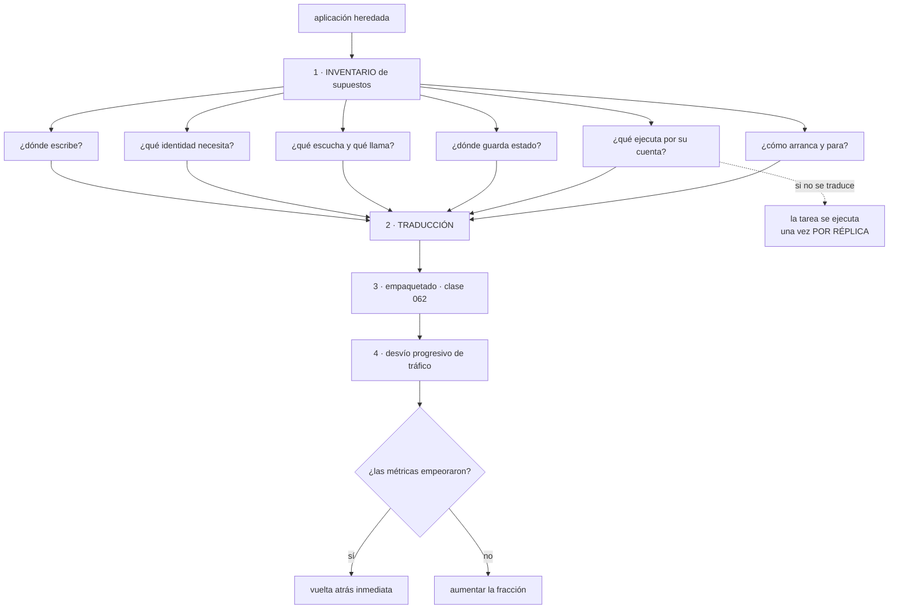

# 071 — Migración de una aplicación legacy a contenedores

> [← 070 · Diagnóstico de CPU, memoria, red y filesystem](../../part-05-containers-docker-oci/070-diagnostico-de-cpu-memoria-red-y-filesystem/README.md) · [Índice de la parte](../README.md) · [072 · Proyecto: stack OCI endurecido y observable →](../../part-05-containers-docker-oci/072-proyecto-stack-oci-endurecido-y-observable/README.md)

**Parte:** 05 — Contenedores, Docker y OCI<br>
**Nivel:** intermedio · **Horas estimadas:** 4<br>
**Laboratorio:** `migration` · **Estado:** `EXECUTABLE_CORE`

## 🎯 Propósito

Llevar a contenedores una aplicación que no se escribió para ellos, que es el caso real en la mayoría de las organizaciones y donde el error típico no es técnico sino de orden: se empieza escribiendo el `Dockerfile`. La clase invierte el orden —primero el inventario de supuestos de la aplicación, después la traducción de cada uno, y solo entonces el empaquetado— y presta atención especial al fallo que más daño hace en estas migraciones: **una tarea programada dentro de la aplicación que, al haber tres réplicas, se ejecuta tres veces**.

## 📚 Resultados de aprendizaje

Al finalizar podrás:

1. **Inventariar** los supuestos de una aplicación antes de empaquetarla, con una tabla que sirva de plan.
2. **Traducir** los patrones heredados habituales —sesión en proceso, ficheros locales, tareas programadas, bloqueos— a su equivalente en contenedores.
3. **Migrar** por partes con desvío progresivo de tráfico en lugar de un cambio único.
4. **Medir** antes y después para demostrar que nada empeoró.
5. **Decidir** con criterio cuándo una aplicación no debe contenerizarse.

## 🧩 Conceptos centrales

| Concepto | Comprensión verificable |
|---|---|
| `inventario de supuestos` | Tabla de lo que la aplicación da por hecho: dónde escribe, con qué identidad, qué escucha, dónde guarda estado y qué ejecuta por su cuenta. Es el plan de migración real. |
| `traslado literal` | Meter la aplicación en un contenedor sin cambiar nada. Produce un contenedor que se comporta como una máquina y hereda todos sus problemas sin ninguna de sus ventajas. |
| `estrangulamiento progresivo` | Migrar por partes desviando una fracción del tráfico, con vuelta atrás inmediata, en lugar de sustituir todo de una vez. |
| `tarea programada en proceso` | Trabajo periódico que la aplicación ejecuta por su cuenta. Con varias réplicas **se ejecuta una vez por réplica**, y ese es el fallo más caro de estas migraciones. |
| `estado adherido` | Sesión, caché o bloqueo que vive en la memoria o el disco de una instancia concreta. Es lo que impide reemplazar instancias, que es la propiedad que se quiere ganar. |
| `línea base comparable` | Medición del sistema antes de migrar, con el mismo método que se usará después. Sin ella, no se puede afirmar que la migración no empeoró nada. |

## 🧠 Modelo mental

Una imagen es un artefacto inmutable; un contenedor es un proceso aislado con límites y dependencias explícitas, no una máquina virtual pequeña.

Aplicado a esta clase, separa siempre cuatro planos: **intención** (qué necesita el usuario),
**configuración** (qué declaramos), **estado observado** (qué existe de verdad) y
**evidencia** (cómo sabemos que cumple). Confundirlos produce diseños que se ven correctos
en un diagrama pero fallan al operar.

## 🗺️ Flujo de razonamiento



## 📖 Desarrollo

### 1. El inventario va antes que el Dockerfile

La migración fallida tiene una firma reconocible: empieza escribiendo el `Dockerfile`, consigue que la aplicación arranque en un día, y a partir de ahí acumula problemas durante meses. Ninguno de esos problemas es del empaquetado.

El orden correcto empieza por seis preguntas, y la tabla que producen **es** el plan de migración:

| Pregunta | Qué hay que averiguar | Clase |
|---|---|---|
| ¿Dónde escribe? | Rutas, tamaño, si sobrevive a un reinicio | 064 |
| ¿Con qué identidad? | Usuario, permisos, ficheros con propiedad concreta | 069 |
| ¿Qué escucha y a qué llama? | Puertos, destinos, si depende de su propia dirección | 065 |
| ¿Dónde guarda estado? | Sesiones, subidas, cachés, bloqueos | 064 |
| ¿Qué ejecuta por su cuenta? | Tareas programadas, procesos en segundo plano | esta |
| ¿Cómo arranca y para? | Orden, tiempo, qué hace al recibir la señal | 068 |

Y se responden **observando**, no leyendo la documentación, que casi siempre está incompleta:

```bash
# dónde escribe, durante una hora de uso real
$ sudo inotifywait -mr /opt/app /var /tmp -e create,modify --format '%w%f' \
  | sort -u > escrituras.txt

# qué escucha y a qué llama
$ sudo ss -tanp | grep -E 'java|python|httpd'
$ sudo lsof -i -a -p $(pgrep -f app) -n

# qué ejecuta por su cuenta
$ crontab -l -u app; ls -l /etc/cron.d/ /etc/systemd/system/*.timer

# con qué identidad y qué ficheros necesita
$ ps -eo user,pid,cmd | grep app
$ sudo lsof -p $(pgrep -f app) | awk '{print $9}' | grep -v '^/proc' | sort -u
```

El resultado suele contener sorpresas que ningún miembro del equipo actual conocía: un directorio temporal compartido con otro sistema, una llamada a un servicio interno que nadie recordaba, un fichero de bloqueo que garantiza que solo hay una instancia.

Y hay una decisión de alcance que conviene tomar aquí y no después: **la base de datos no se migra en el mismo paso**. Contenerizar la aplicación y mover el almacén de datos a la vez multiplica las causas posibles de cualquier problema. La aplicación va a contenedores hablando con la misma base de datos de siempre; el motor se aborda después, si es que se aborda.

Y otra que ahorra semanas: **contenerizar no es reescribir**. La tentación de aprovechar para dividir el monolito, cambiar el marco de trabajo o reordenar el código convierte una migración medible en un proyecto sin final. Primero se mueve tal cual con los supuestos traducidos, se demuestra que nada empeoró, y después se decide qué se cambia.

### 2. Los seis patrones heredados y su traducción

Casi todo lo que aparece en el inventario cae en uno de seis patrones, y cada uno tiene una traducción conocida y una versión provisional aceptable.

**1. Sesión en la memoria del proceso.** Es el más común y el que impide reemplazar instancias.

```text
traducción correcta   sesión en un almacén externo (clase 042/054), o testigo
                      firmado sin estado en el servidor
provisional aceptable afinidad de sesión en el balanceador, documentada,
                      con la limitación explícita: un reinicio pierde las sesiones
no aceptable          fingir que no existe y descubrirlo al escalar
```

**2. Ficheros escritos en disco local.** Subidas, informes generados, cachés.

```text
subidas de usuario     almacenamiento de objetos (clases 030, 041, 053)
informes temporales    montaje en memoria, con tamaño acotado (clase 064)
cachés reconstruibles  se pierden y se reconstruyen: no necesitan volumen
ficheros compartidos   sistema de ficheros compartido, con la advertencia
                       de semántica de la clase 064
```

**3. Tarea programada dentro de la aplicación.** Este merece su propio apartado, más abajo, porque es el que produce daño real.

**4. Bloqueo por fichero para garantizar una sola ejecución.**

```bash
# el patrón heredado
if [ -f /var/run/proceso.lock ]; then exit 0; fi
touch /var/run/proceso.lock
```

Con varias réplicas, cada una tiene su propio sistema de ficheros, así que el bloqueo no bloquea nada.

```text
traducción   bloqueo en un almacén compartido con vencimiento,
             o elección de líder que ofrezca la plataforma
simplificación  a menudo la mejor: hacer el proceso IDEMPOTENTE
                y dejar de necesitar el bloqueo (clases 033, 044, 056)
```

**5. Registros en ficheros con rotación.**

```text
traducción   salida estándar; la plataforma recoge y rota
efecto secundario  desaparece el volumen de registros que se llenaba
trampa       si se deja el fichero Y se añade la salida estándar,
             se paga la ingesta dos veces (clases 045, 057)
```

**6. Configuración por fichero con valores por entorno.** La clase 062 ya dio la regla: se inyecta al ejecutar. La traducción típica es una plantilla que el punto de entrada rellena desde variables y secretos montados, sin reconstruir nada.

Y dos supuestos que **no** tienen traducción y hay que detectar pronto, porque cambian la decisión:

```text
la aplicación depende de su nombre de máquina o de su dirección
  típico en licencias atadas al equipo y en clústeres antiguos
  → hay que resolverlo con el proveedor antes de seguir

la aplicación necesita módulos del núcleo o hardware concreto
  → contenerizarla exige privilegios que anulan el aislamiento (clase 069)
```

El segundo lleva a la pregunta del último apartado: si contenerizar exige `--privileged`, la ganancia se ha evaporado.

### 3. La tarea programada que se ejecuta tres veces

Es el fallo más caro de estas migraciones y aparece semanas después, cuando alguien escala el servicio.

```text
en una máquina
  la aplicación arranca un hilo que a las 02:00 factura los pedidos del día
  hay UNA máquina: se ejecuta una vez

en contenedores con 3 réplicas
  cada réplica arranca su hilo
  a las 02:00 se ejecuta TRES veces
```

Y el daño depende de lo que haga la tarea:

```text
generar un informe        tres informes idénticos: molesto
enviar correos            tres correos a cada cliente: incidente visible
facturar                  triple facturación: incidente grave
borrar datos antiguos     condición de carrera entre las tres
```

Lo peor es que **funciona durante semanas** mientras hay una sola réplica, y aparece el día que alguien escala — que suele ser un día de mucho tráfico, es decir, el peor.

Las tres traducciones, en orden de preferencia:

```text
1. sacarla de la aplicación
   un recurso de trabajo programado de la plataforma, que ejecuta un contenedor
   aparte con la misma imagen y otro punto de entrada
   → una ejecución, con su registro, su reintento y su alerta

2. elección de líder
   las réplicas se coordinan y solo una ejecuta
   → más complejidad en la aplicación; se justifica si la tarea
     necesita el estado del proceso

3. hacerla idempotente y aceptar varias ejecuciones
   → válido para tareas de limpieza o de reconciliación,
     no para las que producen efectos hacia fuera
```

La primera es casi siempre la correcta, y tiene una ventaja adicional que se descubre después: **la tarea pasa a ser visible**. Deja de ser un hilo dentro de un proceso que nadie vigila y pasa a tener su propia ejecución, su duración, su código de salida y su alerta cuando falla.

```yaml
# la misma imagen, otro punto de entrada, una sola ejecución
schedule: "0 2 * * *"
concurrencyPolicy: Forbid          # si la anterior sigue, no arranca otra
backoffLimit: 2
template:
  spec:
    containers:
      - image: registro/tienda@sha256:9f2c…
        command: ["/bin/tienda", "facturar-dia"]
```

La línea de la política de concurrencia importa más de lo que parece: sin ella, una ejecución que tarde más de un día se solapa consigo misma, que es la misma condición de carrera con otro origen.

Y la comprobación que hay que hacer **antes** de escalar, no después:

```bash
# ¿qué ejecuta la aplicación por su cuenta?
$ grep -rniE 'cron|scheduler|@Scheduled|setInterval|timer|quartz' src/ | head
```

Cualquier resultado de esa búsqueda es un candidato a ejecutarse una vez por réplica. Merece estar en la lista de comprobación de toda migración.

### 4. Migrar por partes, con vuelta atrás

Sustituir el sistema entero en una noche concentra todo el riesgo en el peor momento posible. La alternativa es desviar tráfico por fracciones, y exige tres condiciones que conviene comprobar antes:

```text
1. las dos versiones pueden convivir
   → misma base de datos, mismo esquema, sin migraciones incompatibles
2. la sesión no ata al usuario a una versión
   → o hay afinidad, o la sesión es externa (patrón 1)
3. se puede volver atrás en segundos
   → el desvío es una configuración del balanceador, no un despliegue
```

Con eso, el recorrido es gradual y cada escalón se decide con datos:

```text
fase 0   la versión en contenedor recibe 0 % y se comprueba a mano
fase 1   1 %   una hora · se comparan métricas con la línea base
fase 2   10 %  un día
fase 3   50 %  tres días · incluye un pico de tráfico real
fase 4   100 % una semana antes de retirar lo antiguo
fase 5   se retira la infraestructura anterior
```

La fase 5 se olvida sistemáticamente y tiene coste: máquinas encendidas, licencias, parches que alguien sigue aplicando. Debe tener fecha y responsable desde el principio.

Y el criterio para avanzar o retroceder tiene que estar escrito **antes** de empezar, porque durante la migración todo el mundo tiene prisa:

```text
avanzar si, comparado con la línea base:
  tasa de error igual o menor
  percentil 95 y 99 dentro del 10 %
  ningún error nuevo en el agrupador de excepciones
  consumo de recursos explicable

retroceder si cualquiera de los cuatro falla, sin discusión
```

Y la **línea base comparable** es la parte que se salta con más frecuencia. Hay que medir el sistema **antes** de tocarlo, con el mismo método que se usará después:

```text
p50, p95, p99 por operación, durante una semana completa
tasa de error por operación
coste mensual de la infraestructura actual
duración de un despliegue y de una vuelta atrás
tiempo medio de recuperación de los últimos incidentes
```

Sin esas cinco cifras, la afirmación «la migración salió bien» no se puede sostener ni rebatir. Con ellas, la conversación posterior es sobre números.

Y una precaución de datos que evita el incidente más caro de una migración por fases: mientras las dos versiones conviven, **cualquier cambio de esquema tiene que ser compatible en ambos sentidos**. Añadir columnas, sí; renombrarlas o eliminarlas, no, hasta que la versión antigua esté retirada. Es la disciplina de expandir y contraer, y la parte 08 la desarrolla.

### 5. Cuándo no contenerizar

Una clase de migración que no diga cuándo no hacerlo está incompleta. Hay cuatro casos en los que la respuesta honesta es no, y decirlo pronto ahorra meses.

**1. La aplicación necesita privilegios que anulan el aislamiento.** Módulos del núcleo, acceso directo a dispositivos, manipulación de la red del anfitrión. Si contenerizarla exige modo privilegiado (clase 069), se han conservado todos los inconvenientes y se ha perdido la principal ventaja. Existen mecanismos para casos concretos —dispositivos declarados, capacidades específicas—, y si la lista de excepciones es larga, la respuesta es una máquina.

**2. La aplicación se retira en menos de un año.** El coste de la migración no se amortiza. Lo defendible es mantenerla donde está, congelar los cambios y dedicar el esfuerzo a lo que la sustituye.

**3. La licencia lo prohíbe o lo encarece.** Algunas licencias comerciales se calculan por núcleos físicos del anfitrión, no por los asignados al contenedor, con lo que la densidad multiplica el coste en vez de reducirlo. Es una comprobación de una tarde que evita una sorpresa de seis cifras.

**4. El equipo no va a poder operarla.** Contenerizar mueve la complejidad de la instalación a la operación. Si no hay quien mantenga la plataforma, el sistema estará peor que en una máquina que alguien sabe reiniciar.

Y una quinta situación que no es un no rotundo pero exige una decisión explícita: **una aplicación con estado grande y crítico**. Un motor de base de datos autogestionado en contenedores es posible y trae los problemas de la clase 064 —un escritor por volumen, semántica de red, ventanas de despliegue—. En la mayoría de los casos, la comparación correcta no es contra la máquina actual sino contra el servicio gestionado que las partes 02, 03 y 04 describieron.

Y la lista de comprobación que cierra la clase y alimenta el proyecto de la clase 072:

```text
☐ inventario de los seis supuestos, hecho por observación
☐ línea base medida antes de tocar nada, con las cinco cifras
☐ base de datos fuera del alcance de este paso
☐ tareas programadas sacadas de la aplicación
☐ estado adherido traducido o su limitación documentada
☐ registros por salida estándar, sin duplicar
☐ configuración inyectada al ejecutar
☐ apagado ordenado verificado (clase 068)
☐ endurecimiento aplicado (clase 069)
☐ criterios de avance y de vuelta atrás escritos ANTES de empezar
☐ fecha y responsable para retirar la infraestructura anterior
```

Once puntos, de los cuales solo dos son de empaquetado. Esa proporción es la lección de la clase: **contenerizar una aplicación heredada es casi todo trabajo de análisis y de traducción, y muy poco de `Dockerfile`**.

## 🔬 Ejemplo trabajado

**CloudShop migra a contenedores su sistema de facturación, escrito hace nueve años y ejecutándose en dos máquinas. Es la aplicación de la que nadie quiere tocar nada, y el proyecto se planifica en tres fases con la línea base medida antes de empezar.**

**Fase 0 — el inventario, hecho observando.**

```text
¿dónde escribe?      /opt/fact/tmp        informes en curso, hasta 400 MB
                     /opt/fact/salida     PDF de facturas, 62 GB acumulados
                     /var/log/fact/       registros con rotación propia
                     /var/run/fact.lock   fichero de bloqueo
¿qué identidad?      usuario 1207, ficheros de salida con esa propiedad
¿qué escucha?        8080
¿a qué llama?        base de datos, pasarela de pago, y un servicio interno
                     de tipos de cambio que NADIE del equipo actual conocía
¿qué ejecuta solo?   un hilo a las 02:00 que factura el día
                     otro a las 03:30 que envía correos
¿cómo para?          no maneja la señal: lo matan
```

Dos hallazgos que no estaban en ninguna documentación: la llamada al servicio de tipos de cambio y los 62 GB de facturas en disco local, que resultaron ser la única copia de documentos con obligación de conservación de siete años.

**Fase 0 — la línea base, medida durante una semana.**

```text
p50 / p95 / p99 de la emisión de factura     180 / 890 / 2.100 ms
tasa de error                                0,4 %
coste mensual de las dos máquinas            410 USD
duración de un despliegue                    45 min, con corte de 12
tiempo medio de recuperación (3 incidentes)  2 h 10 min
```

**Fase 1 — traducción de los seis supuestos.**

```text                                        antes                después
informes en curso                   /opt/fact/tmp        montaje en memoria, 512 MB
PDF de facturas                     disco local, 62 GB   almacenamiento de objetos
                                                         con inmutabilidad (clase 053)
registros                           ficheros + rotación  salida estándar
fichero de bloqueo                  /var/run/fact.lock   eliminado: la tarea sale
                                                         de la aplicación
identidad                           usuario 1207         usuario 1207 (se conserva
                                                         para no reasignar 62 GB)
tareas programadas                  2 hilos internos     2 trabajos programados
apagado                             lo matan             señal manejada, 90 s de plazo
```

La migración de los 62 GB se hizo antes de contenerizar nada, con verificación de recuento y de suma de comprobación, y con la aplicación antigua leyendo ya del almacenamiento de objetos durante dos semanas. **Mover los datos y cambiar la plataforma son dos cambios, y se hicieron por separado.**

**Fase 2 — el desvío progresivo, y el incidente que lo justificó.**

```text
fase 1 · 1 %    1 hora    métricas iguales
fase 2 · 10 %   1 día     p99 mejora a 1.850 ms
fase 3 · 50 %   3 días    ← aquí ocurrió
```

En la fase 3, con tres réplicas y a las 02:00:

```text
facturas emitidas esa noche          3 veces las esperadas
clientes afectados                   1.204
tiempo hasta detectarlo              22 min (alerta de volumen de facturación)
tiempo hasta volver atrás             90 s
```

La causa: durante la traducción se sacaron las dos tareas a trabajos programados **y nadie eliminó los hilos internos de la aplicación**. Con una réplica en las fases 1 y 2 el efecto era una duplicación que pasó desapercibida entre el ruido; con tres réplicas se hizo evidente.

```bash
$ grep -rniE 'cron|scheduler|@Scheduled|Timer' src/ | wc -l
4
```

Cuatro coincidencias, de las que solo dos se habían tratado.

```text                                        antes            después
hilos programados dentro de la aplicación      4                 0
trabajos programados externos                  2                 4
política de concurrencia                    ninguna          Forbid
comprobación de tareas internas             no estaba     en la lista de migración
facturas duplicadas                          3.612               0
```

Las 3.612 facturas duplicadas se anularon en cuatro horas gracias a que la emisión era idempotente por número de pedido —una propiedad que existía por casualidad, no por diseño—. Se hizo obligatoria después.

**Y la vuelta atrás, que funcionó porque estaba ensayada:** noventa segundos, porque el desvío era una configuración del balanceador y no un despliegue. Ese número era uno de los criterios escritos antes de empezar.

**Fase 3 — el resultado, con la misma medición.**

```text                                     antes         después
p50 / p95 / p99 (ms)                 180/890/2.100   165/720/1.780
tasa de error                            0,4 %          0,3 %
coste mensual                          410 USD         288 USD
duración de un despliegue              45 min          3 min 20 s
corte por despliegue                   12 min             0
tiempo medio de recuperación          2 h 10 min       18 min
réplicas posibles                          1               6
facturas en disco local                  62 GB            0
```

La mejora de latencia no era el objetivo y merece explicarse para no atribuirla a los contenedores: vino de eliminar la escritura de PDF en disco local, que competía con el resto. El resto de mejoras sí son de la plataforma.

**Y la fase 5, que estuvo a punto de no ocurrir.** Las dos máquinas antiguas siguieron encendidas «por si acaso» durante siete semanas más de lo previsto. Tenían fecha y responsable desde el principio, y aun así hubo que reclamarlas dos veces.

```text
coste de las máquinas antiguas durante esas 7 semanas   96 USD
parches aplicados a un sistema ya sin tráfico            3
riesgo real                        una configuración divergente que
                                   nadie habría notado hasta necesitarla
```

**Resumen de la migración:**

```text                                          antes         después
supuestos heredados sin traducir                  6             0
hilos programados dentro de la aplicación         4             0
estado en disco local                           62 GB           0
corte por despliegue                            12 min          0
duración de un despliegue                       45 min      3 min 20 s
coste mensual                                  410 USD       288 USD
tiempo medio de recuperación                  2 h 10 min     18 min
vuelta atrás ensayada                            no        sí, 90 s medidos
```

**La lección que esta clase traslada al proyecto de la clase 072**: el único incidente serio de la migración —3.612 facturas duplicadas— no vino del empaquetado sino de un supuesto que el inventario había identificado y la traducción cubrió a medias. De los once puntos de la lista de comprobación, solo dos eran de `Dockerfile`, y el que falló fue de análisis. **Contenerizar una aplicación heredada es un ejercicio de traducción de supuestos, y el `Dockerfile` es el último paso, no el primero.**

## 🧪 Laboratorio guiado

Ejecuta desde la raíz:

```bash
python classes/part-05-containers-docker-oci/071-migracion-de-una-aplicacion-legacy-a-contenedores/lab.py
```

El laboratorio selecciona el motor de práctica **`migration`** y produce
`lab_result.json`. El escenario, sus comprobaciones y el artefacto esperado corresponden a
esta clase; no requiere credenciales y deja explícito qué debe revalidarse en un sandbox real.

1. Lee `exercise.steps` y formula una predicción antes de ejecutar.
2. Ejecuta la práctica y verifica todos los elementos de `checks`.
3. Provoca el caso de `negative_test` y explica la señal observada.
4. Materializa `plan-modernizacion` en `evidence/` usando la plantilla indicada.
5. Para proveedor real, sigue `sandbox.requires`, registra costo y ejecuta `destroy`.

### Evidencia esperada

El artefacto principal es un inventario, dependencias, riesgo y oleadas. Además, la entrega debe incluir el comando ejecutado,
la salida estructurada y una conclusión que no exceda lo observado.

## 🏆 Reto verificable

Construye **`plan-modernizacion`** para el caso CloudShop. Incluye una alternativa descartada,
un supuesto que pueda falsarse, una prueba de fallo y una decisión de rollback.

## ✅ Criterio de aceptación

- [ ] `lab.py` termina con código 0 y genera JSON válido.
- [ ] La entrega conecta al menos tres requisitos con mecanismos verificables.
- [ ] Existe una prueba positiva y una prueba negativa con evidencia.
- [ ] Seguridad, costo y operación aparecen como decisiones, no como anexos.
- [ ] Se declara una limitación y una condición que obligaría a revisar el diseño.
- [ ] Otra persona puede repetir el recorrido sin conocimiento tácito.

## ⚠️ Errores frecuentes

| Síntoma | Causa probable | Corrección |
|---|---|---|
| Una tarea periódica se ejecuta varias veces al escalar el servicio | La tarea vive dentro de la aplicación y cada réplica la arranca | Sácala a un trabajo programado con política de concurrencia, y busca en el código todas las apariciones antes de escalar. |
| La aplicación funciona con una réplica y falla con dos | Hay estado adherido: sesión en memoria, fichero de bloqueo o caché local | Traduce cada uno a su equivalente externo, o documenta la afinidad como limitación temporal con fecha. |
| Se descubre que el disco local contenía la única copia de documentos con obligación de conservación | El inventario se hizo leyendo documentación en vez de observando el sistema | Observa escrituras, conexiones y tareas durante un uso real antes de empaquetar nada. |
| Nadie puede afirmar si la migración mejoró o empeoró el sistema | No se midió la línea base antes de tocar nada | Mide latencias, errores, coste, duración de despliegue y tiempo de recuperación durante una semana previa. |
| Un cambio de esquema rompe la versión antigua durante la convivencia | Se renombró o eliminó una columna con las dos versiones activas | Solo cambios compatibles en ambos sentidos mientras convivan; expandir primero y contraer después de retirar la antigua. |
| Contenerizar exige modo privilegiado y accesos al anfitrión | La aplicación necesita módulos del núcleo o hardware concreto | Reconoce que no es candidata: se conservan los inconvenientes y se pierde el aislamiento, que era la ventaja. |

## 🛡️ Seguridad, ética y costo

Trabaja con cuentas propias o sandboxes autorizados. No publiques secretos, identificadores
reales ni datos personales. Antes de crear recursos pagos define presupuesto, etiquetas y
comando de destrucción; después verifica que no queden recursos huérfanos. Los ejemplos
locales enseñan contratos, pero no certifican cumplimiento ni disponibilidad de producción.

## ❓ Preguntas de comprobación

1. ¿Cuáles son las seis preguntas del inventario y por qué se responden observando en vez de leyendo documentación?
2. ¿Por qué una tarea programada dentro de la aplicación es el fallo más caro de estas migraciones?
3. ¿Qué tres condiciones hacen posible migrar desviando tráfico por fracciones?
4. ¿Qué cinco cifras forman una línea base comparable y por qué hay que medirlas antes?
5. Enumera cuatro situaciones en las que la respuesta correcta es no contenerizar.

## 🔗 Referencias

- Martin Fowler (2004). *StranglerFigApplication* — sustitución progresiva en lugar de reemplazo único. <https://martinfowler.com/bliki/StranglerFigApplication.html>
- Adam Wiggins (2017). *The Twelve-Factor App* — configuración, procesos sin estado, registros y procesos administrativos. <https://12factor.net/>
- Kubernetes (2025). *CronJob concurrency policy* — una sola ejecución y solapamiento. <https://kubernetes.io/docs/concepts/workloads/controllers/cron-jobs/>
- Microsoft (2025). *Migrate applications to containers: assessment* — inventario de dependencias y criterios de idoneidad. <https://learn.microsoft.com/en-us/azure/migrate/tutorial-app-containerization-aspnet-kubernetes>
- Sam Newman (2019). *Monolith to Microservices*, cap. 3 — patrones de convivencia y cambios de esquema compatibles. <https://samnewman.io/books/monolith-to-microservices/>
- Documentación oficial vigente del servicio implementado; registra URL y fecha de consulta.

---

> [Evaluación](assessment.md) · [Contrato de clase](lesson.yaml) · [Índice de la parte](../README.md)

| Anterior | Índice | Siguiente |
|---|---|---|
| [← 070 · Diagnóstico de CPU, memoria, red y filesystem](../../part-05-containers-docker-oci/070-diagnostico-de-cpu-memoria-red-y-filesystem/README.md) | [Parte 05](../README.md) · [Programa](../../README.md) | [072 · Proyecto: stack OCI endurecido y observable →](../../part-05-containers-docker-oci/072-proyecto-stack-oci-endurecido-y-observable/README.md) |
