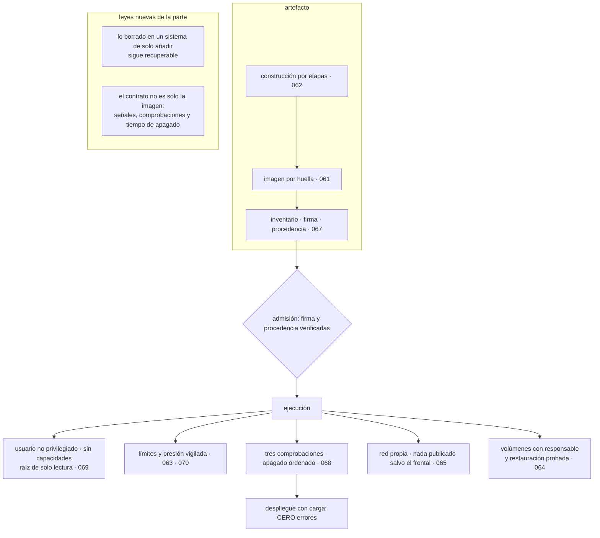

# 072 — Proyecto: stack OCI endurecido y observable

> [← 071 · Migración de una aplicación legacy a contenedores](../../part-05-containers-docker-oci/071-migracion-de-una-aplicacion-legacy-a-contenedores/README.md) · [Índice de la parte](../README.md) · [073 · API server, etcd, scheduler, controllers y kubelet →](../../part-06-kubernetes-managed-platforms/073-api-server-etcd-scheduler-controllers-y-kubelet/README.md)

**Parte:** 05 — Contenedores, Docker y OCI<br>
**Nivel:** intermedio · **Horas estimadas:** 8<br>
**Laboratorio:** `capstone` · **Estado:** `EXECUTABLE_CORE`

## 🎯 Propósito

Integrar las once clases anteriores en una pila de contenedores endurecida, observable y demostrable, y **calificar la hipótesis que escribió la clase 060**. Esta vez la predicción acertó en las tres afirmaciones, incluida la lista exacta de las cuatro fugas — y quedó corta en la última: no reapareció una de las diez leyes, reaparecieron cuatro. De ese exceso salen las dos leyes nuevas que esta parte añade al programa, y una de ellas explica de golpe cuatro incidentes de cuatro clases distintas.

## 📚 Resultados de aprendizaje

Al finalizar podrás:

1. **Trazar** cada decisión de la pila hasta la clase que la tomó y la alternativa descartada.
2. **Calificar** la hipótesis de la clase 060 con evidencia, incluida la parte en que se quedó corta.
3. **Enunciar** las dos leyes que esta parte añade, con las apariciones que las respaldan.
4. **Provocar** tres fallos propios de contenedores y medir detección, impacto y recuperación.
5. **Entregar** un guion de verificación que demuestre cada afirmación de la línea base.

## 🧩 Conceptos centrales

| Concepto | Comprensión verificable |
|---|---|
| `sistema de solo añadir` | Almacén en el que escribir no sustituye: acumula. Lo «borrado» sigue siendo recuperable, y esa propiedad ha producido cuatro incidentes en cuatro clases distintas del programa. |
| `contrato aplicación-plataforma` | Lo que la plataforma espera del proceso más allá de la imagen: qué señales entiende, qué responde en cada comprobación y cuánto tarda en irse. No está en ninguna especificación OCI. |
| `fuga del contrato` | Punto donde la portabilidad del contenedor deja de valer. La clase 060 predijo cuatro y las cuatro produjeron incidentes: almacenamiento, red, identidad y ciclo de vida. |
| `prueba negativa de endurecimiento` | Comprobación cuyo éxito es que falle. Es la única evidencia aceptable de un control, y esta parte añade cinco a las doce de la parte 04. |
| `presión por recurso` | Tiempo perdido esperando, por grupo de control. Es la señal que detecta antes los tres incidentes de esta parte que la utilización no muestra. |
| `hipótesis calificada` | Predicción evaluada después con datos, incluida la parte errónea o incompleta. La de la clase 060 acertó y se quedó corta, y lo segundo es lo que aporta. |

## 🧠 Modelo mental

Una imagen es un artefacto inmutable; un contenedor es un proceso aislado con límites y dependencias explícitas, no una máquina virtual pequeña.

Aplicado a esta clase, separa siempre cuatro planos: **intención** (qué necesita el usuario),
**configuración** (qué declaramos), **estado observado** (qué existe de verdad) y
**evidencia** (cómo sabemos que cumple). Confundirlos produce diseños que se ven correctos
en un diagrama pero fallan al operar.

## 🗺️ Flujo de razonamiento



## 📖 Desarrollo

### 1. La pila entregada y de dónde sale cada decisión

Doce decisiones, cada una con su alternativa descartada y la trampa concreta que evita:

| Decisión | Requisito | Alternativa descartada | Trampa que evita |
|---|---|---|---|
| Despliegue por huella | Saber qué se ejecuta (061) | Etiqueta `v8` | Dos versiones en producción sin desplegar |
| Índice para varias arquitecturas | Flota mixta (061) | Construir en el portátil | `exec format error` en media flota |
| Construcción por etapas | Superficie (062) | Una sola etapa | Intérprete y compilador disponibles para un atacante |
| Montaje de secreto | Sin rastro (062) | `COPY` y borrar | Token extraíble de la capa once semanas |
| Construir una vez y promover | Que lo probado sea lo desplegado (062) | Una imagen por entorno | Fallo que solo se da en producción |
| Límite de memoria siempre | Radio de impacto (063) | Sin límite | El núcleo elige víctima entre todos los vecinos |
| Paralelismo acorde a la cuota | Rendimiento (063) | Valor por defecto | 32 % de periodos limitados con CPU al 38 % |
| Volumen con responsable y restauración probada | Datos (064) | Copia sin ensayar | Copia que no restaura, descubierto en el peor momento |
| Nada publicado salvo el frontal | Exposición (065) | Publicar por comodidad | Base de datos en internet con el cortafuegos activo |
| Firma verificada en la admisión | Origen (067) | Solo firmar | Dos imágenes sin firma válida en producción |
| Tres comprobaciones separadas | Continuidad (068) | Una sola | Fallo ajeno de 38 s convertido en 11 min propios |
| Sin capacidades, sin privilegios, raíz de solo lectura | Contención (069) | Valores por defecto | Una ejecución de código convertida en acceso al anfitrión |

Y tres decisiones tomadas **en contra** de lo que sugiere el hábito, que son las que un revisor cuestionará:

```text
1. La imagen final no tiene intérprete de órdenes, aunque impida `exec`.
   La depuración se resuelve con un contenedor efímero (070), y a cambio
   desaparece una familia entera de cadenas de explotación (062, 069).

2. Al recibir la señal de parada, lo primero que hace el proceso es ESPERAR.
   Es contraintuitivo y es lo que elimina los errores de cada despliegue (068).

3. Compose se conserva en producción para dos servicios, por decisión escrita.
   La alternativa —migrarlo todo— no estaba justificada por su criticidad,
   y lo que sí se corrigió fue el acuerdo de servicio que prometía de más (066).
```

La tercera es la más incómoda de defender y la más honesta: **no todo tiene que migrarse, y lo que no se migra tiene que estar decidido en vez de heredado**.

### 2. La hipótesis de la clase 060, calificada

La clase 060 dejó escrito:

> El contrato del contenedor será portable de verdad y las fugas estarán en los bordes —almacenamiento, red, identidad, arranque y terminación—. Volverá a aparecer al menos una de las diez leyes, con un mecanismo nuevo.

**Afirmación 1 — el contrato es portable. CIERTA, y comprobable.**

La misma huella se ejecutó sin cambios en cinco entornos:

```text
portátil con Docker                     ✓
agente de canalización sin privilegios  ✓
plataforma gestionada de AWS            ✓
Container Apps de Azure                 ✓
Cloud Run de Google Cloud               ✓
```

Lo que se conservó intacto: la imagen, el punto de entrada, las variables, el puerto y las señales. Es exactamente la lista que la hipótesis nombró, y es la razón por la que las tres nubes convergieron sin coordinarse.

**Afirmación 2 — las fugas están en los bordes. CIERTA, y la lista era exacta.**

Las cuatro produjeron incidentes, una por clase:

```text
almacenamiento   uid que no coincide, capa de escritura lenta,
                 montaje en memoria contra el límite            064
red              publicación que elude el cortafuegos,
                 unidad máxima, caché de resolución              065
identidad        usuario cero, capacidades, modo privilegiado,
                 secretos en el entorno                          069
ciclo de vida    proceso 1 que ignora señales, ventana de
                 retirada, plazo mal calculado                   068
```

Ninguna de las cuatro está en la especificación OCI, que es precisamente lo que la hipótesis predecía.

**Afirmación 3 — reaparecerá al menos una de las diez leyes. CIERTA, y CORTA.**

Reaparecieron cuatro, cada una con un mecanismo nuevo:

```text
ley 3 · agotamiento de puertos de traducción
  quinta aparición: publicación de puertos y tabla de seguimiento
  de conexiones llena                                    065, 070

ley 4 · el caudal es el mínimo de dos límites
  el contenedor ve el hardware del anfitrión y su tiempo de
  ejecución se dimensiona con esa información                  063

ley 7 · la dependencia caída es funcionamiento normal
  quinta aparición: `depends_on` con condición de salud resuelve
  el arranque y no la vida                                066, 068

ley 2 · el gobierno guarda la puerta y no limpia la casa
  firmar sin verificar: dos imágenes sin firma en producción    067
```

Cuatro de diez, sin buscarlas. Que la predicción se quedara corta es el dato interesante: **las leyes no reaparecen a veces, reaparecen sistemáticamente**, porque describen propiedades del problema y no del proveedor ni de la tecnología.

### 3. Dos leyes nuevas, con sus apariciones

De los incidentes de esta parte salen dos comportamientos que cumplen el criterio del programa —observados de forma independiente en varias implementaciones— y que merecen añadirse a las diez de la clase 060.

**Ley 11. Lo que un sistema de solo añadir «borra» sigue siendo recuperable.**

Cuatro apariciones, en cuatro clases distintas y con cuatro mecanismos que no comparten nada:

```text
historial de despliegues de ARM        un secreto en una salida queda
                                       en todas las entradas anteriores      047
estado de Terraform                    guarda en claro todo lo que pasó
                                       por un recurso                        059
capas de una imagen                    `rm` en una capa posterior tapa,
                                       no elimina                            061
historial de construcción              las órdenes ejecutadas viajan
                                       dentro de la configuración            062
```

Y la consecuencia operativa es siempre la misma, con el mismo orden obligatorio:

```text
1. rotar el secreto: estuvo expuesto, punto
2. corregir el mecanismo
3. purgar el histórico si el sistema lo permite
```

Invertir el orden —corregir primero y rotar «cuando haya tiempo»— deja la credencial válida en un sitio recuperable. Este programa ha aplicado ese orden cuatro veces y merece estar escrito como norma.

**Ley 12. El contrato entre aplicación y plataforma no es solo la imagen.**

Incluye tres cosas que ninguna especificación normaliza:

```text
qué señales entiende el proceso y qué hace con ellas
qué responde en cada una de las tres comprobaciones
cuánto tarda en irse, y qué hace mientras tanto
```

Apariciones, con tres mecanismos distintos:

```text
el proceso 1 no recibe manejadores por defecto: la señal no hace nada   063
vivacidad y disponibilidad confundidas: un fallo ajeno reinicia todo    068
la señal y la retirada de tráfico ocurren en paralelo: hay ventana      068
Compose espera al arranque y no a la disponibilidad                     066
```

Esta ley es la que explica por qué una aplicación puede estar perfectamente contenerizada y aun así producir errores en cada despliegue: **la imagen es portable y el comportamiento del proceso ante la plataforma es un contrato aparte**, que hay que escribir, verificar y medir.

Y una observación sobre las doce leyes en conjunto que conviene llevarse a la parte 06: **ninguna es un defecto de una tecnología**. Todas son consecuencias de problemas reales —traducción de direcciones, límites de recursos, entrega no fiable, almacenamiento incremental, terminación de procesos— que cualquier implementación tiene que resolver de alguna manera. Por eso reaparecen, y por eso la lista es un cuestionario útil para la tecnología siguiente.

### 4. Tres fallos provocados y lo que enseñó cada uno

**Fallo 1 — llenar el disco del nodo.** Se escribe hasta agotar el sistema de ficheros del anfitrión.

```text
detección por presión de E/S            40 s
contenedores afectados                  todos los del nodo
recuperación tras liberar espacio       2 min 10 s
```

**Y el hallazgo:** el contenedor que llenó el disco **no fue el que dejó de funcionar primero**. Los registros del motor no tenían límite de rotación, así que el servicio más locuaz consumió el espacio y el primero en fallar fue otro, que intentaba escribir su montaje en memoria — que también se contabiliza contra el nodo cuando este se queda sin memoria para respaldarlo.

```text
síntoma observable   un servicio falla; el culpable sigue funcionando
causa                registros sin límite de rotación en el motor
corrección           límite de tamaño y número de ficheros por contenedor,
                     alerta sobre espacio del nodo al 75 %,
                     y presión de E/S del nodo en el panel (070)
```

**Fallo 2 — desplegar bajo carga sin apagado ordenado.** Se revierte temporalmente la corrección de la clase 068 para medir su valor.

```text                          sin apagado ordenado   con apagado ordenado
errores durante el despliegue          412                    0
peticiones cortadas                     17                    0
duración del despliegue             7 min 20 s            1 min 05 s
```

**Y el hallazgo:** la medición se hizo sobre el camino HTTP y el equipo dio el resultado por bueno. Al repetirla mirando también el camino asíncrono aparecieron **94 mensajes reentregados** por despliegue que la primera medición no veía, porque los consumidores no tienen peticiones que contar.

```text
corrección   el criterio de "cero errores en despliegue" se amplía:
             cero errores HTTP y cero reentregas de mensajes
```

Es la misma lección que la clase 060 dejó con el SLI del camino asíncrono, con un mecanismo nuevo: **lo que no tiene métrica propia no aparece en la verificación**.

**Fallo 3 — ejecutar código dentro de un contenedor.** Se simula la consecuencia de una vulnerabilidad de dependencia, comparando la configuración anterior con la endurecida.

```text                                   antes (parte 05)     después
leer ficheros de otros en el volumen        posible          denegado
escribir un binario en la raíz              posible          denegado
escalar a usuario cero                      posible          denegado
leer secretos del entorno                   posible          denegado
alcanzar la base de datos por red           posible          posible  ←
```

**Y el hallazgo:** la última fila. El endurecimiento del proceso no acota la red, y el contenedor comprometido seguía pudiendo hablar con todo lo que su servicio hablaba. Con las credenciales montadas como fichero, un atacante dentro del proceso las lee igual que la aplicación — que es exactamente el límite que la clase 069 declaró y que el simulacro confirmó.

```text
corrección   segmentación de red entre servicios, con la disciplina
             de las clases 039, 051 y 065
lo que NO se corrige aquí   un atacante con el mismo usuario que la
             aplicación lee lo que la aplicación puede leer;
             eso se acota con privilegio mínimo del secreto y
             duración corta (058), no con endurecimiento del proceso
```

Y un cuarto hallazgo transversal, que apareció al preparar los simulacros: **el contenedor de diagnóstico de la clase 070 no estaba sujeto a ninguna política de admisión**. Tenía herramientas de red, capacidad de inspeccionar procesos y ninguna restricción. Era el hueco más grande que quedaba, y lo había abierto la propia clase que enseñaba a diagnosticar.

```text
corrección   imagen de diagnóstico firmada y en la lista de la política,
             uso registrado, y disponible solo mediante una concesión
             temporal como la de la clase 046
```

### 5. La entrega y la pregunta que abre la parte 06

**La entrega, sin conocimiento tácito.**

```text
imágenes            construidas por etapas, con inventario, firma y procedencia
despliegue          por huella, con admisión que verifica ambas cosas
línea base          22 afirmaciones, cada una con su prueba negativa
verificar.sh        ejecuta las 22 y devuelve código de salida
Compose             fichero único con superposición por entorno
ADR                 12 decisiones con su alternativa descartada
riesgos residuales  4, con responsable y condición de revisión
procedimientos      3 fallos ensayados, con verificación posterior
panel               6 señales de grupo de control, incluidas las de presión
línea base medida   rendimiento, arranque, apagado y coste
```

Los **cuatro riesgos residuales**:

```text
1. dos servicios permanecen en Compose en una sola máquina, por decisión escrita
2. sin espacios de nombres de usuario en producción: la plataforma no los soporta
3. un contenedor con el filtro de llamadas relajado, documentado y con revisión
4. un atacante con el usuario de la aplicación lee lo que ella lee:
   se acota con duración del secreto, no con endurecimiento
```

**La comparación con el punto de partida**, medida con el mismo método:

```text                                        antes         después
construcción en agente efímero              11 min 20 s   1 min 30 s
tamaño de la imagen                            1,2 GB       148 MB
vulnerabilidades críticas y corregibles           41            3
secretos extraíbles de las capas                   1            0
errores por despliegue                        300-900          0
duración del apagado por contenedor            30,2 s       1,1 s
contenedores como usuario cero                 9 de 11      0 de 11
puertos publicados hacia todas las interfaces      4            1
volúmenes con restauración probada             0 de 4       1 de 1
tiempo hasta un diagnóstico de recursos          horas      < 1 hora
pruebas negativas ejecutadas                    0 de 22     22 de 22
```

Y una cifra que resume la parte: **de las once clases, nueve produjeron al menos un incidente que llevaba meses ocurriendo sin que nadie lo tratara como tal**. Los errores de cada despliegue, la base de datos publicada, el escáner desactivado, el token en la capa, las credenciales en cada excepción. Ninguno era nuevo; lo nuevo fue tener una comprobación que los nombrara.

**Y la pregunta que abre la parte 06.**

Esta parte deja una pila que funciona en una máquina y que no resuelve lo que la clase 066 enumeró: no reubica, no despliega sin corte, no reparte carga y no decide si el conjunto sirve. Eso es lo que hace un orquestador, y la pregunta correcta no es qué hace sino **qué se lleva y qué devuelve**:

> De las cuatro fugas de esta parte —almacenamiento, red, identidad y ciclo de vida—, ¿cuántas resuelve Kubernetes y cuántas se limita a renombrar? ¿Y qué problema nuevo introduce el hecho de que su modelo sea declarativo y su consistencia, eventual?

La hipótesis que se escribe ahora, para poder equivocarse de forma comprobable:

> Kubernetes resolverá la reubicación, el despliegue progresivo y el reparto de carga, y **no resolverá ninguna de las cuatro fugas**: les dará un nombre propio —reclamación de volumen, servicio y política de red, cuenta de servicio, comprobaciones y ciclo de vida— y devolverá a la aplicación exactamente las mismas obligaciones. Y aparecerá una ley nueva propia de su modelo: **que un objeto esté aceptado no significa que esté funcionando**, y la distancia entre ambas cosas será la causa de sus incidentes característicos.

La parte 06 la califica.

## 🔬 Ejemplo trabajado

**Entrega del capstone de la parte 05, con las cifras que se llevan a la parte 06.**

**Verificación completa.** Las 22 afirmaciones de la línea base:

```bash
$ ./verificar.sh
✓ despliegue por huella, no por etiqueta       0 etiquetas en manifiestos
✓ índice con las dos arquitecturas             amd64 + arm64
✓ imagen sin intérprete de órdenes             executable file not found
✓ ningún secreto en las capas                  0 coincidencias
✓ ninguna variable de entorno con secreto      0 coincidencias
✓ una sola imagen por commit                   huella idéntica en 4 entornos
✓ firma verificada por identidad acotada       ok, y sin firma → rechazada
✓ procedencia del repositorio esperado         ok, y ajena → rechazada
✓ inventario de componentes adjunto            14 de 14 imágenes
✓ escáner activo: crítico y corregible         3 hallazgos, 3 con excepción
✓ usuario numérico distinto de cero            11 de 11
✓ todas las capacidades retiradas              11 de 11
✓ raíz de solo lectura                         11 de 11
✓ sin modo privilegiado                        0 contenedores
✓ sin socket del motor montado                 0 contenedores
✓ límites de memoria en todos                  11 de 11
✓ paralelismo acorde a la cuota                nr_throttled < 1 %
✓ nada publicado salvo el frontal              1 puerto, en bucle local
✓ unidad máxima verificada en la red           1400, ping -M do correcto
✓ apagado en menos de 2 s                      1,1 s medidos
✓ despliegue con carga: cero errores           0 HTTP, 0 reentregas
✓ restauración de volumen verificada           1.284.391 filas · 2 h 40 min
22/22 correctas
```

**Línea base medida:**

```text
rps 982,4 · p50 40,1 ms · p95 93,8 ms · p99 199,4 ms · errores 0
construcción en agente efímero        1 min 30 s
despliegue completo                   1 min 05 s
apagado por contenedor                1,1 s
vuelta atrás (cambio de huella)       22 s
costo mensual de la pila              791 USD
```

**Los tres fallos, con lo aprendido en cada uno:**

```text                        detección   impacto real            lección
disco del nodo lleno            40 s      un servicio caído,      el culpable no
                                          y NO era el culpable    es el primero
                                                                  que falla

despliegue sin apagado          —         412 errores HTTP        lo que no tiene
  ordenado                                + 94 reentregas         métrica propia no
                                          que no se medían        aparece en la
                                                                  verificación

código ejecutado dentro         —         contenido del           el endurecimiento
  del contenedor                          contenedor, y el        del proceso no
                                          alcance de RED intacto  acota la red
```

**El hallazgo que justificó el capstone.** Al preparar los simulacros, la comprobación de la política de admisión dio un resultado inesperado:

```bash
$ kubectl auth can-i create pods --subresource=ephemeralcontainers --as=$USUARIO
yes
$ kubectl debug -it tienda-7f4c9 --image=cualquier/imagen --target=tienda
# … arranca sin pasar por la verificación de firma
```

**El contenedor de diagnóstico de la clase 070 no pasaba por ninguna política.** Podía ser cualquier imagen, de cualquier registro, con herramientas de red y capacidad de inspeccionar procesos, dentro del espacio de nombres de un servicio de producción.

```text
síntoma observable   ninguno: todas las demás comprobaciones en verde
consecuencia real    el mecanismo de diagnóstico era el hueco más grande
causa                la política cubría los contenedores del despliegue
                     y no los efímeros
qué lo destapó       preparar el simulacro, no ejecutarlo
```

Corregido y verificado:

```text                                        antes            después
imágenes permitidas en diagnóstico       cualquiera      1, firmada y en la lista
quién puede usarlo                    9 personas        2, con concesión temporal
uso registrado                             no          sí, en la auditoría
prueba negativa                          ninguna    imagen ajena → rechazada  ✓
```

Es la sexta aparición en el programa de la familia de fallos que la clase 060 identificó como la más cara — un mecanismo que parece estar protegiendo y no cubre lo que se cree — y la primera en la que **el hueco lo abrió una buena práctica de una clase anterior**.

**Se entrega a la parte 06 con:**

```text
doce leyes observadas, dos de ellas nuevas de esta parte
cuatro fugas del contrato del contenedor, nombradas y con incidente propio
22 afirmaciones y su guion de verificación
12 decisiones con alternativa descartada
4 riesgos residuales con responsable
línea base de rendimiento, construcción, despliegue y apagado
```

Y la hipótesis escrita para la parte 06:

> Kubernetes resolverá reubicación, despliegue progresivo y reparto de carga, y no resolverá ninguna de las cuatro fugas: las renombrará y devolverá a la aplicación las mismas obligaciones. Su ley nueva será que **aceptado no es funcionando**.

**La lección que esta parte deja al programa**: la hipótesis de la clase 060 acertó en todo y se quedó corta en la magnitud — predijo que reaparecería una ley y reaparecieron cuatro. Eso cambia cómo hay que usar la lista: no es un resumen de lo aprendido, es **un cuestionario que se le hace a cada tecnología nueva**, y su rendimiento es tan alto que conviene aplicarlo antes de tener incidentes en vez de después. De las once clases de esta parte, nueve destaparon un problema que llevaba meses ocurriendo, y ninguno era nuevo: lo nuevo fue tener una comprobación que lo nombrara.

## 🧪 Laboratorio guiado

Ejecuta desde la raíz:

```bash
python classes/part-05-containers-docker-oci/072-proyecto-stack-oci-endurecido-y-observable/lab.py
```

El laboratorio selecciona el motor de práctica **`capstone`** y produce
`lab_result.json`. El escenario, sus comprobaciones y el artefacto esperado corresponden a
esta clase; no requiere credenciales y deja explícito qué debe revalidarse en un sandbox real.

1. Lee `exercise.steps` y formula una predicción antes de ejecutar.
2. Ejecuta la práctica y verifica todos los elementos de `checks`.
3. Provoca el caso de `negative_test` y explica la señal observada.
4. Materializa `plataforma-contenedores` en `evidence/` usando la plantilla indicada.
5. Para proveedor real, sigue `sandbox.requires`, registra costo y ejecuta `destroy`.

### Evidencia esperada

El artefacto principal es un incremento integrado, demostrable y documentado. Además, la entrega debe incluir el comando ejecutado,
la salida estructurada y una conclusión que no exceda lo observado.

## 🏆 Reto verificable

Construye **`plataforma-contenedores`** para el caso CloudShop. Incluye una alternativa descartada,
un supuesto que pueda falsarse, una prueba de fallo y una decisión de rollback.

## ✅ Criterio de aceptación

- [ ] `lab.py` termina con código 0 y genera JSON válido.
- [ ] La entrega conecta al menos tres requisitos con mecanismos verificables.
- [ ] Existe una prueba positiva y una prueba negativa con evidencia.
- [ ] Seguridad, costo y operación aparecen como decisiones, no como anexos.
- [ ] Se declara una limitación y una condición que obligaría a revisar el diseño.
- [ ] Otra persona puede repetir el recorrido sin conocimiento tácito.

## ⚠️ Errores frecuentes

| Síntoma | Causa probable | Corrección |
|---|---|---|
| Un servicio falla cuando el disco del nodo se llena, y no es el que lo llenó | Los registros del motor no tienen límite de rotación y el espacio es un recurso compartido del nodo | Límite de tamaño y número de ficheros por contenedor, alerta de espacio del nodo y presión de E/S en el panel. |
| La verificación del despliegue da cero errores y hay trabajo duplicado | Solo se mide el camino HTTP; el asíncrono no tiene peticiones que contar | Amplía el criterio: cero errores HTTP y cero reentregas de mensajes durante el despliegue. |
| Un contenedor endurecido sigue alcanzando servicios que no le corresponden | El endurecimiento acota el proceso, no la red | Segmenta la red entre servicios; los tres niveles —imagen, proceso y red— son necesarios y ninguno sustituye a otro. |
| El mecanismo de diagnóstico se salta la política de admisión | La política cubría los contenedores del despliegue y no los efímeros | Incluye la imagen de diagnóstico en la lista firmada, restringe quién puede usarla y registra su uso. |
| Un secreto corregido sigue siendo recuperable semanas después | Vivía en un sistema de solo añadir: historial, estado o capa | Rota primero, corrige después y purga el histórico si el sistema lo permite; el orden no es negociable. |
| La aplicación está bien contenerizada y cada despliegue produce errores | El contrato con la plataforma —señales, comprobaciones y tiempo de apagado— no está escrito ni verificado | Trátalo como parte del contrato: manejador declarado, tres comprobaciones separadas y despliegue con carga medido. |

## 🛡️ Seguridad, ética y costo

Trabaja con cuentas propias o sandboxes autorizados. No publiques secretos, identificadores
reales ni datos personales. Antes de crear recursos pagos define presupuesto, etiquetas y
comando de destrucción; después verifica que no queden recursos huérfanos. Los ejemplos
locales enseñan contratos, pero no certifican cumplimiento ni disponibilidad de producción.

## ❓ Preguntas de comprobación

1. ¿En qué acertó y en qué se quedó corta la hipótesis de la clase 060, y por qué lo segundo es más útil?
2. Enuncia la ley del sistema de solo añadir y cita sus cuatro apariciones con mecanismos distintos.
3. ¿Qué tres cosas incluye el contrato entre aplicación y plataforma que no están en ninguna especificación OCI?
4. Al llenar el disco del nodo falló un servicio que no era el culpable. ¿Por qué, y qué señal lo habría mostrado?
5. ¿Por qué el hueco de seguridad mayor que quedaba lo había abierto una buena práctica de una clase anterior?

## 🔗 Referencias

- Open Container Initiative (2025). *Specifications overview* — qué normaliza el conjunto y qué queda fuera. <https://opencontainers.org/release-notices/overview/>
- NIST (2022). *SP 800-190: Application Container Security Guide* — riesgos por capa y contramedidas. <https://csrc.nist.gov/pubs/sp/800/190/final>
- CNCF (2025). *Software Supply Chain Best Practices* — inventario, firma, procedencia y verificación. <https://github.com/cncf/tag-security/blob/main/community/resources/software-supply-chain-security/secure-software-factory/Secure_Software_Factory_Whitepaper.pdf>
- Linux (2025). *Pressure Stall Information* — señales de saturación por recurso y por grupo de control. <https://docs.kernel.org/accounting/psi.html>
- Google (2018). *The Site Reliability Workbook*, cap. 15 — simulacros de fallo y lo que se aprende de cada uno. <https://sre.google/workbook/postmortem-culture/>
- Documentación oficial vigente del servicio implementado; registra URL y fecha de consulta.

---

> [Evaluación](assessment.md) · [Contrato de clase](lesson.yaml) · [Índice de la parte](../README.md)

**📥 Descargar:** [Parte 05 en PDF](../../../site/downloads/partes/manual-parte-05-containers-docker-oci.pdf) · [Manual integral](../../../site/downloads/multi-cloud-engineering-manual-v2.0.pdf)

| Anterior | Índice | Siguiente |
|---|---|---|
| [← 071 · Migración de una aplicación legacy a contenedores](../../part-05-containers-docker-oci/071-migracion-de-una-aplicacion-legacy-a-contenedores/README.md) | [Parte 05](../README.md) · [Programa](../../README.md) | [073 · API server, etcd, scheduler, controllers y kubelet →](../../part-06-kubernetes-managed-platforms/073-api-server-etcd-scheduler-controllers-y-kubelet/README.md) |
