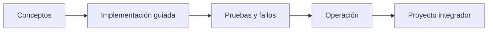

# Parte 05 — Contenedores, Docker y OCI

> [← Parte 04](../part-04-gcp-core-platform/README.md) · [Índice completo](../README.md) · [Parte 06 →](../part-06-kubernetes-managed-platforms/README.md)

**📥 Descargar:** [Esta parte en PDF](../../site/downloads/partes/manual-parte-05-containers-docker-oci.pdf) · [Manual integral](../../site/downloads/multi-cloud-engineering-manual-v2.0.pdf)

**Nivel:** intermedio · **Clases:** 12 · **Duración sugerida:** 6–8 semanas

Empaquetar servicios portables, observables y endurecidos.

## Resultados de la parte

Al completar esta parte podrás explicar el dominio con lenguaje independiente del proveedor,
implementar sus mecanismos esenciales, diagnosticar fallos y defender decisiones mediante
evidencia, costo, seguridad y objetivos de confiabilidad.

## Modelo mental

Una imagen es un artefacto inmutable; un contenedor es un proceso aislado con límites y dependencias explícitas, no una máquina virtual pequeña.

## Secuencia

## Clases

| ID | Clase | Laboratorio | Horas |
|---:|---|---|---:|
| 061 | [Imágenes, capas, registros y estándar OCI](061-imagenes-capas-registros-y-estandar-oci/README.md) | `container` | 4 |
| 062 | [Dockerfile reproducible y builds multi-stage](062-dockerfile-reproducible-y-builds-multi-stage/README.md) | `container` | 4 |
| 063 | [Namespaces, cgroups y runtime de contenedores](063-namespaces-cgroups-y-runtime-de-contenedores/README.md) | `container` | 4 |
| 064 | [Volúmenes, bind mounts y persistencia](064-volumenes-bind-mounts-y-persistencia/README.md) | `storage` | 4 |
| 065 | [Redes bridge, DNS interno y publicación de puertos](065-redes-bridge-dns-interno-y-publicacion-de-puertos/README.md) | `network` | 4 |
| 066 | [Docker Compose y aplicaciones multiservicio](066-docker-compose-y-aplicaciones-multiservicio/README.md) | `orchestration` | 4 |
| 067 | [Registros, SBOM, firma y procedencia de imágenes](067-registros-sbom-firma-y-procedencia-de-imagenes/README.md) | `supply-chain` | 4 |
| 068 | [Límites, health checks y apagado ordenado](068-limites-health-checks-y-apagado-ordenado/README.md) | `reliability` | 4 |
| 069 | [Rootless, capabilities, seccomp y secretos](069-rootless-capabilities-seccomp-y-secretos/README.md) | `security` | 4 |
| 070 | [Diagnóstico de CPU, memoria, red y filesystem](070-diagnostico-de-cpu-memoria-red-y-filesystem/README.md) | `observability` | 4 |
| 071 | [Migración de una aplicación legacy a contenedores](071-migracion-de-una-aplicacion-legacy-a-contenedores/README.md) | `migration` | 4 |
| 072 | [Proyecto: stack OCI endurecido y observable](072-proyecto-stack-oci-endurecido-y-observable/README.md) | `capstone` | 8 |

## Evaluación de la parte

- 35 % laboratorios y evidencia reproducible.
- 25 % retos verificables.
- 20 % decisiones y ADR.
- 10 % seguridad, confiabilidad y costo.
- 10 % proyecto integrador de la parte.

Se aprueba con 80 % de clases en nivel B o superior y el proyecto integrador reproducible.

## Pauta bibliográfica

- Docker Deep Dive — Nigel Poulton.
- Container Security — Liz Rice.
- Cloud Native Patterns — Cornelia Davis.
