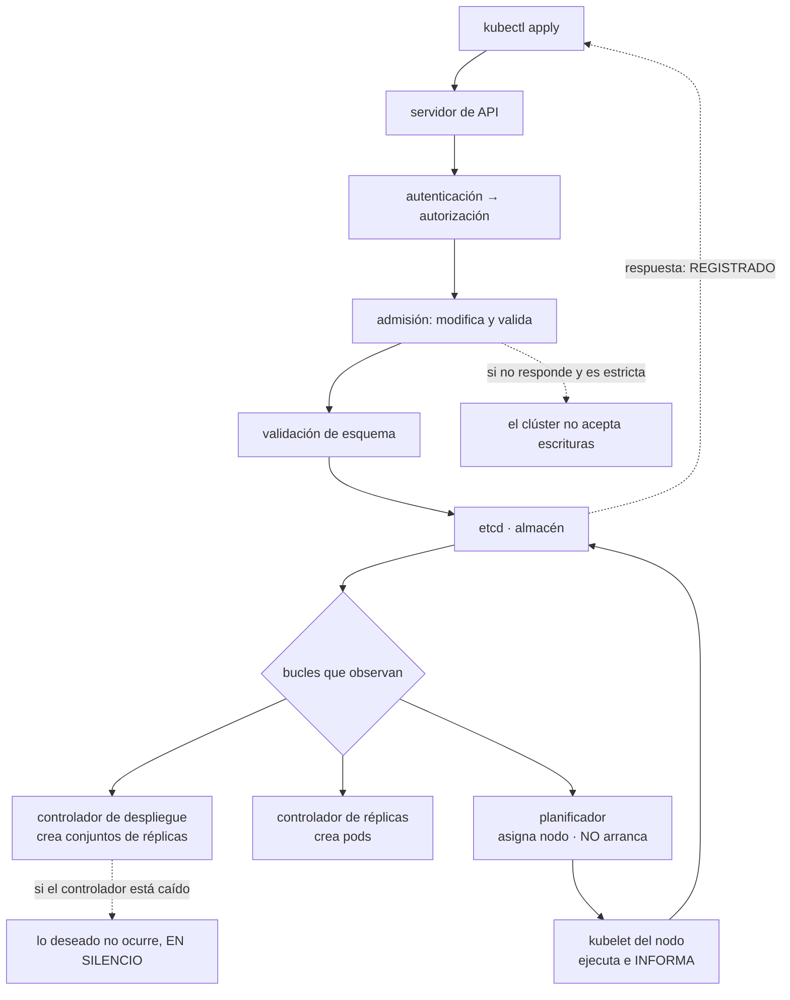

# 073 — API server, etcd, scheduler, controllers y kubelet

> [← Clase anterior](../../part-05-containers-docker-oci/072-proyecto-stack-oci-endurecido-y-observable/README.md) · [Índice de la parte](../README.md) · [Clase siguiente →](../../part-06-kubernetes-managed-platforms/074-pods-replicasets-deployments-y-jobs/README.md)

**Parte:** 06 — Kubernetes y plataformas administradas<br>
**Nivel:** intermedio-avanzado · **Horas estimadas:** 4<br>
**Laboratorio:** `kubernetes` · **Estado:** `EXECUTABLE_CORE`

## 🎯 Propósito

Entender Kubernetes por su mecanismo y no por su catálogo de objetos, porque de ese mecanismo salen todos sus comportamientos característicos: **es una base de datos con bucles de reconciliación alrededor**. Escribir en ella devuelve «registrado», nunca «funcionando», y esa distancia entre lo aceptado y lo real es exactamente la ley nueva que la clase 072 predijo. La clase muestra el camino completo de una escritura, quién hace qué en cada bucle, y cómo se diagnostica un bucle que no avanza.

## 📚 Resultados de aprendizaje

Al finalizar podrás:

1. **Describir** el camino de una escritura desde el cliente hasta el almacén, y qué significa exactamente la respuesta.
2. **Explicar** por qué la reconciliación por nivel hace robusto al sistema y a la vez consistente solo con el tiempo.
3. **Atribuir** un estado atascado al bucle concreto que no avanza, con la señal de cada uno.
4. **Anticipar** el efecto de que un controlador o un complemento de admisión deje de estar disponible.
5. **Operar** el almacén de estado sabiendo qué lo deja en solo lectura y qué significa su copia de seguridad.

## 🧩 Conceptos centrales

| Concepto | Comprensión verificable |
|---|---|
| `reconciliación por nivel` | El controlador compara el estado deseado con el observado y actúa, en vez de reaccionar a sucesos. Perder un aviso no rompe nada: en la vuelta siguiente vuelve a comparar. |
| `aceptado frente a funcionando` | La respuesta de la API significa que el objeto está **almacenado y es válido**. No dice nada sobre si existe algo ejecutándose. |
| `complemento de admisión` | Código que puede modificar o rechazar una petición antes de guardarla. Si no está disponible y su política es estricta, **el clúster deja de aceptar escrituras**. |
| `planificador` | Filtra nodos, los puntúa y escribe el elegido en el objeto. **No arranca nada**: su trabajo termina asignando. |
| `kubelet` | El único componente que ejecuta contenedores. Observa lo asignado a su nodo, lo ejecuta y **informa** del estado. |
| `estado informado` | El campo de estado lo escribe quien observa, con retraso. Un nodo caído sigue figurando como sano durante decenas de segundos. |

## 🧠 Modelo mental

Kubernetes es un sistema de reconciliación: declaras estado deseado y controladores reducen continuamente la diferencia con el estado observado.

Aplicado a esta clase, separa siempre cuatro planos: **intención** (qué necesita el usuario),
**configuración** (qué declaramos), **estado observado** (qué existe de verdad) y
**evidencia** (cómo sabemos que cumple). Confundirlos produce diseños que se ven correctos
en un diagrama pero fallan al operar.

## 🗺️ Flujo de razonamiento



## 📖 Desarrollo

### 1. Una base de datos con bucles alrededor

Kubernetes se explica mal como «un orquestador de contenedores» porque esa descripción no permite predecir nada. La descripción que sí lo permite es otra:

```text
un almacén de objetos con validación
+ un conjunto de bucles que comparan lo deseado con lo observado
  y actúan para acercarlos
```

Todo lo demás se deduce de ahí. Un despliegue no «lanza» contenedores: escribe un objeto, y un controlador que lo observa crea otro objeto, y otro controlador crea pods, y el planificador les asigna nodo, y el kubelet de cada nodo los ejecuta. **Cinco bucles, cinco objetos, ninguna llamada directa entre componentes.**

```text
Deployment  →  ReplicaSet  →  Pod  →  (asignado)  →  contenedor en ejecución
  controlador   controlador    planificador          kubelet
  de despliegue de réplicas
```

Esa cadena explica por qué el diagnóstico consiste siempre en preguntar **qué eslabón no avanzó**.

Y la propiedad que hace robusto al sistema es que los bucles funcionan **por nivel**, no por suceso:

```text
por suceso   "ha ocurrido X, reacciono"
             si se pierde el aviso, la acción no se hace nunca
por nivel    "esto es lo que debería haber; esto es lo que hay; actúo"
             si se pierde un aviso, la vuelta siguiente lo corrige
```

De ahí sale la resistencia característica: un controlador puede reiniciarse, perder conexión durante minutos y volver, y el sistema converge igualmente porque no depende de haber visto nada. Y de ahí sale también su contrapartida, que es la ley que esta parte tenía que comprobar: **la convergencia lleva tiempo, y durante ese tiempo lo aceptado y lo real no coinciden**.

La demostración cabe en dos órdenes:

```bash
$ kubectl apply -f despliegue.yaml
deployment.apps/tienda created                 ← esto significa: ALMACENADO

$ kubectl get pods -l app=tienda
No resources found                             ← todavía no existe nada
```

La primera respuesta es correcta y no dice nada sobre contenedores. Es la diferencia que la clase 072 predijo, y merece enunciarse como norma de operación:

> **Una canalización que da por bueno un despliegue porque `apply` devolvió éxito no ha verificado nada.** Lo que verifica es esperar a la convergencia y comprobarla.

```bash
$ kubectl rollout status deploy/tienda --timeout=180s
$ kubectl wait --for=condition=Available deploy/tienda --timeout=180s
```

### 2. El camino de una escritura, y dónde se puede romper

Una petición de escritura atraviesa cinco etapas antes de existir, y cada una falla de una forma distinta:

```text
1. autenticación     ¿quién eres?            → 401
2. autorización      ¿puedes hacerlo?        → 403
3. admisión que MODIFICA  añade o cambia campos
4. admisión que VALIDA    acepta o rechaza   → 400 con el motivo
5. validación de esquema y persistencia en el almacén
```

Las etapas 3 y 4 son el punto de extensión más potente del sistema y el más peligroso de operar. Ahí se enganchan las políticas de la clase 067 —verificar firma y procedencia—, la inyección de configuración y los controles de la clase 080.

Y tienen una propiedad que produce el incidente más severo de esta clase: **un complemento de admisión que no responde bloquea la escritura si su política es estricta**.

```yaml
webhooks:
  - name: politica.cloudshop.example
    failurePolicy: Fail          # si no respondo, RECHAZA
    timeoutSeconds: 10
    rules:
      - operations: ["CREATE", "UPDATE"]
        resources: ["pods"]
```

Con esa configuración, si el servicio que atiende el complemento se cae, **nadie puede crear pods en el clúster**. Y hay una forma de que eso se convierta en un bloqueo del que no se sale solo: si el propio complemento se ejecuta como pods dentro del clúster y todos caen a la vez, no se pueden crear los pods que lo restaurarían.

Las tres protecciones, y hacen falta las tres:

```text
1. excluir del alcance el espacio de nombres donde vive el complemento
   → puede recrearse a sí mismo
2. tiempo de espera corto: segundos, no decenas
3. decidir la política con criterio, no por costumbre
   Fail    para lo que de verdad no debe ocurrir sin comprobar (firma, 067)
   Ignore  para lo que aporta y no es crítico (inyección de etiquetas)
```

Y el **almacén de estado** merece cuatro hechos operativos, porque es el único componente cuya pérdida es irrecuperable:

```text
consenso con quórum      3 o 5 miembros; con 3, se tolera la pérdida de 1
tamaño acotado           al superar su cuota, el clúster pasa a SOLO LECTURA
objetos grandes          un objeto de más de ~1 MiB no se puede guardar
la copia de seguridad ES el clúster   restaurarla devuelve todo el estado
```

El segundo produce un incidente que despista, porque el mensaje de error no menciona el almacén:

```text
etcdserver: mvcc: database space exceeded
```

Y lo que se ve desde fuera es que ningún cambio se aplica, con `apply` devolviendo un error genérico. La causa habitual es la acumulación de revisiones históricas sin compactar, y la corrección es compactar y desfragmentar — con una alerta sobre el tamaño para no volver a llegar.

El cuarto hecho conviene decirlo con todas sus consecuencias: **una copia del almacén contiene todos los secretos del clúster**, en claro si no se configuró el cifrado en reposo. Es la misma propiedad del estado de Terraform de la clase 059 y del historial de despliegues de la 047 — tercera y cuarta aparición de la ley que la clase 072 enunció: lo que se guarda en un sistema central se recupera entero, incluido lo que se creía protegido.

### 3. Quién hace qué, y qué significa cada estado atascado

Saber qué bucle es responsable de cada transición convierte el diagnóstico en una tabla:

| Estado | Quién debería actuar | Qué falta |
|---|---|---|
| El objeto no existe tras `apply` | Admisión o autorización | Mirar el error de la petición |
| Existe el despliegue y no hay pods | Controlador de despliegue o de réplicas | ¿Está vivo el gestor de controladores? |
| `Pending` | Planificador | Ningún nodo cumple los requisitos |
| `ContainerCreating` | kubelet, red o almacenamiento | Volumen que no monta, imagen que no baja |
| `CrashLoopBackOff` | Tu aplicación | El contenedor arranca y sale |
| `Terminating` que no acaba | kubelet o finalizadores | Proceso que ignora la señal, o un finalizador atascado |

Y cada fila tiene una orden que da la respuesta:

```bash
$ kubectl describe pod tienda-7f4c9 | sed -n '/Events/,$p'
Events:
  Warning  FailedScheduling  0/6 nodes are available:
    3 Insufficient memory, 2 node(s) had untolerated taint, 1 Insufficient cpu.
```

Eso es el planificador explicando su decisión, nodo a nodo. **No hace falta adivinar**: dice exactamente cuántos nodos descartó y por qué motivo cada grupo.

El **planificador** trabaja en dos fases y conviene conocerlas porque explican decisiones que parecen arbitrarias:

```text
filtrado    descarta nodos que no pueden: recursos solicitados, marcas,
            afinidades obligatorias, puertos ocupados, volúmenes de otra zona
puntuación  ordena los que quedan: reparto, afinidad preferida,
            imágenes ya presentes en el nodo
```

La última condición del filtrado —volúmenes ligados a una zona— es la primera aparición en esta parte de la fuga de almacenamiento de la clase 064: **un volumen de bloque vive en una zona, así que ata el pod a esa zona**. La clase 077 lo desarrolla.

Y el **kubelet** tiene dos propiedades que hay que interiorizar:

```text
es el único que ejecuta contenedores
  → si el kubelet de un nodo está caído, sus pods siguen ejecutándose
    y nadie los sustituye ni actualiza su estado
informa del estado con retraso
  → lo que la API dice sobre un pod es una foto de hace unos segundos
```

La primera es la que produce el desconcierto más común: un nodo cuyo kubelet murió sigue sirviendo tráfico con sus contenedores vivos, mientras el clúster lo marca como no listo. Nada se mueve automáticamente hasta que se cumplen los plazos del apartado siguiente.

Y el **gestor de controladores** merece una advertencia porque su fallo es silencioso, en el sentido exacto de la ley de la clase 060: si el controlador de despliegues no está funcionando, `apply` sigue devolviendo éxito y **no ocurre nada**. Ningún error, ninguna alerta por defecto. La comprobación es directa y debería estar en el panel:

```bash
$ kubectl get --raw '/readyz?verbose' | grep -v ok$
$ kubectl -n kube-system get pods -l component=kube-controller-manager
$ kubectl get leases -n kube-system kube-controller-manager \
    -o jsonpath='{.spec.renewTime}'
```

La tercera es la más útil: los controladores que trabajan en modo activo-pasivo renuevan un arrendamiento continuamente. Una marca de tiempo vieja significa que **nadie está reconciliando**, aunque los procesos figuren en ejecución.

### 4. El estado es un informe, y llega tarde

Esta sección responde a una pregunta que aparece en el primer incidente serio: **¿cuánto tarda el clúster en enterarse de que un nodo ha caído, y qué hace mientras tanto?**

La secuencia por defecto, con los plazos que conviene conocer:

```text
t+0 s     el nodo pierde la red
t+~40 s   deja de renovar su estado; se marca como no listo
t+~40 s   los puntos de conexión de sus pods empiezan a retirarse del reparto
t+~5 min  se aplica la expulsión: los pods se marcan para eliminar
t+5 min+  los controladores crean sustitutos en otros nodos
```

Cinco minutos entre la caída y la sustitución, con los pods figurando como **en ejecución** durante casi todo ese tiempo. Y hay un matiz importante: si el nodo solo perdió la red pero sigue vivo, **sus contenedores siguen ejecutándose** y pueden seguir escribiendo en una base de datos aunque el clúster los dé por perdidos.

Eso tiene tres consecuencias de diseño:

```text
1. la retirada del tráfico es más rápida que la sustitución
   → el reparto deja de enviar antes; es lo que evita errores visibles
2. una carga con estado no puede asumir que su sustituto es único
   → dos instancias pueden coexistir durante la ventana (clase 077)
3. los plazos se pueden acortar, y acortarlos tiene precio
   → un clúster que expulsa a los 30 s reacciona a un parpadeo de red
     reubicando cargas que no hacía falta mover
```

La tercera es un intercambio real: reaccionar antes significa reaccionar también a falsos positivos. La configuración por defecto está calibrada para no mover nada por un problema de red pasajero, y modificarla exige saber qué se prefiere.

Y el mismo principio se aplica a lo que se lee en la API sobre cualquier objeto:

```bash
$ kubectl get pod tienda-7f4c9 -o jsonpath='{.status.phase} {.status.conditions[?(@.type=="Ready")].lastTransitionTime}'
Running 2026-08-03T09:12:44Z
```

Ese `Running` lo escribió el kubelet cuando pudo. Si el nodo está incomunicado, la información es de la última vez que se pudo comunicar. **Para saber si un servicio responde, hay que pedirle una respuesta**, no consultar su estado en la API. Es la misma distinción entre configuración y realidad que este programa ha usado en las cinco partes anteriores, ahora con un mecanismo propio.

Y una precisión sobre el **borrado**, que sorprende la primera vez:

```bash
$ kubectl delete pod tienda-7f4c9
pod "tienda-7f4c9" deleted            ← también significa: registrado
```

El borrado marca el objeto con una marca de tiempo y un plazo de gracia; el kubelet envía la señal, espera y confirma; solo entonces el objeto desaparece. Y si el objeto tiene **finalizadores** —marcas que exigen que otro controlador termine su trabajo antes—, el borrado se queda esperando indefinidamente si ese controlador no está:

```bash
$ kubectl get ns pruebas -o jsonpath='{.spec.finalizers}'
["kubernetes"]
$ kubectl get ns pruebas -o jsonpath='{.status.conditions}' | jq -r '.[].message'
Some resources are remaining: pods has 3 resource instances
```

Un espacio de nombres que lleva horas en estado de eliminación casi siempre es esto: un controlador que debía limpiar algo y ya no existe. Quitar el finalizador a mano lo desbloquea **y deja el trabajo sin hacer**, así que antes hay que saber qué era.

### 5. El mismo bucle para todo lo demás

La última propiedad del modelo explica por qué el ecosistema tiene la forma que tiene: **los bucles y los objetos no son privilegiados**. Se pueden añadir tipos nuevos y controladores propios que funcionan exactamente igual.

```yaml
apiVersion: apiextensions.k8s.io/v1
kind: CustomResourceDefinition
metadata: {name: catalogos.cloudshop.example}
spec:
  group: cloudshop.example
  scope: Namespaced
  names: {kind: Catalogo, plural: catalogos}
  versions:
    - name: v1
      served: true
      storage: true
      schema: {openAPIV3Schema: {type: object, properties: {spec: {type: object,
        properties: {origen: {type: string}, refrescoMinutos: {type: integer}}}}}}
```

Con eso, `Catalogo` es un objeto de primera clase: se valida, se guarda, se consulta con las mismas órdenes y se le pueden aplicar los mismos permisos. Y un controlador propio que lo observe y actúe convierte una operación manual en algo declarativo.

Eso es lo que hay detrás de los operadores: **un controlador que sabe operar un sistema concreto** —una base de datos, una cola, un certificado— y que expresa esa operación como reconciliación. Y trae la misma ventaja y el mismo riesgo que el resto del modelo:

```text
ventaja   la operación se declara y el bucle la mantiene, incluso tras un reinicio
riesgo    si el controlador no está, lo declarado no ocurre y nadie avisa
```

La segunda es, otra vez, la familia de fallos que la clase 060 identificó como la más cara, y en esta parte va a aparecer varias veces. Merece una regla de operación:

```text
cada controlador propio o de terceros necesita:
  una métrica de "última reconciliación con éxito"
  una alerta si esa marca envejece más de lo esperado
```

Sin eso, un controlador caído es indistinguible de un sistema en el que no hay nada que hacer.

Y el diagnóstico general del modelo, que sirve para cualquier bucle, propio o no:

```bash
# 1. ¿qué dice el objeto de sí mismo?
$ kubectl get catalogo principal -o yaml | yq '.status'

# 2. ¿qué sucesos ha generado?
$ kubectl get events --field-selector involvedObject.name=principal \
    --sort-by=.lastTimestamp

# 3. ¿qué dice el controlador?
$ kubectl -n cloudshop-system logs deploy/catalogo-controller --tail=100

# 4. ¿está reconciliando alguien?
$ kubectl get leases -A | grep catalogo
```

Cuatro preguntas, en ese orden, para cualquier objeto que no llega al estado que debería. Y la conclusión que cierra la clase: **en Kubernetes no se diagnostica «qué falló» sino «qué bucle no avanzó»**, y esa reformulación es lo que hace manejable un sistema con decenas de controladores funcionando a la vez.

## 🔬 Ejemplo trabajado

**CloudShop estrena su clúster. La aplicación de la parte 05 se despliega sin cambios, y los cuatro incidentes del primer mes son todos del modelo, no de la aplicación.**

**Incidente 1 — el despliegue que devolvió éxito y no hizo nada.**

```bash
$ kubectl apply -f tienda.yaml
deployment.apps/tienda configured
$ kubectl get pods -l app=tienda
NAME             READY   STATUS    AGE
tienda-6b1d4-x   1/1     Running   6d      ← la versión ANTIGUA, seis días después
```

La canalización daba el despliegue por bueno porque `apply` había devuelto éxito. El controlador de despliegues llevaba veinte minutos sin reconciliar:

```bash
$ kubectl get leases -n kube-system kube-controller-manager \
    -o jsonpath='{.spec.renewTime}'
2026-08-03T08:41:12Z          ← hace 22 minutos
```

```text                                        antes            después
verificación en la canalización        `apply` sin error   `rollout status`
                                                           con tiempo límite
alerta sobre el arrendamiento de los
  controladores                            ninguna       marca > 60 s → aviso
despliegues silenciosamente no aplicados     3 (en un mes)      0
```

Es la ley que la clase 072 predijo, con su primer coste medido: **aceptado no es funcionando**, y una canalización que confunde ambas cosas informa de despliegues que no ocurrieron.

**Incidente 2 — nadie puede crear pods en todo el clúster.**

```text
Error from server (InternalError): Internal error occurred:
  failed calling webhook "politica.cloudshop.example": context deadline exceeded
```

El complemento de admisión que verifica firma y procedencia (clase 067) se ejecutaba como pods dentro del clúster, con política estricta y sin excluir su propio espacio de nombres. Un mantenimiento del nodo dejó sus dos réplicas fuera a la vez, y a partir de ahí **no se podían crear los pods que lo habrían restaurado**.

```text                                        antes            después
espacio de nombres del complemento     dentro del alcance   excluido
tiempo de espera del complemento             10 s              3 s
réplicas y reparto                    2, sin restricción   3, en zonas distintas
                                                           y con presupuesto de
                                                           interrupción (clase 079)
duración del bloqueo                       41 min              —
procedimiento de emergencia               ninguno        documentado y ensayado
```

La salida fue retirar la configuración del complemento con una credencial de administración directa contra la API. El procedimiento existe ahora por escrito, con la advertencia de que **durante ese intervalo no se verifica ninguna firma**.

**Incidente 3 — el clúster deja de aceptar cambios, sin decir por qué.**

```text
Error from server: etcdserver: mvcc: database space exceeded
```

```bash
$ kubectl get --raw /metrics | grep etcd_mvcc_db_total_size_in_bytes
etcd_mvcc_db_total_size_in_bytes 2.147221504e+09       ← contra una cuota de 2 GiB
```

La causa: un controlador de terceros actualizaba el estado de sus objetos cada segundo, generando revisiones sin parar. El clúster pasó a solo lectura y, mientras tanto, todo lo que ya estaba en ejecución siguió funcionando — lo que retrasó la detección.

```text                                        antes            después
compactación                          por defecto, insuficiente   cada 5 min
desfragmentación                          nunca           mensual, por nodo
alerta sobre tamaño del almacén          ninguna         > 60 % de la cuota
frecuencia de escritura del controlador   1 s          30 s (corregido con
                                                          el proveedor)
cifrado en reposo de los secretos           no                sí
copia de seguridad probada                  no        semanal, restaurada
                                                       en un clúster de prueba
```

La última fila apareció al revisar el incidente: había copias del almacén, nunca se había restaurado ninguna, y **contenían todos los secretos en claro**. Tercera aparición en el programa de la ley del sistema de solo añadir de la clase 072.

**Incidente 4 — cinco minutos sirviendo desde un nodo aislado.**

Un nodo perdió la red del centro de datos. Sus contenedores siguieron vivos.

```text
t+0 s      el nodo pierde la red
t+42 s     se marca como no listo · los puntos de conexión se retiran
t+43 s     el tráfico deja de llegarle           ← el usuario deja de notarlo
t+5 min    se expulsan los pods
t+5 min 20 s  los sustitutos están listos
```

El comportamiento fue el correcto y descubrió un supuesto falso del equipo: **creían que un nodo caído se sustituye en segundos**. Lo que ocurre en segundos es dejar de enviarle tráfico; sustituirlo tarda minutos por diseño.

```text                                        supuesto        medido
tiempo hasta dejar de recibir tráfico       "inmediato"       43 s
tiempo hasta la sustitución                 "~1 min"        5 min 20 s
capacidad necesaria para tolerarlo        no calculada    margen para perder
                                                          un nodo sin degradar
```

Y una consecuencia que se documentó como riesgo: durante esos cinco minutos, los contenedores del nodo aislado **siguieron escribiendo en la base de datos**. Para cargas sin estado da igual; para las de la clase 077 no, y ahí está la primera aparición del problema que aquella clase resuelve.

**Resumen del primer mes:**

```text                                          antes         después
despliegues aceptados y no aplicados              3             0
verificación de despliegue en la canalización  `apply`    `rollout status`
duración del bloqueo por admisión              41 min      procedimiento escrito
alertas sobre el almacén de estado                0             3
copia del almacén restaurada alguna vez          no        sí, semanal
secretos cifrados en reposo                      no            sí
supuestos sobre tiempos de caída          no medidos      43 s y 5 min 20 s
```

**La lección que esta clase traslada al resto de la parte 06**: los cuatro incidentes salen del mismo mecanismo y ninguno es un fallo del sistema. Escribir devuelve «registrado», los bucles convergen con el tiempo, el estado es un informe con retraso y un bucle que no funciona no produce ningún error. **Kubernetes es predecible en cuanto se deja de leerlo como un ejecutor de órdenes y se lee como lo que es: un almacén con controladores alrededor.**

## 🧪 Laboratorio guiado

Ejecuta desde la raíz:

```bash
python classes/part-06-kubernetes-managed-platforms/073-api-server-etcd-scheduler-controllers-y-kubelet/lab.py
```

El laboratorio selecciona el motor de práctica **`kubernetes`** y produce
`lab_result.json`. El escenario, sus comprobaciones y el artefacto esperado corresponden a
esta clase; no requiere credenciales y deja explícito qué debe revalidarse en un sandbox real.

1. Lee `exercise.steps` y formula una predicción antes de ejecutar.
2. Ejecuta la práctica y verifica todos los elementos de `checks`.
3. Provoca el caso de `negative_test` y explica la señal observada.
4. Materializa `mapa-control-plane` en `evidence/` usando la plantilla indicada.
5. Para proveedor real, sigue `sandbox.requires`, registra costo y ejecuta `destroy`.

### Evidencia esperada

El artefacto principal es manifiestos declarativos con estado observado. Además, la entrega debe incluir el comando ejecutado,
la salida estructurada y una conclusión que no exceda lo observado.

## 🏆 Reto verificable

Construye **`mapa-control-plane`** para el caso CloudShop. Incluye una alternativa descartada,
un supuesto que pueda falsarse, una prueba de fallo y una decisión de rollback.

## ✅ Criterio de aceptación

- [ ] `lab.py` termina con código 0 y genera JSON válido.
- [ ] La entrega conecta al menos tres requisitos con mecanismos verificables.
- [ ] Existe una prueba positiva y una prueba negativa con evidencia.
- [ ] Seguridad, costo y operación aparecen como decisiones, no como anexos.
- [ ] Se declara una limitación y una condición que obligaría a revisar el diseño.
- [ ] Otra persona puede repetir el recorrido sin conocimiento tácito.

## ⚠️ Errores frecuentes

| Síntoma | Causa probable | Corrección |
|---|---|---|
| La canalización informa de un despliegue correcto y en producción sigue la versión anterior | `apply` devuelve éxito cuando el objeto queda almacenado, no cuando converge | Espera la convergencia con `rollout status` o `wait` y trata el tiempo límite como fallo del despliegue. |
| Nadie puede crear pods en todo el clúster | Un complemento de admisión con política estricta no responde, y a veces se ejecuta dentro del propio clúster | Excluye su espacio de nombres del alcance, usa tiempos de espera cortos y ten un procedimiento de emergencia ensayado. |
| El clúster deja de aceptar cambios con un error que no menciona el almacén | El almacén de estado superó su cuota por acumulación de revisiones | Compacta y desfragmenta con cadencia, alerta sobre el tamaño y corrige al controlador que escribe sin parar. |
| Un pod lleva horas en Pending | Ningún nodo pasa el filtrado del planificador | Lee los sucesos del objeto: el planificador enumera cuántos nodos descartó y por qué motivo cada grupo. |
| Un espacio de nombres lleva horas eliminándose | Tiene un finalizador y el controlador que debía completarlo ya no existe | Averigua qué trabajo quedaba pendiente antes de quitar el finalizador a mano; quitarlo desbloquea y deja el trabajo sin hacer. |
| Se asume que un nodo caído se sustituye en segundos | Retirar el tráfico es rápido; expulsar y recrear tarda minutos por diseño | Mide los dos tiempos, dimensiona el margen de capacidad y documenta que los contenedores del nodo aislado siguen vivos. |

## 🛡️ Seguridad, ética y costo

Trabaja con cuentas propias o sandboxes autorizados. No publiques secretos, identificadores
reales ni datos personales. Antes de crear recursos pagos define presupuesto, etiquetas y
comando de destrucción; después verifica que no queden recursos huérfanos. Los ejemplos
locales enseñan contratos, pero no certifican cumplimiento ni disponibilidad de producción.

## ❓ Preguntas de comprobación

1. ¿Qué significa exactamente la respuesta de `kubectl apply`, y qué hay que hacer para verificar un despliegue?
2. ¿Por qué la reconciliación por nivel hace robusto al sistema y a la vez impide la consistencia inmediata?
3. Un pod está en `Pending` y otro en `ContainerCreating`. ¿Qué bucle es responsable de cada uno?
4. ¿Cómo puede un complemento de admisión dejar el clúster sin capacidad de recuperarse, y qué tres medidas lo evitan?
5. ¿Cuánto tarda el clúster en dejar de enviar tráfico a un nodo caído y cuánto en sustituir sus pods?

## 🔗 Referencias

- Kubernetes (2025). *Cluster architecture* — componentes del plano de control y del nodo. <https://kubernetes.io/docs/concepts/architecture/>
- Kubernetes (2025). *Dynamic admission control* — complementos que modifican y validan, y política de fallo. <https://kubernetes.io/docs/reference/access-authn-authz/extensible-admission-controllers/>
- Kubernetes (2025). *Node status and eviction timings* — plazos de detección, retirada y expulsión. <https://kubernetes.io/docs/concepts/architecture/nodes/>
- etcd (2025). *Operations guide: maintenance* — cuota, compactación, desfragmentación y copias. <https://etcd.io/docs/v3.5/op-guide/maintenance/>
- Kubernetes (2025). *Custom resources and the operator pattern* — extender el modelo con los mismos bucles. <https://kubernetes.io/docs/concepts/extend-kubernetes/operator/>
- Documentación oficial vigente del servicio implementado; registra URL y fecha de consulta.

---

> [Evaluación](assessment.md) · [Contrato de clase](lesson.yaml) · [Índice de la parte](../README.md)
