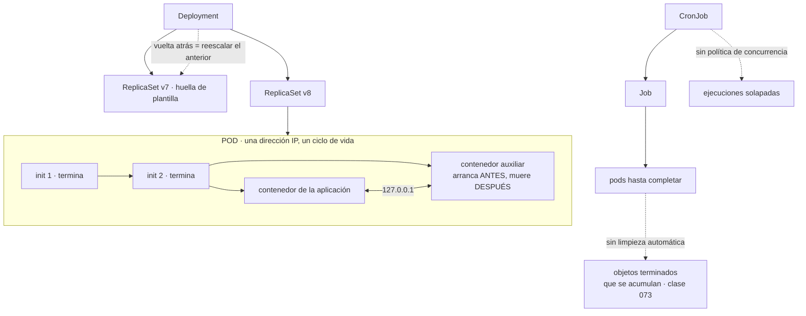

# 074 — Pods, ReplicaSets, Deployments y Jobs

> [← Clase anterior](../../part-06-kubernetes-managed-platforms/073-api-server-etcd-scheduler-controllers-y-kubelet/README.md) · [Índice de la parte](../README.md) · [Clase siguiente →](../../part-06-kubernetes-managed-platforms/075-services-dns-ingress-y-gateway-api/README.md)

**Parte:** 06 — Kubernetes y plataformas administradas<br>
**Nivel:** intermedio-avanzado · **Horas estimadas:** 4<br>
**Laboratorio:** `kubernetes` · **Estado:** `EXECUTABLE_CORE`

## 🎯 Propósito

Trabajar con las cargas de Kubernetes sabiendo que el pod **no es un contenedor**: es un grupo de contenedores que comparten espacio de red y ciclo de vida, exactamente el modo compartido de la clase 065. De esa definición salen los patrones auxiliares y sus problemas de orden, y de la naturaleza declarativa salen dos comportamientos que producen incidentes reales: **un contenedor de inicialización se ejecuta una vez por pod** —no una vez por despliegue— y **los objetos terminados no desaparecen solos**, con la consecuencia sobre el almacén de estado que la clase 073 acaba de mostrar.

## 📚 Resultados de aprendizaje

Al finalizar podrás:

1. **Explicar** qué comparten los contenedores de un pod y qué patrones habilita eso.
2. **Distinguir** el trabajo que corresponde a un contenedor de inicialización del que no, con la trampa de la ejecución por réplica.
3. **Describir** cómo un despliegue progresa y cómo vuelve atrás, y qué lo impide.
4. **Configurar** trabajos y trabajos programados con límite de reintentos, plazo y limpieza.
5. **Anticipar** el efecto de los objetos terminados que nadie retira.

## 🧩 Conceptos centrales

| Concepto | Comprensión verificable |
|---|---|
| `pod` | Unidad de planificación: uno o varios contenedores que **comparten espacio de red y almacenamiento efímero**, se ubican juntos y viven y mueren juntos. Es el modo compartido de la clase 065 con nombre propio. |
| `contenedor de inicialización` | Se ejecuta hasta terminar, en orden, antes que los de la aplicación. Se ejecuta **una vez por pod**, así que con tres réplicas ocurre tres veces. |
| `contenedor auxiliar` | Acompaña al principal durante toda su vida. Su orden de arranque y de parada respecto del principal es lo que decide si hay errores en cada despliegue. |
| `conjunto de réplicas` | Mantiene N pods idénticos. No se crea a mano: lo crea el despliegue, y su nombre incluye una huella de la plantilla — que es como funciona la vuelta atrás. |
| `límite de reintentos y plazo` | Cuántas veces se reintenta un trabajo y cuánto puede durar. Sin ellos, un trabajo roto reintenta indefinidamente y uno colgado no termina nunca. |
| `limpieza automática` | Plazo tras el cual un trabajo terminado se elimina. Sin él, los objetos completados **se acumulan para siempre** en el almacén de estado. |

## 🧠 Modelo mental

Kubernetes es un sistema de reconciliación: declaras estado deseado y controladores reducen continuamente la diferencia con el estado observado.

Aplicado a esta clase, separa siempre cuatro planos: **intención** (qué necesita el usuario),
**configuración** (qué declaramos), **estado observado** (qué existe de verdad) y
**evidencia** (cómo sabemos que cumple). Confundirlos produce diseños que se ven correctos
en un diagrama pero fallan al operar.

## 🗺️ Flujo de razonamiento



## 📖 Desarrollo

### 1. El pod es el modo compartido de la clase 065

Un pod es uno o varios contenedores que comparten cosas concretas, y saber cuáles evita la mitad de las confusiones:

```text
comparten
  espacio de red    una sola dirección IP; se hablan por 127.0.0.1
                    y NO pueden escuchar en el mismo puerto
  almacenamiento efímero  los volúmenes declarados en el pod
  ciclo de vida     se planifican juntos, se ubican en el mismo nodo
                    y se eliminan juntos

no comparten
  sistema de ficheros   cada uno el suyo, salvo los volúmenes que monte
  espacio de procesos   salvo que se active explícitamente
  límites de recursos   cada contenedor tiene los suyos
```

La primera línea es literalmente el modo compartido que la clase 065 explicó, y por eso aquello no era una curiosidad: **era el modelo mental de esta parte**.

De ahí salen dos patrones, y la diferencia entre ellos es cuándo se ejecutan:

```text
contenedor de inicialización   se ejecuta hasta TERMINAR, en orden,
                               antes de que arranque ningún contenedor principal
contenedor auxiliar            acompaña al principal durante toda su vida
```

Para qué sirve cada uno, con los casos que de verdad aparecen:

```text
inicialización
  esperar a que una dependencia acepte conexiones (clase 066)
  ajustar la propiedad de un volumen (el problema de uid de la clase 064)
  descargar configuración o certificados antes de arrancar

auxiliar
  representante de red que cifra o enruta el tráfico
  recolector de métricas o de registros
  actualizador de configuración que refresca un fichero montado
```

Y la trampa del primero, que es la que produce incidentes y ya apareció en la clase 071 con otro mecanismo:

```text
un contenedor de inicialización se ejecuta UNA VEZ POR POD
  → con tres réplicas, tres veces
  → al escalar a diez, diez veces
  → en cada reinicio de un pod, otra vez
```

Por eso **una migración de esquema no va en un contenedor de inicialización**. Parece el sitio natural —«antes de que arranque la aplicación»— y en realidad se ejecuta una vez por réplica y en cada reinicio. Es la segunda aparición de la misma ley que la clase 071 enunció, ahora con un mecanismo de Kubernetes:

```text
migración de esquema  →  un trabajo, ejecutado una vez, antes del despliegue
esperar a la base     →  contenedor de inicialización, o mejor, reintento
                         en la aplicación (clases 066, 068)
```

La segunda opción merece un matiz: esperar en un contenedor de inicialización resuelve el arranque y no la vida, exactamente como `depends_on` con condición de salud en la clase 066. **El reintento en la aplicación sigue siendo obligatorio**, y con él, el contenedor de inicialización suele sobrar.

Y sobre los **contenedores auxiliares**, el problema histórico que conviene conocer porque explica una configuración que se ve en muchos sitios: si el auxiliar es un contenedor normal, no hay garantía de que arranque antes que el principal ni de que muera después. Eso produce dos fallos exactos:

```text
al arrancar   el principal intenta salir por el representante que aún no está
              → errores de conexión en cada creación de pod
al parar      el representante muere primero
              → las peticiones en curso del principal fallan (clase 068)
```

La forma correcta actual es declararlo como contenedor de inicialización con política de reinicio permanente, lo que le da orden garantizado: **arranca antes que los principales y se termina después**.

### 2. Cómo avanza y cómo vuelve atrás un despliegue

Un despliegue no gestiona pods: gestiona **conjuntos de réplicas**, y ahí está la explicación de la vuelta atrás.

```bash
$ kubectl get rs -l app=tienda
NAME               DESIRED   CURRENT   READY   AGE
tienda-7d4b9c8f5        3         3       3     2m     ← la nueva
tienda-6b1d4a2e7        0         0       0     6d     ← la anterior, conservada
```

El sufijo es una huella de la plantilla del pod. Cambiar cualquier campo de la plantilla produce una huella distinta y, con ella, un conjunto nuevo. Y volver atrás es **volver a escalar el conjunto anterior**, que sigue existiendo:

```bash
$ kubectl rollout undo deploy/tienda
$ kubectl rollout history deploy/tienda
```

De donde salen dos requisitos que se olvidan:

```text
revisionHistoryLimit > 0     si es 0, no hay conjunto anterior que reescalar
la imagen por HUELLA         si la plantilla referencia una etiqueta y esa
                             etiqueta se movió, "volver atrás" descarga
                             el contenido nuevo (clase 061)
```

La segunda es la quinta aparición de la regla de la clase 061, ahora con la consecuencia más incómoda: **una vuelta atrás que no vuelve a ninguna parte**, con todo el mecanismo funcionando correctamente.

El avance se controla con dos parámetros y su combinación decide si hay capacidad de sobra o de menos durante el despliegue:

```yaml
strategy:
  type: RollingUpdate
  rollingUpdate:
    maxSurge: 1          # cuántos pods DE MÁS se permiten
    maxUnavailable: 0    # cuántos pueden faltar
```

`maxUnavailable: 0` es el valor correcto por defecto: se crean pods nuevos antes de retirar los viejos, así que la capacidad nunca baja. El coste es que hace falta sitio para uno más y que el despliegue es algo más lento.

Y un detalle que produce despliegues que parecen colgados: **un pod cuenta como disponible cuando pasa su comprobación de disponibilidad**, no cuando arranca. Si esa comprobación es exigente y la aplicación tarda, el despliegue avanza al ritmo del arranque real — que es lo correcto y hay que dimensionar el tiempo límite en consecuencia.

```bash
$ kubectl rollout status deploy/tienda --timeout=300s
Waiting for deployment "tienda" rollout to finish: 1 out of 3 new replicas have been updated...
```

Y el mecanismo que impide un despliegue infinito: si en un plazo no hay progreso, el despliegue se marca como fallido y **se queda parado**, con los pods viejos sirviendo:

```yaml
progressDeadlineSeconds: 600
```

Eso es lo que se quiere: un despliegue que no puede avanzar no debe seguir intentándolo mientras el conjunto anterior mantiene el servicio. Y la canalización tiene que leer ese estado, porque `apply` habrá devuelto éxito hace rato — la ley de la clase 073.

Sobre la **inmutabilidad**: la mayoría de los campos de un pod no se pueden modificar. Cambiar la imagen, las variables o los límites significa **crear otro pod**. Eso es coherente con todo el modelo y explica por qué cualquier cambio produce reemplazo, y por qué el despliegue existe para hacerlo de forma controlada.

### 3. Trabajos: reintentos, plazos y lo que nadie retira

Un trabajo ejecuta pods hasta que terminan con éxito, y tiene cuatro parámetros que hay que poner siempre porque sus valores por defecto producen problemas:

```yaml
apiVersion: batch/v1
kind: Job
metadata: {name: facturar-dia}
spec:
  completions: 1
  parallelism: 1
  backoffLimit: 3                 # reintentos antes de darse por vencido
  activeDeadlineSeconds: 3600     # plazo total, pase lo que pase
  ttlSecondsAfterFinished: 86400  # se elimina solo un día después
  template:
    spec:
      restartPolicy: Never
      containers:
        - name: facturar
          image: registro/tienda@sha256:9f2c…
          command: ["/bin/tienda", "facturar-dia"]
```

Qué pasa sin cada uno:

```text
sin backoffLimit          usa el valor por defecto y reintenta seis veces;
                          con un fallo permanente, seis pods fallidos que quedan
sin activeDeadlineSeconds un proceso colgado no termina NUNCA
                          y bloquea la ejecución siguiente si hay política
                          de concurrencia estricta
sin ttlSecondsAfterFinished  los objetos terminados NO se eliminan solos
                          → se acumulan indefinidamente
restartPolicy: Always     no es válido en un trabajo: reiniciaría para siempre
```

El tercero merece detenerse, porque es la conexión directa con la clase 073. Un trabajo programado que se ejecuta cada cinco minutos genera 288 objetos al día. Sin limpieza automática:

```text
288 objetos/día × 3 trabajos programados × 90 días ≈ 78.000 objetos
cada uno con su pod, sus sucesos y su historial de estado
→ presión sobre el almacén de estado, listados lentos y, en el límite,
  el clúster en solo lectura de la clase 073
```

La comprobación es directa y conviene hacerla en cualquier clúster con unos meses de vida:

```bash
$ kubectl get jobs -A --no-headers | wc -l
$ kubectl get pods -A --field-selector status.phase=Succeeded --no-headers | wc -l
```

Y los **trabajos programados** añaden tres parámetros propios, dos de los cuales ya aparecieron en la clase 071:

```yaml
spec:
  schedule: "0 2 * * *"
  timeZone: "Europe/Madrid"
  concurrencyPolicy: Forbid          # si la anterior sigue, no arranca otra
  startingDeadlineSeconds: 300       # si no pudo arrancar en 5 min, se salta
  successfulJobsHistoryLimit: 3
  failedJobsHistoryLimit: 3
```

**La política de concurrencia** es la corrección del incidente de la clase 071: sin ella, una ejecución que dure más que el intervalo se solapa consigo misma.

**El plazo de arranque** resuelve un fallo que solo aparece después de un incidente y es espectacular: si el plano de control estuvo caído varias horas, al volver el controlador intenta recuperar **todas** las ejecuciones perdidas. Un trabajo cada cinco minutos durante seis horas de caída son 72 ejecuciones lanzadas a la vez. Con el plazo puesto, las que no pudieron arrancar a tiempo simplemente se saltan, que casi siempre es lo correcto.

Y **la zona horaria** merece declararse explícitamente: sin ella, el horario se interpreta en la del controlador, que puede no ser la del negocio. Un cierre diario «a las 2 de la madrugada» que se ejecuta a las 3 o a la 1 según la estación es un error difícil de atribuir.

Y para lo que debe ejecutarse en **todos los nodos** —un recolector de registros, un agente de red— existe el conjunto de demonios, que planifica un pod por nodo y añade automáticamente los nodos nuevos. Su particularidad operativa es que **actualizarlo toca todos los nodos**, así que su despliegue progresivo tiene que estar bien configurado o afecta al clúster entero a la vez.

### 4. Propiedad, borrado en cascada y objetos huérfanos

Cada objeto creado por un controlador lleva una referencia a su propietario, y de ahí sale el borrado en cascada:

```bash
$ kubectl get rs tienda-7d4b9c8f5 -o jsonpath='{.metadata.ownerReferences}' | jq -r '.[].kind'
Deployment
$ kubectl get pod tienda-7d4b9c8f5-x2k4p -o jsonpath='{.metadata.ownerReferences}' | jq -r '.[].kind'
ReplicaSet
```

Borrar el despliegue borra sus conjuntos de réplicas y estos sus pods. Y hay una variante que produce sorpresas:

```bash
$ kubectl delete deploy tienda --cascade=orphan
```

Eso elimina el despliegue y **deja los pods vivos, sin dueño**. Nadie los reemplaza si mueren, nadie los actualiza, y no aparecen al listar despliegues. Es útil en migraciones controladas y es una fuente de recursos fantasma cuando se usa sin querer.

La comprobación de huérfanos merece estar en la revisión periódica de un clúster:

```bash
$ kubectl get pods -A -o json \
  | jq -r '.items[] | select(.metadata.ownerReferences == null)
           | "\(.metadata.namespace)/\(.metadata.name)"'
```

Cualquier pod sin propietario es un pod que nadie gestiona: no se recrea, no se actualiza y no lo cubre ningún presupuesto de interrupción de la clase 079.

Y los **finalizadores**, que la clase 073 introdujo, aparecen aquí en su forma habitual: un objeto que no se borra porque un controlador debía limpiar algo primero.

```bash
$ kubectl get pvc datos-tienda -o jsonpath='{.metadata.finalizers}'
["kubernetes.io/pvc-protection"]
```

Ese en concreto es una protección deliberada: impide borrar una reclamación de volumen mientras un pod la esté usando. Quitarlo a mano borra el objeto y deja el volumen real sin nadie que lo gestione — que es exactamente el tipo de recurso huérfano que aparece en la factura seis meses después.

Y la lista de comprobación de esta clase, que es lo que se lleva al proyecto de la 084:

```text
☐ ninguna migración de esquema en contenedores de inicialización
☐ los auxiliares declarados con orden garantizado de arranque y parada
☐ imagen por huella en la plantilla, para que la vuelta atrás signifique algo
☐ revisionHistoryLimit mayor que cero
☐ maxUnavailable en cero salvo justificación
☐ progressDeadlineSeconds acorde al arranque real, y leído por la canalización
☐ todo trabajo con límite de reintentos, plazo y limpieza automática
☐ todo trabajo programado con política de concurrencia, plazo de arranque
   y zona horaria declarada
☐ ningún pod sin propietario
```

Nueve puntos, de los cuales cuatro corrigen valores por defecto que producen problemas y dos vienen directamente de incidentes de las clases 061 y 071.

### 5. Elegir el objeto correcto

Con seis tipos de carga disponibles, elegir mal produce trabajo que no encaja con el mecanismo. La tabla que evita la discusión:

| Necesidad | Objeto | Por qué |
|---|---|---|
| Servicio sin estado, N réplicas intercambiables | Deployment | Despliegue progresivo y vuelta atrás |
| Identidad estable y almacenamiento propio por réplica | StatefulSet | Clase 077 |
| Un pod en cada nodo | DaemonSet | Se ajusta solo al añadir nodos |
| Trabajo que termina | Job | Reintentos, paralelismo y plazo |
| Trabajo que termina, con horario | CronJob | Concurrencia y plazo de arranque |
| Un pod suelto | Pod | **Casi nunca**: nadie lo recrea |

La última fila merece la advertencia: un pod creado directamente no lo gestiona ningún controlador. Si su nodo cae, desaparece y nadie lo sustituye. Solo tiene sentido para depuración puntual —y para eso está el contenedor efímero de la clase 070.

Y dos decisiones que se toman mal con frecuencia:

**Un despliegue con una sola réplica no es alta disponibilidad.** Durante cualquier actualización, cualquier expulsión y cualquier caída de nodo hay una ventana sin servicio. Si el servicio importa, el mínimo es dos réplicas repartidas, y eso exige que la aplicación tolere ejecutarse dos veces — que es la propiedad que las clases 064 y 071 llamaron estado adherido.

**Un trabajo no es un servicio con horario.** Un proceso de larga duración que «se reinicia si muere» no debe ser un trabajo con reintentos infinitos: es un despliegue con una réplica, y sus reinicios los gestiona el kubelet con espera creciente.

Y el cierre que enlaza con el resto de la parte: los objetos de esta clase describen **qué debe existir**. Nada de lo visto aquí dice cómo se llega a ello desde fuera, dónde se guardan los datos ni quién puede hablar con quién — que son las tres clases siguientes y, no por casualidad, tres de las cuatro fugas que la clase 072 predijo. La hipótesis va por buen camino: **Kubernetes está resolviendo la reubicación y el despliegue progresivo, y las fugas siguen ahí esperando su nombre propio**.

## 🔬 Ejemplo trabajado

**CloudShop despliega en Kubernetes la aplicación de la parte 05. Los cinco incidentes del primer trimestre son de los objetos de carga, y tres de ellos son leyes conocidas reapareciendo con un mecanismo nuevo.**

**Incidente 1 — la migración de esquema se ejecutó tres veces.**

El equipo puso la migración en un contenedor de inicialización, que parecía el sitio natural.

```bash
$ kubectl logs tienda-7d4b9-x2k4p -c migrar | head -2
Aplicando migración 2026_08_add_column…
ERROR: column "descuento" of relation "pedidos" already exists
```

Con tres réplicas, tres ejecuciones simultáneas. Dos fallaron, el despliegue se quedó a medias y la base quedó con una migración aplicada parcialmente.

```text                                        antes            después
migración                        contenedor de inicialización   trabajo previo
                                                                al despliegue
ejecuciones por despliegue                    3                     1
espera a la base de datos          en el mismo contenedor     reintento en la
                                                              aplicación (068)
contenedores de inicialización                1                     0
```

Segunda aparición de la ley de la clase 071 —**lo que se ejecuta por réplica se ejecuta N veces**— con un mecanismo distinto y el mismo daño.

**Incidente 2 — errores en cada creación de pod, y otra vez al parar.**

El representante de red que cifra el tráfico entre servicios estaba declarado como contenedor normal.

```text
al arrancar   la aplicación intentaba conectar antes de que el representante
              escuchara → ~15 errores por pod creado
al parar      el representante moría primero → las peticiones en curso
              de la aplicación fallaban
```

```text                                        antes            después
declaración del auxiliar       contenedor normal   inicialización con reinicio
                                                   permanente: orden garantizado
errores por creación de pod              ~15               0
errores por parada de pod                ~8                0
errores por despliegue completo         ~70                0
```

Es el mismo problema que la clase 068 resolvió dentro de un proceso, ahora entre contenedores del mismo pod: **quién arranca antes y quién muere después**.

**Incidente 3 — 78.000 objetos terminados y el almacén al límite.**

```bash
$ kubectl get jobs -A --no-headers | wc -l
26412
$ kubectl get pods -A --field-selector status.phase=Succeeded --no-headers | wc -l
51833
```

Tres trabajos programados sin limpieza automática, funcionando desde hacía tres meses. Los listados tardaban minutos y el almacén de estado se acercaba a la cuota — el mismo camino que produjo el incidente 3 de la clase 073.

```text                                        antes            después
limpieza automática                       ninguna         86.400 s (1 día)
historial conservado por trabajo programado  ilimitado      3 correctos, 3 fallidos
objetos de trabajos en el clúster           78.245            412
tiempo de un listado de todos los pods      2 min 40 s        1,8 s
tamaño del almacén de estado                1,4 GiB         210 MiB
```

**Incidente 4 — 72 ejecuciones simultáneas después de un mantenimiento.**

Tras seis horas de plano de control detenido por una actualización, al volver:

```bash
$ kubectl get jobs -l cronjob=sincronizar-stock --no-headers | wc -l
72
```

El controlador intentó recuperar todas las ejecuciones perdidas de golpe. Las 72 arrancaron a la vez contra el mismo proveedor externo, que las bloqueó — el mismo desenlace que el incidente de ritmo de la clase 056, con otro origen.

```text                                        antes            después
plazo de arranque                         sin declarar        300 s
política de concurrencia                    Allow             Forbid
zona horaria                              sin declarar    Europe/Madrid
ejecuciones tras una caída de 6 h             72               1
```

**Incidente 5 — la vuelta atrás que no volvió a ninguna parte.**

Un despliegue defectuoso se revierte y el problema persiste.

```bash
$ kubectl rollout undo deploy/tienda
deployment.apps/tienda rolled back
$ kubectl get pods -l app=tienda -o jsonpath='{..imageID}' | tr ' ' '\n' | sort -u
registro/tienda@sha256:c74e0182…      ← la misma imagen defectuosa
```

La plantilla referenciaba `tienda:v8`, y la canalización había reescrito esa etiqueta. Volver atrás reescaló el conjunto anterior, cuya plantilla apuntaba a la misma etiqueta, que ahora contenía el código nuevo.

```text                                        antes            después
referencia en la plantilla                etiqueta            huella
revisionHistoryLimit                          0                 10
vuelta atrás efectiva                        no                sí, 34 s medidos
etiquetas inmutables en el registro          no                sí
```

Quinta aparición de la regla de la clase 061, con la consecuencia más incómoda posible: **todo el mecanismo funcionó correctamente y no sirvió de nada**.

**Resumen del primer trimestre:**

```text                                          antes         después
ejecuciones de la migración por despliegue        3             1
errores por despliegue completo                  ~70            0
objetos de trabajos en el clúster              78.245          412
tiempo de un listado completo de pods         2 min 40 s      1,8 s
ejecuciones tras una caída de 6 h                72             1
vuelta atrás efectiva                            no        sí, 34 s
pods sin propietario                              4             0
```

**La lección que esta clase traslada al resto de la parte 06**: cuatro de los cinco incidentes venían de valores por defecto —sin limpieza, sin plazo de arranque, sin historial de revisiones, contenedor auxiliar sin orden— y ninguno era un fallo del sistema. Y tres eran leyes ya conocidas del programa reapareciendo con mecanismos nuevos. **La lista de nueve comprobaciones de esta clase habría evitado los cinco**, y ninguna de las nueve exige entender nada que las clases anteriores no hubieran enseñado ya.

## 🧪 Laboratorio guiado

Ejecuta desde la raíz:

```bash
python classes/part-06-kubernetes-managed-platforms/074-pods-replicasets-deployments-y-jobs/lab.py
```

El laboratorio selecciona el motor de práctica **`kubernetes`** y produce
`lab_result.json`. El escenario, sus comprobaciones y el artefacto esperado corresponden a
esta clase; no requiere credenciales y deja explícito qué debe revalidarse en un sandbox real.

1. Lee `exercise.steps` y formula una predicción antes de ejecutar.
2. Ejecuta la práctica y verifica todos los elementos de `checks`.
3. Provoca el caso de `negative_test` y explica la señal observada.
4. Materializa `workload-kubernetes` en `evidence/` usando la plantilla indicada.
5. Para proveedor real, sigue `sandbox.requires`, registra costo y ejecuta `destroy`.

### Evidencia esperada

El artefacto principal es manifiestos declarativos con estado observado. Además, la entrega debe incluir el comando ejecutado,
la salida estructurada y una conclusión que no exceda lo observado.

## 🏆 Reto verificable

Construye **`workload-kubernetes`** para el caso CloudShop. Incluye una alternativa descartada,
un supuesto que pueda falsarse, una prueba de fallo y una decisión de rollback.

## ✅ Criterio de aceptación

- [ ] `lab.py` termina con código 0 y genera JSON válido.
- [ ] La entrega conecta al menos tres requisitos con mecanismos verificables.
- [ ] Existe una prueba positiva y una prueba negativa con evidencia.
- [ ] Seguridad, costo y operación aparecen como decisiones, no como anexos.
- [ ] Se declara una limitación y una condición que obligaría a revisar el diseño.
- [ ] Otra persona puede repetir el recorrido sin conocimiento tácito.

## ⚠️ Errores frecuentes

| Síntoma | Causa probable | Corrección |
|---|---|---|
| Una migración de esquema se ejecuta varias veces y deja la base a medias | Está en un contenedor de inicialización, que se ejecuta una vez por pod | Ejecútala como un trabajo previo al despliegue; el contenedor de inicialización es para esperar o preparar, no para actuar una sola vez. |
| Errores al crear y al parar cada pod con un representante de red | El contenedor auxiliar no tiene orden garantizado respecto del principal | Decláralo como contenedor de inicialización con reinicio permanente: arranca antes y termina después. |
| Los listados tardan minutos y el almacén de estado crece sin parar | Los trabajos terminados no se eliminan solos | Pon limpieza automática en todos los trabajos y limita el historial de los programados. |
| Tras una caída del plano de control se lanzan decenas de ejecuciones a la vez | El controlador recupera las ejecuciones perdidas y no hay plazo de arranque | Declara plazo de arranque y política de concurrencia estricta; casi siempre saltarse lo perdido es lo correcto. |
| La vuelta atrás se completa y el problema persiste | La plantilla referencia una etiqueta que se reescribió, o no hay historial de revisiones | Referencia por huella, mantén historial mayor que cero y activa etiquetas inmutables en el registro. |
| Existen pods que nadie recrea ni actualiza | Se crearon sueltos o se borró su propietario dejándolos huérfanos | Usa siempre un controlador y revisa periódicamente los pods sin referencia de propietario. |

## 🛡️ Seguridad, ética y costo

Trabaja con cuentas propias o sandboxes autorizados. No publiques secretos, identificadores
reales ni datos personales. Antes de crear recursos pagos define presupuesto, etiquetas y
comando de destrucción; después verifica que no queden recursos huérfanos. Los ejemplos
locales enseñan contratos, pero no certifican cumplimiento ni disponibilidad de producción.

## ❓ Preguntas de comprobación

1. ¿Qué comparten los contenedores de un pod y con qué mecanismo de la clase 065 se corresponde?
2. ¿Por qué una migración de esquema no debe ir en un contenedor de inicialización?
3. ¿Cómo funciona exactamente una vuelta atrás y qué dos cosas pueden dejarla sin efecto?
4. ¿Qué cuatro parámetros hay que poner siempre en un trabajo y qué produce la ausencia de cada uno?
5. ¿Qué ocurre con los trabajos programados tras varias horas de plano de control detenido, y cómo se evita?

## 🔗 Referencias

- Kubernetes (2025). *Pods* — qué comparten los contenedores y ciclo de vida conjunto. <https://kubernetes.io/docs/concepts/workloads/pods/>
- Kubernetes (2025). *Sidecar containers* — orden garantizado de arranque y terminación. <https://kubernetes.io/docs/concepts/workloads/pods/sidecar-containers/>
- Kubernetes (2025). *Deployments* — conjuntos de réplicas, estrategia, historial y vuelta atrás. <https://kubernetes.io/docs/concepts/workloads/controllers/deployment/>
- Kubernetes (2025). *Jobs and automatic cleanup* — reintentos, plazo y eliminación tras finalizar. <https://kubernetes.io/docs/concepts/workloads/controllers/job/>
- Kubernetes (2025). *CronJob* — concurrencia, plazo de arranque, zona horaria e historial. <https://kubernetes.io/docs/concepts/workloads/controllers/cron-jobs/>
- Documentación oficial vigente del servicio implementado; registra URL y fecha de consulta.

---

> [Evaluación](assessment.md) · [Contrato de clase](lesson.yaml) · [Índice de la parte](../README.md)
