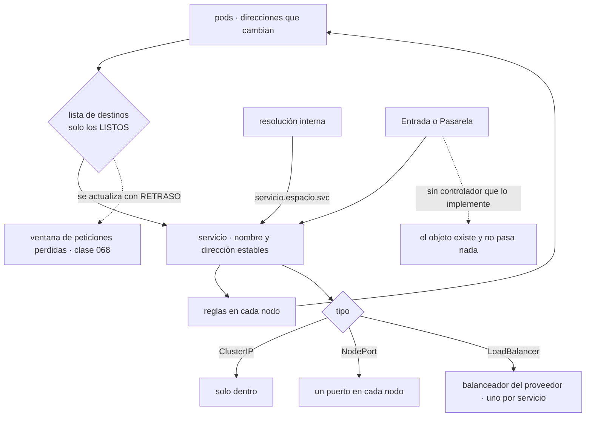

# 075 — Services, DNS, Ingress y Gateway API

> [← 074 · Pods, ReplicaSets, Deployments y Jobs](../../part-06-kubernetes-managed-platforms/074-pods-replicasets-deployments-y-jobs/README.md) · [Índice de la parte](../README.md) · [076 · ConfigMaps, Secrets y configuración externa →](../../part-06-kubernetes-managed-platforms/076-configmaps-secrets-y-configuracion-externa/README.md)

**Parte:** 06 — Kubernetes y plataformas administradas<br>
**Nivel:** intermedio-avanzado · **Horas estimadas:** 4<br>
**Laboratorio:** `network` · **Estado:** `EXECUTABLE_CORE`

## 🎯 Propósito

Alcanzar un pod desde otro pod y desde fuera del clúster, que es la primera de las cuatro fugas de la clase 072 puesta a prueba: **Kubernetes no resuelve el problema de red, le pone nombre propio**. Un servicio es una abstracción sobre direcciones que cambian, y todo lo demás —resolución de nombres, entrada desde fuera, reparto— se construye encima con las mismas propiedades y las mismas trampas de la clase 065, más una nueva que solo aparece aquí: **la lista de destinos se actualiza con retraso**, y ese retraso es donde se pierden peticiones.

## 📚 Resultados de aprendizaje

Al finalizar podrás:

1. **Explicar** qué hace un servicio y por qué su lista de destinos es el objeto que de verdad importa.
2. **Elegir** el tipo de servicio adecuado y saber qué crea cada uno fuera del clúster.
3. **Diagnosticar** la resolución de nombres interna y el coste oculto de su configuración por defecto.
4. **Exponer** un servicio desde fuera distinguiendo entrada clásica de la interfaz moderna.
5. **Localizar** la ventana en la que un despliegue pierde peticiones por retraso en la lista de destinos.

## 🧩 Conceptos centrales

| Concepto | Comprensión verificable |
|---|---|
| `servicio` | Nombre y dirección virtual estables delante de un conjunto de pods que cambian. No es un proceso: es una regla que el nodo aplica. |
| `lista de destinos` | Objeto que enumera las direcciones que están **listas** para recibir. Es lo que de verdad decide adónde va el tráfico, y se actualiza con retraso. |
| `servicio sin dirección` | Servicio que no asigna dirección virtual y devuelve directamente las de los pods. Es lo que necesitan las cargas con identidad de la clase 077. |
| `entrada` | Objeto que describe cómo llega el tráfico HTTP desde fuera. **No hace nada por sí solo**: hace falta un controlador que lo implemente. |
| `interfaz de pasarela` | Sustituta de la entrada, con los papeles separados: quien opera la infraestructura declara la pasarela y quien opera la aplicación declara sus rutas. |
| `opción de puntos` | Configuración del resolutor que hace que un nombre externo se intente primero con varios sufijos. Multiplica las consultas de DNS de todo el clúster. |

## 🧠 Modelo mental

Kubernetes es un sistema de reconciliación: declaras estado deseado y controladores reducen continuamente la diferencia con el estado observado.

Aplicado a esta clase, separa siempre cuatro planos: **intención** (qué necesita el usuario),
**configuración** (qué declaramos), **estado observado** (qué existe de verdad) y
**evidencia** (cómo sabemos que cumple). Confundirlos produce diseños que se ven correctos
en un diagrama pero fallan al operar.

## 🗺️ Flujo de razonamiento



## 📖 Desarrollo

### 1. El servicio no es un proceso: es una regla

Un pod tiene una dirección y esa dirección desaparece con él. El servicio resuelve eso con un nombre y una dirección virtual estables:

```yaml
apiVersion: v1
kind: Service
metadata: {name: api}
spec:
  selector: {app: api}
  ports: [{port: 80, targetPort: 8080}]
```

Y conviene entender qué ocurre por debajo, porque explica su comportamiento:

```text
1. un controlador observa los pods que cumplen el selector
2. escribe en la LISTA DE DESTINOS los que están LISTOS
3. en cada nodo, un componente traduce esa lista a reglas del núcleo
4. el tráfico hacia la dirección virtual se reparte entre esos destinos
```

De ahí, tres consecuencias que hay que tener claras:

**La dirección virtual no responde a nada.** No hay ningún proceso escuchando en ella; es una dirección que solo existe como regla. Un intento de diagnosticarla con herramientas que esperan un destino real da resultados desconcertantes:

```bash
$ kubectl run t --rm -it --image=nicolaka/netshoot -- ping 10.96.14.7
# sin respuesta: no hay nada que responda a eso, y el servicio funciona
$ kubectl run t --rm -it --image=nicolaka/netshoot -- curl -s 10.96.14.7:80/readyz
ok                                                                          ✓
```

**El objeto que importa es la lista de destinos, no el servicio.** Casi todos los problemas de «el servicio no responde» se resuelven mirándola:

```bash
$ kubectl get endpointslices -l kubernetes.io/service-name=api \
    -o jsonpath='{range .items[*].endpoints[*]}{.addresses[0]} {.conditions.ready}{"\n"}{end}'
10.60.3.14  true
10.60.1.9   false      ← existe y NO está lista: no recibe tráfico
```

Una lista vacía tiene tres causas posibles y el diagnóstico es inmediato:

```text
el selector no coincide con ninguna etiqueta de los pods
los pods existen y ninguno pasa su comprobación de disponibilidad
el puerto de destino no coincide con el que el contenedor declara
```

**El reparto no es equilibrado en el sentido que se espera.** Se reparte por conexión, no por petición. Un cliente con una conexión persistente envía **todas** sus peticiones al mismo destino mientras la mantenga abierta. Es exactamente el problema del reparto de la clase 066, y aparece igual:

```text
cliente HTTP con conexión reutilizada, 3 réplicas
  → una réplica recibe todo el tráfico de ese cliente
  → al escalar, las nuevas no reciben nada hasta que alguien reconecte
```

La corrección está en el cliente —cerrar y rehacer conexiones periódicamente— o en una capa que reparta por petición, que es lo que hacen la entrada y las mallas de servicio. Conviene saberlo antes de concluir que «el reparto no funciona».

### 2. Los tipos, y qué crea cada uno fuera del clúster

```text
ClusterIP      dirección virtual interna. El valor por defecto y el correcto
               para casi todo.
NodePort       además, un puerto ALTO en TODOS los nodos.
LoadBalancer   además, pide al proveedor un balanceador externo.
ExternalName   no reparte nada: devuelve un nombre. Es un alias de DNS.
```

Y dos cosas que conviene saber antes de elegir:

**Cada servicio de tipo balanceador crea un recurso del proveedor**, con su dirección pública, su coste por hora y su cuota. Veinte servicios expuestos así son veinte balanceadores, veinte direcciones y veinte facturas. Es la razón por la que existe la entrada: **un único punto de entrada que reparte por nombre y por ruta**.

```text
20 servicios con balanceador propio     20 direcciones · ~20 × precio/hora
20 servicios detrás de una entrada       1 dirección  ·  1 × precio/hora
```

**El puerto en todos los nodos rara vez es lo que se quiere.** Abre un puerto alto en cada nodo del clúster, lo que complica el cortafuegos y ata a los clientes a direcciones de nodo que cambian. Casi siempre es un paso intermedio de la implementación del balanceador, no una elección de diseño.

Y hay un tipo que resuelve un caso concreto de la clase 077 y conviene situar aquí: el **servicio sin dirección virtual**.

```yaml
spec:
  clusterIP: None
  selector: {app: bd}
```

Con eso, la resolución del nombre devuelve **las direcciones de los pods** en vez de una virtual. Sirve cuando el cliente necesita saber quién es quién —una base de datos con réplicas, un clúster que se coordina entre sus miembros—, y es lo que da a cada réplica un nombre estable en la clase 077.

Y una precisión sobre la **preservación de la dirección de origen**, que produce sorpresas al auditar:

```text
por defecto, el tráfico que entra por un balanceador puede reenviarse
entre nodos, y en ese salto se sustituye la dirección de origen
→ la aplicación ve la dirección de un nodo, no la del cliente
```

La corrección es declarar que el tráfico solo se atienda en el nodo donde llega:

```yaml
spec:
  externalTrafficPolicy: Local
```

Con eso, la aplicación ve la dirección real del cliente y la comprobación del balanceador solo marca como sanos los nodos que tienen pods — lo que además reparte mejor. El coste es que si un nodo tiene dos pods y otro ninguno, el reparto entre nodos deja de ser uniforme, así que conviene combinarlo con reglas de distribución de la clase 078.

### 3. La resolución interna y su coste por defecto

Cada servicio obtiene un nombre resoluble, con una forma jerárquica:

```text
api                          desde el mismo espacio de nombres
api.tienda                   desde otro espacio
api.tienda.svc               forma completa dentro del clúster
api.tienda.svc.cluster.local nombre absoluto
```

Y hay un detalle de configuración que afecta al rendimiento de **todo el clúster** y que casi nadie revisa:

```bash
$ kubectl exec app-1 -- cat /etc/resolv.conf
search tienda.svc.cluster.local svc.cluster.local cluster.local
nameserver 10.96.0.10
options ndots:5
```

La última línea significa: **cualquier nombre con menos de cinco puntos se prueba primero con todos los sufijos de búsqueda**. Para un nombre externo:

```text
consulta de api.proveedor.com (2 puntos, menos de 5)
  1. api.proveedor.com.tienda.svc.cluster.local   → no existe
  2. api.proveedor.com.svc.cluster.local          → no existe
  3. api.proveedor.com.cluster.local              → no existe
  4. api.proveedor.com                            → ¡por fin!
```

Cuatro consultas —ocho si el cliente pregunta también por direcciones de la versión 6 del protocolo— por cada resolución de un nombre externo. En un clúster con servicios que llaman mucho hacia fuera, eso multiplica la carga del servicio de nombres y añade latencia a cada conexión nueva.

Dos correcciones, y la primera es gratis:

```text
1. usar el nombre absoluto, con punto final: api.proveedor.com.
   → una sola consulta
2. bajar la opción de puntos en los pods que llaman mucho hacia fuera
```

```yaml
spec:
  dnsConfig:
    options: [{name: ndots, value: "2"}]
```

Y una tercera medida que es la más efectiva en clústeres grandes: una **caché de resolución en cada nodo**, que responde localmente y evita atravesar la red para cada consulta. Reduce la latencia de resolución y elimina una clase entera de fallos intermitentes bajo carga.

Y vuelve, por tercera vez en el programa, el problema de la caché en el cliente:

```text
clases 039 y 051   el nombre resolvía al sitio equivocado
clase 065          el cliente cacheó la dirección y el contenedor se recreó
aquí               lo mismo, con pods que se recrean constantemente
```

Con pods que cambian en cada despliegue, un cliente que resuelve una vez y guarda la dirección habla con un pod que ya no existe. La corrección es la de siempre —resolver por nombre en cada conexión nueva, caducidad corta y reintento— y aquí es más importante que nunca, porque **las direcciones cambian por diseño y con frecuencia**.

### 4. Entrar desde fuera: entrada y pasarela

La **entrada** describe cómo llega el tráfico HTTP desde fuera:

```yaml
apiVersion: networking.k8s.io/v1
kind: Ingress
metadata:
  name: tienda
  annotations:
    nginx.ingress.kubernetes.io/proxy-body-size: "25m"
spec:
  ingressClassName: nginx
  tls: [{hosts: [tienda.example], secretName: tienda-tls}]
  rules:
    - host: tienda.example
      http:
        paths:
          - path: /api
            pathType: Prefix
            backend: {service: {name: api, port: {number: 80}}}
```

Y la primera cosa que hay que saber: **el objeto no hace nada por sí solo**. Es una declaración que un controlador tiene que implementar. Sin controlador instalado, la entrada se crea, `apply` devuelve éxito y no ocurre nada — la ley de la clase 073 en su forma más literal.

```bash
$ kubectl get ingress tienda
NAME     CLASS   HOSTS            ADDRESS   PORTS
tienda   nginx   tienda.example             80, 443
#                                  ↑ vacío: nadie la ha implementado
```

La segunda es su límite conocido: la especificación cubre poco —nombre, ruta y cifrado— y todo lo demás se expresa con **anotaciones específicas del controlador**. Eso significa que una entrada escrita para un controlador no vale para otro sin reescribir sus anotaciones, que es justo lo contrario de la portabilidad que se busca.

La **interfaz de pasarela** existe para corregir ambas cosas, y su aportación principal no es técnica sino organizativa: **separa los papeles**.

```yaml
# lo declara quien opera la infraestructura
apiVersion: gateway.networking.k8s.io/v1
kind: Gateway
metadata: {name: entrada-publica, namespace: red}
spec:
  gatewayClassName: proveedor
  listeners:
    - name: https
      protocol: HTTPS
      port: 443
      tls: {certificateRefs: [{name: comodin-tls}]}
      allowedRoutes: {namespaces: {from: Selector,
        selector: {matchLabels: {expone: "si"}}}}
---
# lo declara cada equipo, en SU espacio de nombres
apiVersion: gateway.networking.k8s.io/v1
kind: HTTPRoute
metadata: {name: tienda, namespace: tienda}
spec:
  parentRefs: [{name: entrada-publica, namespace: red}]
  hostnames: ["tienda.example"]
  rules:
    - matches: [{path: {type: PathPrefix, value: /api}}]
      backendRefs: [{name: api, port: 80, weight: 90},
                    {name: api-canario, port: 80, weight: 10}]
```

Tres cosas que la entrada no daba y que aquí son parte de la especificación:

```text
reparto por peso        el canario de la clase 052 y de Cloud Run, sin anotaciones
control de quién expone qué   la pasarela decide qué espacios pueden colgar rutas
separación de papeles   red opera la pasarela y los certificados;
                        cada equipo opera sus rutas sin tocar la infraestructura
```

La tercera es el mismo compromiso que la VPC compartida de la clase 051 resolvió: **quien gobierna la red no tiene que ser un cuello de botella para quien despliega**, siempre que el reparto de permisos esté bien hecho.

Y una precisión operativa sobre los **certificados**: en la mayoría de los clústeres los emite y renueva un controlador que observa objetos y habla con una autoridad. Es un controlador más, con la misma propiedad que todos: si deja de funcionar, los certificados **no se renuevan y nadie avisa** hasta que caducan. La alerta correcta no es sobre el controlador sino sobre lo que ve el cliente:

```text
vigilar la caducidad del certificado SERVIDO, no el objeto del clúster
```

Sexta aparición de la misma lección, ahora con la variante que la clase 058 ya había señalado en Azure: **el vencimiento se vigila donde lo ve el usuario**.

### 5. La ventana donde se pierden peticiones

La clase 068 identificó la ventana entre la señal de parada y la retirada del tráfico. En Kubernetes esa ventana tiene un mecanismo concreto y merece verse entero, porque es la causa de los errores de despliegue que quedan después de haber corregido la aplicación.

```text
t+0     el pod se marca para eliminar
t+0     el kubelet envía la señal de parada al contenedor
t+0     el controlador de destinos empieza a quitarlo de la lista
t+~0,3  la lista actualizada llega al servidor de API
t+~0,5  cada nodo recibe la lista y reescribe sus reglas
t+~1-3  la entrada y los clientes con conexiones abiertas se enteran
```

Es decir: **la señal llega antes que la retirada**, y el margen depende del tamaño del clúster. Con muchos nodos y muchos servicios, la propagación de reglas tarda más.

De ahí que la corrección de la clase 068 —esperar antes de cerrar el escuchador— sea aquí obligatoria y no una mejora:

```yaml
lifecycle:
  preStop:
    exec: {command: ["/bin/sleep", "5"]}
terminationGracePeriodSeconds: 45
```

Y tiene una segunda mitad específica de esta clase: **los clientes con conexiones persistentes no consultan la lista**. Ya tienen una conexión abierta a una dirección concreta, y la seguirán usando aunque el pod haya salido de la lista. Solo la cierra:

```text
el pod, respondiendo con la cabecera que indica cierre de conexión
o el propio cierre del escuchador al terminar el plazo
```

Por eso el orden importa: primero salir de la lista y seguir sirviendo, después dejar de reutilizar conexiones, y solo al final cerrar.

Y el mismo mecanismo explica un problema al **arrancar**: un pod entra en la lista cuando pasa su comprobación de disponibilidad, y las reglas tardan en propagarse. Si el despliegue retira pods viejos al ritmo al que los nuevos se declaran listos, puede haber un instante con menos capacidad efectiva de la que las cifras indican. Con `maxUnavailable: 0` y un margen de capacidad, deja de importar.

La comprobación, que es la misma de la clase 068 y ahora se ejecuta contra el clúster:

```bash
$ hey -z 3m -c 50 -q 20 https://tienda.example/api/pedidos > carga.txt &
$ sleep 60 && kubectl set image deploy/api api=registro/api@sha256:nueva…
$ kubectl rollout status deploy/api --timeout=300s
$ grep -E '\[503\]|\[502\]|errors' carga.txt
  [502] 0 responses
  [503] 0 responses
  errors 0                                                                  ✓
```

Y una fuente de errores que solo aparece en el clúster y no en Compose: **el controlador de entrada tiene su propia lista de destinos**, que puede actualizarse a un ritmo distinto del de las reglas del nodo. Con un despliegue rápido de muchos pods, el controlador puede seguir enviando a direcciones que ya no existen durante uno o dos segundos. Los controladores modernos lo mitigan leyendo la lista directamente y con reintentos; comprobarlo forma parte de la verificación del despliegue, no de la confianza en la herramienta.

## 🔬 Ejemplo trabajado

**CloudShop expone su aplicación en el clúster. La conectividad interna funciona en media hora y los cinco incidentes siguientes reparten la culpa entre valores por defecto, un controlador ausente y una ventana de propagación que nadie había medido.**

**Incidente 1 — el servicio no responde y los pods están sanos.**

```bash
$ kubectl get endpointslices -l kubernetes.io/service-name=api
NAME        ADDRESSTYPE   ENDPOINTS   AGE
api-x7d2f   IPv4          <unset>     4m
```

Lista vacía. Y la causa, en el selector:

```bash
$ kubectl get svc api -o jsonpath='{.spec.selector}'
{"app":"api"}
$ kubectl get pods -l app=api --no-headers | wc -l
0
$ kubectl get pods --show-labels | head -2
api-7d4b9-x2k4p   1/1  Running  app.kubernetes.io/name=api
```

Las etiquetas de la plantilla usaban la forma con prefijo y el selector no. Media hora de diagnóstico que la lista de destinos habría resuelto en treinta segundos.

```text                                        antes            después
primera comprobación ante "no responde"   logs del pod    lista de destinos
convención de etiquetas                 mezclada         una sola, documentada
comprobación en la canalización            ninguna     falla si la lista está vacía
```

**Incidente 2 — la entrada existe y no llega tráfico.**

```bash
$ kubectl get ingress -A
NAMESPACE  NAME     CLASS   HOSTS            ADDRESS   PORTS
tienda     tienda   nginx   tienda.example             80, 443
```

Sin dirección. No había ningún controlador de entrada instalado en el clúster: el objeto se había creado correctamente y **nadie lo implementaba**.

```text                                        antes            después
controlador de entrada                    ninguno          instalado, 3 réplicas
comprobación de que la clase existe        ninguna     validación en la admisión
tiempo hasta detectarlo                    2 días             —
```

Dos días, porque `apply` había devuelto éxito y el objeto figuraba creado. La ley de la clase 073 en su forma más pura.

**Incidente 3 — el servicio de nombres al límite y latencia en todas las conexiones nuevas.**

```bash
$ kubectl -n kube-system logs -l k8s-app=kube-dns --tail=1 | head
[INFO] plugin/ready: Still waiting on: "kubernetes"
$ kubectl -n kube-system top pods -l k8s-app=kube-dns
NAME           CPU(cores)   MEMORY(bytes)
coredns-6f9b   940m         180Mi
```

El análisis del tráfico de consultas mostró que el 78 % eran búsquedas fallidas con sufijos, generadas por dos servicios que llamaban constantemente a una API externa.

```text                                        antes            después
nombres externos en la configuración   api.proveedor.com  api.proveedor.com.
opción de puntos en esos pods                 5                  2
caché de resolución por nodo                  no                 sí
consultas por segundo al servicio de nombres  4.100              620
latencia de conexión nueva (p95)             34 ms              4 ms
```

Un punto final en dos cadenas de configuración eliminó tres cuartas partes de la carga.

**Incidente 4 — la auditoría no podía identificar el origen de las peticiones.**

Todos los registros de acceso mostraban direcciones de nodos, no de clientes.

```text                                        antes            después
política de tráfico externo               Cluster            Local
dirección de origen en los registros    la del nodo     la del cliente
comprobación del balanceador          todos los nodos   solo los que tienen pods
reparto entre nodos                     uniforme       proporcional a los pods
                                                       (compensado con reglas
                                                        de distribución · 078)
```

**Incidente 5 — errores en cada despliegue, después de haber corregido la aplicación.**

La aplicación ya tenía el apagado ordenado de la clase 068 y aun así aparecían errores.

```text
errores por despliegue                 entre 20 y 60
todos en una ventana de ~1,5 s tras marcar cada pod para eliminar
```

La espera previa al cierre era de 2 segundos, calculada en la parte 05 sobre una sola máquina. En un clúster de 24 nodos, la propagación de reglas tardaba más:

```bash
# medición: tiempo desde que el pod sale de la lista hasta que el último nodo
# deja de enviarle tráfico
$ ./medir-propagacion.sh
p50 0,9 s · p95 2,8 s · p99 4,1 s
```

```text                                        antes            después
espera previa al cierre                     2 s               6 s
plazo de gracia                             30 s              45 s
errores por despliegue                    20-60               0
medición de la propagación                ninguna      trimestral, y al crecer
                                                       el clúster
```

La última fila es la lección: **la espera correcta depende del tamaño del clúster**, así que un valor calculado una vez deja de valer cuando la plataforma crece.

**Resumen de la exposición:**

```text                                          antes         después
tiempo de diagnóstico de "el servicio no responde"  30 min      < 1 min
objetos de entrada sin controlador                   1            0
consultas por segundo al servicio de nombres      4.100          620
latencia p95 de conexión nueva                    34 ms          4 ms
dirección de origen en los registros            del nodo     del cliente
errores por despliegue                            20-60           0
balanceadores del proveedor                          9            1
coste mensual de balanceadores                   ~198 USD      ~22 USD
```

**La lección que esta clase traslada al resto de la parte 06**: la hipótesis de la clase 072 se confirma en su primera prueba. Kubernetes **no resolvió** el problema de red: le puso nombres —servicio, lista de destinos, entrada, pasarela— y devolvió a la aplicación exactamente las mismas obligaciones de la parte 05: resolver por nombre en cada conexión, no cachear direcciones, esperar antes de cerrar y medir la ventana. Lo único genuinamente nuevo es que **ahora la ventana depende del tamaño del clúster**, así que la cifra que se calculó en una máquina hay que volver a medirla aquí.

## 🧪 Laboratorio guiado

Ejecuta desde la raíz:

```bash
python classes/part-06-kubernetes-managed-platforms/075-services-dns-ingress-y-gateway-api/lab.py
```

El laboratorio selecciona el motor de práctica **`network`** y produce
`lab_result.json`. El escenario, sus comprobaciones y el artefacto esperado corresponden a
esta clase; no requiere credenciales y deja explícito qué debe revalidarse en un sandbox real.

1. Lee `exercise.steps` y formula una predicción antes de ejecutar.
2. Ejecuta la práctica y verifica todos los elementos de `checks`.
3. Provoca el caso de `negative_test` y explica la señal observada.
4. Materializa `exposicion-kubernetes` en `evidence/` usando la plantilla indicada.
5. Para proveedor real, sigue `sandbox.requires`, registra costo y ejecuta `destroy`.

### Evidencia esperada

El artefacto principal es una topología con rutas, puertos y controles. Además, la entrega debe incluir el comando ejecutado,
la salida estructurada y una conclusión que no exceda lo observado.

## 🏆 Reto verificable

Construye **`exposicion-kubernetes`** para el caso CloudShop. Incluye una alternativa descartada,
un supuesto que pueda falsarse, una prueba de fallo y una decisión de rollback.

## ✅ Criterio de aceptación

- [ ] `lab.py` termina con código 0 y genera JSON válido.
- [ ] La entrega conecta al menos tres requisitos con mecanismos verificables.
- [ ] Existe una prueba positiva y una prueba negativa con evidencia.
- [ ] Seguridad, costo y operación aparecen como decisiones, no como anexos.
- [ ] Se declara una limitación y una condición que obligaría a revisar el diseño.
- [ ] Otra persona puede repetir el recorrido sin conocimiento tácito.

## ⚠️ Errores frecuentes

| Síntoma | Causa probable | Corrección |
|---|---|---|
| Un servicio no responde y sus pods están sanos | La lista de destinos está vacía: selector que no coincide, comprobación de disponibilidad que falla o puerto mal declarado | Mira siempre la lista de destinos primero; resuelve en segundos lo que por los registros cuesta media hora. |
| Un objeto de entrada existe y no llega tráfico | No hay ningún controlador que implemente esa clase de entrada | Comprueba que el objeto tiene dirección asignada y valida en la admisión que la clase declarada existe. |
| El servicio de nombres del clúster está saturado y las conexiones nuevas tardan | La opción de puntos por defecto prueba varios sufijos antes de cada nombre externo | Usa nombres absolutos con punto final, baja la opción en los pods que llaman hacia fuera y añade caché por nodo. |
| Los registros muestran direcciones de nodos en lugar de las de los clientes | El tráfico externo se reenvía entre nodos y en ese salto se sustituye el origen | Declara la política de tráfico externo como local, y compensa el reparto con reglas de distribución de pods. |
| Siguen apareciendo errores en cada despliegue pese al apagado ordenado | La espera previa al cierre se calculó para una máquina y la propagación de reglas en un clúster grande tarda más | Mide la propagación real y ajusta la espera; vuelve a medirla cuando el clúster crezca. |
| Un cliente sigue hablando con un pod que ya no existe | Tiene una conexión persistente abierta y no consulta la lista de destinos | Deja de reutilizar conexiones durante el apagado y limita la vida de las conexiones en el cliente. |

## 🛡️ Seguridad, ética y costo

Trabaja con cuentas propias o sandboxes autorizados. No publiques secretos, identificadores
reales ni datos personales. Antes de crear recursos pagos define presupuesto, etiquetas y
comando de destrucción; después verifica que no queden recursos huérfanos. Los ejemplos
locales enseñan contratos, pero no certifican cumplimiento ni disponibilidad de producción.

## ❓ Preguntas de comprobación

1. ¿Qué objeto hay que mirar primero cuando un servicio no responde, y qué tres causas explica?
2. ¿Por qué veinte servicios de tipo balanceador cuestan más que veinte rutas detrás de una entrada?
3. ¿Cuántas consultas genera resolver un nombre externo con la configuración por defecto, y cómo se reduce a una?
4. Describe la ventana entre la señal de parada y la retirada del tráfico en un clúster, y de qué depende su duración.
5. ¿Qué aporta la interfaz de pasarela sobre la entrada, y por qué su aportación principal es organizativa?

## 🔗 Referencias

- Kubernetes (2025). *Service* — tipos, selectores, política de tráfico externo y servicios sin dirección. <https://kubernetes.io/docs/concepts/services-networking/service/>
- Kubernetes (2025). *EndpointSlices* — la lista de destinos y su propagación. <https://kubernetes.io/docs/concepts/services-networking/endpoint-slices/>
- Kubernetes (2025). *DNS for Services and Pods* — nombres, sufijos de búsqueda y opción de puntos. <https://kubernetes.io/docs/concepts/services-networking/dns-pod-service/>
- Kubernetes (2025). *Gateway API* — separación de papeles, reparto por peso y control de exposición. <https://gateway-api.sigs.k8s.io/>
- Kubernetes (2025). *Pod termination and endpoint removal* — orden de la señal y de la retirada de destinos. <https://kubernetes.io/docs/concepts/services-networking/service/#deleting-and-terminating-endpoints>
- Documentación oficial vigente del servicio implementado; registra URL y fecha de consulta.

---

> [Evaluación](assessment.md) · [Contrato de clase](lesson.yaml) · [Índice de la parte](../README.md)

**📥 Descargar:** [Parte 06 en PDF](../../../site/downloads/partes/manual-parte-06-kubernetes-managed-platforms.pdf) · [Manual integral](../../../site/downloads/multi-cloud-engineering-manual-v2.0.pdf)

| Anterior | Índice | Siguiente |
|---|---|---|
| [← 074 · Pods, ReplicaSets, Deployments y Jobs](../../part-06-kubernetes-managed-platforms/074-pods-replicasets-deployments-y-jobs/README.md) | [Parte 06](../README.md) · [Programa](../../README.md) | [076 · ConfigMaps, Secrets y configuración externa →](../../part-06-kubernetes-managed-platforms/076-configmaps-secrets-y-configuracion-externa/README.md) |
