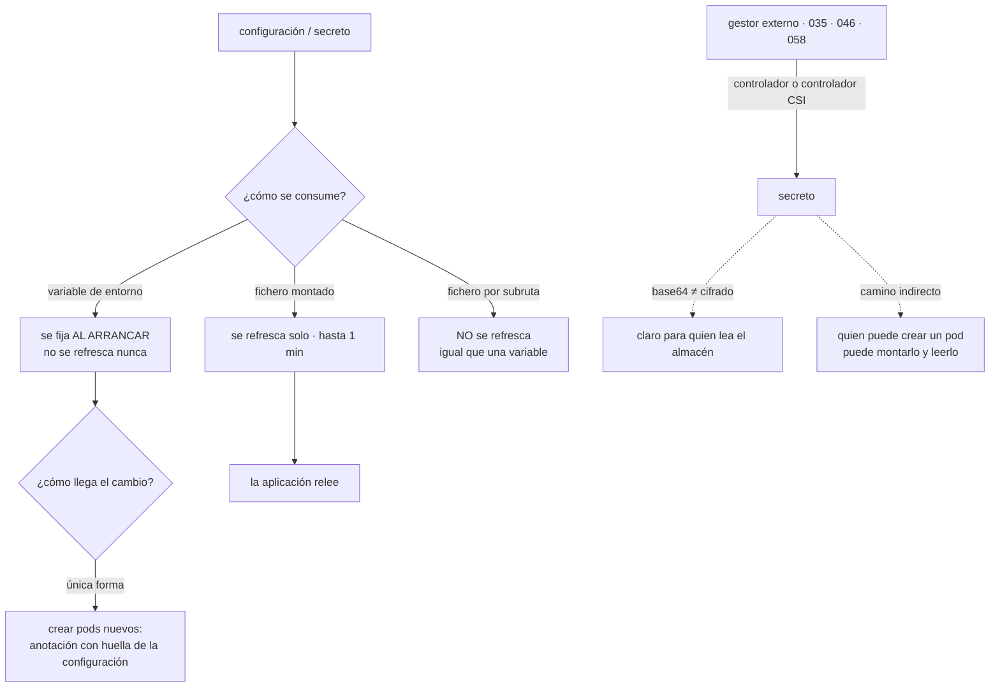

# 076 — ConfigMaps, Secrets y configuración externa

> [← 075 · Services, DNS, Ingress y Gateway API](../../part-06-kubernetes-managed-platforms/075-services-dns-ingress-y-gateway-api/README.md) · [Índice de la parte](../README.md) · [077 · Volumes, PersistentVolumes, CSI y StatefulSets →](../../part-06-kubernetes-managed-platforms/077-volumes-persistentvolumes-csi-y-statefulsets/README.md)

**Parte:** 06 — Kubernetes y plataformas administradas<br>
**Nivel:** intermedio-avanzado · **Horas estimadas:** 4<br>
**Laboratorio:** `configuration` · **Estado:** `EXECUTABLE_CORE`

## 🎯 Propósito

Inyectar configuración y secretos en Kubernetes, donde dos comportamientos producen la mayoría de los incidentes y ninguno es evidente: **un cambio de configuración no reinicia nada**, así que la nueva versión convive con la antigua indefinidamente; y **un secreto no está cifrado**, solo codificado, de modo que quien pueda leerlo en el almacén o crear un pod en su espacio de nombres lo tiene. La clase 058 ya estableció cuándo se resuelve un secreto según cómo se consume; aquí se paga por tercera vez, con un mecanismo nuevo.

## 📚 Resultados de aprendizaje

Al finalizar podrás:

1. **Decidir** entre variable de entorno y fichero montado sabiendo cuándo se actualiza cada uno.
2. **Forzar** un despliegue cuando cambia la configuración, en vez de confiar en que se propague.
3. **Explicar** qué protege y qué no protege un secreto de Kubernetes.
4. **Traer** secretos del gestor externo de las clases 035, 046 y 058 en lugar de duplicarlos.
5. **Acotar** quién puede leer secretos, contando los caminos indirectos.

## 🧩 Conceptos centrales

| Concepto | Comprensión verificable |
|---|---|
| `objeto de configuración` | Pares clave-valor que se consumen como variables o como ficheros. Su tamaño total está limitado por el almacén de estado, así que no sirve para ficheros grandes. |
| `secreto` | Igual que el anterior, con el contenido **codificado en base64**, que no es cifrado. Sin cifrado en reposo del almacén, está en claro para quien pueda leerlo. |
| `actualización de un montaje` | Un fichero montado se refresca solo, con un retraso de hasta un minuto. Una **variable de entorno no se refresca nunca**: se fija al arrancar el contenedor. |
| `montaje por subruta` | Forma de montar una sola clave en una ruta concreta. Es cómoda y **no recibe actualizaciones**, lo que convierte un fichero montado en el equivalente de una variable. |
| `objeto inmutable` | Configuración o secreto marcado como no modificable. Reduce carga en el plano de control y obliga a crear uno nuevo para cambiar, que es lo que se quiere. |
| `camino indirecto a un secreto` | Quien puede crear un pod en un espacio de nombres puede montar cualquier secreto de ese espacio y leerlo. El permiso de lectura directa no es el único que concede acceso. |

## 🧠 Modelo mental

Kubernetes es un sistema de reconciliación: declaras estado deseado y controladores reducen continuamente la diferencia con el estado observado.

Aplicado a esta clase, separa siempre cuatro planos: **intención** (qué necesita el usuario),
**configuración** (qué declaramos), **estado observado** (qué existe de verdad) y
**evidencia** (cómo sabemos que cumple). Confundirlos produce diseños que se ven correctos
en un diagrama pero fallan al operar.

## 🗺️ Flujo de razonamiento



## 📖 Desarrollo

### 1. Cambiar la configuración no cambia nada

Este es el comportamiento que más sorprende y el que produce configuraciones divergentes que duran semanas.

```bash
$ kubectl edit configmap tienda-config      # se cambia LOG_LEVEL a debug
configmap/tienda-config edited
$ kubectl get pods -l app=tienda
# los mismos tres pods, con la configuración antigua, indefinidamente
```

Nada reinicia los pods. El objeto cambió y los contenedores siguen con lo que leyeron al arrancar. Y lo peor no es eso: lo peor es lo que ocurre **la próxima vez que un pod se recrea por cualquier motivo** —una expulsión, un cambio de nodo, un escalado—, porque entonces ese pod arranca con la configuración nueva y los demás siguen con la vieja.

```text
resultado: réplicas del mismo servicio con configuraciones distintas,
           sin que nadie lo haya decidido y sin ninguna señal
```

Y el comportamiento depende de **cómo se consume**, que es la distinción de la clase 058 apareciendo por tercera vez:

```text
variable de entorno   se fija al arrancar el contenedor · NO se refresca nunca
fichero montado       el kubelet lo refresca solo, con hasta un minuto de retraso
fichero por subruta   NO se refresca: se comporta como una variable
```

La tercera línea es una trampa fina: montar una sola clave en una ruta concreta es lo más cómodo y lo más habitual, y desactiva el refresco sin avisar.

```yaml
# NO se actualiza
volumeMounts:
  - name: config
    mountPath: /app/config.yaml
    subPath: config.yaml

# SÍ se actualiza
volumeMounts:
  - name: config
    mountPath: /app/config          # el directorio entero
```

Y aunque el fichero se refresque, **la aplicación tiene que releerlo**. Un proceso que carga su configuración al arrancar no se entera de que el fichero cambió. Así que hay dos formas de que un cambio surta efecto, y conviene elegir una explícitamente:

```text
A · la aplicación vigila el fichero y relee
    lo mejor para lo que debe cambiar en caliente: nivel de registro,
    interruptores de funcionalidad, límites de ritmo

B · se crean pods nuevos
    lo correcto para todo lo demás, y lo que hace que el cambio sea
    un despliegue con vuelta atrás
```

La opción B necesita un mecanismo, porque cambiar la configuración no toca la plantilla del pod y por tanto no genera un despliegue (clase 074). El patrón estándar es una anotación con la huella del contenido:

```yaml
spec:
  template:
    metadata:
      annotations:
        cloudshop.example/config-hash: "a1b2c3d4e5f6…"
```

La canalización calcula esa huella del contenido de la configuración y la escribe en la plantilla. Cambiar la configuración cambia la huella, la huella cambia la plantilla, y eso sí produce un despliegue progresivo con su historial y su vuelta atrás.

Y los objetos **inmutables** cierran el caso desde el otro lado:

```yaml
apiVersion: v1
kind: ConfigMap
metadata: {name: tienda-config-v8}
immutable: true
data: {LOG_LEVEL: info}
```

Con ellos, la configuración se versiona igual que la imagen: para cambiarla se crea `v9` y se apunta la plantilla ahí, lo que es a la vez un despliegue y un registro de qué configuración tenía cada versión. Además reduce la carga del plano de control, porque el kubelet deja de vigilar cambios que no pueden ocurrir.

### 2. Un secreto no está cifrado

El nombre invita a suponer una protección que no existe por defecto:

```bash
$ kubectl get secret bd-credenciales -o jsonpath='{.data.password}' | base64 -d
Pr0d-2026-…
```

Base64 es una codificación, no un cifrado. Lo que un secreto **sí** aporta frente a un objeto de configuración normal:

```text
no se muestra en claro al listar ni en la salida por defecto
tiene su propio tipo de recurso, así que se le pueden dar permisos aparte
el kubelet lo monta en memoria, no en disco
se puede cifrar en reposo en el almacén, si se configura
```

Y lo que **no** aporta, que es lo que hay que asumir:

```text
no está cifrado salvo que se active el cifrado en reposo del almacén (073)
no protege de quien pueda leer una copia de seguridad del almacén
no protege de quien pueda CREAR UN POD en ese espacio de nombres
```

La tercera es el camino indirecto que casi nunca se cuenta al auditar permisos:

```yaml
# alguien con permiso para crear pods, sin permiso de leer secretos
spec:
  containers:
    - name: leer
      image: busybox
      command: ["sh", "-c", "cat /s/password"]
      volumeMounts: [{name: s, mountPath: /s}]
  volumes:
    - name: s
      secret: {secretName: bd-credenciales}
```

Montar un secreto no exige permiso de lectura sobre él: lo monta el kubelet en nombre del pod. **Quien puede crear pods en un espacio de nombres puede leer todos sus secretos.** Es la misma estructura del problema de suplantación de la clase 050 —el permiso efectivo incluye lo que se puede alcanzar indirectamente— y tiene la misma consecuencia para las auditorías: contar solo los permisos directos da un resultado falso.

De ahí, tres medidas concretas:

```text
1. cifrado en reposo del almacén, con clave gestionada externamente
2. los secretos de producción no comparten espacio de nombres con
   cargas de menor confianza; el espacio de nombres es la frontera real
3. auditar quién puede crear pods, no solo quién puede leer secretos
```

Y la cuarta, que es la que de verdad resuelve: **no guardar el secreto en el clúster**. Las clases 035, 046 y 058 dejaron gestores de secretos en las tres nubes, con rotación, auditoría y control de acceso propios. Duplicar su contenido en el clúster multiplica los sitios donde está.

Dos mecanismos lo evitan:

```text
controlador que sincroniza   observa un objeto que describe qué secreto quiere
                             y crea el secreto de Kubernetes desde el gestor
                             → el secreto SÍ acaba en el clúster, pero rota solo

controlador de almacenamiento de secretos
                             monta el valor directamente en el pod
                             → NO se crea ningún objeto en el clúster
```

El segundo es mejor y exige más: el valor nunca pasa por el almacén de estado. Y ambos usan la identidad de la carga —cuenta de servicio federada de las clases 038, 050 y 069— para autenticarse contra el gestor, sin ninguna credencial estática. Es el contrato de identidad del programa aplicado por sexta vez.

Y una advertencia sobre la rotación que la clase 058 ya midió: si el secreto se consume como **variable de entorno**, rotarlo en el gestor no cambia nada hasta que los pods se recreen. Con fichero montado y relectura, sí. Tercera vez que esta distinción decide el resultado.

### 3. Límites, y qué no cabe aquí

Los objetos de configuración viven en el almacén de estado, con las consecuencias de la clase 073:

```text
tamaño máximo por objeto     ~1 MiB
se cargan en memoria del kubelet y del servidor de API
cada cambio genera una revisión en el almacén
```

De ahí una regla que evita problemas de escala: **la configuración es texto pequeño**. Lo que no cabe:

```text
ficheros de datos, diccionarios, modelos, catálogos    → almacenamiento
                                                          de objetos o volumen
certificados de autoridad grandes                      → caben, pero conviene
                                                          revisar el total
plantillas y activos estáticos                         → dentro de la imagen
```

Y un patrón que produce el fallo más silencioso de esta clase: montar un objeto de configuración que **no existe**. Sin más opciones, el pod se queda esperando indefinidamente:

```bash
$ kubectl describe pod tienda-7d4b9-x2k4p | grep -A2 Events
  Warning  FailedMount  MountVolume.SetUp failed for volume "config":
    configmap "tienda-config-v9" not found
```

El pod no arranca, el despliegue no avanza, y el objeto anterior sigue sirviendo — que es el comportamiento correcto y hay que saber leerlo. Con la marca de opcional, en cambio, el pod arranca **sin esa configuración**, que casi nunca es lo que se quiere:

```yaml
volumes:
  - name: config
    configMap: {name: tienda-config-v9, optional: true}   # ← arranca sin ella
```

Y dos prácticas que convierten la configuración en algo revisable:

**Una fuente por entorno, versionada en el repositorio.** El objeto del clúster se genera desde ahí, nunca se edita a mano. Un `kubectl edit` sobre una configuración es un cambio sin revisión, sin historial y que el siguiente despliegue deshace — y esa combinación produce incidentes cuya causa es imposible de encontrar.

**Validación del contenido antes de aplicarlo.** Un fichero de configuración mal formado no lo detecta Kubernetes: lo detecta la aplicación al arrancar, con lo que el fallo aparece en el despliegue.

```bash
$ kubectl create configmap tienda-config-v9 --from-file=config.yaml --dry-run=client -o yaml \
  | yq '.data["config.yaml"]' | yq -e 'has("puerto") and has("tiempoEspera")' >/dev/null \
  && echo "configuración válida"
```

Es la misma idea que la validación sobre el plan de la clase 059: **comprobar antes de aplicar cuesta segundos y comprobar después cuesta un despliegue**.

### 4. Quién puede leer qué

El control de acceso a la configuración y a los secretos se apoya en el espacio de nombres y en los permisos, y merece una regla explícita porque los caminos indirectos la complican.

La regla base:

```text
el espacio de nombres es la frontera de confianza real
  → los secretos de producción no conviven con cargas de menor confianza
  → cada equipo en el suyo, con permisos acotados (clase 080)
```

Y el permiso que hay que vigilar de verdad no es el de leer secretos:

```bash
# quién puede leer secretos directamente
$ kubectl auth can-i list secrets --as=usuario -n produccion

# quién puede leerlos INDIRECTAMENTE, montándolos
$ kubectl auth can-i create pods --as=usuario -n produccion

# y quién puede leerlos a través de una cuenta de servicio (clase 050)
$ kubectl auth can-i create serviceaccounts/token --as=usuario -n produccion
```

Las tres preguntas conceden acceso efectivo. Una revisión que solo haga la primera da un resultado tranquilizador y falso.

Y hay un cuarto camino que aparece al integrar herramientas: **quien puede leer el registro de auditoría o los sucesos puede ver valores** si algún componente los registra. Una aplicación que imprime su configuración al arrancar publica sus secretos en los registros, que están en un sistema con otros permisos y otra retención — la ley del sistema de solo añadir de la clase 072, en su quinta aparición.

```bash
$ kubectl logs deploy/tienda | grep -Ei 'password|token|secret' | head
```

Esa comprobación debería estar en la canalización, sobre los registros del entorno de pruebas.

Y la lista de comprobación de la clase, que alimenta el proyecto de la 084:

```text
☐ configuración versionada en el repositorio; nada editado a mano en el clúster
☐ objetos inmutables y versionados, o anotación con huella que fuerce despliegue
☐ montaje de directorio, no por subruta, para lo que deba refrescarse
☐ la aplicación relee lo que deba cambiar en caliente; lo demás, despliegue
☐ secretos desde el gestor externo, preferiblemente sin pasar por el clúster
☐ cifrado en reposo del almacén activado
☐ ningún secreto compartido entre espacios de nombres de distinta confianza
☐ auditoría de acceso que cuente crear pods y emitir testigos, no solo leer
☐ la aplicación no imprime su configuración al arrancar
☐ validación del contenido antes de aplicar
```

Diez puntos, de los cuales cuatro corrigen comportamientos por defecto y tres vienen de leyes ya establecidas en partes anteriores.

### 5. El contrato de configuración, ya en tres plataformas

Con las partes 02 a 06 recorridas, la configuración es uno de los contratos que mejor se ha conservado, y merece consolidarlo porque es lo que hace barato el cambio de plataforma:

```text
lo que se repitió en todas
  configuración inyectada al ejecutar, nunca dentro del artefacto
  secretos fuera del artefacto y fuera del repositorio
  identidad de la carga para acceder al gestor, sin credenciales estáticas
  distinción entre lo que se lee al arrancar y lo que se relee
  rotación que no exige ventana de corte

lo que cambió de nombre
  variables y ficheros montados      →  igual en todas
  gestor de secretos                 →  uno por nube
  mecanismo de recarga               →  reinicio, revisión o refresco de fichero
```

La cuarta línea del primer bloque es la que ha producido un incidente en cada plataforma: la clase 058 con las variables de entorno que se resuelven al arrancar, la 066 con la configuración que no se relee, y esta con el montaje por subruta. **Tres mecanismos distintos para la misma pregunta**: cuándo llega el valor nuevo al proceso.

Y una consecuencia práctica que conviene dejar escrita, porque simplifica el diseño de cualquier aplicación del programa:

```text
clasifica cada valor de configuración en dos grupos:

  A · puede cambiar en caliente
      nivel de registro, interruptores, límites de ritmo, umbrales
      → fichero montado, releído por la aplicación

  B · define la identidad de la versión
      cadenas de conexión, puntos de entrada, tamaños de grupo,
      credenciales, versiones de esquema
      → objeto inmutable versionado + despliegue con vuelta atrás
```

La clasificación hay que hacerla una vez por servicio y evita las dos preguntas que se repiten en cada cambio: «¿hace falta desplegar?» y «¿por qué unas réplicas tienen esto y otras no?».

Y el cierre que conecta con la clase siguiente: todo lo de aquí trata datos pequeños que caben en el plano de control. Lo que **no** cabe —los datos de verdad— es la segunda fuga de la clase 072, y la clase 077 comprueba si Kubernetes la resuelve o le pone nombre.

## 🔬 Ejemplo trabajado

**CloudShop mueve su configuración al clúster. El primer mes produce cuatro incidentes, y el más caro es el que menos parece un incidente: dos réplicas del mismo servicio funcionando con configuraciones distintas durante once días.**

**Incidente 1 — las réplicas divergentes.**

Un cambio de tiempo de espera se aplicó al objeto de configuración y nadie desplegó, porque «la configuración se lee del volumen».

```bash
$ for p in $(kubectl get pods -l app=api -o name); do
    echo "$p $(kubectl exec $p -- cat /app/config.yaml | yq '.tiempoEspera')"
  done
pod/api-7d4b9-x2k4p  30
pod/api-7d4b9-m9c1s  30
pod/api-7d4b9-q4t8w  5      ← recreado tras el cambio
```

El tercero se había recreado por una expulsión y arrancó con el valor nuevo. Durante once días, un tercio del tráfico tuvo un tiempo de espera seis veces menor, lo que explicaba una tasa de error intermitente que nadie había podido atribuir.

```text                                        antes            después
montaje                                  por subruta      directorio completo
relectura en la aplicación                   no        sí, para los valores de A
anotación con huella de configuración       ninguna     en la plantilla del pod
objetos de configuración                  mutables      inmutables y versionados
réplicas con configuración divergente         3 de 3          0
```

**Incidente 2 — quien podía crear pods podía leer todos los secretos.**

Una auditoría de permisos daba un resultado tranquilizador: solo dos personas podían leer secretos en producción. La comprobación de los caminos indirectos dio otro:

```bash
$ for u in $(cat usuarios.txt); do
    kubectl auth can-i create pods --as=$u -n produccion >/dev/null 2>&1 \
      && echo "$u puede leer TODOS los secretos de produccion"
  done | wc -l
14
```

Catorce personas, no dos.

```text                                        antes            después
permiso de lectura directa de secretos      2 personas       2 personas
permiso de crear pods en producción        14 personas       3 (despliegue
                                                             por canalización)
espacios de nombres por confianza             1                 3
cifrado en reposo del almacén                no                sí
auditoría que cuenta caminos indirectos      no            trimestral
```

**Incidente 3 — un secreto rotado que no llegó a la mitad de la flota.**

La rotación en el gestor externo funcionó; los pods siguieron con la credencial antigua.

```bash
$ kubectl get deploy api -o jsonpath='{.spec.template.spec.containers[0].env}' | jq -r '.[].name'
BD_PASSWORD
```

Como variable de entorno. Tercera aparición en el programa de exactamente el mismo problema —la clase 058 lo midió en Azure y la 066 en Compose—, ahora con el mecanismo de Kubernetes.

```text                                        antes            después
consumo del secreto                   variable de entorno  fichero montado
                                                           desde el controlador
                                                           de almacenamiento
el secreto pasa por el almacén de estado     sí                no
relectura ante fallo de autenticación        no                sí
errores durante la rotación siguiente      1.847               0
```

**Incidente 4 — la aplicación publicaba su configuración al arrancar.**

```bash
$ kubectl logs deploy/informes --tail=200 | grep -c 'BD_PASSWORD='
1
```

Una línea por arranque, con el valor completo, enviada al sistema de registros con su propia retención y sus propios permisos — la ley del sistema de solo añadir de la clase 072, quinta aparición.

```text                                        antes            después
volcado de configuración al arrancar    completo       solo claves, sin valores
credencial expuesta en los registros        sí          rotada el mismo día
comprobación en la canalización          ninguna      falla si aparece un patrón
                                                       de credencial en los registros
retención de los registros afectados      90 días       purgados
```

**Resumen:**

```text                                          antes         después
réplicas con configuración divergente          3 de 3           0
personas con acceso efectivo a secretos          14              3
secretos almacenados en el clúster               11              0
errores durante una rotación                  1.847              0
credenciales en los registros                     1              0
cambios de configuración con despliegue y vuelta atrás  0 de 9  9 de 9
```

**La lección que esta clase traslada al resto de la parte 06**: los cuatro incidentes son el mismo malentendido visto desde cuatro ángulos — **creer que cambiar el objeto cambia lo que el proceso está usando**. No lo cambia con variables, no lo cambia con subrutas, no lo cambia si la aplicación no relee y no lo cambia en el gestor externo si el consumo es por entorno. La corrección no es un ajuste sino una clasificación: qué valores pueden cambiar en caliente y cuáles definen la identidad de la versión, y tratarlos de forma distinta.

## 🧪 Laboratorio guiado

Ejecuta desde la raíz:

```bash
python classes/part-06-kubernetes-managed-platforms/076-configmaps-secrets-y-configuracion-externa/lab.py
```

El laboratorio selecciona el motor de práctica **`configuration`** y produce
`lab_result.json`. El escenario, sus comprobaciones y el artefacto esperado corresponden a
esta clase; no requiere credenciales y deja explícito qué debe revalidarse en un sandbox real.

1. Lee `exercise.steps` y formula una predicción antes de ejecutar.
2. Ejecuta la práctica y verifica todos los elementos de `checks`.
3. Provoca el caso de `negative_test` y explica la señal observada.
4. Materializa `configuracion-kubernetes` en `evidence/` usando la plantilla indicada.
5. Para proveedor real, sigue `sandbox.requires`, registra costo y ejecuta `destroy`.

### Evidencia esperada

El artefacto principal es configuración separada, validada y promovible. Además, la entrega debe incluir el comando ejecutado,
la salida estructurada y una conclusión que no exceda lo observado.

## 🏆 Reto verificable

Construye **`configuracion-kubernetes`** para el caso CloudShop. Incluye una alternativa descartada,
un supuesto que pueda falsarse, una prueba de fallo y una decisión de rollback.

## ✅ Criterio de aceptación

- [ ] `lab.py` termina con código 0 y genera JSON válido.
- [ ] La entrega conecta al menos tres requisitos con mecanismos verificables.
- [ ] Existe una prueba positiva y una prueba negativa con evidencia.
- [ ] Seguridad, costo y operación aparecen como decisiones, no como anexos.
- [ ] Se declara una limitación y una condición que obligaría a revisar el diseño.
- [ ] Otra persona puede repetir el recorrido sin conocimiento tácito.

## ⚠️ Errores frecuentes

| Síntoma | Causa probable | Corrección |
|---|---|---|
| Réplicas del mismo servicio con configuraciones distintas | Cambiar el objeto no reinicia nada, y los pods que se recrean arrancan con el valor nuevo | Objetos inmutables versionados o anotación con huella en la plantilla, para que un cambio de configuración sea un despliegue. |
| Un fichero montado no se actualiza nunca | Está montado por subruta, que desactiva el refresco | Monta el directorio completo y haz que la aplicación relea, o acepta que el valor exige despliegue. |
| Una auditoría dice que dos personas leen secretos y en realidad son catorce | Quien puede crear pods puede montar cualquier secreto de ese espacio de nombres | Cuenta los caminos indirectos —crear pods y emitir testigos— y separa por espacios de nombres según confianza. |
| Una rotación en el gestor externo no llega a los pods | El secreto se consume como variable de entorno, que se fija al arrancar | Consúmelo como fichero montado con relectura ante fallo de autenticación; es la tercera vez que esta distinción decide el resultado. |
| Un pod se queda esperando y el despliegue no avanza | Monta un objeto de configuración que no existe | Lee el suceso de montaje; y no marques como opcional lo que la aplicación necesita, porque arrancaría sin ello. |
| Aparecen credenciales en el sistema de registros | La aplicación imprime su configuración al arrancar | Registra solo las claves, rota lo expuesto y añade una comprobación de patrones de credencial a la canalización. |

## 🛡️ Seguridad, ética y costo

Trabaja con cuentas propias o sandboxes autorizados. No publiques secretos, identificadores
reales ni datos personales. Antes de crear recursos pagos define presupuesto, etiquetas y
comando de destrucción; después verifica que no queden recursos huérfanos. Los ejemplos
locales enseñan contratos, pero no certifican cumplimiento ni disponibilidad de producción.

## ❓ Preguntas de comprobación

1. ¿Qué ocurre exactamente al cambiar un objeto de configuración, y por qué produce réplicas divergentes?
2. ¿Cuándo se actualiza un valor consumido como variable, como directorio montado y como subruta?
3. ¿Qué aporta y qué no aporta un secreto de Kubernetes frente a un objeto de configuración normal?
4. ¿Qué tres permisos conceden acceso efectivo a un secreto, y cuál se suele olvidar en una auditoría?
5. Clasifica cinco valores de configuración de un servicio en los grupos de cambio en caliente y de identidad de versión.

## 🔗 Referencias

- Kubernetes (2025). *ConfigMaps* — consumo como variables y como volúmenes, y actualización. <https://kubernetes.io/docs/concepts/configuration/configmap/>
- Kubernetes (2025). *Secrets* — codificación, riesgos y buenas prácticas. <https://kubernetes.io/docs/concepts/configuration/secret/>
- Kubernetes (2025). *Encrypting confidential data at rest* — cifrado del almacén de estado. <https://kubernetes.io/docs/tasks/administer-cluster/encrypt-data/>
- Kubernetes (2025). *Immutable ConfigMaps and Secrets* — versionado y efecto en el plano de control. <https://kubernetes.io/docs/concepts/configuration/configmap/#configmap-immutable>
- Kubernetes SIG Storage (2025). *Secrets Store CSI Driver* — montar secretos del gestor externo sin crearlos en el clúster. <https://secrets-store-csi-driver.sigs.k8s.io/>
- Documentación oficial vigente del servicio implementado; registra URL y fecha de consulta.

---

> [Evaluación](assessment.md) · [Contrato de clase](lesson.yaml) · [Índice de la parte](../README.md)

**📥 Descargar:** [Parte 06 en PDF](../../../site/downloads/partes/manual-parte-06-kubernetes-managed-platforms.pdf) · [Manual integral](../../../site/downloads/multi-cloud-engineering-manual-v2.0.pdf)

| Anterior | Índice | Siguiente |
|---|---|---|
| [← 075 · Services, DNS, Ingress y Gateway API](../../part-06-kubernetes-managed-platforms/075-services-dns-ingress-y-gateway-api/README.md) | [Parte 06](../README.md) · [Programa](../../README.md) | [077 · Volumes, PersistentVolumes, CSI y StatefulSets →](../../part-06-kubernetes-managed-platforms/077-volumes-persistentvolumes-csi-y-statefulsets/README.md) |
