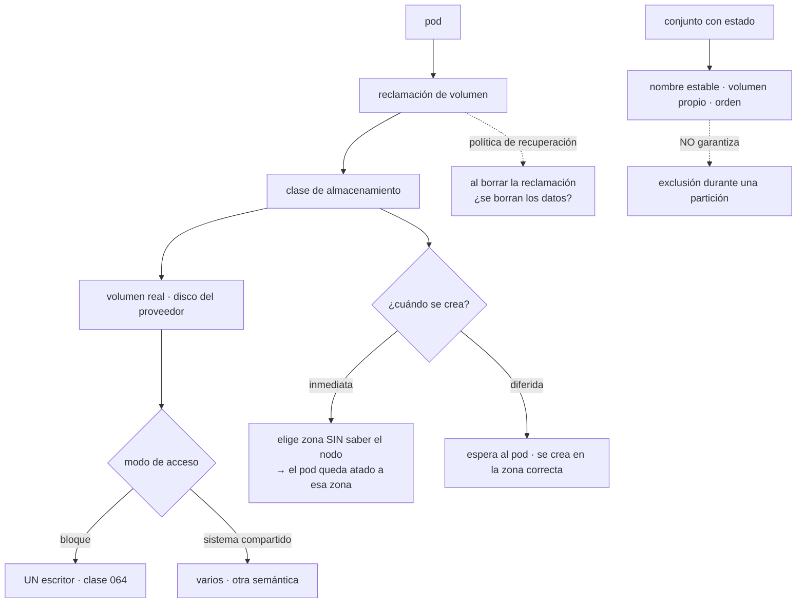

# 077 — Volumes, PersistentVolumes, CSI y StatefulSets

> [← 076 · ConfigMaps, Secrets y configuración externa](../../part-06-kubernetes-managed-platforms/076-configmaps-secrets-y-configuracion-externa/README.md) · [Índice de la parte](../README.md) · [078 · Requests, limits, scheduling y autoscaling →](../../part-06-kubernetes-managed-platforms/078-requests-limits-scheduling-y-autoscaling/README.md)

**Parte:** 06 — Kubernetes y plataformas administradas<br>
**Nivel:** intermedio-avanzado · **Horas estimadas:** 4<br>
**Laboratorio:** `storage` · **Estado:** `EXECUTABLE_CORE`

## 🎯 Propósito

Persistir datos en Kubernetes, que es la segunda fuga de la clase 072 y la que peor se resuelve. Kubernetes no elimina ninguna de las restricciones de la clase 064 —un volumen de bloque sigue teniendo un solo escritor y sigue viviendo en una zona— y añade dos propias: **el volumen ata el pod a una zona antes de que el planificador elija nodo**, y **la garantía de identidad de una carga con estado no es una garantía de exclusión**, así que durante una partición de red pueden existir dos instancias que se creen únicas.

## 📚 Resultados de aprendizaje

Al finalizar podrás:

1. **Encadenar** los objetos de almacenamiento y saber cuál falla cuando un pod no arranca.
2. **Elegir** modo de acceso y política de vinculación sabiendo cómo afectan a la planificación.
3. **Explicar** qué garantiza un conjunto con estado y qué no garantiza durante una partición.
4. **Anticipar** el ciclo de vida del dato: qué sobrevive al borrado del pod, del objeto y del clúster.
5. **Operar** ampliaciones, instantáneas y restauraciones con una prueba que las demuestre.

## 🧩 Conceptos centrales

| Concepto | Comprensión verificable |
|---|---|
| `reclamación de volumen` | Petición de almacenamiento hecha por la aplicación. Se vincula a un volumen real, y esa vinculación es **permanente**: no se reasigna a otro. |
| `clase de almacenamiento` | Plantilla que dice qué tipo de disco se aprovisiona y con qué política. Decide también **cuándo** se crea el volumen, que es lo que afecta a la planificación. |
| `vinculación diferida` | El volumen no se crea hasta que hay un pod que lo necesita, de modo que se crea **en la zona del nodo elegido**. Sin ella, el volumen elige zona primero y el pod queda atado a ella. |
| `modo de acceso` | Cuántos nodos pueden montarlo y cómo. El de bloque sigue siendo **un escritor**, exactamente como en la clase 064. |
| `conjunto con estado` | Da a cada réplica un nombre estable, un volumen propio y un orden. **No garantiza que solo exista una instancia** de cada índice durante una partición. |
| `política de recuperación` | Qué le ocurre al volumen real cuando se borra la reclamación: se elimina o se conserva. El valor por defecto de muchas clases **borra los datos**. |

## 🧠 Modelo mental

Kubernetes es un sistema de reconciliación: declaras estado deseado y controladores reducen continuamente la diferencia con el estado observado.

Aplicado a esta clase, separa siempre cuatro planos: **intención** (qué necesita el usuario),
**configuración** (qué declaramos), **estado observado** (qué existe de verdad) y
**evidencia** (cómo sabemos que cumple). Confundirlos produce diseños que se ven correctos
en un diagrama pero fallan al operar.

## 🗺️ Flujo de razonamiento



## 📖 Desarrollo

### 1. Cuatro objetos encadenados, y cuál falla en cada caso

El almacenamiento en Kubernetes es una cadena de cuatro objetos, y saber cuál es cuál convierte «el pod no arranca» en un diagnóstico de treinta segundos:

```text
pod                        pide un volumen por nombre
  reclamación de volumen   dice cuánto y de qué clase
    clase de almacenamiento  dice qué se aprovisiona y con qué política
      volumen real         el disco del proveedor
```

Y cada eslabón falla de una forma reconocible:

```bash
$ kubectl get pvc datos-bd
NAME       STATUS    VOLUME   CAPACITY   STORAGECLASS   AGE
datos-bd   Pending                       premium        6m
```

```text
reclamación en Pending
  la clase no existe, o el aprovisionador no está, o
  es vinculación diferida y todavía no hay pod (correcto)

reclamación vinculada y pod en Pending
  el volumen está en una zona donde no hay nodo con sitio

pod en ContainerCreating
  el volumen existe y no se monta: permisos, controlador,
  o ya está conectado a otro nodo
```

El tercer caso da un mensaje muy concreto que conviene reconocer:

```text
Multi-Attach error for volume "pvc-9f2c…":
  Volume is already exclusively attached to one node
```

Eso **no es un fallo**: es la restricción de la clase 064 en su forma de Kubernetes. Un volumen de bloque se conecta a un nodo cada vez, y punto. Aparece siempre en dos situaciones:

```text
un despliegue con dos réplicas compartiendo una reclamación
  → la segunda nunca arranca
un despliegue progresivo con `maxUnavailable: 0`
  → el nuevo pod espera un volumen que el viejo aún no ha soltado
```

La segunda es la que rompe la recomendación general de la clase 074. **Para una carga con volumen de bloque hay que invertir la estrategia**: retirar antes de crear, y aceptar la ventana.

```yaml
strategy:
  type: Recreate        # para cargas con volumen de bloque
```

Y los **modos de acceso** son la misma tabla de la clase 064 con otros nombres:

```text
un nodo, lectura y escritura        disco de bloque · lo habitual
un pod, lectura y escritura         más estricto: ni siquiera dos pods del
                                    mismo nodo
muchos nodos, lectura y escritura   sistema de ficheros compartido
muchos nodos, solo lectura          contenido estático compartido
```

Y una advertencia que evita una decepción: **declarar un modo no lo concede**. Si el controlador de almacenamiento solo admite un escritor, pedir muchos hace que la reclamación se quede sin vincular o que el pod falle al montar. La comprobación es directa:

```bash
$ kubectl get sc premium -o jsonpath='{.provisioner}'
$ kubectl get csidrivers
```

### 2. El volumen elige zona antes que el planificador

Este es el comportamiento propio de Kubernetes que más desconcierta, y tiene una corrección de una línea.

Con aprovisionamiento **inmediato**, el volumen se crea en cuanto existe la reclamación, **sin saber en qué nodo va a correr el pod**. El aprovisionador elige una zona, y a partir de ahí el pod solo puede planificarse en esa zona:

```text
t+0   se crea la reclamación
t+1   el volumen se crea en la zona B
t+2   se crea el pod
t+3   el planificador solo puede usar nodos de la zona B
      si no hay sitio allí → Pending indefinido, con nodos libres en A y C
```

El suceso lo dice, y hay que saber leerlo:

```text
0/9 nodes are available: 6 node(s) had volume node affinity conflict,
  3 Insufficient cpu.
```

«Conflicto de afinidad de nodo del volumen» significa exactamente esto: **el volumen ya eligió zona**.

La corrección se declara en la clase de almacenamiento:

```yaml
apiVersion: storage.k8s.io/v1
kind: StorageClass
metadata: {name: premium}
provisioner: disk.csi.proveedor.com
volumeBindingMode: WaitForFirstConsumer     # ← diferida
allowVolumeExpansion: true
reclaimPolicy: Retain
parameters: {type: ssd}
```

Con vinculación diferida, el volumen **no se crea hasta que hay un pod que lo necesita**, así que el planificador elige nodo primero y el volumen se crea en la zona correcta. Debería ser el valor por defecto de cualquier clase que se use con discos zonales.

Y hay una consecuencia que sobrevive a la corrección y define el diseño: **una vez creado, el volumen ata el pod a su zona para siempre**. Si esa zona cae, el pod no se puede reubicar:

```text
caída de zona con volumen zonal
  el pod no puede arrancar en otra zona
  la recuperación pasa por restaurar desde una instantánea en otra zona
  → el RTO es el de la restauración, no el de la reprogramación
```

Es exactamente lo que la clase 052 midió con el disco regional: 47 minutos frente a 4. Las opciones son las mismas y conviene decidirlas antes:

```text
disco replicado entre zonas   más caro, permite reubicar; solo para el volumen
                              cuya disponibilidad define el RTO
réplicas en zonas distintas   la aplicación replica, cada réplica con su volumen
                              zonal; es lo que hace un conjunto con estado
instantáneas y restauración   el RTO es el tiempo de restaurar; barato y lento
```

La segunda es la que Kubernetes soporta mejor y la que lleva al objeto de la sección siguiente.

### 3. Identidad estable no es exclusión

Un conjunto con estado da tres cosas que un despliegue no da:

```text
nombre estable        bd-0, bd-1, bd-2 · sobreviven al reinicio y al cambio de nodo
volumen propio        cada índice con su reclamación, creada por plantilla
orden                 se crean y se actualizan en orden, y se retiran al revés
```

Con un servicio sin dirección virtual (clase 075), cada réplica obtiene además un nombre resoluble, que es lo que permite a un clúster de base de datos coordinarse:

```yaml
apiVersion: apps/v1
kind: StatefulSet
metadata: {name: bd}
spec:
  serviceName: bd-headless
  replicas: 3
  podManagementPolicy: OrderedReady
  volumeClaimTemplates:
    - metadata: {name: datos}
      spec:
        accessModes: [ReadWriteOnce]
        storageClassName: premium
        resources: {requests: {storage: 100Gi}}
```

```text
bd-0.bd-headless.datos.svc.cluster.local
bd-1.bd-headless…
```

Y ahora la parte que hay que entender bien, porque es la fuente de corrupciones de datos y casi nunca se dice con claridad:

> **El nombre estable no garantiza que solo exista una instancia con ese nombre.**

Durante una partición de red, el nodo que aloja `bd-0` puede seguir vivo con su contenedor ejecutándose, mientras el plano de control lo da por perdido. Y ahí hay dos comportamientos posibles según el tipo de volumen:

```text
volumen de bloque      el mecanismo de conexión exclusiva IMPIDE que otro nodo
                       lo monte, así que el sustituto no arranca
                       → seguridad de datos, a costa de disponibilidad
sistema compartido     los dos pueden montar y escribir
                       → dos instancias escribiendo el mismo dato
```

Por eso Kubernetes **no expulsa automáticamente los pods de un nodo incomunicado si tienen volúmenes**: prefiere quedarse sin servicio a arriesgar dos escritores. Y por eso forzar la eliminación es una operación peligrosa que hay que conocer:

```bash
$ kubectl delete pod bd-0 --force --grace-period=0
```

Eso **borra el objeto sin confirmar que el contenedor murió**. Si el nodo estaba solo incomunicado, ahora hay dos `bd-0`: el viejo, escribiendo en su volumen, y el nuevo, que arranca en cuanto el volumen se libera. Con un sistema de ficheros compartido, eso es corrupción garantizada.

```text
regla   forzar la eliminación de un pod con estado solo después de
        CONFIRMAR que el nodo está apagado, no solo incomunicado
```

Y dos parámetros que ajustan el comportamiento del conjunto:

```text
podManagementPolicy
  OrderedReady   crea y actualiza de uno en uno, esperando disponibilidad
                 correcto para bases de datos que se unen a un clúster
  Parallel       todos a la vez; correcto cuando las réplicas son independientes

persistentVolumeClaimRetentionPolicy
  qué ocurre con los volúmenes al reducir réplicas o borrar el conjunto
  el valor por defecto los CONSERVA, lo que es seguro y acumula coste
```

La segunda merece revisarse: reducir de cinco réplicas a tres deja dos volúmenes conservados, con su coste, que nadie recuerda. Y si después se vuelve a escalar a cinco, se reutilizan **con sus datos antiguos**, que puede ser lo que se quiere o exactamente lo contrario.

### 4. El ciclo de vida del dato

Tres borrados distintos con tres consecuencias distintas, y confundirlos cuesta datos:

```text
borrar el POD                el volumen sobrevive; el pod nuevo lo vuelve a montar
borrar la RECLAMACIÓN        depende de la política de recuperación
borrar el CLÚSTER            depende de la política; con eliminación automática,
                             se van todos los discos del proveedor
```

La política vive en la clase de almacenamiento y tiene un valor por defecto peligroso:

```bash
$ kubectl get sc -o custom-columns=NOMBRE:.metadata.name,POLITICA:.reclaimPolicy
NOMBRE     POLITICA
standard   Delete          ← borrar la reclamación BORRA el disco
premium    Retain
```

Con `Delete`, un `kubectl delete pvc` elimina el disco y sus datos. Y con eliminación en cascada (clase 074), borrar el espacio de nombres se lleva las reclamaciones y con ellas los discos.

```text
regla   producción con Retain, siempre
        el coste es que quedan volúmenes liberados que hay que limpiar a mano,
        y ese coste es infinitamente menor que el de la alternativa
```

Y la protección adicional, que ya apareció en la clase 074: el finalizador que impide borrar una reclamación en uso. Quitarlo a mano es la forma habitual de perder datos «desatascando» algo.

**Las instantáneas** son el mecanismo de copia, y tienen la misma advertencia que la clase 064:

```yaml
apiVersion: snapshot.storage.k8s.io/v1
kind: VolumeSnapshot
metadata: {name: bd-2026-08-03}
spec:
  volumeSnapshotClassName: premium-snap
  source: {persistentVolumeClaimName: datos-bd-0}
```

```text
una instantánea de un volumen con un motor en marcha NO es consistente
  → hay que usar el mecanismo del motor, o congelar la escritura
  → o aceptar que la restauración puede necesitar recuperación
```

Y la restauración crea una reclamación **nueva** a partir de la instantánea, lo que la hace segura de ensayar:

```yaml
spec:
  dataSource: {name: bd-2026-08-03, kind: VolumeSnapshot,
               apiGroup: snapshot.storage.k8s.io}
```

Cuarta vez que este programa insiste en lo mismo, y con la misma exigencia: **la restauración se prueba con un recuento y se registra su duración**, porque esa duración es el tiempo de recuperación real y en las clases 042, 048 y 064 resultó ser bastante mayor que el del plan.

Y la **ampliación** de un volumen, que se puede hacer en caliente si la clase lo permite:

```bash
$ kubectl patch pvc datos-bd-0 -p '{"spec":{"resources":{"requests":{"storage":"200Gi"}}}}'
```

Con dos límites que conviene saber: **no se puede reducir**, igual que en la clase 054, y algunos controladores necesitan reiniciar el pod para que el sistema de ficheros se amplíe. Es otra decisión de un solo sentido con coste mensual permanente.

### 5. La pregunta que hay que hacer antes de crear un volumen

Con las restricciones ya enumeradas, conviene cerrar como cerró la clase 064: **la mejor gestión de un volumen es no necesitarlo**.

La tabla de decisión, que ya se puede escribir con seis partes de experiencia:

| El dato es… | Dónde va | Por qué |
|---|---|---|
| Contenido subido por usuarios | Almacenamiento de objetos | Sin restricciones de zona ni de escritor |
| Sesión o caché | Servicio gestionado o se reconstruye | No merece un volumen |
| Datos relacionales | Servicio gestionado de la nube | Conmutación, copias y parches resueltos |
| Índice reconstruible | Volumen efímero o se reconstruye al arrancar | Se pierde y no pasa nada |
| Cola o registro de eventos | Servicio gestionado | Clases 033, 044, 056 |
| Dato que exige el motor en el clúster | Conjunto con estado | Y con todo lo de esta clase |

La última fila existe y es minoritaria. Los motivos legítimos son concretos:

```text
requisito de residencia que ningún servicio gestionado satisface
versión o extensión que el servicio gestionado no ofrece
coste, con la cuenta hecha e incluyendo el tiempo de operación
portabilidad exigida entre nubes, con la decisión escrita
```

Y el coste que hay que poner en esa cuenta y casi nunca se pone:

```text
parches y actualizaciones de versión mayor
conmutación probada, no supuesta
copias, restauraciones ensayadas y su duración medida
vigilancia específica del motor
el conocimiento para operarlo, y su sustituto cuando esa persona no esté
```

Cuando esa lista se compara con la factura del servicio gestionado, la conclusión cambia en la mayoría de los casos. Y cuando no cambia, la decisión queda documentada con sus motivos, que es lo que este programa pide de cualquier decisión irreversible.

Y la lista de comprobación de la clase:

```text
☐ vinculación diferida en toda clase con discos zonales
☐ política de recuperación de conservación en producción
☐ estrategia de recreación en despliegues con volumen de bloque
☐ conjuntos con estado con servicio sin dirección virtual y política de gestión
   acorde a si las réplicas se coordinan
☐ política de retención de reclamaciones decidida, no heredada
☐ instantáneas con el mecanismo del motor, y restauración probada con recuento
☐ duración de la restauración registrada como tiempo de recuperación real
☐ ningún `--force --grace-period=0` sobre cargas con estado sin confirmar
   que el nodo está apagado
☐ para cada volumen, la respuesta escrita a por qué no está en un servicio
   gestionado
```

## 🔬 Ejemplo trabajado

**CloudShop lleva al clúster el único motor que no está gestionado: un índice de búsqueda con tres réplicas. Los cuatro incidentes del trimestre son todos de almacenamiento, y el último obliga a revisar la decisión de tenerlo ahí.**

**Incidente 1 — pods en Pending con nodos libres.**

```bash
$ kubectl describe pod busqueda-0 | grep -A2 Events
  Warning  FailedScheduling  0/9 nodes are available:
    6 node(s) had volume node affinity conflict, 3 Insufficient memory.
```

La clase de almacenamiento usaba aprovisionamiento inmediato, así que los tres volúmenes se habían creado en la misma zona antes de que existiera ningún pod.

```text                                        antes            después
modo de vinculación                      inmediato        diferido
zonas de los tres volúmenes            B, B, B          A, B, C
tiempo en Pending                      indefinido           12 s
reparto de réplicas por zona            1 zona            3 zonas
```

Los volúmenes existentes hubo que recrearlos: la vinculación no se cambia sobre la marcha.

**Incidente 2 — el despliegue progresivo que nunca terminaba.**

Antes de pasar a conjunto con estado, el índice era un despliegue con un volumen compartido.

```text
Multi-Attach error for volume "pvc-9f2c…":
  Volume is already exclusively attached to one node
```

Con `maxUnavailable: 0`, el pod nuevo esperaba un volumen que el viejo no soltaba, y el viejo no se retiraba hasta que el nuevo estuviera listo.

```text                                        antes            después
objeto                                   Deployment       StatefulSet
volumen                              uno compartido    uno por réplica
estrategia                         RollingUpdate         OrderedReady
despliegue                            se bloqueaba      2 min 40 s
réplicas simultáneas posibles               1                 3
```

**Incidente 3 — se perdieron los datos de preproducción al limpiar un espacio de nombres.**

```bash
$ kubectl delete namespace busqueda-pre
namespace "busqueda-pre" deleted
$ kubectl get pv | grep busqueda-pre
(vacío)
```

El borrado en cascada se llevó las reclamaciones, y la clase de almacenamiento tenía política de eliminación, así que se llevó también los discos del proveedor.

```text                                        antes            después
política de recuperación                   Delete           Retain
volúmenes liberados tras un borrado    desaparecen     quedan, con etiqueta
                                                        y limpieza mensual
instantánea previa a operaciones destructivas  ninguna   obligatoria
datos perdidos                          9 días de índice      —
```

El coste real fueron nueve días de reindexación. En producción la política ya era de conservación; en preproducción se había heredado la clase por defecto.

**Incidente 4 — dos instancias escribiendo el mismo índice.**

Un nodo perdió la red. `busqueda-1` figuraba como perdido y no se sustituía, porque su volumen seguía conectado a ese nodo. Alguien forzó la eliminación para «desbloquear»:

```bash
$ kubectl delete pod busqueda-1 --force --grace-period=0
```

El nodo estaba incomunicado, no apagado. Durante once minutos hubo dos procesos escribiendo, y el índice quedó incoherente: consultas que devolvían documentos borrados y omitían documentos existentes.

```text                                        antes            después
procedimiento ante nodo incomunicado    forzar borrado   confirmar apagado
                                                          del nodo primero
tiempo de detección de la incoherencia    3 días          comprobación diaria
                                                          de coherencia del índice
reconstrucción necesaria                  sí, 6 h              —
documentado y ensayado                     no                  sí
```

La protección que Kubernetes ofrecía —no expulsar pods con volumen de un nodo incomunicado— **funcionó correctamente**, y se anuló a mano por no entender qué estaba protegiendo.

**Y la revisión de la decisión.**

Con los cuatro incidentes sobre la mesa, se rehizo la cuenta que no se había hecho al principio:

```text                                   en el clúster    servicio gestionado
coste de infraestructura                   190 USD/mes       340 USD/mes
tiempo de operación (medido)             ~14 h/trimestre     ~1 h/trimestre
incidentes en el trimestre                     4                 0
restauración probada                          no          incluida y probada
conmutación entre zonas                  manual, 47 min    automática
parches de versión mayor                  del equipo        del proveedor
```

Ciento cincuenta dólares más al mes frente a catorce horas de trabajo trimestral y cuatro incidentes. La decisión se cambió, y lo relevante es lo que dice el registro: **la decisión original nunca se había tomado; se había heredado** de cuando el índice corría en una máquina.

**Resumen:**

```text                                          antes         después
zonas de las réplicas                            1              3
despliegue del índice                       bloqueado      2 min 40 s
política de recuperación en no producción     Delete         Retain
datos perdidos por borrado en cascada       9 días            0
incidentes por dos escritores                    1              0
volúmenes gestionados por el equipo              3              0
restauración probada con recuento                no        sí, mensual
```

**La lección que esta clase traslada al resto de la parte 06**: la hipótesis de la clase 072 se confirma por segunda vez. Kubernetes **no resolvió** el almacenamiento: renombró las restricciones de la clase 064 —un escritor, una zona, un ciclo de vida propio— y añadió dos suyas: el volumen elige zona antes que el planificador, y la identidad estable no es exclusión. Y el resultado más útil del trimestre no fue ninguna corrección técnica, sino haber hecho por fin la cuenta que decidía si ese dato tenía que estar ahí.

## 🧪 Laboratorio guiado

Ejecuta desde la raíz:

```bash
python classes/part-06-kubernetes-managed-platforms/077-volumes-persistentvolumes-csi-y-statefulsets/lab.py
```

El laboratorio selecciona el motor de práctica **`storage`** y produce
`lab_result.json`. El escenario, sus comprobaciones y el artefacto esperado corresponden a
esta clase; no requiere credenciales y deja explícito qué debe revalidarse en un sandbox real.

1. Lee `exercise.steps` y formula una predicción antes de ejecutar.
2. Ejecuta la práctica y verifica todos los elementos de `checks`.
3. Provoca el caso de `negative_test` y explica la señal observada.
4. Materializa `estado-kubernetes` en `evidence/` usando la plantilla indicada.
5. Para proveedor real, sigue `sandbox.requires`, registra costo y ejecuta `destroy`.

### Evidencia esperada

El artefacto principal es una política de durabilidad, acceso, retención y costo. Además, la entrega debe incluir el comando ejecutado,
la salida estructurada y una conclusión que no exceda lo observado.

## 🏆 Reto verificable

Construye **`estado-kubernetes`** para el caso CloudShop. Incluye una alternativa descartada,
un supuesto que pueda falsarse, una prueba de fallo y una decisión de rollback.

## ✅ Criterio de aceptación

- [ ] `lab.py` termina con código 0 y genera JSON válido.
- [ ] La entrega conecta al menos tres requisitos con mecanismos verificables.
- [ ] Existe una prueba positiva y una prueba negativa con evidencia.
- [ ] Seguridad, costo y operación aparecen como decisiones, no como anexos.
- [ ] Se declara una limitación y una condición que obligaría a revisar el diseño.
- [ ] Otra persona puede repetir el recorrido sin conocimiento tácito.

## ⚠️ Errores frecuentes

| Síntoma | Causa probable | Corrección |
|---|---|---|
| Un pod queda en Pending con nodos libres y el suceso menciona afinidad de volumen | El volumen se aprovisionó de forma inmediata y eligió zona antes de que existiera el pod | Usa vinculación diferida en toda clase con discos zonales; los volúmenes ya creados hay que recrearlos. |
| Un despliegue progresivo se bloquea con un error de conexión múltiple | Un volumen de bloque solo se conecta a un nodo, y el pod nuevo espera a que el viejo lo suelte | Estrategia de recreación para cargas con volumen de bloque, o un volumen por réplica con conjunto con estado. |
| Borrar un espacio de nombres elimina los discos y sus datos | La clase de almacenamiento tenía política de eliminación y el borrado es en cascada | Política de conservación en todos los entornos con datos, e instantánea previa a cualquier operación destructiva. |
| Dos instancias con el mismo nombre escriben el mismo dato | Se forzó la eliminación de un pod cuyo nodo estaba incomunicado pero no apagado | Confirma que el nodo está apagado antes de forzar; la protección que impide la sustitución está impidiendo dos escritores. |
| Al reducir réplicas quedan volúmenes que nadie usa y siguen costando | La política de retención de reclamaciones conserva por defecto | Decide esa política explícitamente y revisa periódicamente los volúmenes sin reclamación asociada. |
| Una restauración tarda mucho más de lo que dice el plan | Nunca se había ensayado ni cronometrado | Restaura mensualmente en una reclamación nueva, verifica con un recuento y registra la duración como tiempo de recuperación real. |

## 🛡️ Seguridad, ética y costo

Trabaja con cuentas propias o sandboxes autorizados. No publiques secretos, identificadores
reales ni datos personales. Antes de crear recursos pagos define presupuesto, etiquetas y
comando de destrucción; después verifica que no queden recursos huérfanos. Los ejemplos
locales enseñan contratos, pero no certifican cumplimiento ni disponibilidad de producción.

## ❓ Preguntas de comprobación

1. Encadena los cuatro objetos del almacenamiento y di qué falla cuando la reclamación está en Pending y cuando el pod lo está.
2. ¿Por qué la vinculación diferida evita que un pod quede atado a una zona sin nodos libres?
3. ¿Qué garantiza y qué no garantiza un conjunto con estado durante una partición de red?
4. ¿Qué ocurre con los datos al borrar el pod, la reclamación y el espacio de nombres?
5. ¿Qué costes hay que incluir al comparar un motor en el clúster con su servicio gestionado?

## 🔗 Referencias

- Kubernetes (2025). *Persistent Volumes* — reclamaciones, políticas de recuperación y modos de acceso. <https://kubernetes.io/docs/concepts/storage/persistent-volumes/>
- Kubernetes (2025). *Storage Classes and volume binding mode* — aprovisionamiento inmediato frente a diferido. <https://kubernetes.io/docs/concepts/storage/storage-classes/>
- Kubernetes (2025). *StatefulSets* — identidad, orden, plantillas de reclamación y retención. <https://kubernetes.io/docs/concepts/workloads/controllers/statefulset/>
- Kubernetes (2025). *Force delete StatefulSet pods* — riesgos de forzar y confirmación previa. <https://kubernetes.io/docs/tasks/run-application/force-delete-stateful-set-pod/>
- Kubernetes (2025). *Volume snapshots* — instantáneas, restauración y consistencia. <https://kubernetes.io/docs/concepts/storage/volume-snapshots/>
- Documentación oficial vigente del servicio implementado; registra URL y fecha de consulta.

---

> [Evaluación](assessment.md) · [Contrato de clase](lesson.yaml) · [Índice de la parte](../README.md)

**📥 Descargar:** [Parte 06 en PDF](../../../site/downloads/partes/manual-parte-06-kubernetes-managed-platforms.pdf) · [Manual integral](../../../site/downloads/multi-cloud-engineering-manual-v2.0.pdf)

| Anterior | Índice | Siguiente |
|---|---|---|
| [← 076 · ConfigMaps, Secrets y configuración externa](../../part-06-kubernetes-managed-platforms/076-configmaps-secrets-y-configuracion-externa/README.md) | [Parte 06](../README.md) · [Programa](../../README.md) | [078 · Requests, limits, scheduling y autoscaling →](../../part-06-kubernetes-managed-platforms/078-requests-limits-scheduling-y-autoscaling/README.md) |
