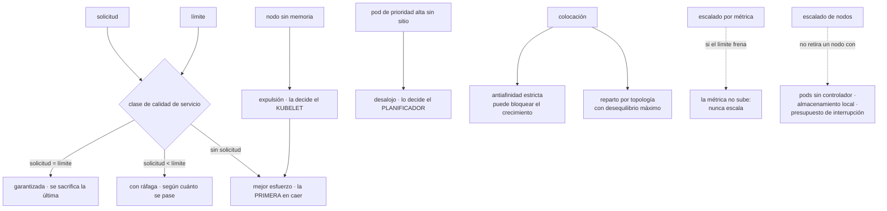

# 078 — Requests, limits, scheduling y autoscaling

> [← Clase anterior](../../part-06-kubernetes-managed-platforms/077-volumes-persistentvolumes-csi-y-statefulsets/README.md) · [Índice de la parte](../README.md) · [Clase siguiente →](../../part-06-kubernetes-managed-platforms/079-probes-rollouts-rollback-y-poddisruptionbudget/README.md)

**Parte:** 06 — Kubernetes y plataformas administradas<br>
**Nivel:** intermedio-avanzado · **Horas estimadas:** 4<br>
**Laboratorio:** `capacity` · **Estado:** `EXECUTABLE_CORE`

## 🎯 Propósito

Decidir cuánto pide cada carga, dónde se coloca y cómo crece, que son tres problemas distintos con tres mecanismos distintos y una relación que produce sorpresas. La clase 063 explicó qué hace un límite; aquí se añade lo que solo existe en Kubernetes: **la relación entre lo solicitado y lo limitado decide a quién se sacrifica primero cuando el nodo se queda sin recursos**, y una regla de colocación demasiado estricta puede impedir que el sistema crezca aunque haya capacidad de sobra.

## 📚 Resultados de aprendizaje

Al finalizar podrás:

1. **Clasificar** una carga por su relación entre solicitud y límite, y saber qué implica en una expulsión.
2. **Distinguir** expulsión por presión del nodo de desalojo por prioridad, y quién decide cada una.
3. **Escribir** reglas de colocación que repartan sin bloquear el crecimiento.
4. **Configurar** escalado por métrica evitando que el propio límite impida que la métrica suba.
5. **Anticipar** por qué un nodo vacío no se retira y qué lo impide.

## 🧩 Conceptos centrales

| Concepto | Comprensión verificable |
|---|---|
| `clase de calidad de servicio` | Se deduce de la relación entre solicitud y límite. Decide el **orden de sacrificio** cuando el nodo se queda sin recursos, y no se declara: se calcula. |
| `expulsión por presión` | La decide el kubelet cuando al nodo le falta memoria o disco. Sacrifica primero a quien no pidió nada y a quien más se pasó de lo que pidió. |
| `desalojo por prioridad` | Lo decide el planificador: un pod de prioridad alta que no cabe **echa** a pods de prioridad menor. Es una decisión global, no del nodo. |
| `regla de reparto por topología` | Distribuye réplicas entre zonas o nodos con un desequilibrio máximo. Sustituye a la antiafinidad estricta, que bloquea el crecimiento. |
| `escalado por métrica` | Ajusta el número de réplicas hacia un objetivo. Si el límite de CPU frena el proceso, la métrica **no sube** y el escalado nunca se dispara. |
| `sobrecompromiso` | La suma de los límites de un nodo supera su capacidad. Es normal y deseable; lo que no puede superarla es la suma de las **solicitudes**. |

## 🧠 Modelo mental

Kubernetes es un sistema de reconciliación: declaras estado deseado y controladores reducen continuamente la diferencia con el estado observado.

Aplicado a esta clase, separa siempre cuatro planos: **intención** (qué necesita el usuario),
**configuración** (qué declaramos), **estado observado** (qué existe de verdad) y
**evidencia** (cómo sabemos que cumple). Confundirlos produce diseños que se ven correctos
en un diagrama pero fallan al operar.

## 🗺️ Flujo de razonamiento



## 📖 Desarrollo

### 1. La clase de servicio no se declara: se calcula

De la relación entre lo que un pod **pide** y lo que se le **permite** sale una clasificación que nadie escribe y que decide qué ocurre en el peor momento:

```text
todos los contenedores con solicitud = límite, en CPU y memoria
  → garantizada

al menos uno con solicitud, y solicitud < límite en algo
  → con ráfaga

ningún contenedor con solicitud ni límite
  → mejor esfuerzo
```

```bash
$ kubectl get pod tienda-7d4b9-x2k4p -o jsonpath='{.status.qosClass}'
Burstable
```

Y para qué sirve: cuando a un nodo le falta memoria, el kubelet **expulsa pods antes de que el núcleo empiece a matar procesos al azar**, y el orden es este:

```text
1. mejor esfuerzo             los primeros, siempre
2. con ráfaga que se ha pasado de su solicitud, ordenados por cuánto se pasaron
3. garantizada                los últimos, y solo si no queda otra
```

De ahí sale la regla operativa que este programa ya insinuó en la clase 063 y aquí se concreta:

```text
lo crítico          solicitud = límite en memoria: clase garantizada
lo importante       solicitud realista y límite con margen
lo prescindible     puede quedarse en mejor esfuerzo, a propósito
nada                sin solicitud por descuido
```

La última línea es la habitual: un pod sin solicitudes no es «flexible», es **el primero en caer**, y además engaña al planificador, que cree que no consume nada y coloca demasiadas cosas en ese nodo.

Y conviene separar dos mecanismos que se confunden porque ambos hacen desaparecer pods:

```text
expulsión por presión   la decide el KUBELET, mira su nodo,
                        actúa cuando falta memoria o disco
                        criterio: clase de servicio y exceso sobre la solicitud

desalojo por prioridad  lo decide el PLANIFICADOR, mira todo el clúster,
                        actúa cuando un pod importante no cabe en ningún sitio
                        criterio: prioridad declarada
```

Las clases de prioridad son una herramienta útil y peligrosa:

```yaml
apiVersion: scheduling.k8s.io/v1
kind: PriorityClass
metadata: {name: critico}
value: 1000000
preemptionPolicy: PreemptLowerPriority
globalDefault: false
```

Y la trampa es el valor por defecto global: si una clase alta se marca como predeterminada, **todo lo que no declare prioridad la hereda**, con lo que un trabajo por lotes puede desalojar pods de producción. La regla es tener pocas clases, ninguna predeterminada, y que el trabajo por lotes tenga prioridad **negativa**:

```text
crítico de plataforma      alta
producción                 media
por lotes y desarrollo     negativa: nunca desaloja, y es lo primero que se va
```

### 2. Colocar sin bloquear el crecimiento

Cuatro mecanismos deciden dónde va un pod, y su rigidez es lo que hay que calibrar:

```text
selector de nodo       el más simple: etiqueta exacta
afinidad               igual, con expresiones y con variante PREFERIDA
marcas y tolerancias   el nodo rechaza salvo que el pod lo tolere
                       — para nodos especiales: con acelerador, con licencia
reparto por topología  distribuye entre zonas o nodos con desequilibrio máximo
```

Y el error clásico está en la antiafinidad estricta, que parece la forma correcta de repartir réplicas:

```yaml
affinity:
  podAntiAffinity:
    requiredDuringSchedulingIgnoredDuringExecution:      # ← estricta
      - labelSelector: {matchLabels: {app: api}}
        topologyKey: kubernetes.io/hostname
```

Eso dice «nunca dos réplicas de `api` en el mismo nodo». Con tres nodos y tres réplicas funciona. Al escalar a cuatro:

```text
la cuarta réplica queda en Pending PARA SIEMPRE
0/3 nodes are available: 3 node(s) didn't satisfy pod anti-affinity rules
```

Y el escalado de nodos no lo arregla necesariamente, porque el nodo nuevo tarda minutos y mientras tanto el servicio no crece. Lo peor es que el fallo aparece **exactamente cuando hay más carga**, que es cuando se escala.

La forma moderna expresa la intención sin el bloqueo:

```yaml
topologySpreadConstraints:
  - maxSkew: 1
    topologyKey: topology.kubernetes.io/zone
    whenUnsatisfiable: DoNotSchedule        # entre zonas: exigente
    labelSelector: {matchLabels: {app: api}}
  - maxSkew: 1
    topologyKey: kubernetes.io/hostname
    whenUnsatisfiable: ScheduleAnyway       # entre nodos: preferencia
    labelSelector: {matchLabels: {app: api}}
```

La combinación dice lo que de verdad se quiere: **reparte entre zonas de forma estricta, porque una zona entera es un fallo real; reparte entre nodos si puedes, y si no, colócalo igual**. Con eso, escalar nunca se bloquea y el reparto sigue siendo bueno.

Y hay dos detalles que producen desequilibrios inesperados:

```text
las reglas se evalúan al PLANIFICAR, no después
  → un reparto correcto se desequilibra tras expulsiones y reinicios,
    y nadie lo recoloca
nodeAffinityPolicy y nodeTaintsPolicy
  → deciden si los nodos que el pod no puede usar cuentan para el reparto
```

El primero explica por qué un servicio que se desplegó bien acaba con cuatro réplicas en un nodo y una en otro después de unas semanas. Reequilibrar exige una herramienta aparte o un despliegue.

Y las **marcas y tolerancias** merecen una nota porque su uso más importante no es el reparto sino la operación: un nodo que se va a retirar se marca primero, con lo que deja de recibir pods nuevos sin expulsar los que tiene. Es la base de cualquier mantenimiento ordenado, y la clase 079 lo completa con el presupuesto de interrupción.

### 3. Tres escalados que pueden estorbarse

Hay tres ejes y conviene no mezclarlos:

```text
réplicas    escalado horizontal por métrica
tamaño      escalado vertical: ajusta solicitudes y límites
nodos       escalado del clúster: añade y retira máquinas
```

**El horizontal** calcula un objetivo con una fórmula simple:

```text
réplicas deseadas = ceil( réplicas actuales × métrica actual / métrica objetivo )
```

Y tiene un fallo característico que une esta clase con la 063: **si el límite de CPU frena el proceso, el uso nunca alcanza el objetivo**.

```text
objetivo: 70 % de la CPU solicitada
solicitud 500 m, límite 500 m
la carga sube, el proceso se frena al llegar al límite
el uso se queda en ~500 m = 100 % de la solicitud… pero medido sobre el LÍMITE
y con el paralelismo mal ajustado (clase 063), ni siquiera llega
→ la métrica no sube lo suficiente y el escalado no se dispara
```

La corrección tiene dos partes, y la primera es de la clase 063: ajustar el paralelismo del tiempo de ejecución a la cuota. La segunda es dar margen entre solicitud y límite para que el uso pueda subir por encima del objetivo.

Y los parámetros que evitan la oscilación, que es el otro fallo habitual:

```yaml
behavior:
  scaleUp:
    stabilizationWindowSeconds: 0
    policies: [{type: Percent, value: 100, periodSeconds: 30}]
  scaleDown:
    stabilizationWindowSeconds: 300      # espera 5 min antes de reducir
    policies: [{type: Percent, value: 25, periodSeconds: 60}]
```

La asimetría es deliberada y es la misma conclusión de la clase 029: **subir rápido y bajar despacio**. Reducir deprisa deja al servicio sin margen justo cuando la carga vuelve.

**El vertical** ajusta las solicitudes según el uso observado, y su conflicto hay que conocerlo:

```text
horizontal y vertical sobre la MISMA métrica se pelean
  el vertical sube la solicitud → el uso relativo baja → el horizontal reduce
  → oscilación
```

La combinación válida es horizontal por una métrica de negocio —peticiones por segundo, longitud de cola— y vertical para memoria, o simplemente usar el vertical en modo recomendación y aplicar sus cifras a mano, que es lo más común y lo más predecible.

**El de nodos** es reactivo y lento, y conviene saber sus tiempos:

```text
añadir   se dispara cuando hay pods en Pending que cabrían en un nodo nuevo
         → detección + arranque de máquina + registro: de 1 a 4 minutos
retirar  cuando un nodo está infrautilizado durante un plazo
         → y solo si TODOS sus pods se pueden mover
```

Y la segunda condición es la que explica los nodos casi vacíos que nunca se retiran. Un nodo **no se retira** si tiene:

```text
pods sin controlador que los recree                    (clase 074)
pods con almacenamiento local efímero                  (clase 064)
pods que un presupuesto de interrupción protege        (clase 079)
pods del propio sistema sin alternativa
pods con reglas de colocación que no se cumplen en otro sitio
```

```bash
$ kubectl -n kube-system logs deploy/cluster-autoscaler | grep -i 'scale down' | tail -3
node nodo-14 cannot be removed: pod informes-8f2 has local storage
```

Esa línea es el diagnóstico completo, y hay que buscarla antes de concluir que el escalado de nodos no funciona.

Y una alternativa que conviene conocer: en vez de grupos de nodos predefinidos, existen aprovisionadores que **eligen el tipo de máquina en función de los pods pendientes**. Reducen el desperdicio de forma notable y trasladan la decisión de tamaño de máquina desde una configuración estática a una respuesta a la demanda real.

### 4. Solicitar bien: la aritmética que casi nadie hace

La mayoría de los clústeres desperdician mucho, y no por falta de herramientas sino porque las solicitudes se ponen a ojo y nunca se revisan.

Las dos cifras que hay que mirar y casi nunca están juntas:

```bash
# lo que se ha reservado
$ kubectl describe node nodo-14 | sed -n '/Allocated resources/,/^$/p'
  Resource  Requests      Limits
  cpu       6400m (80%)   14200m (177%)
  memory    24Gi (75%)    41Gi (128%)

# lo que se usa de verdad
$ kubectl top node nodo-14
NAME      CPU(cores)   CPU%   MEMORY(bytes)   MEMORY%
nodo-14   1840m        23%    9100Mi          28%
```

Ochenta por ciento reservado y veintitrés usado. El nodo está lleno para el planificador y vacío de verdad, y no se puede colocar nada más en él.

La corrección es medir por carga y ajustar, con el mismo método de las clases 052 y 070:

```bash
$ kubectl top pods -n tienda --sort-by=cpu
# y, mejor, el percentil sobre dos semanas desde el sistema de métricas
```

```text
solicitud de CPU     ≈ percentil 50-70 del uso real
límite de CPU        con margen, o ninguno (clase 068), vigilando la limitación
solicitud de memoria ≈ percentil 95-99 del uso real
límite de memoria    = solicitud, o poco más: la memoria no se comprime
```

La asimetría entre CPU y memoria es deliberada y viene de la clase 063: **la CPU se frena y la memoria mata**. Se puede solicitar CPU por debajo del pico porque el peor caso es lentitud; no se puede solicitar memoria por debajo del pico porque el peor caso es una terminación.

Y el **sobrecompromiso** que se ve en la salida de arriba —límites al 177 %— es normal y deseable: no todas las cargas alcanzan su límite a la vez. Lo que no puede superar el 100 % es la suma de las **solicitudes**, porque eso es lo que el planificador reparte.

Dos herramientas de gobierno que hacen sostenible esto en un clúster compartido:

```yaml
# valores por defecto y topes por espacio de nombres
apiVersion: v1
kind: LimitRange
metadata: {name: por-defecto, namespace: tienda}
spec:
  limits:
    - type: Container
      default: {cpu: 500m, memory: 512Mi}
      defaultRequest: {cpu: 100m, memory: 256Mi}
      max: {cpu: "4", memory: 8Gi}
---
# techo total del espacio de nombres
apiVersion: v1
kind: ResourceQuota
metadata: {name: total, namespace: tienda}
spec:
  hard:
    requests.cpu: "40"
    requests.memory: 80Gi
    persistentvolumeclaims: "20"
```

El primero elimina la clase de mejor esfuerzo por descuido: cualquier contenedor sin solicitudes recibe las predeterminadas. El segundo impide que un equipo consuma la capacidad de todos, y tiene un efecto secundario que conviene anticipar: **con una cuota activa, un pod sin solicitudes se rechaza**, lo que obliga a declararlas y es exactamente lo que se busca.

Y el ahorro que produce esta revisión suele ser grande, porque el desperdicio se acumula: cada servicio pide de más «por si acaso» y nadie suma.

### 5. Ver el conjunto antes de tocar nada

Con tres escalados, cinco mecanismos de colocación y dos de gobierno, conviene tener un orden de diagnóstico para cuando algo no se coloca o no crece.

```text
síntoma: un pod no arranca
  1. ¿el planificador dice por qué?      describe → sucesos, con el recuento
                                          de nodos descartados por motivo
  2. ¿es capacidad o es una regla?        "Insufficient" frente a
                                          "didn't satisfy" o "untolerated taint"
  3. si es capacidad, ¿está el escalado
     de nodos funcionando?                sus registros dicen qué evalúa

síntoma: el servicio no escala
  1. ¿el objeto de escalado ve la métrica?  describe hpa → "unknown" es
                                            el fallo más común
  2. ¿la métrica puede subir?               ¿la limita el propio límite?
  3. ¿hay tope de réplicas o cuota?

síntoma: hay nodos casi vacíos que no se retiran
  1. los registros del escalado de nodos dicen qué pod lo impide
  2. casi siempre: almacenamiento local, sin controlador,
     o presupuesto de interrupción
```

La primera comprobación del segundo bloque merece detalle porque es la que más tiempo consume:

```bash
$ kubectl describe hpa api
Metrics:
  resource cpu on pods (as a percentage of request):  <unknown> / 70%
Conditions:
  AbleToScale     True
  ScalingActive   False   FailedGetResourceMetric
```

`<unknown>` significa que no hay fuente de métricas, o que el pod **no declara solicitudes** —sin solicitud no hay porcentaje sobre el que calcular—. Las dos causas son frecuentes y ninguna produce un error visible en el despliegue: el objeto existe, parece configurado y no escala nunca. Sexta aparición de la familia de fallos de la clase 060.

Y tres métricas que deberían estar en el panel de cualquier clúster y rara vez están completas:

```text
solicitudes reservadas frente a uso real, por nodo y por espacio de nombres
  → detecta el desperdicio antes de que alguien pida más nodos
pods en Pending por motivo
  → distingue falta de capacidad de reglas de colocación imposibles
nodos que el escalado no puede retirar, con el motivo
  → explica la factura que no baja
```

La tercera es la que convierte una discusión recurrente —«el clúster no reduce»— en un dato con nombre.

Y un cierre que conecta con la clase siguiente: todo lo de aquí decide **dónde y cuántos**. Lo que decide **cuándo se puede mover** —cuántas réplicas pueden estar fuera a la vez durante un mantenimiento o una actualización— es el presupuesto de interrupción, y es la pieza que hace que un nodo se pueda vaciar sin cortar el servicio. Sin él, todo lo anterior funciona y cualquier operación rutinaria sigue siendo arriesgada.

## 🔬 Ejemplo trabajado

**CloudShop lleva seis meses en el clúster. La factura crece, el escalado automático no reduce nada y un incidente de memoria tumba el servicio equivocado. Los cinco hallazgos comparten causa: nadie había hecho la aritmética.**

**Hallazgo 1 — el nodo lleno que estaba vacío.**

```text
solicitudes reservadas en el clúster       78 %
uso real medio                             21 %
nodos                                      24
```

La revisión por servicio, con dos semanas de percentiles:

```text                         solicitud   uso p95    ajustada
api                CPU           2000m       340m       500m
                   memoria       4Gi         1,1Gi      1,5Gi
catalogo           CPU           1000m       180m       300m
                   memoria       2Gi         720Mi      1Gi
informes           CPU           4000m      3100m      3500m
                   memoria       8Gi         6,4Gi      7Gi     ← este sí
```

```text                                        antes            después
solicitudes reservadas                        78 %             34 %
nodos                                          24               11
costo mensual de cómputo                    3.180 USD        1.460 USD
rango de límites por espacio de nombres     ninguno          definido
cuota por espacio de nombres                ninguna          definida
```

Trece nodos menos sin tocar la aplicación. El desperdicio se había acumulado servicio a servicio, cada uno pidiendo de más «por si acaso», y nadie sumaba.

**Hallazgo 2 — la expulsión que se llevó al servicio equivocado.**

Un nodo se quedó sin memoria y el kubelet expulsó pods. Cayó el servicio de pagos y sobrevivió un trabajo por lotes.

```bash
$ kubectl get pod pagos-7d4 -o jsonpath='{.status.qosClass}'
BestEffort
$ kubectl get pod lote-9c2 -o jsonpath='{.status.qosClass}'
Guaranteed
```

El servicio crítico no declaraba solicitudes —así que era el primero en la lista de sacrificio— y el trabajo por lotes las declaraba iguales al límite, con lo que era el último.

```text                                        antes            después
pagos                                    mejor esfuerzo    garantizada
trabajo por lotes                        garantizada       con ráfaga,
                                                           prioridad negativa
pods en mejor esfuerzo en producción         7                 0
rango de límites que impide pods sin
  solicitudes                              no había          activo
```

**Hallazgo 3 — el escalado que nunca se disparó.**

```bash
$ kubectl describe hpa api | grep -A1 Metrics
Metrics:
  resource cpu on pods (as a percentage of request):  <unknown> / 70%
```

Dos causas a la vez: la fuente de métricas no estaba desplegada en ese espacio de nombres, y los pods de `api` no declaraban solicitud de CPU, con lo que no había base para el porcentaje. El objeto existía desde hacía cuatro meses y **no había escalado nunca**.

```text                                        antes            después
fuente de métricas                        parcial          en todo el clúster
solicitudes declaradas                       no                 sí
objetivo de escalado                       CPU 70 %      peticiones por segundo
ventana de estabilización al reducir      por defecto        300 s
veces que escaló en 4 meses                    0            41 en el primero
```

El cambio de métrica fue el importante: con el límite de CPU frenando el proceso (clase 063), el uso nunca llegaba al objetivo aunque la latencia se disparara.

**Hallazgo 4 — la cuarta réplica que nunca arrancaba.**

```text
0/11 nodes are available: 11 node(s) didn't satisfy pod anti-affinity rules.
```

Antiafinidad estricta por nodo con once nodos y once réplicas ya colocadas. Al escalar a doce, la última quedaba pendiente para siempre — y ocurría en los picos, que es cuando el escalado se dispara.

```text                                        antes            después
regla                          antiafinidad estricta   reparto por topología
zonas                              sin regla          desequilibrio máximo 1,
                                                       estricto
nodos                          nunca dos por nodo     preferencia, no bloqueo
réplicas bloqueadas en los picos       1-3                  0
```

**Hallazgo 5 — nueve nodos al 12 % que no se retiraban.**

```bash
$ kubectl -n kube-system logs deploy/cluster-autoscaler | grep 'cannot be removed' \
  | sed 's/.*pod //' | awk '{print $2, $3, $4}' | sort | uniq -c
      6 has local storage
      3 not replicated
```

Seis nodos retenidos por pods con almacenamiento local efímero —un directorio temporal declarado como volumen del nodo— y tres por pods creados sueltos, sin controlador (clase 074).

```text                                        antes            después
pods con almacenamiento local del nodo         6            0 (montaje en memoria)
pods sin controlador                           3            0
nodos que el escalado no podía retirar         9            0
nodos en horas valle                          11            4
costo mensual tras esta corrección        1.460 USD        980 USD
```

**Resumen:**

```text                                          antes         después
solicitudes reservadas                          78 %           34 %
nodos en horas valle                             24              4
pods en mejor esfuerzo en producción              7              0
escalados automáticos en 4 meses                  0             41/mes
réplicas bloqueadas por reglas de colocación    1-3              0
nodos que el escalado no podía retirar            9              0
costo mensual de cómputo                     3.180 USD        980 USD
```

**La lección que esta clase traslada al resto de la parte 06**: los cinco hallazgos existían desde el primer día y ninguno producía un error. El clúster funcionaba, el objeto de escalado existía, las reglas de colocación estaban puestas y la factura crecía. **Lo único que faltaba era sumar**: solicitado frente a usado, réplicas frente a nodos disponibles, y qué pod impide retirar cada máquina. Las tres cuentas caben en tres órdenes, y ninguna estaba en ningún panel.

## 🧪 Laboratorio guiado

Ejecuta desde la raíz:

```bash
python classes/part-06-kubernetes-managed-platforms/078-requests-limits-scheduling-y-autoscaling/lab.py
```

El laboratorio selecciona el motor de práctica **`capacity`** y produce
`lab_result.json`. El escenario, sus comprobaciones y el artefacto esperado corresponden a
esta clase; no requiere credenciales y deja explícito qué debe revalidarse en un sandbox real.

1. Lee `exercise.steps` y formula una predicción antes de ejecutar.
2. Ejecuta la práctica y verifica todos los elementos de `checks`.
3. Provoca el caso de `negative_test` y explica la señal observada.
4. Materializa `capacidad-kubernetes` en `evidence/` usando la plantilla indicada.
5. Para proveedor real, sigue `sandbox.requires`, registra costo y ejecuta `destroy`.

### Evidencia esperada

El artefacto principal es requests, límites y una decisión de escalado medida. Además, la entrega debe incluir el comando ejecutado,
la salida estructurada y una conclusión que no exceda lo observado.

## 🏆 Reto verificable

Construye **`capacidad-kubernetes`** para el caso CloudShop. Incluye una alternativa descartada,
un supuesto que pueda falsarse, una prueba de fallo y una decisión de rollback.

## ✅ Criterio de aceptación

- [ ] `lab.py` termina con código 0 y genera JSON válido.
- [ ] La entrega conecta al menos tres requisitos con mecanismos verificables.
- [ ] Existe una prueba positiva y una prueba negativa con evidencia.
- [ ] Seguridad, costo y operación aparecen como decisiones, no como anexos.
- [ ] Se declara una limitación y una condición que obligaría a revisar el diseño.
- [ ] Otra persona puede repetir el recorrido sin conocimiento tácito.

## ⚠️ Errores frecuentes

| Síntoma | Causa probable | Corrección |
|---|---|---|
| Una expulsión por falta de memoria se lleva el servicio crítico y respeta a un trabajo por lotes | El crítico no declaraba solicitudes —clase de mejor esfuerzo— y el lote sí | Solicitud igual a límite en memoria para lo crítico, prioridad negativa para el lote y un rango de límites que impida pods sin solicitudes. |
| El escalado por métrica no se dispara nunca | No hay fuente de métricas o los pods no declaran solicitudes, así que la métrica es desconocida | Comprueba el estado del objeto de escalado; declara solicitudes y escala por una métrica de negocio si el límite de CPU frena el proceso. |
| Al escalar, una réplica queda en Pending para siempre | Antiafinidad estricta por nodo con tantas réplicas como nodos | Usa reparto por topología: estricto entre zonas y como preferencia entre nodos. |
| Hay nodos casi vacíos que el escalado no retira | Contienen pods con almacenamiento local, sin controlador o protegidos por un presupuesto de interrupción | Lee los registros del escalado, que nombran el pod concreto, y corrige la causa en la carga. |
| El clúster está lleno para el planificador y vacío en uso real | Las solicitudes se pusieron a ojo y nunca se revisaron | Ajusta con percentiles medidos: CPU sobre el percentil medio, memoria sobre el alto, y pon cuotas por espacio de nombres. |
| Un trabajo por lotes desaloja pods de producción | Una clase de prioridad alta está marcada como predeterminada global | Ninguna clase predeterminada, pocas clases, y prioridad negativa para lo prescindible. |

## 🛡️ Seguridad, ética y costo

Trabaja con cuentas propias o sandboxes autorizados. No publiques secretos, identificadores
reales ni datos personales. Antes de crear recursos pagos define presupuesto, etiquetas y
comando de destrucción; después verifica que no queden recursos huérfanos. Los ejemplos
locales enseñan contratos, pero no certifican cumplimiento ni disponibilidad de producción.

## ❓ Preguntas de comprobación

1. ¿Cómo se calcula la clase de calidad de servicio y en qué orden se sacrifican las cargas?
2. ¿Qué diferencia hay entre expulsión por presión y desalojo por prioridad, y quién decide cada una?
3. ¿Por qué la antiafinidad estricta bloquea el crecimiento y qué la sustituye?
4. ¿Por qué el escalado por CPU puede no dispararse nunca aunque el servicio esté saturado?
5. Enumera tres motivos por los que un nodo casi vacío no se retira, y cómo se averigua cuál es.

## 🔗 Referencias

- Kubernetes (2025). *Quality of Service classes* — cómo se calculan y su papel en la expulsión. <https://kubernetes.io/docs/concepts/workloads/pods/pod-qos/>
- Kubernetes (2025). *Node-pressure eviction* — señales del kubelet y orden de sacrificio. <https://kubernetes.io/docs/concepts/scheduling-eviction/node-pressure-eviction/>
- Kubernetes (2025). *Pod topology spread constraints* — desequilibrio máximo y comportamiento al no poder cumplirse. <https://kubernetes.io/docs/concepts/scheduling-eviction/topology-spread-constraints/>
- Kubernetes (2025). *Horizontal Pod Autoscaler* — fórmula, comportamiento y ventanas de estabilización. <https://kubernetes.io/docs/tasks/run-application/horizontal-pod-autoscale/>
- Kubernetes autoscaler (2025). *Cluster Autoscaler FAQ* — qué impide retirar un nodo. <https://github.com/kubernetes/autoscaler/blob/master/cluster-autoscaler/FAQ.md>
- Documentación oficial vigente del servicio implementado; registra URL y fecha de consulta.

---

> [Evaluación](assessment.md) · [Contrato de clase](lesson.yaml) · [Índice de la parte](../README.md)
