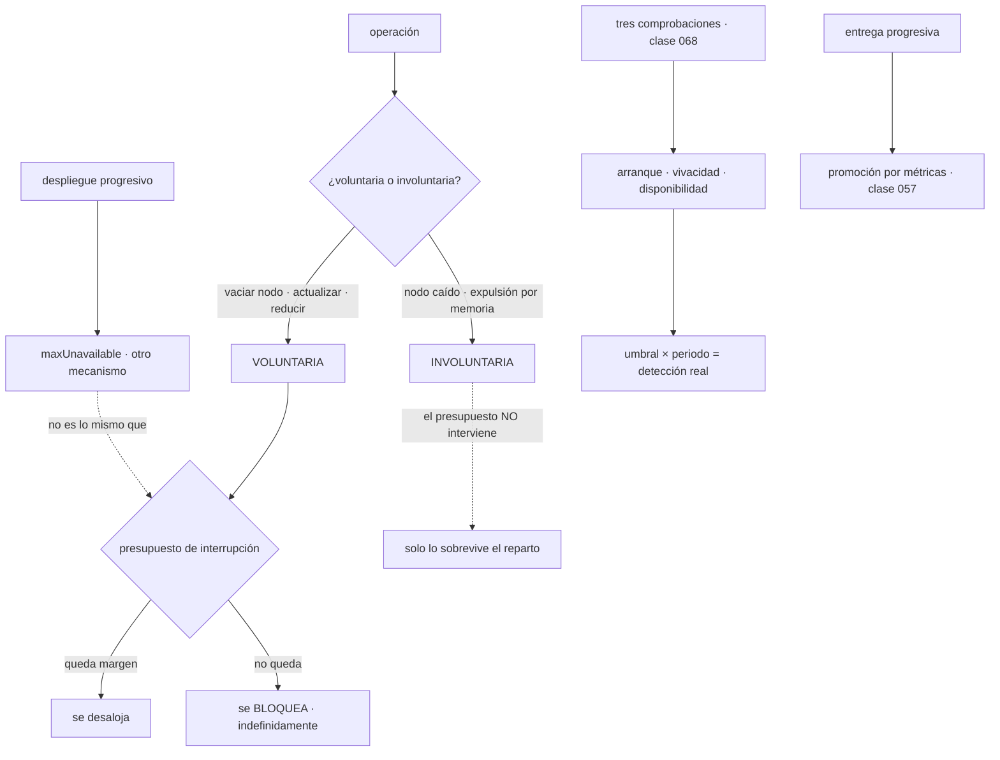

# 079 — Probes, rollouts, rollback y PodDisruptionBudget

> [← 078 · Requests, limits, scheduling y autoscaling](../../part-06-kubernetes-managed-platforms/078-requests-limits-scheduling-y-autoscaling/README.md) · [Índice de la parte](../README.md) · [080 · Namespaces, RBAC, NetworkPolicy y admission →](../../part-06-kubernetes-managed-platforms/080-namespaces-rbac-networkpolicy-y-admission/README.md)

**Parte:** 06 — Kubernetes y plataformas administradas<br>
**Nivel:** intermedio-avanzado · **Horas estimadas:** 4<br>
**Laboratorio:** `reliability` · **Estado:** `EXECUTABLE_CORE`

## 🎯 Propósito

Hacer que las operaciones rutinarias —desplegar, vaciar un nodo, actualizar el clúster— no corten el servicio, que es lo que separa un clúster que funciona de uno que se puede operar. La clase 068 dejó el contrato de la aplicación; aquí se añade el objeto que Kubernetes aporta y que nadie configura bien a la primera: **el presupuesto de interrupción**, que protege de las operaciones voluntarias y de nada más, y que mal puesto **impide actualizar el clúster durante semanas** sin que nadie relacione una cosa con la otra.

## 📚 Resultados de aprendizaje

Al finalizar podrás:

1. **Traducir** las tres comprobaciones de la clase 068 a su forma en Kubernetes y calcular sus plazos.
2. **Distinguir** interrupción voluntaria de involuntaria y saber qué protege un presupuesto.
3. **Fijar** un presupuesto que permita vaciar nodos sin cortar el servicio.
4. **Vaciar** un nodo de forma ordenada y diagnosticar qué lo bloquea.
5. **Reconocer** qué no deshace una vuelta atrás y cómo se compensa.

## 🧩 Conceptos centrales

| Concepto | Comprensión verificable |
|---|---|
| `interrupción voluntaria` | La que provoca alguien: vaciar un nodo, actualizar, reducir el clúster. Es la única que un presupuesto de interrupción puede frenar. |
| `interrupción involuntaria` | La que ocurre sola: un nodo que se cae, una expulsión por falta de memoria. **Ningún presupuesto la evita**, y es la que hay que sobrevivir con réplicas repartidas. |
| `presupuesto de interrupción` | Cuántas réplicas pueden estar fuera a la vez por una operación voluntaria. Mal puesto, bloquea toda operación de mantenimiento de forma indefinida. |
| `vaciado de nodo` | Marcar el nodo para que no reciba pods y desalojar los que tiene, respetando los presupuestos. Es la base de cualquier mantenimiento. |
| `umbral de fallo` | Número de comprobaciones fallidas antes de actuar. Multiplicado por el periodo da el tiempo real de detección, que casi nunca es el que se cree. |
| `entrega progresiva` | Aumentar el tráfico de una versión nueva según métricas y no según el reloj, con vuelta atrás automática si el presupuesto de error se consume. |

## 🧠 Modelo mental

Kubernetes es un sistema de reconciliación: declaras estado deseado y controladores reducen continuamente la diferencia con el estado observado.

Aplicado a esta clase, separa siempre cuatro planos: **intención** (qué necesita el usuario),
**configuración** (qué declaramos), **estado observado** (qué existe de verdad) y
**evidencia** (cómo sabemos que cumple). Confundirlos produce diseños que se ven correctos
en un diagrama pero fallan al operar.

## 🗺️ Flujo de razonamiento



## 📖 Desarrollo

### 1. Las tres comprobaciones, con su aritmética

La clase 068 estableció qué pregunta responde cada comprobación. En Kubernetes se declaran así, y lo que hay que calcular es el tiempo real de cada decisión:

```yaml
startupProbe:
  httpGet: {path: /healthz, port: 8080}
  periodSeconds: 5
  failureThreshold: 30        # tolera 150 s de arranque
livenessProbe:
  httpGet: {path: /healthz, port: 8080}
  periodSeconds: 10
  timeoutSeconds: 3
  failureThreshold: 3         # detecta un atasco en 30 s
readinessProbe:
  httpGet: {path: /readyz, port: 8080}
  periodSeconds: 5
  timeoutSeconds: 2
  failureThreshold: 2         # sale de rotación en 10 s
  successThreshold: 1
```

```text
tiempo real de detección = periodo × umbral de fallo
y hay que sumarle el tiempo de espera si la comprobación se cuelga
```

Dos errores de aritmética que producen incidentes:

```text
tiempo de espera mayor que el periodo
  una comprobación cada 5 s con espera de 10 s se solapa consigo misma
  → bajo carga, fallos que no corresponden a nada

umbral de vivacidad demasiado bajo
  2 fallos con periodo de 5 s reinicia a los 10 s
  → una pausa de recolección de basura de 12 s reinicia el proceso
```

El segundo es especialmente traicionero porque **empeora bajo carga**, que es cuando menos conviene reiniciar. La regla práctica: la vivacidad debe tolerar la peor pausa conocida del tiempo de ejecución, con margen.

Los cuatro tipos de sonda, y cuándo usa cada uno:

```text
HTTP        lo habitual; el código 200-399 es sano
TCP         solo comprueba que el puerto acepta: sirve para lo que no habla HTTP
ejecución   ejecuta una orden dentro; cuesta más y no existe en imágenes
            sin intérprete (clase 062)
gRPC        nativa, sin necesidad de un binario auxiliar
```

La tercera merece una advertencia doble: consume recursos en cada ejecución y **no funciona en una imagen mínima**. Es una de las pocas fricciones reales del endurecimiento de la parte 05, y la salida es la sonda nativa del protocolo o un punto HTTP mínimo en la aplicación.

Y el apagado ordenado de la clase 068, en su forma de Kubernetes:

```yaml
lifecycle:
  preStop:
    exec: {command: ["/bin/sleep", "6"]}
terminationGracePeriodSeconds: 45
```

Con la cifra que la clase 075 midió: la espera depende del tamaño del clúster, y hay que volver a medirla cuando crece. Aquí la única aportación nueva es que el gancho previo a la parada **se ejecuta antes de la señal**, así que su duración se resta del plazo de gracia:

```text
plazo de gracia = duración del gancho previo + tiempo de apagado del proceso
45 s = 6 s de espera + hasta 39 s para terminar peticiones y cerrar
```

Si el gancho tarda más que el plazo, el proceso recibe la señal de matar **sin haber recibido nunca la de parada**.

### 2. Voluntaria e involuntaria: qué protege el presupuesto

Esta distinción es la que hace útil el objeto y la que casi nadie hace:

```text
VOLUNTARIA        la provoca alguien
  vaciar un nodo para mantenimiento
  actualizar la versión del clúster
  reducir el número de nodos
  → el presupuesto de interrupción PUEDE frenarla

INVOLUNTARIA      ocurre sola
  el nodo se apaga o pierde la red
  expulsión por falta de memoria (clase 078)
  el proceso muere
  → el presupuesto NO interviene en absoluto
```

De ahí se sigue lo que el objeto **no** hace, y conviene decirlo porque se espera de él:

```text
no impide que un nodo se caiga
no garantiza disponibilidad
no sustituye a repartir réplicas entre zonas
no controla el despliegue progresivo, que usa otro mecanismo
```

La última confunde con frecuencia: durante un despliegue, quien decide cuántas réplicas pueden faltar es `maxUnavailable` de la estrategia (clase 074), **no** el presupuesto. Son dos controles distintos para dos situaciones distintas, y hay que configurar ambos de forma coherente.

El objeto se declara así:

```yaml
apiVersion: policy/v1
kind: PodDisruptionBudget
metadata: {name: api}
spec:
  minAvailable: 2                  # o maxUnavailable: 1
  selector: {matchLabels: {app: api}}
```

Y tiene dos formas de estar mal puesto, con consecuencias opuestas.

**Demasiado estricto: bloquea el mantenimiento para siempre.**

```text
réplicas: 2 · minAvailable: 2
  → no se puede desalojar ninguna réplica, nunca
  → vaciar un nodo se queda esperando indefinidamente
  → la actualización del clúster no avanza
  → el escalado de nodos no puede reducir (clase 078)
```

Y lo peor es que **no produce ningún error visible**: la operación simplemente no termina, y quien la lanzó la interrumpe suponiendo que va lenta.

```bash
$ kubectl get pdb api
NAME   MIN AVAILABLE   ALLOWED DISRUPTIONS   AGE
api    2               0                     94d
```

La columna de interrupciones permitidas en cero durante noventa y cuatro días es el diagnóstico completo. Debería ser una alerta.

**Demasiado laxo o sin efecto: no protege nada.**

```yaml
selector: {matchLabels: {app: api}}      # y los pods llevan app.kubernetes.io/name
```

Un selector que no coincide con ningún pod crea un presupuesto que **protege un conjunto vacío**. El objeto existe, figura en el inventario y no hace nada — séptima aparición de la familia de fallos de la clase 060.

```bash
$ kubectl get pdb api -o jsonpath='{.status.currentHealthy} de {.status.expectedPods}'
0 de 0                                                                      ✗
```

La regla que evita los dos extremos:

```text
réplicas ≥ 3   →  maxUnavailable: 1     permite vaciar de uno en uno
réplicas = 2   →  maxUnavailable: 1     acepta operar con una durante el vaciado
réplicas = 1   →  NO poner presupuesto  y asumir que el mantenimiento corta;
                  si no se puede asumir, hacen falta más réplicas
```

Expresarlo como máximo indisponible en vez de como mínimo disponible tiene una ventaja: **sigue siendo correcto al escalar**. Un mínimo de 2 con 10 réplicas permite vaciar 8 a la vez, que casi nunca es lo que se quiere.

### 3. Vaciar un nodo, y qué lo bloquea

El mantenimiento de un nodo tiene una secuencia fija:

```bash
$ kubectl cordon nodo-14                       # deja de recibir pods nuevos
$ kubectl drain nodo-14 \
    --ignore-daemonsets \
    --delete-emptydir-data \
    --timeout=600s
# … mantenimiento …
$ kubectl uncordon nodo-14
```

Y las dos opciones del vaciado son avisos disfrazados:

```text
--ignore-daemonsets      los pods de conjunto de demonios no se desalojan
                         porque volverían a crearse en el mismo nodo
--delete-emptydir-data   hay pods con datos en almacenamiento efímero del nodo
                         y esos datos SE VAN A PERDER
```

La segunda merece pararse: la orden pide confirmación explícita porque va a destruir datos. Si aparece, alguien tiene datos donde la clase 064 dijo que no debía tenerlos.

Y el vaciado se bloquea por cuatro motivos, que son los mismos que impiden reducir el clúster (clase 078):

```text
un presupuesto sin margen              lo más frecuente
pods sin controlador que los recree     nadie los recrearía en otro sitio
pods con almacenamiento local           los datos se perderían
ninguna capacidad libre en otros nodos  el pod desalojado no cabe en ningún sitio
```

El diagnóstico es directo y conviene conocerlo porque el mensaje es claro:

```bash
$ kubectl drain nodo-14 --dry-run=server
error: cannot delete Pods with local storage (use --delete-emptydir-data): tienda/informes-8f2
error: cannot delete Pods not managed by ReplicationController… : tienda/depuracion-manual
```

El `--dry-run=server` antes de cualquier mantenimiento es la comprobación que evita descubrir el bloqueo a mitad de una ventana.

Y la **actualización del clúster** es exactamente esto repetido por cada nodo, con dos matices que definen su duración:

```text
nodos que se actualizan a la vez     configurable; con uno cada vez y 40 nodos,
                                     una actualización tarda horas
un presupuesto sin margen bloquea    el nodo 7 de 40, y la operación se detiene
                                     ahí, con el clúster a medias
```

La segunda situación es la peor de esta clase: **un clúster con la mitad de los nodos en una versión y la mitad en otra**, parado indefinidamente, porque un presupuesto de un servicio no deja avanzar. Y como el bloqueo no produce error, se descubre cuando alguien mira.

La comprobación preventiva, que debería ejecutarse antes de cualquier actualización:

```bash
$ kubectl get pdb -A -o custom-columns=\
NS:.metadata.namespace,NOMBRE:.metadata.name,PERMITIDAS:.status.disruptionsAllowed,\
SANOS:.status.currentHealthy,ESPERADOS:.status.expectedPods \
  | awk 'NR==1 || $3==0 || $5==0'
```

Esa orden lista dos cosas a la vez: los presupuestos que bloquean —cero interrupciones permitidas— y los que no protegen nada —cero pods esperados—. Las dos son incidentes latentes.

Y una precaución sobre los **nodos gestionados por el proveedor**: en las plataformas de la clase 083, la actualización de nodos la inicia el proveedor y respeta los presupuestos igual. Un presupuesto bloqueante puede dejar una actualización de seguridad del proveedor sin aplicar durante semanas, con el nodo ejecutando una versión con vulnerabilidades conocidas. Es la misma consecuencia con otro origen, y suele descubrirse en una auditoría.

### 4. Lo que una vuelta atrás no deshace

La clase 074 dejó el mecanismo: volver atrás es reescalar el conjunto de réplicas anterior, y funciona en segundos si la imagen está referenciada por huella. Lo que hay que añadir es qué queda fuera de ese mecanismo.

```text
la vuelta atrás DESHACE
  la versión del código y su configuración de plantilla

la vuelta atrás NO deshace
  las migraciones de esquema ya aplicadas
  los mensajes ya publicados con el formato nuevo
  los ficheros ya escritos con la estructura nueva
  los datos ya modificados por la versión nueva
```

De ahí que la disciplina de la clase 071 —cambios compatibles en ambos sentidos— no sea una recomendación sino el requisito que hace posible la vuelta atrás:

```text
expandir     añadir la columna nueva, que la versión vieja ignora
desplegar    la versión nueva escribe en ambas
esperar      hasta que la vuelta atrás ya no sea plausible
contraer     retirar lo viejo
```

Saltarse el paso de espera es lo que convierte una vuelta atrás de treinta segundos en un incidente de datos. Y la pregunta que hay que responder antes de cada despliegue es concreta: **«si vuelvo atrás dentro de una hora, ¿qué queda roto?»**. Si la respuesta no es «nada», el despliegue no es reversible y hay que tratarlo como tal.

Y para reducir el riesgo de los despliegues que sí son reversibles, la **entrega progresiva** conecta con la clase 057:

```text
despliegue por tiempo      10 % · esperar 10 min · 50 % · esperar · 100 %
                           el reloj no sabe si algo va mal

despliegue por métricas    10 % · comparar tasa de error y latencia con
                           la versión estable · promover o revertir
                           → la decisión la toma un dato
```

El mecanismo se apoya en el reparto por peso de la clase 075 y en el presupuesto de error de la clase 057, y su valor no es la automatización sino el criterio escrito:

```text
promover si     tasa de error del canario ≤ la de la estable
                percentil 95 dentro del 10 % de la estable
                sin excepciones nuevas en el agrupador de errores
revertir si     cualquiera de los tres falla
```

Es el mismo criterio que la clase 071 exigía escribir **antes** de empezar una migración, aplicado a cada despliegue. Y tiene el mismo beneficio: durante un despliegue todo el mundo tiene prisa, y un criterio decidido de antemano es lo único que resiste esa prisa.

Y dos operaciones del despliegue que conviene conocer:

```bash
$ kubectl rollout pause deploy/api      # congela el avance sin revertir
$ kubectl rollout resume deploy/api
```

Pausar es útil para observar un despliegue a medias con tráfico real en ambas versiones — un canario improvisado— y tiene un riesgo: un despliegue pausado y olvidado deja el servicio con dos versiones indefinidamente. Merece una alerta sobre despliegues que llevan demasiado tiempo sin completarse.

### 5. La lista que hace operable un clúster

Reuniendo lo de esta clase con las 068, 074 y 075, la lista por servicio queda así:

```text
☐ tres comprobaciones separadas, con la de vivacidad sin dependencias
☐ umbral por periodo calculado, y tiempo de espera menor que el periodo
☐ la vivacidad tolera la peor pausa conocida del tiempo de ejecución
☐ gancho previo a la parada mayor que la propagación medida (clase 075)
☐ plazo de gracia = gancho + apagado del proceso, con margen
☐ maxUnavailable en cero para servicios sin volumen de bloque
☐ presupuesto de interrupción con máximo indisponible, no mínimo disponible
☐ el selector del presupuesto coincide de verdad con los pods
☐ interrupciones permitidas mayores que cero, vigilado
☐ despliegue reversible, o declarado como no reversible
☐ criterios de promoción y de reversión escritos antes
```

Y las tres comprobaciones a nivel de clúster que conviene automatizar:

```bash
# 1. presupuestos que bloquean o que no protegen
$ kubectl get pdb -A -o json | jq -r '.items[]
  | select(.status.disruptionsAllowed == 0 or .status.expectedPods == 0)
  | "\(.metadata.namespace)/\(.metadata.name) permitidas=\(.status.disruptionsAllowed) esperados=\(.status.expectedPods)"'

# 2. servicios sin presupuesto con más de una réplica
$ kubectl get deploy -A -o json | jq -r '.items[]
  | select(.spec.replicas > 1) | "\(.metadata.namespace)/\(.metadata.name)"' \
  > con-replicas.txt

# 3. despliegues que llevan demasiado sin completarse
$ kubectl get deploy -A -o json | jq -r '.items[]
  | select(.status.conditions[]? | select(.type=="Progressing" and .status=="False"))
  | "\(.metadata.namespace)/\(.metadata.name)"'
```

Y el ensayo que demuestra que todo lo anterior funciona, que es el equivalente al despliegue con carga de la clase 068:

```bash
# vaciar un nodo con carga en curso
$ hey -z 5m -c 50 -q 20 https://tienda.example/api/pedidos > carga.txt &
$ kubectl drain nodo-14 --ignore-daemonsets --timeout=600s
$ kubectl uncordon nodo-14
$ grep -E '\[502\]|\[503\]|errors' carga.txt
```

Cero errores al vaciar un nodo bajo carga es el criterio, y hay que medirlo como se mide el despliegue. Un clúster donde vaciar un nodo produce errores es un clúster donde **cada actualización de seguridad tiene un coste de disponibilidad**, y eso lleva a retrasar actualizaciones — que es como se acumulan las vulnerabilidades de la clase 067.

## 🔬 Ejemplo trabajado

**CloudShop lleva cuatro meses sin actualizar el clúster. La actualización pendiente incluye una corrección de seguridad, y cada intento se queda a medias. Los cuatro hallazgos explican por qué, y el último cambia cómo se despliega.**

**Hallazgo 1 — la actualización se detenía en el nodo 7.**

```bash
$ kubectl drain nodo-07 --ignore-daemonsets --dry-run=server
Cannot evict pod as it would violate the pod's disruption budget: tienda/pagos
```

```bash
$ kubectl get pdb -A -o custom-columns=NS:.metadata.namespace,N:.metadata.name,\
PERMITIDAS:.status.disruptionsAllowed | awk '$3==0'
tienda    pagos      0
tienda    informes   0
plataforma  registro 0
```

Tres presupuestos con cero interrupciones permitidas. El de `pagos` llevaba 94 días así:

```text
réplicas: 2 · minAvailable: 2 → nunca se puede desalojar ninguna
```

```text                                        antes            después
expresión del presupuesto              minAvailable: 2   maxUnavailable: 1
réplicas de pagos                             2                 3
interrupciones permitidas                     0                 1
días sin poder actualizar el clúster        124                 —
duración de la actualización completa   no terminaba      3 h 40 min
alerta sobre presupuestos bloqueantes     ninguna        permitidas = 0 → aviso
```

Ciento veinticuatro días con una corrección de seguridad sin aplicar, porque un objeto de dos líneas bloqueaba en silencio.

**Hallazgo 2 — dos presupuestos que no protegían nada.**

```bash
$ kubectl get pdb -A -o json | jq -r '.items[] | select(.status.expectedPods == 0)
  | "\(.metadata.namespace)/\(.metadata.name)"'
tienda/catalogo
tienda/busqueda
```

Los selectores usaban `app:` y las plantillas habían migrado a `app.kubernetes.io/name:` — el mismo desajuste de etiquetas que la clase 075 encontró en un servicio.

```text                                        antes            después
presupuestos con selector sin coincidencias    2                 0
convención de etiquetas                    mezclada      una sola, validada
                                                          en la admisión
comprobación en la canalización            ninguna    falla si esperados = 0
```

Los dos servicios llevaban meses sin ninguna protección, con el objeto creado y visible en el inventario.

**Hallazgo 3 — vaciar un nodo cortaba el servicio.**

Con los presupuestos corregidos, el primer vaciado con carga en curso:

```text
errores durante el vaciado de nodo-07     1.284
```

Dos causas a la vez:

```bash
$ kubectl get deploy api -o jsonpath='{.spec.template.spec.terminationGracePeriodSeconds}'
30
$ kubectl get deploy api -o jsonpath='{.spec.template.spec.containers[0].lifecycle}'
(vacío)
```

No había gancho previo a la parada —la corrección de la clase 075 se había aplicado solo a `tienda`, no a `api`— y el plazo de gracia era menor que la petición más larga.

```text                                        antes            después
gancho previo a la parada                  ninguno            6 s
plazo de gracia                             30 s              45 s
errores al vaciar un nodo bajo carga        1.284               0
ensayo de vaciado en la verificación       no había      obligatorio, trimestral
```

**Hallazgo 4 — la vuelta atrás que no pudo volver.**

Un despliegue con un error de cálculo se revirtió a los veinte minutos. La vuelta atrás tardó 31 segundos y **el problema persistió**:

```text
la versión nueva había aplicado una migración que renombraba una columna
la versión anterior consultaba el nombre viejo
→ la vuelta atrás dejó el código antiguo contra el esquema nuevo
```

```text                                        antes            después
disciplina de cambios de esquema        renombrar       expandir y contraer
pregunta previa al despliegue           no se hacía   "si vuelvo atrás en 1 h,
                                                       ¿qué queda roto?"
despliegues declarados no reversibles         0        3 en el trimestre,
                                                       con procedimiento propio
tiempo de recuperación de ese incidente   2 h 10 min          —
```

Los tres despliegues declarados no reversibles son cambios de esquema que no se pueden hacer compatibles, y **tienen su propio procedimiento**: ventana anunciada, copia previa verificada y plan de reversión por restauración, no por reescalado.

**Y el cambio de método que salió de todo esto.**

```text                                        antes            después
promoción de un despliegue            por reloj        por métricas frente a
                                                        la versión estable
criterios escritos antes                 no                 sí, tres
reversiones automáticas                   0            4 en el trimestre,
                                                        todas correctas
tiempo medio de detección de un
  despliegue malo                       18 min            2 min 40 s
```

Las cuatro reversiones automáticas son el dato interesante: cuatro despliegues que habrían llegado al 100 % del tráfico y se detuvieron en el 10 %.

**Resumen:**

```text                                          antes         después
días sin poder actualizar el clúster           124              0
presupuestos que bloquean                        3              0
presupuestos que no protegen nada                2              0
errores al vaciar un nodo bajo carga          1.284             0
despliegues con criterio escrito                 0          todos
reversiones automáticas por métricas             0              4
tiempo de detección de un despliegue malo     18 min       2 min 40 s
```

**La lección que esta clase traslada al resto de la parte 06**: los dos hallazgos más caros —124 días sin actualizar y dos servicios sin protección— son el mismo tipo de fallo con signos opuestos, y ninguno producía un error. Un presupuesto demasiado estricto bloquea en silencio y uno mal dirigido protege en silencio a nadie. **La comprobación que detecta ambos es una sola orden**, y no estaba en ningún panel: interrupciones permitidas y pods esperados, las dos columnas, buscando ceros.

## 🧪 Laboratorio guiado

Ejecuta desde la raíz:

```bash
python classes/part-06-kubernetes-managed-platforms/079-probes-rollouts-rollback-y-poddisruptionbudget/lab.py
```

El laboratorio selecciona el motor de práctica **`reliability`** y produce
`lab_result.json`. El escenario, sus comprobaciones y el artefacto esperado corresponden a
esta clase; no requiere credenciales y deja explícito qué debe revalidarse en un sandbox real.

1. Lee `exercise.steps` y formula una predicción antes de ejecutar.
2. Ejecuta la práctica y verifica todos los elementos de `checks`.
3. Provoca el caso de `negative_test` y explica la señal observada.
4. Materializa `despliegue-resiliente` en `evidence/` usando la plantilla indicada.
5. Para proveedor real, sigue `sandbox.requires`, registra costo y ejecuta `destroy`.

### Evidencia esperada

El artefacto principal es un escenario de fallo con objetivo y recuperación medida. Además, la entrega debe incluir el comando ejecutado,
la salida estructurada y una conclusión que no exceda lo observado.

## 🏆 Reto verificable

Construye **`despliegue-resiliente`** para el caso CloudShop. Incluye una alternativa descartada,
un supuesto que pueda falsarse, una prueba de fallo y una decisión de rollback.

## ✅ Criterio de aceptación

- [ ] `lab.py` termina con código 0 y genera JSON válido.
- [ ] La entrega conecta al menos tres requisitos con mecanismos verificables.
- [ ] Existe una prueba positiva y una prueba negativa con evidencia.
- [ ] Seguridad, costo y operación aparecen como decisiones, no como anexos.
- [ ] Se declara una limitación y una condición que obligaría a revisar el diseño.
- [ ] Otra persona puede repetir el recorrido sin conocimiento tácito.

## ⚠️ Errores frecuentes

| Síntoma | Causa probable | Corrección |
|---|---|---|
| La actualización del clúster se queda a medias y no da ningún error | Un presupuesto de interrupción sin margen bloquea el vaciado de un nodo | Expresa el presupuesto como máximo indisponible, ten al menos tres réplicas en lo crítico y alerta cuando las interrupciones permitidas sean cero. |
| Un presupuesto existe y el servicio se queda sin réplicas en un mantenimiento | El selector no coincide con ninguna etiqueta de los pods | Comprueba que los pods esperados son mayores que cero y unifica la convención de etiquetas con validación en la admisión. |
| Vaciar un nodo produce errores aunque el despliegue no los produzca | Falta el gancho previo a la parada o el plazo de gracia es menor que la petición más larga | Aplica la corrección de la clase 068 a todos los servicios y ensaya el vaciado con carga como parte de la verificación. |
| Una vuelta atrás se completa y el problema persiste | La versión nueva aplicó un cambio de esquema que la anterior no entiende | Expandir y contraer con espera intermedia; y si no es posible, declarar el despliegue como no reversible con su propio procedimiento. |
| Un proceso se reinicia bajo carga sin motivo aparente | El umbral de la comprobación de vivacidad no tolera la peor pausa del tiempo de ejecución | Calcula periodo por umbral con margen sobre esa pausa, y asegúrate de que el tiempo de espera cabe en el periodo. |
| Un servicio lleva días con dos versiones sirviendo a la vez | Un despliegue quedó pausado y nadie lo retomó | Alerta sobre despliegues que llevan demasiado tiempo sin completarse. |

## 🛡️ Seguridad, ética y costo

Trabaja con cuentas propias o sandboxes autorizados. No publiques secretos, identificadores
reales ni datos personales. Antes de crear recursos pagos define presupuesto, etiquetas y
comando de destrucción; después verifica que no queden recursos huérfanos. Los ejemplos
locales enseñan contratos, pero no certifican cumplimiento ni disponibilidad de producción.

## ❓ Preguntas de comprobación

1. ¿Qué interrupciones frena un presupuesto y cuáles no, y qué implica eso para la disponibilidad real?
2. ¿Por qué expresar el presupuesto como máximo indisponible es mejor que como mínimo disponible?
3. ¿Qué cuatro motivos bloquean el vaciado de un nodo y con qué orden se comprueban antes de un mantenimiento?
4. ¿Qué no deshace una vuelta atrás, y qué disciplina la hace posible?
5. Calcula el tiempo real de detección de una vivacidad con periodo 10 s, umbral 3 y espera 3 s.

## 🔗 Referencias

- Kubernetes (2025). *Disruptions* — voluntarias e involuntarias, y alcance del presupuesto. <https://kubernetes.io/docs/concepts/workloads/pods/disruptions/>
- Kubernetes (2025). *Specifying a Disruption Budget* — expresión, selector y estado. <https://kubernetes.io/docs/tasks/run-application/configure-pdb/>
- Kubernetes (2025). *Safely drain a node* — secuencia, opciones y bloqueos. <https://kubernetes.io/docs/tasks/administer-cluster/safely-drain-node/>
- Kubernetes (2025). *Configure probes* — tipos, umbrales y tiempos de espera. <https://kubernetes.io/docs/tasks/configure-pod-container/configure-liveness-readiness-startup-probes/>
- Google (2018). *The Site Reliability Workbook*, cap. 16 — despliegue progresivo y criterios de promoción. <https://sre.google/workbook/canarying-releases/>
- Documentación oficial vigente del servicio implementado; registra URL y fecha de consulta.

---

> [Evaluación](assessment.md) · [Contrato de clase](lesson.yaml) · [Índice de la parte](../README.md)

**📥 Descargar:** [Parte 06 en PDF](../../../site/downloads/partes/manual-parte-06-kubernetes-managed-platforms.pdf) · [Manual integral](../../../site/downloads/multi-cloud-engineering-manual-v2.0.pdf)

| Anterior | Índice | Siguiente |
|---|---|---|
| [← 078 · Requests, limits, scheduling y autoscaling](../../part-06-kubernetes-managed-platforms/078-requests-limits-scheduling-y-autoscaling/README.md) | [Parte 06](../README.md) · [Programa](../../README.md) | [080 · Namespaces, RBAC, NetworkPolicy y admission →](../../part-06-kubernetes-managed-platforms/080-namespaces-rbac-networkpolicy-y-admission/README.md) |
