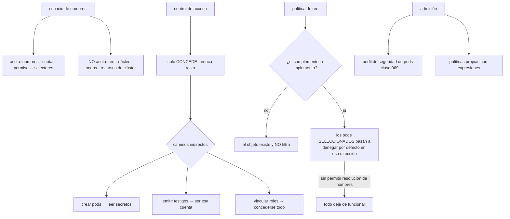

# 080 — Namespaces, RBAC, NetworkPolicy y admission

> [← 079 · Probes, rollouts, rollback y PodDisruptionBudget](../../part-06-kubernetes-managed-platforms/079-probes-rollouts-rollback-y-poddisruptionbudget/README.md) · [Índice de la parte](../README.md) · [081 · Helm, Kustomize y gestión de paquetes →](../../part-06-kubernetes-managed-platforms/081-helm-kustomize-y-gestion-de-paquetes/README.md)

**Parte:** 06 — Kubernetes y plataformas administradas<br>
**Nivel:** intermedio-avanzado · **Horas estimadas:** 4<br>
**Laboratorio:** `security` · **Estado:** `EXECUTABLE_CORE`

## 🎯 Propósito

Acotar quién puede hacer qué y quién puede hablar con quién dentro del clúster, que es la tercera fuga de la clase 072. Dos valores por defecto explican casi todos los problemas: **todos los pods pueden alcanzar a todos los pods**, en cualquier espacio de nombres, hasta que alguien escribe una política; y **una política de red no hace nada si el complemento de red no la implementa**, con el objeto creado y visible. La clase cierra además el patrón que este programa ha visto en cuatro plataformas: el permiso suma y lo que resta vive en otro sistema.

## 📚 Resultados de aprendizaje

Al finalizar podrás:

1. **Delimitar** qué acota un espacio de nombres y qué no, y por qué no es una frontera de seguridad fuerte.
2. **Conceder** permisos contando los caminos indirectos, no solo los directos.
3. **Escribir** políticas de red sabiendo que seleccionar un pod lo cambia a denegar por defecto.
4. **Comprobar** que las políticas se están aplicando de verdad, con una prueba negativa.
5. **Imponer** el endurecimiento de la clase 069 con admisión en vez de con revisiones manuales.

## 🧩 Conceptos centrales

| Concepto | Comprensión verificable |
|---|---|
| `espacio de nombres` | Ámbito para nombres, cuotas, permisos y selectores. **No aísla la red ni el núcleo**: es una frontera administrativa, no una de seguridad fuerte. |
| `permiso aditivo` | El control de acceso solo concede; no existe una regla que reste. Cuarta plataforma del programa con la misma propiedad, y la misma consecuencia: lo que acota vive en otro sistema. |
| `camino indirecto` | Permiso que concede acceso a algo distinto de lo que nombra: crear pods da acceso a los secretos del espacio; emitir testigos da la identidad de una cuenta de servicio. |
| `denegar por defecto por selección` | Una política de red no añade denegaciones al clúster: **cambia a denegar por defecto los pods que selecciona**, y solo en la dirección que declara. |
| `complemento de red que no implementa` | Si el complemento instalado no soporta políticas, el objeto se crea, se lista y **no filtra nada**. No hay ningún error. |
| `admisión de seguridad de pods` | Mecanismo integrado que rechaza o avisa sobre pods que no cumplen un perfil. Es el endurecimiento de la clase 069 impuesto por la plataforma. |

## 🧠 Modelo mental

Kubernetes es un sistema de reconciliación: declaras estado deseado y controladores reducen continuamente la diferencia con el estado observado.

Aplicado a esta clase, separa siempre cuatro planos: **intención** (qué necesita el usuario),
**configuración** (qué declaramos), **estado observado** (qué existe de verdad) y
**evidencia** (cómo sabemos que cumple). Confundirlos produce diseños que se ven correctos
en un diagrama pero fallan al operar.

## 🗺️ Flujo de razonamiento



## 📖 Desarrollo

### 1. Qué acota un espacio de nombres y qué no

El espacio de nombres se usa como si fuera una frontera de seguridad y no lo es. Lo que sí acota:

```text
nombres de objetos          dos servicios pueden llamarse igual en espacios distintos
cuotas y rangos de límites  clase 078
permisos                    un rol vale dentro de su espacio
selectores                  las políticas de red y los presupuestos seleccionan dentro
secretos y configuración    y quien pueda crear pods ahí, los lee (clase 076)
```

Lo que **no** acota, y es donde está el malentendido:

```text
la RED           por defecto, cualquier pod alcanza a cualquier pod
                 de cualquier espacio de nombres
el NÚCLEO        es uno solo para el nodo (clase 063)
los nodos        dos espacios pueden compartir la misma máquina
los recursos de clúster   nodos, volúmenes, definiciones de tipos, roles de clúster
```

La primera línea sorprende siempre y merece comprobarse una vez:

```bash
$ kubectl run t --rm -it -n desarrollo --image=nicolaka/netshoot -- \
    curl -s -m 3 http://bd.produccion.svc:5432 -o /dev/null -w '%{http_code}\n'
000                      # conecta: el puerto responde, no habla HTTP
```

Un pod de desarrollo alcanzando la base de datos de producción **sin ninguna configuración especial**. Es el equivalente de `AllowVnetInBound` de la clase 039 y de la ausencia de segmentación de la 051: la conectividad es el estado inicial y el aislamiento es trabajo explícito. Tercera plataforma con la misma propiedad.

De ahí se deduce cómo repartir espacios de nombres, que es por **quién los administra y qué políticas necesitan**, no por comodidad:

```text
uno por equipo y entorno        permisos, cuotas y políticas distintas
plataforma aparte               componentes compartidos, con permisos propios
lo no confiable, en otro sitio  ver más abajo
```

Y la honestidad sobre el aislamiento entre inquilinos, que conviene decir con claridad:

```text
espacios de nombres        suficiente entre equipos de la misma organización
                           que ejecutan código revisado
no suficiente              para código de terceros o de clientes:
                           comparten núcleo, nodos y plano de control
para eso                   clústeres separados, o aislamiento reforzado
                           (máquinas ligeras, núcleo en espacio de usuario,
                            clase 063)
```

Un clúster compartido por equipos de la misma empresa es un caso; ejecutar código arbitrario de clientes en espacios de nombres es otro, y el segundo exige lo de la tercera línea.

### 2. El permiso suma, y los tres caminos indirectos

El control de acceso de Kubernetes es **puramente aditivo**: hay reglas que conceden y no hay reglas que quiten. Cuarta plataforma del programa con la misma propiedad, después de AWS, Azure y Google Cloud, y ya se puede afirmar como regla general del oficio:

> **El permiso suma, y lo que resta vive en otro sistema con otro error.** Aquí ese otro sistema es la admisión.

Los objetos son cuatro y su combinación cubre todo:

```text
rol             permisos DENTRO de un espacio de nombres
rol de clúster  permisos sobre recursos de clúster, o plantilla reutilizable
vinculación     asocia un rol a un sujeto, dentro de un espacio
vinculación de clúster   lo mismo, en el clúster ENTERO
```

Y el error más caro es usar la cuarta cuando bastaba la tercera:

```bash
$ kubectl get clusterrolebindings -o json | jq -r '.items[]
  | select(.roleRef.name=="cluster-admin")
  | "\(.metadata.name): \(.subjects[]?.kind)/\(.subjects[]?.name)"'
```

Cualquier resultado inesperado ahí es administración total del clúster, incluida la lectura de todos los secretos de todos los espacios.

Y los **tres caminos indirectos**, que una auditoría que solo mire verbos directos no encuentra:

```text
1. crear pods en un espacio  →  leer todos sus secretos          (clase 076)
2. emitir testigos de una cuenta de servicio  →  actuar como ella
3. crear o vincular roles  →  concederse a uno mismo lo que quiera
```

El tercero tiene una protección integrada que conviene conocer porque a veces se desactiva: no se puede conceder un permiso que uno mismo no tiene, salvo que se tenga el verbo de escalada. Comprobar quién lo tiene es la pregunta correcta:

```bash
$ kubectl get clusterroles -o json | jq -r '.items[]
  | select(.rules[]? | (.verbs[]? == "escalate") or (.verbs[]? == "bind"))
  | .metadata.name'
```

Y las **cuentas de servicio** son la identidad de las cargas, con dos hechos que hay que fijar:

```text
cada pod tiene una, y si no se declara usa la predeterminada del espacio
el testigo se proyecta con caducidad corta y con audiencia declarada
```

El primero produce un exceso de permisos silencioso: la cuenta predeterminada la comparten todos los pods del espacio, así que cualquier permiso que se le conceda lo tienen todos. La higiene es dar una cuenta propia a cada carga y **desactivar el montaje automático** donde no hace falta:

```yaml
spec:
  serviceAccountName: api
  automountServiceAccountToken: false      # si la carga no habla con la API
```

La mayoría de las aplicaciones no hablan con la API de Kubernetes, así que la mayoría no necesita ningún testigo montado. Quitarlo elimina una credencial de dentro del contenedor, que es lo que un atacante busca primero.

Y la conexión con las partes 02 a 04: la cuenta de servicio del clúster puede **federarse con la identidad de la nube**, de modo que el pod obtiene credenciales del proveedor sin ninguna clave. Es el mismo contrato de las clases 026, 038, 050 y 069, aplicado por séptima vez:

```yaml
metadata:
  annotations:
    # la anotación concreta depende del proveedor (clase 083)
    identidad-nube/rol: "arn:…:role/api-tienda"
```

Y con la misma condición crítica de siempre: **la confianza del lado de la nube tiene que estar acotada al espacio de nombres y a la cuenta concretos**. Sin acotar, cualquier pod del clúster puede pedir esa identidad.

### 3. Una política de red no deniega: cambia el modo del pod

Este es el concepto peor entendido de la clase y produce dos errores opuestos.

```text
sin ninguna política                todos los pods se alcanzan entre sí
con una política que SELECCIONA un pod
  ese pod pasa a DENEGAR POR DEFECTO en la dirección que la política declare
  y solo se permite lo que la propia política (o otra) autorice
```

Es decir: **la política no añade una prohibición; cambia el modo de los pods que selecciona**. Y solo en su dirección: una política de entrada no afecta a la salida.

La consecuencia práctica es que el primer objeto que hay que escribir en un espacio de nombres es el que lo cierra:

```yaml
apiVersion: networking.k8s.io/v1
kind: NetworkPolicy
metadata: {name: denegar-todo, namespace: tienda}
spec:
  podSelector: {}            # todos los pods del espacio
  policyTypes: [Ingress, Egress]
```

Sin reglas, eso deja el espacio cerrado en ambas direcciones. Y a partir de ahí se abre lo necesario:

```yaml
apiVersion: networking.k8s.io/v1
kind: NetworkPolicy
metadata: {name: api-permitido, namespace: tienda}
spec:
  podSelector: {matchLabels: {app: api}}
  policyTypes: [Ingress, Egress]
  ingress:
    - from:
        - podSelector: {matchLabels: {app: web}}
        - namespaceSelector: {matchLabels: {kubernetes.io/metadata.name: red}}
          podSelector: {matchLabels: {app: entrada}}
      ports: [{protocol: TCP, port: 8080}]
  egress:
    - to: [{podSelector: {matchLabels: {app: bd}}}]
      ports: [{protocol: TCP, port: 5432}]
    - to:
        - namespaceSelector: {matchLabels: {kubernetes.io/metadata.name: kube-system}}
          podSelector: {matchLabels: {k8s-app: kube-dns}}
      ports: [{protocol: UDP, port: 53}, {protocol: TCP, port: 53}]
```

Esa última regla es la que se olvida siempre y produce el incidente más desconcertante: **una política de salida sin permitir la resolución de nombres rompe absolutamente todo**, incluidos los destinos que la propia política permite, porque el pod no puede resolver sus nombres.

```text
síntoma   "permití la base de datos y sigue sin conectar"
causa     no puede resolver bd.tienda.svc
```

Y una precisión sobre los selectores que produce reglas más abiertas de lo previsto:

```yaml
# DOS orígenes: cualquier pod del espacio red, O cualquier pod con app=web
from:
  - namespaceSelector: {matchLabels: {name: red}}
  - podSelector: {matchLabels: {app: web}}

# UN origen: pods con app=entrada DENTRO del espacio red
from:
  - namespaceSelector: {matchLabels: {name: red}}
    podSelector: {matchLabels: {app: entrada}}
```

La diferencia es un guion. La primera forma es mucho más permisiva de lo que la mayoría pretende escribir.

Y el fallo silencioso de esta clase, octava aparición de la familia de la clase 060:

```text
si el complemento de red instalado NO implementa políticas,
el objeto se crea, se lista, aparece en el inventario
y NO FILTRA NADA
```

No hay error, no hay aviso, y el panel de cumplimiento dice que el espacio está segmentado. La única forma de saberlo es **probarlo**:

```bash
$ kubectl run atacante --rm -it -n desarrollo --image=nicolaka/netshoot -- \
    nc -zv bd.tienda.svc 5432
nc: connect to bd.tienda.svc port 5432 (tcp) failed: Connection timed out    ✓
```

Esa prueba negativa debería estar en el guion de verificación y ejecutarse en cada clúster, porque el complemento de red puede cambiar en una migración.

### 4. Imponer el endurecimiento en vez de revisarlo

La clase 069 dejó una lista de once puntos de endurecimiento. Revisarla a mano en cada pull request no escala; imponerla en la admisión sí.

El mecanismo integrado son los **perfiles de seguridad de pods**, con tres niveles:

```text
privilegiado  sin restricciones
base          impide lo obviamente peligroso: modo privilegiado, espacios
              de nombres del anfitrión, capacidades peligrosas
restringido   además: sin privilegios, sin capacidades salvo una,
              sin elevación, perfil de llamadas al sistema declarado
```

Y se aplican por espacio de nombres, con tres modos que permiten adoptarlo sin romper nada:

```yaml
apiVersion: v1
kind: Namespace
metadata:
  name: tienda
  labels:
    pod-security.kubernetes.io/enforce: restricted
    pod-security.kubernetes.io/enforce-version: latest
    pod-security.kubernetes.io/warn: restricted
    pod-security.kubernetes.io/audit: restricted
```

```text
audit    lo registra y lo permite      → para medir el tamaño del problema
warn     avisa a quien lo despliega    → para que los equipos lo vean
enforce  lo rechaza                    → cuando el inventario ya cumple
```

Es exactamente la secuencia que este programa ha aplicado en tres nubes: **inventariar, corregir y después imponer**. Empezar por el modo de rechazo bloquea despliegues legítimos y termina con la etiqueta quitada «temporalmente».

Y el perfil restringido exige justo lo de la clase 069, lo que cierra el círculo:

```yaml
securityContext:
  runAsNonRoot: true
  runAsUser: 10001
  allowPrivilegeEscalation: false
  capabilities: {drop: [ALL]}
  seccompProfile: {type: RuntimeDefault}
  readOnlyRootFilesystem: true
```

Para lo que el perfil no cubre —reglas propias de la organización— está la validación en la admisión con expresiones, que evita tener que operar un servicio externo con los riesgos de la clase 073:

```yaml
apiVersion: admissionregistration.k8s.io/v1
kind: ValidatingAdmissionPolicy
metadata: {name: solo-huellas}
spec:
  matchConstraints:
    resourceRules:
      - apiGroups: ["apps"], apiVersions: ["v1"], operations: ["CREATE","UPDATE"],
        resources: ["deployments"]
  validations:
    - expression: >-
        object.spec.template.spec.containers.all(c, c.image.contains('@sha256:'))
      message: "las imágenes deben referenciarse por huella (clase 061)"
```

Eso impone por sí solo dos reglas de partes anteriores —despliegue por huella de la clase 061 y verificación de firma de la 067— sin depender de que nadie las recuerde. Y a diferencia de un complemento externo, **no puede dejar el clúster bloqueado** si un servicio se cae, porque se evalúa dentro del propio servidor de API.

Y el conjunto de comprobaciones que conviene automatizar sobre un clúster:

```bash
# 1. espacios sin perfil de seguridad
$ kubectl get ns -o json | jq -r '.items[]
  | select(.metadata.labels["pod-security.kubernetes.io/enforce"] == null)
  | .metadata.name'

# 2. espacios sin política de red que los cierre
$ for ns in $(kubectl get ns -o name | cut -d/ -f2); do
    [ "$(kubectl get netpol -n $ns --no-headers 2>/dev/null | wc -l)" = "0" ] \
      && echo "sin políticas: $ns"
  done

# 3. cuentas con administración total
$ kubectl get clusterrolebindings -o json | jq -r '.items[]
  | select(.roleRef.name=="cluster-admin") | .metadata.name'

# 4. pods con testigo montado que no hablan con la API
$ kubectl get pods -A -o json | jq -r '.items[]
  | select(.spec.automountServiceAccountToken != false)
  | "\(.metadata.namespace)/\(.metadata.name)"' | wc -l
```

### 5. La tercera fuga, calificada

La clase 072 predijo que Kubernetes renombraría la fuga de identidad sin resolverla. Con lo visto, la calificación es matizada y merece precisión.

```text
lo que Kubernetes SÍ aporta
  un modelo de permisos propio, uniforme y auditable
  identidad de carga integrada, federable con la nube
  admisión: el sistema que RESTA, con perfiles listos para usar
  un objeto de segmentación de red declarativo

lo que NO resuelve y devuelve a quien lo opera
  la conectividad total por defecto: hay que cerrarla a mano
  los caminos indirectos de permiso: hay que contarlos igual
  la comprobación de que las políticas se aplican: hay que probarla
  el aislamiento fuerte entre inquilinos: no lo da
```

El segundo bloque es exactamente la misma lista que la parte 05 dejó abierta, con nombres nuevos. Y la novedad propia —el objeto de política de red que puede no hacer nada— **añade una fuga en vez de cerrar una**.

Y hay una diferencia respecto de las nubes que conviene señalar porque cambia el diseño: en las partes 02 a 04, la red y la identidad eran del proveedor y estaban siempre activas. Aquí, la política de red **depende de un complemento que se elige al montar el clúster**, con lo que la seguridad de red del clúster es una decisión de instalación, no de configuración. La clase 083 vuelve sobre esto porque cada plataforma gestionada trae complementos distintos.

Y la lista de comprobación de la clase, que alimenta el proyecto de la 084:

```text
☐ un espacio de nombres por equipo y entorno, con cuota y rango de límites
☐ política que cierra cada espacio en ambas direcciones, y aperturas explícitas
☐ resolución de nombres permitida en toda política de salida
☐ prueba negativa que demuestra que las políticas se aplican de verdad
☐ ninguna vinculación de clúster con administración total fuera de la plataforma
☐ una cuenta de servicio por carga; testigo desmontado donde no se use
☐ federación con la nube acotada al espacio y a la cuenta concretos
☐ perfil de seguridad de pods en modo de rechazo, tras haber medido con auditoría
☐ políticas propias en la admisión para huella de imagen y firma
☐ auditoría de permisos que cuente los tres caminos indirectos
```

Diez puntos, de los cuales tres son pruebas y no configuraciones — que es la proporción que este programa ha ido defendiendo desde la clase 046.

## 🔬 Ejemplo trabajado

**CloudShop audita su clúster antes de admitir a un segundo equipo. Los cinco hallazgos comparten una propiedad: todo estaba configurado y casi nada estaba comprobado.**

**Hallazgo 1 — las políticas de red no filtraban nada.**

El clúster tenía 14 políticas de red escritas hacía ocho meses. La prueba:

```bash
$ kubectl run atacante --rm -it -n desarrollo --image=nicolaka/netshoot -- \
    nc -zv bd.produccion.svc 5432
Connection to bd.produccion.svc 5432 port [tcp/*] succeeded!
```

El complemento de red instalado no implementaba políticas. Los objetos existían, se listaban y el panel de cumplimiento los contaba como control activo.

```text                                        antes            después
complemento de red                     sin soporte de     con soporte
                                       políticas
políticas que filtraban de verdad         0 de 14          14 de 14
prueba negativa                          ninguna       en el guion, por espacio
tiempo que llevaban sin efecto           8 meses              —
```

Octava aparición de la familia de fallos de la clase 060, y la más incómoda de la parte: **el control existía, estaba documentado y no hacía nada**.

**Hallazgo 2 — al activar las políticas, todo dejó de funcionar.**

```text
api   Error: getaddrinfo EAI_AGAIN bd.tienda.svc
```

Las políticas de salida no permitían la resolución de nombres, así que ningún pod podía resolver nada — ni siquiera los destinos que la política permitía explícitamente.

```text                                        antes            después
regla de resolución de nombres           ausente        en las 14 políticas
fallo tras activar                      total           ninguno
plantilla de política del equipo        no había       con la regla incluida
```

La corrección fue añadir la misma regla a las catorce, y la medida de fondo fue una plantilla que ya la trae.

**Hallazgo 3 — cuarenta personas con administración total.**

```bash
$ kubectl get clusterrolebindings -o json | jq -r '.items[]
  | select(.roleRef.name=="cluster-admin") | .metadata.name'
cluster-admin
desarrolladores-admin        ← 38 personas
soporte-admin                ←  4 personas
```

La vinculación de desarrolladores se había creado durante la puesta en marcha «temporalmente». Concedía lectura de todos los secretos de todos los espacios, entre otras cosas.

```text                                        antes            después
personas con administración total            42                2
roles por equipo                          ninguno        editor en su espacio
acceso a producción                    permanente     temporal, con solicitud
                                                        (clase 038)
caminos indirectos auditados                 no        los tres, trimestral
```

Y al contar los caminos indirectos, el número efectivo antes de la corrección era mayor que 42, porque quien podía crear pods en un espacio leía sus secretos.

**Hallazgo 4 — el testigo de la API montado en todo.**

```bash
$ kubectl get pods -A -o json | jq -r '.items[]
  | select(.spec.automountServiceAccountToken != false) | .metadata.name' | wc -l
186
$ # de esos, los que realmente hablan con la API:
4
```

Ciento ochenta y dos contenedores con una credencial del clúster montada dentro sin usarla — exactamente lo que un atacante busca tras conseguir ejecución de código (clase 069).

```text                                        antes            después
pods con testigo montado                    186                 4
cuentas de servicio propias por carga       3 de 21          21 de 21
uso de la cuenta predeterminada             18 cargas           0
permisos de la cuenta predeterminada    heredados de una
                                        vinculación amplia   ninguno
```

**Hallazgo 5 — el endurecimiento revisado a mano no se cumplía.**

La lista de once puntos de la clase 069 se revisaba en los pull requests. Medida con el perfil en modo auditoría durante una semana:

```text
pods que incumplían el perfil restringido      31 de 74
incumplimientos más frecuentes
  sin runAsNonRoot                              22
  capacidades no retiradas                      19
  raíz escribible                               17
  sin perfil de llamadas al sistema             28
```

```text                                        antes            después
mecanismo                          revisión manual      admisión
modo                                     —          auditoría → aviso → rechazo
tiempo de adopción                       —          6 semanas
pods que incumplen                    31 de 74           0 de 74
excepciones                              —          2, con motivo y fecha
```

Las dos excepciones son un agente de recolección que necesita acceso a rutas del nodo, con su justificación escrita y revisión semestral.

**Y la comprobación que se añadió al guion de verificación:**

```bash
$ ./verificar-aislamiento.sh
✓ desarrollo → producción:5432        tiempo agotado
✓ tienda → kube-system:6443           tiempo agotado
✓ tienda/web → tienda/api:8080        conecta
✓ tienda/api → tienda/bd:5432         conecta
✓ tienda/api → internet:443           tiempo agotado
✓ resolución de nombres desde tienda   correcta
6/6 correctas
```

**Resumen:**

```text                                          antes         después
políticas de red efectivas                    0 de 14        14 de 14
personas con administración total                42              2
pods con testigo de la API montado              186              4
pods que incumplen el endurecimiento         31 de 74        0 de 74
cuentas de servicio propias por carga         3 de 21       21 de 21
pruebas negativas de aislamiento                  0              6
```

**La lección que esta clase traslada al resto de la parte 06**: los cinco hallazgos existían con la configuración escrita, revisada y documentada. Lo que faltaba era la comprobación, y en el caso más grave —catorce políticas de red sin efecto durante ocho meses— la comprobación es una sola orden desde un pod cualquiera. **La tercera fuga de la clase 072 se confirma con un matiz: Kubernetes no solo devuelve las obligaciones de identidad y de red, sino que añade una propia** — un objeto de seguridad que puede existir sin que nada lo implemente.

## 🧪 Laboratorio guiado

Ejecuta desde la raíz:

```bash
python classes/part-06-kubernetes-managed-platforms/080-namespaces-rbac-networkpolicy-y-admission/lab.py
```

El laboratorio selecciona el motor de práctica **`security`** y produce
`lab_result.json`. El escenario, sus comprobaciones y el artefacto esperado corresponden a
esta clase; no requiere credenciales y deja explícito qué debe revalidarse en un sandbox real.

1. Lee `exercise.steps` y formula una predicción antes de ejecutar.
2. Ejecuta la práctica y verifica todos los elementos de `checks`.
3. Provoca el caso de `negative_test` y explica la señal observada.
4. Materializa `tenant-kubernetes` en `evidence/` usando la plantilla indicada.
5. Para proveedor real, sigue `sandbox.requires`, registra costo y ejecuta `destroy`.

### Evidencia esperada

El artefacto principal es un control con amenaza, mitigación y evidencia. Además, la entrega debe incluir el comando ejecutado,
la salida estructurada y una conclusión que no exceda lo observado.

## 🏆 Reto verificable

Construye **`tenant-kubernetes`** para el caso CloudShop. Incluye una alternativa descartada,
un supuesto que pueda falsarse, una prueba de fallo y una decisión de rollback.

## ✅ Criterio de aceptación

- [ ] `lab.py` termina con código 0 y genera JSON válido.
- [ ] La entrega conecta al menos tres requisitos con mecanismos verificables.
- [ ] Existe una prueba positiva y una prueba negativa con evidencia.
- [ ] Seguridad, costo y operación aparecen como decisiones, no como anexos.
- [ ] Se declara una limitación y una condición que obligaría a revisar el diseño.
- [ ] Otra persona puede repetir el recorrido sin conocimiento tácito.

## ⚠️ Errores frecuentes

| Síntoma | Causa probable | Corrección |
|---|---|---|
| Las políticas de red existen y cualquier pod alcanza cualquier otro | El complemento de red instalado no implementa políticas, y el objeto se crea igualmente | Comprueba con una prueba negativa desde un pod real, y repítela en cada clúster y tras cada migración de complemento. |
| Al activar políticas de salida todo deja de funcionar | No se permitió la resolución de nombres, así que no se resuelven ni los destinos permitidos | Incluye siempre la regla hacia el servicio de nombres, y ten una plantilla de política que ya la traiga. |
| Una regla de red es mucho más abierta de lo previsto | Dos selectores como elementos separados de la lista son dos orígenes distintos, no una intersección | Combina espacio y pod en el mismo elemento cuando quieras intersección; la diferencia es un guion. |
| Una auditoría de permisos da un número tranquilizador y falso | Solo se contaron los verbos directos y no los tres caminos indirectos | Cuenta crear pods, emitir testigos y vincular roles; el permiso efectivo es la unión. |
| Casi todos los contenedores tienen una credencial del clúster dentro | El testigo de la cuenta de servicio se monta por defecto | Cuenta propia por carga y montaje desactivado donde la aplicación no hable con la API. |
| El endurecimiento se revisa en cada cambio y aun así no se cumple | La revisión manual no escala y las excepciones se cuelan | Impón el perfil en la admisión, adoptándolo por fases: auditoría, aviso y rechazo. |

## 🛡️ Seguridad, ética y costo

Trabaja con cuentas propias o sandboxes autorizados. No publiques secretos, identificadores
reales ni datos personales. Antes de crear recursos pagos define presupuesto, etiquetas y
comando de destrucción; después verifica que no queden recursos huérfanos. Los ejemplos
locales enseñan contratos, pero no certifican cumplimiento ni disponibilidad de producción.

## ❓ Preguntas de comprobación

1. ¿Qué acota un espacio de nombres y qué no, y por qué no basta para inquilinos no confiables?
2. ¿Qué ocurre exactamente cuando una política de red selecciona un pod, y en qué direcciones?
3. ¿Por qué una política de salida rompe todo si no permite la resolución de nombres?
4. Enumera los tres caminos indirectos de permiso y qué concede cada uno.
5. ¿Qué secuencia de adopción evita que un perfil de seguridad de pods bloquee despliegues legítimos?

## 🔗 Referencias

- Kubernetes (2025). *Using RBAC authorization* — roles, vinculaciones, escalada y protecciones. <https://kubernetes.io/docs/reference/access-authn-authz/rbac/>
- Kubernetes (2025). *Network policies* — semántica de selección, direcciones y requisitos del complemento. <https://kubernetes.io/docs/concepts/services-networking/network-policies/>
- Kubernetes (2025). *Pod Security Admission* — perfiles, modos y adopción por fases. <https://kubernetes.io/docs/concepts/security/pod-security-admission/>
- Kubernetes (2025). *Validating Admission Policy* — políticas con expresiones dentro del servidor de API. <https://kubernetes.io/docs/reference/access-authn-authz/validating-admission-policy/>
- Kubernetes (2025). *Multi-tenancy* — límites del espacio de nombres como frontera y alternativas. <https://kubernetes.io/docs/concepts/security/multi-tenancy/>
- Documentación oficial vigente del servicio implementado; registra URL y fecha de consulta.

---

> [Evaluación](assessment.md) · [Contrato de clase](lesson.yaml) · [Índice de la parte](../README.md)

| Anterior | Índice | Siguiente |
|---|---|---|
| [← 079 · Probes, rollouts, rollback y PodDisruptionBudget](../../part-06-kubernetes-managed-platforms/079-probes-rollouts-rollback-y-poddisruptionbudget/README.md) | [Parte 06](../README.md) · [Programa](../../README.md) | [081 · Helm, Kustomize y gestión de paquetes →](../../part-06-kubernetes-managed-platforms/081-helm-kustomize-y-gestion-de-paquetes/README.md) |
