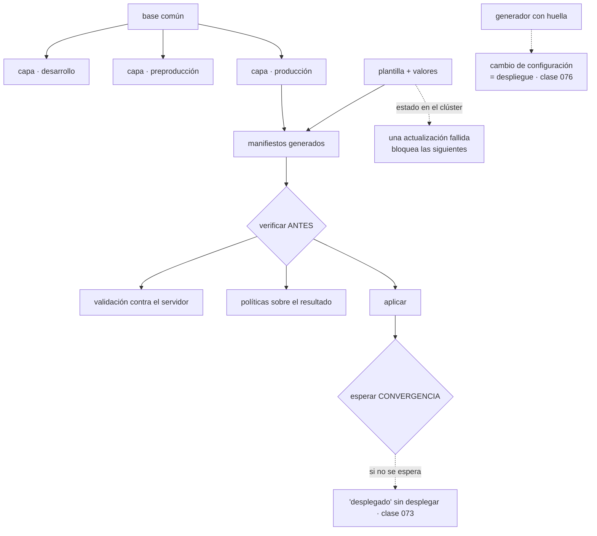

# 081 — Helm, Kustomize y gestión de paquetes

> [← 080 · Namespaces, RBAC, NetworkPolicy y admission](../../part-06-kubernetes-managed-platforms/080-namespaces-rbac-networkpolicy-y-admission/README.md) · [Índice de la parte](../README.md) · [082 · Logs, métricas, eventos y depuración →](../../part-06-kubernetes-managed-platforms/082-logs-metricas-eventos-y-depuracion/README.md)

**Parte:** 06 — Kubernetes y plataformas administradas<br>
**Nivel:** intermedio-avanzado · **Horas estimadas:** 4<br>
**Laboratorio:** `configuration` · **Estado:** `EXECUTABLE_CORE`

## 🎯 Propósito

Gestionar los manifiestos de una aplicación en varios entornos sin duplicarlos ni convertirlos en un generador de texto ilegible. Hay dos filosofías —superponer capas sobre una base, o rellenar plantillas con valores— y la elección correcta depende de si el destinatario es tu propio equipo o alguien de fuera. La clase compara ambas con honestidad, señala las trampas concretas de cada una, y cierra con la afirmación que enlaza con la parte 08: **generar manifiestos no es desplegar**, y confundirlo es la ley de la clase 073 otra vez.

## 📚 Resultados de aprendizaje

Al finalizar podrás:

1. **Elegir** entre superposición y plantillas según quién consume el resultado.
2. **Fijar** versiones e imágenes por huella en ambos enfoques, con el mismo criterio de las clases 061 y 062.
3. **Anticipar** los bloqueos de estado que deja una actualización fallida y cómo salir de ellos.
4. **Forzar** un despliegue al cambiar la configuración, con el mecanismo que cada herramienta ofrece.
5. **Verificar** el resultado antes de aplicarlo, y la convergencia después.

## 🧩 Conceptos centrales

| Concepto | Comprensión verificable |
|---|---|
| `superposición` | Capas que modifican una base común mediante parches. En cada paso el resultado es un manifiesto válido, así que se puede revisar. |
| `plantilla con valores` | Texto con marcadores que se rellenan. Es más flexible y **puede generar algo que no es válido**, porque hasta el final no hay estructura. |
| `estado de la publicación` | Registro que la herramienta de plantillas guarda **en el clúster** con lo que instaló. Una actualización fallida lo deja en un estado que bloquea las siguientes. |
| `gancho de publicación` | Trabajo que se ejecuta antes o después de aplicar. Es donde va una migración de esquema, con la advertencia de la clase 074: una vez, no una por réplica. |
| `generador con huella` | Mecanismo que crea el objeto de configuración con un sufijo derivado de su contenido. Resuelve por diseño el problema de la clase 076. |
| `campo inmutable` | Selector de un despliegue y otros campos que no se pueden modificar. Una herramienta que añade etiquetas comunes a los selectores **rompe la actualización**. |

## 🧠 Modelo mental

Kubernetes es un sistema de reconciliación: declaras estado deseado y controladores reducen continuamente la diferencia con el estado observado.

Aplicado a esta clase, separa siempre cuatro planos: **intención** (qué necesita el usuario),
**configuración** (qué declaramos), **estado observado** (qué existe de verdad) y
**evidencia** (cómo sabemos que cumple). Confundirlos produce diseños que se ven correctos
en un diagrama pero fallan al operar.

## 🗺️ Flujo de razonamiento



## 📖 Desarrollo

### 1. Dos filosofías, y el criterio para elegir

El problema es siempre el mismo: la misma aplicación en cuatro entornos, con diferencias pequeñas —réplicas, límites, nombres de host, huellas de imagen— y sin duplicar cuatro veces los manifiestos.

```text
SUPERPOSICIÓN     una base común y capas que la parchean
  el resultado de cada paso es un manifiesto VÁLIDO
  se puede revisar, comparar y validar en cualquier punto
  no hay lógica: no hay condicionales ni bucles

PLANTILLAS        texto con marcadores y un fichero de valores
  permite lógica: condicionales, bucles, funciones
  hasta el final NO hay estructura: se puede generar algo inválido
  incluye empaquetado, versionado y ciclo de vida de la publicación
```

Y el criterio de elección, que evita la discusión religiosa:

```text
¿el destinatario es TU equipo, con tus manifiestos?
  → superposición. Menos maquinaria, resultado revisable,
    y viene integrada en la herramienta de línea de órdenes

¿vas a DISTRIBUIR software a terceros que no conoces?
  → plantillas. Necesitas parámetros, valores por defecto,
    versiones y una forma de instalar y desinstalar

¿consumes software de terceros?
  → sus paquetes vienen en plantillas: no hay elección
```

La tercera fila es la razón por la que la mayoría de los equipos acaban usando ambas: sus propias aplicaciones con superposición y los componentes de terceros con paquetes. Y hay una combinación que funciona bien y conviene conocer: **generar el paquete de terceros a manifiestos y tratarlos después como una base más**, con lo que todo el inventario acaba en el mismo formato revisable.

```bash
$ helm template ingress-nginx ingress-nginx/ingress-nginx \
    --version 4.11.3 --values valores.yaml > base/ingress.yaml
```

Eso tiene una ventaja concreta: **el cambio entre versiones del paquete se ve como un diferencial de manifiestos** en el pull request, en vez de como un número de versión que nadie sabe qué implica.

Y dos disciplinas que se aplican igual en las dos filosofías, y que vienen de las clases 059, 061 y 062:

```text
fijar la versión del paquete de terceros    nunca "la última"
referenciar las imágenes por huella          nunca por etiqueta
```

La segunda tiene un mecanismo propio en la superposición que conviene usar:

```yaml
images:
  - name: registro/api
    digest: sha256:9f2c4a1b3d5e…
```

Con eso, la canalización escribe la huella en un solo sitio y todos los manifiestos que referencien esa imagen la reciben. Es la aplicación directa de la regla de la clase 061, y evita el incidente de la 074 —la vuelta atrás que no volvía a ninguna parte— por construcción.

### 2. El estado de la publicación, y cómo se atasca

La herramienta de plantillas guarda **en el clúster** un registro de lo que instaló, y eso da capacidades reales:

```bash
$ helm history api -n tienda
REVISION  STATUS      CHART        APP VERSION  DESCRIPTION
1         superseded  api-1.4.0    v7           Install complete
2         deployed    api-1.5.0    v8           Upgrade complete
$ helm rollback api 1 -n tienda
```

Y trae un problema operativo que aparece el primer mes: **una actualización que falla deja el estado a medias y bloquea las siguientes**.

```text
$ helm upgrade api ./api -n tienda
Error: UPGRADE FAILED: another operation (install/upgrade/rollback) is in progress

$ helm history api -n tienda
3    pending-upgrade    api-1.6.0    v9    Preparing upgrade
```

El estado `pending-upgrade` se queda ahí si el proceso murió a mitad —un agente de canalización que se reinició, un tiempo de espera agotado— y ninguna actualización posterior funciona hasta resolverlo:

```bash
$ helm rollback api 2 -n tienda        # vuelve al último estado bueno conocido
```

Las dos opciones que evitan llegar ahí:

```bash
$ helm upgrade --install api ./api -n tienda \
    --atomic --timeout 5m --wait
```

```text
--wait     espera a que los objetos estén LISTOS, no solo creados
           → es la corrección de la ley de la clase 073
--atomic   si falla o expira, revierte automáticamente
           → nunca queda un estado a medias
```

Y una consecuencia de `--atomic` que hay que conocer: **la reversión automática también deshace lo que sí funcionó**, lo que puede dejar el sistema en un estado que nadie ha probado. Para publicaciones pequeñas es lo correcto; para una que toca muchos objetos, conviene tiempo de espera generoso y revisar antes de automatizar la reversión.

Los **ganchos** son el mecanismo para el trabajo que rodea a la publicación, y ahí va la migración de esquema que la clase 074 sacó de los contenedores de inicialización:

```yaml
apiVersion: batch/v1
kind: Job
metadata:
  name: migrar
  annotations:
    "helm.sh/hook": pre-upgrade,pre-install
    "helm.sh/hook-weight": "-5"
    "helm.sh/hook-delete-policy": before-hook-creation,hook-succeeded
spec:
  backoffLimit: 2
  activeDeadlineSeconds: 900
  ttlSecondsAfterFinished: 3600
```

La política de borrado importa por lo que la clase 074 midió: sin ella, cada publicación deja un objeto terminado que nadie retira.

Y una limitación conocida que sorprende y hay que planificar: **las definiciones de tipos que un paquete instala no se actualizan al actualizar el paquete**. Se instalan la primera vez y después quedan congeladas. Actualizarlas es un paso manual:

```bash
$ kubectl apply --server-side -f https://…/crds-v1.6.0.yaml
$ helm upgrade api ./api -n tienda
```

Ese orden —primero los tipos, después el paquete— es el correcto, y saltárselo produce un paquete nuevo escribiendo campos que la definición antigua rechaza.

### 3. Las trampas de la superposición

La superposición tiene menos maquinaria y dos trampas propias que rompen despliegues.

**Las etiquetas comunes tocan los selectores.** Añadir una etiqueta a todos los objetos parece inocuo:

```yaml
commonLabels:
  entorno: produccion
```

Pero el selector de un despliegue es **inmutable**, y esa etiqueta se añade también al selector:

```text
The Deployment "api" is invalid: spec.selector: Invalid value:
  field is immutable
```

El despliegue existente no se puede actualizar y hay que borrarlo y recrearlo — con corte. La corrección es usar el mecanismo que añade etiquetas **sin tocar selectores**:

```yaml
labels:
  - pairs: {entorno: produccion}
    includeSelectors: false          # ← lo importante
```

Misma advertencia con los prefijos de nombre: cambiarlos en un entorno ya desplegado crea objetos nuevos y deja los viejos huérfanos, sin que nadie los retire.

**El generador con huella, que resuelve el problema de la clase 076.**

```yaml
configMapGenerator:
  - name: api-config
    files: [config.yaml]
secretGenerator:
  - name: api-tls
    files: [tls.crt, tls.key]
```

Eso genera `api-config-7f4c9b2d` con un sufijo derivado del contenido, y **reescribe todas las referencias** en los manifiestos. La consecuencia es exactamente lo que la clase 076 pedía a mano:

```text
cambia el contenido → cambia el nombre → cambia la plantilla del pod
→ hay despliegue progresivo, con historial y vuelta atrás
```

Y viene con un efecto secundario que hay que gestionar: los objetos antiguos **no se borran solos**. Se acumulan versiones de configuración que nadie retira, con el mismo efecto sobre el almacén de estado que los trabajos terminados de la clase 074. Se resuelve con una limpieza periódica de los que ya nadie referencia.

Y las dos formas de parchear, con criterio para elegir:

```yaml
# fusión estratégica: legible, para cambios de campos
patches:
  - target: {kind: Deployment, name: api}
    patch: |-
      apiVersion: apps/v1
      kind: Deployment
      metadata: {name: api}
      spec:
        replicas: 6
        template:
          spec:
            containers:
              - name: api
                resources: {requests: {cpu: 500m, memory: 1Gi}}

# por ruta: preciso, para listas y para borrar
  - target: {kind: Deployment, name: api}
    patch: |-
      - op: remove
        path: /spec/template/spec/containers/0/livenessProbe
```

La segunda es la única forma de **quitar** un campo, que la fusión no puede hacer. Y conviene conocerla porque el caso aparece siempre: una base con un valor que un entorno concreto no debe tener.

### 4. Generar no es desplegar

Las dos herramientas producen manifiestos. Lo que ocurre después es lo que decide si algo se ha desplegado, y aquí vuelve la ley de la clase 073 con un mecanismo nuevo.

El flujo completo, con las comprobaciones en su sitio:

```bash
# 1. generar y VER lo que va a aplicarse
$ kubectl kustomize entornos/produccion > salida.yaml
$ git diff --no-index anterior.yaml salida.yaml

# 2. validar contra el servidor: esquema, tipos, admisión
$ kubectl apply --server-side --dry-run=server -f salida.yaml

# 3. validar políticas propias sobre el resultado
$ conftest test salida.yaml

# 4. aplicar
$ kubectl apply --server-side -f salida.yaml

# 5. ESPERAR la convergencia
$ kubectl rollout status deploy/api -n tienda --timeout=300s
$ kubectl wait --for=condition=Available deploy/api -n tienda --timeout=300s
```

Los pasos 1 y 2 son los que este programa ha pedido en tres formas distintas —el `what-if` de la clase 047, el plan guardado de la 059 y ahora esto— y el 5 es la corrección de la ley de la clase 073.

Dos detalles del paso 4 que evitan problemas:

**La aplicación del lado del servidor** registra qué campo gestiona cada quien, con lo que dos herramientas que tocan el mismo objeto no se pisan en silencio:

```text
Apply failed with 1 conflict: conflict with "otro-controlador":
  .spec.replicas
```

Eso es una buena noticia: sin ella, el objeto de escalado automático y el manifiesto se sobrescriben mutuamente y el número de réplicas oscila sin explicación. Con ella, el conflicto se hace visible y se resuelve declarando quién manda:

```text
si el escalado automático gestiona las réplicas,
el manifiesto NO debe declararlas
```

**El diferencial antes de aplicar** responde a la pregunta que importa:

```bash
$ kubectl diff -f salida.yaml
```

Y su valor es el mismo que el del `what-if` de la clase 047, con la misma advertencia: si produce mucho ruido, el equipo deja de leerlo. El ruido aquí viene de campos que el servidor rellena y el manifiesto no declara, y se corrige declarándolos.

Y el cierre que enlaza con la parte 08: todo lo anterior sigue siendo **alguien ejecutando órdenes**. Lo que hace que el clúster converja de verdad hacia lo que dice el repositorio, y que una modificación manual se deshaga sola, es un controlador que reconcilie continuamente — el mismo bucle de la clase 073 aplicado al despliegue. Eso es la entrega continua declarativa, y es materia de la parte 08. Lo que hay que llevarse de aquí es la frase:

> **Generar manifiestos, validarlos y aplicarlos no garantiza que el clúster se parezca al repositorio dentro de una semana.** Solo un bucle que reconcilie lo garantiza.

### 5. Lo que ninguna de las dos debe contener

Una advertencia que cierra la clase y recoge tres partes anteriores: **ni los paquetes ni las superposiciones deben llevar secretos**.

Los dos ofrecen mecanismos para incluirlos, y los dos acaban en el repositorio:

```text
valores con contraseñas          en el repositorio, y en el historial (ley de 072)
generador de secretos con ficheros  igual, salvo que los ficheros vengan de fuera
```

Las opciones correctas son las de la clase 076, por orden:

```text
1. el valor nunca entra en el clúster: se monta desde el gestor externo
2. un controlador lo sincroniza desde el gestor, y el repositorio solo
   guarda una REFERENCIA
3. cifrado en el repositorio con una clave que solo el clúster puede usar
   → funciona, y hay que gestionar el ciclo de vida de esa clave
```

La tercera es popular y merece una precisión: el fichero cifrado en el repositorio es seguro **mientras la clave lo sea**, y esa clave es ahora un activo más que rotar, custodiar y auditar. No es peor que las alternativas; es una decisión con su propio coste.

Y la comprobación que conviene tener en la canalización, que es la de la clase 067 aplicada a manifiestos:

```bash
$ kubectl kustomize entornos/produccion \
  | grep -Ei '(password|token|secret|apikey)\s*[:=]\s*["\x27]?[A-Za-z0-9+/]{16,}' \
  && { echo "posible secreto en los manifiestos"; exit 1; }
```

Y la lista de comprobación de la clase, que alimenta el proyecto de la 084:

```text
☐ una base y una capa por entorno; sin manifiestos duplicados
☐ versiones de paquetes de terceros fijadas, nunca la última
☐ imágenes por huella, escritas en un solo sitio por la canalización
☐ etiquetas comunes que NO tocan los selectores
☐ configuración por generador con huella, para que cambiarla sea un despliegue
☐ migraciones como gancho o trabajo previo, nunca por réplica
☐ ningún secreto en el repositorio, ni en valores ni en ficheros
☐ diferencial revisado y validación contra el servidor antes de aplicar
☐ espera de convergencia después de aplicar, con tiempo límite
☐ limpieza periódica de objetos de configuración que ya nadie referencia
```

Diez puntos, de los cuales cuatro son reglas que vienen de las clases 061, 072, 074 y 076 — lo que confirma que esta clase es sobre todo **el sitio donde se aplican decisiones tomadas antes**.

## 🔬 Ejemplo trabajado

**CloudShop tiene cuatro entornos con manifiestos copiados y editados a mano. La unificación produce cuatro incidentes, y el más caro no es de la herramienta sino de una etiqueta.**

Punto de partida:

```text
4 carpetas con manifiestos completos, copiados y divergentes
diferencias reales entre entornos:      12
diferencias accidentales encontradas:   31
paquetes de terceros instalados a mano, sin versión anotada:  6
```

Las treinta y una diferencias accidentales incluían dos que explicaban incidentes anteriores: un plazo de gracia distinto en producción y una comprobación de vivacidad con umbral 1 en preproducción.

**Incidente 1 — la etiqueta común que rompió el despliegue.**

```text
The Deployment "api" is invalid: spec.selector: Invalid value: … field is immutable
```

La unificación añadió `entorno:` a todos los objetos, y eso incluyó los selectores de los despliegues existentes.

```text                                        antes            después
mecanismo de etiquetas             etiquetas comunes   etiquetas sin selectores
despliegues que hubo que recrear         7                  0
corte por recreación                  40 s cada uno          —
detectado en                        producción         validación contra
                                                        el servidor en el PR
```

Se detectó en producción porque el paso de validación contra el servidor no estaba en la canalización. Añadirlo fue la corrección de fondo.

**Incidente 2 — las publicaciones bloqueadas por un estado a medias.**

```bash
$ helm upgrade ingress-nginx …
Error: UPGRADE FAILED: another operation (install/upgrade/rollback) is in progress
$ helm history ingress-nginx -n red | tail -1
7   pending-upgrade   ingress-nginx-4.11.1   Preparing upgrade
```

Un agente de canalización se había reiniciado a mitad de una actualización tres semanas antes. Desde entonces, ninguna publicación de ese componente funcionaba, y nadie lo había intentado.

```text                                        antes            después
opciones de la actualización            ninguna        --install --atomic
                                                        --wait --timeout 5m
estados bloqueados                        1                 0
comprobación de estados pendientes      ninguna     en el panel, semanal
tiempo que llevaba bloqueado           3 semanas            —
```

**Incidente 3 — los tipos que no se actualizaron.**

Al subir de versión el componente de certificados, los objetos nuevos se rechazaban:

```text
error validating data: ValidationError(Certificate.spec):
  unknown field "otherNames"
```

El paquete se había actualizado y sus definiciones de tipos no, porque la herramienta no las toca en una actualización.

```text                                        antes            después
orden de actualización              solo el paquete   tipos primero, paquete después
documentado en el procedimiento          no                sí
paquetes con tipos propios en el clúster   4        los 4, con nota en su ficha
```

**Incidente 4 — el número de réplicas que oscilaba.**

```bash
$ kubectl get deploy api -o jsonpath='{.spec.replicas}'
3
# dos minutos después
9
# y otra vez
3
```

El manifiesto declaraba tres réplicas y el objeto de escalado automático las subía a nueve. Cada aplicación de manifiestos las devolvía a tres.

```bash
$ kubectl apply --server-side --field-manager=kustomize -f salida.yaml
Apply failed with 1 conflict: conflict with "horizontal-pod-autoscaler": .spec.replicas
```

La aplicación del lado del servidor lo hizo visible; antes, la sobrescritura era silenciosa.

```text                                        antes            después
réplicas en el manifiesto                declaradas      no declaradas
modo de aplicación                    cliente           lado del servidor
oscilaciones al día                      ~40                 0
capacidad efectiva en los picos       impredecible      la del escalado
```

**Y el efecto de unificar, medido:**

```text                                          antes         después
manifiestos duplicados                      4 copias    1 base + 4 capas
diferencias accidentales entre entornos         31             0
diferencias declaradas y justificadas           12            12
paquetes de terceros con versión fijada       0 de 6        6 de 6
cambios de configuración que despliegan       0 de 9        9 de 9
validación contra el servidor en el PR          no            sí
espera de convergencia tras aplicar             no            sí
tiempo de un despliegue completo            9 min 20 s     2 min 40 s
```

La fila de las diferencias accidentales es la más valiosa: **treinta y una divergencias que nadie había decidido**, acumuladas por copiar y editar durante dos años, y dos de ellas explicaban incidentes que se habían archivado sin causa.

**La lección que esta clase traslada al resto de la parte 06**: la herramienta importa menos de lo que parece; lo que importa es que el resultado sea **revisable antes de aplicarse y verificable después**. Los cuatro incidentes se detectan con dos pasos que no dependen de la herramienta elegida —validación contra el servidor y espera de convergencia— y ninguno de los dos estaba en la canalización. Y la unificación reveló que la mayor parte de las diferencias entre entornos no eran decisiones: eran erosión.

## 🧪 Laboratorio guiado

Ejecuta desde la raíz:

```bash
python classes/part-06-kubernetes-managed-platforms/081-helm-kustomize-y-gestion-de-paquetes/lab.py
```

El laboratorio selecciona el motor de práctica **`configuration`** y produce
`lab_result.json`. El escenario, sus comprobaciones y el artefacto esperado corresponden a
esta clase; no requiere credenciales y deja explícito qué debe revalidarse en un sandbox real.

1. Lee `exercise.steps` y formula una predicción antes de ejecutar.
2. Ejecuta la práctica y verifica todos los elementos de `checks`.
3. Provoca el caso de `negative_test` y explica la señal observada.
4. Materializa `paquete-kubernetes` en `evidence/` usando la plantilla indicada.
5. Para proveedor real, sigue `sandbox.requires`, registra costo y ejecuta `destroy`.

### Evidencia esperada

El artefacto principal es configuración separada, validada y promovible. Además, la entrega debe incluir el comando ejecutado,
la salida estructurada y una conclusión que no exceda lo observado.

## 🏆 Reto verificable

Construye **`paquete-kubernetes`** para el caso CloudShop. Incluye una alternativa descartada,
un supuesto que pueda falsarse, una prueba de fallo y una decisión de rollback.

## ✅ Criterio de aceptación

- [ ] `lab.py` termina con código 0 y genera JSON válido.
- [ ] La entrega conecta al menos tres requisitos con mecanismos verificables.
- [ ] Existe una prueba positiva y una prueba negativa con evidencia.
- [ ] Seguridad, costo y operación aparecen como decisiones, no como anexos.
- [ ] Se declara una limitación y una condición que obligaría a revisar el diseño.
- [ ] Otra persona puede repetir el recorrido sin conocimiento tácito.

## ⚠️ Errores frecuentes

| Síntoma | Causa probable | Corrección |
|---|---|---|
| Un despliegue existente no se puede actualizar por un campo inmutable | Una etiqueta común se añadió también al selector, que no se puede modificar | Usa el mecanismo que añade etiquetas sin tocar selectores, y valida contra el servidor en el pull request. |
| Ninguna publicación de un componente funciona desde hace semanas | Una actualización murió a mitad y dejó el estado en pendiente | Revierte a la última revisión buena y usa siempre espera atómica con tiempo límite; vigila los estados pendientes. |
| Tras actualizar un paquete, los objetos nuevos se rechazan por campos desconocidos | Las definiciones de tipos no se actualizan al actualizar el paquete | Aplica los tipos primero y el paquete después, y documenta ese orden para cada componente con tipos propios. |
| El número de réplicas oscila sin explicación | El manifiesto y el escalado automático se sobrescriben mutuamente | Aplica del lado del servidor para que el conflicto sea visible, y no declares en el manifiesto lo que gestiona otro controlador. |
| Cambiar la configuración no despliega nada | El objeto de configuración tiene nombre fijo, así que la plantilla del pod no cambia | Usa un generador con sufijo derivado del contenido, y limpia periódicamente los objetos que ya nadie referencia. |
| Aparecen credenciales en el repositorio de manifiestos | Los valores o los ficheros del generador las contienen | Referencia el gestor externo en vez de incluir el valor, y añade una comprobación de patrones a la canalización. |

## 🛡️ Seguridad, ética y costo

Trabaja con cuentas propias o sandboxes autorizados. No publiques secretos, identificadores
reales ni datos personales. Antes de crear recursos pagos define presupuesto, etiquetas y
comando de destrucción; después verifica que no queden recursos huérfanos. Los ejemplos
locales enseñan contratos, pero no certifican cumplimiento ni disponibilidad de producción.

## ❓ Preguntas de comprobación

1. ¿Qué criterio decide entre superposición y plantillas, y por qué la mayoría de los equipos acaba usando ambas?
2. ¿Qué deja bloqueado una actualización que muere a mitad, y qué dos opciones lo evitan?
3. ¿Por qué añadir una etiqueta común puede impedir actualizar un despliegue existente?
4. ¿Cómo resuelve un generador con huella el problema que la clase 076 planteó, y qué efecto secundario tiene?
5. ¿Por qué generar, validar y aplicar no garantiza que el clúster se parezca al repositorio dentro de una semana?

## 🔗 Referencias

- Kubernetes (2025). *Declarative management with Kustomize* — bases, capas, parches y generadores. <https://kubernetes.io/docs/tasks/manage-kubernetes-objects/kustomization/>
- Helm (2025). *Charts and release lifecycle* — plantillas, valores, historial y estados. <https://helm.sh/docs/topics/charts/>
- Helm (2025). *Custom Resource Definitions* — por qué no se actualizan con el paquete. <https://helm.sh/docs/chart_best_practices/custom_resource_definitions/>
- Kubernetes (2025). *Server-Side Apply* — gestores de campos y detección de conflictos. <https://kubernetes.io/docs/reference/using-api/server-side-apply/>
- Kustomize (2025). *Labels and selectors* — etiquetas comunes y campos inmutables. <https://kubectl.docs.kubernetes.io/references/kustomize/kustomization/labels/>
- Documentación oficial vigente del servicio implementado; registra URL y fecha de consulta.

---

> [Evaluación](assessment.md) · [Contrato de clase](lesson.yaml) · [Índice de la parte](../README.md)

| Anterior | Índice | Siguiente |
|---|---|---|
| [← 080 · Namespaces, RBAC, NetworkPolicy y admission](../../part-06-kubernetes-managed-platforms/080-namespaces-rbac-networkpolicy-y-admission/README.md) | [Parte 06](../README.md) · [Programa](../../README.md) | [082 · Logs, métricas, eventos y depuración →](../../part-06-kubernetes-managed-platforms/082-logs-metricas-eventos-y-depuracion/README.md) |
