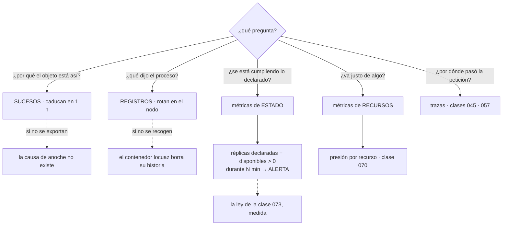

# 082 — Logs, métricas, eventos y depuración

> [← Clase anterior](../../part-06-kubernetes-managed-platforms/081-helm-kustomize-y-gestion-de-paquetes/README.md) · [Índice de la parte](../README.md) · [Clase siguiente →](../../part-06-kubernetes-managed-platforms/083-eks-aks-y-gke-similitudes-y-diferencias/README.md)

**Parte:** 06 — Kubernetes y plataformas administradas<br>
**Nivel:** intermedio-avanzado · **Horas estimadas:** 4<br>
**Laboratorio:** `observability` · **Estado:** `EXECUTABLE_CORE`

## 🎯 Propósito

Ver lo que ocurre dentro de un clúster, con dos hechos que hay que asumir antes de diseñar nada: **los sucesos caducan en una hora**, así que la explicación de por qué algo falló anoche ya no existe; y **la fuente que alimenta el escalado no es un sistema de vigilancia**, no guarda historia y confundirla con uno deja al equipo sin datos justo cuando los necesita. La clase cierra además la traducción de la ley de la clase 073 a una métrica concreta que casi ningún panel tiene.

## 📚 Resultados de aprendizaje

Al finalizar podrás:

1. **Distinguir** los cuatro tipos de señal del clúster y qué pregunta responde cada uno.
2. **Conservar** los sucesos y los registros más allá de su vida útil por defecto.
3. **Separar** las métricas de estado de las de recursos, y saber cuál detecta cada problema.
4. **Alertar** sobre la distancia entre lo declarado y lo que funciona.
5. **Recorrer** un diagnóstico completo con las órdenes en el orden que acota.

## 🧩 Conceptos centrales

| Concepto | Comprensión verificable |
|---|---|
| `suceso` | Explicación que un componente deja sobre un objeto. **Caduca en una hora por defecto** y no se guarda en ningún sitio: es la primera fuente que desaparece. |
| `métrica de estado` | Lo que el clúster **declara**: réplicas deseadas, fase de un pod, condiciones. Responde a si lo pedido está ocurriendo. |
| `métrica de recursos` | Lo que las cargas **consumen**: CPU, memoria, disco. Responde a si algo va justo, y no dice nada sobre si lo declarado se cumplió. |
| `fuente para el escalado` | Componente que publica el uso instantáneo para el escalado automático y para consultas puntuales. **No guarda historia**: no es un sistema de vigilancia. |
| `rotación de registros del nodo` | El kubelet rota los registros de cada contenedor por tamaño. Un contenedor locuaz **pierde su propio historial** en minutos si nadie lo recoge. |
| `distancia entre declarado y disponible` | Diferencia entre las réplicas que un objeto pide y las que sirven. Es la ley de la clase 073 expresada como número, y es la alerta que casi nunca existe. |

## 🧠 Modelo mental

Kubernetes es un sistema de reconciliación: declaras estado deseado y controladores reducen continuamente la diferencia con el estado observado.

Aplicado a esta clase, separa siempre cuatro planos: **intención** (qué necesita el usuario),
**configuración** (qué declaramos), **estado observado** (qué existe de verdad) y
**evidencia** (cómo sabemos que cumple). Confundirlos produce diseños que se ven correctos
en un diagrama pero fallan al operar.

## 🗺️ Flujo de razonamiento



## 📖 Desarrollo

### 1. Cuatro señales, cuatro preguntas, y dos que caducan

En un clúster hay cuatro fuentes y cada una responde algo distinto. Usar la equivocada es la causa habitual de un diagnóstico largo:

```text
sucesos      ¿por qué este objeto está en este estado?
             lo escriben el planificador, el kubelet y los controladores
registros    ¿qué dijo el proceso?
métricas de estado    ¿se está cumpliendo lo que se declaró?
métricas de recursos  ¿algo va justo de CPU, memoria o disco?
trazas       ¿por dónde pasó una petición concreta? (clases 045, 057)
```

Y las dos primeras tienen una propiedad que hay que asumir antes de diseñar nada.

**Los sucesos caducan en una hora.**

```bash
$ kubectl get events -n tienda --sort-by=.lastTimestamp | tail -5
# solo la última hora; lo anterior ya no existe
```

Eso significa que la explicación de por qué un pod se reinició anoche, por qué el planificador no lo colocó o por qué un volumen no montó **ha desaparecido** cuando alguien mira por la mañana. Es la fuente más útil para el diagnóstico de la clase 073 y la que primero se pierde.

La corrección es exportarlos, y hay dos formas:

```text
un recolector que los lea de la API y los envíe al sistema de registros
una alerta que los convierta en métrica cuando importan
```

Y una advertencia sobre el volumen: los sucesos son muchos y repetitivos —el mismo se agrega con un contador— así que exportarlos todos es caro. La práctica sensata es exportar los de tipo aviso y los de razones concretas:

```text
FailedScheduling · FailedMount · Unhealthy · BackOff · Killing · Preempted
OOMKilling · FailedCreate · NodeNotReady
```

**Los registros rotan en el nodo.** El kubelet los guarda en ficheros con un tamaño máximo y un número de ficheros:

```text
por defecto, del orden de 10 MiB por fichero y 5 ficheros
→ un contenedor que escribe 50 MiB por minuto conserva su último minuto
```

Y hay una consecuencia peor: `kubectl logs` lee de ahí, así que **la información se pierde antes de que nadie la busque**. Sin un recolector que los envíe fuera, el clúster no tiene historial de registros.

Y la opción que salva más diagnósticos y menos gente conoce:

```bash
$ kubectl logs tienda-7d4b9-x2k4p --previous
```

Eso muestra los registros del contenedor **anterior**, el que murió. Sin `--previous`, en un contenedor que reinicia en bucle se leen los registros del que acaba de arrancar, que no dicen nada: la causa está en el que falló.

Y para cuando el pod ya no existe, no hay nada que leer: por eso el recolector no es opcional en cuanto el clúster deja de ser de pruebas.

### 2. Estado y recursos: dos familias que no se sustituyen

La confusión más extendida es tratar la fuente que alimenta el escalado como si fuera un sistema de vigilancia:

```bash
$ kubectl top pods -n tienda
NAME               CPU(cores)   MEMORY(bytes)
api-7d4b9-x2k4p    340m         1120Mi
```

Eso es el **uso instantáneo** y no se guarda. No hay ayer, no hay percentiles, no hay comparación. Sirve para que el escalado automático decida y para una consulta puntual, y no sirve para investigar nada que haya pasado.

El sistema de vigilancia real recoge dos familias distintas, y es importante no confundirlas:

```text
métricas de RECURSOS      cuánto consume cada contenedor y cada nodo
  origen: el propio kubelet y agentes del nodo
  responden: ¿va justo? ¿hay presión? (clase 070)

métricas de ESTADO        qué declara el clúster sobre sus objetos
  origen: un componente que lee la API y publica su contenido
  responden: ¿lo declarado está ocurriendo?
```

La segunda familia es la que casi siempre falta y la que detecta los problemas de esta parte:

```text
réplicas deseadas frente a disponibles        la ley de la clase 073
pods en estado no listo, por motivo
reinicios por contenedor
trabajos programados que no se ejecutaron
presupuestos con cero interrupciones permitidas   (clase 079)
reclamaciones de volumen sin vincular             (clase 077)
nodos no listos
certificados próximos a caducar
```

Y la alerta que traduce la ley de la clase 073 a un número, que es la aportación central de esta clase:

```text
réplicas declaradas − réplicas disponibles > 0  durante 10 minutos
```

Eso detecta de una vez: un despliegue que no avanza, un pod que no se planifica, una imagen que no se descarga, un volumen que no monta y una comprobación que nunca pasa. **Cinco causas distintas y un solo síntoma**, que es exactamente lo que se quiere de una alerta de primer nivel.

Y su complemento, que detecta lo que la anterior no ve:

```text
un objeto de despliegue existe y su controlador no lo ha reconciliado
  → marca de tiempo del arrendamiento de los controladores (clase 073)
un trabajo programado no ha creado ningún trabajo en dos intervalos
  → la tarea dejó de ejecutarse sin que nada fallara
```

La segunda es la versión de esta parte del fallo silencioso que el programa persigue desde la clase 060: **algo que dejó de ocurrir no genera ningún error**.

Y sobre el formato, una nota que conecta con la clase 057: el estándar de facto para publicar métricas en Kubernetes es el mismo que las tres nubes admiten de forma nativa. Eso convierte la instrumentación de una aplicación en algo **portable de verdad**: las mismas métricas y los mismos paneles valen en el clúster, en cualquier nube y en una máquina. Es uno de los pocos contratos del programa que se conserva sin traducción alguna.

### 3. El orden que acota un diagnóstico

Con las cuatro fuentes y el modelo de la clase 073, el diagnóstico sigue un orden fijo. Saltárselo es lo que convierte diez minutos en dos horas.

```bash
# 1. ¿qué dice el objeto de sí mismo, y qué sucesos tiene?
$ kubectl describe pod api-7d4b9-x2k4p

# 2. ¿qué dijo el proceso? y si reinició, el ANTERIOR
$ kubectl logs api-7d4b9-x2k4p --previous --tail=100

# 3. ¿qué ve la plataforma sobre el conjunto?
$ kubectl get deploy api -o wide
$ kubectl get rs -l app=api

# 4. ¿qué cambió?
$ kubectl rollout history deploy/api
$ kubectl get events -n tienda --sort-by=.lastTimestamp | tail -20

# 5. si hace falta entrar, sin intérprete de órdenes (clase 070)
$ kubectl debug -it api-7d4b9-x2k4p --image=nicolaka/netshoot --target=api

# 6. si el problema parece del nodo
$ kubectl describe node nodo-14
$ kubectl debug node/nodo-14 -it --image=busybox
```

Y una tabla que traduce el estado observado al eslabón responsable, ampliando la de la clase 073 con lo aprendido después:

| Estado | Fuente que lo explica | Causa habitual |
|---|---|---|
| `Pending` | Sucesos del pod | Recursos, reglas de colocación, volumen zonal (078, 077) |
| `ContainerCreating` | Sucesos del pod | Volumen que no monta, secreto que no existe (076, 077) |
| `ImagePullBackOff` | Sucesos del pod | Huella inexistente, credenciales, admisión de firma (061, 067) |
| `CrashLoopBackOff` | `logs --previous` | La aplicación sale; el registro del contenedor muerto lo dice |
| `Running` y no listo | `describe`, comprobación de disponibilidad | Dependencia caída (068) |
| `Terminating` largo | Sucesos y finalizadores | Proceso que ignora la señal, o controlador ausente (073) |
| `OOMKilled` | Estado del contenedor | Límite frente a uso real (063, 078) |
| `Evicted` | Sucesos del nodo | Presión del nodo y clase de servicio (078) |

La fila de la imagen merece una nota porque su mensaje se lee mal:

```text
Failed to pull image "registro/api@sha256:…": … not found
  → la huella no existe: casi siempre, una etiqueta que se resolvió mal
Failed to pull image …: unauthorized
  → credenciales del registro, o identidad del nodo
admission webhook denied the request: no matching signatures
  → la política de la clase 067 está funcionando: eso es un ÉXITO
```

El tercero es un caso en el que el fallo es la señal de que un control funciona, y merece reconocerse para no «arreglarlo».

Y dos órdenes que ahorran tiempo y se conocen poco:

```bash
# ver el estado de todos los contenedores de un espacio, con motivos
$ kubectl get pods -n tienda -o custom-columns=\
NOMBRE:.metadata.name,LISTO:.status.containerStatuses[*].ready,\
REINICIOS:.status.containerStatuses[*].restartCount,\
MOTIVO:.status.containerStatuses[*].state.waiting.reason

# seguir los sucesos en tiempo real durante un despliegue
$ kubectl get events -n tienda --watch-only
```

La segunda durante un despliegue muestra la secuencia completa —creación, planificación, descarga, arranque, disponibilidad— y es la mejor forma de entender por qué un despliegue tarda lo que tarda.

### 4. Lo que cuesta, y lo que nadie consulta

La clase 057 estableció el método: mirar el historial de consultas antes de recortar. En un clúster, el resultado de ese ejercicio es casi siempre el mismo.

```text
composición típica del volumen de registros de un clúster
  registros de acceso del controlador de entrada     30-50 %
  salida de un componente de plataforma muy locuaz   15-30 %
  aplicaciones                                       15-25 %
  sucesos exportados sin filtrar                      5-15 %
```

Las dos primeras filas suman más de la mitad y casi nunca originan una alerta. Las palancas, en el mismo orden que la clase 057:

```text
1. bajar el nivel de registro de los componentes de plataforma
   muchos vienen con nivel de depuración por defecto en su instalación
2. filtrar los accesos correctos del controlador de entrada
   y archivar el volumen íntegro aparte, más barato
3. exportar solo los sucesos que importan, no todos
4. estructurar los registros de las aplicaciones
   una línea por evento, en formato estructurado, sin trazas de pila repetidas
```

Y una fuente de volumen específica del clúster que sorprende: **un contenedor en bucle de reinicio genera registros sin parar**, y con espera creciente sigue haciéndolo durante días. Un despliegue roto que nadie retira puede ser la mayor partida del mes.

```bash
$ kubectl get pods -A --field-selector status.phase!=Running \
  -o custom-columns=NS:.metadata.namespace,N:.metadata.name,\
R:.status.containerStatuses[0].restartCount --no-headers | sort -k3 -rn | head
```

Esa lista debería estar vigilada: un contador de reinicios de cuatro cifras es a la vez un servicio roto y una factura.

Y sobre las **métricas**, la trampa de coste es la cardinalidad, exactamente como en las clases 034 y 045:

```text
una métrica por pod × 400 pods × 15 métricas × 20 etiquetas
  → cientos de miles de series, que se renuevan en CADA despliegue
```

La segunda parte es la propia del clúster: los pods tienen nombres nuevos en cada despliegue, así que cualquier métrica etiquetada con el nombre del pod **crea series nuevas continuamente**. La corrección es agregar por despliegue o por servicio y no conservar la etiqueta del pod salvo donde haga falta.

Y la lista de comprobación de observabilidad de un clúster:

```text
☐ recolector de registros: sin él no hay historial
☐ sucesos exportados, filtrados por tipo y razón
☐ métricas de estado además de las de recursos
☐ alerta de réplicas declaradas frente a disponibles
☐ alerta de arrendamiento de controladores envejecido
☐ alerta de trabajos programados que dejan de ejecutarse
☐ alerta de presupuestos con cero interrupciones permitidas (079)
☐ alerta de reclamaciones sin vincular y nodos no listos
☐ presión por recurso, por contenedor y por nodo (070)
☐ nivel de registro de los componentes de plataforma revisado
☐ etiqueta de pod evitada en métricas de alta cardinalidad
☐ consultas de diagnóstico guardadas antes de necesitarlas
```

Doce puntos, de los cuales seis son alertas sobre **cosas que dejan de ocurrir** — que es la familia de fallos que este programa lleva persiguiendo desde la clase 060 y que en Kubernetes es especialmente fácil de producir, porque casi todo lo hace un bucle y un bucle que no funciona no da error.

### 5. Lo que ya se puede afirmar sobre observabilidad

Con las clases 034, 045, 057, 070 y esta, el programa ha recorrido cinco implementaciones distintas del mismo problema. Lo que se repite ya no es casualidad:

```text
1. la señal por defecto es la equivocada
   utilización en vez de saturación, medias en vez de percentiles,
   recursos en vez de estado

2. lo que no se recoge mientras ocurre no existe
   registros apagados (045), exportación no retroactiva (049),
   sucesos que caducan (082)

3. el volumen lo domina un puñado de componentes que nadie consulta
   y la comprobación es mirar el historial de consultas, no intuir

4. las alertas útiles son sobre la experiencia y sobre lo que se detiene
   no sobre umbrales de recursos (057)

5. un incidente no es el momento de aprender a consultar
   las consultas se escriben antes y se guardan
```

Y la aportación propia de Kubernetes a esa lista, que no aparecía en las tres nubes:

```text
6. casi todo lo hace un bucle, y un bucle que no funciona no da error
   → hace falta una métrica de "¿se está cumpliendo lo declarado?"
     y no solo de "¿está sano lo que existe?"
```

Esa sexta es la que justifica la alerta central de esta clase. En una máquina, si un proceso no arranca, alguien lo ve. En un clúster, un objeto puede estar declarado, aceptado, visible en el inventario y sin ninguna instancia funcionando, indefinidamente y en silencio.

Y dos números que conviene medir en un simulacro, porque son los que resumen si la observabilidad sirve:

```text
tiempo hasta detectar          desde que algo se rompe hasta que alguien lo sabe
tiempo hasta localizar la causa desde que se sabe hasta que se sabe por qué
```

Todo lo de las cinco clases existe para bajar esos dos números. Cualquier panel, recolector o alerta que no los baje es decoración con coste mensual, y el simulacro es la única forma de comprobarlo.

## 🔬 Ejemplo trabajado

**CloudShop investiga tres incidentes del mes anterior y no puede explicar ninguno. Los cinco hallazgos son sobre lo que faltaba recoger, y el más útil es una alerta que no existía.**

**Hallazgo 1 — la causa de anoche había caducado.**

```bash
$ kubectl get events -n tienda | grep api-7d4b9
No resources found
```

El pod se había reiniciado siete veces entre las 02:00 y las 04:00. A las 09:00, los sucesos habían desaparecido y los registros del contenedor muerto también, porque el pod se había recreado.

```text                                        antes            después
sucesos exportados                        ninguno       filtrados, 30 días
registros recogidos                    solo del nodo    recolector a un
                                                        sistema central
historial disponible                       1 hora           30 días
incidentes explicables del mes anterior    0 de 3           —
```

**Hallazgo 2 — se leían los registros equivocados.**

Durante el diagnóstico de un bucle de reinicio, el equipo leía:

```bash
$ kubectl logs api-7d4b9-x2k4p --tail=50
[INFO] iniciando…
[INFO] conectando a la base de datos…
```

Siempre las mismas dos líneas, del contenedor que acababa de arrancar. La causa estaba en el que había muerto:

```bash
$ kubectl logs api-7d4b9-x2k4p --previous --tail=20
[FATAL] configuración inválida: campo 'tiempoEspera' esperaba entero, recibió "30s"
```

Diecinueve horas de diagnóstico por no usar una opción.

```text                                        antes            después
procedimiento documentado                 no había     con --previous como paso 2
tiempo hasta la causa en un bucle       19 h              4 min
```

**Hallazgo 3 — la alerta que faltaba, y lo que destapó al ponerla.**

Se añadió la alerta central de esta clase: réplicas declaradas menos disponibles mayor que cero durante diez minutos. En la primera semana disparó cinco veces:

```text
causa                                          veces
despliegue detenido por presupuesto (079)        1
volumen sin vincular por zona (077)              1
imagen rechazada por firma (067)                 1
comprobación de disponibilidad que nunca pasaba  1
trabajo programado que llevaba 9 días sin ejecutarse  1
```

Las cinco existían desde antes y ninguna había generado una alerta. La última era la peor: un trabajo programado que sincronizaba precios llevaba nueve días sin ejecutarse porque su objeto había quedado suspendido durante un mantenimiento.

```text                                        antes            después
alertas de estado                             0                 6
situaciones detectadas la primera semana      —                 5
tiempo medio de detección                 días o nunca       < 10 min
```

**Hallazgo 4 — el 61 % del volumen de registros lo generaban dos cosas.**

```text
controlador de entrada, accesos completos       44 %
un componente de plataforma en modo depuración  17 %
aplicaciones                                    22 %
sucesos sin filtrar                             11 %
resto                                            6 %
```

El componente en modo depuración llevaba así desde su instalación, catorce meses atrás, porque el ejemplo de la documentación lo traía activado.

```text                                        antes            después
ingesta diaria                            38 GiB/día        9 GiB/día
nivel del componente de plataforma        depuración        aviso
accesos del controlador de entrada        completos      solo >= 400,
                                                          volumen íntegro
                                                          archivado aparte
costo mensual de registros                 ~570 USD         ~140 USD
capacidad de investigación perdida            —              ninguna
```

**Hallazgo 5 — un pod en bucle costaba más que el resto del espacio.**

```bash
$ kubectl get pods -A --field-selector status.phase!=Running \
  -o custom-columns=N:.metadata.name,R:.status.containerStatuses[0].restartCount \
  --no-headers | sort -k2 -rn | head -3
prueba-integracion-8f2   4127
viejo-informes-3a1        918
```

Un pod de una prueba abandonada llevaba once semanas reiniciando cada cuarenta segundos, escribiendo su traza de error en cada arranque.

```text                                        antes            después
pods en bucle sin dueño                       2                 0
reinicios acumulados                      5.045                 —
volumen que generaban                   4,1 GiB/día             0
alerta sobre contadores de reinicio      ninguna        > 20 en 1 h → aviso
```

**Y la medición que cierra el ejercicio:**

```text                                          antes         después
tiempo hasta detectar (simulacro)         no se detectaba    3 min 10 s
tiempo hasta localizar la causa               horas           6 min
incidentes del mes explicables               0 de 3           3 de 3
ingesta diaria                             38 GiB/día      9 GiB/día
costo mensual de observabilidad             ~640 USD        ~190 USD
alertas sobre cosas que dejan de ocurrir        0               6
consultas de diagnóstico guardadas              0               7
```

**La lección que esta clase traslada al proyecto de la clase 084**: los tres incidentes del mes anterior eran explicables y la información existió — durante una hora los sucesos y durante unos minutos los registros. **Lo que faltaba no era capacidad de análisis sino conservación**, y su corrección costó menos que lo que se ahorró recortando el volumen que nadie consultaba. Y la alerta central —declarado menos disponible— destapó en una semana cinco situaciones que llevaban entre nueve días y varios meses activas, todas invisibles porque en Kubernetes lo que no ocurre no produce ningún error.

## 🧪 Laboratorio guiado

Ejecuta desde la raíz:

```bash
python classes/part-06-kubernetes-managed-platforms/082-logs-metricas-eventos-y-depuracion/lab.py
```

El laboratorio selecciona el motor de práctica **`observability`** y produce
`lab_result.json`. El escenario, sus comprobaciones y el artefacto esperado corresponden a
esta clase; no requiere credenciales y deja explícito qué debe revalidarse en un sandbox real.

1. Lee `exercise.steps` y formula una predicción antes de ejecutar.
2. Ejecuta la práctica y verifica todos los elementos de `checks`.
3. Provoca el caso de `negative_test` y explica la señal observada.
4. Materializa `diagnostico-kubernetes` en `evidence/` usando la plantilla indicada.
5. Para proveedor real, sigue `sandbox.requires`, registra costo y ejecuta `destroy`.

### Evidencia esperada

El artefacto principal es telemetría correlacionada con una pregunta operativa. Además, la entrega debe incluir el comando ejecutado,
la salida estructurada y una conclusión que no exceda lo observado.

## 🏆 Reto verificable

Construye **`diagnostico-kubernetes`** para el caso CloudShop. Incluye una alternativa descartada,
un supuesto que pueda falsarse, una prueba de fallo y una decisión de rollback.

## ✅ Criterio de aceptación

- [ ] `lab.py` termina con código 0 y genera JSON válido.
- [ ] La entrega conecta al menos tres requisitos con mecanismos verificables.
- [ ] Existe una prueba positiva y una prueba negativa con evidencia.
- [ ] Seguridad, costo y operación aparecen como decisiones, no como anexos.
- [ ] Se declara una limitación y una condición que obligaría a revisar el diseño.
- [ ] Otra persona puede repetir el recorrido sin conocimiento tácito.

## ⚠️ Errores frecuentes

| Síntoma | Causa probable | Corrección |
|---|---|---|
| No se puede explicar por qué algo falló hace unas horas | Los sucesos caducan en una hora y los registros del contenedor muerto desaparecen con el pod | Exporta sucesos filtrados por tipo y razón, y despliega un recolector de registros: sin él el clúster no tiene historial. |
| Los registros de un contenedor en bucle no dicen nada | Se están leyendo los del contenedor recién arrancado, no los del que murió | Usa `--previous`; la causa está siempre en el contenedor anterior. |
| Un servicio lleva días sin funcionar y nadie se enteró | No hay alerta sobre la distancia entre réplicas declaradas y disponibles | Añade esa alerta: detecta cinco causas distintas con un solo síntoma. |
| Una tarea programada deja de ejecutarse sin que nada falle | En Kubernetes lo que deja de ocurrir no produce ningún error | Alerta cuando un trabajo programado no crea ejecuciones en dos intervalos consecutivos. |
| La factura de registros crece sin relación con el tráfico | Un componente de plataforma en modo depuración o un pod en bucle de reinicio | Revisa el nivel de registro de los componentes instalados y vigila los contadores de reinicio. |
| Las métricas crecen sin control en cada despliegue | Las series están etiquetadas con el nombre del pod, que cambia siempre | Agrega por despliegue o servicio y conserva la etiqueta del pod solo donde de verdad haga falta. |

## 🛡️ Seguridad, ética y costo

Trabaja con cuentas propias o sandboxes autorizados. No publiques secretos, identificadores
reales ni datos personales. Antes de crear recursos pagos define presupuesto, etiquetas y
comando de destrucción; después verifica que no queden recursos huérfanos. Los ejemplos
locales enseñan contratos, pero no certifican cumplimiento ni disponibilidad de producción.

## ❓ Preguntas de comprobación

1. ¿Qué pregunta responde cada una de las cuatro fuentes, y cuáles dos caducan?
2. ¿Por qué `kubectl logs` sin `--previous` es inútil en un bucle de reinicio?
3. ¿Qué cinco causas distintas detecta la alerta de réplicas declaradas frente a disponibles?
4. ¿En qué se diferencian las métricas de estado de las de recursos, y cuál falta casi siempre?
5. ¿Qué aportación propia de Kubernetes se añade a las cinco conclusiones de observabilidad del programa?

## 🔗 Referencias

- Kubernetes (2025). *Events and their retention* — origen, agregación y caducidad. <https://kubernetes.io/docs/reference/kubernetes-api/cluster-resources/event-v1/>
- Kubernetes (2025). *Logging architecture* — rotación en el nodo y necesidad de recolector. <https://kubernetes.io/docs/concepts/cluster-administration/logging/>
- Kubernetes (2025). *Resource metrics pipeline* — para qué sirve la fuente del escalado y qué no es. <https://kubernetes.io/docs/tasks/debug/debug-cluster/resource-metrics-pipeline/>
- kube-state-metrics (2025). *Documentation* — métricas de estado de los objetos del clúster. <https://github.com/kubernetes/kube-state-metrics/tree/main/docs>
- Kubernetes (2025). *Debug running pods* — orden de diagnóstico y contenedores efímeros. <https://kubernetes.io/docs/tasks/debug/debug-application/debug-running-pod/>
- Documentación oficial vigente del servicio implementado; registra URL y fecha de consulta.

---

> [Evaluación](assessment.md) · [Contrato de clase](lesson.yaml) · [Índice de la parte](../README.md)
