# 083 — EKS, AKS y GKE: similitudes y diferencias

> [← 082 · Logs, métricas, eventos y depuración](../../part-06-kubernetes-managed-platforms/082-logs-metricas-eventos-y-depuracion/README.md) · [Índice de la parte](../README.md) · [084 · Proyecto: plataforma Kubernetes portable →](../../part-06-kubernetes-managed-platforms/084-proyecto-plataforma-kubernetes-portable/README.md)

**Parte:** 06 — Kubernetes y plataformas administradas<br>
**Nivel:** intermedio-avanzado · **Horas estimadas:** 4<br>
**Laboratorio:** `decision` · **Estado:** `EXECUTABLE_CORE`

## 🎯 Propósito

Comparar las tres plataformas gestionadas de Kubernetes por lo que de verdad diferencia la operación, y no por una tabla de funciones. Tres ejes deciden casi todo: **quién decide cuándo actualizas**, **cuántos pods caben en tu plan de direcciones** y **cómo obtiene una carga la identidad de la nube**. Y la conclusión que interesa al programa es cuantificable: qué parte del trabajo de las clases 073 a 082 se conserva al cambiar de proveedor y qué parte hay que rehacer.

## 📚 Resultados de aprendizaje

Al finalizar podrás:

1. **Delimitar** qué gestiona el proveedor y qué sigue siendo trabajo propio.
2. **Anticipar** una actualización forzada por fin de soporte y lo que puede bloquearla.
3. **Calcular** cuántos pods caben según el modelo de red de cada plataforma.
4. **Federar** la identidad de una carga con la nube, acotando la confianza correctamente.
5. **Estimar** qué se conserva y qué se rehace al cambiar de plataforma gestionada.

## 🧩 Conceptos centrales

| Concepto | Comprensión verificable |
|---|---|
| `plano de control gestionado` | El proveedor opera el servidor de API y el almacén de estado. **No opera tus cargas ni tus complementos**, que es donde está casi todo el trabajo de esta parte. |
| `ventana de soporte` | Periodo durante el cual una versión recibe correcciones. Al agotarse, **el proveedor actualiza el clúster aunque nadie lo pida**. |
| `dirección de pod nativa de la red` | Cada pod recibe una dirección del espacio de la nube. Simplifica el enrutamiento y **consume el plan de direcciones** de las clases 039 y 051. |
| `red superpuesta` | Los pods usan un espacio propio y su tráfico se encapsula. Ahorra direcciones y añade una capa —con la trampa de la unidad máxima de transmisión de la clase 065. |
| `identidad federada de carga` | La cuenta de servicio del clúster obtiene credenciales de la nube sin ninguna clave. Séptima aparición del mismo contrato del programa. |
| `complemento gestionado` | Pieza que el proveedor instala y actualiza en su calendario. Quita trabajo y quita control: su versión puede cambiar sin que nadie lo decida. |
| `desviación de versiones` | Diferencia admitida entre el plano de control y los nodos. Permite actualizar por fases y tiene un límite que, si se cruza, deja nodos sin soporte. |

## 🧠 Modelo mental

Kubernetes es un sistema de reconciliación: declaras estado deseado y controladores reducen continuamente la diferencia con el estado observado.

Aplicado a esta clase, separa siempre cuatro planos: **intención** (qué necesita el usuario),
**configuración** (qué declaramos), **estado observado** (qué existe de verdad) y
**evidencia** (cómo sabemos que cumple). Confundirlos produce diseños que se ven correctos
en un diagrama pero fallan al operar.

## 🗺️ Flujo de razonamiento

```mermaid
flowchart TB
    P["proveedor gestiona"] --> P1["servidor de API y almacén"]
    P --> P2["actualiza el plano de control"]
    P --> P3["complementos gestionados,\nen SU calendario"]
    T["sigue siendo tuyo"] --> T1["todo lo de las clases 073-082"]
    T --> T2["cuándo se actualizan los NODOS"]
    T --> T3["el plan de direcciones"]
    T --> T4["identidad, red y almacenamiento\nde las cargas"]
    V{"ventana de soporte"} -->|"se agota"| F["actualización FORZADA"]
    F -.->|"la bloquea"| B["presupuesto sin margen · clase 079"]
    N{"modelo de red"} -->|"nativa"| NA["un pod = una dirección de la nube\n→ el plan decide cuántos caben"]
    N -->|"superpuesta"| NO["espacio propio\n→ revisar la unidad máxima · clase 065"]
    I["cuenta de servicio"] -->|"federación"| C["identidad de la nube, sin claves"]
```



## 📖 Desarrollo

### 1. Qué gestiona el proveedor, y qué no

«Gestionado» se entiende como más de lo que es, y conviene delimitarlo antes de comparar nada:

```text
el proveedor gestiona
  el servidor de API y el almacén de estado: disponibilidad, copias, parches
  la actualización del plano de control
  algunos complementos, en su calendario
  la integración con su red, su almacenamiento y su identidad

sigue siendo trabajo propio
  ABSOLUTAMENTE todo lo de las clases 073 a 082
  cuándo y cómo se actualizan los NODOS
  el plan de direcciones y sus consecuencias
  las políticas de red, de admisión y de permisos
  la observabilidad, las copias de las cargas con estado y su restauración
```

Es decir: el proveedor quita el trabajo que menos se nota y deja el que produce los incidentes de esta parte. Y merece decirse con claridad porque la expectativa contraria lleva a no dedicar equipo:

> **Un clúster gestionado no reduce el trabajo de operar aplicaciones en Kubernetes.** Reduce el de operar Kubernetes.

Sobre el **coste del plano de control**, las tres cobran de forma distinta y la cifra rara vez decide:

```text
una tarifa por hora y por clúster, con independencia del tamaño
o una tarifa de gestión con algún nivel gratuito acotado
o un nivel gratuito sin acuerdo de servicio y uno de pago con él
```

Lo que sí decide es la consecuencia estructural: **un clúster tiene un coste fijo**, así que muchos clústeres pequeños cuestan más que uno grande. Y esa aritmética empuja a compartir clúster entre equipos, lo que devuelve al aislamiento de la clase 080 y a su límite: los espacios de nombres no bastan para inquilinos no confiables.

Y la decisión que aparece pronto, con la misma forma en las tres plataformas:

```text
un clúster por entorno            frontera clara, coste fijo × entornos
un clúster con espacios por equipo  más barato, aislamiento más débil
un clúster por equipo y entorno     lo más aislado y lo más caro de operar
```

La respuesta razonable en la mayoría de las organizaciones es un clúster por entorno con espacios de nombres por equipo, y producción separada de todo lo demás — que es la misma conclusión a la que llegaron las clases 025, 037 y 049 con cuentas, suscripciones y proyectos. Cuarta aparición del mismo criterio.

### 2. Quién decide cuándo actualizas

Este es el eje que más cambia la operación y el que menos aparece en las comparativas.

Cada versión tiene una **ventana de soporte** de aproximadamente un año, y al agotarse el proveedor actualiza el clúster:

```text
se publica una versión              cada ~4 meses
soporte estándar                    ~12-14 meses desde su publicación
soporte extendido, si existe         más meses, con sobrecoste
al agotarse                         ACTUALIZACIÓN AUTOMÁTICA por el proveedor
```

De ahí salen tres consecuencias operativas:

**Actualizar es una tarea recurrente, no un proyecto.** Con una ventana de un año y una versión cada cuatro meses, un clúster se actualiza dos o tres veces al año, siempre. Un equipo que trate cada actualización como un proyecto excepcional vive permanentemente en uno.

**Lo que bloquea la actualización lo has puesto tú.** El proveedor respeta los presupuestos de interrupción de la clase 079, así que un presupuesto sin margen bloquea también su actualización automática. Y ahí ocurre lo peor:

```text
el proveedor intenta actualizar
un presupuesto sin margen bloquea el vaciado del nodo
la actualización se detiene o se agota su plazo
el clúster se queda con nodos en dos versiones, o sin actualizar
→ y el aviso llega por correo a una dirección que nadie lee
```

Es el incidente de la clase 079 con un origen distinto y una consecuencia mayor, porque termina con nodos ejecutando una versión sin soporte.

**La desviación de versiones limita el orden.** El plano de control se actualiza primero y los nodos después, y hay un margen máximo entre ambos:

```text
los nodos pueden ir por detrás del plano de control, hasta un límite
nunca por delante
→ y saltarse versiones intermedias no está soportado:
  hay que pasar por cada una
```

La última línea es la que convierte un retraso en un problema: un clúster tres versiones por detrás necesita tres actualizaciones encadenadas, cada una con su ventana y su riesgo.

Y las **funciones que se retiran** son la otra mitad del trabajo. Cada versión elimina versiones de API antiguas, y un manifiesto que las use deja de aplicarse:

```bash
$ kubectl get --raw /metrics | grep apiserver_requested_deprecated_apis
```

Esa métrica dice **qué APIs obsoletas se están usando ahora mismo y quién**. Debería revisarse antes de cada actualización, y es la comprobación que evita descubrir el problema con el clúster ya actualizado.

Y una recomendación que se paga sola: **un clúster de pruebas una versión por delante del de producción**. Cuesta el plano de control y unos nodos pequeños, y convierte cada actualización en algo ya ensayado.

### 3. Cuántos pods caben: el modelo de red decide

Aquí está la divergencia real entre plataformas, y tiene consecuencias que se descubren tarde.

Hay dos modelos:

```text
DIRECCIONES NATIVAS
  cada pod recibe una dirección del espacio de la nube
  ventaja: el enrutamiento es directo; los cortafuegos y el registro de flujo
           de las clases 039 y 051 ven al pod, no al nodo
  coste:   consume el plan de direcciones, y mucho

RED SUPERPUESTA
  los pods usan un espacio propio y el tráfico se encapsula
  ventaja: no consume direcciones de la nube
  coste:   una capa más, y la unidad máxima de transmisión de la clase 065
```

Y el cálculo que hay que hacer **antes** de crear el clúster, no después:

```text
con direcciones nativas y una subred /22 (1.024 direcciones)
  reservadas por la nube                     ~5
  una por nodo                               × nodos
  una por pod                                × pods
  y direcciones en tránsito durante los despliegues, que no se liberan al instante

40 nodos × 30 pods = 1.200 direcciones necesarias
→ una /22 NO llega; hace falta al menos una /21, con margen
```

La última línea del cálculo es la que se olvida: durante un despliegue coexisten pods viejos y nuevos, así que el pico de direcciones es mayor que el estado estable. Y el síntoma del agotamiento es característico y despista:

```text
pods en ContainerCreating de forma intermitente, sobre todo al desplegar
  failed to allocate for range 0: no IP addresses available in range
```

Parece un problema del complemento de red y es un problema de aritmética de la clase 051.

Y hay un segundo límite propio de algunos modelos: **el número de pods por nodo puede depender del tipo de máquina**, porque las direcciones se asignan al nodo en bloques ligados a sus interfaces. Un nodo pequeño puede admitir muy pocos pods aunque le sobren CPU y memoria:

```text
síntoma   nodos con recursos libres y pods en Pending
          el suceso menciona pods insuficientes, no CPU ni memoria
```

Ese caso se corrige con máquinas mayores o con modos que reparten direcciones por prefijo en vez de una a una, y hay que conocerlo porque contradice la intuición de la clase 078: **no siempre falta capacidad; a veces faltan direcciones**.

Y los rangos secundarios que la clase 051 pedía reservar aparecen aquí con su factura: en las plataformas que los usan, pods y servicios consumen bloques propios, grandes y **fijados al crear el clúster**. Ampliarlos después no siempre es posible, lo que convierte el plan de direcciones en otra decisión de un solo sentido.

Y la conclusión que enlaza las dos cosas:

```text
el tamaño máximo del clúster lo decide, en la práctica,
el plan de direcciones que alguien hizo antes de crearlo
```

### 4. La identidad, por séptima vez

Las tres plataformas resuelven lo mismo con el mismo mecanismo y distinta sintaxis: **una carga del clúster obtiene credenciales de la nube sin ninguna clave**.

```text
la cuenta de servicio del pod recibe un testigo firmado por el clúster
la nube confía en el emisor del clúster
y cambia ese testigo por credenciales suyas
```

Es el mismo contrato de las clases 026, 038, 050, 069 y 080. Séptima aparición, con la misma pieza crítica:

```text
la confianza del lado de la NUBE debe acotarse al espacio de nombres
y a la cuenta de servicio concretos
```

Sin acotar, **cualquier pod del clúster puede pedir esa identidad**. Y es exactamente el mismo fallo que el sujeto sin acotar de las federaciones anteriores, con un cuarto vocabulario:

```text
condición de confianza correcta
  emisor = el del clúster
  sujeto = system:serviceaccount:<espacio>:<cuenta>
```

La comprobación es la misma prueba negativa que este programa ha ejecutado cuatro veces:

```bash
# desde un pod con la cuenta correcta
$ kubectl exec -n tienda api-x -- /probar-acceso-nube
ok
# desde un pod de otro espacio con otra cuenta
$ kubectl exec -n desarrollo prueba-y -- /probar-acceso-nube
acceso denegado                                                             ✓
```

Y la parte de la sintaxis, que es lo único que cambia entre plataformas:

```yaml
# el mecanismo es el mismo; la anotación y el nombre del recurso, no
apiVersion: v1
kind: ServiceAccount
metadata:
  name: api
  namespace: tienda
  annotations:
    # <clave específica del proveedor>: <identidad de la nube>
```

Y los **complementos gestionados** merecen su nota porque cambian el reparto de responsabilidades:

```text
complemento gestionado
  el proveedor lo instala y lo actualiza en su calendario
  menos trabajo, y su versión puede cambiar sin que nadie lo decida

complemento propio
  se elige la versión y el momento
  más trabajo, y es la única forma de fijar el comportamiento
```

La decisión importa sobre todo en el complemento de red, por lo que la clase 080 mostró: **si no implementa políticas, los objetos no filtran nada**. Y algunas plataformas ofrecen varios, con soporte distinto de políticas, así que la elección del complemento al crear el clúster decide si la segmentación de red es posible. Es una decisión de instalación con consecuencias de seguridad, y hay que tomarla con la clase 080 delante.

### 5. Qué se conserva al cambiar de plataforma

La pregunta que este programa lleva haciendo desde la clase 048 tiene aquí una respuesta cuantificable, y es la mejor noticia de la parte.

```text
se conserva SIN CAMBIOS
  todos los manifiestos de carga: despliegues, servicios, configuración,
  presupuestos, políticas de red, perfiles de seguridad, escalado
  las imágenes y su cadena de suministro (clases 061-067)
  el contrato de la aplicación: señales, comprobaciones, apagado (068)
  la instrumentación: el formato de métricas es el mismo (082)
  las herramientas de gestión de manifiestos (081)

hay que REHACER
  la creación del clúster y su plan de direcciones
  la sintaxis de la federación de identidad
  los grupos de nodos y su escalado
  la elección e instalación de complementos
  la integración con el almacenamiento: nombres de clases y parámetros
  la integración con el balanceador de entrada: anotaciones
  la recogida de registros y métricas hacia el sistema del proveedor
```

El primer bloque es grande y el segundo es la **capa de plataforma**, no las aplicaciones. Expresado como proporción, en una migración real entre dos proveedores:

```text
ficheros de manifiesto de aplicaciones      ~95 % sin cambios
capa de plataforma                          ~100 % reescrita
esfuerzo total                              concentrado en 6-8 componentes
```

Y eso confirma con datos lo que la clase 072 predijo: **el contrato del contenedor es portable y las fugas están en los bordes**. Aquí los bordes tienen nombre: red, almacenamiento, identidad y entrada — las mismas cuatro, por tercera vez.

Y hay una conclusión práctica que conviene sacar y que casi nadie saca: si la capa de plataforma se va a reescribir de todos modos, **conviene aislarla desde el principio**.

```text
repositorio de aplicaciones     manifiestos portables, sin nada del proveedor
repositorio de plataforma       creación del clúster, complementos,
                                clases de almacenamiento, anotaciones de entrada,
                                federación de identidad
```

Con esa separación, cambiar de proveedor toca un repositorio y no doscientos ficheros. Y tiene un beneficio inmediato aunque nunca se cambie: **hace visible qué parte del sistema está atada al proveedor**, que es una cifra que casi ninguna organización conoce.

Y un aviso honesto sobre la portabilidad, para no exagerarla: que los manifiestos sean portables no significa que el sistema lo sea. Los servicios gestionados que las cargas usan —bases de datos, colas, almacenamiento de objetos— siguen siendo del proveedor, y suelen ser la parte más difícil de mover. Kubernetes hace portable el **cómputo**, que es la parte que ya era más fácil.

La lista de comprobación para elegir y montar una plataforma gestionada:

```text
☐ plan de direcciones calculado para el tamaño máximo previsto, con margen
   de despliegue, y comprobado el límite de pods por nodo
☐ complemento de red que implementa políticas, verificado con prueba negativa
☐ federación de identidad acotada a espacio y cuenta, con prueba negativa
☐ ventana de soporte anotada, con fecha de la próxima actualización obligatoria
☐ clúster de pruebas una versión por delante
☐ métrica de APIs obsoletas revisada antes de cada actualización
☐ presupuestos con margen, para que la actualización del proveedor no se bloquee
☐ separación entre repositorio de aplicaciones y de plataforma
☐ complementos: decidido cuáles son gestionados y cuáles propios, y por qué
```

## 🔬 Ejemplo trabajado

**CloudShop opera un clúster en una nube y evalúa mover una parte a otra. El ejercicio se hace en serio —con una migración real de un entorno— y produce cinco datos que ninguna comparativa daba.**

**Dato 1 — el 94 % de los manifiestos no cambió.**

```text                                    ficheros   cambiados
manifiestos de aplicaciones                 214           13
  de esos 13:
    clase de almacenamiento                   4
    anotaciones del objeto de entrada         5
    anotaciones de cuenta de servicio         3
    tolerancias de nodos especiales           1
capa de plataforma                           31           31
```

Los trece cambios son exactamente las cuatro fugas de la clase 072, y ninguno estaba en la lógica de la aplicación.

```text                                        esfuerzo
reescribir la capa de plataforma          9 días-persona
adaptar los 13 manifiestos                 1 día-persona
validar y comparar                         4 días-persona
```

Y la conclusión que se documentó: **el coste de cambiar de plataforma gestionada está en seis componentes de infraestructura, no en las aplicaciones**.

**Dato 2 — el plan de direcciones limitaba el clúster a 27 nodos.**

Al dimensionar el clúster nuevo:

```text
subred asignada                    /22 · 1.024 direcciones
modelo                             direcciones nativas
pods por nodo previstos            30
nodos que caben                    1.024 / 31 ≈ 33
menos margen de despliegue (~20 %)  ≈ 27
```

El clúster original tenía el mismo problema y no lo sabían: llevaban meses sin poder pasar de 24 nodos, y lo atribuían a cuotas del proveedor.

```bash
$ kubectl describe node nodo-14 | grep -i 'pods:'
  pods:  29        ← límite por tipo de máquina, no por CPU ni memoria
```

```text                                        antes            después
subred del clúster                          /22               /20
nodos posibles                               27               110
límite de pods por nodo                      29                110 (modo por prefijo)
sucesos "no IP addresses available"     41 en un mes            0
pods en Pending por límite de pods       sí, en los picos        no
```

Dos correcciones distintas: la subred resolvía el techo del clúster y el modo de asignación por prefijo resolvía el techo por nodo. Ninguna se puede aplicar sobre un clúster existente sin recrearlo, lo que confirma que **es una decisión de un solo sentido**.

**Dato 3 — una actualización forzada que llevaba tres meses bloqueada.**

```text
versión del clúster            fin de soporte hace 6 semanas
intentos del proveedor         4, todos detenidos
nodos actualizados             11 de 24
motivo                         presupuesto sin margen en 2 servicios (clase 079)
aviso                          correo a una lista que nadie leía
```

El clúster llevaba seis semanas con la mitad de los nodos en una versión sin soporte, y con el plano de control ya actualizado por el proveedor.

```text                                        antes            después
presupuestos que bloquean                      2                 0
notificación del proveedor              correo a lista    alerta en el canal
                                                           de guardia
clúster de pruebas por delante             no había          sí, una versión
métrica de APIs obsoletas revisada          nunca      antes de cada actualización
duración de la actualización completa    no terminaba      4 h 10 min
```

Y la revisión de APIs obsoletas, hecha por primera vez, encontró dos manifiestos que la versión siguiente habría rechazado.

**Dato 4 — el complemento de red decidía si la segmentación era posible.**

La plataforma de destino ofrecía dos complementos, y solo uno implementaba políticas. La elección por defecto del asistente de creación era el otro.

```text                                        con el defecto   con el elegido
políticas de red efectivas                       0                14
direcciones consumidas por pod                   1                 1
unidad máxima de transmisión               sin cambios      revisada (clase 065)
complemento gestionado por el proveedor         sí               sí
```

Si la migración se hubiera hecho aceptando el valor por defecto, las catorce políticas de la clase 080 habrían vuelto a no filtrar nada — el mismo incidente, en una plataforma nueva, por una casilla del asistente.

**Dato 5 — la federación de identidad, sin acotar por defecto.**

La primera configuración funcionaba desde el primer intento, lo que hizo sospechar:

```bash
$ kubectl run prueba -n desarrollo --rm -it --image=… -- /probar-acceso-nube
ok        ← desde OTRO espacio, con OTRA cuenta
```

La condición de confianza del lado de la nube aceptaba cualquier testigo del clúster.

```text                                        antes            después
condición de confianza              emisor del clúster   emisor + espacio + cuenta
pods que podían obtener la identidad    todos            solo el previsto
prueba negativa                        ninguna       en el guion de verificación
```

Cuarta vez en el programa que esta misma prueba negativa se ejecuta y **tercera vez que falla la primera vez**.

**Resumen de la evaluación:**

```text                                          origen        destino
manifiestos de aplicación reescritos         —              13 de 214
capa de plataforma reescrita                 —              31 de 31
nodos que caben en el plan de direcciones    27              110
políticas de red efectivas                   14              14
federación acotada                          sí            sí (tras corregir)
semanas con versión sin soporte              6               0
esfuerzo total de la migración               —          14 días-persona
```

**La lección que esta clase traslada al proyecto de la clase 084**: la comparación entre plataformas gestionadas no se decide por funciones sino por tres cosas que se fijan al crear el clúster y no se pueden cambiar después — **el plan de direcciones, el complemento de red y el modelo de identidad**. Las tres son decisiones de un solo sentido, las tres se toman en un asistente de creación en cinco minutos, y las tres deciden el techo de crecimiento, la posibilidad de segmentar y el alcance de una credencial. El resto —el 94 % de los manifiestos— es portable, y esa es la confirmación cuantificada de la hipótesis que abrió la parte 05.

## 🧪 Laboratorio guiado

Ejecuta desde la raíz:

```bash
python classes/part-06-kubernetes-managed-platforms/083-eks-aks-y-gke-similitudes-y-diferencias/lab.py
```

El laboratorio selecciona el motor de práctica **`decision`** y produce
`lab_result.json`. El escenario, sus comprobaciones y el artefacto esperado corresponden a
esta clase; no requiere credenciales y deja explícito qué debe revalidarse en un sandbox real.

1. Lee `exercise.steps` y formula una predicción antes de ejecutar.
2. Ejecuta la práctica y verifica todos los elementos de `checks`.
3. Provoca el caso de `negative_test` y explica la señal observada.
4. Materializa `matriz-kubernetes-administrado` en `evidence/` usando la plantilla indicada.
5. Para proveedor real, sigue `sandbox.requires`, registra costo y ejecuta `destroy`.

### Evidencia esperada

El artefacto principal es una matriz de decisión ponderada y un ADR. Además, la entrega debe incluir el comando ejecutado,
la salida estructurada y una conclusión que no exceda lo observado.

## 🏆 Reto verificable

Construye **`matriz-kubernetes-administrado`** para el caso CloudShop. Incluye una alternativa descartada,
un supuesto que pueda falsarse, una prueba de fallo y una decisión de rollback.

## ✅ Criterio de aceptación

- [ ] `lab.py` termina con código 0 y genera JSON válido.
- [ ] La entrega conecta al menos tres requisitos con mecanismos verificables.
- [ ] Existe una prueba positiva y una prueba negativa con evidencia.
- [ ] Seguridad, costo y operación aparecen como decisiones, no como anexos.
- [ ] Se declara una limitación y una condición que obligaría a revisar el diseño.
- [ ] Otra persona puede repetir el recorrido sin conocimiento tácito.

## ⚠️ Errores frecuentes

| Síntoma | Causa probable | Corrección |
|---|---|---|
| El clúster no puede crecer más allá de cierto número de nodos | El plan de direcciones no da para más pods, y el pico de despliegue consume más que el estado estable | Calcula el tamaño máximo previsto con margen antes de crear el clúster; ampliarlo después suele exigir recrearlo. |
| Hay nodos con CPU y memoria libres y pods en Pending | El límite de pods por nodo depende del tipo de máquina y del modo de asignación de direcciones | Usa máquinas mayores o el modo de asignación por prefijo; el suceso menciona pods insuficientes, no recursos. |
| El proveedor intenta actualizar y el clúster queda a medias durante semanas | Un presupuesto de interrupción sin margen bloquea también la actualización automática | Mantén margen en los presupuestos y dirige los avisos del proveedor al canal de guardia, no a una lista. |
| Tras una actualización, algunos manifiestos dejan de aplicarse | La versión nueva retiró versiones de API que esos manifiestos usaban | Revisa la métrica de APIs obsoletas antes de cada actualización y mantén un clúster de pruebas por delante. |
| Las políticas de red no filtran en la plataforma nueva | El complemento elegido en el asistente de creación no las implementa | Elige el complemento con soporte de políticas y verifica con una prueba negativa antes de dar por buena la migración. |
| Cualquier pod del clúster obtiene la identidad de la nube | La condición de confianza acepta cualquier testigo del clúster, sin acotar espacio ni cuenta | Acota la confianza al espacio de nombres y a la cuenta concretos, y comprueba desde otro espacio que se deniega. |
| Se espera que la plataforma gestionada reduzca el trabajo de operación | Gestiona el plano de control, no las aplicaciones ni los complementos | Dimensiona el equipo para el trabajo de las clases 073 a 082, que es el que produce los incidentes. |

## 🛡️ Seguridad, ética y costo

Trabaja con cuentas propias o sandboxes autorizados. No publiques secretos, identificadores
reales ni datos personales. Antes de crear recursos pagos define presupuesto, etiquetas y
comando de destrucción; después verifica que no queden recursos huérfanos. Los ejemplos
locales enseñan contratos, pero no certifican cumplimiento ni disponibilidad de producción.

## ❓ Preguntas de comprobación

1. ¿Qué gestiona exactamente el proveedor y qué sigue siendo trabajo propio?
2. ¿Qué ocurre cuando se agota la ventana de soporte y qué puede impedir esa actualización?
3. Calcula cuántos nodos caben en una subred /22 con 30 pods por nodo y margen de despliegue.
4. ¿Por qué la elección del complemento de red al crear el clúster es una decisión de seguridad?
5. ¿Qué proporción de manifiestos se conserva al cambiar de plataforma, y dónde se concentra el esfuerzo?

## 🔗 Referencias

- Kubernetes (2025). *Version skew policy* — desviación admitida entre plano de control y nodos. <https://kubernetes.io/releases/version-skew-policy/>
- Kubernetes (2025). *Deprecated API migration guide* — versiones retiradas y cómo detectarlas. <https://kubernetes.io/docs/reference/using-api/deprecation-guide/>
- AWS (2025). *Amazon EKS networking and IP address planning* — direcciones por nodo y modos de asignación. <https://docs.aws.amazon.com/eks/latest/userguide/eks-networking.html>
- Microsoft (2025). *AKS networking concepts* — modelos de red y sus consecuencias de direccionamiento. <https://learn.microsoft.com/en-us/azure/aks/concepts-network>
- Google Cloud (2025). *GKE cluster networking and IP allocation* — rangos secundarios y límites por nodo. <https://cloud.google.com/kubernetes-engine/docs/concepts/alias-ips>
- Documentación oficial vigente del servicio implementado; registra URL y fecha de consulta.

---

> [Evaluación](assessment.md) · [Contrato de clase](lesson.yaml) · [Índice de la parte](../README.md)

**📥 Descargar:** [Parte 06 en PDF](../../../site/downloads/partes/manual-parte-06-kubernetes-managed-platforms.pdf) · [Manual integral](../../../site/downloads/multi-cloud-engineering-manual-v2.0.pdf)

| Anterior | Índice | Siguiente |
|---|---|---|
| [← 082 · Logs, métricas, eventos y depuración](../../part-06-kubernetes-managed-platforms/082-logs-metricas-eventos-y-depuracion/README.md) | [Parte 06](../README.md) · [Programa](../../README.md) | [084 · Proyecto: plataforma Kubernetes portable →](../../part-06-kubernetes-managed-platforms/084-proyecto-plataforma-kubernetes-portable/README.md) |
