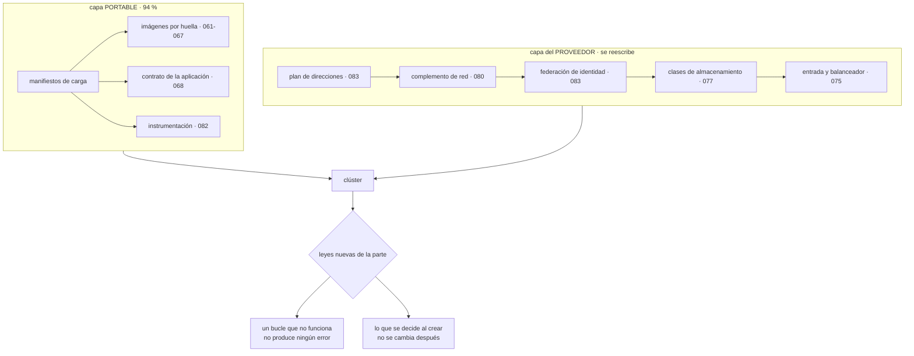

# 084 — Proyecto: plataforma Kubernetes portable

> [← Clase anterior](../../part-06-kubernetes-managed-platforms/083-eks-aks-y-gke-similitudes-y-diferencias/README.md) · [Índice de la parte](../README.md) · [Clase siguiente →](../../part-07-infrastructure-as-code-configuration/085-declarativo-imperativo-idempotencia-y-convergencia/README.md)

**Parte:** 06 — Kubernetes y plataformas administradas<br>
**Nivel:** intermedio-avanzado · **Horas estimadas:** 8<br>
**Laboratorio:** `capstone` · **Estado:** `EXECUTABLE_CORE`

## 🎯 Propósito

Integrar las once clases anteriores en una plataforma de Kubernetes que se pueda operar y mover, y **calificar la hipótesis de la clase 072**. Acertó en las tres afirmaciones y se quedó corta en una palabra: dijo que Kubernetes «renombraría» las cuatro fugas, y lo que hizo fue renombrarlas **y añadir un problema propio en cada una**. De esa corrección y de los simulacros salen las dos leyes que esta parte aporta, y la primera explica seis incidentes de seis clases distintas.

## 📚 Resultados de aprendizaje

Al finalizar podrás:

1. **Trazar** cada decisión de la plataforma hasta la clase que la tomó y su alternativa descartada.
2. **Calificar** la hipótesis de la clase 072 con evidencia, incluida la parte en que se quedó corta.
3. **Enunciar** las dos leyes que esta parte añade, con las apariciones que las respaldan.
4. **Provocar** tres fallos propios de un clúster y medir detección, impacto y recuperación.
5. **Entregar** una plataforma con su capa portable separada de la del proveedor.

## 🧩 Conceptos centrales

| Concepto | Comprensión verificable |
|---|---|
| `ausencia de acción como fallo` | En un sistema declarativo, un bucle que no funciona **no produce ningún error**: simplemente nada ocurre. Es el modo de fallo por defecto, no una excepción. |
| `decisión de creación` | Elección que se toma en minutos al crear un recurso y que no se puede cambiar después: plan de direcciones, complemento de red, modelo de vinculación, clave de partición. |
| `capa portable y capa del proveedor` | Separación entre lo que se conserva al cambiar de plataforma —los manifiestos— y lo que se reescribe entero —la infraestructura del clúster. |
| `hipótesis calificada` | Predicción evaluada después con datos, incluida la parte imprecisa. La de la clase 072 acertó y usó una palabra de menos, y esa palabra es lo que aporta. |
| `concentración tras la recuperación` | Efecto de que las reglas de colocación se evalúen solo al planificar: tras una caída, las réplicas se recolocan donde caben y el reparto se pierde en silencio. |
| `alerta de bucle detenido` | Señal sobre la marca de tiempo de la última reconciliación de cada controlador. Es la única forma de detectar la ausencia de acción. |

## 🧠 Modelo mental

Kubernetes es un sistema de reconciliación: declaras estado deseado y controladores reducen continuamente la diferencia con el estado observado.

Aplicado a esta clase, separa siempre cuatro planos: **intención** (qué necesita el usuario),
**configuración** (qué declaramos), **estado observado** (qué existe de verdad) y
**evidencia** (cómo sabemos que cumple). Confundirlos produce diseños que se ven correctos
en un diagrama pero fallan al operar.

## 🗺️ Flujo de razonamiento



## 📖 Desarrollo

### 1. La plataforma entregada y de dónde sale cada decisión

Doce decisiones, con su alternativa descartada y la trampa que evita:

| Decisión | Requisito | Alternativa descartada | Trampa que evita |
|---|---|---|---|
| Esperar convergencia tras aplicar | Saber que se desplegó (073) | Confiar en el éxito de `apply` | Tres despliegues que nunca ocurrieron |
| Migraciones como trabajo, no en inicialización | Una sola ejecución (074) | Contenedor de inicialización | Migración aplicada tres veces |
| Auxiliares con orden garantizado | Sin errores al arrancar y parar (074) | Contenedor normal | 70 errores por despliegue |
| Lista de destinos como primera comprobación | Diagnóstico rápido (075) | Empezar por los registros | 30 min por un selector |
| Configuración con huella en el nombre | Un cambio es un despliegue (076) | Objeto de nombre fijo | Réplicas divergentes 11 días |
| Vinculación diferida de volúmenes | Planificar antes de elegir zona (077) | Aprovisionamiento inmediato | Pods en Pending con nodos libres |
| Solicitudes medidas, no estimadas | Capacidad real (078) | Valores a ojo | 24 nodos donde bastaban 4 |
| Presupuesto como máximo indisponible | Poder actualizar (079) | Mínimo disponible | 124 días sin parchear |
| Espacios cerrados por política de red | Aislamiento real (080) | Confiar en el espacio de nombres | Desarrollo alcanzando producción |
| Validación contra el servidor antes de aplicar | Detectar antes (081) | Aplicar y ver | Selector inmutable en producción |
| Alerta de declarado frente a disponible | Ver la ausencia de acción (082) | Métricas de recursos | Cinco fallos activos meses |
| Capa portable separada de la del proveedor | Poder moverse (083) | Todo mezclado | 214 ficheros atados a una nube |

Y tres decisiones tomadas **en contra** de lo que sugiere el hábito:

```text
1. La imagen no lleva intérprete de órdenes y el diagnóstico se hace
   con contenedores efímeros, que además están sujetos a la política
   de admisión (clases 070, 072).

2. Los presupuestos de interrupción se expresan como máximo indisponible
   aunque «mínimo disponible» sea más intuitivo: es lo único que sigue
   siendo correcto al escalar (079).

3. Un índice de búsqueda salió del clúster hacia un servicio gestionado,
   después de hacer la cuenta completa. Contenerizar no obliga a
   autogestionar (077).
```

### 2. La hipótesis de la clase 072, calificada

La clase 072 dejó escrito:

> Kubernetes resolverá reubicación, despliegue progresivo y reparto de carga, y **no resolverá ninguna de las cuatro fugas**: las renombrará y devolverá a la aplicación las mismas obligaciones. Y su ley nueva será que **aceptado no es funcionando**.

**Afirmación 1 — resuelve reubicación, despliegue y reparto. CIERTA, con una cifra que corrige la expectativa.**

```text
reubicación tras caída de nodo    sí, y tarda ~5 min, no segundos (073)
                                  lo que sí tarda segundos es dejar de
                                  enviarle tráfico: 43 s medidos
despliegue progresivo             sí, con vuelta atrás en segundos (074)
reparto de carga                  sí, con la advertencia de las conexiones
                                  persistentes (075)
```

Las tres se cumplen. La corrección útil es la primera: **la reubicación existe y no es instantánea**, y dimensionar capacidad sin saberlo produce una expectativa falsa.

**Afirmación 2 — no resuelve las cuatro fugas. CIERTA, y la palabra «renombrar» se quedó corta.**

La clase 083 lo cuantificó: 13 de 214 manifiestos cambiaron al migrar, y los trece son exactamente las cuatro fugas. Pero Kubernetes hizo algo más que renombrarlas: **añadió un problema propio en cada una**.

```text
fuga            renombrada como            y ADEMÁS añadió
─────────────────────────────────────────────────────────────────────────────
almacenamiento  reclamación y clase        el volumen elige zona antes que
                                           el planificador (077)
red             servicio, política,        una política puede existir sin que
                entrada                    nada la implemente (080)
identidad       cuenta de servicio         quien crea pods lee los secretos
                                           del espacio (076)
ciclo de vida   comprobaciones y           la ventana de retirada depende del
                presupuesto                tamaño del clúster (075, 079)
```

Cuatro problemas nuevos, uno por fuga. Así que la formulación correcta es más incómoda que la predicha:

> Kubernetes renombra las cuatro fugas, devuelve las mismas obligaciones **y añade una dificultad propia en cada una**.

**Afirmación 3 — la ley nueva es que aceptado no es funcionando. CIERTA, y ahora medible.**

La clase 082 la convirtió en una métrica —réplicas declaradas menos disponibles— y esa métrica destapó cinco situaciones activas en su primera semana. La ley no solo se confirma: **se puede vigilar**, que es lo que la hace útil.

### 3. Dos leyes nuevas, con sus apariciones

**Ley 13. En un sistema declarativo, un bucle que no funciona no produce ningún error.**

Seis apariciones en seis clases de esta misma parte, con seis mecanismos distintos:

```text
el gestor de controladores sin reconciliar    tres despliegues no ocurridos   073
un objeto de entrada sin controlador          dos días sin tráfico            075
un objeto de escalado sin métrica             cuatro meses sin escalar        078
un presupuesto con selector desajustado       meses protegiendo a nadie       079
una política de red sin complemento que la
  implemente                                  ocho meses sin filtrar          080
un trabajo programado suspendido              nueve días sin ejecutarse       082
```

Las seis tienen la misma forma: **el objeto existe, es válido, figura en el inventario y no hace nada**. Ninguna produjo un error, ninguna apareció en un panel y todas se descubrieron por casualidad o al buscarlas.

Esta ley es una especialización de la que la clase 060 corrigió —un mecanismo que parece estar haciendo algo y no lo está— y merece enunciarse aparte porque su causa es distinta: allí era una configuración incompleta; aquí es **el modo de fallo por defecto de un modelo declarativo**. Si lo que hace el trabajo es un bucle, y el bucle no está, lo que ocurre es nada.

Y su antídoto es único y concreto:

```text
cada bucle necesita una señal de "última reconciliación con éxito"
y una alerta cuando esa marca envejece
```

Eso vale para los controladores integrados, para los de terceros y para los propios. Y para lo que no publica esa señal, la alternativa es medir el **efecto**: la métrica de la clase 082 detecta seis causas distintas sin conocer ninguna.

**Ley 14. Lo que se decide al crear un recurso es lo que no se puede cambiar después.**

Apariciones en cinco partes distintas:

```text
clave de partición de un contenedor            042
modo de una base de datos de documentos        054
modelo de vinculación de una clase de
  almacenamiento                               077
plan de direcciones, complemento de red y
  modelo de identidad de un clúster            083
ubicación y birregión de un bucket             053
```

Y la propiedad que las une es incómoda: **son decisiones de cinco minutos en un asistente o en una plantilla, tomadas al principio, cuando menos se sabe**. La consecuencia práctica es una regla de método:

```text
antes de crear cualquier recurso, preguntar:
  ¿qué de esto no voy a poder cambiar?
  ¿qué tamaño o qué patrón tendrá esto dentro de dos años?
  ¿cuánto cuesta rehacerlo si me equivoco?
```

Tres preguntas que cuestan diez minutos y que en esta parte habrían evitado un clúster con techo de 27 nodos, una clase de almacenamiento que ataba pods a una zona y un complemento de red incapaz de segmentar.

### 4. Tres fallos provocados y lo que enseñó cada uno

**Fallo 1 — pérdida de un nodo.** Se apaga un nodo con seis pods de producción.

```text
detección: deja de recibir tráfico           41 s
sustitución de los pods                       5 min 12 s
errores vistos por el cliente                 0
capacidad durante el episodio                 83 %
```

Cero errores, porque el margen de capacidad estaba dimensionado para perder un nodo. La reubicación tardó los cinco minutos que la clase 073 anticipó.

**Y el hallazgo:** al recuperarse, las réplicas no volvieron a repartirse.

```bash
$ kubectl get pods -l app=api -o custom-columns=N:.metadata.name,\
ZONA:.metadata.labels.'topology\.kubernetes\.io/zone' --no-headers | awk '{print $2}' | sort | uniq -c
      5 zona-b
      1 zona-c
```

Cinco de seis réplicas en la misma zona. Las reglas de reparto se evalúan **al planificar** (clase 078), y durante la caída los pods se colocaron donde cabían. Nadie los recolocó después, así que el clúster quedó en un estado en el que **la siguiente caída de zona sería total**.

```text
síntoma observable   ninguno: todos los pods sanos, servicio correcto
consecuencia real    el reparto entre zonas había desaparecido
corrección           reparto entre zonas estricto (no como preferencia),
                     y un reequilibrado periódico que recoloca
señal añadida        alerta si la mayor concentración por zona supera
                     un umbral
```

**Fallo 2 — actualizar el clúster con carga en curso.**

```text
nodos actualizados                            11
duración                                      3 h 40 min
errores HTTP durante la actualización         0
```

**Y el hallazgo:** cero errores HTTP y, al mirar el camino asíncrono como la clase 072 obligó a hacer:

```text
mensajes reentregados durante la actualización   1.847
trabajos programados que no se ejecutaron         2
```

Los mensajes reentregados eran esperables y los absorbió la idempotencia. Los dos trabajos programados no: se saltaron su ventana porque el nodo que los ejecutaba se estaba vaciando y el plazo de arranque (clase 074) los descartó.

```text
corrección   los trabajos críticos con plazo de arranque mayor que la ventana
             de vaciado de un nodo, y alerta cuando un trabajo programado
             no crea ejecuciones en dos intervalos (clase 082)
```

**Fallo 3 — detener un controlador.** Se reduce a cero el controlador de entrada durante veinte minutos, sin avisar al equipo.

```text
tiempo hasta que alguien lo notó              18 min
cómo se notó                                  un usuario avisó
alertas disparadas                            1 (disponibilidad del servicio)
alertas que señalaban la CAUSA                0
```

**Y el hallazgo:** la alerta de disponibilidad detectó el efecto y nada señaló que el controlador no estaba. Se repitió el simulacro deteniendo un controlador cuyo efecto no es inmediato —el que renueva certificados—:

```text
tiempo hasta que alguien lo notó              no se notó en 20 min
tiempo hasta que se habría notado             ~40 días, al caducar el certificado
```

Eso es la ley 13 en su forma más pura, y la corrección es la que esa ley pide:

```text
señal de última reconciliación con éxito para cada controlador
alerta cuando esa marca envejece más de lo esperado
+ para los certificados, vigilar el VENCIMIENTO desde fuera (clase 058)
```

Los tres hallazgos comparten forma con los de las clases 048, 060 y 072: **la infraestructura aguantó los tres fallos y en los tres había algo que ninguna revisión de configuración podía mostrar**.

### 5. La entrega y la pregunta que abre la parte 07

**La entrega, sin conocimiento tácito.**

```text
capa portable       manifiestos, sin nada del proveedor
capa de plataforma  creación, complementos, clases, entrada, identidad
línea base          26 afirmaciones, cada una con su prueba negativa
verificar.sh        ejecuta las 26 y devuelve código de salida
ADR                 12 decisiones con su alternativa descartada
riesgos residuales  5, con responsable y condición de revisión
alertas             14, de las cuales 7 sobre cosas que dejan de ocurrir
procedimientos      3 fallos ensayados, con verificación posterior
línea base medida   rendimiento, despliegue, actualización y coste
```

Los **cinco riesgos residuales**:

```text
1. reubicación de ~5 min ante caída de nodo: aceptada, con margen de capacidad
2. un espacio de nombres no aísla frente a código no confiable (080)
3. el plan de direcciones fija el techo en 110 nodos; revisar a los 80
4. dos complementos gestionados se actualizan en el calendario del proveedor
5. las escrituras del índice migrado siguen en una sola región
```

**La comparación con el punto de partida**, medida con el mismo método:

```text                                          antes         después
nodos en horas valle                             24              4
solicitudes reservadas frente a uso           78 / 21 %      34 / 26 %
días sin poder actualizar el clúster            124              0
políticas de red efectivas                     0 de 14        14 de 14
personas con administración total                 42              2
errores por despliegue                         20-60             0
errores al vaciar un nodo bajo carga           1.284             0
tiempo de detección de un fallo silencioso   días o nunca    < 10 min
coste mensual del clúster                    3.180 USD      1.120 USD
pruebas negativas ejecutadas                  0 de 26        26 de 26
```

**Y la pregunta que abre la parte 07.**

Esta parte deja una plataforma que funciona y que se mantiene con órdenes ejecutadas por personas o por una canalización. Nada garantiza que dentro de un mes el clúster se parezca al repositorio: un cambio manual sobrevive, un objeto borrado no vuelve, una diferencia entre entornos se acumula — que es exactamente lo que la clase 081 midió al unificar cuatro copias y encontrar treinta y una divergencias que nadie había decidido.

Y resulta que el mecanismo que resuelve eso ya está descrito en esta parte: **es el bucle de la clase 073**, aplicado a la infraestructura en vez de a las cargas.

> Las clases 047 y 059 trataron la infraestructura como código que alguien ejecuta. Si el modelo declarativo con reconciliación continua es mejor que ejecutar órdenes —y esta parte sugiere que lo es—, ¿por qué la infraestructura se sigue gestionando con ejecuciones? ¿Qué se gana al ponerle un bucle, y qué problema nuevo aparece cuando **dos bucles creen que mandan sobre el mismo recurso**?

La hipótesis que se escribe ahora, para poder equivocarse de forma comprobable:

> El bucle continuo eliminará la desviación entre repositorio y realidad, y hará visible una clase de problema que hoy no se ve: **la frontera de propiedad entre quienes escriben sobre el mismo objeto**. Aparecerá al menos una de las catorce leyes con un mecanismo nuevo, y la más probable es la 13 — porque un bucle de infraestructura que se detiene tampoco produce ningún error.

La parte 07 la califica.

## 🔬 Ejemplo trabajado

**Entrega del capstone de la parte 06, con las cifras que se llevan a la parte 07.**

**Verificación completa.** Las 26 afirmaciones de la línea base:

```bash
$ ./verificar.sh
✓ despliegue verificado por convergencia        rollout status, no apply
✓ imágenes por huella en todos los manifiestos  0 etiquetas
✓ firma verificada en la admisión               imagen sin firma → rechazada
✓ migraciones como trabajo previo               0 en inicialización
✓ auxiliares con orden garantizado              7 de 7
✓ lista de destinos no vacía en todos los servicios  19 de 19
✓ solo el frontal publicado                     1 objeto de entrada
✓ resolución de nombres con nombre absoluto     4 servicios corregidos
✓ configuración con huella en el nombre         9 de 9
✓ ningún secreto en el repositorio              0 coincidencias
✓ secretos desde el gestor externo              11 de 11
✓ cifrado en reposo del almacén                 activo
✓ vinculación diferida en clases zonales        3 de 3
✓ política de recuperación de conservación      3 de 3
✓ restauración de volumen probada               1.284.391 filas · 2 h 40 min
✓ solicitudes y límites en todos los contenedores  74 de 74
✓ ningún pod en mejor esfuerzo en producción    0
✓ presupuestos con margen                       12 de 12, permitidas ≥ 1
✓ ningún presupuesto con selector vacío         0
✓ espacios cerrados por política de red         6 de 6
✓ política de red efectiva                      desarrollo → producción: rechazado
✓ perfil de seguridad en modo rechazo           6 de 6
✓ federación acotada a espacio y cuenta         otro espacio → denegado
✓ ningún testigo montado sin necesidad          4 de 74
✓ despliegue con carga: cero errores            0 HTTP · 0 reentregas
✓ vaciado de nodo con carga: cero errores       0
26/26 correctas
```

**Línea base medida:**

```text
rps 981,2 · p50 40,4 ms · p95 95,1 ms · p99 201,8 ms · errores 0
despliegue completo                    1 min 40 s
vuelta atrás                              34 s
actualización del clúster completa     3 h 40 min
reubicación tras caída de nodo         5 min 12 s
retirada de tráfico de un nodo caído      41 s
costo mensual                          1.120 USD
```

**Los tres fallos, con lo aprendido en cada uno:**

```text                          detección   impacto real           lección
pérdida de un nodo               41 s       0 errores, y el         las reglas de
                                            reparto entre zonas     colocación no
                                            desapareció             recolocan nada

actualización con carga           —         0 errores HTTP,         lo que no tiene
                                            2 trabajos programados  métrica propia
                                            saltados                no se verifica

controlador detenido            18 min      lo notó un usuario;     un bucle que se
                                            0 alertas señalaban     detiene no da
                                            la causa                ningún error
```

**El hallazgo que justificó el capstone.** Tras el simulacro de nodo, todo estaba en verde:

```text
pods listos            6 de 6
servicio               disponible
presupuesto            cumplido
presupuesto de error   intacto
```

Y el reparto:

```bash
$ kubectl get pods -l app=api -o json | jq -r '.items[]
  | .metadata.labels["topology.kubernetes.io/zone"] // "?"' | sort | uniq -c
      5 zona-b
      1 zona-c
```

**Cinco de seis réplicas en una zona, sin ninguna señal.** La regla de reparto estaba puesta como preferencia —la corrección de la clase 078 para no bloquear el crecimiento— y durante la caída los pods se colocaron donde cabían. Al recuperarse, nadie los movió.

```text
síntoma observable   ninguno
consecuencia real    la siguiente caída de zona habría sido total
causa                las reglas se evalúan al planificar, no después
qué lo destapó       contar las zonas después del simulacro,
                     no el simulacro en sí
```

Corrección y comprobación posterior:

```text                                    antes            después
reparto entre zonas                   preferencia        estricto
reparto entre nodos                   preferencia        preferencia
reequilibrado                          ninguno       periódico, en ventana
alerta de concentración por zona       ninguna       > 50 % en una zona → aviso
zonas tras repetir el simulacro       5/1/0            2/2/2
```

**Se entrega a la parte 07 con:**

```text
catorce leyes observadas, dos de ellas nuevas de esta parte
las cuatro fugas, con el problema propio que Kubernetes añade a cada una
26 afirmaciones y su guion de verificación
12 decisiones con alternativa descartada
5 riesgos residuales con responsable
la proporción medida de portabilidad: 94 % de manifiestos, 0 % de plataforma
```

Y la hipótesis escrita para la parte 07:

> El bucle continuo eliminará la desviación entre repositorio y realidad y hará visible la frontera de propiedad entre quienes escriben sobre el mismo objeto. Y volverá a aparecer la ley 13, porque un bucle de infraestructura detenido tampoco produce ningún error.

**La lección que esta parte deja al programa**: la hipótesis de la clase 072 acertó en todo y usó una palabra de menos. Kubernetes no solo renombra las cuatro fugas: **añade una dificultad propia en cada una**, y las cuatro nuevas tienen la misma forma que la ley 13 — un objeto que existe y no hace lo que su nombre promete. De las once clases de la parte, seis produjeron un incidente de esa familia, con seis mecanismos distintos. **Esa frecuencia no es mala suerte: es el modo de fallo por defecto de un sistema donde el trabajo lo hacen bucles.**

## 🧪 Laboratorio guiado

Ejecuta desde la raíz:

```bash
python classes/part-06-kubernetes-managed-platforms/084-proyecto-plataforma-kubernetes-portable/lab.py
```

El laboratorio selecciona el motor de práctica **`capstone`** y produce
`lab_result.json`. El escenario, sus comprobaciones y el artefacto esperado corresponden a
esta clase; no requiere credenciales y deja explícito qué debe revalidarse en un sandbox real.

1. Lee `exercise.steps` y formula una predicción antes de ejecutar.
2. Ejecuta la práctica y verifica todos los elementos de `checks`.
3. Provoca el caso de `negative_test` y explica la señal observada.
4. Materializa `plataforma-kubernetes` en `evidence/` usando la plantilla indicada.
5. Para proveedor real, sigue `sandbox.requires`, registra costo y ejecuta `destroy`.

### Evidencia esperada

El artefacto principal es un incremento integrado, demostrable y documentado. Además, la entrega debe incluir el comando ejecutado,
la salida estructurada y una conclusión que no exceda lo observado.

## 🏆 Reto verificable

Construye **`plataforma-kubernetes`** para el caso CloudShop. Incluye una alternativa descartada,
un supuesto que pueda falsarse, una prueba de fallo y una decisión de rollback.

## ✅ Criterio de aceptación

- [ ] `lab.py` termina con código 0 y genera JSON válido.
- [ ] La entrega conecta al menos tres requisitos con mecanismos verificables.
- [ ] Existe una prueba positiva y una prueba negativa con evidencia.
- [ ] Seguridad, costo y operación aparecen como decisiones, no como anexos.
- [ ] Se declara una limitación y una condición que obligaría a revisar el diseño.
- [ ] Otra persona puede repetir el recorrido sin conocimiento tácito.

## ⚠️ Errores frecuentes

| Síntoma | Causa probable | Corrección |
|---|---|---|
| Tras recuperarse de una caída, todas las réplicas quedan en la misma zona | Las reglas de colocación se evalúan al planificar y nadie recoloca después | Reparto estricto entre zonas, reequilibrado periódico y alerta sobre la concentración máxima por zona. |
| Una actualización con carga da cero errores y aun así se pierde trabajo | Solo se midió el camino HTTP; los trabajos programados que caían en la ventana de vaciado se saltaron | Amplía el criterio de verificación al camino asíncrono y alerta cuando un trabajo programado deja de crear ejecuciones. |
| Un controlador se detiene y nadie se entera | En un modelo declarativo la ausencia de acción no produce ningún error | Señal de última reconciliación por controlador con alerta de envejecimiento, y medición del efecto donde no haya señal. |
| El clúster no puede crecer y hay que recrearlo para arreglarlo | El plan de direcciones y el complemento se fijaron al crear el clúster | Antes de crear cualquier recurso, pregunta qué no se podrá cambiar, qué tamaño tendrá en dos años y cuánto cuesta rehacerlo. |
| Se espera que la reubicación tras una caída de nodo sea inmediata | Retirar el tráfico tarda segundos; sustituir los pods tarda minutos por diseño | Dimensiona el margen de capacidad para operar sin ese nodo durante la ventana, y documenta ambos tiempos. |
| Un objeto de seguridad existe y no protege nada | Es la ley 13: el bucle que debía implementarlo no está o el selector no coincide | Toda afirmación de control necesita una prueba negativa que la obligue a actuar. |

## 🛡️ Seguridad, ética y costo

Trabaja con cuentas propias o sandboxes autorizados. No publiques secretos, identificadores
reales ni datos personales. Antes de crear recursos pagos define presupuesto, etiquetas y
comando de destrucción; después verifica que no queden recursos huérfanos. Los ejemplos
locales enseñan contratos, pero no certifican cumplimiento ni disponibilidad de producción.

## ❓ Preguntas de comprobación

1. ¿En qué acertó la hipótesis de la clase 072 y qué palabra se quedó corta?
2. Enuncia la ley 13 y cita cuatro de sus seis apariciones con mecanismos distintos.
3. ¿Por qué la ley 14 es especialmente peligrosa, y qué tres preguntas la mitigan?
4. Tras el simulacro de nodo todo estaba en verde y el reparto entre zonas había desaparecido. ¿Por qué, y qué señal lo detecta?
5. ¿Qué proporción de la plataforma es portable y dónde se concentra exactamente lo que no lo es?

## 🔗 Referencias

- Kubernetes (2025). *Production environment checklist* — consideraciones de un clúster operable. <https://kubernetes.io/docs/setup/production-environment/>
- Kubernetes (2025). *Configuration best practices* — decisiones que conviene tomar al crear. <https://kubernetes.io/docs/concepts/configuration/overview/>
- CNCF (2025). *Kubernetes cluster conformance* — qué garantiza la conformidad y qué no. <https://www.cncf.io/certification/software-conformance/>
- Google (2018). *The Site Reliability Workbook*, cap. 15 — simulacros de fallo y hallazgos. <https://sre.google/workbook/postmortem-culture/>
- Kubernetes (2025). *Descheduler* — reequilibrado de pods tras cambios de topología. <https://github.com/kubernetes-sigs/descheduler>
- Documentación oficial vigente del servicio implementado; registra URL y fecha de consulta.

---

> [Evaluación](assessment.md) · [Contrato de clase](lesson.yaml) · [Índice de la parte](../README.md)
