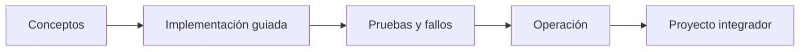

# Parte 06 — Kubernetes y plataformas administradas

> [← Parte 05](../part-05-containers-docker-oci/README.md) · [Índice completo](../README.md) · [Parte 07 →](../part-07-infrastructure-as-code-configuration/README.md)

**Nivel:** intermedio-avanzado · **Clases:** 12 · **Duración sugerida:** 6–8 semanas

Operar cargas declarativas y portables sobre EKS, AKS o GKE.

## Resultados de la parte

Al completar esta parte podrás explicar el dominio con lenguaje independiente del proveedor,
implementar sus mecanismos esenciales, diagnosticar fallos y defender decisiones mediante
evidencia, costo, seguridad y objetivos de confiabilidad.

## Modelo mental

Kubernetes es un sistema de reconciliación: declaras estado deseado y controladores reducen continuamente la diferencia con el estado observado.

## Secuencia

## Clases

| ID | Clase | Laboratorio | Horas |
|---:|---|---|---:|
| 073 | [API server, etcd, scheduler, controllers y kubelet](073-api-server-etcd-scheduler-controllers-y-kubelet/README.md) | `kubernetes` | 4 |
| 074 | [Pods, ReplicaSets, Deployments y Jobs](074-pods-replicasets-deployments-y-jobs/README.md) | `kubernetes` | 4 |
| 075 | [Services, DNS, Ingress y Gateway API](075-services-dns-ingress-y-gateway-api/README.md) | `network` | 4 |
| 076 | [ConfigMaps, Secrets y configuración externa](076-configmaps-secrets-y-configuracion-externa/README.md) | `configuration` | 4 |
| 077 | [Volumes, PersistentVolumes, CSI y StatefulSets](077-volumes-persistentvolumes-csi-y-statefulsets/README.md) | `storage` | 4 |
| 078 | [Requests, limits, scheduling y autoscaling](078-requests-limits-scheduling-y-autoscaling/README.md) | `capacity` | 4 |
| 079 | [Probes, rollouts, rollback y PodDisruptionBudget](079-probes-rollouts-rollback-y-poddisruptionbudget/README.md) | `reliability` | 4 |
| 080 | [Namespaces, RBAC, NetworkPolicy y admission](080-namespaces-rbac-networkpolicy-y-admission/README.md) | `security` | 4 |
| 081 | [Helm, Kustomize y gestión de paquetes](081-helm-kustomize-y-gestion-de-paquetes/README.md) | `configuration` | 4 |
| 082 | [Logs, métricas, eventos y depuración](082-logs-metricas-eventos-y-depuracion/README.md) | `observability` | 4 |
| 083 | [EKS, AKS y GKE: similitudes y diferencias](083-eks-aks-y-gke-similitudes-y-diferencias/README.md) | `decision` | 4 |
| 084 | [Proyecto: plataforma Kubernetes portable](084-proyecto-plataforma-kubernetes-portable/README.md) | `capstone` | 8 |

## Evaluación de la parte

- 35 % laboratorios y evidencia reproducible.
- 25 % retos verificables.
- 20 % decisiones y ADR.
- 10 % seguridad, confiabilidad y costo.
- 10 % proyecto integrador de la parte.

Se aprueba con 80 % de clases en nivel B o superior y el proyecto integrador reproducible.

## Pauta bibliográfica

- Kubernetes: Up and Running — Burns, Beda y Hightower.
- Kubernetes Patterns — Ibryam y Huß.
- Production Kubernetes — Rosso et al..
