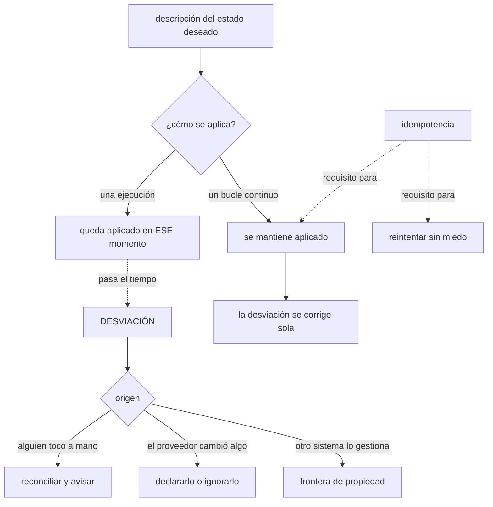

# 085 — Declarativo, imperativo, idempotencia y convergencia

> [← 084 · Proyecto: plataforma Kubernetes portable](../../part-06-kubernetes-managed-platforms/084-proyecto-plataforma-kubernetes-portable/README.md) · [Índice de la parte](../README.md) · [086 · Terraform: HCL, providers, resources y grafo →](../../part-07-infrastructure-as-code-configuration/086-terraform-hcl-providers-resources-y-grafo/README.md)

**Parte:** 07 — Infraestructura como código y configuración<br>
**Nivel:** intermedio-avanzado · **Horas estimadas:** 4<br>
**Laboratorio:** `iac` · **Estado:** `EXECUTABLE_CORE`

## 🎯 Propósito

Fijar los cuatro conceptos que decidieron todo lo que va a ocurrir en esta parte, y que ya se han pagado varias veces en las anteriores: qué distingue declarar de ordenar, qué significa exactamente que una operación sea idempotente, por qué la convergencia es una propiedad del bucle y no del fichero, y **por qué una plantilla que se aplica una vez no garantiza nada dentro de un mes**. La clase 084 dejó una pregunta —si el bucle continuo es mejor que ejecutar órdenes, por qué la infraestructura se sigue gestionando con ejecuciones— y esta es la base para responderla.

## 📚 Resultados de aprendizaje

Al finalizar podrás:

1. **Distinguir** una descripción del estado deseado de una secuencia de órdenes, con sus consecuencias operativas.
2. **Comprobar** si una operación es idempotente en vez de suponerlo.
3. **Explicar** por qué la convergencia exige un bucle y qué se degrada sin él.
4. **Reconocer** la desviación y clasificarla por su origen antes de corregirla.
5. **Elegir** entre reconciliar, recrear o corregir a mano según el tipo de recurso.

## 🧩 Conceptos centrales

| Concepto | Comprensión verificable |
|---|---|
| `declarativo` | Se describe **qué debe existir**; otro decide cómo llegar. La descripción vale igual desde cualquier estado de partida, y por eso se puede volver a aplicar. |
| `imperativo` | Se describe **qué hacer**, en orden. Depende del estado de partida, así que ejecutarlo dos veces puede no dar el mismo resultado. |
| `idempotencia` | Aplicar la misma operación dos veces deja el mismo resultado que aplicarla una. **No es lo mismo que no fallar la segunda vez.** |
| `convergencia` | Propiedad de un sistema que se acerca al estado deseado con el tiempo, corrigiendo lo que se desvía. Exige un **bucle**, no un fichero. |
| `desviación` | Diferencia entre lo declarado y lo que existe. Tiene tres orígenes distintos y cada uno pide una respuesta distinta. |
| `ganado frente a mascota` | Recurso que se reemplaza sin ceremonia frente a otro que se cuida y se repara. Decide si la respuesta a una desviación es recrear o corregir. |

## 🧠 Modelo mental

IaC trata la infraestructura como producto versionado: el plan explica intención, el estado conecta intención y realidad, y la revisión reduce cambios accidentales.

Aplicado a esta clase, separa siempre cuatro planos: **intención** (qué necesita el usuario),
**configuración** (qué declaramos), **estado observado** (qué existe de verdad) y
**evidencia** (cómo sabemos que cumple). Confundirlos produce diseños que se ven correctos
en un diagrama pero fallan al operar.

## 🗺️ Flujo de razonamiento



## 📖 Desarrollo

### 1. Declarar no es ordenar, y la diferencia se nota al repetir

La distinción parece obvia y sus consecuencias no lo son:

```text
imperativo   "crea la red, luego la subred, luego la máquina"
             depende del estado de partida
             ejecutarlo dos veces puede fallar o duplicar
             para corregir algo hay que saber qué hay ahora

declarativo  "debe existir esta red con esta subred y esta máquina"
             vale desde cualquier estado de partida
             ejecutarlo dos veces deja lo mismo
             para corregir algo se compara y se actúa
```

La consecuencia práctica no es de elegancia: es que **con una descripción declarativa se puede volver a aplicar sin saber qué pasó antes**, y eso es lo que permite automatizar sin miedo.

Y conviene separar dos cosas que se confunden constantemente:

```text
un FORMATO declarativo    un fichero que describe el estado deseado
un SISTEMA declarativo    algo que compara ese estado con la realidad
                          y actúa para acercarlos, una y otra vez
```

Un fichero de manifiestos aplicado a mano es un formato declarativo dentro de un proceso imperativo: alguien decide cuándo ejecutarlo. Y eso deja exactamente el hueco que la clase 084 señaló — **nada garantiza que dentro de un mes la realidad se parezca al fichero**.

Y hay un matiz que el programa ya ha pagado y conviene recordar: **una descripción declarativa describe el estado, no el camino**. Cuando el camino importa —una migración de datos, un orden de corte, un cambio de esquema en dos fases (clases 071 y 079)— la descripción no basta y hay que añadir un procedimiento. Ese es el límite honesto del enfoque, y las clases 047 y 059 ya lo enunciaron: **la infraestructura como código describe el destino, no el trayecto**.

Y una tercera categoría que aparece siempre y merece nombre, porque es donde vive la mayor parte del trabajo real:

```text
lo declarativo cubre     lo que debe existir y cómo debe estar configurado
lo procedimental cubre   migraciones, cortes, rotaciones, restauraciones
el bucle cubre           que lo primero siga siendo cierto con el tiempo
```

Las tres piezas hacen falta, y confundir una con otra produce dos errores simétricos: intentar expresar una migración como estado deseado, o gestionar el estado deseado con guiones.

### 2. Idempotencia: qué es y qué no es

La definición es corta y se aplica mal con frecuencia:

```text
una operación es idempotente si aplicarla N veces
deja el mismo resultado que aplicarla una vez
```

Y lo que **no** significa:

```text
no significa "la segunda vez no falla"
no significa "no hace nada la segunda vez"
no significa "es segura de reintentar" — eso se DEDUCE de ella, no al revés
```

La distinción importa porque el programa ha dependido de esta propiedad seis veces:

```text
manejadores de mensajes que pueden recibir duplicados   033, 044, 056
reproducción de mensajes para reparar un daño            056
plantillas que hay que reejecutar tras un fallo parcial   047, 059
reconciliación continua de un bucle                       073
```

Y en las cuatro, la propiedad se construye del mismo modo: **la operación consulta el estado antes de actuar, o usa una clave que la identifica**.

```text
"crear el usuario X"                    no idempotente
"asegurar que existe el usuario X"      idempotente
"añadir 10 al saldo"                    no idempotente
"fijar el saldo a 150"                  idempotente
"aplicar la transacción con id T-991"   idempotente por clave
```

La tercera y la cuarta son la misma operación de negocio expresada de dos formas, y solo una se puede reintentar. Es exactamente la distinción que las clases 044 y 056 exigían al manejador.

Y la comprobación práctica, que se puede automatizar y casi nunca se hace:

```bash
$ aplicar && aplicar
# la segunda ejecución no debe cambiar nada
$ aplicar --solo-mostrar-cambios | wc -l
0                                                                           ✓
```

Una segunda ejecución que sigue proponiendo cambios significa que algo **no es idempotente**, y las dos causas habituales conviene conocerlas:

```text
1. la descripción no declara un campo que el sistema rellena solo
   → cada comparación ve una diferencia y propone corregirla
   → es el ruido del `what-if` de la clase 047 y del plan de la 059

2. algo genera un valor nuevo en cada ejecución
   una marca de tiempo, un identificador aleatorio, un secreto regenerado
   → cada aplicación cambia el recurso de verdad
```

La segunda es peor: no es ruido, es **una plantilla que modifica infraestructura cada vez que se ejecuta**, lo que convierte cada aplicación en un cambio con riesgo aunque nadie haya tocado el código.

### 3. La convergencia es del bucle, no del fichero

Un sistema converge si, dejado a su aire, se acerca al estado deseado. Y eso exige tres cosas, no una:

```text
1. una descripción del estado deseado
2. la capacidad de OBSERVAR el estado real
3. algo que compare y actúe, REPETIDAMENTE
```

Las dos primeras las tienen todas las herramientas de esta parte. La tercera es la que cambia el resultado, y su ausencia produce una degradación con un patrón conocido:

```text
día 0    se aplica: realidad = descripción
día 3    alguien cambia algo a mano para resolver una urgencia
día 12   el proveedor añade un campo por defecto
día 30   otro equipo modifica un recurso que creía suyo
día 60   nadie sabe si la descripción refleja la realidad
día 90   nadie se atreve a aplicarla, por si deshace algo necesario
```

Ese último renglón es el estado final de casi toda infraestructura como código sin bucle, y es peor que no tenerla: **existe una descripción en la que nadie confía**, así que los cambios se siguen haciendo a mano y la descripción se queda como documentación desactualizada.

Con un bucle, la línea temporal es otra:

```text
día 3    alguien cambia algo a mano
día 3    el bucle lo detecta y lo revierte, y deja constancia
         → el cambio manual DEJA DE FUNCIONAR como método
```

Y ahí está el efecto cultural que importa más que el técnico: cuando los cambios manuales se deshacen solos, **la única vía que funciona es el repositorio**. No hay que convencer a nadie: el sistema hace que la otra vía no sirva.

Con dos matices honestos que hay que aceptar antes de adoptarlo:

```text
revertir un cambio manual durante un incidente puede empeorarlo
  → hace falta una forma de suspender el bucle, y usarla deja rastro
el bucle necesita permisos amplios y funciona sin supervisión
  → es un actor privilegiado más, con su propia superficie
```

El primero se resuelve con un mecanismo explícito de suspensión y una alerta cuando se usa. El segundo con lo de siempre: privilegio mínimo, ámbito acotado y auditoría — el mismo tratamiento que cualquier identidad de carga desde la clase 026.

Y la ley 13 de la clase 084 aparece aquí antes de tiempo, y conviene anticiparla: **si el bucle se detiene, no ocurre nada y nadie se entera**. Un sistema convergente sin una señal de última reconciliación con éxito es un sistema que puede llevar semanas sin converger.

### 4. La desviación tiene tres orígenes y tres respuestas

Tratar toda diferencia entre lo declarado y lo real como «alguien tocó algo» lleva a corregir cosas que no había que corregir. Los tres orígenes:

```text
1. INTERVENCIÓN MANUAL
   alguien cambió algo, casi siempre por una urgencia
   respuesta: reconciliar, y averiguar qué urgencia lo motivó
              — si el cambio era necesario, va al repositorio

2. EL PROVEEDOR
   campos que el servicio rellena, valores por defecto que cambian,
   normalizaciones
   respuesta: declararlos explícitamente, o ignorarlos de forma declarada

3. OTRO SISTEMA QUE GESTIONA EL MISMO RECURSO
   un escalado automático que cambia réplicas, un operador que ajusta
   una configuración, un controlador que añade anotaciones
   respuesta: FRONTERA DE PROPIEDAD, no reconciliación
```

El tercero es el que la clase 084 anticipó como el problema nuevo de esta parte, y ya apareció en la 081 con las réplicas oscilando entre el manifiesto y el escalado automático. Su corrección no es técnica sino de acuerdo:

```text
para cada campo de cada recurso, UN solo dueño
lo que gestiona otro sistema, NO se declara
y si la herramienta lo permite, se declara que se ignora
```

Y hay un caso especial que merece decisión propia: **los recursos que se crean solos**. Un volumen que un controlador aprovisiona, un certificado que se emite, una regla que un servicio añade. Declararlos produce conflicto permanente; no declararlos deja infraestructura sin registro. La salida habitual es declarar **quién los crea** en vez de los recursos, que es lo que hacen las clases de almacenamiento y los emisores de certificados.

Y la clasificación **ganado o mascota** decide la respuesta cuando algo está mal:

```text
ganado    se reemplaza sin ceremonia: nodos, contenedores, instancias sin estado
          respuesta a una desviación: DESTRUIR y recrear
          más simple, más fiable, y exige que nada importante viva dentro

mascota   se cuida y se repara: una base de datos con años de datos,
          un recurso con una identidad que otros referencian
          respuesta a una desviación: corregir en su sitio, con cuidado
```

La mayor parte del valor de esta parte viene de **mover cosas de la segunda categoría a la primera**, y la pregunta que lo consigue es siempre la misma: qué hay dentro de este recurso que no se pueda reconstruir. Si la respuesta es «nada», es ganado, y su gestión se vuelve trivial.

Y una advertencia sobre recrear que el programa ya pagó en las clases 047 y 077: **recrear no siempre es reversible**. Un recurso con datos, con una dirección que otros usan o con una identidad referenciada no se puede sustituir sin consecuencias. Antes de convertir algo en ganado hay que comprobar que de verdad lo es.

### 5. Lo que esta parte tiene que responder

Con los cuatro conceptos fijados, las once clases siguientes tienen preguntas concretas que contestar, y conviene enunciarlas ahora para poder evaluarlas después:

```text
086-090   cómo se describe, dónde vive lo que la herramienta cree saber,
          y qué hacer cuando la realidad y esa creencia divergen
091-092   cómo se comprueba antes de aplicar, y cómo se manejan los secretos
          sin repetir los tres incidentes de las clases 047, 059 y 061
093       qué cambia entre herramientas y qué es común
094-095   qué queda fuera de lo declarativo, y cómo se ofrece a otros equipos
096       si todo lo anterior sostiene cuatro entornos promovibles
```

Y tres criterios que van a decidir si una solución de esta parte es buena, sacados de lo que las partes anteriores ya midieron:

```text
1. ¿se puede ver el cambio antes de aplicarlo, y es legible?
   el ruido convierte la revisión en un ritual: clases 047 y 059

2. ¿lo que se revisó es exactamente lo que se aplica?
   el plan guardado de la clase 059

3. ¿alguien sabría que el sistema dejó de converger?
   la ley 13 de la clase 084
```

Los tres son comprobaciones, no funciones de una herramienta. Y esa es la tesis de la parte, que conviene dejar dicha desde el principio:

> La diferencia entre una infraestructura como código que funciona y una que se abandona **no está en la herramienta**. Está en si el cambio se puede leer, si lo leído es lo que se ejecuta, y si alguien se entera cuando el mecanismo se detiene.

Y una nota sobre lo que **no** es infraestructura como código, porque la confusión produce proyectos interminables:

```text
no es    reescribir toda la infraestructura existente antes de empezar
no es    describir hasta el último detalle de cada recurso
no es    prohibir toda intervención manual desde el primer día

sí es    que los recursos nuevos nazcan declarados
         que los existentes se adopten cuando haya un motivo para tocarlos
         que la intervención manual sea visible y temporal
```

El adoptar progresivamente es lo que hace viable el enfoque en una organización con años de infraestructura, y la clase 090 da el mecanismo concreto para incorporar lo que ya existe sin recrearlo.

## 🔬 Ejemplo trabajado

**CloudShop tiene tres años de infraestructura y dos intentos fallidos de infraestructura como código. El equipo hace un inventario antes del tercer intento, y el resultado explica por qué fracasaron los dos anteriores.**

**El estado de partida.**

```text
repositorio de plantillas          existe, 41 ficheros
última aplicación real             hace 7 meses
recursos que describe              ~60 %
recursos que describe correctamente  se desconoce
nadie se atreve a aplicarlo        confirmado por tres personas distintas
```

La última fila es el diagnóstico completo: **existía una descripción en la que nadie confiaba**, así que todos los cambios seguían haciéndose a mano y la descripción envejecía.

**Por qué fracasaron los dos intentos anteriores.**

Al revisar el historial:

```text
intento 1 (2024)   objetivo: describir TODA la infraestructura existente
                   abandonado a los 5 meses, al 34 %
                   causa: no había fecha de entrega ni valor intermedio

intento 2 (2025)   objetivo: aplicar la plantilla en producción
                   abandonado tras la primera aplicación
                   causa: el plan proponía 140 cambios y nadie sabía
                          cuáles eran reales
```

Los 140 cambios se analizaron por primera vez en este inventario, y su clasificación es el hallazgo del ejercicio:

```text                                        cambios   origen
campos que el proveedor rellena solo            96      proveedor
valores que otro sistema gestiona               22      otro sistema
cambios manuales reales                         14      intervención
diferencias legítimas por entorno                8      la plantilla estaba mal
```

**El 84 % del ruido no era desviación.** Eran campos no declarados y recursos gestionados por otro sistema, exactamente los orígenes 2 y 3 de esta clase. Y ese ruido fue lo que hizo la revisión ilegible y el intento inviable.

**Las correcciones, por origen.**

```text                                        antes            después
campos rellenados por el proveedor      no declarados     declarados: 96 campos
                                                          en 11 recursos
recursos gestionados por otro sistema    declarados      declarados como ignorados
                                                          o retirados de la plantilla
cambios manuales reales                      14        11 incorporados al
                                                       repositorio, 3 revertidos
diferencias por entorno                       8        expresadas como variables
```

Y el resultado sobre el plan:

```text                                        antes            después
cambios propuestos en una ejecución limpia    140                0
legibilidad de la revisión                  ilegible        una página
confianza para aplicar                      ninguna        aplicado el mismo día
```

Cero cambios propuestos en una ejecución sin modificaciones es la comprobación de idempotencia de esta clase, y fue la primera vez en tres años que se pudo hacer.

**Los tres cambios manuales revertidos, y lo que enseñaron.**

```text
1. una regla de cortafuegos abierta "temporalmente" hacía 14 meses
   → se revirtió; nadie la echó de menos
2. un tamaño de instancia subido durante un incidente
   → era necesario: se incorporó al repositorio
3. una etiqueta añadida a mano para una auditoría
   → se incorporó, y se añadió a la plantilla de todos los recursos
```

La proporción —dos de tres cambios manuales eran necesarios— es la razón por la que revertir sin preguntar es un error. **Un cambio manual es información sobre algo que la descripción no contemplaba.**

**Y la clasificación de recursos, que cambió el alcance del proyecto.**

```text                                     ganado    mascota
nodos y grupos de nodos                     sí
contenedores y despliegues                  sí
redes, subredes y reglas                    sí
balanceadores                               sí
bases de datos gestionadas                            sí
buckets con datos                                     sí
registros de DNS y certificados                       sí
identidades y roles                                   sí
```

Ocho categorías, cinco de ellas ganado. Y la decisión que salió de ahí:

```text
lo que es ganado    se puede destruir y recrear en cualquier entorno
                    → la plantilla se prueba de verdad, creando y destruyendo
lo que es mascota   se declara, se protege contra el borrado (clases 042, 077)
                    y NUNCA se recrea desde la plantilla
```

Con esa separación, el entorno de pruebas pasó a crearse y destruirse en cada cambio importante, lo que convirtió la plantilla en algo **probado** en vez de algo aplicado y esperado.

**Resumen del inventario previo:**

```text                                          antes         después
cambios propuestos en ejecución limpia         140              0
recursos descritos                             ~60 %          88 %
recursos descritos y verificados            se desconoce      88 %
meses desde la última aplicación                 7             0
recursos clasificados como ganado o mascota      no        8 categorías
entorno de pruebas creado desde cero          nunca      en cada cambio mayor
```

**La lección que esta clase traslada al resto de la parte 07**: los dos intentos anteriores no fracasaron por la herramienta ni por falta de disciplina. Fracasaron porque **el 84 % del ruido de la revisión no era desviación**, y con la revisión ilegible no hay forma de aplicar nada con confianza. La corrección —declarar lo que el proveedor rellena y retirar lo que gestiona otro sistema— es aburrida, cuesta unos días y es la que hace posible todo lo demás.

## 🧪 Laboratorio guiado

Ejecuta desde la raíz:

```bash
python classes/part-07-infrastructure-as-code-configuration/085-declarativo-imperativo-idempotencia-y-convergencia/lab.py
```

El laboratorio selecciona el motor de práctica **`iac`** y produce
`lab_result.json`. El escenario, sus comprobaciones y el artefacto esperado corresponden a
esta clase; no requiere credenciales y deja explícito qué debe revalidarse en un sandbox real.

1. Lee `exercise.steps` y formula una predicción antes de ejecutar.
2. Ejecuta la práctica y verifica todos los elementos de `checks`.
3. Provoca el caso de `negative_test` y explica la señal observada.
4. Materializa `comparativa-iac` en `evidence/` usando la plantilla indicada.
5. Para proveedor real, sigue `sandbox.requires`, registra costo y ejecuta `destroy`.

### Evidencia esperada

El artefacto principal es un plan reproducible sin secretos ni cambios inesperados. Además, la entrega debe incluir el comando ejecutado,
la salida estructurada y una conclusión que no exceda lo observado.

## 🏆 Reto verificable

Construye **`comparativa-iac`** para el caso CloudShop. Incluye una alternativa descartada,
un supuesto que pueda falsarse, una prueba de fallo y una decisión de rollback.

## ✅ Criterio de aceptación

- [ ] `lab.py` termina con código 0 y genera JSON válido.
- [ ] La entrega conecta al menos tres requisitos con mecanismos verificables.
- [ ] Existe una prueba positiva y una prueba negativa con evidencia.
- [ ] Seguridad, costo y operación aparecen como decisiones, no como anexos.
- [ ] Se declara una limitación y una condición que obligaría a revisar el diseño.
- [ ] Otra persona puede repetir el recorrido sin conocimiento tácito.

## ⚠️ Errores frecuentes

| Síntoma | Causa probable | Corrección |
|---|---|---|
| Existe una plantilla que describe la infraestructura y nadie se atreve a aplicarla | La revisión propone decenas de cambios y no se distingue el ruido de la desviación real | Clasifica cada diferencia por origen: campos del proveedor, otro sistema o intervención manual; los dos primeros se declaran o se ignoran. |
| Una segunda ejecución seguida sigue proponiendo cambios | La descripción no es idempotente: faltan campos por declarar o algo genera un valor nuevo cada vez | Ejecuta dos veces y exige cero cambios en la segunda; declara los campos calculados y elimina los valores que se regeneran. |
| La descripción envejece hasta ser documentación desactualizada | Se aplica en ejecuciones puntuales; no hay bucle que la mantenga cierta | Un mecanismo que reconcilie continuamente, con señal de última reconciliación con éxito y alerta de envejecimiento. |
| Un campo cambia constantemente entre la plantilla y otro sistema | Dos sistemas se creen dueños del mismo campo | Un solo dueño por campo: lo que gestiona otro sistema no se declara, o se declara explícitamente como ignorado. |
| Revertir un cambio manual causa un incidente | El cambio era necesario y respondía a algo que la descripción no contemplaba | Trata cada intervención manual como información: averigua qué la motivó antes de revertirla, e incorpora lo que sea legítimo. |
| Recrear un recurso desde la plantilla destruye datos o rompe referencias | Se trató como ganado algo que era mascota | Clasifica cada categoría de recurso antes de automatizar su recreación, y protege contra el borrado lo que no se puede reconstruir. |

## 🛡️ Seguridad, ética y costo

Trabaja con cuentas propias o sandboxes autorizados. No publiques secretos, identificadores
reales ni datos personales. Antes de crear recursos pagos define presupuesto, etiquetas y
comando de destrucción; después verifica que no queden recursos huérfanos. Los ejemplos
locales enseñan contratos, pero no certifican cumplimiento ni disponibilidad de producción.

## ❓ Preguntas de comprobación

1. ¿Qué diferencia hay entre un formato declarativo y un sistema declarativo, y qué hueco deja el primero?
2. Da dos ejemplos de operación no idempotente y su equivalente idempotente, y di cómo se comprueba.
3. ¿Qué tres cosas exige la convergencia, y qué pasa con el tiempo cuando falta la tercera?
4. Clasifica tres desviaciones por origen y di qué respuesta corresponde a cada una.
5. ¿Qué pregunta decide si un recurso es ganado o mascota, y qué implica la respuesta?

## 🔗 Referencias

- Kief Morris (2020). *Infrastructure as Code*, 2.ª ed., cap. 2 — principios, idempotencia y convergencia. <https://infrastructure-as-code.com/book/>
- Mark Burgess (2004). *Promise Theory and convergent operators* — origen del concepto de convergencia en configuración. <http://markburgess.org/promises.html>
- HashiCorp (2025). *Drift detection and reconciliation* — orígenes de la desviación y respuestas. <https://developer.hashicorp.com/terraform/tutorials/state/resource-drift>
- Kubernetes (2025). *Controllers and the reconciliation loop* — el bucle como mecanismo de convergencia. <https://kubernetes.io/docs/concepts/architecture/controller/>
- Bill Baker (2012). *Scaling SQL Server: pets vs cattle* — origen de la distinción y su uso operativo. <https://cloudscaling.com/blog/cloud-computing/the-history-of-pets-vs-cattle/>
- Documentación oficial vigente del servicio implementado; registra URL y fecha de consulta.

---

> [Evaluación](assessment.md) · [Contrato de clase](lesson.yaml) · [Índice de la parte](../README.md)

| Anterior | Índice | Siguiente |
|---|---|---|
| [← 084 · Proyecto: plataforma Kubernetes portable](../../part-06-kubernetes-managed-platforms/084-proyecto-plataforma-kubernetes-portable/README.md) | [Parte 07](../README.md) · [Programa](../../README.md) | [086 · Terraform: HCL, providers, resources y grafo →](../../part-07-infrastructure-as-code-configuration/086-terraform-hcl-providers-resources-y-grafo/README.md) |
