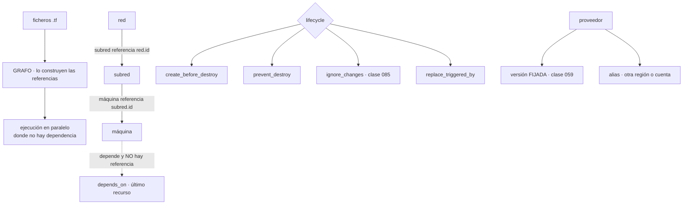

# 086 — Terraform: HCL, providers, resources y grafo

> [← 085 · Declarativo, imperativo, idempotencia y convergencia](../../part-07-infrastructure-as-code-configuration/085-declarativo-imperativo-idempotencia-y-convergencia/README.md) · [Índice de la parte](../README.md) · [087 · Estado remoto, locking, cifrado y recuperación →](../../part-07-infrastructure-as-code-configuration/087-estado-remoto-locking-cifrado-y-recuperacion/README.md)

**Parte:** 07 — Infraestructura como código y configuración<br>
**Nivel:** intermedio-avanzado · **Horas estimadas:** 4<br>
**Laboratorio:** `iac` · **Estado:** `EXECUTABLE_CORE`

## 🎯 Propósito

Escribir Terraform entendiendo la pieza que decide su comportamiento y que casi nadie mira: **el grafo**. El orden de ejecución no lo da el fichero ni el orden de las declaraciones, lo dan las referencias entre recursos — y de ahí salen los tres problemas característicos: dependencias que existen y no se pueden expresar con una referencia, ciclos que aparecen al refactorizar, y recursos que no se pueden sustituir en el sitio. La clase 085 dejó además una deuda concreta —qué hacer con los campos que gestiona otro sistema— y aquí está el mecanismo.

## 📚 Resultados de aprendizaje

Al finalizar podrás:

1. **Leer** un conjunto de ficheros como un grafo y predecir en qué orden se aplicará.
2. **Distinguir** una dependencia expresable por referencia de una que exige declararla.
3. **Elegir** el comportamiento de sustitución adecuado para un recurso que no se puede reemplazar en el sitio.
4. **Ignorar** los campos que gestiona otro sistema, cerrando la deuda de la clase 085.
5. **Configurar** proveedores con versiones fijadas y con alias para varias regiones o cuentas.

## 🧩 Conceptos centrales

| Concepto | Comprensión verificable |
|---|---|
| `grafo de dependencias` | Estructura que Terraform construye a partir de las **referencias** entre recursos. Decide el orden y el paralelismo; el orden de los ficheros es irrelevante. |
| `dependencia implícita` | La que nace de referenciar un atributo de otro recurso. Es la forma correcta: se declara sola y no hay que mantenerla. |
| `dependencia explícita` | La que se declara a mano porque no hay ninguna referencia que la exprese. Es un último recurso y casi siempre señala un efecto colateral. |
| `crear antes de destruir` | Comportamiento que crea el sustituto antes de retirar el original. Imprescindible cuando el recurso no se puede reemplazar en el sitio y algo depende de él. |
| `ignorar cambios` | Declaración de que un campo lo gestiona otro sistema. Es la respuesta al origen 3 de la desviación de la clase 085. |
| `alias de proveedor` | Segunda configuración del mismo proveedor, para otra región o cuenta. Se pasa explícitamente a los recursos que la usan. |

## 🧠 Modelo mental

IaC trata la infraestructura como producto versionado: el plan explica intención, el estado conecta intención y realidad, y la revisión reduce cambios accidentales.

Aplicado a esta clase, separa siempre cuatro planos: **intención** (qué necesita el usuario),
**configuración** (qué declaramos), **estado observado** (qué existe de verdad) y
**evidencia** (cómo sabemos que cumple). Confundirlos produce diseños que se ven correctos
en un diagrama pero fallan al operar.

## 🗺️ Flujo de razonamiento



## 📖 Desarrollo

### 1. El orden lo da el grafo, no el fichero

Terraform lee todos los ficheros de un directorio como si fueran uno, ignora el orden en que aparecen las declaraciones y construye un grafo a partir de las **referencias**:

```hcl
resource "aws_subnet" "app" {
  vpc_id     = aws_vpc.principal.id      # ← esto crea la dependencia
  cidr_block = "10.20.4.0/24"
}

resource "aws_vpc" "principal" {        # declarado DESPUÉS, se crea ANTES
  cidr_block = "10.20.0.0/16"
}
```

De ahí salen tres consecuencias que conviene interiorizar:

**El paralelismo es automático.** Lo que no depende de nada se crea a la vez. Por defecto se ejecutan hasta diez operaciones simultáneas, y eso puede chocar con los límites de tasa del proveedor:

```text
Error: Throttling: Rate exceeded
```

La corrección no es reintentar más: es bajar el paralelismo en las ejecuciones que crean muchos recursos del mismo tipo.

```bash
$ terraform apply -parallelism=4 tfplan
```

**Organizar en ficheros es solo para las personas.** Separar en `red.tf`, `datos.tf` y `computo.tf` no cambia nada del comportamiento; es legibilidad. Y por eso una convención sencilla vale más que una elaborada:

```text
main.tf        los recursos
variables.tf   las entradas
outputs.tf     las salidas
versions.tf    proveedores y sus versiones
```

**Ver el grafo ayuda cuando algo no cuadra:**

```bash
$ terraform graph -type=plan | dot -Tsvg > grafo.svg
```

Y hay un caso en que hace falta mirarlo: los **ciclos**. Aparecen al refactorizar, cuando dos recursos acaban referenciándose mutuamente:

```text
Error: Cycle: aws_security_group.app, aws_security_group.bd
```

Ocurre con reglas de cortafuegos que se referencian entre sí, y la solución es sacar las reglas a recursos independientes:

```hcl
# en vez de reglas dentro de cada grupo, que se referencian mutuamente
resource "aws_vpc_security_group_ingress_rule" "bd_desde_app" {
  security_group_id            = aws_security_group.bd.id
  referenced_security_group_id = aws_security_group.app.id
  from_port                    = 5432
  to_port                      = 5432
  ip_protocol                  = "tcp"
}
```

Es el mismo patrón que la clase 047 exigía para los recursos hijo: **una sola forma de declararlos, y separada del padre cuando la relación es cruzada**.

### 2. Cuando la dependencia existe y no se puede referenciar

La dependencia implícita es la buena: nace sola de una referencia y no hay que mantenerla. La explícita es un último recurso, y conviene saber cuándo hace falta de verdad.

El caso canónico es el **efecto colateral**: el recurso A necesita que B exista, pero no usa ningún atributo suyo.

```hcl
resource "aws_iam_role_policy_attachment" "lectura" {
  role       = aws_iam_role.app.name
  policy_arn = aws_iam_policy.lectura.arn
}

resource "aws_lambda_function" "procesar" {
  role = aws_iam_role.app.arn        # depende del ROL, no del permiso
  # …
  depends_on = [aws_iam_role_policy_attachment.lectura]
}
```

Sin esa declaración, la función se crea antes de que el permiso esté asociado. Y el síntoma es característico y desespera: **funciona unas veces y otras no**, porque depende de qué operación termine antes.

Y hay una segunda causa que produce el mismo síntoma y no se arregla con dependencias: **la propagación**. Un permiso creado hace un segundo puede no estar visible todavía para el servicio que lo usa. Ahí no hay orden que valga, y las salidas son otras:

```text
reintento en el propio proveedor      muchos lo hacen; conviene comprobar si lo hace
una espera declarada                  fea y a veces la única
dos ejecuciones                       la segunda funciona: es la señal de
                                      que el problema es de propagación
```

La última línea es un diagnóstico útil: si volver a aplicar sin cambiar nada arregla el error, el problema es de propagación y no de grafo.

Y el mal uso más común de las dependencias explícitas es ponerlas «por si acaso»:

```hcl
depends_on = [aws_vpc.principal, aws_subnet.app, aws_security_group.bd]
```

Eso añade aristas que el grafo ya tenía, **reduce el paralelismo** y oculta las dependencias reales. La regla es escribirla solo cuando se puede explicar por qué no hay referencia posible, y dejar un comentario que lo diga.

Y un caso especial que conviene conocer porque produce ejecuciones lentísimas: usar una dependencia explícita **sobre un módulo entero**. Eso hace que todo lo del módulo espere a todo lo del otro, y en módulos grandes convierte una aplicación paralela en una secuencial:

```hcl
module "aplicacion" {
  source     = "./modulos/aplicacion"
  depends_on = [module.red]        # ← todo espera a todo
}
```

La alternativa es pasar los valores concretos que la aplicación necesita de la red, con lo que la dependencia se vuelve implícita y solo afecta a los recursos que de verdad la tienen.

### 3. Los cuatro comportamientos de ciclo de vida

El bloque de ciclo de vida cambia cómo se sustituye o se protege un recurso, y sus cuatro opciones responden a problemas distintos.

**Crear antes de destruir.** Por defecto, un recurso que hay que sustituir se destruye y luego se crea. Para lo que sirve tráfico o lo que otros referencian, eso es un corte:

```hcl
resource "aws_launch_template" "app" {
  # …
  lifecycle {
    create_before_destroy = true
  }
}
```

Y tiene una condición que produce errores al activarlo: **durante la sustitución existen los dos a la vez**, así que cualquier restricción de unicidad falla. Nombres, direcciones fijas, puertos reservados:

```text
Error: name already exists
```

La corrección es que el nombre lo genere el proveedor o que lleve un sufijo derivado del contenido:

```hcl
name_prefix = "app-"          # en vez de name = "app"
```

**Impedir la destrucción.** Hace fallar la planificación si algo propondría borrar ese recurso:

```hcl
lifecycle {
  prevent_destroy = true
}
```

Es la protección de la clase 059 y tiene una particularidad: **el error aparece en el plan, antes de ejecutar nada**, lo que la hace mejor que una protección del proveedor para detectar el problema pronto. Las dos son complementarias, y la clase 059 ya pedía ambas.

**Ignorar cambios.** Es la respuesta a la deuda que dejó la clase 085 — el origen 3 de la desviación, otro sistema gestionando el mismo campo:

```hcl
resource "aws_autoscaling_group" "app" {
  desired_capacity = 3
  # …
  lifecycle {
    ignore_changes = [desired_capacity]     # lo gestiona el escalado automático
  }
}
```

Con eso, el valor inicial lo pone la plantilla y las modificaciones posteriores del otro sistema no producen ruido. Es exactamente la frontera de propiedad que la clase 085 pedía declarar, y conviene acompañarla de un comentario que diga **quién** es el dueño, porque dentro de un año nadie se acordará.

Y su versión total, para recursos cuyo contenido gestiona otro por completo:

```hcl
ignore_changes = all
```

Que hay que usar con cuidado: a partir de ahí, la plantilla solo controla la existencia del recurso, no su configuración.

**Sustituir cuando cambie otra cosa.** Fuerza la recreación al cambiar un recurso del que no se depende por atributo:

```hcl
resource "aws_instance" "app" {
  # …
  lifecycle {
    replace_triggered_by = [terraform_data.version_config]
  }
}
```

Es el equivalente de la anotación con huella de la clase 076: **un cambio en algo externo debe producir un reemplazo**, y sin esto no lo produce.

Y una advertencia sobre los **aprovisionadores** —ejecutar órdenes tras crear un recurso—: son código imperativo dentro de un sistema declarativo, no son idempotentes, no se reintentan bien y si fallan dejan el recurso marcado como contaminado. La documentación oficial los describe como último recurso y conviene tomárselo literalmente:

```text
en vez de un aprovisionador que instala software
  → una imagen construida antes (clases 062, 094)
en vez de un aprovisionador que registra algo
  → un recurso del proveedor que lo haga, o datos de arranque
en vez de un aprovisionador que espera
  → comprobar por qué hace falta esperar
```

### 4. Proveedores: versiones, alias y lo que aportan

Un proveedor es un complemento que traduce las declaraciones a llamadas de una API. Y su configuración tiene dos partes que conviene no mezclar:

```hcl
terraform {
  required_version = "~> 1.9"
  required_providers {
    aws = {
      source  = "hashicorp/aws"
      version = "~> 5.70"          # QUÉ versión
    }
  }
}

provider "aws" {
  region = var.region                # CÓMO se configura
}
```

La primera va siempre en el módulo raíz y **se fija**, por lo mismo que la clase 059 exigía: dos ejecuciones del mismo código en semanas distintas deben usar el mismo proveedor. Y el fichero de bloqueo se versiona en el repositorio:

```bash
$ terraform providers lock -platform=linux_amd64 -platform=darwin_arm64
```

Esa orden merece conocerse porque evita un fallo típico: el fichero de bloqueo generado en un portátil no incluye las huellas para la plataforma del agente de la canalización, y la ejecución falla ahí.

Los **alias** permiten varias configuraciones del mismo proveedor:

```hcl
provider "aws" {
  region = "eu-west-1"
}

provider "aws" {
  alias  = "us"
  region = "us-east-1"
}

resource "aws_s3_bucket" "replica" {
  provider = aws.us
  bucket   = "cls-replica"
}
```

Y su uso más frecuente no es multirregión sino **multicuenta**: un proveedor por cuenta, cada uno asumiendo un rol distinto, que es el patrón de la clase 025 aplicado aquí. Con la advertencia de la clase 059: la identidad se obtiene por federación, sin claves.

Y los **módulos** reciben proveedores explícitamente cuando usan alias:

```hcl
module "replica" {
  source    = "./modulos/bucket"
  providers = { aws = aws.us }
}
```

Una nota sobre lo que conviene **no** hacer: configurar proveedores dentro de un módulo reutilizable. Impide usar alias desde fuera y complica su composición; la clase 088 lo desarrolla.

Y las **fuentes de datos**, que son la otra mitad del modelo:

```hcl
data "aws_vpc" "principal" {
  tags = { Name = "vpc-cloudshop" }
}
```

Leen algo que existe y que gestiona otro. Su ventaja sobre pasar identificadores como variables es que **no se rompen cuando algo cambia de nombre**, y su riesgo es que una consulta que no encuentra nada —o que encuentra varias cosas— falla la planificación entera:

```text
Error: multiple VPCs matched; use additional constraints
```

Por eso conviene que los filtros sean exactos, y para lo que de verdad es un contrato entre equipos, la clase 088 propone una alternativa mejor que buscar por etiquetas.

### 5. Leer una plantilla como se lee código

Con el grafo y el ciclo de vida claros, hay una lista corta que detecta la mayoría de los problemas al revisar un cambio:

```text
☐ ¿las dependencias son implícitas? toda declaración explícita, justificada
☐ ¿hay recursos con nombre fijo que también tienen crear antes de destruir?
☐ ¿los campos que gestiona otro sistema están declarados como ignorados,
   con un comentario que diga quién es el dueño?
☐ ¿los recursos que no se pueden perder tienen protección contra destrucción?
☐ ¿las versiones de proveedor están fijadas y el fichero de bloqueo versionado?
☐ ¿hay aprovisionadores? cada uno, justificado
☐ ¿las fuentes de datos filtran de forma que solo puedan devolver una cosa?
```

Y dos comprobaciones automáticas que valen más que la lista:

```bash
# 1. el plan de una ejecución sin cambios debe estar vacío (clase 085)
$ terraform plan -detailed-exitcode
# 0 = sin cambios · 2 = hay cambios · 1 = error

# 2. ningún recurso se destruye sin que alguien lo haya leído
$ terraform show -json tfplan | jq -r '.resource_changes[]
  | select(.change.actions | index("delete")) | .address'
```

La primera es la comprobación de idempotencia de la clase 085 en su forma ejecutable, y debería estar en la canalización: **si aplicar dos veces seguidas produce cambios, algo está mal declarado**.

Y una lectura del plan que ahorra sustos: los cuatro símbolos y lo que implican.

```text
+  crear                 sin riesgo salvo por el coste
~  modificar en el sitio  sin corte, normalmente
-/+ destruir y crear      HAY CORTE, salvo con crear antes de destruir
+/- crear y destruir      con crear antes de destruir activado
-  destruir              lo que hay que leer siempre
```

La tercera línea es la que hay que buscar primero en cualquier plan, porque es donde están las sorpresas: un cambio de un campo que obliga a recrear. Y el plan dice **cuál**:

```text
~ resource "aws_db_instance" "pedidos" {
    ~ availability_zone = "eu-west-1a" -> "eu-west-1b" # forces replacement
```

Ese comentario al final de la línea es la información más importante de un plan, y es la que la revisión tiene que buscar. Un recurso con datos marcado para recreación es un incidente que todavía no ha ocurrido, y la protección contra destrucción de la clase 059 lo convierte en un error de planificación en vez de en una pérdida.

## 🔬 Ejemplo trabajado

**CloudShop reescribe sus plantillas después del inventario de la clase 085. Los cuatro problemas del primer mes son todos del grafo o del ciclo de vida, y ninguno se resuelve leyendo la documentación del recurso.**

**Problema 1 — el despliegue funcionaba tres de cada cinco veces.**

```text
Error: AccessDenied: User is not authorized to perform: s3:GetObject
```

El error aparecía al crear la función y desaparecía al volver a aplicar sin cambiar nada, lo que es el diagnóstico de propagación de esta clase. Pero había además un problema de grafo:

```bash
$ terraform graph -type=plan | grep -c 'aws_iam_role_policy_attachment.*aws_lambda_function'
0        ← no hay ninguna arista entre el permiso y la función
```

La función referenciaba el rol, no el permiso, así que el grafo permitía crearlos en paralelo.

```text                                        antes            después
dependencia permiso → función             inexistente     declarada explícitamente
ejecuciones que fallaban                    2 de 5              0
comentario que la justifica                 no había      "no hay atributo del
                                                          permiso que la función use"
```

**Problema 2 — un ciclo al separar las reglas de cortafuegos.**

```text
Error: Cycle: aws_security_group.app, aws_security_group.bd
```

Cada grupo declaraba dentro sus reglas, y una de ellas referenciaba al otro grupo. Es el mismo patrón que la clase 047 encontró con las reglas en línea frente a los recursos hijo, ahora con otra herramienta.

```text                                        antes            después
reglas                            dentro de cada grupo   recursos independientes
ciclos en el grafo                        1                  0
convención documentada                   no                 sí, una sola forma
```

**Problema 3 — la sustitución de una plantilla de arranque cortaba el servicio.**

```text
-/+ resource "aws_launch_template" "app"  # forces replacement
```

Al activar crear antes de destruir, el error cambió:

```text
Error: InvalidLaunchTemplateName.AlreadyExistsException
```

Los dos existían a la vez durante la sustitución, y el nombre era fijo.

```text                                        antes            después
nombre                                  fijo ("app")     prefijo generado
crear antes de destruir                   no                 sí
corte durante la sustitución             40 s                 0
```

**Problema 4 — la capacidad deseada volvía a tres cada noche.**

El escalado automático subía las instancias durante el día y la aplicación nocturna de la plantilla las devolvía a tres.

```bash
$ terraform plan | grep desired_capacity
  ~ desired_capacity = 9 -> 3
```

Es el origen 3 de la desviación de la clase 085 —otro sistema gestiona ese campo— y es el mismo incidente que la clase 081 encontró con los manifiestos y el escalado del clúster. Tercera aparición del mismo conflicto de propiedad.

```text                                        antes            después
campo desired_capacity                  declarado         ignorado, con comentario
                                                          que nombra al dueño
capacidad al día siguiente de aplicar        3            la que decidió el escalado
cambios propuestos en ejecución limpia       1                  0
```

**Y la comprobación que se añadió a la canalización.**

```bash
$ terraform apply tfplan
$ terraform plan -detailed-exitcode
$ [ $? -eq 0 ] || { echo "la plantilla no es idempotente"; exit 1; }
```

Esa comprobación, ejecutada por primera vez sobre las cuatro carpetas del repositorio, encontró tres plantillas más con campos no declarados:

```text
carpeta      cambios en la segunda ejecución   causa
red                   0                        —
datos                 2                        etiquetas que el proveedor añade
computo               1                        campo calculado no declarado
plataforma            4                        recurso gestionado por un operador
```

Las siete diferencias eran ruido y no desviación, exactamente en la proporción que la clase 085 había medido.

**Resumen:**

```text                                          antes         después
ejecuciones que fallaban de forma intermitente   2 de 5          0
ciclos en el grafo                                 1             0
corte al sustituir una plantilla de arranque     40 s            0
cambios propuestos en ejecución limpia            7              0
dependencias explícitas                           9        2, ambas justificadas
recursos con protección contra destrucción        0             6
```

**La lección que esta clase traslada al resto de la parte 07**: los cuatro problemas se ven en el grafo o en el plan, y ninguno en la documentación del recurso. La comprobación que los resume es la de la clase 085 en forma ejecutable —**aplicar dos veces seguidas y exigir cero cambios**— y encontró siete diferencias en cuatro carpetas la primera vez que se ejecutó. Es una línea en la canalización y es el único indicador que dice si una plantilla describe la realidad o solo se le parece.

## 🧪 Laboratorio guiado

Ejecuta desde la raíz:

```bash
python classes/part-07-infrastructure-as-code-configuration/086-terraform-hcl-providers-resources-y-grafo/lab.py
```

El laboratorio selecciona el motor de práctica **`iac`** y produce
`lab_result.json`. El escenario, sus comprobaciones y el artefacto esperado corresponden a
esta clase; no requiere credenciales y deja explícito qué debe revalidarse en un sandbox real.

1. Lee `exercise.steps` y formula una predicción antes de ejecutar.
2. Ejecuta la práctica y verifica todos los elementos de `checks`.
3. Provoca el caso de `negative_test` y explica la señal observada.
4. Materializa `stack-terraform` en `evidence/` usando la plantilla indicada.
5. Para proveedor real, sigue `sandbox.requires`, registra costo y ejecuta `destroy`.

### Evidencia esperada

El artefacto principal es un plan reproducible sin secretos ni cambios inesperados. Además, la entrega debe incluir el comando ejecutado,
la salida estructurada y una conclusión que no exceda lo observado.

## 🏆 Reto verificable

Construye **`stack-terraform`** para el caso CloudShop. Incluye una alternativa descartada,
un supuesto que pueda falsarse, una prueba de fallo y una decisión de rollback.

## ✅ Criterio de aceptación

- [ ] `lab.py` termina con código 0 y genera JSON válido.
- [ ] La entrega conecta al menos tres requisitos con mecanismos verificables.
- [ ] Existe una prueba positiva y una prueba negativa con evidencia.
- [ ] Seguridad, costo y operación aparecen como decisiones, no como anexos.
- [ ] Se declara una limitación y una condición que obligaría a revisar el diseño.
- [ ] Otra persona puede repetir el recorrido sin conocimiento tácito.

## ⚠️ Errores frecuentes

| Síntoma | Causa probable | Corrección |
|---|---|---|
| Una aplicación funciona unas veces y otras no, con errores de permisos | El grafo permite crear en paralelo dos recursos con dependencia real que ninguna referencia expresa | Declara la dependencia explícitamente con un comentario que explique por qué no hay referencia posible. |
| Volver a aplicar sin cambiar nada arregla el error | Es propagación del proveedor, no un problema de orden | Comprueba si el proveedor reintenta; si no, una espera declarada acotada, y documenta el motivo. |
| Aparece un ciclo al refactorizar reglas de red | Dos recursos se referencian mutuamente porque las reglas están dentro de cada uno | Saca las reglas a recursos independientes; una sola forma de declararlas, como en la clase 047. |
| Activar crear antes de destruir produce un error de nombre duplicado | Durante la sustitución existen los dos y el nombre es fijo | Usa prefijo generado o deja que el proveedor asigne el nombre. |
| Un campo vuelve a su valor de la plantilla en cada aplicación | Otro sistema gestiona ese campo: es el origen 3 de la desviación | Decláralo como ignorado y añade un comentario que nombre al dueño. |
| Un plan propone recrear un recurso con datos | Un campo que obliga a reemplazo ha cambiado | Busca el comentario que lo señala en el plan y protege esos recursos contra la destrucción para que el error salte al planificar. |

## 🛡️ Seguridad, ética y costo

Trabaja con cuentas propias o sandboxes autorizados. No publiques secretos, identificadores
reales ni datos personales. Antes de crear recursos pagos define presupuesto, etiquetas y
comando de destrucción; después verifica que no queden recursos huérfanos. Los ejemplos
locales enseñan contratos, pero no certifican cumplimiento ni disponibilidad de producción.

## ❓ Preguntas de comprobación

1. ¿Qué determina el orden de creación, y por qué el orden de los ficheros es irrelevante?
2. ¿Cuándo hace falta una dependencia explícita, y cómo se distingue de un problema de propagación?
3. ¿Qué condición hay que cumplir para activar crear antes de destruir sin que falle?
4. ¿Cómo se cierra la deuda que la clase 085 dejó sobre los campos que gestiona otro sistema?
5. ¿Qué comprobación de una línea dice si una plantilla describe la realidad o solo se le parece?

## 🔗 Referencias

- HashiCorp (2025). *Resource behavior and the dependency graph* — dependencias implícitas y explícitas. <https://developer.hashicorp.com/terraform/language/resources/behavior>
- HashiCorp (2025). *The lifecycle meta-argument* — crear antes de destruir, ignorar cambios y protecciones. <https://developer.hashicorp.com/terraform/language/meta-arguments/lifecycle>
- HashiCorp (2025). *Provider configuration and aliases* — varias configuraciones del mismo proveedor. <https://developer.hashicorp.com/terraform/language/providers/configuration>
- HashiCorp (2025). *Provider requirements and dependency lock file* — fijar versiones y plataformas. <https://developer.hashicorp.com/terraform/language/files/dependency-lock>
- HashiCorp (2025). *Provisioners are a last resort* — por qué evitarlos y qué usar en su lugar. <https://developer.hashicorp.com/terraform/language/resources/provisioners/syntax>
- Documentación oficial vigente del servicio implementado; registra URL y fecha de consulta.

---

> [Evaluación](assessment.md) · [Contrato de clase](lesson.yaml) · [Índice de la parte](../README.md)

**📥 Descargar:** [Parte 07 en PDF](../../../site/downloads/partes/manual-parte-07-infrastructure-as-code-configuration.pdf) · [Manual integral](../../../site/downloads/multi-cloud-engineering-manual-v2.0.pdf)

| Anterior | Índice | Siguiente |
|---|---|---|
| [← 085 · Declarativo, imperativo, idempotencia y convergencia](../../part-07-infrastructure-as-code-configuration/085-declarativo-imperativo-idempotencia-y-convergencia/README.md) | [Parte 07](../README.md) · [Programa](../../README.md) | [087 · Estado remoto, locking, cifrado y recuperación →](../../part-07-infrastructure-as-code-configuration/087-estado-remoto-locking-cifrado-y-recuperacion/README.md) |
