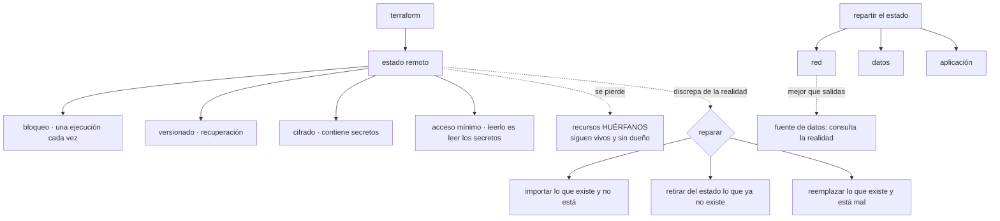

# 087 — Estado remoto, locking, cifrado y recuperación

> [← 086 · Terraform: HCL, providers, resources y grafo](../../part-07-infrastructure-as-code-configuration/086-terraform-hcl-providers-resources-y-grafo/README.md) · [Índice de la parte](../README.md) · [088 · Módulos, contratos, versiones y composición →](../../part-07-infrastructure-as-code-configuration/088-modulos-contratos-versiones-y-composicion/README.md)

**Parte:** 07 — Infraestructura como código y configuración<br>
**Nivel:** intermedio-avanzado · **Horas estimadas:** 4<br>
**Laboratorio:** `iac` · **Estado:** `EXECUTABLE_CORE`

## 🎯 Propósito

Operar el archivo de estado, que la clase 059 presentó como la diferencia estructural de Terraform y que aquí se trata como lo que es: **el activo más sensible y más frágil del sistema**. Contiene los secretos en claro, su pérdida convierte infraestructura viva en recursos huérfanos, y dos ejecuciones simultáneas lo corrompen. La clase cubre cómo se guarda, cómo se bloquea, cómo se recupera cuando algo va mal y —lo que casi nunca se ensaya— cómo se sale de un estado que ya no corresponde con la realidad.

## 📚 Resultados de aprendizaje

Al finalizar podrás:

1. **Configurar** un almacén remoto con bloqueo, versionado y cifrado, y justificar cada pieza.
2. **Diagnosticar** un bloqueo atascado y liberarlo sin corromper nada.
3. **Recuperar** un estado perdido o corrupto a partir de sus versiones.
4. **Reparar** una discrepancia entre el estado y la realidad sin destruir recursos.
5. **Repartir** el estado por radio de impacto y conectar las piezas sin acoplarlas.

## 🧩 Conceptos centrales

| Concepto | Comprensión verificable |
|---|---|
| `archivo de estado` | Correspondencia entre lo declarado y los recursos reales, con todos sus atributos. **Guarda valores sensibles en claro** y su pérdida no destruye nada, pero deja todo huérfano. |
| `bloqueo` | Exclusión mutua durante una operación. Sin él, dos ejecuciones simultáneas escriben encima y el estado deja de corresponder con la realidad. |
| `bloqueo atascado` | Bloqueo que quedó tomado porque el proceso murió. Se libera con una orden, y liberarlo mientras otra ejecución sigue viva es la forma de corromper el estado. |
| `recurso huérfano` | Recurso real que ya no aparece en ningún estado. Nadie lo gestiona, sigue costando y una plantilla que intente recrearlo chocará con él. |
| `estado por unidad de despliegue` | Un estado por conjunto de recursos con el mismo radio de impacto. Reduce el bloqueo entre equipos y el tiempo de planificación. |
| `acoplamiento por estado` | Leer las salidas del estado de otro equipo. Funciona y crea una dependencia dura; una fuente de datos consulta la realidad y no se rompe al recrear. |

## 🧠 Modelo mental

IaC trata la infraestructura como producto versionado: el plan explica intención, el estado conecta intención y realidad, y la revisión reduce cambios accidentales.

Aplicado a esta clase, separa siempre cuatro planos: **intención** (qué necesita el usuario),
**configuración** (qué declaramos), **estado observado** (qué existe de verdad) y
**evidencia** (cómo sabemos que cumple). Confundirlos produce diseños que se ven correctos
en un diagrama pero fallan al operar.

## 🗺️ Flujo de razonamiento



## 📖 Desarrollo

### 1. Dónde vive el estado y qué hay que ponerle

El estado local sirve para probar y no sirve para nada más: no se comparte, no se bloquea, no se recupera y acaba en el repositorio con los secretos dentro. El remoto es la única opción operable, y necesita cuatro cosas:

```hcl
terraform {
  backend "s3" {
    bucket       = "cls-tfstate-prod"
    key          = "red/terraform.tfstate"
    region       = "eu-west-1"
    encrypt      = true
    use_lockfile = true
  }
}
```

```text
1. BLOQUEO      dos ejecuciones a la vez corrompen el estado
2. VERSIONADO   un estado corrupto o borrado se recupera de una versión anterior
3. CIFRADO      contiene secretos en claro (clase 059)
4. ACCESO MÍNIMO  quien lee el estado lee los secretos
```

Y el punto 4 merece insistencia porque es el que se configura peor. El bucket del estado hereda con frecuencia los permisos del proyecto donde vive, y ahí es donde la clase 059 encontró catorce personas con acceso a siete contraseñas de producción.

```text
el estado va en un proyecto o cuenta propios
lectura solo para las identidades que planifican
escritura solo para las que aplican (clase 059)
sin acceso público, con versionado, y con clave del cliente si el requisito existe
```

Y una consecuencia que sorprende y hay que aceptar: **no existe una forma de que el estado no contenga los valores sensibles**. Marcar una variable como sensible oculta el valor en la salida por pantalla y **no lo cifra en el estado**. La única protección real es el control de acceso al almacén.

```bash
$ terraform state pull | jq -r '.resources[].instances[].attributes
  | to_entries[] | select(.key | test("password|secret|private_key"))
  | .key' | sort -u
```

Esa orden lista los campos sensibles que hay ahí dentro, y conviene ejecutarla una vez para dimensionar el problema antes de decidir permisos.

Y sobre el **bloqueo**, un detalle operativo que aparece pronto:

```text
Error: Error acquiring the state lock
  Lock Info:
    ID:        7f4c9b2d-…
    Operation: OperationTypeApply
    Who:       agente@ci-runner-14
    Created:   2026-08-03 09:41:22
```

La información dice quién lo tiene y desde cuándo. Y hay dos situaciones distintas:

```text
otra ejecución está en marcha        esperar; es lo que debe pasar
el proceso murió y el bloqueo quedó   liberarlo, con cuidado
```

```bash
$ terraform force-unlock 7f4c9b2d-…
```

Liberar un bloqueo cuya ejecución sigue viva es la forma más directa de corromper el estado, porque las dos escribirán. La comprobación previa es mirar la marca de tiempo y confirmar que el agente que lo tomó ya no existe. En una canalización, un tiempo de espera de bloqueo evita la mayoría de los casos:

```bash
$ terraform apply -lock-timeout=10m tfplan
```

### 2. Repartir el estado, y conectar sin acoplar

Un solo estado para toda la plataforma tiene cuatro problemas concretos:

```text
cualquier cambio bloquea a todos los equipos
cada planificación consulta cientos de recursos: lenta
el radio de impacto de un `destroy` es todo
y un estado corrupto se lleva la gestión de todo a la vez
```

La unidad correcta es la misma que en las clases 047 y 059: **el radio de impacto**.

```text
cls-tfstate-prod/
  red/           subredes, cortafuegos, salida
  datos/         bases de datos, buckets, claves
  plataforma/    clúster y sus complementos
  tienda/        la aplicación
```

Y la pregunta que decide dónde va cada recurso es: **¿qué querría poder destruir junto?** Lo que se destruye junto va junto.

Para conectarlos hay dos mecanismos y no son equivalentes:

```hcl
# A · leer el estado de otro: acoplamiento duro
data "terraform_remote_state" "red" {
  backend = "s3"
  config  = { bucket = "cls-tfstate-prod", key = "red/terraform.tfstate" }
}
resource "aws_instance" "app" {
  subnet_id = data.terraform_remote_state.red.outputs.subnet_app_id
}

# B · consultar la realidad: acoplamiento blando
data "aws_subnet" "app" {
  filter { name = "tag:Name"  values = ["snet-tienda-euw1"] }
}
```

La opción A exige permiso de lectura sobre el estado ajeno — **y con él, sobre sus secretos**. Ese solo hecho ya la descarta entre equipos distintos.

Y la opción B tiene la ventaja que la clase 086 señaló: no se rompe si el otro estado se recrea. Su riesgo es que el filtro devuelva algo inesperado, y por eso el contrato entre equipos conviene que sea **un nombre estable acordado**, no una etiqueta que alguien pueda cambiar:

```text
mal    filtrar por una etiqueta descriptiva que puede editarse
bien   un nombre acordado y documentado, tratado como interfaz
mejor  un parámetro publicado en un almacén de configuración,
       que el otro equipo escribe y este lee
```

La tercera es la que escala en organizaciones grandes: el equipo de red publica los identificadores en un almacén de parámetros y quien los consume los lee de ahí. El acoplamiento sigue existiendo y **es un contrato explícito con un dueño**, en vez de una consulta que adivina.

Y los **espacios de trabajo** merecen la advertencia que la clase 059 anticipó: sirven para varias instancias efímeras del mismo código —una por rama, una por prueba— y **no sirven para separar entornos**. Comparten configuración de almacén, invitan a condicionales por entorno y hacen fácil aplicar en producción creyendo estar en pruebas. Un directorio por entorno, con su propio estado y su propia configuración, es más ficheros y menos incidentes.

### 3. Cuando el estado y la realidad discrepan

Antes o después ocurre: el estado dice una cosa y la realidad otra. Hay tres situaciones y tres operaciones, y usar la equivocada destruye recursos.

**Existe de verdad y no está en el estado.** Un recurso creado a mano, o uno que quedó huérfano al perder un estado.

```hcl
import {
  to = aws_s3_bucket.facturas
  id = "cls-facturas"
}
```

```bash
$ terraform plan -generate-config-out=generado.tf
```

La forma declarativa es mejor que la orden equivalente por dos motivos: queda en el repositorio, revisable, y permite **generar la configuración** a partir del recurso real, que ahorra escribir a mano decenas de campos. Y el flujo correcto es:

```text
1. declarar la importación
2. generar la configuración y revisarla
3. planificar: debe salir SIN CAMBIOS
4. si propone cambios, la configuración no coincide: corregirla
5. aplicar, y retirar el bloque de importación
```

El paso 3 es el importante. Una importación que deja el plan proponiendo modificaciones significa que la configuración escrita **no describe el recurso que existe**, y aplicar así lo modificaría.

**Está en el estado y ya no existe.** Alguien lo borró por fuera:

```bash
$ terraform state rm aws_instance.vieja
```

Eso **no destruye nada**: solo deja de gestionarlo. Y es exactamente lo que hay que hacer cuando se quiere entregar un recurso a otro equipo o a otro estado.

**Existe, está en el estado y está mal.** Se cambió a mano y la reconciliación no basta:

```bash
$ terraform apply -replace=aws_instance.app
```

Marca ese recurso para destruir y recrear en el próximo plan, con lo que la decisión se revisa antes de ejecutarse.

Y la operación que más cuesta y más se necesita: **mover recursos** al refactorizar. La clase 059 avisó de que renombrar un recurso lo destruye y lo recrea, porque su dirección es su identidad. El mecanismo declarativo lo evita:

```hcl
moved {
  from = aws_instance.web
  to   = module.tienda.aws_instance.web
}
```

Con eso, la operación es **solo un cambio de nombre en el estado**: el plan no propone crear ni destruir nada. Sirve para renombrar, para mover a un módulo, para pasar de índice numérico a clave estable —el arreglo de la reindexación de la clase 059— y queda en el repositorio como registro de por qué se movió.

```bash
$ terraform plan
Plan: 0 to add, 0 to change, 0 to destroy.
# y en la salida:
#  aws_instance.web has moved to module.tienda.aws_instance.web
```

Esa línea con cero de todo es la comprobación de que el refactor es seguro. Si aparece cualquier otra cosa, la declaración de movimiento no está completa.

### 4. Perder el estado, y salir de ello

Conviene tratar esto como un simulacro y no como una hipótesis, porque ocurre.

**Qué pasa exactamente al perderlo:**

```text
la infraestructura sigue funcionando: no se destruye nada
Terraform deja de saber que existe
un `apply` intentará CREARLO ENTERO otra vez
  → y fallará en lo que tenga nombres únicos
  → o duplicará lo que no los tenga
```

La segunda consecuencia es la peligrosa: una plantilla aplicada sobre un estado vacío con recursos que ya existen puede crear duplicados en silencio.

**La recuperación, por orden de preferencia:**

```text
1. una versión anterior del almacén
   → es la razón del versionado; recuperación en minutos
2. la copia local que Terraform deja tras una operación
   → `terraform.tfstate.backup`, en la máquina que la ejecutó
3. reconstruirlo importando recurso a recurso
   → días de trabajo, y hay que conocer cada identificador
```

El salto entre la 1 y la 3 es enorme, y es todo el valor del versionado. Y como cualquier copia de seguridad de este programa, **hay que probar la restauración**:

```bash
$ aws s3api list-object-versions --bucket cls-tfstate-prod \
    --prefix red/terraform.tfstate --query 'Versions[0:3].[VersionId,LastModified]'
$ aws s3api get-object --bucket cls-tfstate-prod --key red/terraform.tfstate \
    --version-id <id> estado-recuperado.json
$ terraform state push estado-recuperado.json      # con MUCHO cuidado
$ terraform plan -detailed-exitcode                # debe dar 0
```

El último paso es la verificación: un plan sin cambios significa que el estado recuperado corresponde con la realidad. Con cambios, la versión elegida es demasiado antigua y hay que probar otra.

Y dos precauciones que evitan llegar aquí:

```text
protección contra el borrado del bucket del estado (clases 042, 059)
y una copia periódica del estado a otro sitio, con su restauración probada
```

La segunda parece redundante con el versionado y no lo es: el versionado protege del borrado de un objeto, no del borrado del bucket ni de la pérdida de acceso a la cuenta.

Y una situación que se confunde con la pérdida y no lo es: **el estado bloqueado por una versión de Terraform más nueva**.

```text
Error: state snapshot was created by Terraform v1.10.2,
  which is newer than current v1.9.8
```

Alguien aplicó con una versión posterior y el estado ya no se puede leer con la anterior. No se ha perdido nada; hay que subir de versión. La corrección de fondo es fijar la versión de la herramienta en la canalización y en los entornos locales, igual que se fijan las de los proveedores.

Y el simulacro que conviene ensayar una vez al año, con la misma disciplina que las restauraciones de las clases 042, 064 y 077:

```text
1. copiar el estado de un entorno no productivo
2. borrarlo del almacén
3. recuperarlo de una versión anterior
4. verificar con un plan sin cambios
5. registrar cuánto se tardó
```

Ese último número es el tiempo de recuperación real, y en las cuatro veces que este programa lo ha medido siempre ha sido mayor que el del plan.

### 5. Higiene del estado

Tres prácticas que mantienen el estado manejable y una lista de comprobación.

**No editarlo a mano.** Existe la posibilidad y casi nunca es la respuesta correcta:

```bash
$ terraform state pull > estado.json
# … editar …
$ terraform state push estado.json
```

Cada operación de reparación de esta clase tiene una orden específica, y esas órdenes validan lo que hacen. Editar el fichero salta esa validación, y un error de formato deja el estado ilegible. Si aun así hay que hacerlo —ocurre—, se copia antes y se verifica después con un plan.

**Inspeccionarlo cuando algo no cuadra:**

```bash
$ terraform state list | wc -l
$ terraform state list | grep aws_instance
$ terraform state show aws_instance.app
```

La primera cifra es útil como indicador: un estado con miles de recursos hace lenta cada planificación y es una señal de que hay que repartirlo.

**Buscar huérfanos periódicamente.** Recursos reales que ningún estado gestiona:

```bash
# lo que existe, según el proveedor
$ aws resourcegroupstaggingapi get-resources --tag-filters Key=gestionado-por,Values=terraform \
    --query 'ResourceTagMappingList[].ResourceARN' --output text | tr '\t' '\n' | sort > reales.txt
# lo que gestiona cada estado
$ for d in red datos plataforma tienda; do (cd $d && terraform state pull \
    | jq -r '.resources[].instances[].attributes.arn // empty'); done | sort > gestionados.txt
$ comm -23 reales.txt gestionados.txt
```

Esa comparación es el equivalente de la que la clase 049 hacía entre proyectos facturados y gobernados, y produce el mismo tipo de hallazgo: recursos que nadie sabe que existen y que siguen costando.

Y la lista de comprobación de la clase:

```text
☐ estado remoto, con bloqueo, versionado y cifrado
☐ en un proyecto o cuenta propios, con acceso mínimo separado de lectura y escritura
☐ un estado por radio de impacto, no uno para todo
☐ conexión entre estados por fuente de datos o parámetro publicado,
   no leyendo el estado ajeno
☐ un directorio por entorno; espacios de trabajo solo para instancias efímeras
☐ tiempo de espera de bloqueo en la canalización
☐ versión de la herramienta fijada, como las de los proveedores
☐ importaciones declaradas, verificadas con un plan sin cambios
☐ refactores con declaración de movimiento, verificados con cero de todo
☐ recuperación del estado ensayada, con su duración registrada
☐ búsqueda periódica de recursos huérfanos
```

Once puntos, de los cuales tres son comprobaciones. Y la que más veces salva es la novena: **un refactor que propone crear o destruir algo no es un refactor**.

## 🔬 Ejemplo trabajado

**CloudShop reparte su estado y descubre, al hacerlo, que llevaba catorce meses gestionando menos infraestructura de la que creía. Los cuatro hallazgos son de estado y ninguno se ve desde la plantilla.**

**Hallazgo 1 — un estado, cuatro equipos y una cola.**

```text
recursos en el estado                       1.847
duración de una planificación               3 min 40 s
ejecuciones bloqueadas al día                 ~12
equipos que comparten el estado                 4
radio de un `destroy` accidental              todo
```

El reparto por radio de impacto:

```text                                        antes            después
estados                                        1                 4
recursos por estado                         1.847        612 / 388 / 501 / 346
duración de una planificación             3 min 40 s          38 s
esperas por bloqueo al día                    ~12               0
```

Y la separación se hizo **sin destruir nada**, con movimientos declarados entre estados:

```bash
$ terraform state mv -state-out=../datos/terraform.tfstate \
    aws_db_instance.pedidos aws_db_instance.pedidos
```

**Hallazgo 2 — 34 recursos huérfanos.**

Al comparar lo que existe con lo que gestiona algún estado:

```text
recursos etiquetados como gestionados por Terraform     412
recursos que aparecen en algún estado                   378
huérfanos                                                34
```

De los 34: dieciocho venían de un estado que se perdió catorce meses atrás y se rehízo desde cero, once eran de un entorno retirado que nadie limpió, y cinco los había creado alguien a mano con la etiqueta puesta.

```text                                        antes            después
huérfanos                                     34                 0
  importados al estado correspondiente         21
  eliminados por estar sin uso                 13
costo mensual de los eliminados            118 USD               —
búsqueda de huérfanos                       nunca            mensual
```

Y las veintiuna importaciones se hicieron con bloques declarados y generación de configuración, con la comprobación del plan sin cambios en cada una. Tres de ellas la fallaron la primera vez, porque la configuración generada no coincidía con lo que el equipo pensaba que había.

**Hallazgo 3 — el bloqueo que nadie sabía liberar.**

```text
Error: Error acquiring the state lock
  Who: agente@ci-runner-7   Created: hace 3 días
```

Un agente efímero se había destruido a mitad de una aplicación. Durante tres días, nadie pudo aplicar nada en ese estado y **dos personas intentaron liberarlo sin comprobar si la ejecución seguía viva**.

```text                                        antes            después
procedimiento de liberación               no había      documentado, con la
                                                        comprobación previa
tiempo de espera de bloqueo en la
  canalización                            no había          10 min
días bloqueado                                 3               —
apagado ordenado del agente               no había     libera el bloqueo al salir
```

**Hallazgo 4 — el simulacro de pérdida, y lo que costó de verdad.**

En preproducción se borró el estado a propósito:

```text
recuperación desde una versión anterior         4 min
verificación con plan sin cambios               correcta
```

Y después se hizo el ejercicio completo, suponiendo que el versionado también se hubiera perdido:

```text
reconstrucción por importación
  recursos a importar                           388
  identificadores localizables automáticamente  312
  identificadores que hubo que buscar a mano     76
  tiempo estimado                            3-4 días
```

Cuatro minutos frente a cuatro días. Esa comparación es la que justificó dos medidas que llevaban un año propuestas y sin hacer:

```text                                        antes            después
protección contra el borrado del bucket        no                sí
copia del estado a otra cuenta                 no          diaria, con
                                                           restauración probada
simulacro de pérdida                        nunca           anual
tiempo de recuperación documentado          "rápido"        4 min medidos
```

**Y una comprobación que se añadió y encontró algo el primer día:**

```bash
$ terraform state pull | jq -r '.resources[].instances[].attributes
  | to_entries[] | select(.key | test("password|secret|private_key|token"))
  | .key' | sort -u | wc -l
9
```

Nueve campos sensibles en el estado de datos, con doce identidades con permiso de lectura sobre el bucket. La corrección fue la de la clase 059 —proyecto propio, acceso mínimo, rotación de lo expuesto— y se hizo el mismo día.

**Resumen:**

```text                                          antes         después
estados                                          1              4
duración de una planificación                3 min 40 s        38 s
esperas por bloqueo al día                     ~12              0
recursos huérfanos                              34              0
identidades con acceso al estado                12              2
recuperación del estado ensayada                no        sí, 4 min
copia del estado fuera de la cuenta             no          diaria
```

**La lección que esta clase traslada al resto de la parte 07**: el estado es el único componente cuya pérdida no destruye nada y aun así deja la plataforma ingobernable. Los cuatro hallazgos comparten una propiedad —**ninguno se ve mirando las plantillas**— y tres de ellos existían desde hacía más de un año. La comparación que los destapó es la misma que la clase 049 hacía con los proyectos: **lo que existe frente a lo que alguien gestiona**, y la diferencia siempre tiene sorpresas.

## 🧪 Laboratorio guiado

Ejecuta desde la raíz:

```bash
python classes/part-07-infrastructure-as-code-configuration/087-estado-remoto-locking-cifrado-y-recuperacion/lab.py
```

El laboratorio selecciona el motor de práctica **`iac`** y produce
`lab_result.json`. El escenario, sus comprobaciones y el artefacto esperado corresponden a
esta clase; no requiere credenciales y deja explícito qué debe revalidarse en un sandbox real.

1. Lee `exercise.steps` y formula una predicción antes de ejecutar.
2. Ejecuta la práctica y verifica todos los elementos de `checks`.
3. Provoca el caso de `negative_test` y explica la señal observada.
4. Materializa `backend-terraform` en `evidence/` usando la plantilla indicada.
5. Para proveedor real, sigue `sandbox.requires`, registra costo y ejecuta `destroy`.

### Evidencia esperada

El artefacto principal es un plan reproducible sin secretos ni cambios inesperados. Además, la entrega debe incluir el comando ejecutado,
la salida estructurada y una conclusión que no exceda lo observado.

## 🏆 Reto verificable

Construye **`backend-terraform`** para el caso CloudShop. Incluye una alternativa descartada,
un supuesto que pueda falsarse, una prueba de fallo y una decisión de rollback.

## ✅ Criterio de aceptación

- [ ] `lab.py` termina con código 0 y genera JSON válido.
- [ ] La entrega conecta al menos tres requisitos con mecanismos verificables.
- [ ] Existe una prueba positiva y una prueba negativa con evidencia.
- [ ] Seguridad, costo y operación aparecen como decisiones, no como anexos.
- [ ] Se declara una limitación y una condición que obligaría a revisar el diseño.
- [ ] Otra persona puede repetir el recorrido sin conocimiento tácito.

## ⚠️ Errores frecuentes

| Síntoma | Causa probable | Corrección |
|---|---|---|
| Dos ejecuciones simultáneas dejan el estado sin corresponder con la realidad | No hay bloqueo, o se liberó uno cuya ejecución seguía viva | Activa el bloqueo, pon tiempo de espera en la canalización y comprueba que el agente que lo tomó ya no existe antes de liberarlo. |
| Una importación deja el plan proponiendo modificaciones | La configuración escrita no describe el recurso que existe | Genera la configuración a partir del recurso real y exige un plan sin cambios antes de aplicar. |
| Renombrar o mover un recurso propone destruirlo y crearlo | La dirección del recurso es su identidad en el estado | Declara el movimiento y verifica que el plan da cero de todo; si propone algo, la declaración está incompleta. |
| Se pierde el estado y un apply intenta crearlo todo otra vez | Terraform deja de saber que la infraestructura existe | Recupera de una versión anterior y verifica con un plan sin cambios; protege el bucket y copia el estado fuera de la cuenta. |
| Existen recursos reales que ningún estado gestiona | Estados perdidos, entornos retirados a medias o creación manual | Compara periódicamente lo que existe con lo que gestiona algún estado, e importa o elimina cada diferencia. |
| Un estado no se puede leer tras una ejecución de otra persona | Se aplicó con una versión más nueva de la herramienta | Fija la versión de Terraform en la canalización y en los entornos locales, igual que las de los proveedores. |

## 🛡️ Seguridad, ética y costo

Trabaja con cuentas propias o sandboxes autorizados. No publiques secretos, identificadores
reales ni datos personales. Antes de crear recursos pagos define presupuesto, etiquetas y
comando de destrucción; después verifica que no queden recursos huérfanos. Los ejemplos
locales enseñan contratos, pero no certifican cumplimiento ni disponibilidad de producción.

## ❓ Preguntas de comprobación

1. ¿Qué cuatro propiedades necesita un almacén de estado y qué protege cada una?
2. ¿Por qué leer el estado de otro equipo es peor que consultar la realidad con una fuente de datos?
3. Describe las tres discrepancias posibles entre estado y realidad y la operación que corresponde a cada una.
4. ¿Qué comprobación demuestra que un refactor con movimiento declarado es seguro?
5. ¿Qué se pierde exactamente al perder el estado, y cuál es la diferencia de tiempo entre recuperarlo y reconstruirlo?

## 🔗 Referencias

- HashiCorp (2025). *State: purpose and remote backends* — por qué existe y cómo se guarda. <https://developer.hashicorp.com/terraform/language/state>
- HashiCorp (2025). *State locking* — bloqueo, tiempos de espera y liberación forzada. <https://developer.hashicorp.com/terraform/language/state/locking>
- HashiCorp (2025). *Import blocks and configuration generation* — importar declarativamente y generar la configuración. <https://developer.hashicorp.com/terraform/language/import>
- HashiCorp (2025). *The moved block* — refactorizar sin destruir ni recrear. <https://developer.hashicorp.com/terraform/language/moved>
- HashiCorp (2025). *Manipulating state with the CLI* — listar, mostrar, mover y retirar recursos. <https://developer.hashicorp.com/terraform/cli/state>
- Documentación oficial vigente del servicio implementado; registra URL y fecha de consulta.

---

> [Evaluación](assessment.md) · [Contrato de clase](lesson.yaml) · [Índice de la parte](../README.md)

**📥 Descargar:** [Parte 07 en PDF](../../../site/downloads/partes/manual-parte-07-infrastructure-as-code-configuration.pdf) · [Manual integral](../../../site/downloads/multi-cloud-engineering-manual-v2.0.pdf)

| Anterior | Índice | Siguiente |
|---|---|---|
| [← 086 · Terraform: HCL, providers, resources y grafo](../../part-07-infrastructure-as-code-configuration/086-terraform-hcl-providers-resources-y-grafo/README.md) | [Parte 07](../README.md) · [Programa](../../README.md) | [088 · Módulos, contratos, versiones y composición →](../../part-07-infrastructure-as-code-configuration/088-modulos-contratos-versiones-y-composicion/README.md) |
