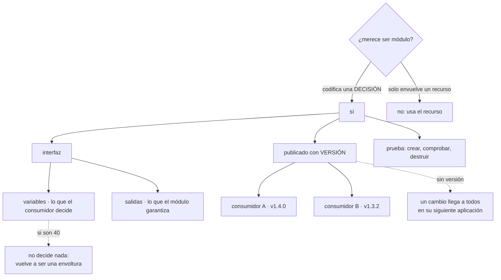

# 088 — Módulos, contratos, versiones y composición

> [← 087 · Estado remoto, locking, cifrado y recuperación](../../part-07-infrastructure-as-code-configuration/087-estado-remoto-locking-cifrado-y-recuperacion/README.md) · [Índice de la parte](../README.md) · [089 · Variables, outputs, locals y data sources →](../../part-07-infrastructure-as-code-configuration/089-variables-outputs-locals-y-data-sources/README.md)

**Parte:** 07 — Infraestructura como código y configuración<br>
**Nivel:** intermedio-avanzado · **Horas estimadas:** 4<br>
**Laboratorio:** `iac` · **Estado:** `EXECUTABLE_CORE`

## 🎯 Propósito

Escribir módulos que otros equipos usen de verdad, que es un problema de diseño de interfaces y no de sintaxis. Los dos fracasos habituales son simétricos —una envoltura que no aporta nada y un módulo con cuarenta variables que intenta cubrirlo todo— y ambos vienen del mismo error: **tratar el módulo como una plantilla de recursos en vez de como la codificación de una decisión**. La clase fija ese criterio, y añade la disciplina de versionado que las clases 047, 059 y 081 ya exigieron a las dependencias.

## 📚 Resultados de aprendizaje

Al finalizar podrás:

1. **Decidir** si algo merece ser un módulo, con un criterio que descarta las envolturas vacías.
2. **Diseñar** la interfaz de un módulo por la decisión que codifica, no por los campos del recurso.
3. **Versionar** y consumir módulos de forma que un cambio no llegue a nadie sin que lo acepte.
4. **Componer** módulos sin crear jerarquías que nadie pueda depurar.
5. **Probar** un módulo creando y destruyendo de verdad, no leyéndolo.

## 🧩 Conceptos centrales

| Concepto | Comprensión verificable |
|---|---|
| `módulo` | Directorio con entradas y salidas. Su valor no está en agrupar recursos sino en **codificar una decisión** que no haya que volver a tomar. |
| `interfaz` | Las variables y las salidas. Es lo único que los consumidores ven, así que cambiarla es un cambio incompatible aunque el interior no cambie. |
| `envoltura vacía` | Módulo que expone tantas variables como campos tiene el recurso. No decide nada y añade una capa que hay que mantener. |
| `módulo que lo cubre todo` | Módulo con decenas de variables opcionales y condicionales para cada caso. Nadie sabe qué combinaciones funcionan porque no se pueden probar todas. |
| `origen versionado` | Referencia a un módulo por etiqueta o revisión concreta. Sin ella, un cambio publicado llega a todos los consumidores en su siguiente aplicación. |
| `prueba de módulo` | Ejecución que crea recursos de verdad, comprueba y destruye. Es lo único que demuestra que las combinaciones declaradas funcionan. |

## 🧠 Modelo mental

IaC trata la infraestructura como producto versionado: el plan explica intención, el estado conecta intención y realidad, y la revisión reduce cambios accidentales.

Aplicado a esta clase, separa siempre cuatro planos: **intención** (qué necesita el usuario),
**configuración** (qué declaramos), **estado observado** (qué existe de verdad) y
**evidencia** (cómo sabemos que cumple). Confundirlos produce diseños que se ven correctos
en un diagrama pero fallan al operar.

## 🗺️ Flujo de razonamiento



## 📖 Desarrollo

### 1. Un módulo codifica una decisión, no agrupa recursos

La pregunta «¿esto debería ser un módulo?» se responde mal casi siempre, porque se responde por tamaño. El criterio útil es otro:

```text
¿hay una DECISIÓN que no quiero que nadie vuelva a tomar?
  → sí: es un módulo
  → no: es un recurso, y usarlo directamente es más claro
```

Y la diferencia se ve en el nombre. Estos no son módulos:

```text
modulo-bucket           envuelve un recurso y expone sus mismos campos
modulo-instancia        igual
modulo-red              agrupa tres recursos sin decidir nada
```

Estos sí:

```text
bucket-conforme         un bucket con la línea base de la organización:
                        acceso uniforme, sin acceso público, versionado,
                        ciclo de vida, cifrado y etiquetas obligatorias
                        → codifica las decisiones de las clases 041, 049, 053

servicio-web            todo lo que hace falta para exponer un servicio:
                        despliegue, servicio, entrada, presupuesto,
                        política de red y objeto de escalado, con los
                        valores por defecto que la organización ya decidió

entorno-efimero         una copia completa de un entorno, con las
                        decisiones de nombre, tamaño y caducidad ya tomadas
```

La diferencia práctica es que un consumidor del primer grupo tiene que saber tanto como si escribiera el recurso, y uno del segundo no:

```hcl
module "facturas" {
  source  = "git::ssh://git@interno/plataforma/modulos.git//bucket-conforme?ref=v2.3.0"
  nombre  = "cls-facturas"
  retencion_dias = 2555        # 7 años, requisito legal
  equipo  = "pedidos"
}
```

Cuatro entradas. Todo lo demás lo decidió la organización una vez, y quien use el módulo **no puede equivocarse en ello**. Ese es el valor real: no ahorrar líneas sino **hacer imposible el error**.

Y de ahí sale el indicador que detecta un módulo mal diseñado:

```text
si el número de variables se acerca al número de campos del recurso,
el módulo no está decidiendo nada
```

Es una envoltura, y una envoltura es peor que nada: añade una capa que mantener, una versión que seguir y un sitio más donde buscar cuando algo falla.

Y el fracaso simétrico, el módulo que intenta cubrir todos los casos:

```hcl
module "servicio" {
  source = "…"
  tipo_de_almacenamiento = var.tipo   # 4 opciones
  con_cache              = true       # cambia 6 recursos
  modo_red               = "privado"  # 3 opciones
  # … y 41 variables más
}
```

Con veinte variables opcionales hay más de un millón de combinaciones, de las que se probarán tres. El resto **no se sabe si funcionan**, y el consumidor lo descubre aplicando.

La salida es dividir por decisión, no por opción:

```text
en vez de un módulo con una variable que elige entre cuatro almacenamientos
  → cuatro módulos, o tres, o los que de verdad se usen
  y cada uno probado
```

Y conviene aceptar la consecuencia: **un módulo que solo sirve para un caso es un buen módulo** si ese caso es el que la organización tiene. La generalidad se añade cuando aparece el segundo consumidor real, no antes.

### 2. La interfaz es el contrato, y cambiarla es incompatible

Los consumidores solo ven las variables y las salidas. Todo lo demás es implementación y se puede cambiar; la interfaz, no.

**Las variables merecen tipo, descripción y validación**, porque son documentación ejecutable:

```hcl
variable "retencion_dias" {
  type        = number
  description = "Días que se conservan los objetos antes de eliminarse."
  validation {
    condition     = var.retencion_dias >= 30 && var.retencion_dias <= 3650
    error_message = "La retención debe estar entre 30 días y 10 años."
  }
}

variable "equipo" {
  type        = string
  description = "Equipo responsable. Se usa como etiqueta de atribución de costo."
  validation {
    condition     = can(regex("^[a-z][a-z0-9-]{2,20}$", var.equipo))
    error_message = "Nombre de equipo en minúsculas, guiones, de 3 a 21 caracteres."
  }
}
```

La validación convierte un error de aplicación en un error de planificación, que es donde cuesta menos. Y el mensaje debe decir **qué se esperaba**, no que el valor es inválido.

Y un tipo compuesto vale más que seis variables sueltas cuando los valores van juntos:

```hcl
variable "escalado" {
  type = object({
    minimo   = number
    maximo   = number
    objetivo = number
  })
  default = { minimo = 2, maximo = 10, objetivo = 70 }
  validation {
    condition     = var.escalado.minimo >= 2
    error_message = "El mínimo no puede ser menor que 2: una réplica no es alta disponibilidad (clase 074)."
  }
}
```

Ese mensaje de error hace algo más que validar: **transmite la decisión** y la clase donde se justificó.

**Las salidas son la garantía**, y conviene que sean pocas y estables:

```hcl
output "nombre"  { value = aws_s3_bucket.este.bucket }
output "arn"     { value = aws_s3_bucket.este.arn }
```

Exponer el objeto entero de un recurso es cómodo y ata a los consumidores a la estructura interna: cambiar el recurso rompe a todos. Y una salida marcada como sensible **no se cifra en el estado** —la advertencia de la clase 087— así que marcarla protege la pantalla y no el fichero.

Y la regla de compatibilidad, que es la de cualquier interfaz:

```text
compatible          añadir una variable con valor por defecto
                    añadir una salida
                    cambiar la implementación sin cambiar el resultado

INCOMPATIBLE        quitar o renombrar una variable o una salida
                    hacer obligatoria una variable que era opcional
                    cambiar el valor por defecto de algo que crea recursos
                    cualquier cambio que produzca destrucción y recreación
```

La última merece atención porque no es evidente: un cambio interno que altere un campo que fuerza reemplazo **destruye recursos de los consumidores** en su siguiente aplicación. Eso es un cambio incompatible aunque la interfaz no se haya tocado, y hay que publicarlo como tal y con aviso.

Y para retirar algo sin romper, el mismo patrón de expandir y contraer de las clases 071 y 079:

```text
1. añadir lo nuevo, marcar lo viejo como obsoleto en la descripción
2. publicar una versión menor; los consumidores migran cuando quieran
3. retirar lo viejo en una versión mayor, con aviso previo
```

### 3. Versionar, o el cambio llega solo

Este es el error operativo de la clase y su consecuencia es inmediata:

```hcl
# sin versión: la siguiente aplicación de CUALQUIER consumidor
# se lleva lo último que haya en la rama
module "bucket" {
  source = "git::ssh://git@interno/plataforma/modulos.git//bucket-conforme"
}
```

Un cambio publicado el martes llega a producción de otro equipo el miércoles, sin que nadie lo haya decidido. Es exactamente el argumento de las clases 047 —módulos de Bicep por versión— y 062 —base fijada por huella—, con un tercer mecanismo.

```hcl
module "bucket" {
  source = "git::ssh://git@interno/plataforma/modulos.git//bucket-conforme?ref=v2.3.0"
}
```

Y con un registro de módulos, la restricción se expresa como en cualquier gestor de dependencias:

```hcl
module "bucket" {
  source  = "interno.example/plataforma/bucket-conforme/aws"
  version = "~> 2.3"
}
```

Los tres orígenes y cuándo usa cada uno:

```text
ruta local        módulos de este mismo repositorio, que se versionan con él
git con revisión  lo habitual en una organización sin registro propio
registro          cuando hay varios consumidores y conviene descubrirlos
```

Y una advertencia sobre la ruta local que produce sorpresas: **un módulo local no se versiona por separado**, así que un cambio afecta a todo lo que hay en ese repositorio a la vez. Está bien para lo que se despliega junto y mal para lo que comparten equipos distintos.

Y la disciplina de publicación, que es la que hace utilizable un catálogo de módulos:

```text
cada versión con notas: qué cambia, si es incompatible y qué hay que hacer
las incompatibles solo en versiones mayores
un ejemplo mínimo funcionando dentro del módulo
y la fecha de retirada de las versiones antiguas
```

La última se olvida y produce el problema contrario al de no versionar: **veinte consumidores en catorce versiones distintas**, ninguna de las cuales se puede retirar porque alguien la usa. Una política de soporte —las dos últimas versiones mayores, por ejemplo— hay que decidirla antes de tener el problema.

Y una nota sobre la actualización, que conecta con la clase 067: igual que las imágenes base fijadas necesitan un proceso que proponga actualizarlas, los módulos fijados lo necesitan. Un robot que abra un cambio cuando hay versión nueva convierte la fijación en algo sostenible en vez de en deuda.

### 4. Componer sin construir una torre

Los módulos pueden llamar a otros módulos, y ahí empieza el problema de mantenibilidad.

```text
profundidad 1   el módulo raíz llama a módulos                    bien
profundidad 2   esos módulos llaman a módulos comunes             aceptable
profundidad 3+  cada nivel oculta el anterior                     difícil de depurar
```

El coste de la profundidad es concreto y se nota al diagnosticar:

```text
cada nivel añade un prefijo a la dirección de los recursos
  module.plataforma.module.red.module.subred.aws_subnet.este[0]
cada nivel puede transformar los valores que pasa
  → el valor que llega al recurso no se parece al que se escribió
cada nivel tiene su propia versión
  → averiguar qué versión efectiva se está usando exige recorrerlos
```

Y dos reglas que mantienen esto manejable:

```text
1. un módulo no configura proveedores; los recibe
   configurar un proveedor dentro impide usar alias desde fuera
   y complica retirarlo del estado

2. un módulo no lee el estado de nadie ni consulta datos globales
   recibe lo que necesita como variable
   → así se puede probar de forma aislada
```

La segunda parece restrictiva y es lo que hace probable un módulo. Uno que consulta la realidad para encontrar su red solo funciona donde esa red existe con ese nombre; uno que la recibe funciona en cualquier sitio, incluida una prueba.

Y el antipatrón que aparece en organizaciones grandes: **el módulo que despliega un entorno completo**.

```hcl
module "entorno" {
  source = "…/entorno-completo?ref=v4.1.0"
  nombre = "produccion"
}
```

Parece la culminación y trae tres problemas: el radio de impacto vuelve a ser todo (clases 047, 087), cualquier cambio del módulo afecta al entorno entero, y la planificación tarda lo que tardaba antes de repartir el estado. La composición correcta ocurre **en el módulo raíz de cada unidad de despliegue**, no dentro de un módulo:

```hcl
# tienda/main.tf — un estado, una unidad de despliegue
module "servicio"      { source = "…/servicio-web?ref=v3.1.0"    /* … */ }
module "cola"          { source = "…/cola-conforme?ref=v1.7.0"   /* … */ }
module "bucket"        { source = "…/bucket-conforme?ref=v2.3.0" /* … */ }
```

Y para lo que de verdad hay que repetir muchas veces, la iteración sobre módulos, con la advertencia de la clase 059 sobre la identificación por clave estable:

```hcl
module "colas" {
  source   = "…/cola-conforme?ref=v1.7.0"
  for_each = { pedidos = 5, facturas = 3, avisos = 10 }
  nombre   = each.key
  reintentos = each.value
}
```

### 5. Probar un módulo es crear y destruir

Un módulo que nadie ha ejecutado no está probado, por bien que se lea. Y hay tres niveles de comprobación con coste creciente:

```text
estático        formato, sintaxis y reglas de estilo: segundos
plan            que planifica sin error, con valores de ejemplo: segundos
aplicación real  crea, comprueba y destruye: minutos y dinero
```

Los dos primeros detectan errores de escritura; solo el tercero demuestra que la combinación funciona.

```hcl
# pruebas/basico.tftest.hcl
variables {
  nombre         = "cls-prueba-modulo"
  retencion_dias = 30
  equipo         = "plataforma"
}

run "crea_conforme" {
  command = apply

  assert {
    condition     = aws_s3_bucket_public_access_block.este.block_public_acls
    error_message = "el bucket debe bloquear el acceso público (clase 053)"
  }
  assert {
    condition     = aws_s3_bucket_versioning.este.versioning_configuration[0].status == "Enabled"
    error_message = "el versionado debe estar activo"
  }
}

run "rechaza_retencion_invalida" {
  command = plan
  variables { retencion_dias = 5 }
  expect_failures = [var.retencion_dias]
}
```

El segundo bloque es una **prueba negativa** en el sentido exacto que este programa ha usado desde la clase 046: comprueba que algo que no debe funcionar, falla. Y es la mitad que casi nunca se escribe.

Y las condiciones que hacen sostenible probar de verdad:

```text
una cuenta o proyecto propio para pruebas, con presupuesto y alerta
nombres únicos por ejecución, para que dos pruebas no choquen
destrucción garantizada, incluso si la prueba falla
y una limpieza periódica de lo que se quedó por el camino
```

La última no es opcional: una prueba interrumpida deja recursos, y en un año eso es una factura. La comparación de la clase 087 —lo que existe frente a lo que gestiona algún estado— aplicada a la cuenta de pruebas es la forma de encontrarlos.

Y la lista de comprobación de la clase:

```text
☐ el módulo codifica una decisión; su número de variables lo demuestra
☐ toda variable con tipo, descripción y validación cuando aplique
☐ salidas pocas y estables; nunca el objeto entero de un recurso
☐ no configura proveedores ni consulta datos globales
☐ publicado con versión, y consumido por versión
☐ notas de cada versión, con las incompatibilidades señaladas
☐ un ejemplo mínimo funcionando dentro del propio módulo
☐ pruebas que crean y destruyen, con al menos una prueba negativa
☐ política de soporte de versiones antiguas, decidida
☐ proceso que proponga actualizar a los consumidores
```

Diez puntos, de los cuales cuatro son sobre la interfaz. Y esa proporción es la tesis de la clase: **un módulo es una interfaz con implementación detrás, y casi todo su valor —y casi todos sus problemas— están en la interfaz**.

## 🔬 Ejemplo trabajado

**CloudShop tiene un catálogo de módulos que nadie usa. Tres equipos han escrito los suyos por su cuenta y el equipo de plataforma no entiende por qué. El análisis da tres razones y una de ellas explica las otras dos.**

**El diagnóstico.**

```text
módulos publicados                    14
módulos usados por más de un equipo    2
variables del módulo más usado        47
módulos con pruebas                    0
módulos con versión fijada por los consumidores   3 de 9 usos
```

La entrevista con los tres equipos dio la misma respuesta con tres formulaciones:

```text
"tardo más en entender el módulo que en escribir el recurso"
"no sé qué combinación de opciones funciona"
"la última vez que lo usé me rompió producción al actualizarse solo"
```

**Razón 1 — el módulo de 47 variables no decidía nada.**

```bash
$ grep -c '^variable' modulos/servicio/variables.tf
47
$ grep -c 'resource ' modulos/servicio/main.tf
11
```

Cuarenta y siete entradas para once recursos: el módulo exponía prácticamente todos sus campos. Un consumidor tenía que saber tanto como para escribirlos.

La reescritura por decisión, no por opción:

```text                                        antes            después
variables                                      47                9
valores por defecto decididos por la
  organización                                  3               31
condicionales internos                         19                2
combinaciones posibles                    >1 millón             12
combinaciones probadas                          0               12
líneas que escribe un consumidor              ~60                9
```

Las nueve variables restantes son las que de verdad varían entre servicios: nombre, equipo, imagen, puerto, tamaño, escalado, dominio, dependencias y ventana de mantenimiento. Todo lo demás lo decidió la organización una vez.

**Razón 2 — no había forma de saber qué funcionaba.**

Se escribieron pruebas que crean y destruyen de verdad:

```text
casos probados                                 12
de ellos, negativos                             5
tiempo de la suite                        14 min
costo mensual de la cuenta de pruebas     ~18 USD
fallos encontrados la primera ejecución         4
```

Los cuatro fallos son el dato interesante: cuatro combinaciones que el módulo declaraba admitir y que **nunca habían funcionado**. Una de ellas era la que un equipo había intentado usar seis meses antes, y por la que había decidido escribir el suyo.

**Razón 3 — el módulo cambiaba bajo los pies.**

```bash
$ grep -rn 'source.*modulos.git' entornos/ | grep -c 'ref='
3
$ grep -rn 'source.*modulos.git' entornos/ | grep -vc 'ref='
6
```

Seis de nueve usos sin versión fijada. Y el historial mostraba el incidente que había roto la confianza:

```text
un cambio en el módulo alteró un campo que fuerza reemplazo
seis equipos aplicaron esa semana por otros motivos
tres bases de datos marcadas para recreación
dos detenidas a tiempo en la revisión del plan
una aplicada: 40 minutos de corte
```

El cambio del módulo era compatible en su interfaz y **destructivo en su efecto** — exactamente el caso que esta clase señala como incompatible aunque no lo parezca.

```text                                        antes            después
usos con versión fijada                     3 de 9            9 de 9
notas por versión                          no había      obligatorias, con
                                                          incompatibilidades
cambios que fuerzan reemplazo             sin marcar     versión mayor + aviso
robot que propone actualizar                no                sí
protección contra destrucción en los
  recursos con datos                     0 de 6            6 de 6
```

La última fila es la que habría evitado el corte: con protección contra destrucción, el plan habría fallado en vez de recrear.

**Y el resultado a los tres meses:**

```text                                          antes         después
módulos publicados                              14              6
módulos usados por más de un equipo              2              6
equipos con módulos propios duplicados           3              0
variables del módulo principal                  47              9
módulos con pruebas                              0              6
usos con versión fijada                       3 de 9        22 de 22
tiempo de un servicio nuevo               2 días          40 minutos
```

Ocho módulos retirados: cinco eran envolturas que no decidían nada y tres cubrían casos que ya no existían.

Y la fila de abajo es la que convenció a los tres equipos: **cuarenta minutos para desplegar un servicio nuevo completo**, con la línea base de seguridad, red, observabilidad y presupuesto de interrupción ya aplicadas — porque el módulo codifica las decisiones de las clases 041 a 084 y no hay que volver a tomarlas.

**La lección que esta clase traslada al resto de la parte 07**: los tres equipos no rechazaban los módulos por preferencia. Los rechazaban porque **no ahorraban trabajo, no se sabía qué funcionaba y cambiaban solos**. Las tres razones son de diseño de interfaz y de disciplina de publicación, no de la herramienta. Y la reescritura de 47 variables a 9 no quitó capacidad: quitó **decisiones que nadie debería estar tomando dos veces**.

## 🧪 Laboratorio guiado

Ejecuta desde la raíz:

```bash
python classes/part-07-infrastructure-as-code-configuration/088-modulos-contratos-versiones-y-composicion/lab.py
```

El laboratorio selecciona el motor de práctica **`iac`** y produce
`lab_result.json`. El escenario, sus comprobaciones y el artefacto esperado corresponden a
esta clase; no requiere credenciales y deja explícito qué debe revalidarse en un sandbox real.

1. Lee `exercise.steps` y formula una predicción antes de ejecutar.
2. Ejecuta la práctica y verifica todos los elementos de `checks`.
3. Provoca el caso de `negative_test` y explica la señal observada.
4. Materializa `modulo-terraform` en `evidence/` usando la plantilla indicada.
5. Para proveedor real, sigue `sandbox.requires`, registra costo y ejecuta `destroy`.

### Evidencia esperada

El artefacto principal es un plan reproducible sin secretos ni cambios inesperados. Además, la entrega debe incluir el comando ejecutado,
la salida estructurada y una conclusión que no exceda lo observado.

## 🏆 Reto verificable

Construye **`modulo-terraform`** para el caso CloudShop. Incluye una alternativa descartada,
un supuesto que pueda falsarse, una prueba de fallo y una decisión de rollback.

## ✅ Criterio de aceptación

- [ ] `lab.py` termina con código 0 y genera JSON válido.
- [ ] La entrega conecta al menos tres requisitos con mecanismos verificables.
- [ ] Existe una prueba positiva y una prueba negativa con evidencia.
- [ ] Seguridad, costo y operación aparecen como decisiones, no como anexos.
- [ ] Se declara una limitación y una condición que obligaría a revisar el diseño.
- [ ] Otra persona puede repetir el recorrido sin conocimiento tácito.

## ⚠️ Errores frecuentes

| Síntoma | Causa probable | Corrección |
|---|---|---|
| Los equipos escriben sus propios recursos en vez de usar el módulo | El módulo expone casi tantas variables como campos tiene el recurso: no decide nada | Rediseña por decisión: cuenta cuántas variables varían de verdad entre consumidores y fija el resto. |
| Nadie sabe qué combinaciones de opciones funcionan | El módulo intenta cubrir todos los casos y las combinaciones no se pueden probar | Divide en módulos por decisión y prueba cada uno creando y destruyendo de verdad. |
| Un cambio del módulo llega a producción de otro equipo sin que nadie lo decida | El origen no fija versión | Consume siempre por etiqueta o restricción de versión, y ten un robot que proponga la actualización. |
| Un cambio compatible del módulo destruye recursos de los consumidores | Alteró un campo que fuerza reemplazo, aunque la interfaz no cambiara | Trátalo como incompatible: versión mayor y aviso; y protege contra destrucción los recursos con datos. |
| Un módulo no se puede probar de forma aislada | Consulta datos globales o configura sus propios proveedores | Que reciba lo que necesita como variable y los proveedores desde fuera. |
| Hay veinte consumidores repartidos en catorce versiones y ninguna se puede retirar | No hay política de soporte de versiones antiguas | Decide cuántas versiones se soportan y anuncia las retiradas con antelación. |

## 🛡️ Seguridad, ética y costo

Trabaja con cuentas propias o sandboxes autorizados. No publiques secretos, identificadores
reales ni datos personales. Antes de crear recursos pagos define presupuesto, etiquetas y
comando de destrucción; después verifica que no queden recursos huérfanos. Los ejemplos
locales enseñan contratos, pero no certifican cumplimiento ni disponibilidad de producción.

## ❓ Preguntas de comprobación

1. ¿Qué pregunta decide si algo merece ser un módulo, y qué indicador delata una envoltura vacía?
2. ¿Qué cambios de un módulo son incompatibles aunque la interfaz no cambie?
3. ¿Por qué consumir un módulo sin fijar versión equivale a aceptar cambios que nadie decidió?
4. ¿Por qué un módulo no debe configurar proveedores ni consultar datos globales?
5. ¿Qué demuestra una prueba que crea y destruye que no demuestra un plan correcto?

## 🔗 Referencias

- HashiCorp (2025). *Module composition* — profundidad, proveedores y patrones de composición. <https://developer.hashicorp.com/terraform/language/modules/develop/composition>
- HashiCorp (2025). *Module sources and versions* — orígenes, revisiones y restricciones de versión. <https://developer.hashicorp.com/terraform/language/modules/sources>
- HashiCorp (2025). *Variable validation and custom conditions* — validación en la planificación. <https://developer.hashicorp.com/terraform/language/expressions/custom-conditions>
- HashiCorp (2025). *Terraform test framework* — pruebas que aplican y destruyen, y fallos esperados. <https://developer.hashicorp.com/terraform/language/tests>
- HashiCorp (2025). *Standard module structure* — ejemplos, documentación y organización esperada. <https://developer.hashicorp.com/terraform/language/modules/develop/structure>
- Documentación oficial vigente del servicio implementado; registra URL y fecha de consulta.

---

> [Evaluación](assessment.md) · [Contrato de clase](lesson.yaml) · [Índice de la parte](../README.md)

| Anterior | Índice | Siguiente |
|---|---|---|
| [← 087 · Estado remoto, locking, cifrado y recuperación](../../part-07-infrastructure-as-code-configuration/087-estado-remoto-locking-cifrado-y-recuperacion/README.md) | [Parte 07](../README.md) · [Programa](../../README.md) | [089 · Variables, outputs, locals y data sources →](../../part-07-infrastructure-as-code-configuration/089-variables-outputs-locals-y-data-sources/README.md) |
