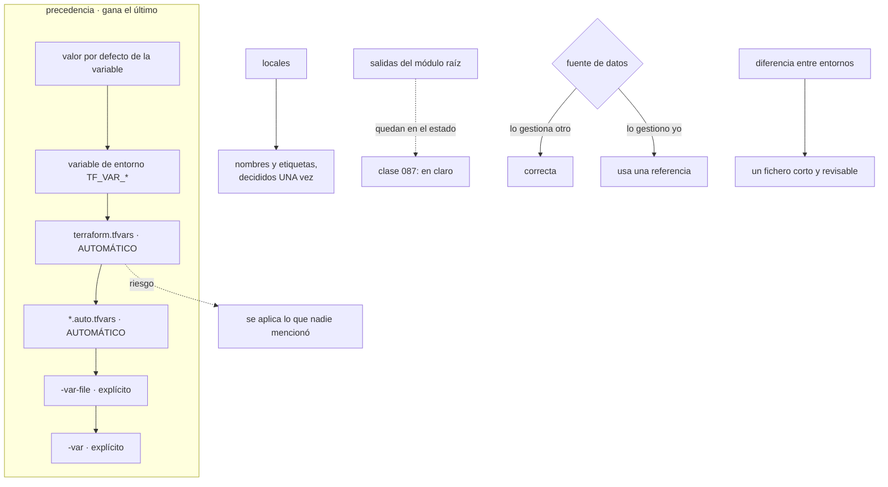

# 089 — Variables, outputs, locals y data sources

> [← 088 · Módulos, contratos, versiones y composición](../../part-07-infrastructure-as-code-configuration/088-modulos-contratos-versiones-y-composicion/README.md) · [Índice de la parte](../README.md) · [090 · Plan, apply, drift, import y refactor con moved →](../../part-07-infrastructure-as-code-configuration/090-plan-apply-drift-import-y-refactor-con-moved/README.md)

**Parte:** 07 — Infraestructura como código y configuración<br>
**Nivel:** intermedio-avanzado · **Horas estimadas:** 4<br>
**Laboratorio:** `iac` · **Estado:** `EXECUTABLE_CORE`

## 🎯 Propósito

Decidir de dónde salen los valores, que es el problema real detrás de la promoción entre entornos. El orden de precedencia de las variables tiene una trampa concreta —**hay ficheros que se cargan solos y otros que no**— y de ahí salen las aplicaciones con los valores del entorno equivocado. La clase fija además la regla que las clases 081 y 085 midieron sin enunciarla: **la diferencia entre dos entornos debe caber en un fichero que alguien pueda leer entero**, y todo lo que no esté ahí es erosión, no decisión.

## 📚 Resultados de aprendizaje

Al finalizar podrás:

1. **Ordenar** las fuentes de valores por precedencia y detectar cuáles se cargan sin pedirlo.
2. **Tipar** las entradas con estructuras y campos opcionales en vez de decenas de variables sueltas.
3. **Centralizar** convenciones de nombres y etiquetas en un solo sitio calculado.
4. **Distinguir** cuándo una fuente de datos es correcta y cuándo esconde un acoplamiento.
5. **Expresar** la diferencia entre entornos en un fichero corto y revisable.

## 🧩 Conceptos centrales

| Concepto | Comprensión verificable |
|---|---|
| `precedencia de variables` | Orden en que se resuelven las fuentes de un valor. Lo declarado más tarde gana, y **algunos ficheros se cargan automáticamente** sin mencionarlos. |
| `carga automática` | Ficheros que se leen sin indicarlos. Es cómodo y es el mecanismo por el que se aplica una configuración distinta de la que se creía. |
| `atributo opcional` | Campo de un objeto con valor por defecto. Permite una sola variable estructurada en vez de una decena de variables sueltas. |
| `valor local` | Cálculo con nombre dentro de un módulo. Su mejor uso es centralizar convenciones —nombres y etiquetas— para que se decidan una vez. |
| `fuente de datos` | Lectura de algo que gestiona otro. Correcta para lo ajeno; para lo propio, una referencia directa es siempre mejor. |
| `diferencia declarada frente a erosión` | Lo que cambia entre entornos por decisión, frente a lo que cambia porque alguien editó una copia. Solo lo primero cabe en un fichero corto. |

## 🧠 Modelo mental

IaC trata la infraestructura como producto versionado: el plan explica intención, el estado conecta intención y realidad, y la revisión reduce cambios accidentales.

Aplicado a esta clase, separa siempre cuatro planos: **intención** (qué necesita el usuario),
**configuración** (qué declaramos), **estado observado** (qué existe de verdad) y
**evidencia** (cómo sabemos que cumple). Confundirlos produce diseños que se ven correctos
en un diagrama pero fallan al operar.

## 🗺️ Flujo de razonamiento



## 📖 Desarrollo

### 1. De dónde sale un valor, y cuál gana

Un valor puede venir de seis sitios, y el orden importa porque **el último gana**:

```text
1. el valor por defecto de la variable
2. una variable de entorno con el prefijo convenido
3. terraform.tfvars           ← se carga SOLO
4. cualquier fichero *.auto.tfvars   ← se cargan SOLOS, por orden alfabético
5. -var-file, en el orden en que se indiquen
6. -var
```

Las líneas 3 y 4 son la trampa de esta clase. Un fichero con esos nombres se lee **sin que nadie lo mencione**, así que basta con que exista en el directorio para que sus valores se apliquen. Y el escenario que produce el incidente es prosaico:

```text
alguien copia produccion.tfvars a la carpeta para consultar un valor
lo renombra a terraform.tfvars por costumbre, o lo deja como algo.auto.tfvars
la siguiente ejecución en esa carpeta usa esos valores
y el plan parece razonable, porque los nombres de recurso coinciden
```

La protección es doble y conviene aplicar las dos:

```text
1. ningún fichero con nombre de carga automática en el repositorio
   → los valores por entorno se pasan siempre con -var-file explícito
2. que el propio código verifique en qué entorno cree estar
```

La segunda se consigue con una comprobación en la planificación:

```hcl
variable "entorno" {
  type = string
  validation {
    condition     = contains(["dev", "pre", "pro"], var.entorno)
    error_message = "Entorno no reconocido."
  }
}

check "entorno_coincide_con_el_estado" {
  assert {
    condition     = can(regex(var.entorno, data.terraform_remote_state.este.workspace))
    error_message = "El entorno declarado no coincide con el estado en uso."
  }
}
```

Y una comprobación más simple y muy efectiva: que el nombre del almacén de estado incluya el entorno y que una validación lo compare con la variable. Aplicar con los valores de producción sobre el estado de preproducción deja de ser posible en silencio.

Y sobre las **variables de entorno**, dos avisos:

```text
son invisibles en la revisión: nadie las ve en el pull request
y persisten en la sesión: una exportación olvidada afecta a la siguiente carpeta
```

Por eso conviene reservarlas para lo que de verdad no debe estar en un fichero —credenciales que la canalización inyecta— y no para configuración.

### 2. Tipar bien reduce el número de variables

La clase 088 midió el problema: cuarenta y siete variables sueltas. Una parte de esa inflación es de diseño y otra es de tipado.

Una variable estructurada con campos opcionales sustituye a media docena:

```hcl
variable "escalado" {
  description = "Política de escalado del servicio."
  type = object({
    minimo          = optional(number, 2)
    maximo          = optional(number, 10)
    objetivo_cpu    = optional(number, 70)
    ventana_bajada  = optional(number, 300)
  })
  default = {}
}
```

Con eso, un consumidor que no quiera decidir nada escribe nada, y quien quiera cambiar un campo escribe solo ese:

```hcl
escalado = { maximo = 40 }
```

Y los tres beneficios frente a variables sueltas:

```text
los valores que van juntos se ven juntos
añadir un campo opcional NO es un cambio incompatible (clase 088)
la validación puede comprobar la coherencia ENTRE campos
```

La tercera es la que más rinde:

```hcl
  validation {
    condition     = var.escalado.maximo > var.escalado.minimo
    error_message = "El máximo debe ser mayor que el mínimo."
  }
```

Eso es imposible de expresar con variables sueltas, y es el tipo de error que sin ello se descubre aplicando.

Y los **valores locales** tienen un uso que justifica su existencia por sí solo: **centralizar las convenciones**.

```hcl
locals {
  prefijo = "cls-${var.sistema}-${var.entorno}-${var.region_corta}"

  etiquetas = {
    sistema          = var.sistema
    entorno          = var.entorno
    equipo           = var.equipo
    gestionado-por   = "terraform"
    repositorio      = var.repositorio
    revision         = var.revision
  }
}

resource "aws_s3_bucket" "facturas" {
  bucket = "${local.prefijo}-facturas"
  tags   = local.etiquetas
}
```

Y con la mayoría de proveedores hay algo mejor: **etiquetas por defecto en el proveedor**, que se aplican a todo sin repetirlas:

```hcl
provider "aws" {
  default_tags { tags = local.etiquetas }
}
```

Eso cierra de un golpe la obligación de atribución de costo que las clases 025, 037 y 049 pedían, y elimina el recurso que se etiqueta mal por olvido. Con una advertencia: si un recurso define sus propias etiquetas, en algunos proveedores **sustituyen** a las por defecto en vez de combinarse, así que conviene comprobarlo una vez.

Y un uso de los locales que conviene evitar: la lógica compleja. Un local con tres funciones anidadas y un condicional es un cálculo que nadie va a poder leer en seis meses. Si hace falta, va con un nombre que lo explique y un comentario que diga por qué.

### 3. Salidas y fuentes de datos: qué exponer y qué leer

**Las salidas** tienen dos usos distintos que conviene separar:

```text
salidas de un MÓDULO      el contrato con quien lo usa (clase 088)
salidas del módulo RAÍZ   información para personas y para otros sistemas
```

Y las del raíz tienen la propiedad que la clase 087 señaló: **quedan escritas en el estado**. Así que exponer un secreto como salida es publicarlo donde tenga acceso quien pueda leer el estado, exactamente igual que el historial de despliegues de la clase 047. Cuarta aparición de la ley del sistema de solo añadir.

```hcl
output "endpoint" {
  value       = aws_db_instance.pedidos.endpoint
  description = "Punto de conexión de la base de datos."
}

output "password" {                      # ← no
  value     = random_password.bd.result
  sensitive = true
}
```

Marcarla como sensible oculta el valor en la salida por pantalla **y no lo cifra en el estado**. La forma correcta es que el secreto vaya al gestor de la clase 092 y que la salida sea, como mucho, su referencia.

Y una recomendación práctica: las salidas del raíz que otros sistemas consumen conviene publicarlas también en un almacén de parámetros, por lo que la clase 087 explicó — leer el estado ajeno concede acceso a sus secretos, y leer un parámetro publicado no.

**Las fuentes de datos** tienen una regla que evita casi todos sus problemas:

```text
lo que gestiona OTRO       fuente de datos: correcta
lo que gestiono YO         una referencia directa: siempre mejor
```

El segundo caso aparece con más frecuencia de la esperada:

```hcl
# mal: leer con una consulta algo que este mismo código crea
resource "aws_vpc" "principal" { cidr_block = "10.20.0.0/16" }

data "aws_subnet" "app" {
  vpc_id = aws_vpc.principal.id
  filter { name = "tag:Name" values = ["snet-app"] }
}

# bien: referenciar el recurso
resource "aws_subnet" "app" { /* … */ }
# … y usar aws_subnet.app.id
```

La versión con consulta funciona y tiene dos defectos: añade una dependencia que el grafo no puede resolver bien (clase 086) y **falla en la primera aplicación**, cuando la subred todavía no existe.

Y tres precauciones con las fuentes de datos que gestionan otros:

```text
un filtro que devuelve varios resultados falla la planificación entera
un filtro que no devuelve nada, también
y lo que consultan puede cambiar sin avisar, porque es de otro equipo
```

De ahí que el contrato entre equipos convenga que sea explícito, como la clase 087 propuso: un nombre acordado o un parámetro publicado, con un dueño, en vez de una consulta por etiqueta que alguien puede editar sin saber que rompe algo.

Y una fuente de datos que conviene conocer porque resuelve un caso frecuente: la que consulta la identidad con la que se está ejecutando.

```hcl
data "aws_caller_identity" "actual" {}

check "cuenta_correcta" {
  assert {
    condition     = data.aws_caller_identity.actual.account_id == var.cuenta_esperada
    error_message = "Se está aplicando sobre la cuenta equivocada."
  }
}
```

Esa comprobación es la versión definitiva de la protección del primer apartado: **impide aplicar sobre la cuenta equivocada**, con independencia de qué fichero de valores se haya cargado.

### 4. La diferencia entre entornos cabe en un fichero

Aquí está la regla que las clases 081 y 085 midieron sin enunciarla. Al unificar cuatro copias de manifiestos, la clase 081 encontró doce diferencias reales y **treinta y una accidentales**. La clase 085 encontró la misma proporción en las plantillas.

La regla que lo evita:

```text
toda la diferencia entre dos entornos debe caber en un fichero de valores
que alguien pueda leer entero de una vez
```

Si no cabe, hay dos posibilidades y ninguna buena: o hay diferencias que nadie decidió, o hay diferencias que deberían ser una decisión de arquitectura y se están expresando como configuración.

```hcl
# entornos/pro.tfvars — todo lo que distingue producción
entorno       = "pro"
cuenta_esperada = "418293047512"
region        = "eu-west-1"

escalado      = { minimo = 6, maximo = 40 }
tamano_bd     = "db.r6g.xlarge"
alta_disponibilidad = true
retencion_copias_dias = 35
dominio       = "tienda.example"
```

Ocho valores. Y lo que **no** debe aparecer ahí:

```text
condicionales por entorno dentro del código
  count = var.entorno == "pro" ? 1 : 0
  → un recurso que solo existe en producción es un recurso que
    NUNCA se prueba antes de llegar allí

módulos distintos por entorno
  → entonces no se está promoviendo el mismo código

valores derivados del nombre del entorno dentro de la lógica
  → hace imposible crear un entorno nuevo sin tocar el código
```

El primero es el más común y el más caro. Un recurso condicionado al entorno significa que la ruta de código de producción se ejecuta por primera vez **en producción**. La alternativa es que el recurso exista en todos los entornos con un tamaño distinto, que es lo que expresa el fichero de valores.

Y hay una excepción legítima que conviene reconocer: algo que no puede existir en un entorno pequeño por su coste —una configuración multirregional, un servicio con tarifa mínima alta—. Ahí, la decisión se documenta y se acepta el riesgo:

```text
riesgo declarado: la configuración multirregional solo existe en producción,
  así que su primera ejecución real es en producción.
  Mitigación: ensayo trimestral en un entorno efímero creado para ello.
```

Esa mitigación es la que convierte una excepción en una decisión, y es la misma disciplina de riesgos residuales que este programa pide desde la clase 036.

Y la estructura que sostiene todo lo anterior:

```text
modulos/                módulos versionados (clase 088)
infra/
  red/
    main.tf             el MISMO código para los cuatro entornos
    variables.tf
    entornos/
      dev.tfvars
      pre.tfvars
      pro.tfvars
  datos/
  tienda/
```

Y la aplicación siempre explícita, sin depender de ninguna carga automática:

```bash
$ terraform -chdir=infra/red init -backend-config=entornos/pro.backend
$ terraform -chdir=infra/red plan -var-file=entornos/pro.tfvars -out=tfplan
$ terraform -chdir=infra/red apply tfplan
```

### 5. Comprobar que los entornos no divergen

La erosión entre entornos no se evita con disciplina: se evita con una comprobación, porque ocurre despacio y por buenas razones.

La comprobación es comparar los planes:

```bash
$ for e in dev pre pro; do
    terraform -chdir=infra/tienda plan -var-file=entornos/$e.tfvars \
      -out=/tmp/$e.plan >/dev/null
    terraform -chdir=infra/tienda show -json /tmp/$e.plan \
      | jq -S '[.planned_values.root_module | .. | .type? // empty] | sort' > /tmp/$e.tipos
  done
$ diff /tmp/pre.tipos /tmp/pro.tipos
```

Si los tipos de recurso no coinciden entre preproducción y producción, hay algo que solo existe en uno de los dos. Y esa lista debería ser corta y conocida.

Y una comprobación más fina que detecta la erosión de valores:

```bash
$ diff <(sort entornos/pre.tfvars) <(sort entornos/pro.tfvars) | grep -c '^[<>]'
```

Ese número es el que hay que vigilar. Si crece con el tiempo sin que nadie tome decisiones, es erosión.

Y la lista de comprobación de la clase:

```text
☐ ningún fichero con nombre de carga automática en el repositorio
☐ toda aplicación con fichero de valores explícito
☐ comprobación de que la cuenta o proyecto es el esperado
☐ variables estructuradas con campos opcionales, no decenas sueltas
☐ validación entre campos donde tenga sentido
☐ convenciones de nombre y etiquetas en un solo sitio, o por defecto
   en el proveedor
☐ ningún secreto como salida del módulo raíz
☐ fuentes de datos solo para lo que gestiona otro, con filtro exacto
☐ ningún condicional por entorno en el código
☐ la diferencia entre entornos cabe en un fichero legible de una vez
☐ comparación periódica de los planes entre entornos
```

Once puntos, y el noveno es el que más discusión genera. Merece un cierre explícito, porque es la tesis de la clase:

> **Un recurso que solo existe en producción es un recurso que nunca se ha probado.** Si de verdad no puede existir en otros entornos, eso es un riesgo declarado con su propia mitigación, no una decisión de configuración.

## 🔬 Ejemplo trabajado

**CloudShop promueve infraestructura entre cuatro entornos y cada promoción trae sorpresas. Los cuatro hallazgos son de dónde salen los valores, y el último obligó a cambiar cómo se prueban los cambios.**

**Hallazgo 1 — se aplicó preproducción con los valores de producción.**

El plan proponía subir el tamaño de la base de datos de preproducción de `db.t4g.medium` a `db.r6g.xlarge`. Alguien lo revisó, no le pareció raro y lo aplicó.

```bash
$ ls infra/datos/
main.tf  variables.tf  outputs.tf  terraform.tfvars  entornos/
$ head -2 infra/datos/terraform.tfvars
entorno   = "pro"
tamano_bd = "db.r6g.xlarge"
```

Un fichero copiado tres semanas antes para consultar un valor, con nombre de carga automática. Se aplicaba **en todas las ejecuciones de esa carpeta**, y los valores explícitos de preproducción llegaban antes en la precedencia, así que perdían.

```text                                        antes            después
ficheros de carga automática en el repositorio    2                0
comprobación de cuenta o proyecto              no había     en las 4 carpetas
comprobación de coincidencia entorno/estado    no había         activa
costo del error                            412 USD en 3 semanas    —
```

La comprobación de identidad es la que de verdad lo cierra: con ella, un fichero equivocado hace fallar la planificación en vez de aplicar en el sitio equivocado.

**Hallazgo 2 — 31 recursos que solo existían en producción.**

La comparación de planes entre entornos, hecha por primera vez:

```text
tipos de recurso en preproducción      41
tipos de recurso en producción         52
diferencia                             11 tipos, 31 recursos
```

Y el origen de los once:

```text
condicionados a var.entorno == "pro"      7 tipos   decisión consciente… en 2024
añadidos a mano en producción             3 tipos   nunca llegaron al código
módulo distinto por entorno               1 tipo    nadie recordaba por qué
```

Los siete condicionales incluían la replicación entre regiones, las alertas de guardia y el registro de auditoría. **Ninguno se había ejecutado nunca fuera de producción.**

```text                                        antes            después
condicionales por entorno en el código          7                1
recursos solo en producción                    31                4
el recurso restante                          —      configuración multirregional,
                                                    con riesgo declarado y ensayo
                                                    trimestral en entorno efímero
tipos de recurso en preproducción              41               51
costo mensual de preproducción             340 USD          520 USD
```

Ciento ochenta dólares más al mes para que preproducción se parezca a producción. La cifra se comparó con el coste de los dos últimos incidentes atribuibles a esa diferencia —una configuración de alertas que nunca funcionó y una réplica mal configurada— y la decisión fue inmediata.

**Hallazgo 3 — el 14 % de los recursos sin etiquetar.**

```bash
$ aws resourcegroupstaggingapi get-resources --query \
  'ResourceTagMappingList[?!(Tags[?Key==`equipo`])].ResourceARN' --output text | wc -l
89
```

Ochenta y nueve recursos sin la etiqueta de atribución de costo que las clases 025 y 049 exigían, casi todos creados por módulos que no la propagaban.

```text                                        antes            después
mecanismo de etiquetado          repetido en cada recurso   por defecto
                                                            en el proveedor
recursos sin etiqueta de equipo               89                0
costo no atribuible                       2.180 USD/mes        0
recursos que sustituyen las etiquetas
  por defecto en vez de combinarlas          3, corregidos      —
```

La última fila fue la sorpresa: tres recursos definían sus propias etiquetas y en ese proveedor eso **sustituye** las por defecto en vez de combinarlas. Se detectó comprobando la lista después del cambio, no antes.

**Hallazgo 4 — una contraseña en las salidas durante catorce meses.**

```bash
$ terraform output -json | jq -r 'keys[]'
bd_endpoint
bd_password
$ terraform state pull | jq -r '.outputs.bd_password.value' | head -c 8
Pr0d-202
```

Marcada como sensible, oculta en la salida por pantalla, **en claro en el estado** — con las doce identidades de lectura que la clase 087 había encontrado.

```text                                        antes            después
secretos como salida del raíz                  1                0
destino de la contraseña             generada y expuesta   gestor de secretos,
                                                            referencia como salida
credencial rotada                              —          el mismo día
comprobación en la canalización            ninguna     falla si una salida
                                                        coincide con patrones
                                                        de credencial
```

Quinta aparición de la ley del sistema de solo añadir de la clase 072, y la tercera con un mecanismo de infraestructura como código.

**Resumen:**

```text                                          antes         después
ficheros de carga automática                      2             0
aplicaciones sobre el entorno equivocado          1             0
condicionales por entorno                         7             1
recursos solo en producción                      31             4
recursos sin etiqueta de atribución              89             0
costo no atribuible                        2.180 USD/mes        0
secretos en salidas                               1             0
comparación de planes entre entornos          nunca          semanal
```

**La lección que esta clase traslada al resto de la parte 07**: los cuatro hallazgos existían desde hacía meses y ninguno producía un error. El que más caro salió no fue el de la aplicación equivocada sino el segundo: **treinta y un recursos cuya primera ejecución real ocurría en producción**, porque estaban condicionados al entorno. La comprobación que lo destapó —comparar los tipos de recurso de dos planes— es una línea, y la decisión que salió de ella costó 180 dólares al mes.

## 🧪 Laboratorio guiado

Ejecuta desde la raíz:

```bash
python classes/part-07-infrastructure-as-code-configuration/089-variables-outputs-locals-y-data-sources/lab.py
```

El laboratorio selecciona el motor de práctica **`iac`** y produce
`lab_result.json`. El escenario, sus comprobaciones y el artefacto esperado corresponden a
esta clase; no requiere credenciales y deja explícito qué debe revalidarse en un sandbox real.

1. Lee `exercise.steps` y formula una predicción antes de ejecutar.
2. Ejecuta la práctica y verifica todos los elementos de `checks`.
3. Provoca el caso de `negative_test` y explica la señal observada.
4. Materializa `interfaz-infraestructura` en `evidence/` usando la plantilla indicada.
5. Para proveedor real, sigue `sandbox.requires`, registra costo y ejecuta `destroy`.

### Evidencia esperada

El artefacto principal es un plan reproducible sin secretos ni cambios inesperados. Además, la entrega debe incluir el comando ejecutado,
la salida estructurada y una conclusión que no exceda lo observado.

## 🏆 Reto verificable

Construye **`interfaz-infraestructura`** para el caso CloudShop. Incluye una alternativa descartada,
un supuesto que pueda falsarse, una prueba de fallo y una decisión de rollback.

## ✅ Criterio de aceptación

- [ ] `lab.py` termina con código 0 y genera JSON válido.
- [ ] La entrega conecta al menos tres requisitos con mecanismos verificables.
- [ ] Existe una prueba positiva y una prueba negativa con evidencia.
- [ ] Seguridad, costo y operación aparecen como decisiones, no como anexos.
- [ ] Se declara una limitación y una condición que obligaría a revisar el diseño.
- [ ] Otra persona puede repetir el recorrido sin conocimiento tácito.

## ⚠️ Errores frecuentes

| Síntoma | Causa probable | Corrección |
|---|---|---|
| Se aplica con los valores de otro entorno y el plan parece razonable | Un fichero con nombre de carga automática está en el directorio y se lee sin mencionarlo | Prohíbe esos nombres en el repositorio, pasa siempre el fichero explícitamente y añade una comprobación de la cuenta o proyecto esperado. |
| Una configuración falla la primera vez que se usa, en producción | El recurso estaba condicionado al entorno, así que esa ruta nunca se había ejecutado | Que exista en todos los entornos con tamaño distinto; si de verdad no puede, decláralo como riesgo con un ensayo periódico. |
| Un módulo tiene decenas de variables sueltas relacionadas entre sí | No se usan tipos estructurados con campos opcionales | Agrupa en un objeto con valores por defecto y valida la coherencia entre campos. |
| Parte de los recursos no lleva las etiquetas obligatorias | El etiquetado se repite en cada recurso y alguno se olvida | Usa etiquetas por defecto del proveedor, y comprueba después que ningún recurso las sustituye en vez de combinarlas. |
| Un secreto es legible por quien tenga acceso al estado | Se expuso como salida del módulo raíz; marcarla como sensible no la cifra | Que el secreto viva en el gestor y la salida sea, como mucho, su referencia; rota lo ya expuesto. |
| Los entornos divergen despacio sin que nadie lo decida | No hay ninguna comprobación que compare lo que existe en cada uno | Compara periódicamente los tipos de recurso de los planes y el número de diferencias entre ficheros de valores. |

## 🛡️ Seguridad, ética y costo

Trabaja con cuentas propias o sandboxes autorizados. No publiques secretos, identificadores
reales ni datos personales. Antes de crear recursos pagos define presupuesto, etiquetas y
comando de destrucción; después verifica que no queden recursos huérfanos. Los ejemplos
locales enseñan contratos, pero no certifican cumplimiento ni disponibilidad de producción.

## ❓ Preguntas de comprobación

1. Ordena las seis fuentes de valores por precedencia y di cuáles se cargan sin mencionarlas.
2. ¿Qué comprobación impide aplicar sobre la cuenta equivocada, con independencia del fichero de valores?
3. ¿Qué tres ventajas tiene una variable estructurada con campos opcionales frente a variables sueltas?
4. ¿Cuándo es correcta una fuente de datos y cuándo esconde un acoplamiento?
5. ¿Por qué un recurso condicionado al entorno es un problema, y cuál es la excepción legítima?

## 🔗 Referencias

- HashiCorp (2025). *Input variables and variable definition precedence* — orden de las fuentes y carga automática. <https://developer.hashicorp.com/terraform/language/values/variables>
- HashiCorp (2025). *Optional object type attributes* — campos opcionales con valores por defecto. <https://developer.hashicorp.com/terraform/language/expressions/type-constraints>
- HashiCorp (2025). *Checks and custom conditions* — comprobaciones que no bloquean y aserciones. <https://developer.hashicorp.com/terraform/language/checks>
- HashiCorp (2025). *Output values and sensitive data* — salidas, sensibilidad y su presencia en el estado. <https://developer.hashicorp.com/terraform/language/values/outputs>
- HashiCorp (2025). *Default tags in the AWS provider* — etiquetado uniforme y su interacción con etiquetas locales. <https://registry.terraform.io/providers/hashicorp/aws/latest/docs#default_tags>
- Documentación oficial vigente del servicio implementado; registra URL y fecha de consulta.

---

> [Evaluación](assessment.md) · [Contrato de clase](lesson.yaml) · [Índice de la parte](../README.md)

**📥 Descargar:** [Parte 07 en PDF](../../../site/downloads/partes/manual-parte-07-infrastructure-as-code-configuration.pdf) · [Manual integral](../../../site/downloads/multi-cloud-engineering-manual-v2.0.pdf)

| Anterior | Índice | Siguiente |
|---|---|---|
| [← 088 · Módulos, contratos, versiones y composición](../../part-07-infrastructure-as-code-configuration/088-modulos-contratos-versiones-y-composicion/README.md) | [Parte 07](../README.md) · [Programa](../../README.md) | [090 · Plan, apply, drift, import y refactor con moved →](../../part-07-infrastructure-as-code-configuration/090-plan-apply-drift-import-y-refactor-con-moved/README.md) |
