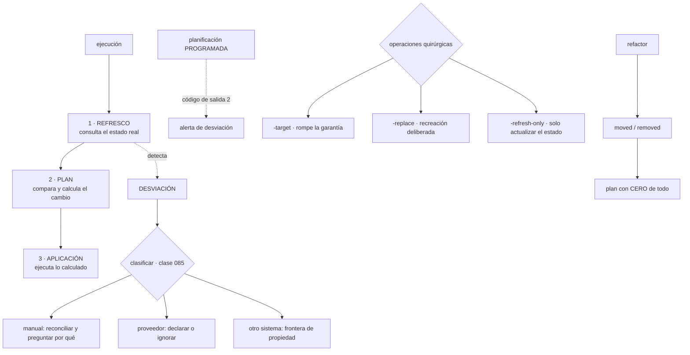

# 090 — Plan, apply, drift, import y refactor con moved

> [← 089 · Variables, outputs, locals y data sources](../../part-07-infrastructure-as-code-configuration/089-variables-outputs-locals-y-data-sources/README.md) · [Índice de la parte](../README.md) · [091 · Validación, lint, pruebas y policy as code →](../../part-07-infrastructure-as-code-configuration/091-validacion-lint-pruebas-y-policy-as-code/README.md)

**Parte:** 07 — Infraestructura como código y configuración<br>
**Nivel:** intermedio-avanzado · **Horas estimadas:** 4<br>
**Laboratorio:** `iac` · **Estado:** `EXECUTABLE_CORE`

## 🎯 Propósito

Dominar el ciclo de ejecución —refrescar, planificar, aplicar— y convertir la detección de desviación en una operación programada en lugar de en un descubrimiento accidental. Es la respuesta parcial a la pregunta que dejó la clase 084: sin un bucle continuo, **una planificación periódica es lo más parecido a la reconciliación** que se puede tener, y sirve para casi todo salvo para corregir sola. La clase cubre además las operaciones quirúrgicas y el procedimiento para refactorizar sin destruir nada.

## 📚 Resultados de aprendizaje

Al finalizar podrás:

1. **Separar** las tres fases de una ejecución y saber qué hace cada una con el estado.
2. **Programar** la detección de desviación y clasificar lo que encuentre.
3. **Leer** un plan localizando primero lo que destruye o reemplaza.
4. **Usar** las operaciones quirúrgicas sabiendo qué riesgo introduce cada una.
5. **Refactorizar** con la comprobación que demuestra que el cambio es seguro.

## 🧩 Conceptos centrales

| Concepto | Comprensión verificable |
|---|---|
| `refresco` | Consulta del estado real de cada recurso antes de comparar. Es lo que hace lenta una planificación grande y lo que **detecta la desviación**. |
| `plan guardado` | Fichero con el cambio calculado. Aplicarlo garantiza que se ejecuta lo revisado; sin él, la aplicación vuelve a planificar (clase 059). |
| `detección programada` | Planificación periódica cuyo resultado se vigila. Convierte la desviación en una señal en vez de en un descubrimiento durante un incidente. |
| `operación acotada` | Aplicar solo parte del grafo. Es una herramienta de emergencia: rompe la garantía de que el estado corresponde con lo declarado. |
| `declaración de movimiento` | Renombrar o mover un recurso sin destruirlo. La comprobación de que está bien es un plan con cero de todo. |
| `declaración de retirada` | Dejar de gestionar un recurso conservándolo. Es la forma declarativa y revisable de entregar algo a otro estado o a otro equipo. |

## 🧠 Modelo mental

IaC trata la infraestructura como producto versionado: el plan explica intención, el estado conecta intención y realidad, y la revisión reduce cambios accidentales.

Aplicado a esta clase, separa siempre cuatro planos: **intención** (qué necesita el usuario),
**configuración** (qué declaramos), **estado observado** (qué existe de verdad) y
**evidencia** (cómo sabemos que cumple). Confundirlos produce diseños que se ven correctos
en un diagrama pero fallan al operar.

## 🗺️ Flujo de razonamiento



## 📖 Desarrollo

### 1. Tres fases, y qué hace cada una

Una ejecución tiene tres fases y confundirlas lleva a diagnósticos equivocados:

```text
1. REFRESCO    consulta el estado REAL de cada recurso al proveedor
               actualiza en memoria lo que ha cambiado
2. PLAN        compara lo declarado con lo refrescado y calcula el cambio
3. APLICACIÓN  ejecuta ese cambio y escribe el estado
```

De ahí salen tres hechos operativos.

**El refresco es lo que tarda.** Una planificación de mil recursos hace mil llamadas a la API, y ahí está casi todo el tiempo. Por eso repartir el estado (clase 087) acelera tanto: se refrescan menos recursos.

Y se puede saltar, con una advertencia grande:

```bash
$ terraform plan -refresh=false
```

Eso planifica contra lo que el estado **cree** que hay, sin comprobarlo. Es útil para una iteración rápida durante el desarrollo y peligroso para aplicar: si algo cambió por fuera, el plan no lo verá y la aplicación puede pisarlo.

**El refresco es lo que detecta la desviación.** Y desde hace varias versiones ya no escribe el estado por su cuenta durante una planificación: la desviación aparece **en el plan**, como información:

```text
Note: Objects have changed outside of Terraform

  # aws_security_group.app has been changed
  ~ ingress { + cidr_blocks = ["0.0.0.0/0"] }
```

Esa sección es la más importante de un plan y la que menos se lee. Dice **qué ha cambiado alguien por fuera**, y en el ejemplo dice que alguien abrió un grupo de seguridad a internet.

Y para actualizar el estado sin cambiar nada de la infraestructura, existe una modalidad propia:

```bash
$ terraform plan  -refresh-only
$ terraform apply -refresh-only
```

Sirve para el caso legítimo de la clase 085: **aceptar un cambio del proveedor** que no se quiere revertir. Actualiza el estado para que refleje la realidad y deja de proponerlo en cada plan.

**La aplicación debe ejecutar un plan guardado.** Es la regla de la clase 059 y no ha cambiado:

```bash
$ terraform plan -out=tfplan -lock-timeout=10m
$ terraform show -no-color tfplan > plan.txt     # esto se revisa
$ terraform apply tfplan                          # esto ejecuta lo revisado
```

Y una precisión sobre el plan guardado que conviene conocer: **contiene los valores sensibles** de lo que va a crear. Si se publica como artefacto de la canalización, hereda el problema del estado de la clase 087. La versión legible que se publica en la revisión no debe ser el fichero binario sino su representación, con los valores sensibles ya ocultos.

### 2. La desviación como señal programada

La clase 084 dejó la pregunta: sin un bucle continuo, nada garantiza que dentro de un mes la realidad se parezca al repositorio. La respuesta parcial es convertir la planificación en una **comprobación periódica**.

```bash
$ terraform plan -detailed-exitcode -lock-timeout=5m
# 0 = sin cambios
# 2 = hay cambios  ← esto es la señal
# 1 = error
```

Ejecutado cada noche sobre cada estado, ese código de salida es la métrica que faltaba:

```text
código 0   la realidad coincide con lo declarado
código 2   hay desviación, o hay cambios sin aplicar en el repositorio
código 1   la ejecución falló: credenciales, bloqueo, un recurso que ya no existe
```

Y la segunda línea tiene dos causas que hay que distinguir, porque una es normal y la otra no:

```text
cambios sin aplicar   alguien fusionó código y no se ha desplegado todavía
                      → normal si la canalización aplica al fusionar; sospechoso si no
desviación real       la infraestructura cambió por fuera
                      → la sección "objetos han cambiado fuera de Terraform"
```

La distinción se automatiza mirando el plan en formato estructurado:

```bash
$ terraform show -json tfplan | jq -r '
    if (.resource_drift // []) | length > 0
    then "DESVIACIÓN: " + ([.resource_drift[].address] | join(", "))
    else "sin desviación" end'
```

Y lo que se hace con lo que encuentre es la clasificación de la clase 085, que aquí se convierte en un procedimiento:

```text
1. ¿es un campo que el proveedor rellena?
   → declararlo, o aceptarlo con una aplicación de solo refresco
2. ¿lo gestiona otro sistema?
   → declararlo como ignorado, con el dueño anotado (clase 086)
3. ¿lo cambió una persona?
   → averiguar POR QUÉ antes de revertir
     si el cambio era necesario, va al repositorio
     si no, se revierte y se registra
```

El paso 3 es el que la clase 085 midió: dos de cada tres cambios manuales resultaron ser necesarios.

Y lo que esta detección **no** hace, para no exagerar su alcance:

```text
no corrige nada: solo avisa
no detecta lo que el proveedor no expone en su API
no detecta recursos que existen y no están en ningún estado (clase 087)
y si el propio proceso deja de ejecutarse, no avisa nadie — ley 13
```

La última exige lo que la ley 13 pide siempre: una señal de que la comprobación se ejecutó. Una alerta sobre desviación que lleva tres semanas sin ejecutarse es indistinguible de un sistema sin desviación.

### 3. Leer un plan por donde importa

Un plan grande se lee en un orden concreto, porque lo peligroso está al final si se lee de arriba abajo.

**Primero, lo que destruye:**

```bash
$ terraform show -json tfplan | jq -r '.resource_changes[]
  | select(.change.actions | index("delete"))
  | "\(.change.actions | join(","))  \(.address)"'
delete,create  aws_db_instance.pedidos
delete         aws_s3_bucket.temporal
```

Dos líneas y las dos merecen atención distinta: la primera recrea una base de datos y la segunda borra un bucket.

**Segundo, por qué se reemplaza.** El plan lo dice al final de la línea del campo culpable:

```text
~ resource "aws_db_instance" "pedidos" {
    ~ engine_version = "15.4" -> "16.2" # forces replacement
```

Ese comentario es la información más valiosa de un plan. Y la protección de las clases 059 y 086 lo convierte en un error de planificación en vez de en una pérdida:

```hcl
lifecycle { prevent_destroy = true }
```

**Tercero, lo que se modifica en el sitio**, que normalmente no tiene riesgo. Y **cuarto, lo que se crea**, cuyo único riesgo es el coste.

Y la comprobación que conviene automatizar en la canalización, que es la de la clase 059 con el criterio afinado:

```bash
$ BORRADOS=$(terraform show -json tfplan | jq -r '.resource_changes[]
    | select(.change.actions | index("delete")) | .address')
$ if [ -n "$BORRADOS" ]; then
    echo "$BORRADOS" | tee borrados.txt
    echo "::warning::este plan destruye recursos; exige aprobación explícita"
  fi
```

No se trata de prohibir los borrados —a veces son el objetivo— sino de que ninguno pase sin que alguien lo haya leído y aceptado.

Y el ruido, que es el enemigo de todo lo anterior. La clase 085 midió que el 84 % de los cambios propuestos no eran desviación. Las tres causas y su corrección:

```text
campos que el proveedor rellena     declararlos explícitamente
valores normalizados por el proveedor  escribirlos en su forma normalizada
recursos gestionados por otro        declararlos como ignorados
```

Y la métrica que dice si la revisión sigue siendo legible:

```text
líneas del plan en una ejecución sin cambios de código
  0        correcto
  1-20     revisable
  >100     nadie lo lee, y el día que aparezca algo real pasará desapercibido
```

Esa es exactamente la lección que la clase 047 aprendió con el `what-if` y la 081 con el diferencial de manifiestos. Tercera aparición: **una previsualización ruidosa es una previsualización que no se usa**.

### 4. Operaciones quirúrgicas y su precio

Hay tres operaciones que actúan sobre una parte del sistema, y las tres tienen un coste que conviene conocer antes de usarlas en una urgencia.

**Aplicar solo una parte.**

```bash
$ terraform apply -target=aws_instance.app tfplan
```

Aplica ese recurso y sus dependencias, e ignora el resto. Es útil para salir de una situación bloqueada y **rompe la garantía central del sistema**: después de una aplicación acotada, el estado ya no corresponde con lo declarado, y nadie sabe qué queda pendiente.

```text
reglas de uso
  solo en emergencia, nunca en la canalización
  siempre seguido de una aplicación completa que deje el plan vacío
  y con un registro de por qué se hizo
```

La segunda regla es la importante: una aplicación acotada **no ha terminado** hasta que una completa dé cero cambios.

**Forzar la recreación de un recurso.**

```bash
$ terraform plan -replace=aws_instance.app -out=tfplan
```

Marca ese recurso para destruir y crear. Es la sustituta de la antigua marca de contaminado, y su ventaja es que **el efecto se ve en el plan antes de ejecutarse**. Sirve para el caso de la clase 085 —el recurso existe, está en el estado y está mal— y para reemplazar una máquina que ha degradado sin cambiar nada declarado.

**Actualizar el estado sin tocar la infraestructura.**

```bash
$ terraform apply -refresh-only
```

Acepta la realidad. Es lo correcto cuando la desviación es del proveedor y no se quiere revertir, y hay que hacerlo con el mismo cuidado que lo demás: revisando qué se está aceptando.

Y una operación que no es quirúrgica pero se usa como si lo fuera:

```bash
$ terraform destroy
```

Su radio de impacto es el estado entero, que es la razón por la que la clase 087 insistía en repartirlo. En entornos efímeros es la operación normal; en producción no debería poder ejecutarse desde la canalización en absoluto.

```text
protecciones acumuladas
  prevent_destroy en lo que no se puede perder      (086)
  protección del proveedor contra el borrado        (042, 077)
  permisos de la identidad que aplica: sin borrar    (059)
  y aprobación humana explícita para cualquier plan con borrados
```

Las cuatro son complementarias y ninguna sustituye a las demás: la primera falla la planificación, la segunda falla la llamada, la tercera impide que la identidad lo intente y la cuarta pone a una persona en medio.

### 5. Refactorizar sin destruir

El refactor es donde el estado se cobra su precio, porque **la dirección de un recurso es su identidad**. Renombrar sin más lo destruye y lo recrea.

El procedimiento seguro tiene cuatro pasos y una comprobación que decide:

```text
1. hacer el cambio en el código
2. declarar los movimientos
3. planificar
4. exigir CERO de todo
```

```hcl
# extraer recursos a un módulo
moved {
  from = aws_instance.web
  to   = module.tienda.aws_instance.web
}
moved {
  from = aws_security_group.web
  to   = module.tienda.aws_security_group.web
}

# pasar de índice numérico a clave estable (el arreglo de la clase 059)
moved {
  from = aws_vpc_security_group_ingress_rule.reglas[0]
  to   = aws_vpc_security_group_ingress_rule.reglas["permitir-https"]
}
```

```bash
$ terraform plan
Plan: 0 to add, 0 to change, 0 to destroy.
```

Esa línea con tres ceros es la comprobación. Cualquier otra cosa significa que la declaración de movimientos está incompleta o que el refactor cambia algo más de lo previsto, y en los dos casos hay que pararse.

Y para **dejar de gestionar** algo sin destruirlo, la forma declarativa:

```hcl
removed {
  from = aws_s3_bucket.legado
  lifecycle { destroy = false }
}
```

Eso lo saca del estado y **lo deja vivo**. Es lo correcto al entregar un recurso a otro equipo, al moverlo a otro estado o al retirar de la gestión algo que pasa a ser de un servicio gestionado. Y frente a la orden equivalente tiene la ventaja de siempre: **queda en el repositorio, revisable, con el resto del cambio**.

Un refactor grande —repartir un estado en cuatro, extraer módulos, renombrar todo— se hace por pasos y cada paso termina con el plan vacío. Intentarlo de una vez produce un plan de doscientas líneas que nadie puede verificar, y ahí es donde se cuela la destrucción de algo.

Y dos avisos sobre los movimientos:

```text
se pueden retirar del código una vez aplicados, y conviene dejarlos
  un tiempo: si otro entorno aún no ha aplicado, los necesita
no sirven para mover entre ESTADOS distintos
  → para eso, la orden de mover con estado de destino (clase 087)
```

Y la lista de comprobación de la clase:

```text
☐ aplicación siempre con plan guardado
☐ el plan legible se publica en la revisión, sin valores sensibles
☐ detección de desviación programada, con señal de que se ejecutó
☐ la sección de cambios fuera de Terraform, leída y clasificada
☐ lo que destruye el plan, extraído y aprobado explícitamente
☐ ruido del plan en cero para una ejecución sin cambios de código
☐ operaciones acotadas solo en emergencia, seguidas de una completa
☐ destrucción imposible desde la canalización en producción
☐ refactores con movimientos declarados y plan con cero de todo
☐ retiradas declaradas, no con órdenes sueltas
```

## 🔬 Ejemplo trabajado

**CloudShop programa la detección de desviación por primera vez. La primera ejecución sobre los cuatro estados devuelve código 2 en los cuatro, y clasificar lo que encuentra ocupa tres días y cambia cuatro cosas.**

**La primera ejecución.**

```text
estado        código   cambios propuestos   de ellos, desviación real
red              2            31                      4
datos            2            18                      2
plataforma       2            47                      1
tienda           2             9                      3
                            ─────                   ───
                            105                     10
```

Noventa y cinco de ciento cinco cambios eran ruido — la misma proporción que la clase 085 midió, en otro repositorio y con otro equipo.

**La clasificación de los diez reales.**

```text
origen                                          casos   decisión
campos que el proveedor rellena                   —     (ya estaban en el ruido)
otro sistema los gestiona                         3     declarados como ignorados
cambio manual necesario                           5     incorporados al repositorio
cambio manual innecesario                         2     revertidos
```

Y los cinco necesarios merecen detalle, porque son el argumento contra revertir sin preguntar:

```text
1. una regla de salida hacia un proveedor de pago nuevo, añadida hace 5 meses
2. el tamaño de una instancia subido durante un incidente de julio
3. una alarma de presupuesto que finanzas pidió por correo
4. un permiso de lectura para el equipo de auditoría
5. la retención de una copia de seguridad subida por requisito legal
```

Cinco decisiones legítimas que solo existían en la infraestructura y no en ningún sitio revisable. **Revertirlas habría producido cinco incidentes**, y uno de ellos —el quinto— habría sido un incumplimiento.

**Y los dos innecesarios:**

```text
1. un grupo de seguridad abierto a internet "para probar", hacía 3 semanas
2. un registro de auditoría desactivado durante una migración, hacía 2 meses
```

El primero es el hallazgo de seguridad del ejercicio: **tres semanas con un puerto abierto a internet** que ninguna alerta había detectado, porque la detección de desviación no existía.

**El ruido, y cuánto costó eliminarlo.**

```text                                        antes            después
cambios propuestos sin cambios de código        105              0
  campos del proveedor no declarados             61        declarados
  valores normalizados de otra forma             19        escritos ya normalizados
  recursos de otros sistemas                     15        declarados como ignorados
esfuerzo                                         —        2,5 días-persona
```

Dos días y medio para que la señal sea legible. Y la consecuencia inmediata: a partir de ahí, **cualquier cambio propuesto en una ejecución nocturna es real**, lo que convierte el código de salida en una alerta útil.

**Los tres meses siguientes.**

```text
ejecuciones nocturnas                          368
con desviación                                  14
  de ellas, cambios manuales                     9
  de ellas, del proveedor                        5
tiempo medio hasta detectar un cambio manual   < 24 h
```

Y el efecto que nadie había previsto: los cambios manuales **bajaron de nueve a dos** en el tercer mes. No por una norma, sino porque cada uno generaba una notificación con nombre y apellidos al día siguiente, y la conversación que seguía terminaba siempre igual —«¿esto debería estar en el repositorio?»—.

**Y un refactor grande, hecho por pasos.**

La separación del estado de la clase 087 se completó extrayendo módulos:

```text
paso                              movimientos   plan tras el paso
1. extraer el módulo de red            18       0 add, 0 change, 0 destroy
2. extraer el de datos                 11       0, 0, 0
3. pasar índices a claves estables     26       0, 0, 0
4. retirar recursos legados             4       0, 0, 0  (con retirada declarada)
```

Cincuenta y nueve movimientos en cuatro pasos, **sin destruir ni recrear nada**. Y el paso 3 fue el que más valor tuvo: eliminó de una vez el riesgo de reindexación que la clase 059 había identificado y que seguía presente en veintiséis recursos.

```text                                        antes            después
recursos identificados por posición             26                0
riesgo de destrucción al quitar un elemento    alto          ninguno
plan tras cada paso del refactor                 —          0, 0, 0
```

**Resumen:**

```text                                          antes         después
cambios propuestos sin cambios de código        105              0
desviación detectada                          nunca        en menos de 24 h
cambios manuales al mes                          9              2
días con un puerto abierto sin detectar         21              0
recursos identificados por posición             26              0
refactor con destrucción                       n/a              0
```

**La lección que esta clase traslada al resto de la parte 07**: la detección programada no corrige nada y aun así cambió el comportamiento del equipo, porque **convirtió el cambio manual en algo visible con nombre al día siguiente**. Y el trabajo que la hizo posible no fue configurar la ejecución nocturna sino los dos días y medio de eliminar ruido: una señal que grita ciento cinco veces al día no es una señal. La corrección de fondo —un bucle que además reconcilie— es la parte 08.

## 🧪 Laboratorio guiado

Ejecuta desde la raíz:

```bash
python classes/part-07-infrastructure-as-code-configuration/090-plan-apply-drift-import-y-refactor-con-moved/lab.py
```

El laboratorio selecciona el motor de práctica **`iac`** y produce
`lab_result.json`. El escenario, sus comprobaciones y el artefacto esperado corresponden a
esta clase; no requiere credenciales y deja explícito qué debe revalidarse en un sandbox real.

1. Lee `exercise.steps` y formula una predicción antes de ejecutar.
2. Ejecuta la práctica y verifica todos los elementos de `checks`.
3. Provoca el caso de `negative_test` y explica la señal observada.
4. Materializa `ciclo-cambio-iac` en `evidence/` usando la plantilla indicada.
5. Para proveedor real, sigue `sandbox.requires`, registra costo y ejecuta `destroy`.

### Evidencia esperada

El artefacto principal es un plan reproducible sin secretos ni cambios inesperados. Además, la entrega debe incluir el comando ejecutado,
la salida estructurada y una conclusión que no exceda lo observado.

## 🏆 Reto verificable

Construye **`ciclo-cambio-iac`** para el caso CloudShop. Incluye una alternativa descartada,
un supuesto que pueda falsarse, una prueba de fallo y una decisión de rollback.

## ✅ Criterio de aceptación

- [ ] `lab.py` termina con código 0 y genera JSON válido.
- [ ] La entrega conecta al menos tres requisitos con mecanismos verificables.
- [ ] Existe una prueba positiva y una prueba negativa con evidencia.
- [ ] Seguridad, costo y operación aparecen como decisiones, no como anexos.
- [ ] Se declara una limitación y una condición que obligaría a revisar el diseño.
- [ ] Otra persona puede repetir el recorrido sin conocimiento tácito.

## ⚠️ Errores frecuentes

| Síntoma | Causa probable | Corrección |
|---|---|---|
| Una planificación grande tarda varios minutos | El refresco consulta cada recurso al proveedor | Reparte el estado por radio de impacto; para iterar en desarrollo, planifica sin refresco sabiendo que no verás cambios externos. |
| La desviación se descubre durante un incidente | Nadie planifica salvo cuando va a cambiar algo | Programa la planificación con código de salida detallado y vigila también que la propia comprobación se ejecute. |
| Nadie lee el plan porque siempre propone decenas de cambios | Campos del proveedor sin declarar y recursos gestionados por otros sistemas | Elimina el ruido hasta que una ejecución sin cambios de código proponga cero; es la condición para que la señal sirva. |
| Tras una aplicación acotada nadie sabe qué queda pendiente | Aplicar una parte rompe la correspondencia entre estado y declaración | Úsala solo en emergencia y termina siempre con una aplicación completa que deje el plan vacío. |
| Un refactor propone destruir y recrear recursos | La dirección del recurso es su identidad y ha cambiado | Declara los movimientos y exige un plan con cero de todo; si propone algo, la declaración está incompleta. |
| Revertir la desviación provoca varios incidentes | Los cambios manuales respondían a decisiones legítimas que no estaban en el repositorio | Clasifica antes de revertir y averigua el motivo de cada uno: la mayoría suele ser necesaria. |

## 🛡️ Seguridad, ética y costo

Trabaja con cuentas propias o sandboxes autorizados. No publiques secretos, identificadores
reales ni datos personales. Antes de crear recursos pagos define presupuesto, etiquetas y
comando de destrucción; después verifica que no queden recursos huérfanos. Los ejemplos
locales enseñan contratos, pero no certifican cumplimiento ni disponibilidad de producción.

## ❓ Preguntas de comprobación

1. ¿Qué hace cada una de las tres fases de una ejecución y cuál detecta la desviación?
2. ¿Qué distingue el código de salida 2 causado por desviación del causado por cambios sin aplicar?
3. ¿En qué orden se lee un plan y cuál es la información más valiosa que contiene?
4. ¿Qué garantía rompe una aplicación acotada y cómo se cierra esa brecha?
5. ¿Qué comprobación demuestra que un refactor con movimientos declarados es seguro?

## 🔗 Referencias

- HashiCorp (2025). *The core Terraform workflow* — refresco, plan y aplicación. <https://developer.hashicorp.com/terraform/intro/core-workflow>
- HashiCorp (2025). *Managing resource drift* — detección, refresco y aceptación de cambios externos. <https://developer.hashicorp.com/terraform/tutorials/state/resource-drift>
- HashiCorp (2025). *Command: plan and machine-readable output* — códigos de salida y formato estructurado. <https://developer.hashicorp.com/terraform/cli/commands/plan>
- HashiCorp (2025). *Resource targeting* — por qué es una operación excepcional. <https://developer.hashicorp.com/terraform/cli/commands/plan#resource-targeting>
- HashiCorp (2025). *The removed block* — dejar de gestionar un recurso sin destruirlo. <https://developer.hashicorp.com/terraform/language/resources/syntax#removing-resources>
- Documentación oficial vigente del servicio implementado; registra URL y fecha de consulta.

---

> [Evaluación](assessment.md) · [Contrato de clase](lesson.yaml) · [Índice de la parte](../README.md)

| Anterior | Índice | Siguiente |
|---|---|---|
| [← 089 · Variables, outputs, locals y data sources](../../part-07-infrastructure-as-code-configuration/089-variables-outputs-locals-y-data-sources/README.md) | [Parte 07](../README.md) · [Programa](../../README.md) | [091 · Validación, lint, pruebas y policy as code →](../../part-07-infrastructure-as-code-configuration/091-validacion-lint-pruebas-y-policy-as-code/README.md) |
