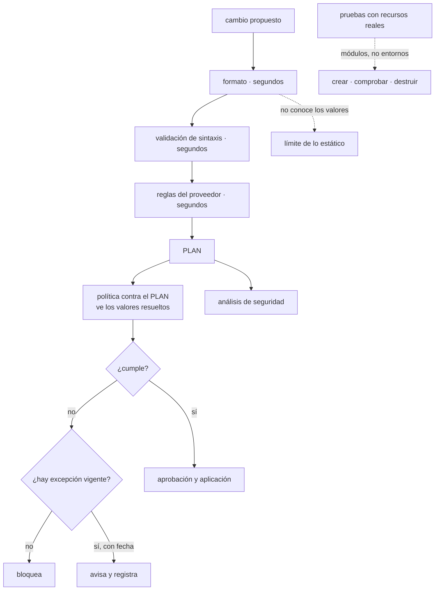

# 091 — Validación, lint, pruebas y policy as code

> [← 090 · Plan, apply, drift, import y refactor con moved](../../part-07-infrastructure-as-code-configuration/090-plan-apply-drift-import-y-refactor-con-moved/README.md) · [Índice de la parte](../README.md) · [092 · Secretos y datos sensibles en IaC →](../../part-07-infrastructure-as-code-configuration/092-secretos-y-datos-sensibles-en-iac/README.md)

**Parte:** 07 — Infraestructura como código y configuración<br>
**Nivel:** intermedio-avanzado · **Horas estimadas:** 4<br>
**Laboratorio:** `testing` · **Estado:** `EXECUTABLE_CORE`

## 🎯 Propósito

Comprobar la infraestructura antes de aplicarla, con una distinción que decide la eficacia de todo lo demás: **una comprobación sobre el código no conoce los valores; una sobre el plan sí**. Por eso una regla escrita contra el plan detecta lo que ninguna revisión del código puede ver —lo que un módulo produce de verdad con las variables de ese entorno— y por eso es donde deben vivir las reglas de la organización. La clase ordena las comprobaciones por coste y por lo que cada una atrapa, y aplica por cuarta vez la secuencia de adopción que este programa ya ha usado en tres partes.

## 📚 Resultados de aprendizaje

Al finalizar podrás:

1. **Ordenar** las comprobaciones por coste y por el tipo de error que detecta cada una.
2. **Escribir** reglas contra el plan y justificar por qué no valen sobre el código.
3. **Adoptar** una política sin bloquear al equipo, con la secuencia de tres fases.
4. **Gestionar** excepciones con motivo, responsable y caducidad.
5. **Decidir** qué merece una prueba que crea y destruye, y qué no.

## 🧩 Conceptos centrales

| Concepto | Comprensión verificable |
|---|---|
| `comprobación sobre el código` | Analiza los ficheros. Es rápida y **no conoce los valores**: no sabe qué producirá un módulo con las variables de producción. |
| `comprobación sobre el plan` | Analiza el cambio calculado, con todos los valores resueltos. Ve lo que de verdad se va a crear, incluido lo que sale de módulos ajenos. |
| `política como código` | Reglas de la organización escritas como programa y evaluadas automáticamente. Sustituyen a la revisión humana de lo que se puede comprobar solo. |
| `secuencia de adopción` | Avisar, después bloquear lo nuevo, después bloquear siempre. Cuarta aparición en el programa de la misma secuencia: inventariar, corregir, imponer. |
| `excepción con caducidad` | Permiso temporal para incumplir, con motivo, responsable y fecha. Sin fecha, la lista de excepciones crece para siempre. |
| `prueba con recursos reales` | Ejecución que crea, comprueba y destruye. Es lo único que demuestra que una combinación funciona, y cuesta minutos y dinero. |

## 🧠 Modelo mental

IaC trata la infraestructura como producto versionado: el plan explica intención, el estado conecta intención y realidad, y la revisión reduce cambios accidentales.

Aplicado a esta clase, separa siempre cuatro planos: **intención** (qué necesita el usuario),
**configuración** (qué declaramos), **estado observado** (qué existe de verdad) y
**evidencia** (cómo sabemos que cumple). Confundirlos produce diseños que se ven correctos
en un diagrama pero fallan al operar.

## 🗺️ Flujo de razonamiento



## 📖 Desarrollo

### 1. Cinco comprobaciones, ordenadas por coste

Cada comprobación atrapa un tipo de error y cuesta un tiempo distinto. Ponerlas en orden importa porque **la primera que falla ahorra las siguientes**:

```text
1. formato            segundos    estilo; evita diferencias inútiles en la revisión
2. validación         segundos    sintaxis, tipos y referencias internas
3. reglas del proveedor  segundos  valores inválidos, argumentos obsoletos
4. PLAN + política    minutos     lo que de verdad se va a crear
5. pruebas reales     minutos+coste  que la combinación funciona
```

Las tres primeras se ejecutan sin credenciales y sin tocar nada:

```bash
$ terraform fmt -check -recursive
$ terraform validate
$ tflint --recursive
```

Y su límite es el que define esta clase: **no conocen los valores**. La validación comprueba que una variable existe y no qué contendrá; las reglas del proveedor detectan un tipo de instancia inexistente y no que el tamaño elegido para producción sea el de desarrollo.

```hcl
resource "aws_db_instance" "pedidos" {
  instance_class      = var.tamano_bd        # ¿cuál es? el código no lo sabe
  publicly_accessible = var.acceso_publico   # ¿true? tampoco
  storage_encrypted   = var.cifrado
}
```

Un análisis estático de ese fragmento no puede decir nada útil. Y con módulos es peor: lo que un módulo crea depende de sus variables, y quien lo consume no ve sus recursos.

De ahí la afirmación central:

> **Las reglas de la organización se escriben contra el plan, no contra el código.** El plan tiene todos los valores resueltos, incluidos los que salen de módulos que nadie ha leído.

Y una nota sobre la tercera comprobación, que rinde más de lo que parece: detecta argumentos obsoletos antes de que una actualización del proveedor los retire, que es el mismo trabajo preventivo que la métrica de APIs obsoletas de la clase 083.

Y sobre el coste total, un criterio operativo que decide si todo esto se usa:

```text
una comprobación de menos de 2 minutos se ejecuta siempre
una de 10 minutos se ejecuta cuando alguien se acuerda
una de 30 minutos se desactiva
```

Es la misma lección que la clase 067 dejó con el escáner de vulnerabilidades desactivado durante ocho meses. La consecuencia práctica: lo rápido en cada cambio, lo caro en un horario o antes de fusionar.

### 2. Reglas contra el plan

El plan en formato estructurado contiene los cambios con todos sus valores, y sobre eso se pueden escribir las decisiones que este programa ha ido tomando:

```bash
$ terraform show -json tfplan > plan.json
$ conftest test --policy politicas/ plan.json
```

Y las reglas son legibles:

```rego
package terraform.cloudshop
import rego.v1

recursos_creados[r] if {
  r := input.resource_changes[_]
  r.change.actions[_] in {"create", "update"}
}

# clase 041: nada de almacenamiento sin cifrar
deny contains msg if {
  r := recursos_creados[_]
  r.type == "aws_s3_bucket_server_side_encryption_configuration"
  not r.change.after.rule
  msg := sprintf("%s: falta configuración de cifrado", [r.address])
}

# clase 054: ninguna base de datos con acceso público
deny contains msg if {
  r := recursos_creados[_]
  r.type == "aws_db_instance"
  r.change.after.publicly_accessible == true
  msg := sprintf("%s: acceso público prohibido (clase 054)", [r.address])
}

# clases 025, 049: atribución de costo obligatoria
deny contains msg if {
  r := recursos_creados[_]
  etiquetables[r.type]
  not r.change.after.tags.equipo
  msg := sprintf("%s: falta la etiqueta 'equipo'", [r.address])
}

# clase 090: ningún borrado sin aprobación explícita
warn contains msg if {
  r := input.resource_changes[_]
  "delete" in r.change.actions
  msg := sprintf("%s se DESTRUYE: requiere aprobación", [r.address])
}
```

Y tres propiedades que hacen que esto funcione donde la revisión humana no llega:

```text
ve el resultado de los módulos       aunque el consumidor no los haya leído
ve los valores del entorno concreto  la misma plantilla puede cumplir en
                                     desarrollo e incumplir en producción
no se cansa                          la comprobación 400 es igual de rigurosa
                                     que la primera
```

La segunda es la que más veces salva: una regla contra el código aprueba una plantilla que en producción recibirá un valor prohibido.

Y sobre el mensaje de error, la misma exigencia que la clase 088 pedía a las validaciones: debe decir **qué se esperaba y por qué**. Un mensaje que cita la clase o la decisión convierte el bloqueo en algo que se entiende sin preguntar.

Y una regla que conviene tener y casi nadie escribe, porque codifica una ley del programa:

```rego
# ley 14: lo que se decide al crear no se cambia después
warn contains msg if {
  r := input.resource_changes[_]
  r.change.actions == ["delete", "create"]
  r.type in recursos_con_datos
  msg := sprintf("%s se RECREA y contiene datos: ¿es intencionado?", [r.address])
}
```

### 3. Adoptar sin bloquear al equipo

Este programa ya ha aplicado esta secuencia tres veces —Azure Policy en la clase 046, políticas de organización en la 049 y perfiles de seguridad de pods en la 080— y aquí es la cuarta:

```text
fase 1 · AVISAR        la política se evalúa y solo informa
                       objetivo: medir el tamaño del problema
fase 2 · BLOQUEAR LO NUEVO   solo falla si el recurso se crea o si el
                       incumplimiento es nuevo
                       objetivo: dejar de empeorar
fase 3 · BLOQUEAR SIEMPRE  cuando el inventario ya cumple
```

Empezar por la fase 3 produce lo que la clase 067 midió: la comprobación se desactiva y figura como implantada.

La fase 1 tiene un entregable concreto y es lo que decide el plan de trabajo:

```bash
$ for e in dev pre pro; do
    terraform plan -var-file=entornos/$e.tfvars -out=/tmp/$e.plan >/dev/null
    terraform show -json /tmp/$e.plan > /tmp/$e.json
    conftest test --policy politicas/ --output json /tmp/$e.json \
      | jq -r --arg e "$e" '.[].failures[]? | "\($e) \(.msg)"'
  done | sort | uniq -c | sort -rn
```

Eso da la lista de incumplimientos por entorno y por regla, ordenada por frecuencia. Y esa lista es la que se reparte y se corrige, no una tarea genérica de «cumplir la política».

La fase 2 exige distinguir lo nuevo de lo existente, y hay dos formas:

```text
por acción     bloquear solo si el recurso se CREA; avisar si se modifica
por referencia  comparar con el resultado de la rama principal
               → bloquear si el número de incumplimientos SUBE
```

La segunda es más justa y más fácil de defender: nadie puede empeorar el estado, y quien toque un recurso existente no está obligado a arreglar todo lo que había.

Y las **excepciones** con la disciplina de las clases 046, 049 y 067:

```yaml
# excepciones.yaml
- regla: "bd-sin-acceso-publico"
  recurso: "aws_db_instance.legado"
  motivo: "Sistema heredado; su cliente no puede usar el proxy. Migración prevista."
  responsable: "equipo-pedidos"
  caduca: "2026-11-30"
```

Y la comprobación que hace que la lista no crezca para siempre:

```bash
$ yq -r '.[] | select(.caduca < now | strftime("%Y-%m-%d")) | .regla + " " + .recurso' \
    excepciones.yaml | tee caducadas.txt
$ [ ! -s caducadas.txt ] || { echo "excepciones caducadas"; exit 1; }
```

Una excepción caducada rompe la canalización, lo que fuerza la conversación en vez de dejar que se olvide. Es más agresivo de lo que parece y es lo único que funciona: sin ello, la lista de excepciones se convierte en la política real.

### 4. Qué merece una prueba que crea recursos

Las pruebas con recursos reales cuestan minutos y dinero, así que hay que ser selectivo. El criterio:

```text
SÍ merece prueba real
  los MÓDULOS de la organización: sus combinaciones declaradas (clase 088)
  las decisiones que la política no puede comprobar
    (que el servicio arranca, que la conmutación funciona, que la copia restaura)
  los caminos que solo existen en producción, en un entorno efímero (clase 089)

NO merece prueba real
  que el proveedor crea lo que dice que crea
  cada combinación de un módulo con veinte opciones
    → eso indica un problema de diseño, no de pruebas (clase 088)
  los entornos completos en cada cambio: demasiado lento
```

La segunda línea del segundo bloque es importante: **probar es caro, así que un módulo que necesita cientos de pruebas está mal diseñado**. La corrección es dividir por decisión, como la clase 088 estableció.

Y una estructura de pruebas que cubre lo que importa:

```hcl
# pruebas/valores.tftest.hcl — sin crear nada: valida entradas
run "rechaza_replicas_insuficientes" {
  command   = plan
  variables { escalado = { minimo = 1 } }
  expect_failures = [var.escalado]
}

# pruebas/crea.tftest.hcl — crea, comprueba y destruye
run "crea_conforme" {
  command = apply
  assert {
    condition     = aws_db_instance.este.storage_encrypted
    error_message = "la base debe estar cifrada"
  }
  assert {
    condition     = !aws_db_instance.este.publicly_accessible
    error_message = "la base no debe ser accesible públicamente"
  }
}
```

Y las condiciones que hacen sostenible probar de verdad, que la clase 088 enumeró y conviene repetir porque es donde se descuidan:

```text
cuenta o proyecto propio, con presupuesto y alerta
nombres únicos por ejecución
destrucción garantizada incluso si la prueba falla
limpieza periódica de lo que quedó por el camino
```

Y una comprobación que no es una prueba y detecta más que muchas: **el coste estimado del cambio**.

```bash
$ infracost breakdown --path tfplan --format json | jq -r '.totalMonthlyCost'
```

Publicar en la revisión cuánto va a costar el cambio convierte una decisión invisible en una explícita. Y con un umbral, en una decisión que necesita aprobación:

```text
incremento < 50 USD/mes    informativo
incremento > 50 USD/mes    requiere aprobación de quien tiene el presupuesto
```

Es la aplicación directa del criterio de las clases 025 y 049 —lo que no tiene número se opina— al momento en que todavía se puede decidir.

### 5. La canalización completa, y qué falla dónde

Reuniendo todo, la canalización de un cambio de infraestructura tiene esta forma:

```text
en el pull request
  1. formato y validación                        segundos
  2. reglas del proveedor                        segundos
  3. plan con la identidad de LECTURA (clase 059)
  4. política contra el plan                     bloquea
  5. análisis de seguridad sobre el plan         bloquea lo crítico
  6. estimación de coste                         informa, y bloquea sobre umbral
  7. lista de recursos que se destruyen          exige aprobación
  8. publicar el plan legible en el pull request

al fusionar
  9. aplicar el plan GUARDADO, con la identidad de escritura
 10. verificar: una segunda planificación debe dar cero cambios

programado
 11. detección de desviación (clase 090)
 12. excepciones caducadas
 13. pruebas de los módulos, con creación real
```

El paso 10 es la comprobación de idempotencia de la clase 085 en su sitio definitivo: **si tras aplicar sigue habiendo cambios, algo no está declarado**.

Y el reparto de identidades del paso 3 y el 9 es el de la clase 059: quien planifica en una rama no puede aplicar. Sin eso, ejecutar la canalización desde una rama arbitraria es dar permiso de escritura a cualquiera que abra un cambio.

Y una lista de qué error atrapa cada paso, que es lo que justifica tenerlos todos:

```text
formato            diferencias inútiles en la revisión
validación         una variable que no existe, un tipo incompatible
reglas de proveedor  un argumento retirado, un valor imposible
política           un bucket público, una base sin cifrar, una etiqueta ausente
seguridad          configuraciones inseguras que la política propia no cubre
coste              una instancia diez veces más cara por un cero de más
borrados           una recreación de algo con datos
plan publicado     todo lo demás, que sigue necesitando una persona
```

La última línea merece decirse: **ninguna de estas comprobaciones sustituye a leer el plan**. Lo que hacen es reducir lo que hay que leer a lo que de verdad requiere criterio.

Y la lista de comprobación de la clase:

```text
☐ formato, validación y reglas del proveedor en cada cambio
☐ reglas de la organización escritas contra el PLAN, no contra el código
☐ mensajes que dicen qué se esperaba y citan la decisión
☐ adopción por fases: avisar, bloquear lo nuevo, bloquear siempre
☐ excepciones con motivo, responsable y caducidad, y la caducidad rompe la
   canalización
☐ pruebas con recursos reales para los módulos, no para los entornos
☐ estimación de coste publicada, con umbral de aprobación
☐ borrados extraídos y aprobados explícitamente
☐ identidad de lectura para planificar, de escritura solo al fusionar
☐ segunda planificación tras aplicar, con cero cambios
```

## 🔬 Ejemplo trabajado

**CloudShop tiene un analizador de seguridad instalado y desactivado. La reactivación se hace con la secuencia de tres fases y produce cuatro hallazgos, uno de ellos imposible de ver desde el código.**

**El punto de partida.**

```bash
$ git log --oneline -S 'continue-on-error' .github/workflows/infra.yml | tail -1
8c1f4a2  "desbloquear la canalizacion"
```

Catorce meses atrás, con 812 hallazgos. Desde entonces figuraba como implantado — la misma historia que la clase 067 encontró con el escáner de imágenes.

**Fase 1 — medir.**

```text
hallazgos totales                              812
  informativos y de estilo                     504
  medios sin corrección clara                  187
  altos y críticos                              97
  de ellos, en recursos que ya no existen       73
  reales y accionables                          24
```

Veinticuatro. De ochocientos doce. Y ese es el motivo por el que se desactivó: **la señal estaba enterrada**.

```text                                        antes            después
criterio de bloqueo                    todo lo que sea    alto y crítico,
                                       un hallazgo        sobre recursos del plan
hallazgos que bloquean                    812                 24
tiempo de la comprobación               6 min 40 s          50 s
```

La reducción de tiempo viene de analizar el plan en vez de todos los ficheros del repositorio: solo se evalúa lo que va a cambiar.

**Fase 2 — bloquear lo nuevo.** Durante seis semanas, la canalización comparaba con la rama principal y fallaba solo si el número subía.

```text
semana 1-6
  intentos bloqueados por empeorar                7
  hallazgos corregidos por los equipos           24 → 6
  quejas por bloqueo injusto                      0
```

Cero quejas es el dato: nadie tuvo que arreglar lo que había, solo no empeorarlo.

**Fase 3 — bloquear siempre**, con las seis excepciones restantes documentadas.

**Hallazgo 1 — lo que el código no podía ver.**

Al añadir política contra el plan, la primera ejecución encontró algo que catorce meses de análisis del código no habían visto:

```text
module.datos.aws_db_instance.informes: acceso público prohibido (clase 054)
```

El módulo tenía una variable `acceso_publico` con valor por defecto `false`, y el fichero de valores de un entorno la ponía a `true` desde hacía dos años.

```text
en el código del módulo    publicly_accessible = var.acceso_publico
                           → un análisis estático no puede saber su valor
en el plan                 publicly_accessible = true
                           → visible, y bloqueado
```

Es la demostración exacta de la tesis de la clase. La base de datos era de un entorno de integración con datos anonimizados, así que no fue una brecha; y **había estado accesible desde internet durante dos años sin que ninguna comprobación lo viera**.

**Hallazgo 2 — la estimación de coste, y el cero de más.**

```text
incremento mensual estimado del cambio:  +4.180 USD
```

Un cambio rutinario de tamaño de instancia con un cero de más: `db.r6g.16xlarge` en vez de `db.r6g.xlarge`. El plan lo mostraba, nadie lo habría leído con esa atención, y la estimación lo puso en el título de la revisión.

```text                                        antes            después
estimación de coste en la revisión         no había         publicada
umbral de aprobación                       no había      +50 USD/mes
cambios detenidos por coste el primer trimestre  —              3
el mayor de ellos                              —          4.180 USD/mes
```

**Hallazgo 3 — las excepciones que se convirtieron en la política.**

Al revisar la lista heredada:

```text
excepciones registradas                        31
  con motivo escrito                            8
  con responsable                               3
  con fecha de caducidad                        0
  cuyo recurso ya no existe                    14
```

Ninguna caducaba. Diecisiete se retiraron por obsoletas, ocho se corrigieron y seis quedaron con motivo, responsable y fecha.

```text                                        antes            después
excepciones                                    31                6
con los tres campos obligatorios                0                6
la caducidad rompe la canalización             no               sí
```

**Hallazgo 4 — las pruebas de módulos encontraron una regresión.**

Al añadir las pruebas de la clase 088 a la canalización de los módulos:

```text
primera ejecución tras un cambio rutinario
  falla: "la base debe estar cifrada"
```

Un cambio que reorganizaba variables había cambiado el valor por defecto del cifrado de `true` a `false`, sin que nadie lo notara: la interfaz no cambiaba y el código compilaba.

```text                                        antes            después
pruebas de módulos en la canalización      no había        6 módulos
regresiones detectadas el primer trimestre     —              2
de ellas, que habrían llegado a producción     —              2
duración de la suite                           —          14 min, programada
```

Las dos regresiones son el argumento para el coste: catorce minutos y unos dólares al mes evitaron dos cambios silenciosos en valores de seguridad por defecto.

**Resumen:**

```text                                          antes         después
analizador de seguridad                    desactivado       activo
hallazgos que bloquean                        812             6
reglas de organización contra el plan          0             19
recursos con acceso público                    1              0
estimación de coste en la revisión            no             sí
excepciones con caducidad                    0 de 31        6 de 6
pruebas de módulos                             0              6
tiempo total de comprobación en un cambio   6 min 40 s     1 min 50 s
```

**La lección que esta clase traslada al resto de la parte 07**: el analizador llevaba catorce meses desactivado por la misma razón que el escáner de la clase 067 y que las alertas de la clase 057 — **una señal con ochocientos elementos no es una señal**. Y el hallazgo que justifica la clase entera es el primero: una base de datos accesible desde internet durante dos años, invisible para cualquier análisis del código y visible en el primer plan que se evaluó. **Las reglas de la organización van contra el plan.**

## 🧪 Laboratorio guiado

Ejecuta desde la raíz:

```bash
python classes/part-07-infrastructure-as-code-configuration/091-validacion-lint-pruebas-y-policy-as-code/lab.py
```

El laboratorio selecciona el motor de práctica **`testing`** y produce
`lab_result.json`. El escenario, sus comprobaciones y el artefacto esperado corresponden a
esta clase; no requiere credenciales y deja explícito qué debe revalidarse en un sandbox real.

1. Lee `exercise.steps` y formula una predicción antes de ejecutar.
2. Ejecuta la práctica y verifica todos los elementos de `checks`.
3. Provoca el caso de `negative_test` y explica la señal observada.
4. Materializa `pipeline-iac` en `evidence/` usando la plantilla indicada.
5. Para proveedor real, sigue `sandbox.requires`, registra costo y ejecuta `destroy`.

### Evidencia esperada

El artefacto principal es pruebas automatizadas con fallos diagnósticos. Además, la entrega debe incluir el comando ejecutado,
la salida estructurada y una conclusión que no exceda lo observado.

## 🏆 Reto verificable

Construye **`pipeline-iac`** para el caso CloudShop. Incluye una alternativa descartada,
un supuesto que pueda falsarse, una prueba de fallo y una decisión de rollback.

## ✅ Criterio de aceptación

- [ ] `lab.py` termina con código 0 y genera JSON válido.
- [ ] La entrega conecta al menos tres requisitos con mecanismos verificables.
- [ ] Existe una prueba positiva y una prueba negativa con evidencia.
- [ ] Seguridad, costo y operación aparecen como decisiones, no como anexos.
- [ ] Se declara una limitación y una condición que obligaría a revisar el diseño.
- [ ] Otra persona puede repetir el recorrido sin conocimiento tácito.

## ⚠️ Errores frecuentes

| Síntoma | Causa probable | Corrección |
|---|---|---|
| El analizador de seguridad acaba desactivado | Bloquea por cientos de hallazgos, la mayoría informativos o de recursos que ya no existen | Evalúa sobre el plan, bloquea solo lo alto y crítico, y adopta por fases: avisar, no empeorar, bloquear siempre. |
| Una comprobación del código aprueba algo que en producción incumple | El análisis estático no conoce los valores que las variables tendrán | Escribe las reglas de la organización contra el plan, donde todos los valores están resueltos. |
| La lista de excepciones crece hasta convertirse en la política real | Ninguna tiene fecha de caducidad | Exige motivo, responsable y fecha, y haz que una excepción caducada rompa la canalización. |
| Un cambio multiplica el coste sin que nadie lo note | El plan lo muestra y nadie lo lee con esa atención | Publica la estimación de coste en la revisión y pon un umbral que exija aprobación. |
| Un cambio de un módulo altera un valor de seguridad por defecto sin romper nada | La interfaz no cambia, así que ninguna comprobación estática lo ve | Pruebas con recursos reales que verifiquen las decisiones del módulo, no su sintaxis. |
| Las comprobaciones tardan tanto que se saltan | Todo se ejecuta en cada cambio, incluidas las pruebas caras | Lo rápido en cada cambio, lo caro programado o antes de fusionar; por encima de dos minutos, la gente busca cómo evitarlo. |

## 🛡️ Seguridad, ética y costo

Trabaja con cuentas propias o sandboxes autorizados. No publiques secretos, identificadores
reales ni datos personales. Antes de crear recursos pagos define presupuesto, etiquetas y
comando de destrucción; después verifica que no queden recursos huérfanos. Los ejemplos
locales enseñan contratos, pero no certifican cumplimiento ni disponibilidad de producción.

## ❓ Preguntas de comprobación

1. ¿Qué límite tienen las comprobaciones sobre el código, y por qué las reglas de la organización van contra el plan?
2. Describe la secuencia de tres fases de adopción y qué produce empezar por la última.
3. ¿Qué tres campos debe tener una excepción y qué mecanismo impide que la lista crezca para siempre?
4. ¿Qué merece una prueba que crea recursos reales y qué indica que un módulo necesita demasiadas?
5. ¿Qué error atrapa cada paso de la canalización, y por qué ninguno sustituye a leer el plan?

## 🔗 Referencias

- Open Policy Agent (2025). *Terraform plan testing with Conftest* — reglas contra el plan en formato estructurado. <https://www.openpolicyagent.org/docs/latest/terraform/>
- HashiCorp (2025). *Terraform JSON output format* — estructura del plan para automatización. <https://developer.hashicorp.com/terraform/internals/json-format>
- TFLint (2025). *Rules and provider plugins* — errores de proveedor y argumentos obsoletos. <https://github.com/terraform-linters/tflint>
- HashiCorp (2025). *Terraform test framework* — pruebas con creación real y fallos esperados. <https://developer.hashicorp.com/terraform/language/tests>
- Infracost (2025). *Cost estimation in pull requests* — estimación sobre el plan y umbrales. <https://www.infracost.io/docs/>
- Documentación oficial vigente del servicio implementado; registra URL y fecha de consulta.

---

> [Evaluación](assessment.md) · [Contrato de clase](lesson.yaml) · [Índice de la parte](../README.md)

| Anterior | Índice | Siguiente |
|---|---|---|
| [← 090 · Plan, apply, drift, import y refactor con moved](../../part-07-infrastructure-as-code-configuration/090-plan-apply-drift-import-y-refactor-con-moved/README.md) | [Parte 07](../README.md) · [Programa](../../README.md) | [092 · Secretos y datos sensibles en IaC →](../../part-07-infrastructure-as-code-configuration/092-secretos-y-datos-sensibles-en-iac/README.md) |
